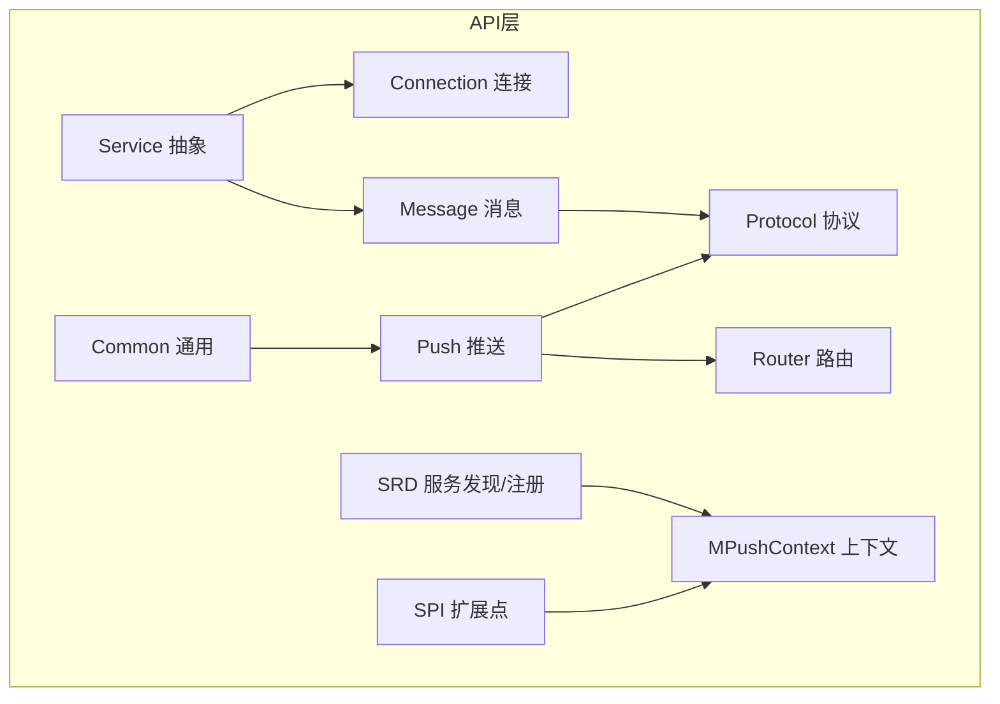
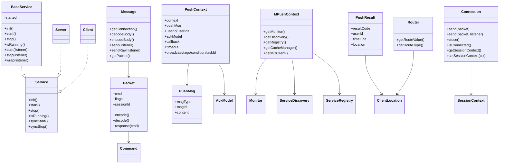
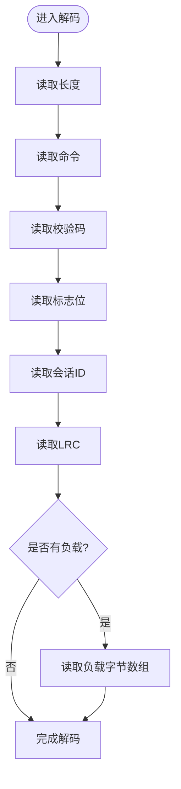
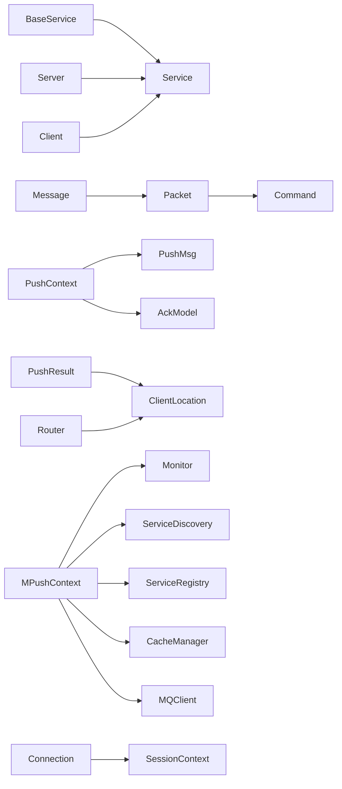

# API参考文档

<cite>
**本文引用的文件**
- [Server.java](file://mpush-api/src/main/java/com/mpush/api/service/Server.java)
- [Client.java](file://mpush-api/src/main/java/com/mpush/api/service/Client.java)
- [BaseService.java](file://mpush-api/src/main/java/com/mpush/api/service/BaseService.java)
- [Service.java](file://mpush-api/src/main/java/com/mpush/api/service/Service.java)
- [ServiceException.java](file://mpush-api/src/main/java/com/mpush/api/service/ServiceException.java)
- [Connection.java](file://mpush-api/src/main/java/com/mpush/api/connection/Connection.java)
- [SessionContext.java](file://mpush-api/src/main/java/com/mpush/api/connection/SessionContext.java)
- [Message.java](file://mpush-api/src/main/java/com/mpush/api/message/Message.java)
- [Packet.java](file://mpush-api/src/main/java/com/mpush/api/protocol/Packet.java)
- [Command.java](file://mpush-api/src/main/java/com/mpush/api/protocol/Command.java)
- [UDPPacket.java](file://mpush-api/src/main/java/com/mpush/api/protocol/UDPPacket.java)
- [JsonPacket.java](file://mpush-api/src/main/java/com/mpush/api/protocol/JsonPacket.java)
- [PacketReceiver.java](file://mpush-api/src/main/java/com/mpush/api/message/PacketReceiver.java)
- [MessageHandler.java](file://mpush-api/src/main/java/com/mpush/api/message/MessageHandler.java)
- [Router.java](file://mpush-api/src/main/java/com/mpush/api/router/Router.java)
- [RouterManager.java](file://mpush-api/src/main/java/com/mpush/api/router/RouterManager.java)
- [ClientClassifier.java](file://mpush-api/src/main/java/com/mpush/api/router/ClientClassifier.java)
- [ClientLocation.java](file://mpush-api/src/main/java/com/mpush/api/router/ClientLocation.java)
- [PushMsg.java](file://mpush-api/src/main/java/com/mpush/api/push/PushMsg.java)
- [MsgType.java](file://mpush-api/src/main/java/com/mpush/api/push/MsgType.java)
- [AckModel.java](file://mpush-api/src/main/java/com/mpush/api/push/AckModel.java)
- [PushContext.java](file://mpush-api/src/main/java/com/mpush/api/push/PushContext.java)
- [PushCallback.java](file://mpush-api/src/main/java/com/mpush/api/push/PushCallback.java)
- [PushResult.java](file://mpush-api/src/main/java/com/mpush/api/push/PushResult.java)
- [PushSender.java](file://mpush-api/src/main/java/com/mpush/api/push/PushSender.java)
- [BroadcastController.java](file://mpush-api/src/main/java/com/mpush/api/push/BroadcastController.java)
- [Monitor.java](file://mpush-api/src/main/java/com/mpush/api/common/Monitor.java)
- [ServerEventListener.java](file://mpush-api/src/main/java/com/mpush/api/common/ServerEventListener.java)
- [Constants.java](file://mpush-api/src/main/java/com/mpush/api/Constants.java)
- [MPushContext.java](file://mpush-api/src/main/java/com/mpush/api/MPushContext.java)
- [Plugin.java](file://mpush-api/src/main/java/com/mpush/api/spi/Plugin.java)
- [Spi.java](file://mpush-api/src/main/java/com/mpush/api/spi/Spi.java)
- [ServiceDiscovery.java](file://mpush-api/src/main/java/com/mpush/api/srd/ServiceDiscovery.java)
- [ServiceRegistry.java](file://mpush-api/src/main/java/com/mpush/api/srd/ServiceRegistry.java)
- [ServiceNode.java](file://mpush-api/src/main/java/com/mpush/api/srd/ServiceNode.java)
- [ServiceNames.java](file://mpush-api/src/main/java/com/mpush/api/srd/ServiceNames.java)
- [CommonServiceNode.java](file://mpush-api/src/main/java/com/mpush/api/srd/CommonServiceNode.java)
- [ServiceEvent.java](file://mpush-api/src/main/java/com/mpush/api/srd/ServiceEvent.java)
- [ServiceListener.java](file://mpush-api/src/main/java/com/mpush/api/srd/ServiceListener.java)
- [CacheManager.java](file://mpush-api/src/main/java/com/mpush/api/spi/common/CacheManager.java)
- [MQClient.java](file://mpush-api/src/main/java/com/mpush/api/spi/common/MQClient.java)
- [Json.java](file://mpush-api/src/main/java/com/mpush/api/spi/common/Json.java)
- [ExecutorFactory.java](file://mpush-api/src/main/java/com/mpush/api/spi/common/ExecutorFactory.java)
- [CacheManagerFactory.java](file://mpush-api/src/main/java/com/mpush/api/spi/common/CacheManagerFactory.java)
- [MQClientFactory.java](file://mpush-api/src/main/java/com/mpush/api/spi/common/MQClientFactory.java)
- [ServiceDiscoveryFactory.java](file://mpush-api/src/main/java/com/mpush/api/spi/common/ServiceDiscoveryFactory.java)
- [ServiceRegistryFactory.java](file://mpush-api/src/main/java/com/mpush/api/spi/common/ServiceRegistryFactory.java)
- [JsonFactory.java](file://mpush-api/src/main/java/com/mpush/api/spi/common/JsonFactory.java)
- [PusherFactory.java](file://mpush-api/src/main/java/com/mpush/api/spi/client/PusherFactory.java)
- [BindValidator.java](file://mpush-api/src/main/java/com/mpush/api/spi/handler/BindValidator.java)
- [BindValidatorFactory.java](file://mpush-api/src/main/java/com/mpush/api/spi/handler/BindValidatorFactory.java)
- [PushHandlerFactory.java](file://mpush-api/src/main/java/com/mpush/api/spi/handler/PushHandlerFactory.java)
- [DnsMapping.java](file://mpush-api/src/main/java/com/mpush/api/spi/net/DnsMapping.java)
- [DnsMappingManager.java](file://mpush-api/src/main/java/com/mpush/api/spi/net/DnsMappingManager.java)
- [IPushMessage.java](file://mpush-api/src/main/java/com/mpush/api/spi/push/IPushMessage.java)
- [MessagePusher.java](file://mpush-api/src/main/java/com/mpush/api/spi/push/MessagePusher.java)
- [MessagePusherFactory.java](file://mpush-api/src/main/java/com/mpush/api/spi/push/MessagePusherFactory.java)
- [PushListener.java](file://mpush-api/src/main/java/com/mpush/api/spi/push/PushListener.java)
- [PushListenerFactory.java](file://mpush-api/src/main/java/com/mpush/api/spi/push/PushListenerFactory.java)
- [ClientClassifierFactory.java](file://mpush-api/src/main/java/com/mpush/api/spi/router/ClientClassifierFactory.java)
- [Factory.java](file://mpush-api/src/main/java/com/mpush/api/spi/Factory.java)
- [SpiLoader.java](file://mpush-api/src/main/java/com/mpush/api/spi/SpiLoader.java)
</cite>

## 目录
1. [简介](#简介)
2. [项目结构](#项目结构)
3. [核心组件](#核心组件)
4. [架构总览](#架构总览)
5. [详细组件分析](#详细组件分析)
6. [依赖分析](#依赖分析)
7. [性能考量](#性能考量)
8. [故障排查指南](#故障排查指南)
9. [结论](#结论)
10. [附录](#附录)

## 简介
本参考文档面向MPush API使用者，系统性梳理公共接口与协议规范，覆盖服务器端与客户端API、配置与上下文API、监控API以及消息推送API，并对Packet协议、Command命令类型、消息格式与推送流程进行深入解析。文档同时提供接口规范、使用示例路径、版本兼容性与迁移建议、性能特征与使用限制、常见错误与最佳实践，确保与实际代码实现保持一致。

## 项目结构
MPush API模块位于 mpush-api 子工程，采用按功能域分层的包组织方式：
- service：服务抽象与生命周期管理（Server、Client、Service、BaseService）
- connection：连接抽象与会话上下文（Connection、SessionContext）
- message：消息接口与接收器（Message、PacketReceiver、MessageHandler）
- protocol：协议定义（Packet、Command、UDPPacket、JsonPacket）
- push：推送模型与上下文（PushMsg、MsgType、AckModel、PushContext、PushResult、PushSender、BroadcastController）
- router：路由抽象与分类（Router、RouterManager、ClientClassifier、ClientLocation）
- common：通用工具与监控（Monitor、ServerEventListener、Constants）
- srd：服务发现与注册（ServiceDiscovery、ServiceRegistry、ServiceNode、ServiceNames、ServiceEvent、ServiceListener、CommonServiceNode）
- spi：可插拔扩展点（Factory、Plugin、Spi、各子SPI接口与工厂）
- api：全局上下文（MPushContext）

**图表来源**
- [Service.java](file://mpush-api/src/main/java/com/mpush/api/service/Service.java#L1-L100)
- [Connection.java](file://mpush-api/src/main/java/com/mpush/api/connection/Connection.java#L1-L64)
- [Message.java](file://mpush-api/src/main/java/com/mpush/api/message/Message.java#L1-L55)
- [Packet.java](file://mpush-api/src/main/java/com/mpush/api/protocol/Packet.java#L1-L187)
- [PushContext.java](file://mpush-api/src/main/java/com/mpush/api/push/PushContext.java#L1-L206)
- [Router.java](file://mpush-api/src/main/java/com/mpush/api/router/Router.java#L1-L38)
- [Monitor.java](file://mpush-api/src/main/java/com/mpush/api/common/Monitor.java#L1-L35)
- [ServiceDiscovery.java](file://mpush-api/src/main/java/com/mpush/api/srd/ServiceDiscovery.java#L1-L200)
- [ServiceRegistry.java](file://mpush-api/src/main/java/com/mpush/api/srd/ServiceRegistry.java#L1-L200)
- [MPushContext.java](file://mpush-api/src/main/java/com/mpush/api/MPushContext.java#L1-L46)
- [Plugin.java](file://mpush-api/src/main/java/com/mpush/api/spi/Plugin.java#L1-L39)

**章节来源**
- [Service.java](file://mpush-api/src/main/java/com/mpush/api/service/Service.java#L1-L100)
- [Connection.java](file://mpush-api/src/main/java/com/mpush/api/connection/Connection.java#L1-L64)
- [Message.java](file://mpush-api/src/main/java/com/mpush/api/message/Message.java#L1-L55)
- [Packet.java](file://mpush-api/src/main/java/com/mpush/api/protocol/Packet.java#L1-L187)
- [PushContext.java](file://mpush-api/src/main/java/com/mpush/api/push/PushContext.java#L1-L206)
- [Router.java](file://mpush-api/src/main/java/com/mpush/api/router/Router.java#L1-L38)
- [Monitor.java](file://mpush-api/src/main/java/com/mpush/api/common/Monitor.java#L1-L35)
- [ServiceDiscovery.java](file://mpush-api/src/main/java/com/mpush/api/srd/ServiceDiscovery.java#L1-L200)
- [ServiceRegistry.java](file://mpush-api/src/main/java/com/mpush/api/srd/ServiceRegistry.java#L1-L200)
- [MPushContext.java](file://mpush-api/src/main/java/com/mpush/api/MPushContext.java#L1-L46)
- [Plugin.java](file://mpush-api/src/main/java/com/mpush/api/spi/Plugin.java#L1-L39)

## 核心组件
本节聚焦公共API的核心接口与抽象类，帮助快速理解API边界与职责。

- 服务抽象与生命周期
  - Service：统一的服务生命周期接口（初始化、启动、停止、状态查询）
  - BaseService：提供原子化的启动/停止CAS控制、异步监听器包装、默认超时与异常封装
  - Server/Client：服务类型化接口，继承Service
  - ServiceException：服务异常封装

- 连接与会话
  - Connection：抽象网络连接，提供发送、关闭、状态查询、会话上下文管理
  - SessionContext：会话上下文容器（由具体实现填充）

- 消息与协议
  - Message：消息抽象，定义解码/编码体、发送（含原始发送）、获取底层Packet
  - Packet：二进制帧协议头与编解码逻辑（长度、命令、校验、标志位、会话ID、LRC、负载）
  - Command：命令枚举（心跳、握手、登录、登出、绑定、推送、ACK/NACK等）
  - UDPPacket/JsonPacket：协议变体（UDP与JSON封装）

- 路由与定位
  - Router：路由抽象，区分本地/远程路由类型
  - ClientClassifier/ClientLocation：客户端分类与位置信息
  - RouterManager：路由管理器（由具体实现提供）

- 推送与结果
  - PushMsg：推送消息载体（消息类型、消息ID、内容）
  - MsgType：消息类型枚举（提醒、消息、提醒+消息）
  - AckModel：ACK模型（无需ACK、自动ACK、业务ACK）
  - PushContext：推送上下文（目标用户/批量、消息体/消息对象、ACK模型、超时、广播、标签/条件、任务ID、回调）
  - PushResult：推送结果（结果码、用户ID、时间线、位置）
  - PushSender/BroadcastController：推送发送与广播控制器（SPI扩展点）

- 监控与通用
  - Monitor：线程与执行器监控接口
  - ServerEventListener：服务器事件监听（启动/关闭/连接/握手/路由变更等）
  - Constants：常量定义（字符集、空字节、HTTP读超时头名、踢人通道前缀等）

- 上下文与SPI
  - MPushContext：全局上下文（监控、服务发现、注册、缓存、消息队列）
  - Plugin/Spi：插件与SPI注解（用于加载扩展实现）
  - 各Factory/Spi接口：缓存、MQ、JSON、DNS映射、推送器、监听器、分类器等工厂与SPI

**章节来源**
- [Service.java](file://mpush-api/src/main/java/com/mpush/api/service/Service.java#L1-L100)
- [BaseService.java](file://mpush-api/src/main/java/com/mpush/api/service/BaseService.java#L1-L167)
- [Server.java](file://mpush-api/src/main/java/com/mpush/api/service/Server.java#L1-L30)
- [Client.java](file://mpush-api/src/main/java/com/mpush/api/service/Client.java#L1-L25)
- [ServiceException.java](file://mpush-api/src/main/java/com/mpush/api/service/ServiceException.java#L1-L200)
- [Connection.java](file://mpush-api/src/main/java/com/mpush/api/connection/Connection.java#L1-L64)
- [SessionContext.java](file://mpush-api/src/main/java/com/mpush/api/connection/SessionContext.java#L1-L200)
- [Message.java](file://mpush-api/src/main/java/com/mpush/api/message/Message.java#L1-L55)
- [Packet.java](file://mpush-api/src/main/java/com/mpush/api/protocol/Packet.java#L1-L187)
- [Command.java](file://mpush-api/src/main/java/com/mpush/api/protocol/Command.java#L1-L66)
- [UDPPacket.java](file://mpush-api/src/main/java/com/mpush/api/protocol/UDPPacket.java#L1-L200)
- [JsonPacket.java](file://mpush-api/src/main/java/com/mpush/api/protocol/JsonPacket.java#L1-L200)
- [PacketReceiver.java](file://mpush-api/src/main/java/com/mpush/api/message/PacketReceiver.java#L1-L200)
- [MessageHandler.java](file://mpush-api/src/main/java/com/mpush/api/message/MessageHandler.java#L1-L200)
- [Router.java](file://mpush-api/src/main/java/com/mpush/api/router/Router.java#L1-L38)
- [ClientClassifier.java](file://mpush-api/src/main/java/com/mpush/api/router/ClientClassifier.java#L1-L200)
- [ClientLocation.java](file://mpush-api/src/main/java/com/mpush/api/router/ClientLocation.java#L1-L200)
- [RouterManager.java](file://mpush-api/src/main/java/com/mpush/api/router/RouterManager.java#L1-L200)
- [PushMsg.java](file://mpush-api/src/main/java/com/mpush/api/push/PushMsg.java#L1-L70)
- [MsgType.java](file://mpush-api/src/main/java/com/mpush/api/push/MsgType.java#L1-L23)
- [AckModel.java](file://mpush-api/src/main/java/com/mpush/api/push/AckModel.java#L1-L39)
- [PushContext.java](file://mpush-api/src/main/java/com/mpush/api/push/PushContext.java#L1-L206)
- [PushResult.java](file://mpush-api/src/main/java/com/mpush/api/push/PushResult.java#L1-L105)
- [PushSender.java](file://mpush-api/src/main/java/com/mpush/api/push/PushSender.java#L1-L200)
- [BroadcastController.java](file://mpush-api/src/main/java/com/mpush/api/push/BroadcastController.java#L1-L200)
- [Monitor.java](file://mpush-api/src/main/java/com/mpush/api/common/Monitor.java#L1-L35)
- [ServerEventListener.java](file://mpush-api/src/main/java/com/mpush/api/common/ServerEventListener.java#L1-L200)
- [Constants.java](file://mpush-api/src/main/java/com/mpush/api/Constants.java#L1-L43)
- [MPushContext.java](file://mpush-api/src/main/java/com/mpush/api/MPushContext.java#L1-L46)
- [Plugin.java](file://mpush-api/src/main/java/com/mpush/api/spi/Plugin.java#L1-L39)
- [Spi.java](file://mpush-api/src/main/java/com/mpush/api/spi/Spi.java#L1-L49)

## 架构总览
MPush API采用“协议抽象 + 消息抽象 + 服务抽象 + 路由抽象 + 推送抽象”的分层设计，配合SPI扩展点实现可插拔的缓存、MQ、JSON序列化、DNS映射、推送器、监听器与分类器。

**图表来源**
- [Service.java](file://mpush-api/src/main/java/com/mpush/api/service/Service.java#L1-L100)
- [BaseService.java](file://mpush-api/src/main/java/com/mpush/api/service/BaseService.java#L1-L167)
- [Server.java](file://mpush-api/src/main/java/com/mpush/api/service/Server.java#L1-L30)
- [Client.java](file://mpush-api/src/main/java/com/mpush/api/service/Client.java#L1-L25)
- [Connection.java](file://mpush-api/src/main/java/com/mpush/api/connection/Connection.java#L1-L64)
- [Message.java](file://mpush-api/src/main/java/com/mpush/api/message/Message.java#L1-L55)
- [Packet.java](file://mpush-api/src/main/java/com/mpush/api/protocol/Packet.java#L1-L187)
- [Command.java](file://mpush-api/src/main/java/com/mpush/api/protocol/Command.java#L1-L66)
- [Router.java](file://mpush-api/src/main/java/com/mpush/api/router/Router.java#L1-L38)
- [PushContext.java](file://mpush-api/src/main/java/com/mpush/api/push/PushContext.java#L1-L206)
- [PushMsg.java](file://mpush-api/src/main/java/com/mpush/api/push/PushMsg.java#L1-L70)
- [PushResult.java](file://mpush-api/src/main/java/com/mpush/api/push/PushResult.java#L1-L105)
- [MPushContext.java](file://mpush-api/src/main/java/com/mpush/api/MPushContext.java#L1-L46)
- [Monitor.java](file://mpush-api/src/main/java/com/mpush/api/common/Monitor.java#L1-L35)
- [ServiceDiscovery.java](file://mpush-api/src/main/java/com/mpush/api/srd/ServiceDiscovery.java#L1-L200)
- [ServiceRegistry.java](file://mpush-api/src/main/java/com/mpush/api/srd/ServiceRegistry.java#L1-L200)

## 详细组件分析

### 服务器API（Server接口）
- 角色与职责
  - 继承Service，提供统一的服务器生命周期管理能力
  - 通过BaseService实现原子启动/停止、异步监听器包装、默认超时与异常处理
- 关键方法
  - 生命周期：init/start/stop/isRunning/syncStart/syncStop
  - 异步启动/停止：start(listener)/stop(listener)
  - 监听器包装：wrap(listener)
- 使用要点
  - 优先使用异步start()/stop()获取CompletableFuture<Boolean>结果
  - 重复启动/停止的行为可通过throwIfStarted()/throwIfStopped()控制
  - 超时默认10秒，可通过timeoutMillis()覆写

**章节来源**
- [Server.java](file://mpush-api/src/main/java/com/mpush/api/service/Server.java#L1-L30)
- [BaseService.java](file://mpush-api/src/main/java/com/mpush/api/service/BaseService.java#L1-L167)
- [Service.java](file://mpush-api/src/main/java/com/mpush/api/service/Service.java#L1-L100)

### 客户端API（Client接口）
- 角色与职责
  - 继承Service，面向客户端侧的服务抽象
- 使用建议
  - 与Server相同的生命周期管理语义
  - 结合Connection/Message实现客户端消息收发

**章节来源**
- [Client.java](file://mpush-api/src/main/java/com/mpush/api/service/Client.java#L1-L25)
- [Service.java](file://mpush-api/src/main/java/com/mpush/api/service/Service.java#L1-L100)

### 配置API（Constants与MPushContext）
- Constants
  - 字符集UTF_8、空字节数组、HTTP读超时头名、任意主机地址、踢人通道前缀
  - 工具方法：getKickChannel(hostAndPort)
- MPushContext
  - 提供全局访问点：Monitor、ServiceDiscovery、ServiceRegistry、CacheManager、MQClient
  - 插件通过init(context)注入上下文

**章节来源**
- [Constants.java](file://mpush-api/src/main/java/com/mpush/api/Constants.java#L1-L43)
- [MPushContext.java](file://mpush-api/src/main/java/com/mpush/api/MPushContext.java#L1-L46)
- [Plugin.java](file://mpush-api/src/main/java/com/mpush/api/spi/Plugin.java#L1-L39)

### 监控API（Monitor与ServerEventListener）
- Monitor
  - 线程与执行器监控：monitor(name, thread)/monitor(name, executor)
- ServerEventListener
  - 服务器事件监听：启动、关闭、连接、握手、路由变更、用户上下线、踢人等

**章节来源**
- [Monitor.java](file://mpush-api/src/main/java/com/mpush/api/common/Monitor.java#L1-L35)
- [ServerEventListener.java](file://mpush-api/src/main/java/com/mpush/api/common/ServerEventListener.java#L1-L200)

### 协议与消息格式

#### Packet协议（二进制帧）
- 头部字段
  - 长度（4字节）、命令（1字节）、校验码（2字节）、标志位（1字节）、会话ID（4字节）、LRC（1字节）、负载（n字节）
- 标志位
  - 加密、压缩、业务ACK、自动ACK、JSON体等
- 编解码
  - encodePacket(Packet, ByteBuf) / decodePacket(Packet, ByteBuf, bodyLength)
  - 心跳包特殊处理（单字节）
- 辅助方法
  - response(cmd)、calcCheckCode()/validCheckCode()、calcLrc()/validLrc()

**图表来源**
- [Packet.java](file://mpush-api/src/main/java/com/mpush/api/protocol/Packet.java#L141-L152)

**章节来源**
- [Packet.java](file://mpush-api/src/main/java/com/mpush/api/protocol/Packet.java#L1-L187)

#### Command命令类型
- 常用命令
  - 心跳、握手、登录、登出、绑定/解绑、快速连接、暂停/恢复、OK/ERROR、HTTP代理、踢人、推送、ACK/NACK等
- 命令枚举与转换
  - toCMD(byte) 将字节转为命令

**章节来源**
- [Command.java](file://mpush-api/src/main/java/com/mpush/api/protocol/Command.java#L1-L66)

#### Message消息接口
- 方法
  - 获取连接、解码/编码体、发送（含原始发送）、获取底层Packet
- 用途
  - 将上层业务消息映射为Packet并交由Connection发送

**章节来源**
- [Message.java](file://mpush-api/src/main/java/com/mpush/api/message/Message.java#L1-L55)

#### PushMsg推送消息
- 字段
  - msgType（提醒/消息/提醒+消息）、msgId（返回使用）、content（JSON字符串或业务负载）
- 构建
  - build(MsgType, String content)

**章节来源**
- [PushMsg.java](file://mpush-api/src/main/java/com/mpush/api/push/PushMsg.java#L1-L70)
- [MsgType.java](file://mpush-api/src/main/java/com/mpush/api/push/MsgType.java#L1-L23)

#### PushContext推送上下文
- 关键属性
  - context（字节数组）、pushMsg（PushMsg对象）、userId/userIds、ackModel、callback、timeout
  - broadcast/tags/condition/taskId（广播、标签过滤、条件表达式、任务ID）
- 工具方法
  - build(String)/build(PushMsg)、genTaskId()

**章节来源**
- [PushContext.java](file://mpush-api/src/main/java/com/mpush/api/push/PushContext.java#L1-L206)

#### PushResult推送结果
- 结果码
  - 成功/失败/离线/超时
- 字段
  - resultCode、userId、timeLine、location

**章节来源**
- [PushResult.java](file://mpush-api/src/main/java/com/mpush/api/push/PushResult.java#L1-L105)

### 路由与定位
- Router
  - getRouteValue()、getRouteType()（LOCAL/REMOTE）
- ClientClassifier/ClientLocation
  - 客户端分类与位置信息（由具体实现提供）
- RouterManager
  - 路由管理器（由具体实现提供）

**章节来源**
- [Router.java](file://mpush-api/src/main/java/com/mpush/api/router/Router.java#L1-L38)
- [ClientClassifier.java](file://mpush-api/src/main/java/com/mpush/api/router/ClientClassifier.java#L1-L200)
- [ClientLocation.java](file://mpush-api/src/main/java/com/mpush/api/router/ClientLocation.java#L1-L200)
- [RouterManager.java](file://mpush-api/src/main/java/com/mpush/api/router/RouterManager.java#L1-L200)

### 连接与会话
- Connection
  - send(Packet)/send(Packet, listener)、close()、isConnected()、getId()、getChannel()
  - 更新读/写时间、读/写超时检测、会话上下文管理
- SessionContext
  - 会话上下文（由具体实现填充）

**章节来源**
- [Connection.java](file://mpush-api/src/main/java/com/mpush/api/connection/Connection.java#L1-L64)
- [SessionContext.java](file://mpush-api/src/main/java/com/mpush/api/connection/SessionContext.java#L1-L200)

### 服务发现与注册（SRD）
- ServiceDiscovery/ServiceRegistry
  - 服务发现与注册接口（由具体实现提供）
- ServiceNode/ServiceNames/ServiceEvent/ServiceListener
  - 服务节点、命名空间、事件与监听器
- CommonServiceNode
  - 通用服务节点实现

**章节来源**
- [ServiceDiscovery.java](file://mpush-api/src/main/java/com/mpush/api/srd/ServiceDiscovery.java#L1-L200)
- [ServiceRegistry.java](file://mpush-api/src/main/java/com/mpush/api/srd/ServiceRegistry.java#L1-L200)
- [ServiceNode.java](file://mpush-api/src/main/java/com/mpush/api/srd/ServiceNode.java#L1-L200)
- [ServiceNames.java](file://mpush-api/src/main/java/com/mpush/api/srd/ServiceNames.java#L1-L200)
- [ServiceEvent.java](file://mpush-api/src/main/java/com/mpush/api/srd/ServiceEvent.java#L1-L200)
- [ServiceListener.java](file://mpush-api/src/main/java/com/mpush/api/srd/ServiceListener.java#L1-L200)
- [CommonServiceNode.java](file://mpush-api/src/main/java/com/mpush/api/srd/CommonServiceNode.java#L1-L200)

### SPI扩展点
- Plugin/Spi
  - 插件生命周期与SPI注解
- Factory/SpiLoader
  - 工厂与SPI加载器
- 各子SPI接口
  - 缓存、MQ、JSON、DNS映射、推送器、监听器、分类器、执行器等

**章节来源**
- [Plugin.java](file://mpush-api/src/main/java/com/mpush/api/spi/Plugin.java#L1-L39)
- [Spi.java](file://mpush-api/src/main/java/com/mpush/api/spi/Spi.java#L1-L49)
- [Factory.java](file://mpush-api/src/main/java/com/mpush/api/spi/Factory.java#L1-L200)
- [SpiLoader.java](file://mpush-api/src/main/java/com/mpush/api/spi/SpiLoader.java#L1-L200)
- [CacheManagerFactory.java](file://mpush-api/src/main/java/com/mpush/api/spi/common/CacheManagerFactory.java#L1-L200)
- [MQClientFactory.java](file://mpush-api/src/main/java/com/mpush/api/spi/common/MQClientFactory.java#L1-L200)
- [JsonFactory.java](file://mpush-api/src/main/java/com/mpush/api/spi/common/JsonFactory.java#L1-L200)
- [ServiceDiscoveryFactory.java](file://mpush-api/src/main/java/com/mpush/api/spi/common/ServiceDiscoveryFactory.java#L1-L200)
- [ServiceRegistryFactory.java](file://mpush-api/src/main/java/com/mpush/api/spi/common/ServiceRegistryFactory.java#L1-L200)
- [PusherFactory.java](file://mpush-api/src/main/java/com/mpush/api/spi/client/PusherFactory.java#L1-L200)
- [BindValidatorFactory.java](file://mpush-api/src/main/java/com/mpush/api/spi/handler/BindValidatorFactory.java#L1-L200)
- [PushHandlerFactory.java](file://mpush-api/src/main/java/com/mpush/api/spi/handler/PushHandlerFactory.java#L1-L200)
- [DnsMappingManager.java](file://mpush-api/src/main/java/com/mpush/api/spi/net/DnsMappingManager.java#L1-L200)
- [MessagePusherFactory.java](file://mpush-api/src/main/java/com/mpush/api/spi/push/MessagePusherFactory.java#L1-L200)
- [PushListenerFactory.java](file://mpush-api/src/main/java/com/mpush/api/spi/push/PushListenerFactory.java#L1-L200)
- [ClientClassifierFactory.java](file://mpush-api/src/main/java/com/mpush/api/spi/router/ClientClassifierFactory.java#L1-L200)

## 依赖分析
- 组件耦合
  - BaseService对Service接口强依赖，提供统一的生命周期与异常处理
  - Message依赖Packet，Connection负责发送与状态管理
  - PushContext依赖PushMsg与AckModel，PushResult依赖ClientLocation
  - MPushContext聚合Monitor、ServiceDiscovery、ServiceRegistry、CacheManager、MQClient
- 外部依赖
  - Netty ByteBuf用于协议编解码
  - SPI机制用于可插拔扩展

**图表来源**
- [BaseService.java](file://mpush-api/src/main/java/com/mpush/api/service/BaseService.java#L1-L167)
- [Service.java](file://mpush-api/src/main/java/com/mpush/api/service/Service.java#L1-L100)
- [Server.java](file://mpush-api/src/main/java/com/mpush/api/service/Server.java#L1-L30)
- [Client.java](file://mpush-api/src/main/java/com/mpush/api/service/Client.java#L1-L25)
- [Message.java](file://mpush-api/src/main/java/com/mpush/api/message/Message.java#L1-L55)
- [Packet.java](file://mpush-api/src/main/java/com/mpush/api/protocol/Packet.java#L1-L187)
- [Command.java](file://mpush-api/src/main/java/com/mpush/api/protocol/Command.java#L1-L66)
- [PushContext.java](file://mpush-api/src/main/java/com/mpush/api/push/PushContext.java#L1-L206)
- [PushMsg.java](file://mpush-api/src/main/java/com/mpush/api/push/PushMsg.java#L1-L70)
- [PushResult.java](file://mpush-api/src/main/java/com/mpush/api/push/PushResult.java#L1-L105)
- [MPushContext.java](file://mpush-api/src/main/java/com/mpush/api/MPushContext.java#L1-L46)
- [Monitor.java](file://mpush-api/src/main/java/com/mpush/api/common/Monitor.java#L1-L35)
- [ServiceDiscovery.java](file://mpush-api/src/main/java/com/mpush/api/srd/ServiceDiscovery.java#L1-L200)
- [ServiceRegistry.java](file://mpush-api/src/main/java/com/mpush/api/srd/ServiceRegistry.java#L1-L200)
- [CacheManager.java](file://mpush-api/src/main/java/com/mpush/api/spi/common/CacheManager.java#L1-L200)
- [MQClient.java](file://mpush-api/src/main/java/com/mpush/api/spi/common/MQClient.java#L1-L200)
- [Connection.java](file://mpush-api/src/main/java/com/mpush/api/connection/Connection.java#L1-L64)
- [SessionContext.java](file://mpush-api/src/main/java/com/mpush/api/connection/SessionContext.java#L1-L200)
- [Router.java](file://mpush-api/src/main/java/com/mpush/api/router/Router.java#L1-L38)
- [ClientLocation.java](file://mpush-api/src/main/java/com/mpush/api/router/ClientLocation.java#L1-L200)

**章节来源**
- [BaseService.java](file://mpush-api/src/main/java/com/mpush/api/service/BaseService.java#L1-L167)
- [Service.java](file://mpush-api/src/main/java/com/mpush/api/service/Service.java#L1-L100)
- [Message.java](file://mpush-api/src/main/java/com/mpush/api/message/Message.java#L1-L55)
- [Packet.java](file://mpush-api/src/main/java/com/mpush/api/protocol/Packet.java#L1-L187)
- [PushContext.java](file://mpush-api/src/main/java/com/mpush/api/push/PushContext.java#L1-L206)
- [MPushContext.java](file://mpush-api/src/main/java/com/mpush/api/MPushContext.java#L1-L46)

## 性能考量
- 协议开销
  - Packet头部固定开销（13字节）；启用加密/压缩/JSON体将增加额外处理成本
- 发送路径
  - send(listener)会根据标志位进行压缩/加密；sendRaw(listener)原样发送
- 超时与并发
  - BaseService默认超时10秒；PushContext可设置推送超时；Monitor可用于线程/执行器监控
- 广播与过滤
  - PushContext支持标签/条件过滤与广播；合理使用可降低无效投递

[本节为通用性能指导，不直接分析具体文件]

## 故障排查指南
- 服务已启动/停止异常
  - BaseService.throwIfStarted()/throwIfStopped()控制重复调用行为
  - BaseService.tryStart/tryStop内部捕获异常并封装为ServiceException
- 协议校验失败
  - Packet.validCheckCode()/validLrc()用于校验；若失败需检查编码/解码链路
- 推送结果判定
  - PushResult.resultCode包含成功/失败/离线/超时；结合timeLine与location定位问题
- 连接状态异常
  - Connection.isConnected()/isReadTimeout()/isWriteTimeout()辅助判断；更新最后读/写时间

**章节来源**
- [BaseService.java](file://mpush-api/src/main/java/com/mpush/api/service/BaseService.java#L1-L167)
- [ServiceException.java](file://mpush-api/src/main/java/com/mpush/api/service/ServiceException.java#L1-L200)
- [Packet.java](file://mpush-api/src/main/java/com/mpush/api/protocol/Packet.java#L1-L187)
- [PushResult.java](file://mpush-api/src/main/java/com/mpush/api/push/PushResult.java#L1-L105)
- [Connection.java](file://mpush-api/src/main/java/com/mpush/api/connection/Connection.java#L1-L64)

## 结论
MPush API通过清晰的抽象层次与严格的协议定义，提供了稳定可靠的服务器/客户端通信与消息推送能力。依托SPI扩展点，可在不修改核心代码的前提下灵活替换缓存、MQ、序列化、DNS映射与推送策略。建议在生产环境中充分利用Monitor进行性能观测，结合PushContext的过滤与广播能力优化推送效率，并严格遵循生命周期管理与异常处理约定。

[本节为总结性内容，不直接分析具体文件]

## 附录

### 接口规范与使用示例路径
- 服务器生命周期管理
  - 示例路径：[Server.java](file://mpush-api/src/main/java/com/mpush/api/service/Server.java#L1-L30)
  - 示例路径：[BaseService.java](file://mpush-api/src/main/java/com/mpush/api/service/BaseService.java#L82-L120)
- 客户端生命周期管理
  - 示例路径：[Client.java](file://mpush-api/src/main/java/com/mpush/api/service/Client.java#L1-L25)
- 连接与消息发送
  - 示例路径：[Connection.java](file://mpush-api/src/main/java/com/mpush/api/connection/Connection.java#L37-L61)
  - 示例路径：[Message.java](file://mpush-api/src/main/java/com/mpush/api/message/Message.java#L31-L54)
- 协议编解码
  - 示例路径：[Packet.java](file://mpush-api/src/main/java/com/mpush/api/protocol/Packet.java#L154-L169)
  - 示例路径：[Command.java](file://mpush-api/src/main/java/com/mpush/api/protocol/Command.java#L27-L64)
- 推送上下文与结果
  - 示例路径：[PushContext.java](file://mpush-api/src/main/java/com/mpush/api/push/PushContext.java#L97-L111)
  - 示例路径：[PushResult.java](file://mpush-api/src/main/java/com/mpush/api/push/PushResult.java#L31-L93)
- 路由与定位
  - 示例路径：[Router.java](file://mpush-api/src/main/java/com/mpush/api/router/Router.java#L27-L37)
  - 示例路径：[ClientLocation.java](file://mpush-api/src/main/java/com/mpush/api/router/ClientLocation.java#L1-L200)
- 上下文与监控
  - 示例路径：[MPushContext.java](file://mpush-api/src/main/java/com/mpush/api/MPushContext.java#L33-L45)
  - 示例路径：[Monitor.java](file://mpush-api/src/main/java/com/mpush/api/common/Monitor.java#L29-L34)

### 版本兼容性与迁移指南
- 命令与协议
  - Command新增/删除命令需谨慎；向后兼容可通过UNKNOWN命令处理未知命令
- 推送模型
  - PushContext中新增字段（如taskId）不影响既有字段；迁移时建议保留默认值
- SPI扩展
  - 新增/变更SPI接口时，通过Factory/SpiLoader保证向后兼容与动态加载

[本节为通用指导，不直接分析具体文件]

### 使用限制与最佳实践
- 使用限制
  - Packet头部固定开销与标志位影响带宽；大负载建议开启压缩
  - 广播推送应配合标签/条件过滤，避免全网风暴
- 最佳实践
  - 明确ACK模型：消息重要性高时使用业务ACK
  - 合理设置超时：PushContext.setTimeout()与BaseService.timeoutMillis()协同
  - 监控线程池与执行器：通过Monitor进行观测与告警

[本节为通用指导，不直接分析具体文件]