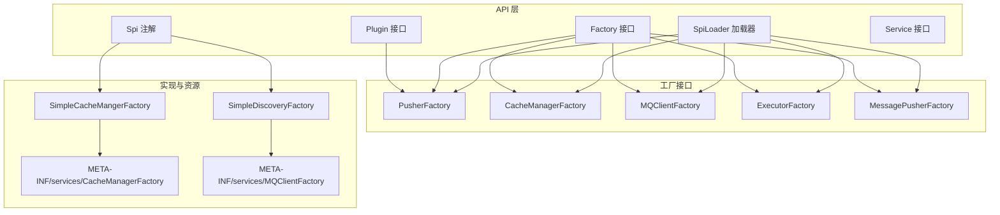
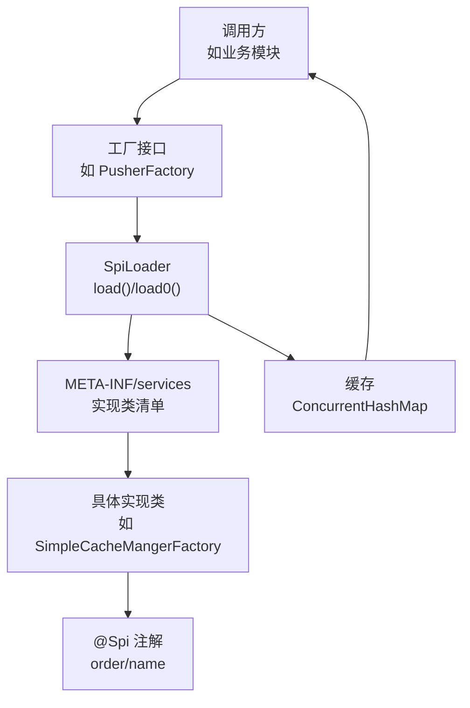
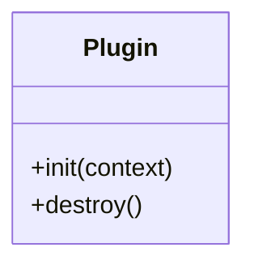
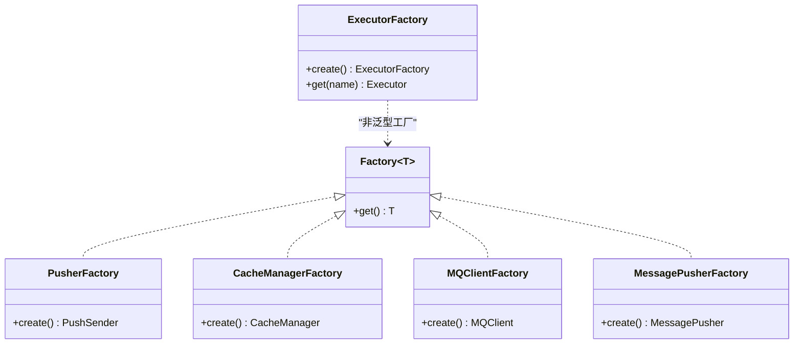
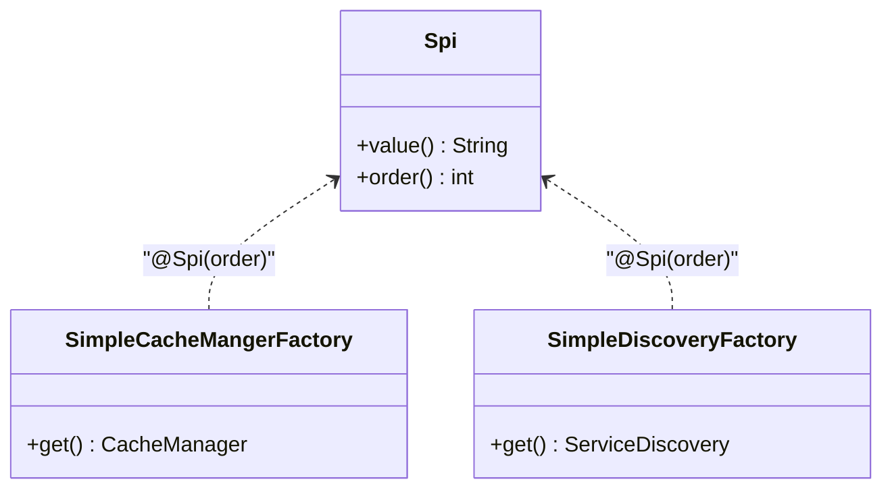
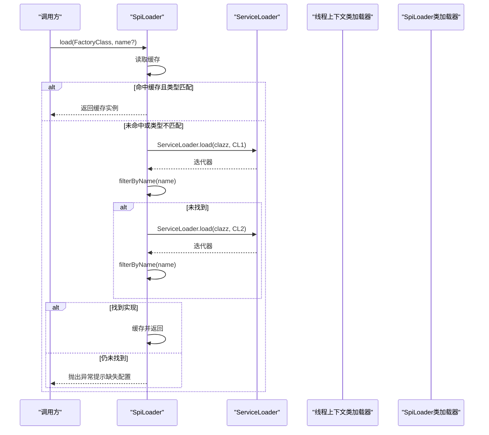
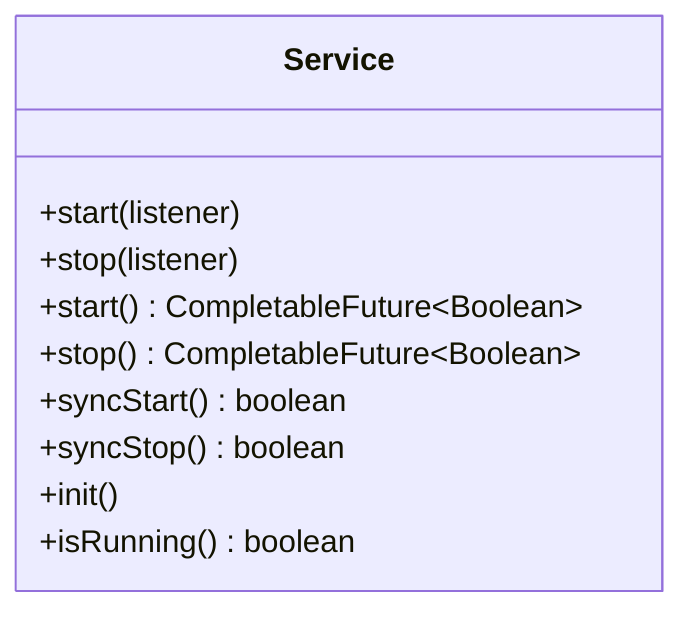

# SPI扩展API

<cite>
**本文引用的文件**
- [Plugin.java](file://mpush-api/src/main/java/com/mpush/api/spi/Plugin.java)
- [Factory.java](file://mpush-api/src/main/java/com/mpush/api/spi/Factory.java)
- [Spi.java](file://mpush-api/src/main/java/com/mpush/api/spi/Spi.java)
- [SpiLoader.java](file://mpush-api/src/main/java/com/mpush/api/spi/SpiLoader.java)
- [Service.java](file://mpush-api/src/main/java/com/mpush/api/service/Service.java)
- [PusherFactory.java](file://mpush-api/src/main/java/com/mpush/api/spi/client/PusherFactory.java)
- [CacheManagerFactory.java](file://mpush-api/src/main/java/com/mpush/api/spi/common/CacheManagerFactory.java)
- [MQClientFactory.java](file://mpush-api/src/main/java/com/mpush/api/spi/common/MQClientFactory.java)
- [ExecutorFactory.java](file://mpush-api/src/main/java/com/mpush/api/spi/common/ExecutorFactory.java)
- [MessagePusherFactory.java](file://mpush-api/src/main/java/com/mpush/api/spi/push/MessagePusherFactory.java)
- [SimpleCacheMangerFactory.java](file://mpush-test/src/main/java/com/mpush/test/spi/SimpleCacheMangerFactory.java)
- [SimpleDiscoveryFactory.java](file://mpush-test/src/main/java/com/mpush/test/spi/SimpleDiscoveryFactory.java)
- [CacheManagerFactory（测试资源）](file://mpush-test/src/main/resources/META-INF/services/com.mpush.api.spi.common.CacheManagerFactory)
- [MQClientFactory（测试资源）](file://mpush-test/src/main/resources/META-INF/services/com.mpush.api.spi.common.MQClientFactory)
</cite>

## 目录
1. [简介](#简介)
2. [项目结构](#项目结构)
3. [核心组件](#核心组件)
4. [架构总览](#架构总览)
5. [详细组件分析](#详细组件分析)
6. [依赖分析](#依赖分析)
7. [性能考虑](#性能考虑)
8. [故障排除指南](#故障排除指南)
9. [结论](#结论)
10. [附录：完整开发示例与最佳实践](#附录完整开发示例与最佳实践)

## 简介
本文件为 MPush SPI 扩展 API 的权威参考文档，面向需要基于 SPI 机制扩展系统能力的开发者。文档覆盖以下主题：
- Plugin 插件接口的设计理念与生命周期管理（初始化、销毁）
- Factory 工厂接口的使用方法（对象创建、配置注入、依赖管理）
- Spi 注解与标记接口的作用机制（SPI 标识、排序、版本与兼容性）
- SpiLoader 加载器的使用指南（SPI 发现、实例化、缓存策略）
- Service 服务接口的定义与实现（启动、停止、异步与同步控制）
- 完整的 SPI 扩展开发示例与最佳实践
- 性能优化与故障排除建议

## 项目结构
MPush 将 SPI 相关接口集中于 mpush-api 模块的 com.mpush.api.spi 包中，并在各功能域（common、client、push、router、handler、core 等）提供对应的 Factory 接口。具体组织如下：
- 接口层：Plugin、Factory、Spi、SpiLoader、Service
- 工厂接口：PusherFactory、CacheManagerFactory、MQClientFactory、ExecutorFactory、MessagePusherFactory 等
- 元数据：通过 META-INF/services 配置 SPI 实现类名
- 示例与测试：mpush-test 模块中的 SimpleCacheMangerFactory、SimpleDiscoveryFactory 及其 META-INF/services 资源



图表来源
- [Plugin.java](file://mpush-api/src/main/java/com/mpush/api/spi/Plugin.java#L29-L38)
- [Factory.java](file://mpush-api/src/main/java/com/mpush/api/spi/Factory.java#L30-L31)
- [Spi.java](file://mpush-api/src/main/java/com/mpush/api/spi/Spi.java#L32-L48)
- [SpiLoader.java](file://mpush-api/src/main/java/com/mpush/api/spi/SpiLoader.java#L25-L96)
- [Service.java](file://mpush-api/src/main/java/com/mpush/api/service/Service.java#L29-L47)
- [PusherFactory.java](file://mpush-api/src/main/java/com/mpush/api/spi/client/PusherFactory.java#L31-L35)
- [CacheManagerFactory.java](file://mpush-api/src/main/java/com/mpush/api/spi/common/CacheManagerFactory.java#L30-L34)
- [MQClientFactory.java](file://mpush-api/src/main/java/com/mpush/api/spi/common/MQClientFactory.java#L30-L35)
- [ExecutorFactory.java](file://mpush-api/src/main/java/com/mpush/api/spi/common/ExecutorFactory.java#L31-L43)
- [MessagePusherFactory.java](file://mpush-api/src/main/java/com/mpush/api/spi/push/MessagePusherFactory.java#L30-L35)
- [SimpleCacheMangerFactory.java](file://mpush-test/src/main/java/com/mpush/test/spi/SimpleCacheMangerFactory.java#L31-L37)
- [SimpleDiscoveryFactory.java](file://mpush-test/src/main/java/com/mpush/test/spi/SimpleDiscoveryFactory.java#L31-L37)
- [CacheManagerFactory（测试资源）](file://mpush-test/src/main/resources/META-INF/services/com.mpush.api.spi.common.CacheManagerFactory#L1-L1)
- [MQClientFactory（测试资源）](file://mpush-test/src/main/resources/META-INF/services/com.mpush.api.spi.common.MQClientFactory#L1-L1)

章节来源
- [Plugin.java](file://mpush-api/src/main/java/com/mpush/api/spi/Plugin.java#L29-L38)
- [Factory.java](file://mpush-api/src/main/java/com/mpush/api/spi/Factory.java#L30-L31)
- [Spi.java](file://mpush-api/src/main/java/com/mpush/api/spi/Spi.java#L32-L48)
- [SpiLoader.java](file://mpush-api/src/main/java/com/mpush/api/spi/SpiLoader.java#L25-L96)
- [Service.java](file://mpush-api/src/main/java/com/mpush/api/service/Service.java#L29-L47)
- [PusherFactory.java](file://mpush-api/src/main/java/com/mpush/api/spi/client/PusherFactory.java#L31-L35)
- [CacheManagerFactory.java](file://mpush-api/src/main/java/com/mpush/api/spi/common/CacheManagerFactory.java#L30-L34)
- [MQClientFactory.java](file://mpush-api/src/main/java/com/mpush/api/spi/common/MQClientFactory.java#L30-L35)
- [ExecutorFactory.java](file://mpush-api/src/main/java/com/mpush/api/spi/common/ExecutorFactory.java#L31-L43)
- [MessagePusherFactory.java](file://mpush-api/src/main/java/com/mpush/api/spi/push/MessagePusherFactory.java#L30-L35)

## 核心组件
- Plugin：插件生命周期接口，默认空实现，便于按需覆写 init(context) 与 destroy()
- Factory：函数式工厂接口，继承 Supplier<T>，用于统一对象创建入口
- Spi：SPI 标记注解，支持 name 与 order 排序字段，用于标识实现与排序
- SpiLoader：SPI 加载器，封装 ServiceLoader 发现、过滤、缓存与异常处理
- Service：服务抽象接口，统一服务的启动、停止、异步与同步控制

章节来源
- [Plugin.java](file://mpush-api/src/main/java/com/mpush/api/spi/Plugin.java#L29-L38)
- [Factory.java](file://mpush-api/src/main/java/com/mpush/api/spi/Factory.java#L30-L31)
- [Spi.java](file://mpush-api/src/main/java/com/mpush/api/spi/Spi.java#L32-L48)
- [SpiLoader.java](file://mpush-api/src/main/java/com/mpush/api/spi/SpiLoader.java#L25-L96)
- [Service.java](file://mpush-api/src/main/java/com/mpush/api/service/Service.java#L29-L47)

## 架构总览
下图展示了 SPI 扩展的整体架构：上层通过工厂接口访问具体实现；实现类通过 @Spi 标注并由 SpiLoader 基于 META-INF/services 进行发现与实例化；可选地进行缓存以提升性能。



图表来源
- [SpiLoader.java](file://mpush-api/src/main/java/com/mpush/api/spi/SpiLoader.java#L25-L96)
- [SimpleCacheMangerFactory.java](file://mpush-test/src/main/java/com/mpush/test/spi/SimpleCacheMangerFactory.java#L31-L37)
- [CacheManagerFactory（测试资源）](file://mpush-test/src/main/resources/META-INF/services/com.mpush.api.spi.common.CacheManagerFactory#L1-L1)

## 详细组件分析

### Plugin 插件接口
- 设计理念：提供最小可用的生命周期钩子，允许插件在上下文就绪时执行初始化，在系统关闭前执行清理
- 默认实现：init(context) 与 destroy() 为空实现，避免强制实现
- 使用场景：插件化模块的启动/销毁阶段，如连接池、监控、日志等



图表来源
- [Plugin.java](file://mpush-api/src/main/java/com/mpush/api/spi/Plugin.java#L29-L38)

章节来源
- [Plugin.java](file://mpush-api/src/main/java/com/mpush/api/spi/Plugin.java#L29-L38)

### Factory 工厂接口
- 角色定位：统一对象创建入口，屏蔽具体实现细节
- 继承关系：继承 Supplier<T>，直接暴露 get() 获取实例
- 应用方式：各功能域工厂接口（如 PusherFactory、CacheManagerFactory、MQClientFactory、ExecutorFactory、MessagePusherFactory）均遵循该模式



图表来源
- [Factory.java](file://mpush-api/src/main/java/com/mpush/api/spi/Factory.java#L30-L31)
- [PusherFactory.java](file://mpush-api/src/main/java/com/mpush/api/spi/client/PusherFactory.java#L31-L35)
- [CacheManagerFactory.java](file://mpush-api/src/main/java/com/mpush/api/spi/common/CacheManagerFactory.java#L30-L34)
- [MQClientFactory.java](file://mpush-api/src/main/java/com/mpush/api/spi/common/MQClientFactory.java#L30-L35)
- [ExecutorFactory.java](file://mpush-api/src/main/java/com/mpush/api/spi/common/ExecutorFactory.java#L31-L43)
- [MessagePusherFactory.java](file://mpush-api/src/main/java/com/mpush/api/spi/push/MessagePusherFactory.java#L30-L35)

章节来源
- [Factory.java](file://mpush-api/src/main/java/com/mpush/api/spi/Factory.java#L30-L31)
- [PusherFactory.java](file://mpush-api/src/main/java/com/mpush/api/spi/client/PusherFactory.java#L31-L35)
- [CacheManagerFactory.java](file://mpush-api/src/main/java/com/mpush/api/spi/common/CacheManagerFactory.java#L30-L34)
- [MQClientFactory.java](file://mpush-api/src/main/java/com/mpush/api/spi/common/MQClientFactory.java#L30-L35)
- [ExecutorFactory.java](file://mpush-api/src/main/java/com/mpush/api/spi/common/ExecutorFactory.java#L31-L43)
- [MessagePusherFactory.java](file://mpush-api/src/main/java/com/mpush/api/spi/push/MessagePusherFactory.java#L30-L35)

### Spi 注解与标记接口
- 作用机制：
  - @Spi(value, order)：为实现类提供标识与排序
  - value：SPI 名称（可选），用于精确匹配
  - order：排序权重，数值越小优先级越高
- 兼容性与版本：通过 order 控制加载顺序，避免多实现冲突；value 支持按名称精确选择
- 标记接口：各工厂接口通过 @Spi 标注实现类，配合 SpiLoader 的过滤逻辑完成选择



图表来源
- [Spi.java](file://mpush-api/src/main/java/com/mpush/api/spi/Spi.java#L32-L48)
- [SimpleCacheMangerFactory.java](file://mpush-test/src/main/java/com/mpush/test/spi/SimpleCacheMangerFactory.java#L31-L37)
- [SimpleDiscoveryFactory.java](file://mpush-test/src/main/java/com/mpush/test/spi/SimpleDiscoveryFactory.java#L31-L37)

章节来源
- [Spi.java](file://mpush-api/src/main/java/com/mpush/api/spi/Spi.java#L32-L48)
- [SimpleCacheMangerFactory.java](file://mpush-test/src/main/java/com/mpush/test/spi/SimpleCacheMangerFactory.java#L31-L37)
- [SimpleDiscoveryFactory.java](file://mpush-test/src/main/java/com/mpush/test/spi/SimpleDiscoveryFactory.java#L31-L37)

### SpiLoader SPI 加载器
- 功能职责：
  - 缓存：使用 ConcurrentHashMap 缓存已加载的实现，避免重复扫描
  - 发现：优先使用当前线程上下文类加载器，失败后回退到 SpiLoader 类加载器
  - 过滤：当未指定名称时，按 @Spi.order 排序取第一个；当指定名称时，按全限定名或简单名匹配
  - 异常：若未找到实现，抛出非法状态异常，提示缺失 META-INF/services 配置
- 生命周期：clear() 可清空缓存，便于热切换或测试



图表来源
- [SpiLoader.java](file://mpush-api/src/main/java/com/mpush/api/spi/SpiLoader.java#L25-L96)

章节来源
- [SpiLoader.java](file://mpush-api/src/main/java/com/mpush/api/spi/SpiLoader.java#L25-L96)

### Service 服务接口
- 职责：统一服务的启动、停止、异步与同步控制
- 方法族：
  - start(listener)/stop(listener)：带回调监听
  - start()/stop()：返回 CompletableFuture，支持异步编排
  - syncStart()/syncStop()：阻塞式启动/停止
  - init()/isRunning()：初始化与运行态查询



图表来源
- [Service.java](file://mpush-api/src/main/java/com/mpush/api/service/Service.java#L29-L47)

章节来源
- [Service.java](file://mpush-api/src/main/java/com/mpush/api/service/Service.java#L29-L47)

## 依赖分析
- 组件耦合：
  - 工厂接口依赖 SpiLoader 进行实例化
  - 实现类通过 @Spi 标注参与排序与选择
  - 元数据通过 META-INF/services 提供实现类清单
- 外部依赖：
  - Java 标准库 ServiceLoader、ConcurrentHashMap
  - 运行时类加载器策略（线程上下文类加载器优先）

```mermaid
graph LR
SL["SpiLoader"] --> |load| IF["工厂接口"]
IF --> |get()| IMPL["实现类"]
IMPL --> |@Spi| SORT["排序/名称"]
RES["META-INF/services"] --> |提供实现类| SL
```

图表来源
- [SpiLoader.java](file://mpush-api/src/main/java/com/mpush/api/spi/SpiLoader.java#L25-L96)
- [PusherFactory.java](file://mpush-api/src/main/java/com/mpush/api/spi/client/PusherFactory.java#L31-L35)
- [CacheManagerFactory.java](file://mpush-api/src/main/java/com/mpush/api/spi/common/CacheManagerFactory.java#L30-L34)
- [MQClientFactory.java](file://mpush-api/src/main/java/com/mpush/api/spi/common/MQClientFactory.java#L30-L35)
- [ExecutorFactory.java](file://mpush-api/src/main/java/com/mpush/api/spi/common/ExecutorFactory.java#L31-L43)
- [MessagePusherFactory.java](file://mpush-api/src/main/java/com/mpush/api/spi/push/MessagePusherFactory.java#L30-L35)
- [SimpleCacheMangerFactory.java](file://mpush-test/src/main/java/com/mpush/test/spi/SimpleCacheMangerFactory.java#L31-L37)
- [CacheManagerFactory（测试资源）](file://mpush-test/src/main/resources/META-INF/services/com.mpush.api.spi.common.CacheManagerFactory#L1-L1)

章节来源
- [SpiLoader.java](file://mpush-api/src/main/java/com/mpush/api/spi/SpiLoader.java#L25-L96)
- [PusherFactory.java](file://mpush-api/src/main/java/com/mpush/api/spi/client/PusherFactory.java#L31-L35)
- [CacheManagerFactory.java](file://mpush-api/src/main/java/com/mpush/api/spi/common/CacheManagerFactory.java#L30-L34)
- [MQClientFactory.java](file://mpush-api/src/main/java/com/mpush/api/spi/common/MQClientFactory.java#L30-L35)
- [ExecutorFactory.java](file://mpush-api/src/main/java/com/mpush/api/spi/common/ExecutorFactory.java#L31-L43)
- [MessagePusherFactory.java](file://mpush-api/src/main/java/com/mpush/api/spi/push/MessagePusherFactory.java#L30-L35)
- [SimpleCacheMangerFactory.java](file://mpush-test/src/main/java/com/mpush/test/spi/SimpleCacheMangerFactory.java#L31-L37)
- [CacheManagerFactory（测试资源）](file://mpush-test/src/main/resources/META-INF/services/com.mpush.api.spi.common.CacheManagerFactory#L1-L1)

## 性能考虑
- 缓存策略：SpiLoader 内置 ConcurrentHashMap 缓存，避免重复扫描与实例化，建议在生产环境保持默认缓存行为
- 类加载器选择：优先使用线程上下文类加载器，确保与调用方类路径一致；若跨模块/插件场景复杂，注意类加载隔离
- 排序开销：多实现时按 @Spi.order 排序会引入比较成本，建议合理设置 order，减少实现数量或采用命名精确匹配
- 异步化：Service 接口提供异步启动/停止，结合 CompletableFuture 进行编排，降低阻塞风险
- 资源释放：实现 Plugin.destroy() 时确保释放外部资源（连接、线程池、定时器等）

## 故障排除指南
- 无法找到实现
  - 现象：抛出非法状态异常，提示缺失 META-INF/services 配置
  - 排查：确认实现类已在对应资源文件中声明，且包名与类名正确
  - 参考
    - [SpiLoader.java](file://mpush-api/src/main/java/com/mpush/api/spi/SpiLoader.java#L64-L65)
    - [CacheManagerFactory（测试资源）](file://mpush-test/src/main/resources/META-INF/services/com.mpush.api.spi.common.CacheManagerFactory#L1-L1)
    - [MQClientFactory（测试资源）](file://mpush-test/src/main/resources/META-INF/services/com.mpush.api.spi.common.MQClientFactory#L1-L1)
- 多实现冲突
  - 现象：未指定名称时，按 @Spi.order 选择首个实现，可能与预期不符
  - 排查：明确 @Spi.order 或使用精确名称匹配
  - 参考
    - [SpiLoader.java](file://mpush-api/src/main/java/com/mpush/api/spi/SpiLoader.java#L76-L82)
    - [SimpleCacheMangerFactory.java](file://mpush-test/src/main/java/com/mpush/test/spi/SimpleCacheMangerFactory.java#L31-L37)
- 类加载器问题
  - 现象：不同类加载器导致实例类型不匹配
  - 排查：确认线程上下文类加载器与实现类所在模块一致；必要时显式传入名称进行精确匹配
  - 参考
    - [SpiLoader.java](file://mpush-api/src/main/java/com/mpush/api/spi/SpiLoader.java#L53-L59)
- 缓存误用
  - 现象：热切换新实现无效
  - 排查：调用 SpiLoader.clear() 清空缓存后再加载
  - 参考
    - [SpiLoader.java](file://mpush-api/src/main/java/com/mpush/api/spi/SpiLoader.java#L28-L30)

章节来源
- [SpiLoader.java](file://mpush-api/src/main/java/com/mpush/api/spi/SpiLoader.java#L28-L30)
- [SpiLoader.java](file://mpush-api/src/main/java/com/mpush/api/spi/SpiLoader.java#L53-L59)
- [SpiLoader.java](file://mpush-api/src/main/java/com/mpush/api/spi/SpiLoader.java#L64-L65)
- [SpiLoader.java](file://mpush-api/src/main/java/com/mpush/api/spi/SpiLoader.java#L76-L82)
- [SimpleCacheMangerFactory.java](file://mpush-test/src/main/java/com/mpush/test/spi/SimpleCacheMangerFactory.java#L31-L37)
- [CacheManagerFactory（测试资源）](file://mpush-test/src/main/resources/META-INF/services/com.mpush.api.spi.common.CacheManagerFactory#L1-L1)
- [MQClientFactory（测试资源）](file://mpush-test/src/main/resources/META-INF/services/com.mpush.api.spi.common.MQClientFactory#L1-L1)

## 结论
MPush 的 SPI 扩展 API 通过 Plugin、Factory、Spi、SpiLoader、Service 等核心组件，构建了清晰、可扩展、可维护的服务化架构。开发者只需实现工厂接口并标注 @Spi，再在 META-INF/services 中声明实现类，即可被 SpiLoader 自动发现与缓存。配合 Service 接口的异步与同步控制，可在保证性能的同时提升系统的灵活性与可演进性。

## 附录：完整开发示例与最佳实践

### 开发步骤
- 步骤一：定义工厂接口
  - 在相应功能域包下新增工厂接口，继承 Factory<T> 或按需自定义
  - 参考
    - [PusherFactory.java](file://mpush-api/src/main/java/com/mpush/api/spi/client/PusherFactory.java#L31-L35)
    - [CacheManagerFactory.java](file://mpush-api/src/main/java/com/mpush/api/spi/common/CacheManagerFactory.java#L30-L34)
    - [MQClientFactory.java](file://mpush-api/src/main/java/com/mpush/api/spi/common/MQClientFactory.java#L30-L35)
    - [ExecutorFactory.java](file://mpush-api/src/main/java/com/mpush/api/spi/common/ExecutorFactory.java#L31-L43)
    - [MessagePusherFactory.java](file://mpush-api/src/main/java/com/mpush/api/spi/push/MessagePusherFactory.java#L30-L35)
- 步骤二：实现工厂接口
  - 实现 get() 返回目标对象实例
  - 通过 @Spi(value, order) 标注实现类
  - 参考
    - [SimpleCacheMangerFactory.java](file://mpush-test/src/main/java/com/mpush/test/spi/SimpleCacheMangerFactory.java#L31-L37)
    - [SimpleDiscoveryFactory.java](file://mpush-test/src/main/java/com/mpush/test/spi/SimpleDiscoveryFactory.java#L31-L37)
- 步骤三：提供 SPI 元数据
  - 在资源目录 META-INF/services 下新增以工厂接口全限定名为文件名的文本文件，内容为实现类全限定名
  - 参考
    - [CacheManagerFactory（测试资源）](file://mpush-test/src/main/resources/META-INF/services/com.mpush.api.spi.common.CacheManagerFactory#L1-L1)
    - [MQClientFactory（测试资源）](file://mpush-test/src/main/resources/META-INF/services/com.mpush.api.spi.common.MQClientFactory#L1-L1)
- 步骤四：在调用方使用
  - 通过工厂接口的静态 create() 或直接调用 SpiLoader.load(...) 获取实例
  - 参考
    - [PusherFactory.java](file://mpush-api/src/main/java/com/mpush/api/spi/client/PusherFactory.java#L32-L34)
    - [CacheManagerFactory.java](file://mpush-api/src/main/java/com/mpush/api/spi/common/CacheManagerFactory.java#L31-L33)
    - [MQClientFactory.java](file://mpush-api/src/main/java/com/mpush/api/spi/common/MQClientFactory.java#L31-L33)
    - [ExecutorFactory.java](file://mpush-api/src/main/java/com/mpush/api/spi/common/ExecutorFactory.java#L40-L42)
    - [MessagePusherFactory.java](file://mpush-api/src/main/java/com/mpush/api/spi/push/MessagePusherFactory.java#L31-L33)
- 步骤五：生命周期管理
  - 若实现 Plugin 接口，可在 init(context) 中完成初始化，在 destroy() 中释放资源
  - 参考
    - [Plugin.java](file://mpush-api/src/main/java/com/mpush/api/spi/Plugin.java#L31-L37)

### 最佳实践
- 明确 @Spi.order：为多实现场景设置合理的排序，避免默认选择不符合预期
- 精确命名：通过 @Spi.value 指定名称，便于按名称精确匹配
- 缓存利用：保持 SpiLoader 默认缓存策略，避免重复扫描；热切换时显式调用 clear()
- 异步化：优先使用 Service.start()/stop() 的异步版本，结合 CompletableFuture 进行编排
- 资源释放：在 Plugin.destroy() 中确保释放外部资源，防止内存泄漏
- 测试验证：在测试模块中提供最小可运行实现与 META-INF/services 配置，确保加载链路正确