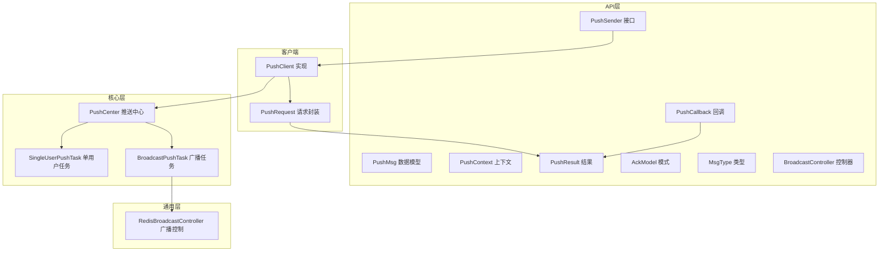
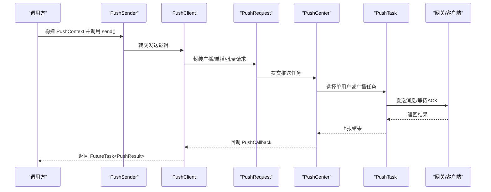
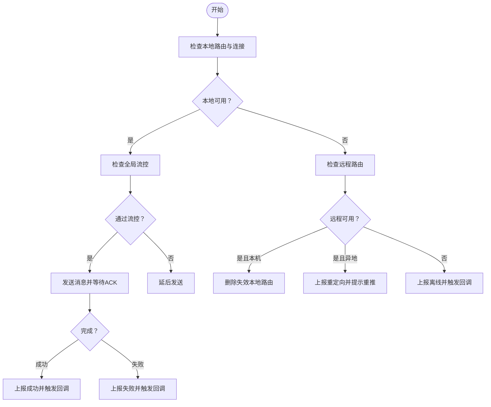
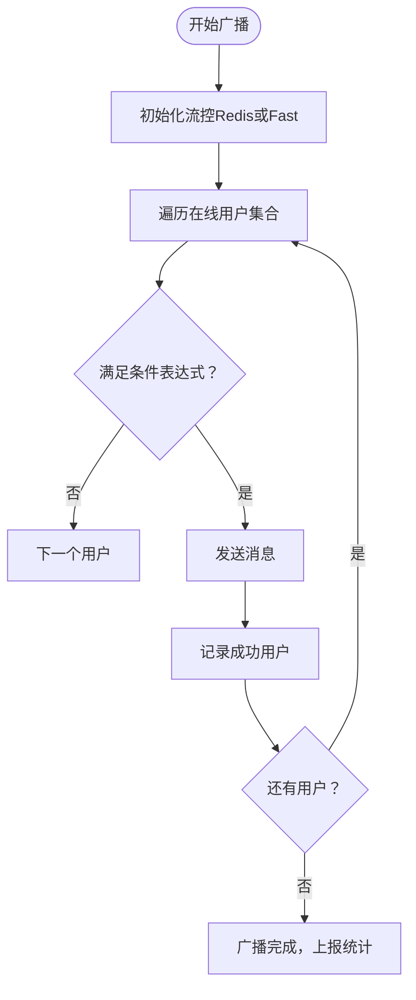
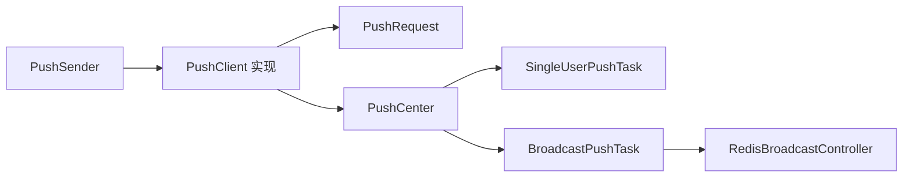

# 推送API接口

<cite>
**本文引用的文件**
- [PushSender.java](file://mpush-api/src/main/java/com/mpush/api/push/PushSender.java)
- [PushMsg.java](file://mpush-api/src/main/java/com/mpush/api/push/PushMsg.java)
- [PushContext.java](file://mpush-api/src/main/java/com/mpush/api/push/PushContext.java)
- [PushCallback.java](file://mpush-api/src/main/java/com/mpush/api/push/PushCallback.java)
- [PushResult.java](file://mpush-api/src/main/java/com/mpush/api/push/PushResult.java)
- [AckModel.java](file://mpush-api/src/main/java/com/mpush/api/push/AckModel.java)
- [MsgType.java](file://mpush-api/src/main/java/com/mpush/api/push/MsgType.java)
- [BroadcastController.java](file://mpush-api/src/main/java/com/mpush/api/push/BroadcastController.java)
- [PushException.java](file://mpush-api/src/main/java/com/mpush/api/push/PushException.java)
- [PushCenter.java](file://mpush-core/src/main/java/com/mpush/core/push/PushCenter.java)
- [SingleUserPushTask.java](file://mpush-core/src/main/java/com/mpush/core/push/SingleUserPushTask.java)
- [BroadcastPushTask.java](file://mpush-core/src/main/java/com/mpush/core/push/BroadcastPushTask.java)
- [PushClient.java](file://mpush-client/src/main/java/com/mpush/client/push/PushClient.java)
- [PushRequest.java](file://mpush-client/src/main/java/com/mpush/client/push/PushRequest.java)
- [RedisBroadcastController.java](file://mpush-common/src/main/java/com/mpush/common/push/RedisBroadcastController.java)
- [reference.conf](file://conf/reference.conf)
- [PushClientTestMain.java](file://mpush-test/src/main/java/com/MPush/test/push/PushClientTestMain.java)
- [PushClientTestMain2.java](file://mpush-test/src/main/java/com/MPush/test/push/PushClientTestMain2.java)
</cite>

## 目录
1. [简介](#简介)
2. [项目结构](#项目结构)
3. [核心组件](#核心组件)
4. [架构总览](#架构总览)
5. [组件详解](#组件详解)
6. [依赖关系分析](#依赖关系分析)
7. [性能与可靠性](#性能与可靠性)
8. [故障排查指南](#故障排查指南)
9. [结论](#结论)
10. [附录](#附录)

## 简介
本文件为 MPush 推送API接口的权威参考文档，面向后端开发者与集成工程师，系统阐述 PushSender 推送发送器、PushMsg 推送消息、PushContext 推送上下文、PushCallback 回调接口、PushResult 推送结果等核心构件的功能与使用方法。文档同时覆盖单用户推送、批量推送、广播推送等不同推送模式的实现细节，给出数据结构字段定义、回调事件处理机制、结果状态码语义、典型使用示例与错误处理策略，并提供性能优化与可靠性保障的最佳实践。

## 项目结构
MPush 采用模块化设计，核心推送能力位于 mpush-api、mpush-core、mpush-client、mpush-common 等模块。API 层提供推送接口与数据模型；core 层负责推送调度、流控与任务执行；client 层负责构建与发送推送请求；common 层提供通用工具与广播控制。

图表来源
- [PushSender.java](file://mpush-api/src/main/java/com/mpush/api/push/PushSender.java#L33-L71)
- [PushClient.java](file://mpush-client/src/main/java/com/mpush/client/push/PushClient.java#L39-L71)
- [PushRequest.java](file://mpush-client/src/main/java/com/mpush/client/push/PushRequest.java#L165-L193)
- [PushCenter.java](file://mpush-core/src/main/java/com/mpush/core/push/PushCenter.java#L49-L82)
- [SingleUserPushTask.java](file://mpush-core/src/main/java/com/mpush/core/push/SingleUserPushTask.java#L44-L244)
- [BroadcastPushTask.java](file://mpush-core/src/main/java/com/mpush/core/push/BroadcastPushTask.java#L46-L162)
- [RedisBroadcastController.java](file://mpush-common/src/main/java/com/mpush/common/push/RedisBroadcastController.java#L38-L84)

章节来源
- [PushSender.java](file://mpush-api/src/main/java/com/mpush/api/push/PushSender.java#L33-L71)
- [PushCenter.java](file://mpush-core/src/main/java/com/mpush/core/push/PushCenter.java#L49-L109)

## 核心组件
- PushSender 推送发送器：统一入口，负责构建与提交推送任务，支持单用户、批量、广播等模式。
- PushMsg 推送消息：承载消息内容与类型，支持通知、纯消息、通知+消息组合。
- PushContext 推送上下文：封装推送内容、目标用户、广播参数、ACK模式、超时、回调等。
- PushCallback 推送回调：标准化的成功/失败/离线/超时事件处理接口。
- PushResult 推送结果：封装结果码、用户标识、时间线、位置信息等。
- AckModel ACK模式：NO_ACK、AUTO_ACK、BIZ_ACK 三态控制。
- MsgType 消息类型：NOTIFICATION、MESSAGE、NOTIFICATION_AND_MESSAGE。
- BroadcastController 广播控制器：广播任务的QPS、计数、取消、完成状态管理。
- PushException 异常类型：封装推送过程中的异常信息。

章节来源
- [PushSender.java](file://mpush-api/src/main/java/com/mpush/api/push/PushSender.java#L33-L71)
- [PushMsg.java](file://mpush-api/src/main/java/com/mpush/api/push/PushMsg.java#L34-L69)
- [PushContext.java](file://mpush-api/src/main/java/com/mpush/api/push/PushContext.java#L33-L205)
- [PushCallback.java](file://mpush-api/src/main/java/com/mpush/api/push/PushCallback.java#L12-L65)
- [PushResult.java](file://mpush-api/src/main/java/com/mpush/api/push/PushResult.java#L31-L104)
- [AckModel.java](file://mpush-api/src/main/java/com/mpush/api/push/AckModel.java#L29-L38)
- [MsgType.java](file://mpush-api/src/main/java/com/mpush/api/push/MsgType.java#L3-L22)
- [BroadcastController.java](file://mpush-api/src/main/java/com/mpush/api/push/BroadcastController.java#L29-L51)
- [PushException.java](file://mpush-api/src/main/java/com/mpush/api/push/PushException.java#L26-L39)

## 架构总览
MPush 的推送链路从 API 层发起，经客户端封装为 PushRequest，提交至 PushCenter 推送中心，再根据目标类型选择 SingleUserPushTask 或 BroadcastPushTask 执行。核心层负责流控、ACK、路由查询与结果上报；客户端负责与网关通信与结果回传。

图表来源
- [PushSender.java](file://mpush-api/src/main/java/com/mpush/api/push/PushSender.java#L50-L58)
- [PushClient.java](file://mpush-client/src/main/java/com/mpush/client/push/PushClient.java#L49-L71)
- [PushRequest.java](file://mpush-client/src/main/java/com/mpush/client/push/PushRequest.java#L165-L193)
- [PushCenter.java](file://mpush-core/src/main/java/com/mpush/core/push/PushCenter.java#L72-L82)
- [SingleUserPushTask.java](file://mpush-core/src/main/java/com/mpush/core/push/SingleUserPushTask.java#L86-L202)
- [BroadcastPushTask.java](file://mpush-core/src/main/java/com/mpush/core/push/BroadcastPushTask.java#L116-L162)

## 组件详解

### PushSender 推送发送器
- 角色与职责
  - 提供统一的推送入口，屏蔽底层实现差异。
  - 支持静态工厂创建实例，支持多种便捷 send 重载。
  - 返回 FutureTask 以支持同步阻塞获取结果。
- 关键方法
  - create(): 通过 SPI 工厂创建实现。
  - send(PushContext): 核心发送方法。
  - send(String context, String userId, ...): 快速构建上下文并发送。
- 使用要点
  - 在调用前确保 PushSender 已启动并就绪。
  - 通过回调或 FutureTask 获取最终结果。

章节来源
- [PushSender.java](file://mpush-api/src/main/java/com/mpush/api/push/PushSender.java#L33-L71)

### PushMsg 推送消息
- 数据结构
  - msgType: 消息类型枚举（NOTIFICATION/MESSAGE/NOTIFICATION_AND_MESSAGE）。
  - msgId: 消息唯一标识，便于跟踪与去重。
  - content: 消息内容，通常为 JSON 字符串，承载业务字段。
- 字段约束
  - NOTIFICATION：建议包含标题与内容，nid 用于通知聚合。
  - MESSAGE：纯透传消息，content 必填。
  - NOTIFICATION_AND_MESSAGE：组合形态。
- 构造与设置
  - build(MsgType, String) 快速构造。
  - setMsgId/setContent 设置关键字段。

章节来源
- [PushMsg.java](file://mpush-api/src/main/java/com/mpush/api/push/PushMsg.java#L34-L69)
- [MsgType.java](file://mpush-api/src/main/java/com/mpush/api/push/MsgType.java#L3-L22)

### PushContext 推送上下文
- 核心字段
  - context: 原始字节内容（UTF-8 编码）。
  - pushMsg: PushMsg 对象（二选一）。
  - userId/userIds: 目标用户标识（单个/批量）。
  - ackModel: ACK 模式（NO_ACK/AUTO_ACK/BIZ_ACK）。
  - callback: 推送回调。
  - timeout: 推送超时时间（毫秒）。
  - broadcast/tags/condition/taskId: 广播相关参数。
- 构建与设置
  - build(String/MsgType) 快速构建。
  - setUserId/setUserIds/setAckModel/setCallback/setTimeout 等链式设置。
  - setBroadcast/setTags/setCondition/setTaskId 用于广播场景。

章节来源
- [PushContext.java](file://mpush-api/src/main/java/com/mpush/api/push/PushContext.java#L33-L205)

### PushCallback 回调接口
- 事件类型
  - onResult: 统一入口，根据 result.resultCode 分派到具体事件。
  - onSuccess/onFailure/onOffline/onTimeout: 针对不同结果码的细化处理。
- 参数
  - userId: 用户标识（广播场景可能为空）。
  - location: 用户所在节点位置信息。
- 使用建议
  - 在回调中避免阻塞操作，必要时异步处理。
  - 结合 PushResult 的时间线与位置信息进行诊断。

章节来源
- [PushCallback.java](file://mpush-api/src/main/java/com/mpush/api/push/PushCallback.java#L12-L65)

### PushResult 推送结果
- 字段
  - resultCode: 结果码（SUCCESS/FAILURE/OFFLINE/TIMEOUT）。
  - userId: 用户标识。
  - timeLine: 时间线数组，记录关键阶段耗时。
  - location: 用户所在节点位置。
- 结果码语义
  - SUCCESS: 推送成功。
  - FAILURE: 推送失败（网络/协议等）。
  - OFFLINE: 用户不在线。
  - TIMEOUT: 超时未达预期。
- 辅助方法
  - getResultDesc(): 将结果码转换为可读描述。
  - toString(): 标准化输出。

章节来源
- [PushResult.java](file://mpush-api/src/main/java/com/mpush/api/push/PushResult.java#L31-L104)

### ACK 模式与消息类型
- AckModel
  - NO_ACK: 不需要确认。
  - AUTO_ACK: 客户端收到消息即自动确认。
  - BIZ_ACK: 由客户端业务自行确认。
- MsgType
  - NOTIFICATION: 通知栏展示。
  - MESSAGE: 仅透传消息。
  - NOTIFICATION_AND_MESSAGE: 组合形态。

章节来源
- [AckModel.java](file://mpush-api/src/main/java/com/mpush/api/push/AckModel.java#L29-L38)
- [MsgType.java](file://mpush-api/src/main/java/com/mpush/api/push/MsgType.java#L3-L22)

### 广播控制与任务管理
- BroadcastController
  - 提供 taskId/qps/sendCount/cancel/isDone/isCancelled 等能力。
  - 支持动态更新 QPS、统计成功用户、取消任务。
- RedisBroadcastController
  - 基于缓存的广播任务状态持久化与查询。
  - 通过哈希字段维护任务状态与指标。

章节来源
- [BroadcastController.java](file://mpush-api/src/main/java/com/mpush/api/push/BroadcastController.java#L29-L51)
- [RedisBroadcastController.java](file://mpush-common/src/main/java/com/mpush/common/push/RedisBroadcastController.java#L38-L84)

### 推送流程与任务执行

#### 单用户推送流程

图表来源
- [SingleUserPushTask.java](file://mpush-core/src/main/java/com/mpush/core/push/SingleUserPushTask.java#L86-L202)

章节来源
- [SingleUserPushTask.java](file://mpush-core/src/main/java/com/mpush/core/push/SingleUserPushTask.java#L86-L202)

#### 广播推送流程

图表来源
- [BroadcastPushTask.java](file://mpush-core/src/main/java/com/mpush/core/push/BroadcastPushTask.java#L67-L162)
- [PushCenter.java](file://mpush-core/src/main/java/com/mpush/core/push/PushCenter.java#L72-L82)

章节来源
- [BroadcastPushTask.java](file://mpush-core/src/main/java/com/mpush/core/push/BroadcastPushTask.java#L67-L162)
- [PushCenter.java](file://mpush-core/src/main/java/com/mpush/core/push/PushCenter.java#L72-L82)

### 客户端与请求封装
- PushClient
  - send(PushContext): 根据是否广播/单用户/批量选择不同路径。
  - 广播：直接走广播通道。
  - 单用户：查询远程路由，逐个发送。
  - 批量：循环对每个用户执行单用户逻辑。
- PushRequest
  - broadcast(): 构建广播消息并发送。
  - send(remoteRouter): 针对指定路由发送。
  - onOffline(): 用户离线时的快速处理。

章节来源
- [PushClient.java](file://mpush-client/src/main/java/com/mpush/client/push/PushClient.java#L49-L71)
- [PushRequest.java](file://mpush-client/src/main/java/com/mpush/client/push/PushRequest.java#L165-L193)

## 依赖关系分析
- PushSender 依赖 PusherFactory 通过 SPI 创建实现。
- PushClient 实现 PushSender 接口，内部依赖 PushRequest、路由管理器与网关连接工厂。
- PushCenter 作为任务调度中心，依赖 PushTask（单用户/广播）、流控组件与 ACK 队列。
- BroadcastPushTask 依赖条件表达式与本地路由表迭代器。
- RedisBroadcastController 依赖缓存管理器进行广播任务状态持久化。

图表来源
- [PushSender.java](file://mpush-api/src/main/java/com/mpush/api/push/PushSender.java#L40-L42)
- [PushClient.java](file://mpush-client/src/main/java/com/mpush/client/push/PushClient.java#L39-L71)
- [PushCenter.java](file://mpush-core/src/main/java/com/mpush/core/push/PushCenter.java#L49-L82)
- [BroadcastPushTask.java](file://mpush-core/src/main/java/com/mpush/core/push/BroadcastPushTask.java#L46-L71)
- [RedisBroadcastController.java](file://mpush-common/src/main/java/com/mpush/common/push/RedisBroadcastController.java#L38-L51)

章节来源
- [PushSender.java](file://mpush-api/src/main/java/com/mpush/api/push/PushSender.java#L40-L42)
- [PushClient.java](file://mpush-client/src/main/java/com/mpush/client/push/PushClient.java#L39-L71)
- [PushCenter.java](file://mpush-core/src/main/java/com/mpush/core/push/PushCenter.java#L49-L82)

## 性能与可靠性
- 流控策略
  - 全局流控：针对非广播推送，限制整体 QPS。
  - 广播流控：针对单次广播任务，支持 Redis 限流与快速限流。
  - 配置参考：全局 limit/max/duration 与广播 limit/max/duration。
- 线程池与执行器
  - TCP 模式：复用 Netty EventLoop。
  - UDP 模式：使用自定义 ScheduledExecutorService。
- 背压与缓冲
  - 检测 TCP 写缓冲区可写性，避免过度拥塞。
- 超时与重试
  - 单用户任务内置超时检测与重定向处理。
  - 广播任务按批次推进，结合条件表达式减少无效投递。
- 广播 QPS 动态调整
  - 通过 BroadcastController 更新 QPS，实时调节推送节奏。
- 配置建议
  - 根据网关与客户端承载能力调整线程池大小与缓冲区阈值。
  - 合理设置超时时间与流控参数，平衡吞吐与延迟。

章节来源
- [reference.conf](file://conf/reference.conf#L207-L222)
- [PushCenter.java](file://mpush-core/src/main/java/com/mpush/core/push/PushCenter.java#L99-L103)
- [SingleUserPushTask.java](file://mpush-core/src/main/java/com/mpush/core/push/SingleUserPushTask.java#L138-L156)
- [BroadcastPushTask.java](file://mpush-core/src/main/java/com/mpush/core/push/BroadcastPushTask.java#L116-L162)
- [RedisBroadcastController.java](file://mpush-common/src/main/java/com/mpush/common/push/RedisBroadcastController.java#L58-L67)

## 故障排查指南
- 常见问题定位
  - 离线：用户不在线或路由失效，检查远程路由与本地路由一致性。
  - 超时：网络抖动或客户端处理慢，适当提高超时或降低并发。
  - 失败：网络异常或协议错误，关注连接状态与写缓冲区。
  - 重定向：用户切换到其他节点，客户端需清理缓存并重推。
- 日志与监控
  - PUSH 日志包含关键时间点与消息摘要，便于定位瓶颈。
  - JMX 暴露 PushCenter 任务计数，辅助容量评估。
- 回调处理
  - 在回调中记录 result.resultCode、timeLine、location，形成闭环诊断。
- 异常类型
  - PushException：封装底层异常原因，便于上层捕获与恢复。

章节来源
- [SingleUserPushTask.java](file://mpush-core/src/main/java/com/mpush/core/push/SingleUserPushTask.java#L95-L202)
- [BroadcastPushTask.java](file://mpush-core/src/main/java/com/mpush/core/push/BroadcastPushTask.java#L133-L162)
- [PushResult.java](file://mpush-api/src/main/java/com/mpush/api/push/PushResult.java#L81-L93)
- [PushException.java](file://mpush-api/src/main/java/com/mpush/api/push/PushException.java#L26-L39)

## 结论
MPush 推送API通过清晰的接口分层与完善的任务执行模型，提供了稳定高效的推送能力。开发者只需围绕 PushContext/PushMsg/PushCallback 构建推送场景，即可灵活实现单用户、批量与广播推送，并借助流控、ACK、广播控制器与监控体系保障性能与可靠性。

## 附录

### 推送模式与实现要点
- 单用户推送
  - 通过 PushContext.setUserId 指定目标用户。
  - PushClient 查询远程路由并逐个发送。
  - 支持 AUTO_ACK/BIZ_ACK 模式等待确认。
- 批量推送
  - 通过 PushContext.setUserIds 指定多个用户。
  - 客户端对每个用户执行单用户逻辑。
- 广播推送
  - 通过 PushContext.setBroadcast(true) 开启广播。
  - 可结合 tags/condition 进行用户筛选。
  - 支持 taskId 与 RedisBroadcastController 动态控制 QPS 与统计。

章节来源
- [PushContext.java](file://mpush-api/src/main/java/com/mpush/api/push/PushContext.java#L117-L205)
- [PushClient.java](file://mpush-client/src/main/java/com/mpush/client/push/PushClient.java#L65-L71)
- [PushRequest.java](file://mpush-client/src/main/java/com/mpush/client/push/PushRequest.java#L165-L193)
- [BroadcastController.java](file://mpush-api/src/main/java/com/mpush/api/push/BroadcastController.java#L29-L51)

### 使用示例与最佳实践
- 示例参考
  - 单用户推送示例：PushClientTestMain 中构建 PushMsg/PushContext 并设置回调。
  - 批量/高并发示例：PushClientTestMain2 中使用 FlowControl 与线程池并发推送。
- 最佳实践
  - 明确 ACK 模式：高可靠场景建议 AUTO_ACK/BIZ_ACK。
  - 合理设置超时：结合业务 SLA 与网络状况调整 timeout。
  - 广播分批与限流：使用 taskId 与 RedisBroadcastController 控制速率。
  - 回调异步化：避免在回调中执行阻塞操作。
  - 监控与告警：基于 JMX 与日志建立推送质量监控。

章节来源
- [PushClientTestMain.java](file://mpush-test/src/main/java/com/MPush/test/push/PushClientTestMain.java#L43-L77)
- [PushClientTestMain2.java](file://mpush-test/src/main/java/com/MPush/test/push/PushClientTestMain2.java#L44-L110)