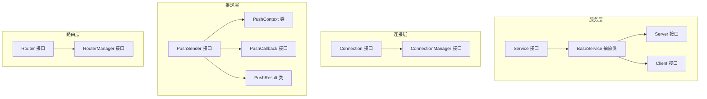
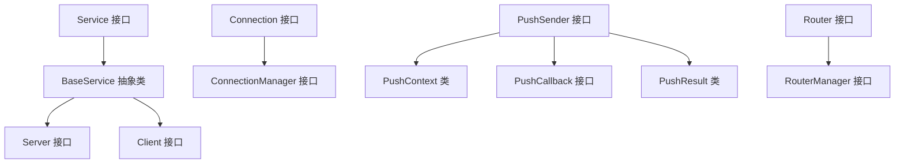
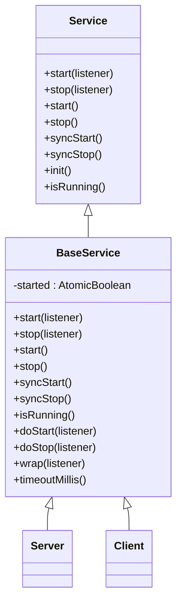
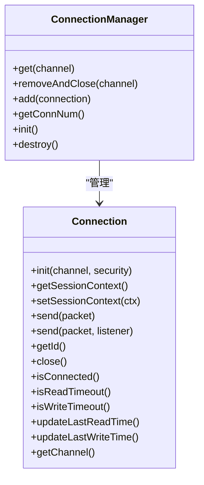
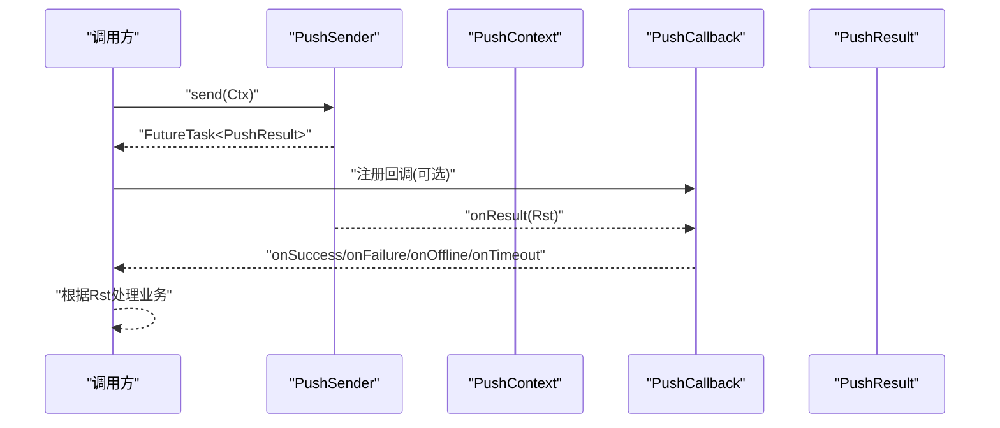
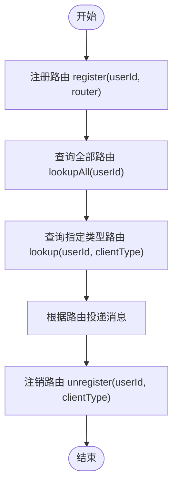
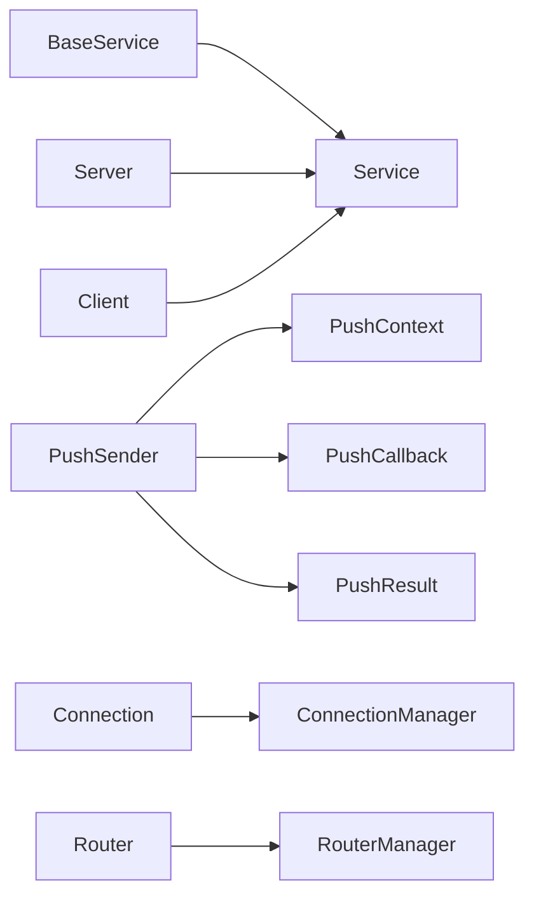

# 核心API接口

<cite>
**本文引用的文件**
- [Service.java](file://mpush-api/src/main/java/com/mpush/api/service/Service.java)
- [BaseService.java](file://mpush-api/src/main/java/com/mpush/api/service/BaseService.java)
- [Server.java](file://mpush-api/src/main/java/com/mpush/api/service/Server.java)
- [Client.java](file://mpush-api/src/main/java/com/mpush/api/service/Client.java)
- [ServiceException.java](file://mpush-api/src/main/java/com/mpush/api/service/ServiceException.java)
- [Listener.java](file://mpush-api/src/main/java/com/mpush/api/service/Listener.java)
- [FutureListener.java](file://mpush-api/src/main/java/com/mpush/api/service/FutureListener.java)
- [Connection.java](file://mpush-api/src/main/java/com/mpush/api/connection/Connection.java)
- [ConnectionManager.java](file://mpush-api/src/main/java/com/mpush/api/connection/ConnectionManager.java)
- [PushSender.java](file://mpush-api/src/main/java/com/mpush/api/push/PushSender.java)
- [PushContext.java](file://mpush-api/src/main/java/com/mpush/api/push/PushContext.java)
- [PushCallback.java](file://mpush-api/src/main/java/com/mpush/api/push/PushCallback.java)
- [PushResult.java](file://mpush-api/src/main/java/com/mpush/api/push/PushResult.java)
- [Router.java](file://mpush-api/src/main/java/com/mpush/api/router/Router.java)
- [RouterManager.java](file://mpush-api/src/main/java/com/mpush/api/router/RouterManager.java)
</cite>

## 目录
1. [引言](#引言)
2. [项目结构](#项目结构)
3. [核心组件](#核心组件)
4. [架构总览](#架构总览)
5. [详细组件分析](#详细组件分析)
6. [依赖分析](#依赖分析)
7. [性能考量](#性能考量)
8. [故障排查指南](#故障排查指南)
9. [结论](#结论)
10. [附录](#附录)

## 引言
本文件面向MPush核心API接口的使用者与维护者，系统化梳理服务生命周期（Service接口族）、服务器API（Server接口）与客户端API（Client接口），以及消息推送（PushSender/PushContext/PushCallback/PushResult）与路由（Router/RouterManager）等关键能力。文档覆盖接口方法签名、参数与返回值语义、异常处理机制、典型调用顺序与依赖关系，并给出性能优化建议与最佳实践。

## 项目结构
MPush将API抽象集中在mpush-api模块中，采用按功能域分层的组织方式：
- service：服务生命周期抽象与实现基类
- connection：连接与会话上下文抽象
- push：推送上下文、回调与结果模型
- router：路由注册、查询与管理
- 其他SPI与事件、协议、消息等位于对应子包

图表来源
- [Service.java](file://mpush-api/src/main/java/com/mpush/api/service/Service.java#L29-L47)
- [BaseService.java](file://mpush-api/src/main/java/com/mpush/api/service/BaseService.java#L30-L166)
- [Server.java](file://mpush-api/src/main/java/com/mpush/api/service/Server.java#L27-L29)
- [Client.java](file://mpush-api/src/main/java/com/mpush/api/service/Client.java#L22-L24)
- [Connection.java](file://mpush-api/src/main/java/com/mpush/api/connection/Connection.java#L32-L63)
- [ConnectionManager.java](file://mpush-api/src/main/java/com/mpush/api/connection/ConnectionManager.java#L31-L44)
- [PushSender.java](file://mpush-api/src/main/java/com/mpush/api/push/PushSender.java#L33-L71)
- [PushContext.java](file://mpush-api/src/main/java/com/mpush/api/push/PushContext.java#L33-L205)
- [PushCallback.java](file://mpush-api/src/main/java/com/mpush/api/push/PushCallback.java#L12-L65)
- [PushResult.java](file://mpush-api/src/main/java/com/mpush/api/push/PushResult.java#L31-L104)
- [Router.java](file://mpush-api/src/main/java/com/mpush/api/router/Router.java#L27-L37)
- [RouterManager.java](file://mpush-api/src/main/java/com/mpush/api/router/RouterManager.java#L29-L65)

章节来源
- [Service.java](file://mpush-api/src/main/java/com/mpush/api/service/Service.java#L29-L47)
- [BaseService.java](file://mpush-api/src/main/java/com/mpush/api/service/BaseService.java#L30-L166)
- [Server.java](file://mpush-api/src/main/java/com/mpush/api/service/Server.java#L27-L29)
- [Client.java](file://mpush-api/src/main/java/com/mpush/api/service/Client.java#L22-L24)
- [Connection.java](file://mpush-api/src/main/java/com/mpush/api/connection/Connection.java#L32-L63)
- [ConnectionManager.java](file://mpush-api/src/main/java/com/mpush/api/connection/ConnectionManager.java#L31-L44)
- [PushSender.java](file://mpush-api/src/main/java/com/mpush/api/push/PushSender.java#L33-L71)
- [PushContext.java](file://mpush-api/src/main/java/com/mpush/api/push/PushContext.java#L33-L205)
- [PushCallback.java](file://mpush-api/src/main/java/com/mpush/api/push/PushCallback.java#L12-L65)
- [PushResult.java](file://mpush-api/src/main/java/com/mpush/api/push/PushResult.java#L31-L104)
- [Router.java](file://mpush-api/src/main/java/com/mpush/api/router/Router.java#L27-L37)
- [RouterManager.java](file://mpush-api/src/main/java/com/mpush/api/router/RouterManager.java#L29-L65)

## 核心组件
本节对三大核心API族进行概览性说明，帮助快速定位职责边界与使用场景。

- 服务生命周期（Service/Server/Client/BaseService）
  - 提供统一的服务启动、停止、状态查询与异步监听能力
  - 支持同步阻塞与异步CompletableFuture两种调用风格
  - 内置超时监控与幂等保护，避免重复启动/停止引发异常

- 服务器API（Server）
  - 扩展自Service，代表可对外提供服务的实体（如接入网关、推送中心等）
  - 通过Server接口暴露服务实例，便于统一管理与编排

- 客户端API（Client）
  - 扩展自Service，代表需要连接到服务端的客户端角色
  - 适合在业务侧封装连接、认证、心跳、断线重连等逻辑

- 连接与会话（Connection/ConnectionManager）
  - 封装底层网络通道与消息发送
  - 提供连接状态、读写超时、会话上下文管理等能力

- 推送API（PushSender/PushContext/PushCallback/PushResult）
  - PushSender：统一的推送入口，支持单播、广播、带ACK确认
  - PushContext：构建推送请求的上下文，包含目标用户、消息体、过滤条件、超时等
  - PushCallback：推送结果回调，区分成功、失败、离线、超时等场景
  - PushResult：推送结果数据模型，携带用户ID、位置、耗时轨迹等

- 路由API（Router/RouterManager）
  - Router：路由值与路由类型（本地/远程）
  - RouterManager：用户路由注册、注销、查询，支持多设备类型路由

章节来源
- [Service.java](file://mpush-api/src/main/java/com/mpush/api/service/Service.java#L29-L47)
- [BaseService.java](file://mpush-api/src/main/java/com/mpush/api/service/BaseService.java#L30-L166)
- [Server.java](file://mpush-api/src/main/java/com/mpush/api/service/Server.java#L27-L29)
- [Client.java](file://mpush-api/src/main/java/com/mpush/api/service/Client.java#L22-L24)
- [Connection.java](file://mpush-api/src/main/java/com/mpush/api/connection/Connection.java#L32-L63)
- [ConnectionManager.java](file://mpush-api/src/main/java/com/mpush/api/connection/ConnectionManager.java#L31-L44)
- [PushSender.java](file://mpush-api/src/main/java/com/mpush/api/push/PushSender.java#L33-L71)
- [PushContext.java](file://mpush-api/src/main/java/com/mpush/api/push/PushContext.java#L33-L205)
- [PushCallback.java](file://mpush-api/src/main/java/com/mpush/api/push/PushCallback.java#L12-L65)
- [PushResult.java](file://mpush-api/src/main/java/com/mpush/api/push/PushResult.java#L31-L104)
- [Router.java](file://mpush-api/src/main/java/com/mpush/api/router/Router.java#L27-L37)
- [RouterManager.java](file://mpush-api/src/main/java/com/mpush/api/router/RouterManager.java#L29-L65)

## 架构总览
下图展示了核心API之间的交互关系与职责划分：

图表来源
- [Service.java](file://mpush-api/src/main/java/com/mpush/api/service/Service.java#L29-L47)
- [BaseService.java](file://mpush-api/src/main/java/com/mpush/api/service/BaseService.java#L30-L166)
- [Server.java](file://mpush-api/src/main/java/com/mpush/api/service/Server.java#L27-L29)
- [Client.java](file://mpush-api/src/main/java/com/mpush/api/service/Client.java#L22-L24)
- [Connection.java](file://mpush-api/src/main/java/com/mpush/api/connection/Connection.java#L32-L63)
- [ConnectionManager.java](file://mpush-api/src/main/java/com/mpush/api/connection/ConnectionManager.java#L31-L44)
- [PushSender.java](file://mpush-api/src/main/java/com/mpush/api/push/PushSender.java#L33-L71)
- [PushContext.java](file://mpush-api/src/main/java/com/mpush/api/push/PushContext.java#L33-L205)
- [PushCallback.java](file://mpush-api/src/main/java/com/mpush/api/push/PushCallback.java#L12-L65)
- [PushResult.java](file://mpush-api/src/main/java/com/mpush/api/push/PushResult.java#L31-L104)
- [Router.java](file://mpush-api/src/main/java/com/mpush/api/router/Router.java#L27-L37)
- [RouterManager.java](file://mpush-api/src/main/java/com/mpush/api/router/RouterManager.java#L29-L65)

## 详细组件分析

### 服务生命周期（Service/Server/Client/BaseService）
- 设计理念
  - 统一的服务抽象，屏蔽具体实现细节
  - 支持同步与异步两种风格，满足不同场景需求
  - 提供超时监控与幂等保护，提升健壮性

- 关键接口与方法
  - Service：start/stop/startAsync/stopAsync/syncStart/syncStop/init/isRunning
  - BaseService：在Service基础上提供原子状态控制、超时监控、默认实现与扩展点
  - Server/Client：分别代表“服务端”和“客户端”角色，继承Service

- 方法签名与语义
  - start/stop：支持Listener回调；若未传入Listener，内部自动包装为FutureListener
  - start()/stop()：返回CompletableFuture<Boolean>，可用于异步等待或链式组合
  - syncStart()/syncStop()：阻塞等待结果，返回布尔值
  - isRunning()：查询当前运行状态
  - init()：初始化钩子，可在doStart/doStop前执行

- 异常处理
  - BaseService内部捕获异常并转换为ServiceException，通过FutureListener抛出
  - 重复启动/停止可通过throwIfStarted/throwIfStopped控制是否抛异常
  - 超时监控通过FutureListener.monitor触发，超时后抛出ServiceException

- 使用示例与调用顺序
  - 服务启动：init → doStart → 监听器回调/CompletableFuture完成
  - 服务停止：doStop → 监听器回调/CompletableFuture完成
  - 幂等保护：重复调用start/stop不会重复执行，除非配置允许

图表来源
- [Service.java](file://mpush-api/src/main/java/com/mpush/api/service/Service.java#L29-L47)
- [BaseService.java](file://mpush-api/src/main/java/com/mpush/api/service/BaseService.java#L30-L166)
- [Server.java](file://mpush-api/src/main/java/com/mpush/api/service/Server.java#L27-L29)
- [Client.java](file://mpush-api/src/main/java/com/mpush/api/service/Client.java#L22-L24)

章节来源
- [Service.java](file://mpush-api/src/main/java/com/mpush/api/service/Service.java#L29-L47)
- [BaseService.java](file://mpush-api/src/main/java/com/mpush/api/service/BaseService.java#L30-L166)
- [Server.java](file://mpush-api/src/main/java/com/mpush/api/service/Server.java#L27-L29)
- [Client.java](file://mpush-api/src/main/java/com/mpush/api/service/Client.java#L22-L24)
- [ServiceException.java](file://mpush-api/src/main/java/com/mpush/api/service/ServiceException.java#L26-L39)
- [Listener.java](file://mpush-api/src/main/java/com/mpush/api/service/Listener.java#L3-L6)
- [FutureListener.java](file://mpush-api/src/main/java/com/mpush/api/service/FutureListener.java#L7-L59)

### 服务器API（Server接口）
- 角色定位
  - Server接口继承Service，代表对外提供服务的实体
  - 通常由服务端框架或业务模块实现，负责启动监听、处理连接、转发消息等

- 使用要点
  - 通过Server接口统一管理服务生命周期
  - 结合BaseService实现doStart/doStop，完成网络监听、资源加载等

- 示例场景
  - 启动网关服务、推送中心、HTTP代理等

章节来源
- [Server.java](file://mpush-api/src/main/java/com/mpush/api/service/Server.java#L27-L29)

### 客户端API（Client接口）
- 角色定位
  - Client接口继承Service，代表需要连接到服务端的客户端角色
  - 适合封装连接建立、认证握手、心跳保活、断线重连等流程

- 使用要点
  - 在业务侧实现doStart/doStop，完成连接建立与资源释放
  - 通过Connection/ConnectionManager管理底层连接与会话

- 示例场景
  - 推送客户端、网关客户端、配置中心客户端等

章节来源
- [Client.java](file://mpush-api/src/main/java/com/mpush/api/service/Client.java#L22-L24)

### 连接与会话（Connection/ConnectionManager）
- Connection接口
  - 封装Netty Channel，提供安全初始化、会话上下文设置与获取
  - 支持发送消息、关闭连接、查询连接状态与读写超时
  - 提供更新最后读/写时间的能力，用于心跳与空闲检测

- ConnectionManager接口
  - 维护连接集合，提供按Channel获取、添加、移除与销毁
  - 提供连接数量统计与初始化/销毁能力

- 使用要点
  - 在服务端侧，通过ConnectionManager集中管理所有活跃连接
  - 在客户端侧，通过Connection封装底层网络细节，简化上层调用

图表来源
- [Connection.java](file://mpush-api/src/main/java/com/mpush/api/connection/Connection.java#L32-L63)
- [ConnectionManager.java](file://mpush-api/src/main/java/com/mpush/api/connection/ConnectionManager.java#L31-L44)

章节来源
- [Connection.java](file://mpush-api/src/main/java/com/mpush/api/connection/Connection.java#L32-L63)
- [ConnectionManager.java](file://mpush-api/src/main/java/com/mpush/api/connection/ConnectionManager.java#L31-L44)

### 推送API（PushSender/PushContext/PushCallback/PushResult）
- PushSender
  - 统一的推送入口，支持单播、广播、带ACK确认
  - 提供静态工厂方法创建实例，便于SPI扩展
  - 返回FutureTask<PushResult>，支持同步等待与回调

- PushContext
  - 构建推送请求的上下文，支持：
    - 单个用户或批量用户
    - 消息体或PushMsg对象
    - ACK模式（如需确认）
    - 广播开关、标签过滤、条件表达式
    - 任务ID、超时时间等

- PushCallback
  - 推送结果回调接口，默认根据结果码分发：
    - 成功、失败、离线、超时
  - 上层可按需覆写对应方法

- PushResult
  - 推送结果数据模型，包含：
    - 结果码（成功/失败/离线/超时）
    - 用户ID、位置信息、时间轴轨迹

- 使用流程与调用顺序
  - 构造PushContext（设置消息、目标、过滤条件、ACK模式等）
  - 调用PushSender.send(context)，获得FutureTask
  - 可选择同步等待或注册PushCallback接收结果
  - 根据PushResult进行后续处理（记录日志、重试、清理缓存等）

图表来源
- [PushSender.java](file://mpush-api/src/main/java/com/mpush/api/push/PushSender.java#L33-L71)
- [PushContext.java](file://mpush-api/src/main/java/com/mpush/api/push/PushContext.java#L33-L205)
- [PushCallback.java](file://mpush-api/src/main/java/com/mpush/api/push/PushCallback.java#L12-L65)
- [PushResult.java](file://mpush-api/src/main/java/com/mpush/api/push/PushResult.java#L31-L104)

章节来源
- [PushSender.java](file://mpush-api/src/main/java/com/mpush/api/push/PushSender.java#L33-L71)
- [PushContext.java](file://mpush-api/src/main/java/com/mpush/api/push/PushContext.java#L33-L205)
- [PushCallback.java](file://mpush-api/src/main/java/com/mpush/api/push/PushCallback.java#L12-L65)
- [PushResult.java](file://mpush-api/src/main/java/com/mpush/api/push/PushResult.java#L31-L104)

### 路由API（Router/RouterManager）
- Router
  - 表示用户的一个路由值及其路由类型（本地/远程）
  - 用于标识消息应投递的目标节点

- RouterManager
  - 提供路由注册、注销、查询能力
  - 支持按用户ID查询全部路由或按客户端类型查询特定路由

- 使用要点
  - 在用户上线/切换设备时注册路由
  - 在用户下线/切换设备时注销路由
  - 发送消息前通过lookup/lookupAll获取目标路由

图表来源
- [Router.java](file://mpush-api/src/main/java/com/mpush/api/router/Router.java#L27-L37)
- [RouterManager.java](file://mpush-api/src/main/java/com/mpush/api/router/RouterManager.java#L29-L65)

章节来源
- [Router.java](file://mpush-api/src/main/java/com/mpush/api/router/Router.java#L27-L37)
- [RouterManager.java](file://mpush-api/src/main/java/com/mpush/api/router/RouterManager.java#L29-L65)

## 依赖分析
- 组件耦合与内聚
  - Service/Server/Client与BaseService形成清晰的继承与扩展关系
  - PushSender依赖PushContext/PushCallback/PushResult，形成高内聚的推送子系统
  - Connection/ConnectionManager与Router/RouterManager分别服务于连接与路由两大领域

- 外部依赖与集成点
  - Connection依赖Netty Channel，作为网络传输抽象
  - PushSender通过PusherFactory实现SPI扩展，便于替换不同推送实现
  - BaseService通过FutureListener与超时监控结合，确保服务生命周期可控

- 潜在循环依赖
  - 当前接口设计未见循环依赖迹象，各模块职责清晰

图表来源
- [Service.java](file://mpush-api/src/main/java/com/mpush/api/service/Service.java#L29-L47)
- [BaseService.java](file://mpush-api/src/main/java/com/mpush/api/service/BaseService.java#L30-L166)
- [Server.java](file://mpush-api/src/main/java/com/mpush/api/service/Server.java#L27-L29)
- [Client.java](file://mpush-api/src/main/java/com/mpush/api/service/Client.java#L22-L24)
- [PushSender.java](file://mpush-api/src/main/java/com/mpush/api/push/PushSender.java#L33-L71)
- [PushContext.java](file://mpush-api/src/main/java/com/mpush/api/push/PushContext.java#L33-L205)
- [PushCallback.java](file://mpush-api/src/main/java/com/mpush/api/push/PushCallback.java#L12-L65)
- [PushResult.java](file://mpush-api/src/main/java/com/mpush/api/push/PushResult.java#L31-L104)
- [Connection.java](file://mpush-api/src/main/java/com/mpush/api/connection/Connection.java#L32-L63)
- [ConnectionManager.java](file://mpush-api/src/main/java/com/mpush/api/connection/ConnectionManager.java#L31-L44)
- [Router.java](file://mpush-api/src/main/java/com/mpush/api/router/Router.java#L27-L37)
- [RouterManager.java](file://mpush-api/src/main/java/com/mpush/api/router/RouterManager.java#L29-L65)

章节来源
- [Service.java](file://mpush-api/src/main/java/com/mpush/api/service/Service.java#L29-L47)
- [BaseService.java](file://mpush-api/src/main/java/com/mpush/api/service/BaseService.java#L30-L166)
- [PushSender.java](file://mpush-api/src/main/java/com/mpush/api/push/PushSender.java#L33-L71)
- [Connection.java](file://mpush-api/src/main/java/com/mpush/api/connection/Connection.java#L32-L63)
- [RouterManager.java](file://mpush-api/src/main/java/com/mpush/api/router/RouterManager.java#L29-L65)

## 性能考量
- 服务生命周期
  - 使用异步start()/stop()替代同步阻塞，避免阻塞主线程
  - 合理设置超时时间（BaseService.timeoutMillis），防止长时间卡死
  - 在doStart/doStop中尽量减少阻塞操作，必要时拆分为异步任务

- 推送性能
  - 使用PushContext的批量用户与广播能力，减少多次RPC调用
  - 合理设置超时与ACK模式，平衡可靠性与延迟
  - 对PushCallback进行异步处理，避免阻塞推送线程

- 连接管理
  - 通过ConnectionManager集中管理连接，及时移除失效连接
  - 利用Connection的读写超时与心跳机制，降低无效连接占用

- 路由查询
  - 在高频场景下，优先使用按类型查询（lookup），减少全量遍历
  - 对路由变更进行去抖与合并，避免频繁注册/注销

## 故障排查指南
- 服务异常
  - ServiceException：服务启动/停止过程中的异常统一包装为ServiceException
  - FutureListener在超时或异常时会抛出ServiceException，注意捕获与告警
  - 重复启动/停止：可通过throwIfStarted/throwIfStopped控制行为，避免误用

- 推送异常
  - PushCallback中区分成功/失败/离线/超时，便于针对性处理
  - PushResult包含时间轴轨迹，可用于定位瓶颈与问题根因

- 连接异常
  - 通过Connection.isReadTimeout()/isWriteTimeout()判断空闲状态
  - 使用Connection.close()主动关闭异常连接，避免资源泄漏

- 路由异常
  - 注销路由失败时检查用户ID与客户端类型是否匹配
  - 查询不到路由时检查用户是否已上线或是否被正确注册

章节来源
- [ServiceException.java](file://mpush-api/src/main/java/com/mpush/api/service/ServiceException.java#L26-L39)
- [FutureListener.java](file://mpush-api/src/main/java/com/mpush/api/service/FutureListener.java#L21-L52)
- [PushCallback.java](file://mpush-api/src/main/java/com/mpush/api/push/PushCallback.java#L12-L65)
- [PushResult.java](file://mpush-api/src/main/java/com/mpush/api/push/PushResult.java#L31-L104)
- [Connection.java](file://mpush-api/src/main/java/com/mpush/api/connection/Connection.java#L32-L63)
- [RouterManager.java](file://mpush-api/src/main/java/com/mpush/api/router/RouterManager.java#L29-L65)

## 结论
MPush核心API通过Service/Server/Client统一了服务生命周期管理，通过Connection/ConnectionManager抽象了连接与会话，通过PushSender/PushContext/PushCallback/PushResult实现了灵活高效的推送能力，通过Router/RouterManager提供了稳定的路由管理。整体设计强调可扩展、可观察与高性能，适合在高并发场景下稳定运行。建议在实际工程中遵循本文的最佳实践与调用顺序，确保系统的可靠性与可维护性。

## 附录
- 常用方法速查
  - 服务：start/stop/startAsync/stopAsync/syncStart/syncStop/isRunning
  - 连接：send/close/isConnected/updateLastReadTime/updateLastWriteTime
  - 推送：send/build/setUserId/setAckModel/setCallback/setTimeout
  - 路由：register/unregister/lookupAll/lookup

- 最佳实践
  - 使用异步服务启动/停止，配合超时监控
  - 在回调中进行幂等处理，避免重复消费
  - 对批量推送进行分片与限流，避免拥塞
  - 定期清理离线连接与无效路由，保持系统健康