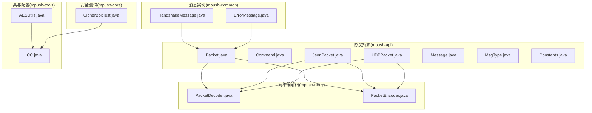
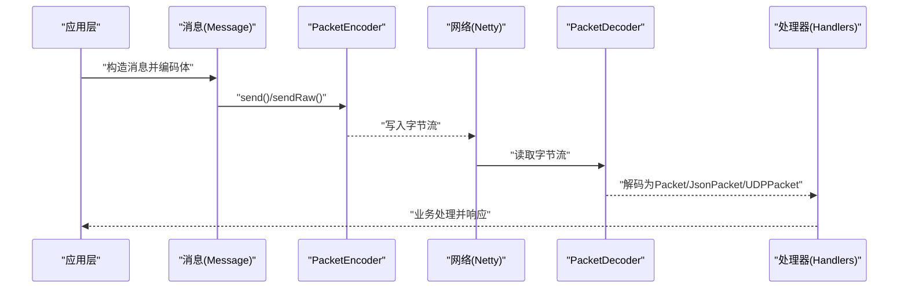
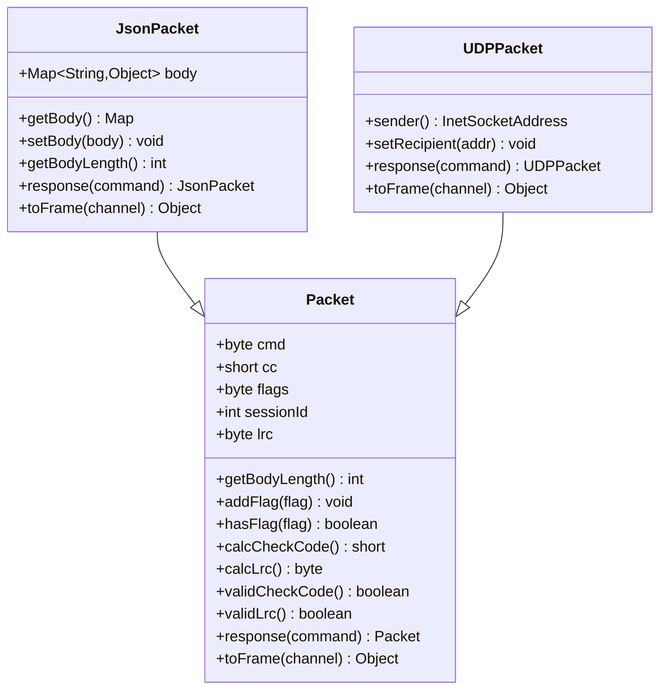
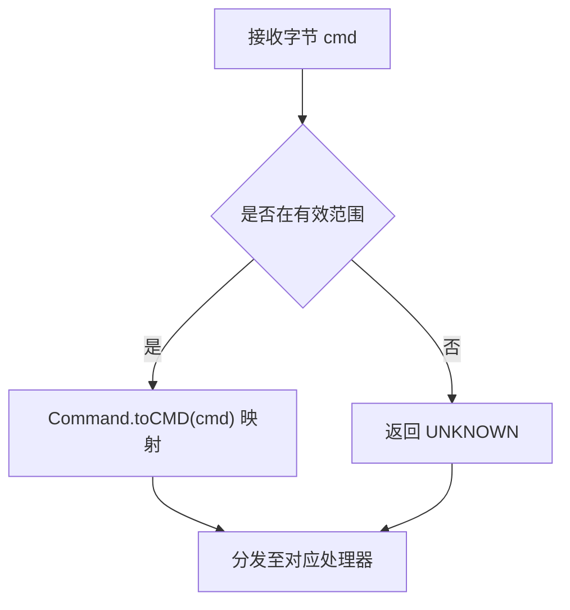
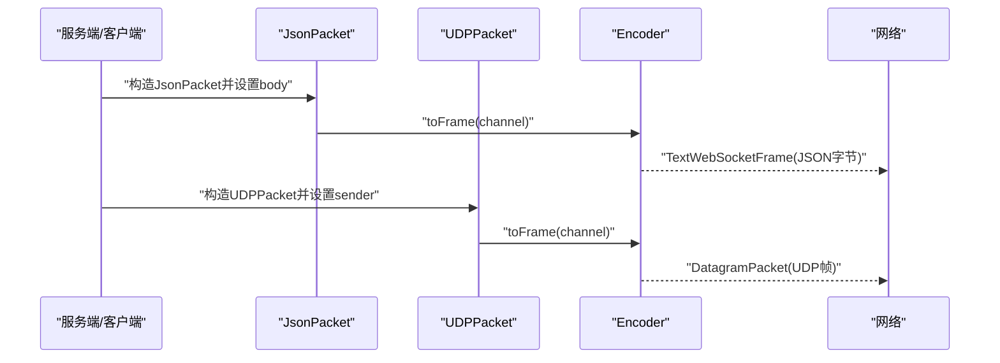
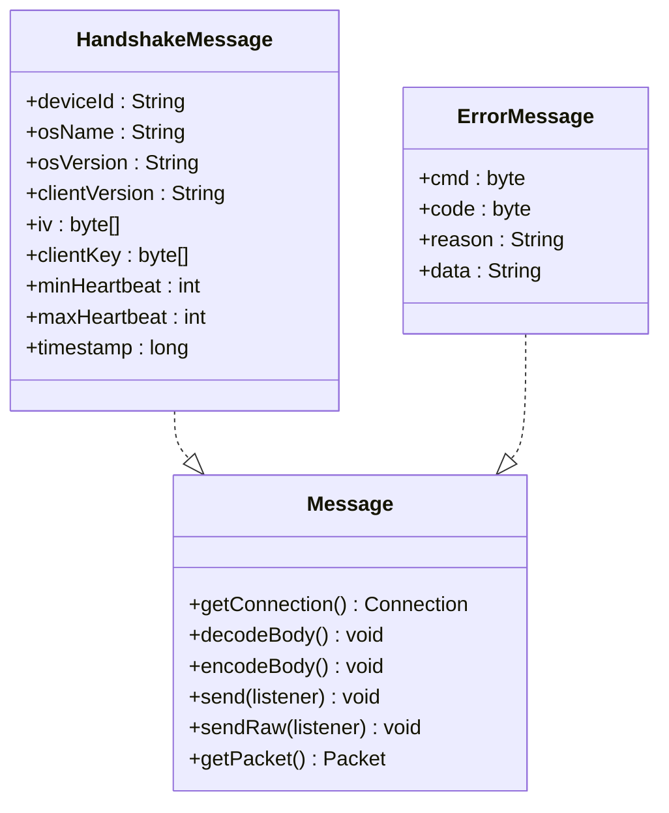
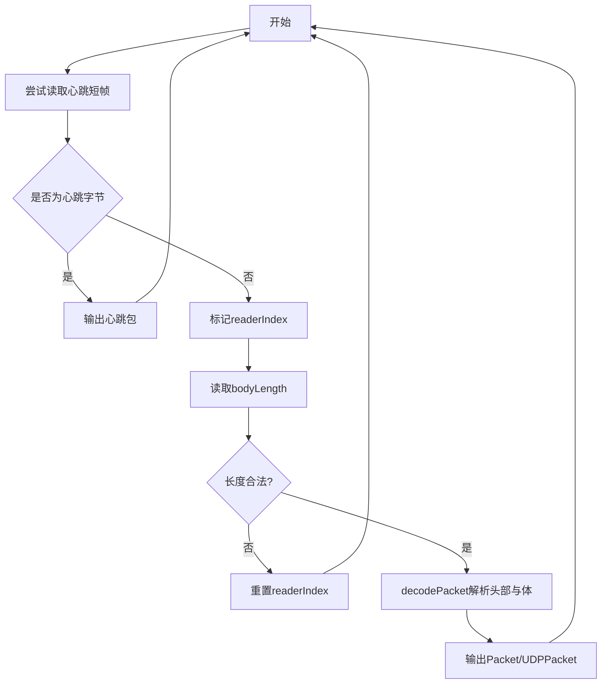
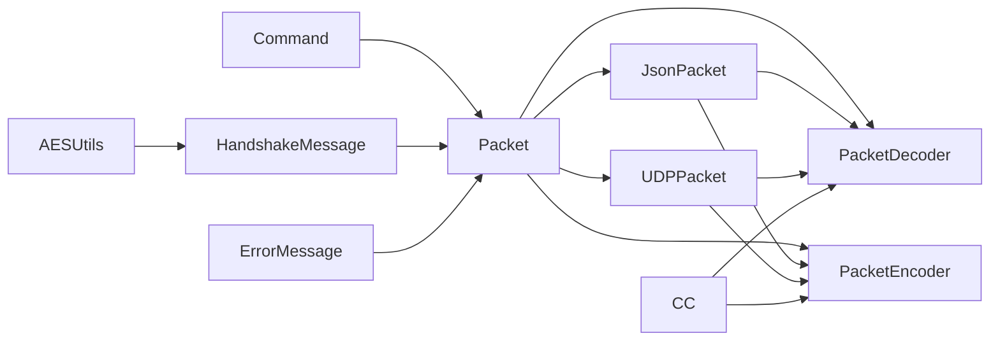

# 消息协议定义

<cite>
**本文引用的文件**   
- [Packet.java](file://mpush-api/src/main/java/com/mpush/api/protocol/Packet.java)
- [Command.java](file://mpush-api/src/main/java/com/mpush/api/protocol/Command.java)
- [JsonPacket.java](file://mpush-api/src/main/java/com/mpush/api/protocol/JsonPacket.java)
- [UDPPacket.java](file://mpush-api/src/main/java/com/mpush/api/protocol/UDPPacket.java)
- [Message.java](file://mpush-api/src/main/java/com/mpush/api/message/Message.java)
- [MsgType.java](file://mpush-api/src/main/java/com/mpush/api/push/MsgType.java)
- [Constants.java](file://mpush-api/src/main/java/com/mpush/api/Constants.java)
- [PacketDecoder.java](file://mpush-netty/src/main/java/com/mpush/netty/codec/PacketDecoder.java)
- [PacketEncoder.java](file://mpush-netty/src/main/java/com/mpush/netty/codec/PacketEncoder.java)
- [HandshakeMessage.java](file://mpush-common/src/main/java/com/mpush/common/message/HandshakeMessage.java)
- [ErrorMessage.java](file://mpush-common/src/main/java/com/mpush/common/message/ErrorMessage.java)
- [AESUtils.java](file://mpush-tools/src/main/java/com/mpush/tools/crypto/AESUtils.java)
- [CC.java](file://mpush-tools/src/main/java/com/mpush/tools/config/CC.java)
- [CipherBoxTest.java](file://mpush-core/src/test/java/com/mpush/core/security/CipherBoxTest.java)
</cite>

## 目录
1. [简介](#简介)
2. [项目结构](#项目结构)
3. [核心组件](#核心组件)
4. [架构总览](#架构总览)
5. [详细组件分析](#详细组件分析)
6. [依赖分析](#依赖分析)
7. [性能考虑](#性能考虑)
8. [故障排查指南](#故障排查指南)
9. [结论](#结论)
10. [附录](#附录)

## 简介
本文件为 MPush 消息协议的权威参考，覆盖 TCP/UDP/WebSocket 三类传输形态，系统化阐述 Packet 协议的数据结构与字段语义、Command 命令类型与用途、JsonPacket 与 UDPPacket 的实现差异与适用场景，并给出 Message 消息格式规范、协议版本兼容性与升级建议、解析示例与调试技巧，以及安全机制与性能优化策略。

## 项目结构
协议相关代码主要分布在以下模块：
- mpush-api：协议抽象（Packet、Command、JsonPacket、UDPPacket、Message、常量）
- mpush-netty：编解码器（PacketDecoder、PacketEncoder）
- mpush-common：消息实体与握手、错误等消息体编解码示例
- mpush-tools：配置中心（CC）与加解密工具（AESUtils）
- mpush-core：安全测试（CipherBoxTest）

**图示来源**
- [Packet.java](file://mpush-api/src/main/java/com/mpush/api/protocol/Packet.java#L35-L186)
- [Command.java](file://mpush-api/src/main/java/com/mpush/api/protocol/Command.java#L27-L65)
- [JsonPacket.java](file://mpush-api/src/main/java/com/mpush/api/protocol/JsonPacket.java#L37-L95)
- [UDPPacket.java](file://mpush-api/src/main/java/com/mpush/api/protocol/UDPPacket.java#L35-L82)
- [Message.java](file://mpush-api/src/main/java/com/mpush/api/message/Message.java#L31-L54)
- [MsgType.java](file://mpush-api/src/main/java/com/mpush/api/push/MsgType.java#L3-L22)
- [Constants.java](file://mpush-api/src/main/java/com/mpush/api/Constants.java#L30-L42)
- [PacketDecoder.java](file://mpush-netty/src/main/java/com/mpush/netty/codec/PacketDecoder.java#L44-L106)
- [PacketEncoder.java](file://mpush-netty/src/main/java/com/mpush/netty/codec/PacketEncoder.java#L38-L46)
- [HandshakeMessage.java](file://mpush-common/src/main/java/com/mpush/common/message/HandshakeMessage.java#L42-L84)
- [ErrorMessage.java](file://mpush-common/src/main/java/com/mpush/common/message/ErrorMessage.java#L42-L87)
- [AESUtils.java](file://mpush-tools/src/main/java/com/mpush/tools/crypto/AESUtils.java#L41-L95)
- [CC.java](file://mpush-tools/src/main/java/com/mpush/tools/config/CC.java#L180-L211)
- [CipherBoxTest.java](file://mpush-core/src/test/java/com/mpush/core/security/CipherBoxTest.java#L30-L49)

**章节来源**
- [Packet.java](file://mpush-api/src/main/java/com/mpush/api/protocol/Packet.java#L35-L186)
- [PacketDecoder.java](file://mpush-netty/src/main/java/com/mpush/netty/codec/PacketDecoder.java#L44-L106)
- [PacketEncoder.java](file://mpush-netty/src/main/java/com/mpush/netty/codec/PacketEncoder.java#L38-L46)

## 核心组件
- Packet：统一的二进制帧结构，承载命令、标志位、会话 ID、校验与消息体；支持 TCP/UDP 心跳短帧与通用长帧。
- Command：命令枚举，覆盖握手、登录、心跳、推送、群组、ACK/NACK、HTTP 代理等。
- JsonPacket：基于 WebSocket 的 JSON 文本帧，自动设置 JSON 身体标志位。
- UDPPacket：基于 UDP 的数据报帧，携带发送方地址并在 toFrame 中封装为 DatagramPacket。
- Message：消息接口，定义连接、编解码体、发送与原始发送等能力。
- 编解码器：PacketDecoder/Encoder 实现二进制帧的拆包与封包。

**章节来源**
- [Packet.java](file://mpush-api/src/main/java/com/mpush/api/protocol/Packet.java#L35-L186)
- [Command.java](file://mpush-api/src/main/java/com/mpush/api/protocol/Command.java#L27-L65)
- [JsonPacket.java](file://mpush-api/src/main/java/com/mpush/api/protocol/JsonPacket.java#L37-L95)
- [UDPPacket.java](file://mpush-api/src/main/java/com/mpush/api/protocol/UDPPacket.java#L35-L82)
- [Message.java](file://mpush-api/src/main/java/com/mpush/api/message/Message.java#L31-L54)
- [PacketDecoder.java](file://mpush-netty/src/main/java/com/mpush/netty/codec/PacketDecoder.java#L44-L106)
- [PacketEncoder.java](file://mpush-netty/src/main/java/com/mpush/netty/codec/PacketEncoder.java#L38-L46)

## 架构总览
下图展示从应用层到网络层的消息流转与协议交互：

**图示来源**
- [PacketEncoder.java](file://mpush-netty/src/main/java/com/mpush/netty/codec/PacketEncoder.java#L38-L46)
- [PacketDecoder.java](file://mpush-netty/src/main/java/com/mpush/netty/codec/PacketDecoder.java#L44-L106)
- [Message.java](file://mpush-api/src/main/java/com/mpush/api/message/Message.java#L31-L54)
- [Packet.java](file://mpush-api/src/main/java/com/mpush/api/protocol/Packet.java#L154-L169)

## 详细组件分析

### Packet 协议数据结构与字段
- 帧头布局（TCP/UDP 长帧）：长度(4) + 命令(1) + 校验码(2) + 标志位(1) + 会话ID(4) + LRC(1) + 体(n)
- 心跳短帧：仅一个字节标识，用于低开销保活
- 关键字段
  - cmd：命令类型（来自 Command）
  - flags：特性位，含加密、压缩、业务应答、自动应答、JSON 体等
  - sessionId：客户端生成的会话标识，用于请求-响应配对
  - lrc：对头部除 LRC 外的异或校验
  - body：消息体，可为二进制或 JSON Map
- 编解码
  - 编码：encodePacket 将 Packet 写入 ByteBuf；心跳走短帧路径
  - 解码：decodePacket 从 ByteBuf 读取并填充字段；支持 UDP/JSON 解析

**图示来源**
- [Packet.java](file://mpush-api/src/main/java/com/mpush/api/protocol/Packet.java#L35-L186)
- [JsonPacket.java](file://mpush-api/src/main/java/com/mpush/api/protocol/JsonPacket.java#L37-L95)
- [UDPPacket.java](file://mpush-api/src/main/java/com/mpush/api/protocol/UDPPacket.java#L35-L82)

**章节来源**
- [Packet.java](file://mpush-api/src/main/java/com/mpush/api/protocol/Packet.java#L35-L186)
- [PacketDecoder.java](file://mpush-netty/src/main/java/com/mpush/netty/codec/PacketDecoder.java#L79-L101)
- [PacketEncoder.java](file://mpush-netty/src/main/java/com/mpush/netty/codec/PacketEncoder.java#L38-L46)

### Command 命令类型与用途
- 分类与典型用途
  - 连接与会话：HEARTBEAT、HANDSHAKE、LOGIN、LOGOUT、FAST_CONNECT
  - 绑定与路由：BIND、UNBIND、PAUSE、RESUME
  - 推送与通知：PUSH、GATEWAY_PUSH、NOTIFICATION、GATEWAY_NOTIFICATION、CHAT、GATEWAY_CHAT、GROUP、GATEWAY_GROUP
  - 应答与控制：ACK、NACK、ERROR、OK、KICK、GATEWAY_KICK、HTTP_PROXY
- 查询与映射：提供 toCMD 将字节映射为枚举，UNKNOWN 表示未知命令

**图示来源**
- [Command.java](file://mpush-api/src/main/java/com/mpush/api/protocol/Command.java#L27-L65)

**章节来源**
- [Command.java](file://mpush-api/src/main/java/com/mpush/api/protocol/Command.java#L27-L65)

### JsonPacket 与 UDPPacket 实现细节
- JsonPacket
  - 特性：自动添加 JSON 体标志位；toFrame 将自身序列化为 UTF-8 字节数组并包装为 WebSocket 文本帧
  - 适用：WebSocket 场景下的文本协议，便于调试与跨语言互通
- UDPPacket
  - 特性：携带 InetSocketAddress；toFrame 将帧编码为 DatagramPacket
  - 适用：UDP 心跳与小包快速传输场景

**图示来源**
- [JsonPacket.java](file://mpush-api/src/main/java/com/mpush/api/protocol/JsonPacket.java#L78-L82)
- [UDPPacket.java](file://mpush-api/src/main/java/com/mpush/api/protocol/UDPPacket.java#L75-L81)
- [PacketEncoder.java](file://mpush-netty/src/main/java/com/mpush/netty/codec/PacketEncoder.java#L38-L46)

**章节来源**
- [JsonPacket.java](file://mpush-api/src/main/java/com/mpush/api/protocol/JsonPacket.java#L37-L95)
- [UDPPacket.java](file://mpush-api/src/main/java/com/mpush/api/protocol/UDPPacket.java#L35-L82)

### Message 消息格式规范
- 接口职责
  - 获取连接、解码体、编码体、发送（可选压缩/加密）、原始发送
- 典型实现参考
  - 握手消息：包含设备信息、操作系统、客户端版本、密钥材料、心跳区间、时间戳等字段，按顺序编码/解码
  - 错误消息：包含命令、错误码、原因、附加数据，支持二进制与 JSON 两种体格式

**图示来源**
- [Message.java](file://mpush-api/src/main/java/com/mpush/api/message/Message.java#L31-L54)
- [HandshakeMessage.java](file://mpush-common/src/main/java/com/mpush/common/message/HandshakeMessage.java#L42-L84)
- [ErrorMessage.java](file://mpush-common/src/main/java/com/mpush/common/message/ErrorMessage.java#L42-L87)

**章节来源**
- [Message.java](file://mpush-api/src/main/java/com/mpush/api/message/Message.java#L31-L54)
- [HandshakeMessage.java](file://mpush-common/src/main/java/com/mpush/common/message/HandshakeMessage.java#L42-L84)
- [ErrorMessage.java](file://mpush-common/src/main/java/com/mpush/common/message/ErrorMessage.java#L42-L87)

### 协议版本兼容性与升级指南
- 版本维度
  - 协议版本：通过 Command 枚举扩展新增命令；现有命令语义保持稳定
  - 客户端版本：握手消息中携带 clientVersion，服务端据此做兼容性判断
- 升级建议
  - 新增命令：在 Command 中追加枚举值，确保 cmd 字节值唯一且不与历史冲突
  - 向后兼容：新增字段采用可选编码/解码策略，旧版本忽略未知字段
  - 强制变更：通过最小/最大心跳等参数引导客户端升级

**章节来源**
- [Command.java](file://mpush-api/src/main/java/com/mpush/api/protocol/Command.java#L27-L65)
- [HandshakeMessage.java](file://mpush-common/src/main/java/com/mpush/common/message/HandshakeMessage.java#L42-L84)

### 协议解析示例与调试技巧
- TCP/UDP 解析流程
  - 解码器先尝试识别心跳短帧，再按长帧格式解析头部与体
  - 对于 UDP：从 DatagramPacket 提取内容并按长帧解析
  - 对于 JSON：将字符串反序列化为 JsonPacket
- 调试要点
  - 打印帧头字段与 body 长度，核对校验与 LRC
  - 使用 JsonPacket 观察 JSON 体结构，便于前端联调
  - 在高并发场景下关注最大包大小限制与缓冲区水位

**图示来源**
- [PacketDecoder.java](file://mpush-netty/src/main/java/com/mpush/netty/codec/PacketDecoder.java#L47-L91)

**章节来源**
- [PacketDecoder.java](file://mpush-netty/src/main/java/com/mpush/netty/codec/PacketDecoder.java#L44-L106)

### 安全机制与性能优化策略
- 安全机制
  - 握手阶段协商密钥材料（iv、clientKey），结合 AES 加解密
  - 通过标志位启用加密与压缩，降低明文暴露风险
  - 配置中心提供密钥与算法参数，便于集中管理
- 性能优化
  - 心跳短帧避免频繁大包开销
  - 体校验与 LRC 校验提升可靠性，减少重复传输
  - 编解码器复用与缓冲池化，降低 GC 压力
  - 可配置的最大包大小与流量整形参数，保障稳定性

**章节来源**
- [HandshakeMessage.java](file://mpush-common/src/main/java/com/mpush/common/message/HandshakeMessage.java#L42-L84)
- [AESUtils.java](file://mpush-tools/src/main/java/com/mpush/tools/crypto/AESUtils.java#L41-L95)
- [CC.java](file://mpush-tools/src/main/java/com/mpush/tools/config/CC.java#L180-L211)
- [Packet.java](file://mpush-api/src/main/java/com/mpush/api/protocol/Packet.java#L35-L186)

## 依赖分析
- 组件耦合
  - Packet 作为协议基类被 JsonPacket/UDPPacket 继承，扩展不同传输语义
  - 编解码器依赖 Packet 的静态编解码方法，实现与协议强耦合
  - 消息实现依赖 Packet 以统一请求-响应模型
- 外部依赖
  - Netty ByteBuf、DatagramPacket、WebSocket Frame
  - 工具库 Jsons、CC 配置中心

**图示来源**
- [Command.java](file://mpush-api/src/main/java/com/mpush/api/protocol/Command.java#L27-L65)
- [Packet.java](file://mpush-api/src/main/java/com/mpush/api/protocol/Packet.java#L35-L186)
- [JsonPacket.java](file://mpush-api/src/main/java/com/mpush/api/protocol/JsonPacket.java#L37-L95)
- [UDPPacket.java](file://mpush-api/src/main/java/com/mpush/api/protocol/UDPPacket.java#L35-L82)
- [PacketDecoder.java](file://mpush-netty/src/main/java/com/mpush/netty/codec/PacketDecoder.java#L44-L106)
- [PacketEncoder.java](file://mpush-netty/src/main/java/com/mpush/netty/codec/PacketEncoder.java#L38-L46)
- [HandshakeMessage.java](file://mpush-common/src/main/java/com/mpush/common/message/HandshakeMessage.java#L42-L84)
- [ErrorMessage.java](file://mpush-common/src/main/java/com/mpush/common/message/ErrorMessage.java#L42-L87)
- [AESUtils.java](file://mpush-tools/src/main/java/com/mpush/tools/crypto/AESUtils.java#L41-L95)
- [CC.java](file://mpush-tools/src/main/java/com/mpush/tools/config/CC.java#L180-L211)

**章节来源**
- [Packet.java](file://mpush-api/src/main/java/com/mpush/api/protocol/Packet.java#L35-L186)
- [PacketDecoder.java](file://mpush-netty/src/main/java/com/mpush/netty/codec/PacketDecoder.java#L44-L106)
- [PacketEncoder.java](file://mpush-netty/src/main/java/com/mpush/netty/codec/PacketEncoder.java#L38-L46)

## 性能考虑
- 编解码效率
  - 避免不必要的对象拷贝，优先复用 ByteBuf
  - 使用静态编解码方法减少分支判断
- 网络传输
  - 心跳短帧降低带宽占用
  - UDP 小包适合高频低负载场景
- 资源控制
  - 最大包大小限制防止内存压力
  - 流量整形与缓冲区水位阈值保障稳定性

[本节为通用指导，无需特定文件来源]

## 故障排查指南
- 常见问题定位
  - 校验失败：检查 cc 与 LRC 计算逻辑，确认 body 未被篡改
  - 包体过大：调整最大包大小配置，或拆分消息
  - UDP 丢包：切换 TCP 或增加重传与 ACK
  - 握手异常：核对 iv、clientKey、时间戳与心跳区间
- 调试建议
  - 打印帧头字段与 body 长度，比对预期
  - 使用 JsonPacket 观察 JSON 体，便于前后端联调
  - 在高并发场景下监控缓冲区与线程池状态

**章节来源**
- [Packet.java](file://mpush-api/src/main/java/com/mpush/api/protocol/Packet.java#L118-L124)
- [PacketDecoder.java](file://mpush-netty/src/main/java/com/mpush/netty/codec/PacketDecoder.java#L82-L87)
- [HandshakeMessage.java](file://mpush-common/src/main/java/com/mpush/common/message/HandshakeMessage.java#L42-L84)
- [ErrorMessage.java](file://mpush-common/src/main/java/com/mpush/common/message/ErrorMessage.java#L42-L87)

## 结论
MPush 协议以 Packet 为核心，通过 Command 统一命令语义，配合 JsonPacket/UDPPacket 支持多传输形态；借助编解码器与消息接口形成清晰的分层架构。在安全方面，握手阶段完成密钥协商并可启用加密/压缩；在性能方面，心跳短帧与可配置限流保障了低延迟与高吞吐。遵循本文档的解析与优化建议，可高效构建稳定可靠的推送系统。

[本节为总结性内容，无需特定文件来源]

## 附录
- 常用常量
  - UTF-8 编码、空字节数组、踢人频道前缀等
- 消息类型
  - 通知、消息、组合类型，用于区分推送行为

**章节来源**
- [Constants.java](file://mpush-api/src/main/java/com/mpush/api/Constants.java#L30-L42)
- [MsgType.java](file://mpush-api/src/main/java/com/mpush/api/push/MsgType.java#L3-L22)