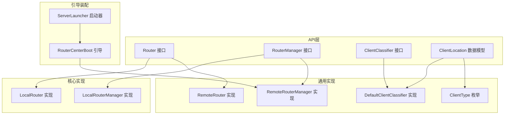
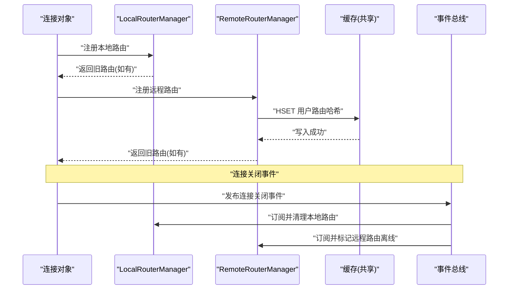
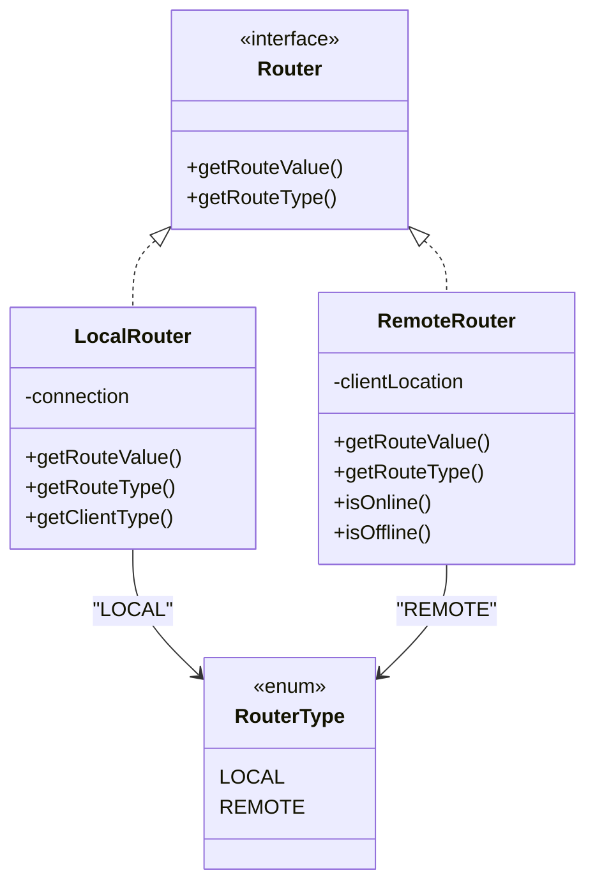
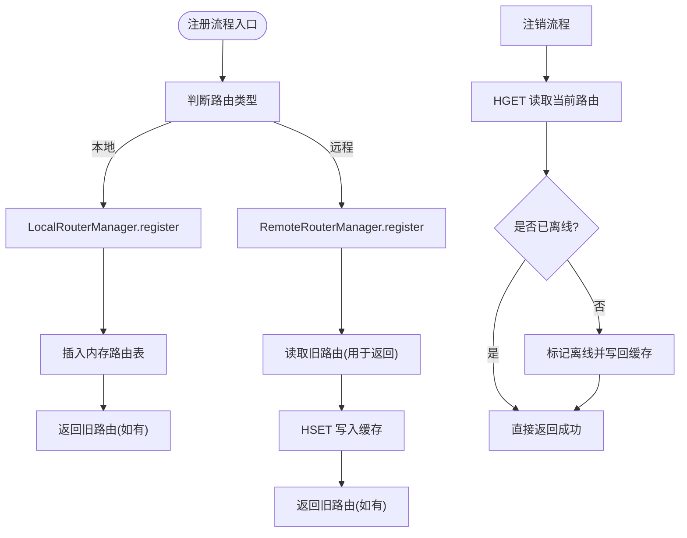
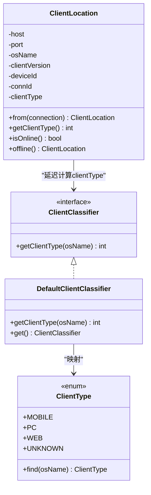
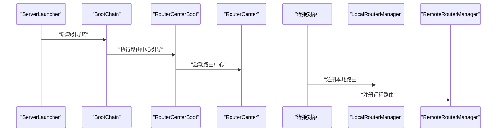
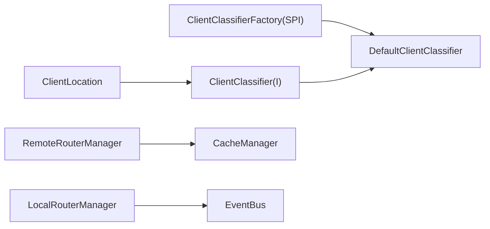

# 路由API接口

<cite>
**本文引用的文件**
- [Router.java](file://mpush-api/src/main/java/com/mpush/api/router/Router.java)
- [RouterManager.java](file://mpush-api/src/main/java/com/mpush/api/router/RouterManager.java)
- [ClientClassifier.java](file://mpush-api/src/main/java/com/mpush/api/router/ClientClassifier.java)
- [ClientLocation.java](file://mpush-api/src/main/java/com/mpush/api/router/ClientLocation.java)
- [ClientClassifierFactory.java](file://mpush-api/src/main/java/com/mpush/api/spi/router/ClientClassifierFactory.java)
- [DefaultClientClassifier.java](file://mpush-common/src/main/java/com/mpush/common/router/DefaultClientClassifier.java)
- [ClientType.java](file://mpush-common/src/main/java/com/mpush/common/router/ClientType.java)
- [LocalRouter.java](file://mpush-core/src/main/java/com/mpush/core/router/LocalRouter.java)
- [LocalRouterManager.java](file://mpush-core/src/main/java/com/mpush/core/router/LocalRouterManager.java)
- [RemoteRouter.java](file://mpush-common/src/main/java/com/mpush/common/router/RemoteRouter.java)
- [RemoteRouterManager.java](file://mpush-common/src/main/java/com/mpush/common/router/RemoteRouterManager.java)
- [RouterCenterBoot.java](file://mpush-boot/src/main/java/com/mpush/bootstrap/job/RouterCenterBoot.java)
- [ServerLauncher.java](file://mpush-boot/src/main/java/com/mpush/bootstrap/ServerLauncher.java)
- [META-INF服务定义：ClientClassifierFactory](file://mpush-common/src/main/resources/META-INF/services/com.mpush.api.spi.router.ClientClassifierFactory)
</cite>

## 目录
1. [简介](#简介)
2. [项目结构](#项目结构)
3. [核心组件](#核心组件)
4. [架构总览](#架构总览)
5. [详细组件分析](#详细组件分析)
6. [依赖分析](#依赖分析)
7. [性能考虑](#性能考虑)
8. [故障排除指南](#故障排除指南)
9. [结论](#结论)
10. [附录](#附录)

## 简介
本文件为 MPush 路由API接口的权威参考文档，聚焦于 Router 路由接口、RouterManager 路由管理器、ClientClassifier 客户端分类器以及 ClientLocation 客户端位置信息的接口设计与实现机制。文档从路由查找、路由更新、路由失效处理等核心能力出发，结合本地与远程两种路由类型，阐述其在接入层、推送中心与服务发现/注册之间的集成方式，并提供配置示例、性能优化与负载均衡最佳实践及故障排除建议。

## 项目结构
围绕路由API的关键模块分布如下：
- mpush-api：定义路由与分类的公共接口（Router、RouterManager、ClientClassifier、ClientLocation）
- mpush-common：默认实现与通用工具（DefaultClientClassifier、ClientType、RemoteRouter、RemoteRouterManager）
- mpush-core：核心实现（LocalRouter、LocalRouterManager）
- mpush-boot：启动装配（RouterCenterBoot、ServerLauncher）

**图表来源**
- [Router.java](file://mpush-api/src/main/java/com/mpush/api/router/Router.java#L27-L37)
- [RouterManager.java](file://mpush-api/src/main/java/com/mpush/api/router/RouterManager.java#L29-L65)
- [ClientClassifier.java](file://mpush-api/src/main/java/com/mpush/api/router/ClientClassifier.java#L29-L33)
- [ClientLocation.java](file://mpush-api/src/main/java/com/mpush/api/router/ClientLocation.java#L30-L192)
- [DefaultClientClassifier.java](file://mpush-common/src/main/java/com/mpush/common/router/DefaultClientClassifier.java#L31-L43)
- [ClientType.java](file://mpush-common/src/main/java/com/mpush/common/router/ClientType.java#L29-L58)
- [LocalRouter.java](file://mpush-core/src/main/java/com/mpush/core/router/LocalRouter.java#L30-L71)
- [LocalRouterManager.java](file://mpush-core/src/main/java/com/mpush/core/router/LocalRouterManager.java#L45-L115)
- [RemoteRouter.java](file://mpush-common/src/main/java/com/mpush/common/router/RemoteRouter.java#L30-L59)
- [RemoteRouterManager.java](file://mpush-common/src/main/java/com/mpush/common/router/RemoteRouterManager.java#L46-L124)
- [RouterCenterBoot.java](file://mpush-boot/src/main/java/com/mpush/bootstrap/job/RouterCenterBoot.java#L29-L46)
- [ServerLauncher.java](file://mpush-boot/src/main/java/com/mpush/bootstrap/ServerLauncher.java#L43-L66)

**章节来源**
- [Router.java](file://mpush-api/src/main/java/com/mpush/api/router/Router.java#L27-L37)
- [RouterManager.java](file://mpush-api/src/main/java/com/mpush/api/router/RouterManager.java#L29-L65)
- [ClientClassifier.java](file://mpush-api/src/main/java/com/mpush/api/router/ClientClassifier.java#L29-L33)
- [ClientLocation.java](file://mpush-api/src/main/java/com/mpush/api/router/ClientLocation.java#L30-L192)
- [DefaultClientClassifier.java](file://mpush-common/src/main/java/com/mpush/common/router/DefaultClientClassifier.java#L31-L43)
- [ClientType.java](file://mpush-common/src/main/java/com/mpush/common/router/ClientType.java#L29-L58)
- [LocalRouter.java](file://mpush-core/src/main/java/com/mpush/core/router/LocalRouter.java#L30-L71)
- [LocalRouterManager.java](file://mpush-core/src/main/java/com/mpush/core/router/LocalRouterManager.java#L45-L115)
- [RemoteRouter.java](file://mpush-common/src/main/java/com/mpush/common/router/RemoteRouter.java#L30-L59)
- [RemoteRouterManager.java](file://mpush-common/src/main/java/com/mpush/common/router/RemoteRouterManager.java#L46-L124)
- [RouterCenterBoot.java](file://mpush-boot/src/main/java/com/mpush/bootstrap/job/RouterCenterBoot.java#L29-L46)
- [ServerLauncher.java](file://mpush-boot/src/main/java/com/mpush/bootstrap/ServerLauncher.java#L43-L66)

## 核心组件
- Router 接口：抽象路由值与路由类型（LOCAL/REMOTE），用于封装连接或远端位置信息。
- RouterManager 接口：统一的路由注册、注销、查询能力，支持按用户与设备类型检索。
- ClientClassifier 接口：客户端类型分类器，通过 SPI 工厂加载，默认实现基于 ClientType 枚举映射。
- ClientLocation 数据模型：封装客户端主机、端口、系统名、版本、设备ID、连接ID等，提供在线/离线判定与序列化。

**章节来源**
- [Router.java](file://mpush-api/src/main/java/com/mpush/api/router/Router.java#L27-L37)
- [RouterManager.java](file://mpush-api/src/main/java/com/mpush/api/router/RouterManager.java#L29-L65)
- [ClientClassifier.java](file://mpush-api/src/main/java/com/mpush/api/router/ClientClassifier.java#L29-L33)
- [ClientLocation.java](file://mpush-api/src/main/java/com/mpush/api/router/ClientLocation.java#L30-L192)

## 架构总览
路由体系分为本地与远程两类：
- 本地路由（LocalRouter/LocalRouterManager）：驻留在当前节点内存中，面向本机连接，负责即时推送与事件清理。
- 远程路由（RemoteRouter/RemoteRouterManager）：存储于共享缓存（Redis），面向跨节点场景，支持高可用与横向扩展。

**图表来源**
- [LocalRouterManager.java](file://mpush-core/src/main/java/com/mpush/core/router/LocalRouterManager.java#L54-L77)
- [RemoteRouterManager.java](file://mpush-common/src/main/java/com/mpush/common/router/RemoteRouterManager.java#L51-L95)
- [LocalRouterManager.java](file://mpush-core/src/main/java/com/mpush/core/router/LocalRouterManager.java#L88-L114)
- [RemoteRouterManager.java](file://mpush-common/src/main/java/com/mpush/common/router/RemoteRouterManager.java#L102-L123)

## 详细组件分析

### Router 接口与实现
- 设计要点
  - 统一抽象路由值与路由类型，便于上层以一致方式处理本地/远程路由。
  - RouterType 提供 LOCAL 与 REMOTE 两种类型，配合具体实现决定数据来源与处理策略。
- 关键实现
  - LocalRouter：包装本地连接，路由值为 Connection，路由类型为 LOCAL。
  - RemoteRouter：包装 ClientLocation，路由值为 ClientLocation，路由类型为 REMOTE。

**图表来源**
- [Router.java](file://mpush-api/src/main/java/com/mpush/api/router/Router.java#L27-L37)
- [LocalRouter.java](file://mpush-core/src/main/java/com/mpush/core/router/LocalRouter.java#L30-L71)
- [RemoteRouter.java](file://mpush-common/src/main/java/com/mpush/common/router/RemoteRouter.java#L30-L59)

**章节来源**
- [Router.java](file://mpush-api/src/main/java/com/mpush/api/router/Router.java#L27-L37)
- [LocalRouter.java](file://mpush-core/src/main/java/com/mpush/core/router/LocalRouter.java#L30-L71)
- [RemoteRouter.java](file://mpush-common/src/main/java/com/mpush/common/router/RemoteRouter.java#L30-L59)

### RouterManager 接口与实现
- 设计要点
  - 统一的注册/注销/查询接口，屏蔽本地与远程差异。
  - 支持按用户ID与客户端类型进行精确查询。
- 关键实现
  - LocalRouterManager：基于并发Map维护本地路由，事件驱动清理失效路由。
  - RemoteRouterManager：基于缓存键空间维护远程路由，原子性不足时采用非原子写并记录日志。

**图表来源**
- [RouterManager.java](file://mpush-api/src/main/java/com/mpush/api/router/RouterManager.java#L29-L65)
- [LocalRouterManager.java](file://mpush-core/src/main/java/com/mpush/core/router/LocalRouterManager.java#L54-L77)
- [RemoteRouterManager.java](file://mpush-common/src/main/java/com/mpush/common/router/RemoteRouterManager.java#L51-L95)
- [RemoteRouterManager.java](file://mpush-common/src/main/java/com/mpush/common/router/RemoteRouterManager.java#L69-L78)

**章节来源**
- [RouterManager.java](file://mpush-api/src/main/java/com/mpush/api/router/RouterManager.java#L29-L65)
- [LocalRouterManager.java](file://mpush-core/src/main/java/com/mpush/core/router/LocalRouterManager.java#L45-L115)
- [RemoteRouterManager.java](file://mpush-common/src/main/java/com/mpush/common/router/RemoteRouterManager.java#L46-L124)

### ClientClassifier 客户端分类器与 ClientLocation
- 设计要点
  - ClientClassifier 通过 SPI 工厂加载，默认实现 DefaultClientClassifier 基于 ClientType 枚举进行系统名到客户端类型的映射。
  - ClientLocation 封装客户端网络与元数据信息，提供在线/离线判定、序列化与比较逻辑；客户端类型延迟计算并通过 ClientClassifier 获取。
- 使用场景
  - 设备类型：移动端、PC、WEB、未知。
  - 操作系统：android/ios/windows/mac/linux/web/h5 等。
  - 地理位置：可结合外部地理解析服务扩展（本仓库未内置）。

**图表来源**
- [ClientClassifier.java](file://mpush-api/src/main/java/com/mpush/api/router/ClientClassifier.java#L29-L33)
- [DefaultClientClassifier.java](file://mpush-common/src/main/java/com/mpush/common/router/DefaultClientClassifier.java#L31-L43)
- [ClientType.java](file://mpush-common/src/main/java/com/mpush/common/router/ClientType.java#L29-L58)
- [ClientLocation.java](file://mpush-api/src/main/java/com/mpush/api/router/ClientLocation.java#L30-L192)

**章节来源**
- [ClientClassifier.java](file://mpush-api/src/main/java/com/mpush/api/router/ClientClassifier.java#L29-L33)
- [DefaultClientClassifier.java](file://mpush-common/src/main/java/com/mpush/common/router/DefaultClientClassifier.java#L31-L43)
- [ClientType.java](file://mpush-common/src/main/java/com/mpush/common/router/ClientType.java#L29-L58)
- [ClientLocation.java](file://mpush-api/src/main/java/com/mpush/api/router/ClientLocation.java#L30-L192)

### 路由API与其他模块的集成
- 与接入层集成
  - 连接建立后，根据会话上下文生成 ClientLocation，并选择 LocalRouter 或 RemoteRouter 注册至对应 RouterManager。
- 与事件总线集成
  - 订阅连接关闭事件，自动清理本地/远程路由，避免脏数据。
- 与服务发现/注册集成
  - 通过引导任务 RouterCenterBoot 启动路由中心，配合服务注册与发现模块实现跨节点路由同步。

**图表来源**
- [ServerLauncher.java](file://mpush-boot/src/main/java/com/mpush/bootstrap/ServerLauncher.java#L43-L66)
- [RouterCenterBoot.java](file://mpush-boot/src/main/java/com/mpush/bootstrap/job/RouterCenterBoot.java#L29-L46)
- [LocalRouterManager.java](file://mpush-core/src/main/java/com/mpush/core/router/LocalRouterManager.java#L54-L77)
- [RemoteRouterManager.java](file://mpush-common/src/main/java/com/mpush/common/router/RemoteRouterManager.java#L51-L95)

**章节来源**
- [ServerLauncher.java](file://mpush-boot/src/main/java/com/mpush/bootstrap/ServerLauncher.java#L43-L66)
- [RouterCenterBoot.java](file://mpush-boot/src/main/java/com/mpush/bootstrap/job/RouterCenterBoot.java#L29-L46)
- [LocalRouterManager.java](file://mpush-core/src/main/java/com/mpush/core/router/LocalRouterManager.java#L45-L115)
- [RemoteRouterManager.java](file://mpush-common/src/main/java/com/mpush/common/router/RemoteRouterManager.java#L46-L124)

## 依赖分析
- SPI 与服务加载
  - ClientClassifier 通过 ClientClassifierFactory 的 SPI 加载，默认实现为 DefaultClientClassifier。
  - 服务定义文件位于资源目录，声明默认实现类。
- 组件耦合
  - LocalRouterManager 与 RemoteRouterManager 分别依赖事件总线与缓存管理器，职责清晰、低耦合。
  - ClientLocation 依赖 ClientClassifier 以延迟计算客户端类型，避免重复计算与强耦合。

**图表来源**
- [ClientClassifierFactory.java](file://mpush-api/src/main/java/com/mpush/api/spi/router/ClientClassifierFactory.java#L31-L35)
- [DefaultClientClassifier.java](file://mpush-common/src/main/java/com/mpush/common/router/DefaultClientClassifier.java#L31-L43)
- [ClientLocation.java](file://mpush-api/src/main/java/com/mpush/api/router/ClientLocation.java#L117-L122)
- [RemoteRouterManager.java](file://mpush-common/src/main/java/com/mpush/common/router/RemoteRouterManager.java#L49-L49)
- [LocalRouterManager.java](file://mpush-core/src/main/java/com/mpush/core/router/LocalRouterManager.java#L28-L28)

**章节来源**
- [ClientClassifierFactory.java](file://mpush-api/src/main/java/com/mpush/api/spi/router/ClientClassifierFactory.java#L31-L35)
- [DefaultClientClassifier.java](file://mpush-common/src/main/java/com/mpush/common/router/DefaultClientClassifier.java#L31-L43)
- [ClientLocation.java](file://mpush-api/src/main/java/com/mpush/api/router/ClientLocation.java#L117-L122)
- [RemoteRouterManager.java](file://mpush-common/src/main/java/com/mpush/common/router/RemoteRouterManager.java#L49-L49)
- [LocalRouterManager.java](file://mpush-core/src/main/java/com/mpush/core/router/LocalRouterManager.java#L28-L28)

## 性能考虑
- 路由查找
  - 本地路由：内存Map查找，O(1) 平均复杂度，适合高频、低延迟场景。
  - 远程路由：缓存哈希读取，单字段命中，O(1) 复杂度；注意缓存一致性与网络抖动。
- 路由更新
  - 本地注册/注销：并发安全的 Map 操作，适合高吞吐。
  - 远程注册/注销：当前实现为非原子操作（读-改-写），并发冲突概率低但存在风险；建议后续引入原子脚本或分布式锁。
- 路由失效
  - 通过事件总线监听连接关闭，及时清理本地/远程路由，避免脏数据。
- 负载均衡
  - 建议结合服务发现与多实例部署，按用户ID分片或哈希路由，提升横向扩展能力。
  - 对热点用户可采用本地优先策略，减少跨节点访问。

[本节为通用性能建议，不直接分析具体文件]

## 故障排除指南
- 远程路由注销无效
  - 现象：调用注销后路由仍显示在线。
  - 原因：当前实现为非原子操作，可能并发覆盖导致旧值未被正确标记离线。
  - 处置：确认连接ID匹配后再写回离线状态；必要时升级为原子写。
- 连接关闭后用户状态异常
  - 现象：用户短暂显示为下线。
  - 原因：重连场景下新连接先于旧连接断开，事件清理条件不满足导致误删。
  - 处置：检查连接ID一致性后再清理；确保事件顺序与幂等。
- 客户端类型识别错误
  - 现象：移动端被识别为未知或PC。
  - 原因：系统名字符串不匹配枚举规则。
  - 处置：核对 osName 字段与 ClientType 映射；必要时扩展枚举或自定义分类器。

**章节来源**
- [RemoteRouterManager.java](file://mpush-common/src/main/java/com/mpush/common/router/RemoteRouterManager.java#L61-L78)
- [LocalRouterManager.java](file://mpush-core/src/main/java/com/mpush/core/router/LocalRouterManager.java#L88-L114)
- [ClientType.java](file://mpush-common/src/main/java/com/mpush/common/router/ClientType.java#L43-L57)

## 结论
MPush 路由API通过清晰的接口抽象与本地/远程双栈实现，提供了高内聚、低耦合的路由管理能力。结合事件驱动的失效清理与SPI可插拔的分类器，系统在可扩展性与易用性之间取得平衡。生产环境中建议关注远程路由的原子性与一致性，并结合服务发现与负载均衡策略实现稳定高效的推送服务。

[本节为总结性内容，不直接分析具体文件]

## 附录

### 路由API使用清单
- 路由注册
  - 本地：使用 LocalRouterManager.register(userId, LocalRouter)
  - 远程：使用 RemoteRouterManager.register(userId, RemoteRouter)
- 路由注销
  - 本地：LocalRouterManager.unRegister(userId, clientType)
  - 远程：RemoteRouterManager.unRegister(userId, clientType)
- 路由查询
  - 全量：lookupAll(userId)
  - 指定类型：lookup(userId, clientType)
- 客户端分类
  - 获取类型：ClientClassifier.I.getClientType(osName)
  - 类型枚举：ClientType.MOBILE/PC/WEB/UNKNOWN

**章节来源**
- [RouterManager.java](file://mpush-api/src/main/java/com/mpush/api/router/RouterManager.java#L29-L65)
- [LocalRouterManager.java](file://mpush-core/src/main/java/com/mpush/core/router/LocalRouterManager.java#L54-L77)
- [RemoteRouterManager.java](file://mpush-common/src/main/java/com/mpush/common/router/RemoteRouterManager.java#L51-L95)
- [ClientClassifier.java](file://mpush-api/src/main/java/com/mpush/api/router/ClientClassifier.java#L29-L33)
- [ClientType.java](file://mpush-common/src/main/java/com/mpush/common/router/ClientType.java#L29-L58)

### 配置示例（概念性）
- 启用路由中心
  - 在启动器中确保 RouterCenterBoot 已加入引导链。
- 缓存与服务发现
  - 配置缓存管理器与服务注册/发现工厂，保证 RemoteRouterManager 与服务发现正常工作。
- 日志与监控
  - 开启路由注册/注销/清理日志，便于定位异常。

**章节来源**
- [ServerLauncher.java](file://mpush-boot/src/main/java/com/mpush/bootstrap/ServerLauncher.java#L43-L66)
- [RouterCenterBoot.java](file://mpush-boot/src/main/java/com/mpush/bootstrap/job/RouterCenterBoot.java#L29-L46)
- [RemoteRouterManager.java](file://mpush-common/src/main/java/com/mpush/common/router/RemoteRouterManager.java#L49-L49)