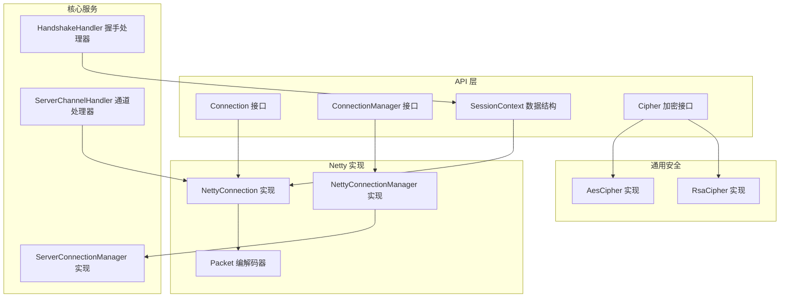
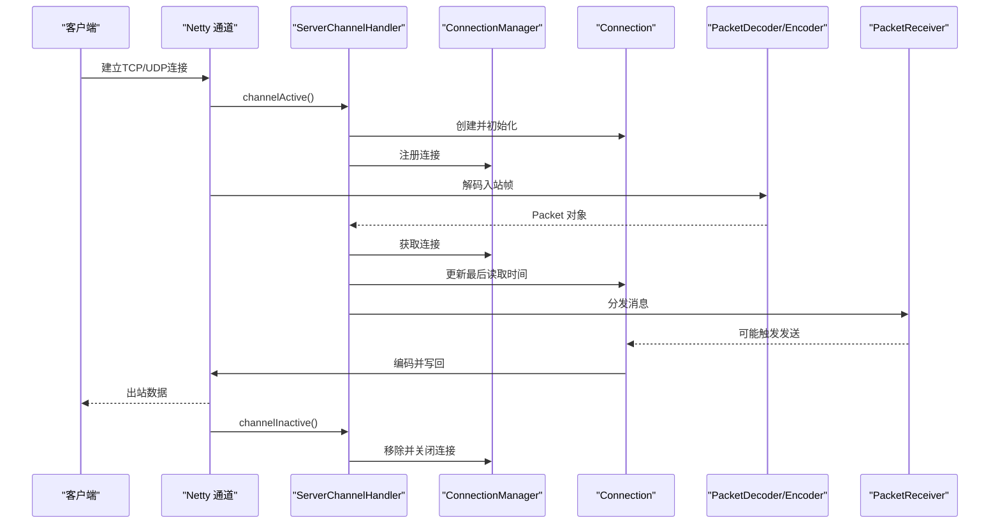
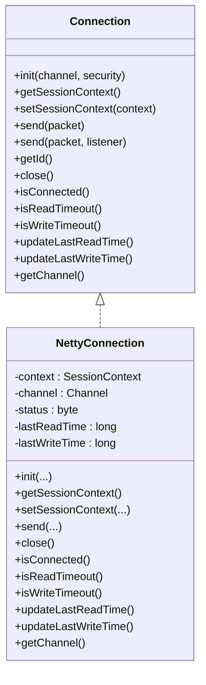
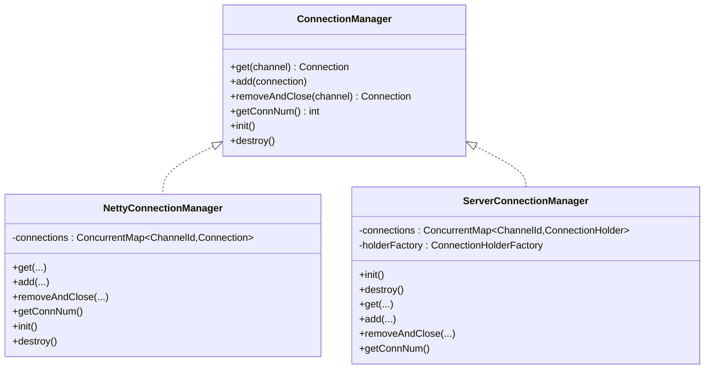
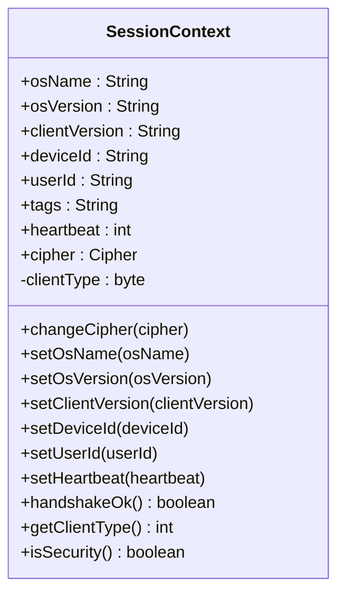
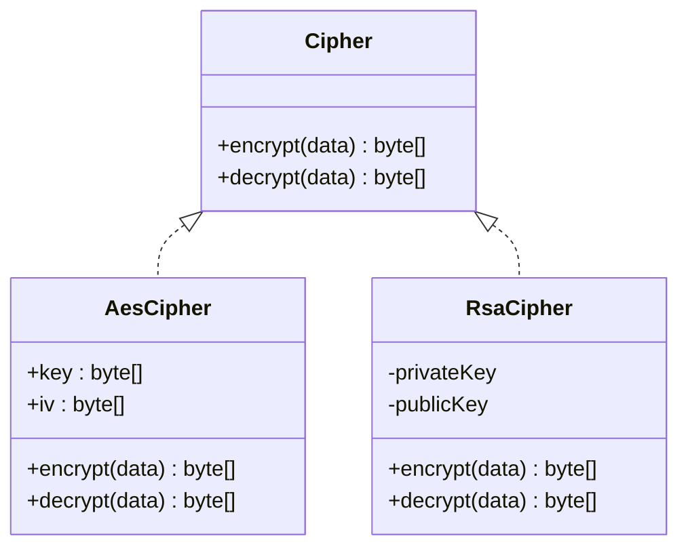
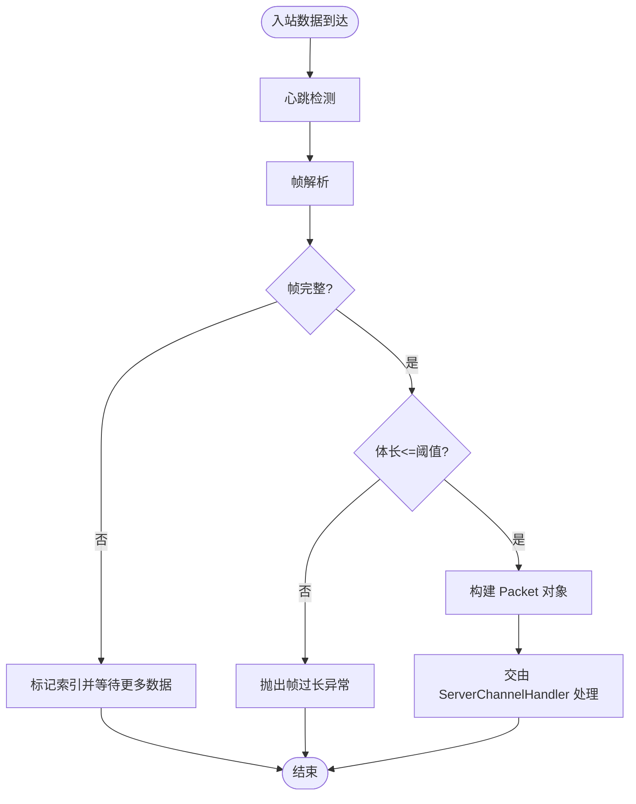
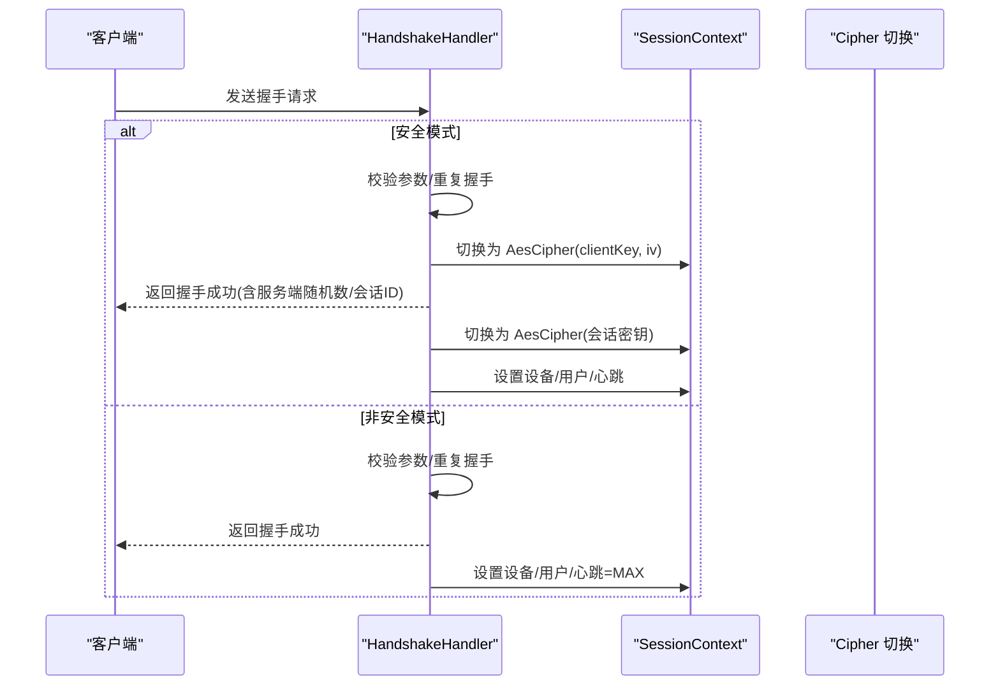
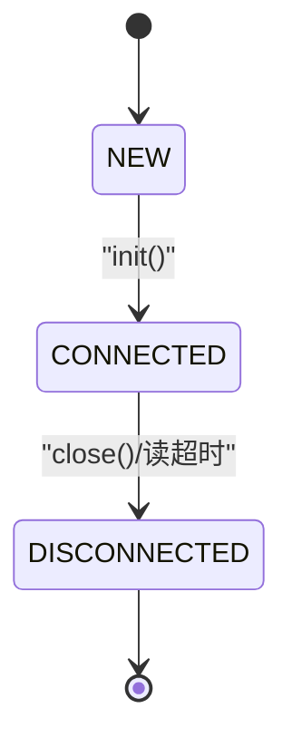
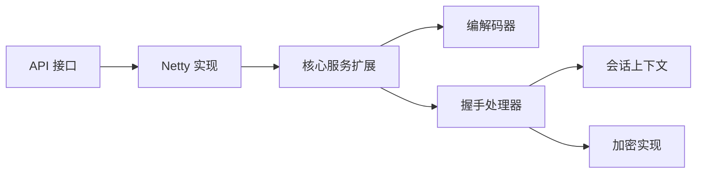

# 连接管理API

<cite>
**本文引用的文件**
- [Connection.java](file://mpush-api/src/main/java/com/mpush/api/connection/Connection.java)
- [ConnectionManager.java](file://mpush-api/src/main/java/com/mpush/api/connection/ConnectionManager.java)
- [SessionContext.java](file://mpush-api/src/main/java/com/mpush/api/connection/SessionContext.java)
- [Cipher.java](file://mpush-api/src/main/java/com/mpush/api/connection/Cipher.java)
- [NettyConnection.java](file://mpush-netty/src/main/java/com/mpush/netty/connection/NettyConnection.java)
- [NettyConnectionManager.java](file://mpush-netty/src/main/java/com/mpush/netty/connection/NettyConnectionManager.java)
- [Packet.java](file://mpush-api/src/main/java/com/mpush/api/protocol/Packet.java)
- [PacketDecoder.java](file://mpush-netty/src/main/java/com/mpush/netty/codec/PacketDecoder.java)
- [PacketEncoder.java](file://mpush-netty/src/main/java/com/mpush/netty/codec/PacketEncoder.java)
- [ServerConnectionManager.java](file://mpush-core/src/main/java/com/mpush/core/server/ServerConnectionManager.java)
- [ServerChannelHandler.java](file://mpush-core/src/main/java/com/mpush/core/server/ServerChannelHandler.java)
- [HandshakeHandler.java](file://mpush-core/src/main/java/com/mpush/core/handler/HandshakeHandler.java)
- [AesCipher.java](file://mpush-common/src/main/java/com/mpush/common/security/AesCipher.java)
- [RsaCipher.java](file://mpush-common/src/main/java/com/mpush/common/security/RsaCipher.java)
- [ConnectionConnectEvent.java](file://mpush-api/src/main/java/com/mpush/api/event/ConnectionConnectEvent.java)
</cite>

## 目录
1. [简介](#简介)
2. [项目结构](#项目结构)
3. [核心组件](#核心组件)
4. [架构总览](#架构总览)
5. [组件详解](#组件详解)
6. [依赖关系分析](#依赖关系分析)
7. [性能与稳定性](#性能与稳定性)
8. [故障排查指南](#故障排查指南)
9. [结论](#结论)
10. [附录](#附录)

## 简介
本文件为 MPush 连接管理API的权威参考，覆盖以下主题：
- Connection 接口：连接建立、状态管理、数据传输、连接关闭等核心能力
- ConnectionManager 接口与实现：连接池管理、连接监控、连接清理
- SessionContext 会话上下文：用户信息、会话状态、配置参数与客户端类型推断
- Cipher 加密接口：加密算法抽象、密钥管理、安全策略
- 与网络层的集成：基于 Netty 的编解码、握手流程、心跳检测
- 连接状态转换图与错误处理策略
- 性能优化与稳定性最佳实践

## 项目结构
围绕连接管理API的关键模块分布如下：
- mpush-api：定义 Connection、ConnectionManager、SessionContext、Cipher 等接口与协议基础
- mpush-netty：Netty 实现的 Connection 与 ConnectionManager，以及编解码器
- mpush-core：服务端侧的连接管理与通道处理器，负责心跳检测、握手处理、事件分发
- mpush-common：通用安全组件（AES/RSA 加密实现）

**图表来源**
- [Connection.java](file://mpush-api/src/main/java/com/mpush/api/connection/Connection.java#L32-L63)
- [ConnectionManager.java](file://mpush-api/src/main/java/com/mpush/api/connection/ConnectionManager.java#L31-L44)
- [SessionContext.java](file://mpush-api/src/main/java/com/mpush/api/connection/SessionContext.java#L30-L104)
- [Cipher.java](file://mpush-api/src/main/java/com/mpush/api/connection/Cipher.java#L27-L33)
- [NettyConnection.java](file://mpush-netty/src/main/java/com/mpush/netty/connection/NettyConnection.java#L38-L178)
- [NettyConnectionManager.java](file://mpush-netty/src/main/java/com/mpush/netty/connection/NettyConnectionManager.java#L35-L68)
- [Packet.java](file://mpush-api/src/main/java/com/mpush/api/protocol/Packet.java#L35-L186)
- [ServerConnectionManager.java](file://mpush-core/src/main/java/com/mpush/core/server/ServerConnectionManager.java#L46-L197)
- [ServerChannelHandler.java](file://mpush-core/src/main/java/com/mpush/core/server/ServerChannelHandler.java#L46-L103)
- [HandshakeHandler.java](file://mpush-core/src/main/java/com/mpush/core/handler/HandshakeHandler.java#L47-L159)
- [AesCipher.java](file://mpush-common/src/main/java/com/mpush/common/security/AesCipher.java#L36-L85)
- [RsaCipher.java](file://mpush-common/src/main/java/com/mpush/common/security/RsaCipher.java#L33-L60)

**章节来源**
- [Connection.java](file://mpush-api/src/main/java/com/mpush/api/connection/Connection.java#L32-L63)
- [ConnectionManager.java](file://mpush-api/src/main/java/com/mpush/api/connection/ConnectionManager.java#L31-L44)
- [SessionContext.java](file://mpush-api/src/main/java/com/mpush/api/connection/SessionContext.java#L30-L104)
- [Cipher.java](file://mpush-api/src/main/java/com/mpush/api/connection/Cipher.java#L27-L33)

## 核心组件
- Connection 接口：统一抽象网络连接，提供初始化、会话上下文访问、发送消息、关闭连接、读写超时检测、通道获取等能力
- ConnectionManager 接口：统一抽象连接池管理，提供按 Channel 获取、新增、移除并关闭、统计连接数、生命周期管理
- SessionContext：会话上下文对象，承载设备与用户信息、心跳周期、加密器、客户端类型推断等
- Cipher：加密抽象接口，定义对称或非对称加解密能力

这些接口在 mpush-api 中定义，具体实现由 mpush-netty 提供，服务端在 mpush-core 中进一步封装与扩展。

**章节来源**
- [Connection.java](file://mpush-api/src/main/java/com/mpush/api/connection/Connection.java#L32-L63)
- [ConnectionManager.java](file://mpush-api/src/main/java/com/mpush/api/connection/ConnectionManager.java#L31-L44)
- [SessionContext.java](file://mpush-api/src/main/java/com/mpush/api/connection/SessionContext.java#L30-L104)
- [Cipher.java](file://mpush-api/src/main/java/com/mpush/api/connection/Cipher.java#L27-L33)

## 架构总览
下图展示从网络接入到业务处理的端到端流程，以及连接管理在其中的角色。

**图表来源**
- [ServerChannelHandler.java](file://mpush-core/src/main/java/com/mpush/core/server/ServerChannelHandler.java#L91-L103)
- [ServerConnectionManager.java](file://mpush-core/src/main/java/com/mpush/core/server/ServerConnectionManager.java#L79-L108)
- [NettyConnection.java](file://mpush-netty/src/main/java/com/mpush/netty/connection/NettyConnection.java#L73-L105)
- [PacketDecoder.java](file://mpush-netty/src/main/java/com/mpush/netty/codec/PacketDecoder.java#L44-L106)
- [PacketEncoder.java](file://mpush-netty/src/main/java/com/mpush/netty/codec/PacketEncoder.java#L38-L46)

## 组件详解

### Connection 接口与 Netty 实现
- 能力概览
  - 初始化：绑定 Netty Channel，可选启用安全模式
  - 会话上下文：设置/获取 SessionContext
  - 发送：支持带监听器的发送，自动处理写缓冲与事件循环
  - 关闭：标记断开并关闭底层通道
  - 超时检测：基于心跳周期判断读/写超时
  - 其他：获取连接标识、通道句柄、活跃状态

- 关键行为
  - 发送时若通道不可写或繁忙，实现内部进行等待或降级处理
  - 写完成回调中更新最后写入时间
  - 关闭时仅允许一次关闭，避免重复关闭

**图表来源**
- [Connection.java](file://mpush-api/src/main/java/com/mpush/api/connection/Connection.java#L32-L63)
- [NettyConnection.java](file://mpush-netty/src/main/java/com/mpush/netty/connection/NettyConnection.java#L38-L178)

**章节来源**
- [Connection.java](file://mpush-api/src/main/java/com/mpush/api/connection/Connection.java#L32-L63)
- [NettyConnection.java](file://mpush-netty/src/main/java/com/mpush/netty/connection/NettyConnection.java#L46-L147)

### ConnectionManager 接口与实现
- 接口职责
  - 按 Channel 获取连接
  - 新增连接
  - 移除并关闭连接
  - 获取连接数量
  - 生命周期：init/destroy

- Netty 实现要点
  - 使用并发映射以 ChannelId 为键存储连接
  - destroy 时遍历关闭并清空

- 核心服务实现（ServerConnectionManager）
  - 支持心跳检测模式：通过时间轮定时器周期检查连接读超时
  - 提供简单持有者与心跳检查持有者两种实现
  - 在移除连接时若不存在，仍可创建临时连接并关闭，保证幂等

**图表来源**
- [ConnectionManager.java](file://mpush-api/src/main/java/com/mpush/api/connection/ConnectionManager.java#L31-L44)
- [NettyConnectionManager.java](file://mpush-netty/src/main/java/com/mpush/netty/connection/NettyConnectionManager.java#L35-L68)
- [ServerConnectionManager.java](file://mpush-core/src/main/java/com/mpush/core/server/ServerConnectionManager.java#L46-L197)

**章节来源**
- [ConnectionManager.java](file://mpush-api/src/main/java/com/mpush/api/connection/ConnectionManager.java#L31-L44)
- [NettyConnectionManager.java](file://mpush-netty/src/main/java/com/mpush/netty/connection/NettyConnectionManager.java#L35-L68)
- [ServerConnectionManager.java](file://mpush-core/src/main/java/com/mpush/core/server/ServerConnectionManager.java#L46-L197)

### SessionContext 会话上下文
- 字段与用途
  - 设备与系统信息：操作系统名称/版本、客户端版本、设备ID
  - 用户标识：userId
  - 标签：tags
  - 心跳周期：heartbeat（毫秒）
  - 加密器：cipher
  - 客户端类型：clientType（惰性推断）

- 关键方法
  - changeCipher：切换加密器
  - setXxx：链式设置字段
  - handshakeOk：握手完成判定
  - getClientType：根据 OS 推断客户端类型
  - isSecurity：是否启用安全模式

**图表来源**
- [SessionContext.java](file://mpush-api/src/main/java/com/mpush/api/connection/SessionContext.java#L30-L104)

**章节来源**
- [SessionContext.java](file://mpush-api/src/main/java/com/mpush/api/connection/SessionContext.java#L30-L104)

### Cipher 加密接口与实现
- 接口能力
  - encrypt：加密
  - decrypt：解密

- 实现
  - AesCipher：基于对称 AES 的实现，使用固定 IV 与密钥规格
  - RsaCipher：基于非对称 RSA 的实现，使用私钥解密、公钥加密

- 集成点
  - NettyConnection 在安全模式下初始化 SessionContext 并注入 RsaCipher
  - 握手阶段由 HandshakeHandler 将 RSA 密钥协商为 AES 会话密钥，并切换到 AesCipher

**图表来源**
- [Cipher.java](file://mpush-api/src/main/java/com/mpush/api/connection/Cipher.java#L27-L33)
- [AesCipher.java](file://mpush-common/src/main/java/com/mpush/common/security/AesCipher.java#L36-L85)
- [RsaCipher.java](file://mpush-common/src/main/java/com/mpush/common/security/RsaCipher.java#L33-L60)

**章节来源**
- [Cipher.java](file://mpush-api/src/main/java/com/mpush/api/connection/Cipher.java#L27-L33)
- [AesCipher.java](file://mpush-common/src/main/java/com/mpush/common/security/AesCipher.java#L36-L85)
- [RsaCipher.java](file://mpush-common/src/main/java/com/mpush/common/security/RsaCipher.java#L33-L60)

### 协议与网络层集成
- 协议定义
  - Packet：定义帧头长度、标志位、心跳包常量、编码/解码逻辑
- 编解码器
  - PacketEncoder：将 Packet 编码为 ByteBuf
  - PacketDecoder：从 ByteBuf/UDP/DatagramPacket 解码为 Packet，支持心跳包识别与最大包长限制
- 通道处理器
  - ServerChannelHandler：在 channelActive 时创建并注册连接；在 channelRead 时更新读取时间并分发消息；在 channelInactive 时移除并关闭连接，发布关闭事件

**图表来源**
- [PacketDecoder.java](file://mpush-netty/src/main/java/com/mpush/netty/codec/PacketDecoder.java#L44-L106)
- [Packet.java](file://mpush-api/src/main/java/com/mpush/api/protocol/Packet.java#L35-L186)

**章节来源**
- [Packet.java](file://mpush-api/src/main/java/com/mpush/api/protocol/Packet.java#L35-L186)
- [PacketEncoder.java](file://mpush-netty/src/main/java/com/mpush/netty/codec/PacketEncoder.java#L38-L46)
- [PacketDecoder.java](file://mpush-netty/src/main/java/com/mpush/netty/codec/PacketDecoder.java#L44-L106)
- [ServerChannelHandler.java](file://mpush-core/src/main/java/com/mpush/core/server/ServerChannelHandler.java#L62-L103)

### 握手与会话建立
- 流程概述
  - 安全模式：客户端携带设备ID、IV、客户端随机数；服务端生成服务端随机数，混合生成会话密钥；返回服务端随机数与会话ID；随后切换为 AES 会话密钥
  - 非安全模式：直接下发握手成功，心跳设为最大值
  - 成功后更新 SessionContext 的设备与用户信息、心跳周期

**图表来源**
- [HandshakeHandler.java](file://mpush-core/src/main/java/com/mpush/core/handler/HandshakeHandler.java#L69-L159)
- [SessionContext.java](file://mpush-api/src/main/java/com/mpush/api/connection/SessionContext.java#L41-L87)
- [AesCipher.java](file://mpush-common/src/main/java/com/mpush/common/security/AesCipher.java#L36-L58)

**章节来源**
- [HandshakeHandler.java](file://mpush-core/src/main/java/com/mpush/core/handler/HandshakeHandler.java#L69-L159)
- [SessionContext.java](file://mpush-api/src/main/java/com/mpush/api/connection/SessionContext.java#L41-L87)
- [AesCipher.java](file://mpush-common/src/main/java/com/mpush/common/security/AesCipher.java#L36-L58)

### 连接状态转换图
- 状态集合：NEW、CONNECTED、DISCONNECTED
- 转换规则
  - NEW → CONNECTED：初始化成功
  - CONNECTED → DISCONNECTED：主动关闭或读超时达到阈值
  - DISCONNECTED：终止态

**图表来源**
- [Connection.java](file://mpush-api/src/main/java/com/mpush/api/connection/Connection.java#L33-L36)
- [NettyConnection.java](file://mpush-netty/src/main/java/com/mpush/netty/connection/NettyConnection.java#L42-L111)
- [ServerConnectionManager.java](file://mpush-core/src/main/java/com/mpush/core/server/ServerConnectionManager.java#L157-L177)

**章节来源**
- [Connection.java](file://mpush-api/src/main/java/com/mpush/api/connection/Connection.java#L33-L36)
- [NettyConnection.java](file://mpush-netty/src/main/java/com/mpush/netty/connection/NettyConnection.java#L42-L111)
- [ServerConnectionManager.java](file://mpush-core/src/main/java/com/mpush/core/server/ServerConnectionManager.java#L157-L177)

## 依赖关系分析
- 接口与实现分离
  - API 层定义接口，Netty 实现具体逻辑，核心服务在 API 之上做扩展（如心跳检测）
- 编解码与协议
  - PacketEncoder/Decoder 与 Packet 紧密耦合，确保帧格式一致
- 安全与会话
  - HandshakeHandler 依赖 CipherBox 生成随机密钥并混合，最终在 SessionContext 中生效
- 事件与监控
  - ServerChannelHandler 在连接断开时发布关闭事件，便于上层清理与通知

**图表来源**
- [Connection.java](file://mpush-api/src/main/java/com/mpush/api/connection/Connection.java#L32-L63)
- [NettyConnection.java](file://mpush-netty/src/main/java/com/mpush/netty/connection/NettyConnection.java#L38-L178)
- [ServerChannelHandler.java](file://mpush-core/src/main/java/com/mpush/core/server/ServerChannelHandler.java#L46-L103)
- [HandshakeHandler.java](file://mpush-core/src/main/java/com/mpush/core/handler/HandshakeHandler.java#L47-L159)
- [Packet.java](file://mpush-api/src/main/java/com/mpush/api/protocol/Packet.java#L35-L186)

**章节来源**
- [Connection.java](file://mpush-api/src/main/java/com/mpush/api/connection/Connection.java#L32-L63)
- [NettyConnection.java](file://mpush-netty/src/main/java/com/mpush/netty/connection/NettyConnection.java#L38-L178)
- [ServerChannelHandler.java](file://mpush-core/src/main/java/com/mpush/core/server/ServerChannelHandler.java#L46-L103)
- [HandshakeHandler.java](file://mpush-core/src/main/java/com/mpush/core/handler/HandshakeHandler.java#L47-L159)
- [Packet.java](file://mpush-api/src/main/java/com/mpush/api/protocol/Packet.java#L35-L186)

## 性能与稳定性
- 发送路径优化
  - 发送前检查通道活性，避免无效写入
  - 在事件循环外等待时设置合理超时，防止阻塞
  - 写完成回调中及时更新写时间，减少误判
- 心跳与超时
  - 服务端使用时间轮定时器进行心跳检测，超时次数超过阈值则主动关闭连接
  - 心跳周期与最大超时次数可通过配置调整
- 编解码健壮性
  - 最大包长限制，防止内存压力
  - 不完整帧回退读指针，提升吞吐稳定性
- 资源回收
  - destroy 时遍历关闭所有连接并清空映射，避免资源泄漏

**章节来源**
- [NettyConnection.java](file://mpush-netty/src/main/java/com/mpush/netty/connection/NettyConnection.java#L73-L105)
- [ServerConnectionManager.java](file://mpush-core/src/main/java/com/mpush/core/server/ServerConnectionManager.java#L58-L77)
- [PacketDecoder.java](file://mpush-netty/src/main/java/com/mpush/netty/codec/PacketDecoder.java#L44-L106)

## 故障排查指南
- 常见问题定位
  - 发送失败：检查通道活性与写缓冲；查看写完成回调日志
  - 读超时：确认客户端心跳发送频率与服务端心跳周期配置
  - 握手失败：核对设备ID、IV、客户端随机数长度与格式
- 日志与事件
  - 连接建立/断开：ServerChannelHandler 记录
  - 握手结果：HandshakeHandler 记录
  - 心跳超时：ServerConnectionManager 记录并关闭连接
  - 关闭事件：发布 ConnectionCloseEvent，便于外部清理

**章节来源**
- [ServerChannelHandler.java](file://mpush-core/src/main/java/com/mpush/core/server/ServerChannelHandler.java#L82-L103)
- [HandshakeHandler.java](file://mpush-core/src/main/java/com/mpush/core/handler/HandshakeHandler.java#L79-L127)
- [ServerConnectionManager.java](file://mpush-core/src/main/java/com/mpush/core/server/ServerConnectionManager.java#L157-L177)
- [ConnectionConnectEvent.java](file://mpush-api/src/main/java/com/mpush/api/event/ConnectionConnectEvent.java#L29-L35)

## 结论
MPush 的连接管理API通过清晰的接口设计与 Netty 实现，提供了高内聚、低耦合的连接生命周期管理能力。结合服务端的心跳检测、握手处理与事件机制，能够稳定支撑大规模实时通信场景。建议在生产环境中配合合理的超时配置、限流与监控，持续优化连接质量与系统稳定性。

## 附录
- 术语
  - 连接：抽象的网络会话对象
  - 连接池：按 ChannelId 管理的连接集合
  - 会话上下文：承载连接元数据与安全状态的对象
  - 加密器：实现对称或非对称加解密的组件
- 参考实现路径
  - 连接接口与实现：[Connection.java](file://mpush-api/src/main/java/com/mpush/api/connection/Connection.java#L32-L63)、[NettyConnection.java](file://mpush-netty/src/main/java/com/mpush/netty/connection/NettyConnection.java#L38-L178)
  - 连接管理：[ConnectionManager.java](file://mpush-api/src/main/java/com/mpush/api/connection/ConnectionManager.java#L31-L44)、[NettyConnectionManager.java](file://mpush-netty/src/main/java/com/mpush/netty/connection/NettyConnectionManager.java#L35-L68)、[ServerConnectionManager.java](file://mpush-core/src/main/java/com/mpush/core/server/ServerConnectionManager.java#L46-L197)
  - 会话上下文：[SessionContext.java](file://mpush-api/src/main/java/com/mpush/api/connection/SessionContext.java#L30-L104)
  - 加密接口与实现：[Cipher.java](file://mpush-api/src/main/java/com/mpush/api/connection/Cipher.java#L27-L33)、[AesCipher.java](file://mpush-common/src/main/java/com/mpush/common/security/AesCipher.java#L36-L85)、[RsaCipher.java](file://mpush-common/src/main/java/com/mpush/common/security/RsaCipher.java#L33-L60)
  - 协议与编解码：[Packet.java](file://mpush-api/src/main/java/com/mpush/api/protocol/Packet.java#L35-L186)、[PacketEncoder.java](file://mpush-netty/src/main/java/com/mpush/netty/codec/PacketEncoder.java#L38-L46)、[PacketDecoder.java](file://mpush-netty/src/main/java/com/mpush/netty/codec/PacketDecoder.java#L44-L106)
  - 握手与通道处理：[HandshakeHandler.java](file://mpush-core/src/main/java/com/mpush/core/handler/HandshakeHandler.java#L47-L159)、[ServerChannelHandler.java](file://mpush-core/src/main/java/com/mpush/core/server/ServerChannelHandler.java#L46-L103)