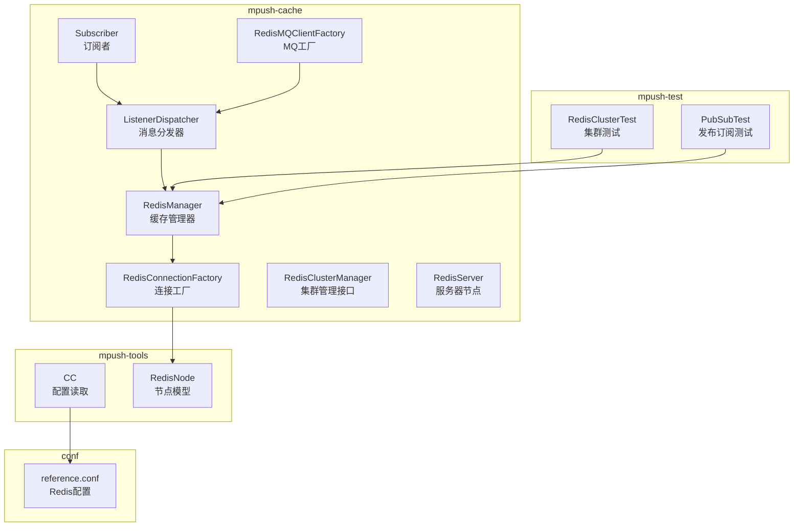
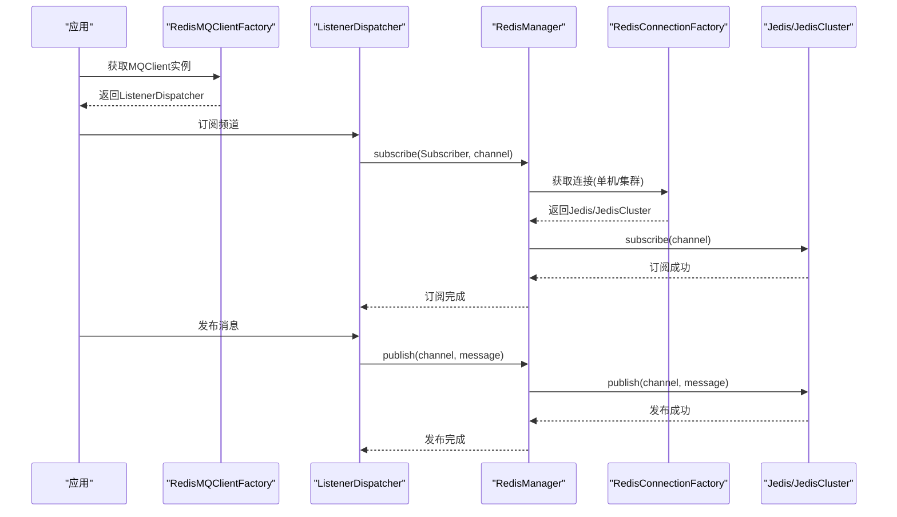
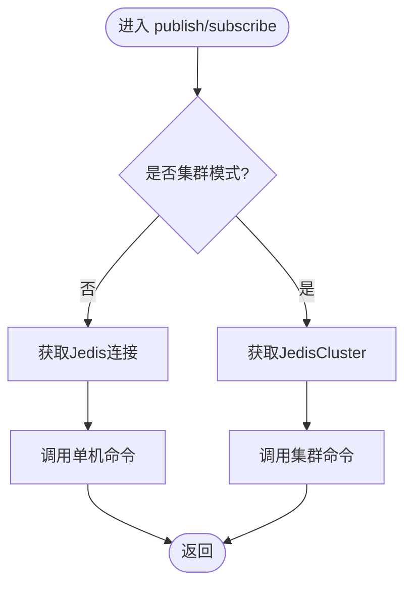
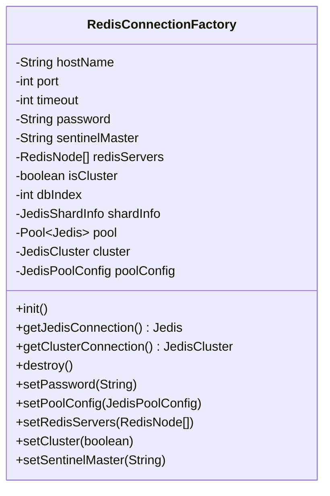
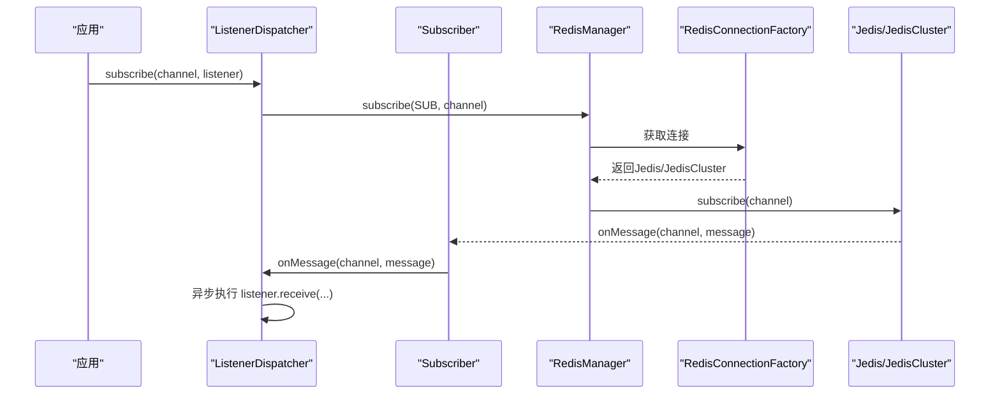
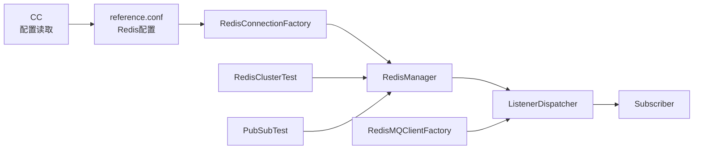

# Redis集成

<cite>
**本文引用的文件**
- [RedisManager.java](file://mpush-cache/src/main/java/com/mpush/cache/redis/manager/RedisManager.java)
- [RedisConnectionFactory.java](file://mpush-cache/src/main/java/com/mpush/cache/redis/connection/RedisConnectionFactory.java)
- [RedisClusterManager.java](file://mpush-cache/src/main/java/com/mpush/cache/redis/manager/RedisClusterManager.java)
- [RedisServer.java](file://mpush-cache/src/main/java/com/mpush/cache/redis/RedisServer.java)
- [ListenerDispatcher.java](file://mpush-cache/src/main/java/com/mpush/cache/redis/mq/ListenerDispatcher.java)
- [Subscriber.java](file://mpush-cache/src/main/java/com/mpush/cache/redis/mq/Subscriber.java)
- [RedisMQClientFactory.java](file://mpush-cache/src/main/java/com/mpush/cache/redis/mq/RedisMQClientFactory.java)
- [reference.conf](file://conf/reference.conf)
- [RedisClusterTest.java](file://mpush-test/src/main/java/com/mpush/test/redis/RedisClusterTest.java)
- [PubSubTest.java](file://mpush-test/src/main/java/com/mpush/test/redis/PubSubTest.java)
- [CC.java](file://mpush-tools/src/main/java/com/mpush/tools/config/CC.java)
- [RedisNode.java](file://mpush-tools/src/main/java/com/mpush/tools/config/data/RedisNode.java)
</cite>

## 目录
1. [简介](#简介)
2. [项目结构](#项目结构)
3. [核心组件](#核心组件)
4. [架构总览](#架构总览)
5. [详细组件分析](#详细组件分析)
6. [依赖关系分析](#依赖关系分析)
7. [性能考量](#性能考量)
8. [故障排查指南](#故障排查指南)
9. [结论](#结论)
10. [附录](#附录)

## 简介
本文件面向MPush的Redis集成，系统性阐述Redis在消息推送系统中的关键作用，包括缓存管理、会话存储、路由信息存储、集群支持等。重点解析RedisManager与RedisClusterManager的设计实现，覆盖连接池管理、集群模式支持、故障转移机制、数据同步策略；详解RedisConnectionFactory的工厂模式实现，包括连接创建、配置管理、资源回收；说明Redis消息队列的发布订阅机制、消息监听与异步处理；并提供Redis集群部署指南、性能调优参数、监控指标配置及运维最佳实践。

## 项目结构
Redis相关代码主要位于以下模块与包中：
- mpush-cache 模块下的redis子包，包含连接工厂、缓存管理器、消息队列适配器与服务器节点模型
- mpush-tools 模块下的配置工具，负责读取与解析Redis配置
- conf 目录下的配置文件，定义Redis集群模式、节点列表、密码与连接池参数
- mpush-test 模块下的Redis测试用例，验证集群与发布订阅功能

图表来源
- [RedisManager.java](file://mpush-cache/src/main/java/com/mpush/cache/redis/manager/RedisManager.java#L40-L438)
- [RedisConnectionFactory.java](file://mpush-cache/src/main/java/com/mpush/cache/redis/connection/RedisConnectionFactory.java#L40-L350)
- [RedisClusterManager.java](file://mpush-cache/src/main/java/com/mpush/cache/redis/manager/RedisClusterManager.java#L26-L31)
- [RedisServer.java](file://mpush-cache/src/main/java/com/mpush/cache/redis/RedisServer.java#L28-L38)
- [ListenerDispatcher.java](file://mpush-cache/src/main/java/com/mpush/cache/redis/mq/ListenerDispatcher.java#L37-L79)
- [Subscriber.java](file://mpush-cache/src/main/java/com/mpush/cache/redis/mq/Subscriber.java#L26-L83)
- [RedisMQClientFactory.java](file://mpush-cache/src/main/java/com/mpush/cache/redis/mq/RedisMQClientFactory.java#L31-L39)
- [CC.java](file://mpush-tools/src/main/java/com/mpush/tools/config/CC.java#L271-L278)
- [RedisNode.java](file://mpush-tools/src/main/java/com/mpush/tools/config/data/RedisNode.java#L50-L89)
- [reference.conf](file://conf/reference.conf#L143-L169)
- [RedisClusterTest.java](file://mpush-test/src/main/java/com/mpush/test/redis/RedisClusterTest.java#L35-L63)
- [PubSubTest.java](file://mpush-test/src/main/java/com/mpush/test/redis/PubSubTest.java#L29-L65)

章节来源
- [RedisManager.java](file://mpush-cache/src/main/java/com/mpush/cache/redis/manager/RedisManager.java#L40-L438)
- [RedisConnectionFactory.java](file://mpush-cache/src/main/java/com/mpush/cache/redis/connection/RedisConnectionFactory.java#L40-L350)
- [reference.conf](file://conf/reference.conf#L143-L169)

## 核心组件
- RedisManager：统一的缓存访问门面，封装Jedis/JedisCluster操作，提供键值、哈希、列表、集合、有序集合、发布订阅等常用能力，并内置连接选择逻辑与异常处理
- RedisConnectionFactory：工厂类，负责创建Jedis连接池或JedisCluster，支持单机、哨兵与集群模式，管理连接池配置、认证、数据库索引与资源回收
- ListenerDispatcher：消息队列适配器，实现MQClient接口，负责订阅通道、分发消息到业务监听器、异步执行
- Subscriber：基于JedisPubSub的消息监听器，转发底层回调至分发器
- RedisMQClientFactory：SPI工厂，暴露MQClient给上层使用
- RedisServer：Redis节点模型，便于转换为Jedis HostAndPort
- RedisClusterManager：集群管理接口，定义初始化与获取节点列表的能力

章节来源
- [RedisManager.java](file://mpush-cache/src/main/java/com/mpush/cache/redis/manager/RedisManager.java#L40-L438)
- [RedisConnectionFactory.java](file://mpush-cache/src/main/java/com/mpush/cache/redis/connection/RedisConnectionFactory.java#L40-L350)
- [ListenerDispatcher.java](file://mpush-cache/src/main/java/com/mpush/cache/redis/mq/ListenerDispatcher.java#L37-L79)
- [Subscriber.java](file://mpush-cache/src/main/java/com/mpush/cache/redis/mq/Subscriber.java#L26-L83)
- [RedisMQClientFactory.java](file://mpush-cache/src/main/java/com/mpush/cache/redis/mq/RedisMQClientFactory.java#L31-L39)
- [RedisServer.java](file://mpush-cache/src/main/java/com/mpush/cache/redis/RedisServer.java#L28-L38)
- [RedisClusterManager.java](file://mpush-cache/src/main/java/com/mpush/cache/redis/manager/RedisClusterManager.java#L26-L31)

## 架构总览
Redis在MPush中的角色定位：
- 缓存管理：KV、Hash、List、Set、Sorted Set等数据结构支撑会话状态、路由表、标签与临时数据
- 消息队列：基于Redis发布订阅实现跨节点消息广播与事件通知
- 集群支持：通过工厂类自动识别单机、哨兵与集群模式，实现高可用与弹性伸缩
- 异步处理：消息监听器在独立线程池中异步处理，避免阻塞主业务线程

图表来源
- [RedisMQClientFactory.java](file://mpush-cache/src/main/java/com/mpush/cache/redis/mq/RedisMQClientFactory.java#L31-L39)
- [ListenerDispatcher.java](file://mpush-cache/src/main/java/com/mpush/cache/redis/mq/ListenerDispatcher.java#L66-L74)
- [RedisManager.java](file://mpush-cache/src/main/java/com/mpush/cache/redis/manager/RedisManager.java#L317-L338)
- [RedisConnectionFactory.java](file://mpush-cache/src/main/java/com/mpush/cache/redis/connection/RedisConnectionFactory.java#L198-L202)

## 详细组件分析

### RedisManager 设计与实现
职责与特性：
- 初始化：读取配置，设置密码、连接池、节点与集群/哨兵标识，随后进行连通性测试
- 统一访问：通过函数式回调在单机与集群模式间无缝切换，保证上层调用一致
- 数据结构操作：提供KV、Hash、List、Set、Sorted Set、发布订阅等方法，支持序列化/反序列化
- 错误处理：捕获异常并记录日志，抛出运行时异常，便于上层统一处理

关键流程图（发布订阅）

图表来源
- [RedisManager.java](file://mpush-cache/src/main/java/com/mpush/cache/redis/manager/RedisManager.java#L59-L93)
- [RedisManager.java](file://mpush-cache/src/main/java/com/mpush/cache/redis/manager/RedisManager.java#L317-L338)

章节来源
- [RedisManager.java](file://mpush-cache/src/main/java/com/mpush/cache/redis/manager/RedisManager.java#L45-L57)
- [RedisManager.java](file://mpush-cache/src/main/java/com/mpush/cache/redis/manager/RedisManager.java#L95-L145)
- [RedisManager.java](file://mpush-cache/src/main/java/com/mpush/cache/redis/manager/RedisManager.java#L152-L227)
- [RedisManager.java](file://mpush-cache/src/main/java/com/mpush/cache/redis/manager/RedisManager.java#L239-L298)
- [RedisManager.java](file://mpush-cache/src/main/java/com/mpush/cache/redis/manager/RedisManager.java#L317-L338)

### RedisConnectionFactory 工厂模式
职责与特性：
- 单机/哨兵/集群三种模式自动识别与创建
- 连接池配置与资源回收：提供destroy方法关闭池与集群连接
- 认证与超时：支持密码、连接超时与SO超时
- 数据库选择：支持选择DB索引

类图

图表来源
- [RedisConnectionFactory.java](file://mpush-cache/src/main/java/com/mpush/cache/redis/connection/RedisConnectionFactory.java#L40-L350)

章节来源
- [RedisConnectionFactory.java](file://mpush-cache/src/main/java/com/mpush/cache/redis/connection/RedisConnectionFactory.java#L89-L107)
- [RedisConnectionFactory.java](file://mpush-cache/src/main/java/com/mpush/cache/redis/connection/RedisConnectionFactory.java#L109-L159)
- [RedisConnectionFactory.java](file://mpush-cache/src/main/java/com/mpush/cache/redis/connection/RedisConnectionFactory.java#L165-L182)
- [RedisConnectionFactory.java](file://mpush-cache/src/main/java/com/mpush/cache/redis/connection/RedisConnectionFactory.java#L188-L202)
- [RedisConnectionFactory.java](file://mpush-cache/src/main/java/com/mpush/cache/redis/connection/RedisConnectionFactory.java#L333-L348)

### ListenerDispatcher 与 Subscriber
职责与特性：
- ListenerDispatcher：维护频道到监听器列表的映射，接收消息后在独立线程池中异步分发
- Subscriber：继承JedisPubSub，将底层回调转发给ListenerDispatcher

序列图（订阅与分发）

图表来源
- [ListenerDispatcher.java](file://mpush-cache/src/main/java/com/mpush/cache/redis/mq/ListenerDispatcher.java#L66-L69)
- [ListenerDispatcher.java](file://mpush-cache/src/main/java/com/mpush/cache/redis/mq/ListenerDispatcher.java#L54-L64)
- [Subscriber.java](file://mpush-cache/src/main/java/com/mpush/cache/redis/mq/Subscriber.java#L34-L37)
- [RedisManager.java](file://mpush-cache/src/main/java/com/mpush/cache/redis/manager/RedisManager.java#L328-L338)
- [RedisConnectionFactory.java](file://mpush-cache/src/main/java/com/mpush/cache/redis/connection/RedisConnectionFactory.java#L198-L202)

章节来源
- [ListenerDispatcher.java](file://mpush-cache/src/main/java/com/mpush/cache/redis/mq/ListenerDispatcher.java#L46-L48)
- [ListenerDispatcher.java](file://mpush-cache/src/main/java/com/mpush/cache/redis/mq/ListenerDispatcher.java#L66-L74)
- [Subscriber.java](file://mpush-cache/src/main/java/com/mpush/cache/redis/mq/Subscriber.java#L26-L83)

### RedisClusterManager 接口
职责与特性：
- 定义集群初始化与获取节点列表的标准接口，便于扩展不同集群实现

章节来源
- [RedisClusterManager.java](file://mpush-cache/src/main/java/com/mpush/cache/redis/manager/RedisClusterManager.java#L26-L31)

### RedisServer 节点模型
职责与特性：
- 扩展RedisNode，提供HostAndPort转换能力，便于JedisCluster构造

章节来源
- [RedisServer.java](file://mpush-cache/src/main/java/com/mpush/cache/redis/RedisServer.java#L28-L38)
- [RedisNode.java](file://mpush-tools/src/main/java/com/mpush/tools/config/data/RedisNode.java#L50-L89)

## 依赖关系分析
- RedisManager依赖RedisConnectionFactory进行连接获取与模式判断
- ListenerDispatcher依赖RedisManager进行发布订阅操作
- RedisMQClientFactory通过SPI暴露ListenerDispatcher作为MQClient
- CC与reference.conf共同驱动Redis配置加载，包括集群模式、节点列表、密码与连接池参数
- 测试模块验证集群与发布订阅行为

图表来源
- [CC.java](file://mpush-tools/src/main/java/com/mpush/tools/config/CC.java#L271-L278)
- [reference.conf](file://conf/reference.conf#L143-L169)
- [RedisConnectionFactory.java](file://mpush-cache/src/main/java/com/mpush/cache/redis/connection/RedisConnectionFactory.java#L40-L350)
- [RedisManager.java](file://mpush-cache/src/main/java/com/mpush/cache/redis/manager/RedisManager.java#L40-L438)
- [ListenerDispatcher.java](file://mpush-cache/src/main/java/com/mpush/cache/redis/mq/ListenerDispatcher.java#L37-L79)
- [RedisMQClientFactory.java](file://mpush-cache/src/main/java/com/mpush/cache/redis/mq/RedisMQClientFactory.java#L31-L39)
- [RedisClusterTest.java](file://mpush-test/src/main/java/com/mpush/test/redis/RedisClusterTest.java#L35-L63)
- [PubSubTest.java](file://mpush-test/src/main/java/com/mpush/test/redis/PubSubTest.java#L29-L65)

章节来源
- [CC.java](file://mpush-tools/src/main/java/com/mpush/tools/config/CC.java#L271-L278)
- [reference.conf](file://conf/reference.conf#L143-L169)

## 性能考量
- 连接池参数：通过配置文件中的连接池参数控制最大连接数、空闲连接、等待超时等，建议结合QPS与延迟目标调优
- 集群模式：在高并发场景优先考虑集群模式，合理规划槽位与节点数量，避免热点槽位
- 序列化开销：对象序列化/反序列化带来CPU与带宽成本，建议在高频路径使用轻量序列化或二进制协议
- 异步处理：消息监听器在独立线程池中执行，避免阻塞Redis订阅线程，建议根据业务负载调整线程池大小
- 超时与重试：合理设置连接与命令超时，避免长时间阻塞导致资源枯竭

## 故障排查指南
常见问题与处理建议：
- 连接失败
  - 检查Redis地址与端口、密码配置是否正确
  - 单机/哨兵/集群模式配置是否与实际环境匹配
  - 参考：[RedisConnectionFactory.java](file://mpush-cache/src/main/java/com/mpush/cache/redis/connection/RedisConnectionFactory.java#L89-L107)
- 集群认证错误
  - 集群模式不支持密码配置，需移除密码或切换为单机/哨兵模式
  - 参考：[RedisConnectionFactory.java](file://mpush-cache/src/main/java/com/mpush/cache/redis/connection/RedisConnectionFactory.java#L154-L156)
- 订阅无消息
  - 确认已先订阅再发布，或先发布再订阅
  - 参考测试用例：[PubSubTest.java](file://mpush-test/src/main/java/com/mpush/test/redis/PubSubTest.java#L35-L63)
- 集群初始化失败
  - 检查节点列表与可达性
  - 参考测试用例：[RedisClusterTest.java](file://mpush-test/src/main/java/com/mpush/test/redis/RedisClusterTest.java#L42-L50)
- 资源未释放
  - 使用完毕后确保调用destroy关闭连接池与集群
  - 参考：[RedisConnectionFactory.java](file://mpush-cache/src/main/java/com/mpush/cache/redis/connection/RedisConnectionFactory.java#L165-L182)

章节来源
- [RedisConnectionFactory.java](file://mpush-cache/src/main/java/com/mpush/cache/redis/connection/RedisConnectionFactory.java#L154-L156)
- [RedisConnectionFactory.java](file://mpush-cache/src/main/java/com/mpush/cache/redis/connection/RedisConnectionFactory.java#L165-L182)
- [PubSubTest.java](file://mpush-test/src/main/java/com/mpush/test/redis/PubSubTest.java#L35-L63)
- [RedisClusterTest.java](file://mpush-test/src/main/java/com/mpush/test/redis/RedisClusterTest.java#L42-L50)

## 结论
MPush的Redis集成以RedisManager为核心抽象，配合RedisConnectionFactory实现多模式连接管理，并通过ListenerDispatcher与Subscriber构建了高效的发布订阅消息队列。该设计在保证易用性的同时，兼顾了高可用、可扩展与性能优化，适用于大规模消息推送场景。

## 附录

### Redis配置参考
- 集群模式：single、cluster、sentinel
- 节点列表：nodes数组，格式为“ip:port”
- 密码：password
- 连接池参数：maxTotal、maxIdle、minIdle、maxWaitMillis等

章节来源
- [reference.conf](file://conf/reference.conf#L143-L169)
- [CC.java](file://mpush-tools/src/main/java/com/mpush/tools/config/CC.java#L271-L278)