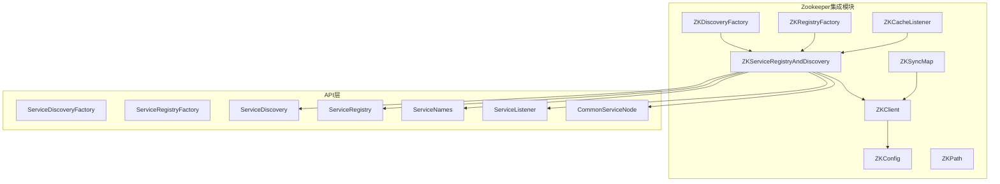
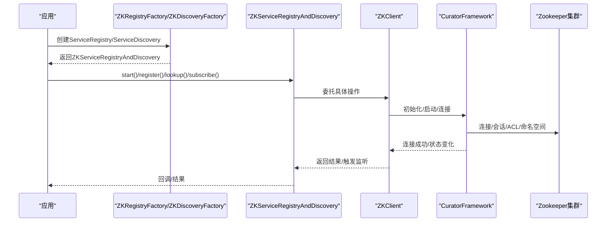
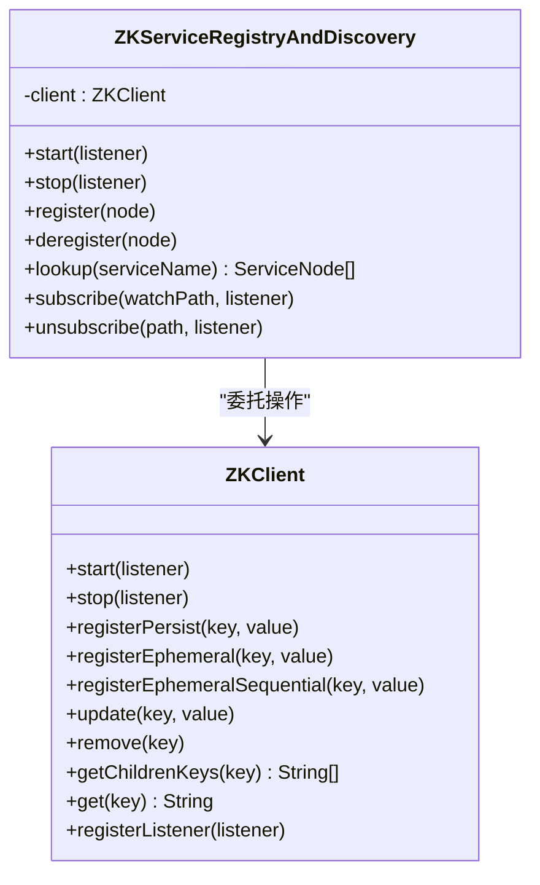
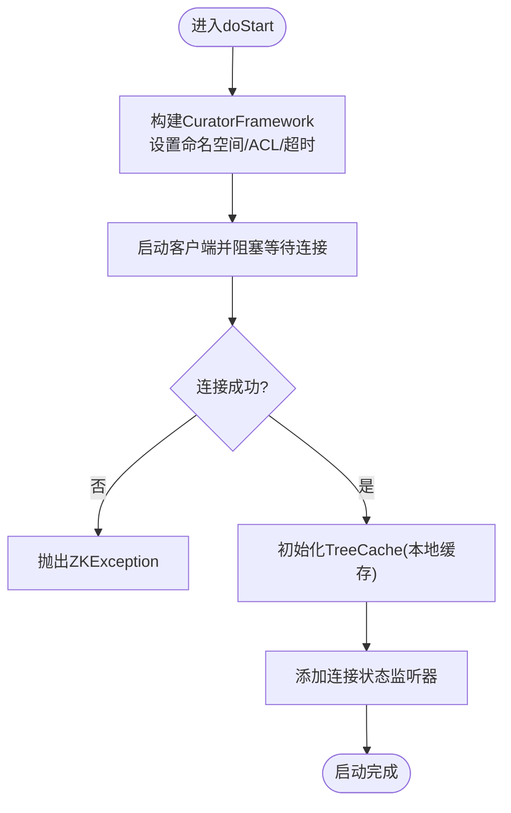
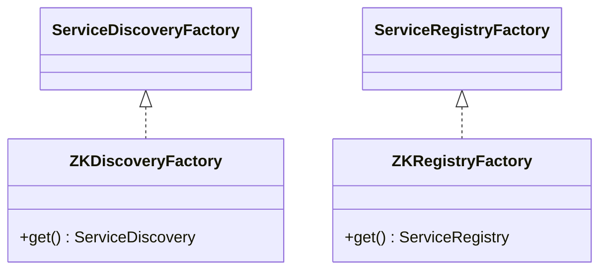
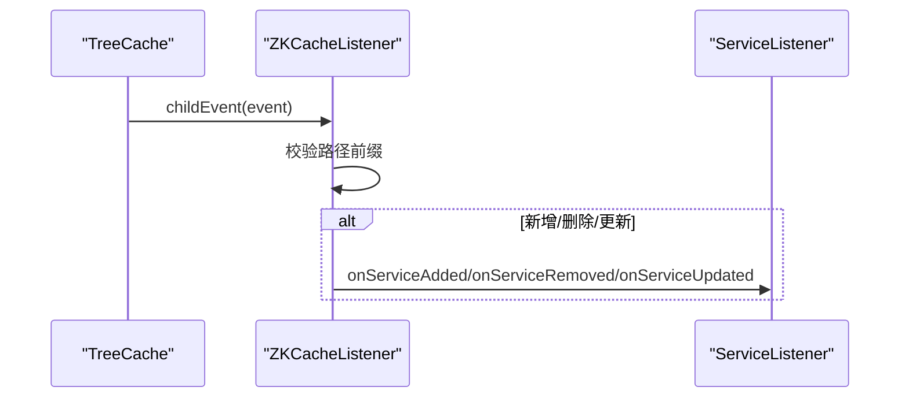
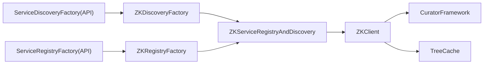

# Zookeeper集成

<cite>
**本文引用的文件**
- [ZKServiceRegistryAndDiscovery.java](file://mpush-zk/src/main/java/com/mpush/zk/ZKServiceRegistryAndDiscovery.java)
- [ZKClient.java](file://mpush-zk/src/main/java/com/mpush/zk/ZKClient.java)
- [ZKDiscoveryFactory.java](file://mpush-zk/src/main/java/com/mpush/zk/ZKDiscoveryFactory.java)
- [ZKRegistryFactory.java](file://mpush-zk/src/main/java/com/mpush/zk/ZKRegistryFactory.java)
- [ZKConfig.java](file://mpush-zk/src/main/java/com/mpush/zk/ZKConfig.java)
- [ZKCacheListener.java](file://mpush-zk/src/main/java/com/mpush/zk/ZKCacheListener.java)
- [ZKException.java](file://mpush-zk/src/main/java/com/mpush/zk/ZKException.java)
- [ZKPath.java](file://mpush-zk/src/main/java/com/mpush/zk/ZKPath.java)
- [ZKSyncMap.java](file://mpush-zk/src/main/java/com/mpush/zk/ZKSyncMap.java)
- [ServiceDiscoveryFactory.java](file://mpush-api/src/main/java/com/mpush/api/spi/common/ServiceDiscoveryFactory.java)
- [ServiceRegistryFactory.java](file://mpush-api/src/main/java/com/mpush/api/spi/common/ServiceRegistryFactory.java)
- [CommonServiceNode.java](file://mpush-api/src/main/java/com/mpush/api/srd/CommonServiceNode.java)
- [ServiceNames.java](file://mpush-api/src/main/java/com/mpush/api/srd/ServiceNames.java)
- [ServiceListener.java](file://mpush-api/src/main/java/com/mpush/api/srd/ServiceListener.java)
- [ServiceRegistry.java](file://mpush-api/src/main/java/com/mpush/api/srd/ServiceRegistry.java)
- [ServiceDiscovery.java](file://mpush-api/src/main/java/com/mpush/api/srd/ServiceDiscovery.java)
- [reference.conf](file://conf/reference.conf)
- [application.conf](file://mpush-test/src/main/resources/application.conf)
- [ServiceDiscoveryFactory SPI入口](file://mpush-zk/src/main/resources/META-INF/services/com.mpush.api.spi.common.ServiceDiscoveryFactory)
- [ServiceRegistryFactory SPI入口](file://mpush-zk/src/main/resources/META-INF/services/com.mpush.api.spi.common.ServiceRegistryFactory)
- [ZKClientTest.java](file://mpush-test/src/main/java/com/mpush/test/zk/ZKClientTest.java)
</cite>

## 目录
1. [简介](#简介)
2. [项目结构](#项目结构)
3. [核心组件](#核心组件)
4. [架构总览](#架构总览)
5. [组件详解](#组件详解)
6. [依赖关系分析](#依赖关系分析)
7. [性能与调优](#性能与调优)
8. [故障排查指南](#故障排查指南)
9. [结论](#结论)
10. [附录](#附录)

## 简介
本章节概述MPush中Zookeeper集成的目标与价值，重点说明ZK在分布式系统中的关键作用：服务注册与发现、动态配置与事件通知、基于临时节点的健康状态维护等。同时给出ZKServiceRegistryAndDiscovery类与ZKClient的职责边界与协作关系，帮助读者建立整体认知。

## 项目结构
MPush的Zookeeper集成位于独立模块mpush-zk中，围绕Curator框架构建，提供服务注册与发现、配置加载、事件监听与重连恢复等能力。核心文件包括：
- ZKServiceRegistryAndDiscovery：统一的服务注册与发现门面
- ZKClient：ZK客户端封装，负责连接、会话、重连、本地缓存与操作
- ZKConfig：ZK配置加载与参数构建
- ZKDiscoveryFactory、ZKRegistryFactory：SPI工厂，对接MPush的ServiceDiscoveryFactory与ServiceRegistryFactory
- ZKCacheListener：基于TreeCache的节点变更监听适配
- ZKPath：常用ZK路径枚举
- ZKSyncMap：基于ZK的键值同步Map实现
- SPI配置文件：META-INF/services下的工厂绑定

图表来源
- [ZKServiceRegistryAndDiscovery.java](file://mpush-zk/src/main/java/com/mpush/zk/ZKServiceRegistryAndDiscovery.java#L39-L118)
- [ZKClient.java](file://mpush-zk/src/main/java/com/mpush/zk/ZKClient.java#L42-L379)
- [ZKConfig.java](file://mpush-zk/src/main/java/com/mpush/zk/ZKConfig.java#L24-L162)
- [ZKDiscoveryFactory.java](file://mpush-zk/src/main/java/com/mpush/zk/ZKDiscoveryFactory.java#L31-L36)
- [ZKRegistryFactory.java](file://mpush-zk/src/main/java/com/mpush/zk/ZKRegistryFactory.java#L31-L36)
- [ZKCacheListener.java](file://mpush-zk/src/main/java/com/mpush/zk/ZKCacheListener.java#L37-L68)
- [ZKPath.java](file://mpush-zk/src/main/java/com/mpush/zk/ZKPath.java#L27-L67)
- [ZKSyncMap.java](file://mpush-zk/src/main/java/com/mpush/zk/ZKSyncMap.java#L16-L224)
- [ServiceDiscoveryFactory.java](file://mpush-api/src/main/java/com/mpush/api/spi/common/ServiceDiscoveryFactory.java)
- [ServiceRegistryFactory.java](file://mpush-api/src/main/java/com/mpush/api/spi/common/ServiceRegistryFactory.java)
- [ServiceDiscovery.java](file://mpush-api/src/main/java/com/mpush/api/srd/ServiceDiscovery.java)
- [ServiceRegistry.java](file://mpush-api/src/main/java/com/mpush/api/srd/ServiceRegistry.java)
- [ServiceNames.java](file://mpush-api/src/main/java/com/mpush/api/srd/ServiceNames.java)
- [ServiceListener.java](file://mpush-api/src/main/java/com/mpush/api/srd/ServiceListener.java)
- [CommonServiceNode.java](file://mpush-api/src/main/java/com/mpush/api/srd/CommonServiceNode.java)

章节来源
- [ZKServiceRegistryAndDiscovery.java](file://mpush-zk/src/main/java/com/mpush/zk/ZKServiceRegistryAndDiscovery.java#L39-L118)
- [ZKClient.java](file://mpush-zk/src/main/java/com/mpush/zk/ZKClient.java#L42-L379)
- [ZKConfig.java](file://mpush-zk/src/main/java/com/mpush/zk/ZKConfig.java#L24-L162)
- [ZKDiscoveryFactory.java](file://mpush-zk/src/main/java/com/mpush/zk/ZKDiscoveryFactory.java#L31-L36)
- [ZKRegistryFactory.java](file://mpush-zk/src/main/java/com/mpush/zk/ZKRegistryFactory.java#L31-L36)
- [ZKCacheListener.java](file://mpush-zk/src/main/java/com/mpush/zk/ZKCacheListener.java#L37-L68)
- [ZKPath.java](file://mpush-zk/src/main/java/com/mpush/zk/ZKPath.java#L27-L67)
- [ZKSyncMap.java](file://mpush-zk/src/main/java/com/mpush/zk/ZKSyncMap.java#L16-L224)

## 核心组件
- ZKServiceRegistryAndDiscovery：统一门面，实现ServiceRegistry与ServiceDiscovery接口，委托ZKClient完成实际的ZK操作；提供服务注册/反注册、服务发现、订阅/取消订阅（订阅通过ZKCacheListener实现）。
- ZKClient：基于Curator的客户端封装，负责初始化、连接、会话状态监听、本地TreeCache缓存、持久/临时/顺序临时节点注册、数据读写、删除、子节点查询、ACL与命名空间等。
- ZKConfig：从配置中心加载ZK连接参数（地址、命名空间、digest、watch-path、重试策略、连接/会话超时），并提供默认值。
- ZKDiscoveryFactory/ZKRegistryFactory：SPI工厂，返回ZKServiceRegistryAndDiscovery实例，供上层通过ServiceDiscoveryFactory.create()/ServiceRegistryFactory.create()获取。
- ZKCacheListener：将TreeCache事件转换为ServiceListener回调，支持节点新增/删除/更新。
- ZKPath：预定义常用ZK路径根节点，便于统一管理。
- ZKSyncMap：基于ZK实现的Map，用于跨节点共享键值数据，适合轻量级配置或状态同步场景。

章节来源
- [ZKServiceRegistryAndDiscovery.java](file://mpush-zk/src/main/java/com/mpush/zk/ZKServiceRegistryAndDiscovery.java#L39-L118)
- [ZKClient.java](file://mpush-zk/src/main/java/com/mpush/zk/ZKClient.java#L42-L379)
- [ZKConfig.java](file://mpush-zk/src/main/java/com/mpush/zk/ZKConfig.java#L24-L162)
- [ZKDiscoveryFactory.java](file://mpush-zk/src/main/java/com/mpush/zk/ZKDiscoveryFactory.java#L31-L36)
- [ZKRegistryFactory.java](file://mpush-zk/src/main/java/com/mpush/zk/ZKRegistryFactory.java#L31-L36)
- [ZKCacheListener.java](file://mpush-zk/src/main/java/com/mpush/zk/ZKCacheListener.java#L37-L68)
- [ZKPath.java](file://mpush-zk/src/main/java/com/mpush/zk/ZKPath.java#L27-L67)
- [ZKSyncMap.java](file://mpush-zk/src/main/java/com/mpush/zk/ZKSyncMap.java#L16-L224)

## 架构总览
ZK集成采用“门面+客户端+工厂+配置”的分层设计：
- 门面层：ZKServiceRegistryAndDiscovery统一对外暴露注册与发现能力
- 客户端层：ZKClient封装Curator，提供连接、缓存、重连、ACL、命名空间等
- 工厂层：ZKDiscoveryFactory与ZKRegistryFactory通过SPI绑定，实现可插拔替换
- 配置层：ZKConfig从配置中心加载参数，支持digest、命名空间、watch-path、重试策略、超时等

图表来源
- [ZKRegistryFactory.java](file://mpush-zk/src/main/java/com/mpush/zk/ZKRegistryFactory.java#L31-L36)
- [ZKDiscoveryFactory.java](file://mpush-zk/src/main/java/com/mpush/zk/ZKDiscoveryFactory.java#L31-L36)
- [ZKServiceRegistryAndDiscovery.java](file://mpush-zk/src/main/java/com/mpush/zk/ZKServiceRegistryAndDiscovery.java#L68-L117)
- [ZKClient.java](file://mpush-zk/src/main/java/com/mpush/zk/ZKClient.java#L76-L144)

## 组件详解

### ZKServiceRegistryAndDiscovery 设计与实现
- 角色定位：实现ServiceRegistry与ServiceDiscovery，作为ZK集成的统一门面
- 启停流程：复用BaseService的start/stop，内部委托ZKClient执行
- 注册/反注册：根据节点是否持久，选择持久或临时节点注册；反注册时确保客户端运行中再删除
- 服务发现：列出指定服务名的子节点，读取节点数据并反序列化为CommonServiceNode
- 订阅/取消：通过ZKCacheListener注册TreeCache监听；取消订阅接口预留
- 关键路径参考
  - [构造与委托](file://mpush-zk/src/main/java/com/mpush/zk/ZKServiceRegistryAndDiscovery.java#L45-L47)
  - [启停与委托](file://mpush-zk/src/main/java/com/mpush/zk/ZKServiceRegistryAndDiscovery.java#L58-L75)
  - [注册/反注册](file://mpush-zk/src/main/java/com/mpush/zk/ZKServiceRegistryAndDiscovery.java#L77-L91)
  - [服务发现](file://mpush-zk/src/main/java/com/mpush/zk/ZKServiceRegistryAndDiscovery.java#L93-L107)
  - [订阅/取消](file://mpush-zk/src/main/java/com/mpush/zk/ZKServiceRegistryAndDiscovery.java#L109-L117)

图表来源
- [ZKServiceRegistryAndDiscovery.java](file://mpush-zk/src/main/java/com/mpush/zk/ZKServiceRegistryAndDiscovery.java#L39-L118)
- [ZKClient.java](file://mpush-zk/src/main/java/com/mpush/zk/ZKClient.java#L42-L379)

章节来源
- [ZKServiceRegistryAndDiscovery.java](file://mpush-zk/src/main/java/com/mpush/zk/ZKServiceRegistryAndDiscovery.java#L39-L118)

### ZKClient 实现细节
- 连接管理：init阶段构建CuratorFramework，支持命名空间、digest ACL、连接/会话超时；启动后阻塞等待连接成功
- 会话超时处理：通过getConnectionStateListenable监听状态变化；当RECONNECTED时自动重注册临时/顺序临时节点
- 重连机制：指数退避重试策略，配合maxRetries与maxSleepMs；连接断开后自动恢复临时节点
- 异常处理：统一包装为ZKException，避免上层直接感知底层异常类型
- 本地缓存：TreeCache缓存watchPath及其子树，优先从本地读取，失败回源远端
- 数据操作：提供持久/临时/顺序临时节点注册、更新、删除、子节点查询、存在性检查等
- 关键路径参考
  - [初始化与连接](file://mpush-zk/src/main/java/com/mpush/zk/ZKClient.java#L76-L86)
  - [ACL与命名空间](file://mpush-zk/src/main/java/com/mpush/zk/ZKClient.java#L106-L143)
  - [连接状态监听与重连](file://mpush-zk/src/main/java/com/mpush/zk/ZKClient.java#L148-L156)
  - [本地缓存与读取](file://mpush-zk/src/main/java/com/mpush/zk/ZKClient.java#L159-L196)
  - [注册/更新/删除](file://mpush-zk/src/main/java/com/mpush/zk/ZKClient.java#L237-L361)
  - [监听注册](file://mpush-zk/src/main/java/com/mpush/zk/ZKClient.java#L363-L365)

图表来源
- [ZKClient.java](file://mpush-zk/src/main/java/com/mpush/zk/ZKClient.java#L76-L86)
- [ZKClient.java](file://mpush-zk/src/main/java/com/mpush/zk/ZKClient.java#L106-L156)

章节来源
- [ZKClient.java](file://mpush-zk/src/main/java/com/mpush/zk/ZKClient.java#L42-L379)

### ZKDiscoveryFactory 与 ZKRegistryFactory 的工厂模式与SPI
- 设计模式：采用工厂模式，通过SPI机制对外暴露，便于替换不同实现
- SPI绑定：在META-INF/services下声明实现类，供ServiceDiscoveryFactory.create()/ServiceRegistryFactory.create()加载
- 关键路径参考
  - [ZKDiscoveryFactory](file://mpush-zk/src/main/java/com/mpush/zk/ZKDiscoveryFactory.java#L31-L36)
  - [ZKRegistryFactory](file://mpush-zk/src/main/java/com/mpush/zk/ZKRegistryFactory.java#L31-L36)
  - [SPI入口-发现](file://mpush-zk/src/main/resources/META-INF/services/com.mpush.api.spi.common.ServiceDiscoveryFactory#L1)
  - [SPI入口-注册](file://mpush-zk/src/main/resources/META-INF/services/com.mpush.api.spi.common.ServiceRegistryFactory#L1)

图表来源
- [ServiceDiscoveryFactory.java](file://mpush-api/src/main/java/com/mpush/api/spi/common/ServiceDiscoveryFactory.java)
- [ServiceRegistryFactory.java](file://mpush-api/src/main/java/com/mpush/api/spi/common/ServiceRegistryFactory.java)
- [ZKDiscoveryFactory.java](file://mpush-zk/src/main/java/com/mpush/zk/ZKDiscoveryFactory.java#L31-L36)
- [ZKRegistryFactory.java](file://mpush-zk/src/main/java/com/mpush/zk/ZKRegistryFactory.java#L31-L36)

章节来源
- [ZKDiscoveryFactory.java](file://mpush-zk/src/main/java/com/mpush/zk/ZKDiscoveryFactory.java#L31-L36)
- [ZKRegistryFactory.java](file://mpush-zk/src/main/java/com/mpush/zk/ZKRegistryFactory.java#L31-L36)

### ZKCacheListener 节点监听与事件分发
- 监听范围：仅处理匹配watchPath前缀的节点事件
- 事件类型：NODE_ADDED/NODE_REMOVED/NODE_UPDATED
- 数据解析：将节点字节数组反序列化为CommonServiceNode并回调ServiceListener
- 关键路径参考
  - [事件分发与回调](file://mpush-zk/src/main/java/com/mpush/zk/ZKCacheListener.java#L48-L68)

图表来源
- [ZKCacheListener.java](file://mpush-zk/src/main/java/com/mpush/zk/ZKCacheListener.java#L48-L68)

章节来源
- [ZKCacheListener.java](file://mpush-zk/src/main/java/com/mpush/zk/ZKCacheListener.java#L37-L68)

### ZKConfig 配置加载与参数
- 参数来源：从配置中心加载server-address、namespace、digest、watch-path、重试策略、连接/会话超时
- 默认值：提供合理默认，避免空指针与配置缺失
- 关键路径参考
  - [默认值与常量](file://mpush-zk/src/main/java/com/mpush/zk/ZKConfig.java#L24-L31)
  - [构建方法与参数映射](file://mpush-zk/src/main/java/com/mpush/zk/ZKConfig.java#L54-L65)
  - [配置项定义](file://conf/reference.conf#L125-L141)

章节来源
- [ZKConfig.java](file://mpush-zk/src/main/java/com/mpush/zk/ZKConfig.java#L24-L162)
- [reference.conf](file://conf/reference.conf#L125-L141)

### ZKPath 路径约定
- 提供常用服务路径枚举，如CONNECT_SERVER/GATEWAY_SERVER/WS_SERVER/DNS_MAPPING等
- 支持拼接tail与获取完整路径，便于统一管理
- 关键路径参考
  - [路径枚举与工具方法](file://mpush-zk/src/main/java/com/mpush/zk/ZKPath.java#L27-L67)

章节来源
- [ZKPath.java](file://mpush-zk/src/main/java/com/mpush/zk/ZKPath.java#L27-L67)

### ZKSyncMap 键值同步Map
- 基于ZK实现Map接口，键为字符串，值为可序列化对象
- 适合轻量级跨节点共享状态或配置
- 关键路径参考
  - [Map实现与序列化](file://mpush-zk/src/main/java/com/mpush/zk/ZKSyncMap.java#L16-L224)

章节来源
- [ZKSyncMap.java](file://mpush-zk/src/main/java/com/mpush/zk/ZKSyncMap.java#L16-L224)

## 依赖关系分析
- 组件耦合：ZKServiceRegistryAndDiscovery高度依赖ZKClient；ZKClient依赖CuratorFramework与TreeCache；ZKDiscoveryFactory/ZKRegistryFactory依赖API层SPI接口
- 外部依赖：Curator、Zookeeper、Guava、Logback等
- SPI扩展：通过META-INF/services实现工厂替换，符合MPush的插件化设计理念

图表来源
- [ServiceDiscoveryFactory.java](file://mpush-api/src/main/java/com/mpush/api/spi/common/ServiceDiscoveryFactory.java)
- [ServiceRegistryFactory.java](file://mpush-api/src/main/java/com/mpush/api/spi/common/ServiceRegistryFactory.java)
- [ZKDiscoveryFactory.java](file://mpush-zk/src/main/java/com/mpush/zk/ZKDiscoveryFactory.java#L31-L36)
- [ZKRegistryFactory.java](file://mpush-zk/src/main/java/com/mpush/zk/ZKRegistryFactory.java#L31-L36)
- [ZKServiceRegistryAndDiscovery.java](file://mpush-zk/src/main/java/com/mpush/zk/ZKServiceRegistryAndDiscovery.java#L39-L118)
- [ZKClient.java](file://mpush-zk/src/main/java/com/mpush/zk/ZKClient.java#L42-L379)

章节来源
- [ZKServiceRegistryAndDiscovery.java](file://mpush-zk/src/main/java/com/mpush/zk/ZKServiceRegistryAndDiscovery.java#L39-L118)
- [ZKClient.java](file://mpush-zk/src/main/java/com/mpush/zk/ZKClient.java#L42-L379)
- [ZKDiscoveryFactory.java](file://mpush-zk/src/main/java/com/mpush/zk/ZKDiscoveryFactory.java#L31-L36)
- [ZKRegistryFactory.java](file://mpush-zk/src/main/java/com/mpush/zk/ZKRegistryFactory.java#L31-L36)

## 性能与调优
- 连接与会话
  - 连接超时与会话超时：根据网络状况与ZK集群规模调整，避免过短导致频繁重连，过长导致感知延迟
  - 命名空间与digest：合理使用命名空间隔离环境；digest用于细粒度权限控制，注意ACL开销
- 重试策略
  - baseSleepTimeMs、maxRetries、maxSleepMs：指数退避策略需平衡重试频率与系统压力
- 本地缓存
  - watch-path：尽量缩小监听范围，减少TreeCache内存占用与事件风暴
  - get优先本地缓存：降低远端读取压力，提高响应速度
- 节点类型
  - 临时节点：适合健康状态与负载均衡；顺序临时节点：适合排队与公平性需求
- 配置参考
  - [ZK配置项](file://conf/reference.conf#L125-L141)
  - [ZKConfig构建](file://mpush-zk/src/main/java/com/mpush/zk/ZKConfig.java#L54-L65)

章节来源
- [ZKClient.java](file://mpush-zk/src/main/java/com/mpush/zk/ZKClient.java#L106-L156)
- [ZKConfig.java](file://mpush-zk/src/main/java/com/mpush/zk/ZKConfig.java#L54-L65)
- [reference.conf](file://conf/reference.conf#L125-L141)

## 故障排查指南
- 连接失败
  - 现象：启动后无法连接ZK，阻塞等待超时
  - 排查：确认server-address、namespace、digest、连接/会话超时配置；检查网络连通性与ACL权限
  - 参考：[连接初始化与超时等待](file://mpush-zk/src/main/java/com/mpush/zk/ZKClient.java#L76-L86)
- 会话中断与重连
  - 现象：连接短暂中断后恢复，临时节点丢失
  - 排查：确认指数退避策略与重试上限；检查ZKServer负载与网络抖动
  - 参考：[连接状态监听与重连恢复](file://mpush-zk/src/main/java/com/mpush/zk/ZKClient.java#L148-L156)
- 权限问题
  - 现象：读写失败或拒绝
  - 排查：确认digest配置与ACLProvider；使用addauth digest验证
  - 参考：[ACL与授权](file://mpush-zk/src/main/java/com/mpush/zk/ZKClient.java#L119-L142)
- 监听未生效
  - 现象：订阅后无回调
  - 排查：确认watchPath前缀匹配；检查节点事件类型与数据序列化
  - 参考：[监听与事件分发](file://mpush-zk/src/main/java/com/mpush/zk/ZKCacheListener.java#L48-L68)
- 异常处理
  - 现象：底层异常未被上层感知
  - 排查：统一捕获并包装为ZKException，便于定位
  - 参考：[异常封装](file://mpush-zk/src/main/java/com/mpush/zk/ZKException.java#L27-L43)

章节来源
- [ZKClient.java](file://mpush-zk/src/main/java/com/mpush/zk/ZKClient.java#L76-L156)
- [ZKCacheListener.java](file://mpush-zk/src/main/java/com/mpush/zk/ZKCacheListener.java#L48-L68)
- [ZKException.java](file://mpush-zk/src/main/java/com/mpush/zk/ZKException.java#L27-L43)

## 结论
MPush的Zookeeper集成通过清晰的分层设计与SPI扩展机制，提供了稳定的服务注册与发现能力。ZKClient在连接管理、会话恢复、本地缓存与ACL方面具备良好工程化实现；ZKServiceRegistryAndDiscovery以简洁API屏蔽ZK复杂性，适合在分布式系统中快速落地。结合合理的配置与调优策略，可满足高可用与高性能的生产需求。

## 附录

### 集成步骤与最佳实践
- 步骤
  - 引入mpush-zk模块与依赖
  - 在配置中心设置ZK参数（server-address、namespace、digest、watch-path、重试、超时）
  - 通过ServiceDiscoveryFactory.create()/ServiceRegistryFactory.create()获取实例
  - 注册服务节点（持久/临时/顺序临时），订阅变更事件
- 最佳实践
  - 使用命名空间隔离环境
  - 合理设置watch-path，避免监听范围过大
  - 临时节点用于健康状态，顺序临时节点用于排队
  - 通过ACL限制权限，保障安全性
  - 监控连接状态与事件回调，及时发现异常

章节来源
- [reference.conf](file://conf/reference.conf#L125-L141)
- [ZKClient.java](file://mpush-zk/src/main/java/com/mpush/zk/ZKClient.java#L106-L156)
- [ZKServiceRegistryAndDiscovery.java](file://mpush-zk/src/main/java/com/mpush/zk/ZKServiceRegistryAndDiscovery.java#L77-L117)

### 测试与验证
- 单元测试参考
  - [ZKClientTest-注册/发现/读取](file://mpush-test/src/main/java/com/mpush/test/zk/ZKClientTest.java#L40-L93)
- 验证要点
  - 服务注册后可被发现
  - 订阅事件能正确回调
  - 临时节点断开后自动清理
  - ACL与命名空间生效

章节来源
- [ZKClientTest.java](file://mpush-test/src/main/java/com/mpush/test/zk/ZKClientTest.java#L40-L93)