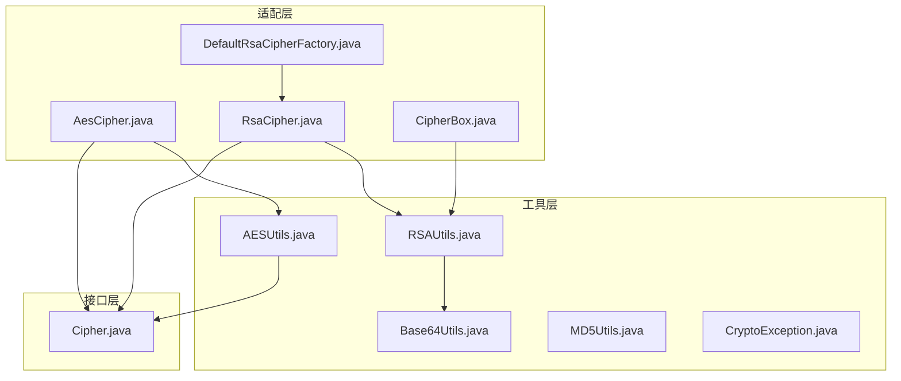
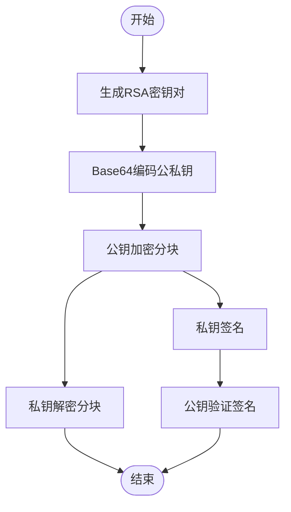
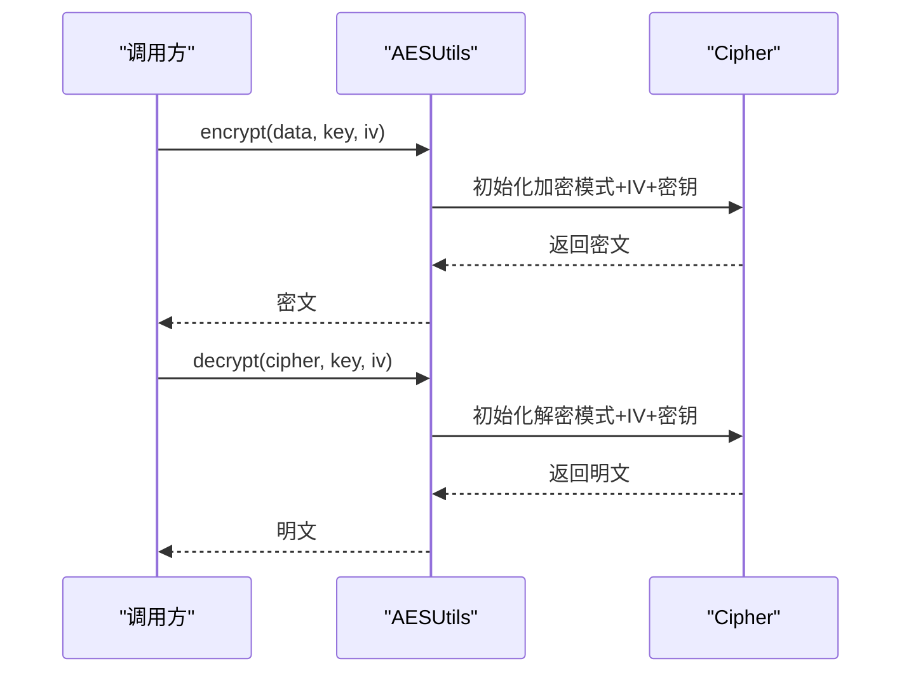
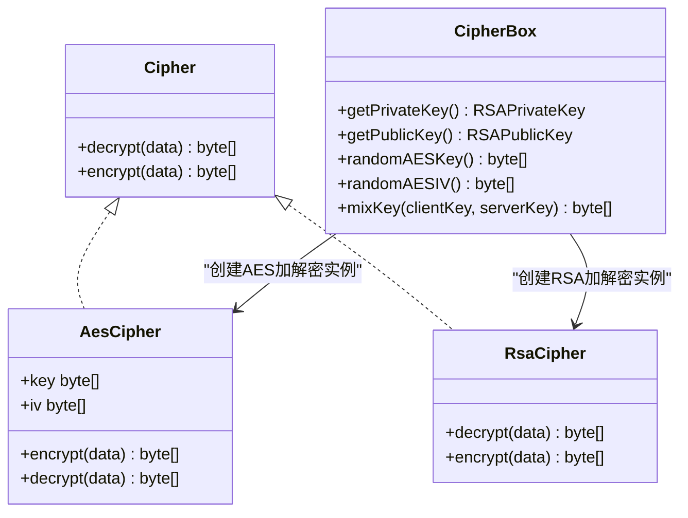
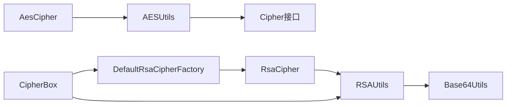

# 加密工具库

<cite>
**本文引用的文件**
- [RSAUtils.java](file://mpush-tools/src/main/java/com/mpush/tools/crypto/RSAUtils.java)
- [AESUtils.java](file://mpush-tools/src/main/java/com/mpush/tools/crypto/AESUtils.java)
- [Base64Utils.java](file://mpush-tools/src/main/java/com/mpush/tools/crypto/Base64Utils.java)
- [MD5Utils.java](file://mpush-tools/src/main/java/com/mpush/tools/crypto/MD5Utils.java)
- [CryptoException.java](file://mpush-tools/src/main/java/com/mpush/tools/crypto/CryptoException.java)
- [AesCipher.java](file://mpush-common/src/main/java/com/mpush/common/security/AesCipher.java)
- [RsaCipher.java](file://mpush-common/src/main/java/com/mpush/common/security/RsaCipher.java)
- [CipherBox.java](file://mpush-common/src/main/java/com/mpush/common/security/CipherBox.java)
- [Cipher.java](file://mpush-api/src/main/java/com/mpush/api/connection/Cipher.java)
- [DefaultRsaCipherFactory.java](file://mpush-common/src/main/java/com/mpush/common/security/DefaultRsaCipherFactory.java)
- [reference.conf](file://conf/reference.conf)
- [CC.java](file://mpush-tools/src/main/java/com/mpush/tools/config/CC.java)
- [RSAUtilsTest.java](file://mpush-tools/src/test/java/com/mpush/tools/crypto/RSAUtilsTest.java)
- [AESUtilsTest.java](file://mpush-tools/src/test/java/com/mpush/tools/crypto/AESUtilsTest.java)
</cite>

## 目录
1. [简介](#简介)
2. [项目结构](#项目结构)
3. [核心组件](#核心组件)
4. [架构总览](#架构总览)
5. [组件详解](#组件详解)
6. [依赖关系分析](#依赖关系分析)
7. [性能与安全考量](#性能与安全考量)
8. [故障排查指南](#故障排查指南)
9. [结论](#结论)
10. [附录](#附录)

## 简介
本文件面向MPush的加密工具库，系统性梳理其在安全通信中的作用与实现，重点覆盖以下方面：
- 数据保护：对称加密（AES）与非对称加密（RSA）在消息传输中的协同使用
- 身份认证与完整性校验：基于RSA的数字签名与摘要算法（MD5/SHA-1/HMAC）
- 密钥管理：RSA密钥生成、编码解码、会话密钥派生与混合作用
- 异常处理：统一的加密异常体系与错误定位
- 性能与最佳实践：算法选择、填充模式、初始化向量（IV）与密钥长度建议

## 项目结构
加密工具库位于独立模块中，核心类集中在工具包内；在通用模块中提供了与连接层对接的加解密适配器，形成“工具层 → 适配层 → 接口层”的清晰分层。



图示来源
- [RSAUtils.java](file://mpush-tools/src/main/java/com/mpush/tools/crypto/RSAUtils.java#L1-L405)
- [AESUtils.java](file://mpush-tools/src/main/java/com/mpush/tools/crypto/AESUtils.java#L1-L96)
- [Base64Utils.java](file://mpush-tools/src/main/java/com/mpush/tools/crypto/Base64Utils.java#L1-L53)
- [MD5Utils.java](file://mpush-tools/src/main/java/com/mpush/tools/crypto/MD5Utils.java#L1-L112)
- [CryptoException.java](file://mpush-tools/src/main/java/com/mpush/tools/crypto/CryptoException.java#L1-L39)
- [AesCipher.java](file://mpush-common/src/main/java/com/mpush/common/security/AesCipher.java#L1-L86)
- [RsaCipher.java](file://mpush-common/src/main/java/com/mpush/common/security/RsaCipher.java#L1-L61)
- [CipherBox.java](file://mpush-common/src/main/java/com/mpush/common/security/CipherBox.java#L1-L93)
- [DefaultRsaCipherFactory.java](file://mpush-common/src/main/java/com/mpush/common/security/DefaultRsaCipherFactory.java#L1-L40)
- [Cipher.java](file://mpush-api/src/main/java/com/mpush/api/connection/Cipher.java#L1-L34)

章节来源
- [RSAUtils.java](file://mpush-tools/src/main/java/com/mpush/tools/crypto/RSAUtils.java#L1-L405)
- [AESUtils.java](file://mpush-tools/src/main/java/com/mpush/tools/crypto/AESUtils.java#L1-L96)
- [Base64Utils.java](file://mpush-tools/src/main/java/com/mpush/tools/crypto/Base64Utils.java#L1-L53)
- [MD5Utils.java](file://mpush-tools/src/main/java/com/mpush/tools/crypto/MD5Utils.java#L1-L112)
- [CryptoException.java](file://mpush-tools/src/main/java/com/mpush/tools/crypto/CryptoException.java#L1-L39)
- [AesCipher.java](file://mpush-common/src/main/java/com/mpush/common/security/AesCipher.java#L1-L86)
- [RsaCipher.java](file://mpush-common/src/main/java/com/mpush/common/security/RsaCipher.java#L1-L61)
- [CipherBox.java](file://mpush-common/src/main/java/com/mpush/common/security/CipherBox.java#L1-L93)
- [DefaultRsaCipherFactory.java](file://mpush-common/src/main/java/com/mpush/common/security/DefaultRsaCipherFactory.java#L1-L40)
- [Cipher.java](file://mpush-api/src/main/java/com/mpush/api/connection/Cipher.java#L1-L34)

## 核心组件
- RSAUtils：提供RSA密钥生成、公私钥编解码、分块加解密、数字签名与签名校验
- AESUtils：提供对称加密/解密、密钥生成（种子随机）、CBC模式与PKCS5Padding填充
- Base64Utils：提供标准Base64编解码（UTF-8）
- MD5Utils：提供MD5摘要、文件摘要、HMAC-SHA1与SHA-1摘要
- CryptoException：统一的加密异常类型
- AesCipher/RsaCipher/CipherBox：与连接层对接的加解密适配器与密钥盒
- DefaultRsaCipherFactory：SPI工厂，提供RSA加解密实例

章节来源
- [RSAUtils.java](file://mpush-tools/src/main/java/com/mpush/tools/crypto/RSAUtils.java#L46-L405)
- [AESUtils.java](file://mpush-tools/src/main/java/com/mpush/tools/crypto/AESUtils.java#L39-L96)
- [Base64Utils.java](file://mpush-tools/src/main/java/com/mpush/tools/crypto/Base64Utils.java#L27-L53)
- [MD5Utils.java](file://mpush-tools/src/main/java/com/mpush/tools/crypto/MD5Utils.java#L38-L112)
- [CryptoException.java](file://mpush-tools/src/main/java/com/mpush/tools/crypto/CryptoException.java#L27-L39)
- [AesCipher.java](file://mpush-common/src/main/java/com/mpush/common/security/AesCipher.java#L36-L86)
- [RsaCipher.java](file://mpush-common/src/main/java/com/mpush/common/security/RsaCipher.java#L33-L61)
- [CipherBox.java](file://mpush-common/src/main/java/com/mpush/common/security/CipherBox.java#L34-L93)
- [DefaultRsaCipherFactory.java](file://mpush-common/src/main/java/com/mpush/common/security/DefaultRsaCipherFactory.java#L31-L40)

## 架构总览
加密工具库在MPush中的位置与职责：
- 工具层负责具体算法实现与异常封装
- 适配层将工具层能力与连接层接口对接
- 接口层抽象出统一的加解密契约
- 配置层提供密钥与参数来源

```mermaid
sequenceDiagram
participant App as "应用/业务层"
participant Box as "CipherBox"
participant RSA as "RSAUtils"
participant AES as "AESUtils"
participant B64 as "Base64Utils"
App->>Box : 请求会话密钥与IV
Box->>RSA : 解析公私钥Base64
RSA->>B64 : 解码密钥
Box-->>App : 返回随机生成的AES密钥与IV
App->>AES : 使用AES密钥与IV加解密
App->>RSA : 使用RSA对敏感数据或会话密钥进行加解密/签名
```

图示来源
- [CipherBox.java](file://mpush-common/src/main/java/com/mpush/common/security/CipherBox.java#L34-L93)
- [RSAUtils.java](file://mpush-tools/src/main/java/com/mpush/tools/crypto/RSAUtils.java#L108-L138)
- [AESUtils.java](file://mpush-tools/src/main/java/com/mpush/tools/crypto/AESUtils.java#L39-L96)
- [Base64Utils.java](file://mpush-tools/src/main/java/com/mpush/tools/crypto/Base64Utils.java#L27-L53)

## 组件详解

### RSAUtils 实现与流程
- 密钥生成：使用RSA算法与指定位数生成公私钥对
- 密钥编解码：通过Base64进行字符串化存储与传输
- 分块加解密：依据模长限制进行分块处理，避免一次性数据超长
- 数字签名：使用MD5withRSA进行签名与验证
- 异常处理：统一抛出CryptoException，便于上层捕获与定位



图示来源
- [RSAUtils.java](file://mpush-tools/src/main/java/com/mpush/tools/crypto/RSAUtils.java#L87-L170)
- [RSAUtils.java](file://mpush-tools/src/main/java/com/mpush/tools/crypto/RSAUtils.java#L226-L351)

章节来源
- [RSAUtils.java](file://mpush-tools/src/main/java/com/mpush/tools/crypto/RSAUtils.java#L46-L405)

### AESUtils 实现与流程
- 算法与填充：AES/CBC/PKCS5Padding
- 密钥生成：基于种子的SecureRandom生成对称密钥
- 加解密：提供字节数组直接加解密与IV参数化版本
- 性能：使用Profiler记录耗时，便于性能分析
- 异常：统一抛出CryptoException



图示来源
- [AESUtils.java](file://mpush-tools/src/main/java/com/mpush/tools/crypto/AESUtils.java#L52-L94)

章节来源
- [AESUtils.java](file://mpush-tools/src/main/java/com/mpush/tools/crypto/AESUtils.java#L39-L96)

### Base64Utils 编解码
- 提供标准Base64编码与解码
- 使用UTF-8进行字节与字符串转换
- 作为RSA密钥与签名结果的载体

章节来源
- [Base64Utils.java](file://mpush-tools/src/main/java/com/mpush/tools/crypto/Base64Utils.java#L27-L53)
- [RSAUtils.java](file://mpush-tools/src/main/java/com/mpush/tools/crypto/RSAUtils.java#L108-L138)

### MD5Utils 摘要与HMAC
- 支持文本、字节数组与文件的MD5摘要
- 提供HMAC-SHA1与SHA-1摘要方法
- 适用于完整性校验与轻量级身份标识

章节来源
- [MD5Utils.java](file://mpush-tools/src/main/java/com/mpush/tools/crypto/MD5Utils.java#L38-L112)

### CryptoException 异常体系
- 统一的运行时异常类型，承载加密相关错误
- 便于上层捕获并进行差异化处理

章节来源
- [CryptoException.java](file://mpush-tools/src/main/java/com/mpush/tools/crypto/CryptoException.java#L27-L39)

### 适配层与接口层
- Cipher接口：抽象出统一的加解密契约
- AesCipher：封装AES加解密，持有密钥与IV
- RsaCipher：封装RSA加解密，持有公私钥
- CipherBox：集中管理RSA密钥加载、随机AES密钥与IV生成、会话密钥混合
- DefaultRsaCipherFactory：SPI工厂，提供RSA加解密实例



图示来源
- [Cipher.java](file://mpush-api/src/main/java/com/mpush/api/connection/Cipher.java#L27-L33)
- [AesCipher.java](file://mpush-common/src/main/java/com/mpush/common/security/AesCipher.java#L36-L86)
- [RsaCipher.java](file://mpush-common/src/main/java/com/mpush/common/security/RsaCipher.java#L33-L61)
- [CipherBox.java](file://mpush-common/src/main/java/com/mpush/common/security/CipherBox.java#L34-L93)

章节来源
- [Cipher.java](file://mpush-api/src/main/java/com/mpush/api/connection/Cipher.java#L27-L33)
- [AesCipher.java](file://mpush-common/src/main/java/com/mpush/common/security/AesCipher.java#L36-L86)
- [RsaCipher.java](file://mpush-common/src/main/java/com/mpush/common/security/RsaCipher.java#L33-L61)
- [CipherBox.java](file://mpush-common/src/main/java/com/mpush/common/security/CipherBox.java#L34-L93)
- [DefaultRsaCipherFactory.java](file://mpush-common/src/main/java/com/mpush/common/security/DefaultRsaCipherFactory.java#L31-L40)

## 依赖关系分析
- 工具层内部：RSAUtils依赖Base64Utils；AESUtils不直接依赖其他工具类
- 适配层：AesCipher与RsaCipher分别依赖AESUtils与RSAUtils
- 接口层：Cipher为上层统一契约
- 配置层：CipherBox从配置中心读取RSA密钥与AES密钥长度



图示来源
- [RSAUtils.java](file://mpush-tools/src/main/java/com/mpush/tools/crypto/RSAUtils.java#L108-L138)
- [AESUtils.java](file://mpush-tools/src/main/java/com/mpush/tools/crypto/AESUtils.java#L39-L96)
- [AesCipher.java](file://mpush-common/src/main/java/com/mpush/common/security/AesCipher.java#L36-L86)
- [RsaCipher.java](file://mpush-common/src/main/java/com/mpush/common/security/RsaCipher.java#L33-L61)
- [CipherBox.java](file://mpush-common/src/main/java/com/mpush/common/security/CipherBox.java#L34-L93)
- [DefaultRsaCipherFactory.java](file://mpush-common/src/main/java/com/mpush/common/security/DefaultRsaCipherFactory.java#L31-L40)

章节来源
- [reference.conf](file://conf/reference.conf#L33-L43)
- [CC.java](file://mpush-tools/src/main/java/com/mpush/tools/config/CC.java#L198-L208)

## 性能与安全考量
- 算法选择与填充
  - RSA：用于密钥交换与小数据签名，采用PKCS1Padding；注意分块处理
  - AES：采用CBC模式与PKCS5Padding，适合大数据加密
- 密钥与IV
  - AES密钥长度由配置决定；IV需随机且每次加密变化，确保语义安全
  - RSA密钥长度建议不低于1024位（当前默认），生产环境建议更高
- 性能
  - AES远快于RSA，应优先用于数据加密
  - AES加解密过程已集成性能计时，便于定位瓶颈
- 安全最佳实践
  - RSA仅用于加密对称密钥或签名，不直接加密大消息
  - 使用强随机源生成密钥与IV
  - 定期轮换密钥，妥善保存私钥
  - 使用HMAC或数字签名保障完整性与抗抵赖

## 故障排查指南
- 常见异常与定位
  - CryptoException：统一异常类型，结合日志定位具体环节（加密/解密/签名）
  - RSA分块失败：检查密钥长度与填充模式是否一致
  - AES解密报错：核对IV与密钥一致性、填充匹配
- 调试建议
  - 使用测试用例验证加解密与签名流程
  - 在CipherBox加载密钥时确认配置项正确
  - 关注Profiler输出，识别耗时热点

章节来源
- [CryptoException.java](file://mpush-tools/src/main/java/com/mpush/tools/crypto/CryptoException.java#L27-L39)
- [AESUtils.java](file://mpush-tools/src/main/java/com/mpush/tools/crypto/AESUtils.java#L64-L94)
- [RSAUtils.java](file://mpush-tools/src/main/java/com/mpush/tools/crypto/RSAUtils.java#L226-L351)
- [RSAUtilsTest.java](file://mpush-tools/src/test/java/com/mpush/tools/crypto/RSAUtilsTest.java#L35-L136)
- [AESUtilsTest.java](file://mpush-tools/src/test/java/com/mpush/tools/crypto/AESUtilsTest.java#L30-L48)

## 结论
MPush加密工具库通过清晰的分层设计，将算法实现与业务解耦，既满足高性能数据加密需求，又提供完善的密钥管理与异常处理机制。结合RSA与AES的组合使用，可有效支撑安全通信场景下的数据保护、身份认证与完整性校验。

## 附录

### 配置项参考
- 安全配置（来自配置文件与配置访问类）
  - RSA公钥与私钥：用于握手与密钥交换
  - AES密钥长度：影响对称加密强度与性能

章节来源
- [reference.conf](file://conf/reference.conf#L33-L43)
- [CC.java](file://mpush-tools/src/main/java/com/mpush/tools/config/CC.java#L198-L208)