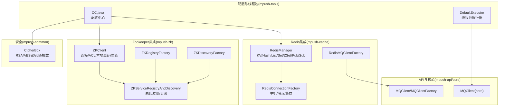
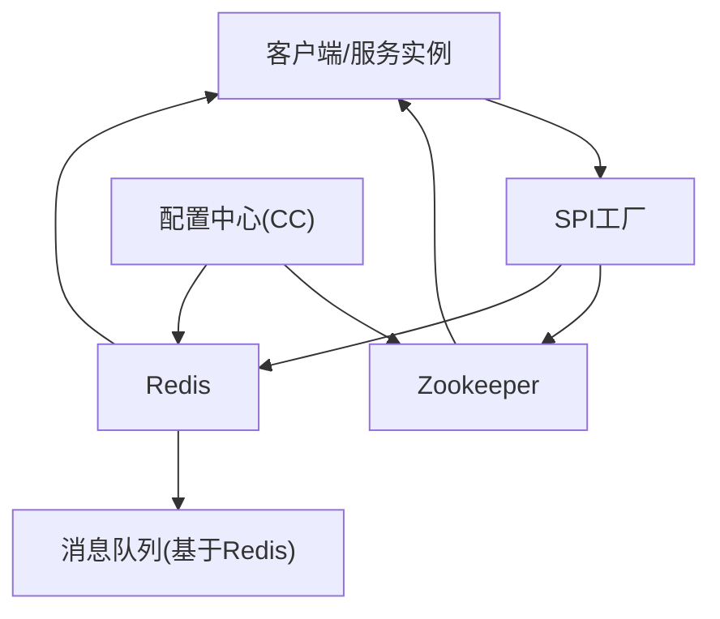
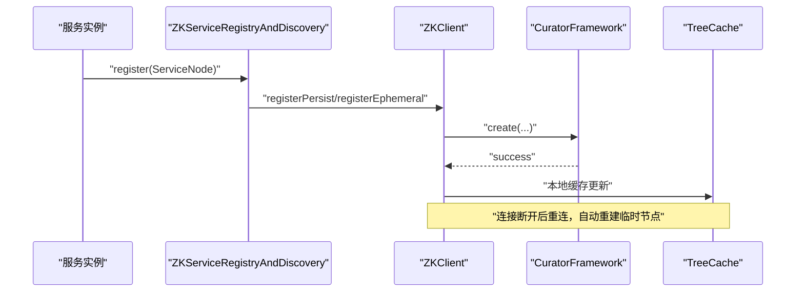
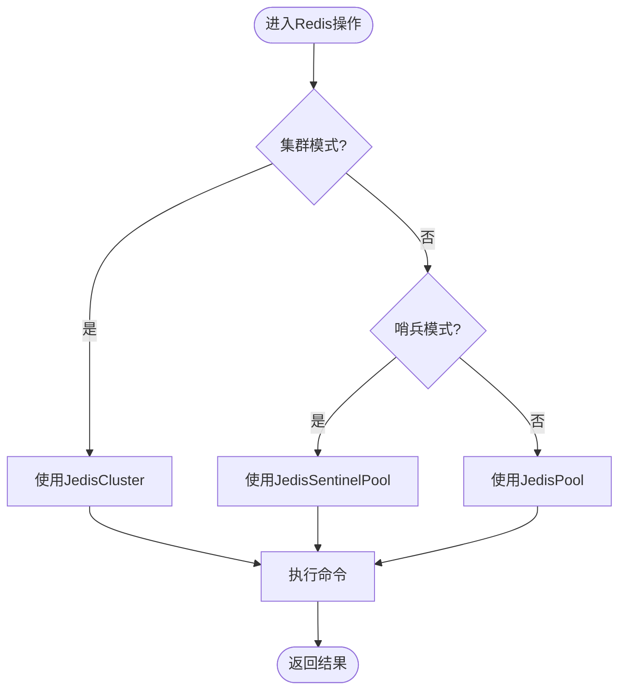
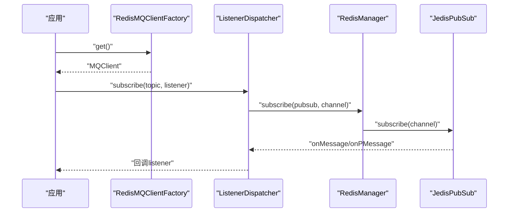
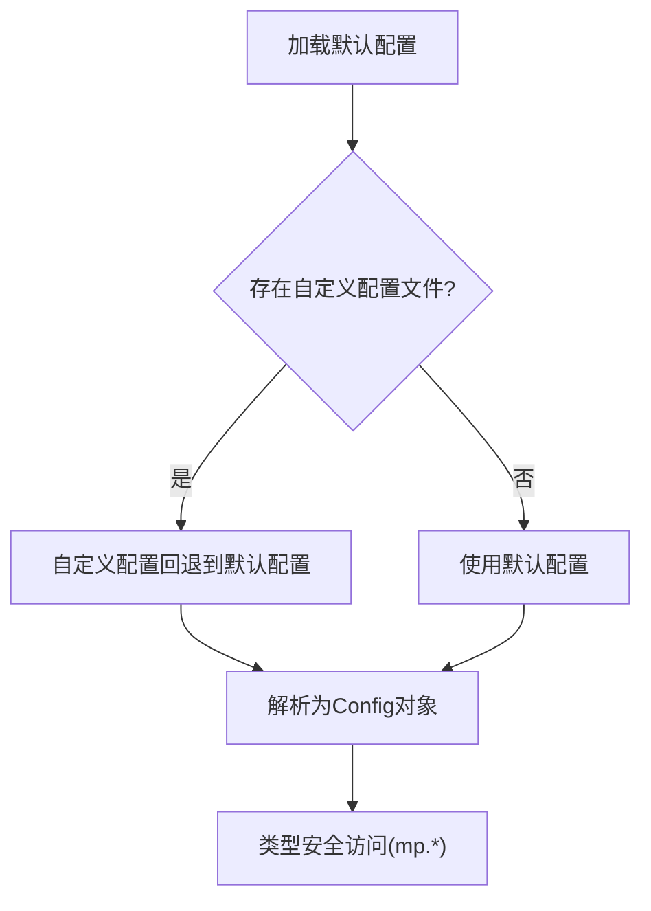
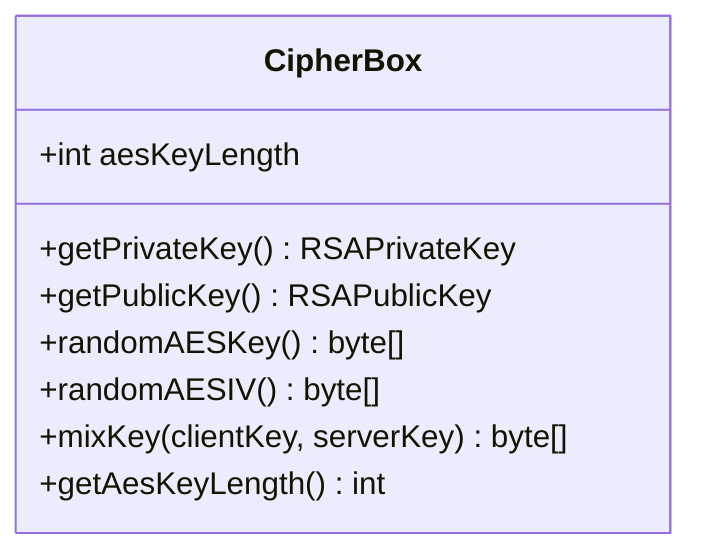
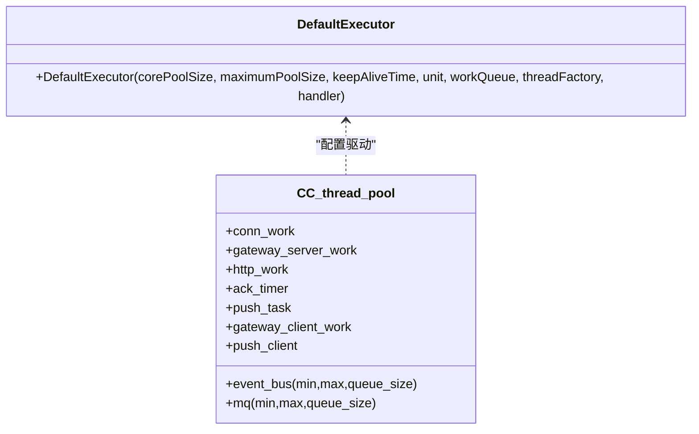
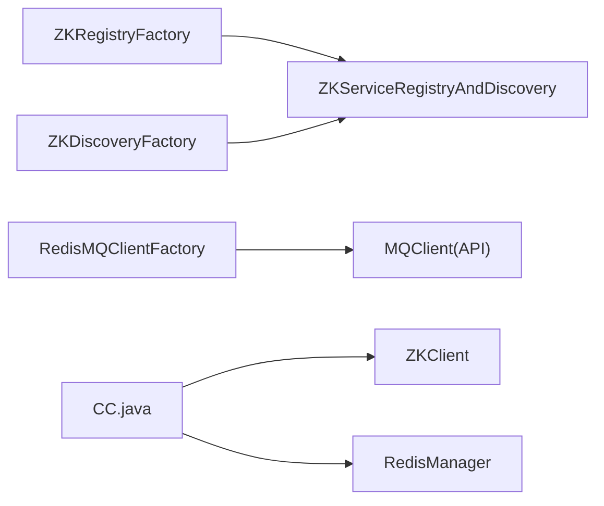

# 基础设施集成

<cite>
**本文引用的文件**
- [README.md](file://README.md)
- [reference.conf](file://conf/reference.conf)
- [conf-dev.properties](file://conf/conf-dev.properties)
- [conf-pub.properties](file://conf/conf-pub.properties)
- [ZKClient.java](file://mpush-zk/src/main/java/com/mpush/zk/ZKClient.java)
- [ZKServiceRegistryAndDiscovery.java](file://mpush-zk/src/main/java/com/mpush/zk/ZKServiceRegistryAndDiscovery.java)
- [ZKRegistryFactory.java](file://mpush-zk/src/main/java/com/mpush/zk/ZKRegistryFactory.java)
- [ZKDiscoveryFactory.java](file://mpush-zk/src/main/java/com/mpush/zk/ZKDiscoveryFactory.java)
- [RedisManager.java](file://mpush-cache/src/main/java/com/mpush/cache/redis/manager/RedisManager.java)
- [RedisConnectionFactory.java](file://mpush-cache/src/main/java/com/mpush/cache/redis/connection/RedisConnectionFactory.java)
- [RedisClusterManager.java](file://mpush-cache/src/main/java/com/mpush/cache/redis/manager/RedisClusterManager.java)
- [RedisMQClientFactory.java](file://mpush-cache/src/main/java/com/mpush/cache/redis/mq/RedisMQClientFactory.java)
- [CC.java](file://mpush-tools/src/main/java/com/mpush/tools/config/CC.java)
- [DefaultExecutor.java](file://mpush-tools/src/main/java/com/mpush/tools/thread/pool/DefaultExecutor.java)
- [CipherBox.java](file://mpush-common/src/main/java/com/mpush/common/security/CipherBox.java)
- [MQClient.java（核心）](file://mpush-core/src/main/java/com/mpush/core/mq/MQClient.java)
- [MQClient.java（API）](file://mpush-api/src/main/java/com/mpush/api/spi/common/MQClient.java)
- [MQClientFactory.java](file://mpush-api/src/main/java/com/mpush/api/spi/common/MQClientFactory.java)
- [SimpleMQClientFactory.java](file://mpush-test/src/main/java/com/mpush/test/spi/SimpleMQClientFactory.java)
- [ConfigCenterTest.java](file://mpush-test/src/main/java/com/mpush/test/configcenter/ConfigCenterTest.java)
</cite>

## 目录
1. [简介](#简介)
2. [项目结构](#项目结构)
3. [核心组件](#核心组件)
4. [架构总览](#架构总览)
5. [组件详细分析](#组件详细分析)
6. [依赖关系分析](#依赖关系分析)
7. [性能考量](#性能考量)
8. [故障排查指南](#故障排查指南)
9. [结论](#结论)
10. [附录](#附录)

## 简介
本文件面向MPush的基础设施集成，围绕Zookeeper服务注册与发现、Redis缓存与消息队列、消息队列集成设计、配置管理系统、加密工具库以及线程池管理展开，提供代码级架构图、流程图与集成指南，帮助开发者正确配置与使用各基础设施组件。

## 项目结构
MPush基础设施相关模块分布于多个子工程中：
- mpush-zk：Zookeeper集成，提供服务注册与发现、配置读取、会话管理与故障恢复
- mpush-cache：Redis集成，提供缓存管理、会话存储、路由信息存储、集群支持与基于Redis的MQ
- mpush-tools：配置中心、线程池、通用工具
- mpush-common：安全工具（RSA/AES、密钥混合）
- mpush-api：SPI接口定义（MQClient、ServiceRegistry、ServiceDiscovery等）
- mpush-core：核心业务与MQ客户端抽象
- mpush-test：测试与示例SPI实现

**图表来源**
- [ZKClient.java](file://mpush-zk/src/main/java/com/mpush/zk/ZKClient.java#L42-L380)
- [ZKServiceRegistryAndDiscovery.java](file://mpush-zk/src/main/java/com/mpush/zk/ZKServiceRegistryAndDiscovery.java#L39-L119)
- [ZKRegistryFactory.java](file://mpush-zk/src/main/java/com/mpush/zk/ZKRegistryFactory.java#L31-L37)
- [ZKDiscoveryFactory.java](file://mpush-zk/src/main/java/com/mpush/zk/ZKDiscoveryFactory.java#L31-L37)
- [RedisManager.java](file://mpush-cache/src/main/java/com/mpush/cache/redis/manager/RedisManager.java#L40-L438)
- [RedisConnectionFactory.java](file://mpush-cache/src/main/java/com/mpush/cache/redis/connection/RedisConnectionFactory.java#L40-L350)
- [RedisMQClientFactory.java](file://mpush-cache/src/main/java/com/mpush/cache/redis/mq/RedisMQClientFactory.java#L31-L40)
- [CC.java](file://mpush-tools/src/main/java/com/mpush/tools/config/CC.java#L39-L355)
- [DefaultExecutor.java](file://mpush-tools/src/main/java/com/mpush/tools/thread/pool/DefaultExecutor.java#L28-L39)
- [CipherBox.java](file://mpush-common/src/main/java/com/mpush/common/security/CipherBox.java#L34-L93)
- [MQClient.java（API）](file://mpush-api/src/main/java/com/mpush/api/spi/common/MQClient.java#L29-L34)
- [MQClient.java（核心）](file://mpush-core/src/main/java/com/mpush/core/mq/MQClient.java#L30-L47)

**章节来源**
- [README.md](file://README.md#L32-L87)
- [reference.conf](file://conf/reference.conf#L13-L325)

## 核心组件
- Zookeeper集成：ZKClient负责连接、ACL、本地TreeCache、临时/顺序节点注册与重连；ZKServiceRegistryAndDiscovery提供服务注册、注销、查询与订阅；ZKRegistryFactory/ZKDiscoveryFactory作为SPI工厂暴露实现。
- Redis集成：RedisManager封装KV、Hash、List、Set、ZSet与Pub/Sub操作；RedisConnectionFactory支持单机、哨兵、集群模式；RedisMQClientFactory提供基于Redis的MQ客户端。
- 配置管理：CC.java统一加载HOCON配置，支持自定义配置文件覆盖与类型安全访问；conf-dev.properties/conf-pub.properties提供开发/生产环境示例。
- 加密工具：CipherBox封装RSA私钥/公钥加载、AES密钥长度、随机数与会话密钥混合算法。
- 线程池管理：DefaultExecutor继承ThreadPoolExecutor，配合线程池配置与拒绝策略使用。
- MQ客户端：API层定义MQClient/MQClientFactory；核心层提供MQClient抽象；测试模块提供简单实现用于演示。

**章节来源**
- [ZKClient.java](file://mpush-zk/src/main/java/com/mpush/zk/ZKClient.java#L75-L145)
- [ZKServiceRegistryAndDiscovery.java](file://mpush-zk/src/main/java/com/mpush/zk/ZKServiceRegistryAndDiscovery.java#L77-L112)
- [RedisManager.java](file://mpush-cache/src/main/java/com/mpush/cache/redis/manager/RedisManager.java#L45-L93)
- [RedisConnectionFactory.java](file://mpush-cache/src/main/java/com/mpush/cache/redis/connection/RedisConnectionFactory.java#L89-L159)
- [CC.java](file://mpush-tools/src/main/java/com/mpush/tools/config/CC.java#L42-L53)
- [CipherBox.java](file://mpush-common/src/main/java/com/mpush/common/security/CipherBox.java#L34-L93)
- [DefaultExecutor.java](file://mpush-tools/src/main/java/com/mpush/tools/thread/pool/DefaultExecutor.java#L28-L39)
- [MQClient.java（API）](file://mpush-api/src/main/java/com/mpush/api/spi/common/MQClient.java#L29-L34)
- [MQClient.java（核心）](file://mpush-core/src/main/java/com/mpush/core/mq/MQClient.java#L30-L47)

## 架构总览
下图展示基础设施组件在系统中的交互关系与职责边界：

**图表来源**
- [ZKRegistryFactory.java](file://mpush-zk/src/main/java/com/mpush/zk/ZKRegistryFactory.java#L31-L37)
- [ZKDiscoveryFactory.java](file://mpush-zk/src/main/java/com/mpush/zk/ZKDiscoveryFactory.java#L31-L37)
- [RedisMQClientFactory.java](file://mpush-cache/src/main/java/com/mpush/cache/redis/mq/RedisMQClientFactory.java#L31-L40)
- [CC.java](file://mpush-tools/src/main/java/com/mpush/tools/config/CC.java#L42-L53)

## 组件详细分析

### Zookeeper集成
- 服务注册与发现
  - 注册：持久节点与临时节点分别用于长期服务与带会话的服务实例登记
  - 发现：通过子节点遍历与反序列化获取服务节点列表
  - 订阅：基于TreeCache监听路径变化，实现动态感知
- 配置管理
  - 本地缓存：TreeCache优先读取本地，回退远程读取
  - ACL与命名空间：支持digest认证与命名空间隔离
- 会话管理与故障转移
  - 连接状态监听：断线重连后自动重建临时节点
  - 重试策略：指数回退重试，避免瞬时故障导致初始化失败

**图表来源**
- [ZKServiceRegistryAndDiscovery.java](file://mpush-zk/src/main/java/com/mpush/zk/ZKServiceRegistryAndDiscovery.java#L77-L91)
- [ZKClient.java](file://mpush-zk/src/main/java/com/mpush/zk/ZKClient.java#L147-L156)
- [ZKClient.java](file://mpush-zk/src/main/java/com/mpush/zk/ZKClient.java#L276-L332)

**章节来源**
- [ZKClient.java](file://mpush-zk/src/main/java/com/mpush/zk/ZKClient.java#L75-L145)
- [ZKClient.java](file://mpush-zk/src/main/java/com/mpush/zk/ZKClient.java#L158-L196)
- [ZKServiceRegistryAndDiscovery.java](file://mpush-zk/src/main/java/com/mpush/zk/ZKServiceRegistryAndDiscovery.java#L77-L112)

### Redis集成
- 缓存管理
  - KV：get/set/del，支持过期时间
  - Hash：hset/hget/hmget/hmset/hdel
  - List：lpush/rpush/lpop/rpop/lrange/llen/lRem
  - Set/Sorted Set：sAdd/sRem/sCard、zAdd/zRem/zCard/zrange
- 会话存储与路由信息存储
  - 通过KV/Hash结构存储用户会话与路由元数据
- 集群支持
  - 支持单机、哨兵、集群三种模式；哨兵模式下自动选择主节点
- 基于Redis的消息队列
  - Pub/Sub发布/订阅，配合ListenerDispatcher实现消息分发

**图表来源**
- [RedisConnectionFactory.java](file://mpush-cache/src/main/java/com/mpush/cache/redis/connection/RedisConnectionFactory.java#L89-L159)
- [RedisManager.java](file://mpush-cache/src/main/java/com/mpush/cache/redis/manager/RedisManager.java#L59-L93)

**章节来源**
- [RedisManager.java](file://mpush-cache/src/main/java/com/mpush/cache/redis/manager/RedisManager.java#L45-L93)
- [RedisManager.java](file://mpush-cache/src/main/java/com/mpush/cache/redis/manager/RedisManager.java#L109-L141)
- [RedisManager.java](file://mpush-cache/src/main/java/com/mpush/cache/redis/manager/RedisManager.java#L152-L227)
- [RedisManager.java](file://mpush-cache/src/main/java/com/mpush/cache/redis/manager/RedisManager.java#L317-L338)
- [RedisConnectionFactory.java](file://mpush-cache/src/main/java/com/mpush/cache/redis/connection/RedisConnectionFactory.java#L109-L159)

### 消息队列集成设计
- MQ客户端工厂
  - RedisMQClientFactory通过ListenerDispatcher实现订阅/发布
- 消息订阅管理
  - RedisManager.subscribe启动独立线程执行subscribe
- 异步处理机制
  - 基于Redis Pub/Sub实现异步消息分发
- 消息持久化
  - 通过List/Hash等结构可实现消息持久化存储（结合业务场景）

**图表来源**
- [RedisMQClientFactory.java](file://mpush-cache/src/main/java/com/mpush/cache/redis/mq/RedisMQClientFactory.java#L31-L40)
- [RedisManager.java](file://mpush-cache/src/main/java/com/mpush/cache/redis/manager/RedisManager.java#L328-L338)

**章节来源**
- [MQClient.java（API）](file://mpush-api/src/main/java/com/mpush/api/spi/common/MQClient.java#L29-L34)
- [MQClient.java（核心）](file://mpush-core/src/main/java/com/mpush/core/mq/MQClient.java#L30-L47)
- [RedisMQClientFactory.java](file://mpush-cache/src/main/java/com/mpush/cache/redis/mq/RedisMQClientFactory.java#L31-L40)
- [RedisManager.java](file://mpush-cache/src/main/java/com/mpush/cache/redis/manager/RedisManager.java#L317-L338)

### 配置管理系统
- 配置文件解析
  - 使用Typesafe Config加载classpath下所有配置，支持自定义配置文件覆盖
- 动态配置更新
  - 通过SPI工厂加载实现（如线程池工厂、DNS映射管理器）
- 环境变量支持
  - 支持通过JVM参数-Dmp.conf指定自定义配置文件路径
- 配置验证
  - CC.java提供类型安全访问与默认值处理，避免运行时异常

**图表来源**
- [CC.java](file://mpush-tools/src/main/java/com/mpush/tools/config/CC.java#L42-L53)
- [reference.conf](file://conf/reference.conf#L13-L325)

**章节来源**
- [CC.java](file://mpush-tools/src/main/java/com/mpush/tools/config/CC.java#L42-L53)
- [reference.conf](file://conf/reference.conf#L13-L325)
- [conf-dev.properties](file://conf/conf-dev.properties#L1-L5)
- [conf-pub.properties](file://conf/conf-pub.properties#L1-L5)
- [ConfigCenterTest.java](file://mpush-test/src/main/java/com/mpush/test/configcenter/ConfigCenterTest.java#L44-L110)

### 加密工具库
- RSA加密实现
  - 从配置加载RSA私钥/公钥，供握手阶段密钥交换
- AES加密实现
  - 随机生成AES密钥与IV，支持会话密钥混合算法
- 数字签名与密钥管理
  - 通过CipherBox统一管理密钥与随机数生成

**图表来源**
- [CipherBox.java](file://mpush-common/src/main/java/com/mpush/common/security/CipherBox.java#L34-L93)
- [CC.java](file://mpush-tools/src/main/java/com/mpush/tools/config/CC.java#L198-L208)

**章节来源**
- [CipherBox.java](file://mpush-common/src/main/java/com/mpush/common/security/CipherBox.java#L34-L93)
- [CC.java](file://mpush-tools/src/main/java/com/mpush/tools/config/CC.java#L198-L208)

### 线程池管理
- 线程池配置
  - 通过CC.thread.pool.*配置接入、网关、HTTP、ACK、推送、MQ等线程池参数
- 任务调度与性能监控
  - DefaultExecutor作为线程池执行器，结合拒绝策略与队列大小控制背压
- 资源管理
  - 线程池生命周期与销毁需与服务启动/停止流程协同

**图表来源**
- [DefaultExecutor.java](file://mpush-tools/src/main/java/com/mpush/tools/thread/pool/DefaultExecutor.java#L28-L39)
- [CC.java](file://mpush-tools/src/main/java/com/mpush/tools/config/CC.java#L210-L241)

**章节来源**
- [DefaultExecutor.java](file://mpush-tools/src/main/java/com/mpush/tools/thread/pool/DefaultExecutor.java#L28-L39)
- [CC.java](file://mpush-tools/src/main/java/com/mpush/tools/config/CC.java#L210-L241)

## 依赖关系分析
- SPI扩展点
  - ServiceRegistryFactory/ServiceDiscoveryFactory（ZK）
  - MQClientFactory（Redis）
  - 线程池工厂、DNS映射管理器（工具层）
- 外部依赖
  - Zookeeper Curator、TreeCache
  - Jedis（单机/哨兵/集群）
  - Typesafe Config

**图表来源**
- [ZKRegistryFactory.java](file://mpush-zk/src/main/java/com/mpush/zk/ZKRegistryFactory.java#L31-L37)
- [ZKDiscoveryFactory.java](file://mpush-zk/src/main/java/com/mpush/zk/ZKDiscoveryFactory.java#L31-L37)
- [RedisMQClientFactory.java](file://mpush-cache/src/main/java/com/mpush/cache/redis/mq/RedisMQClientFactory.java#L31-L40)
- [CC.java](file://mpush-tools/src/main/java/com/mpush/tools/config/CC.java#L42-L53)

**章节来源**
- [ZKRegistryFactory.java](file://mpush-zk/src/main/java/com/mpush/zk/ZKRegistryFactory.java#L31-L37)
- [ZKDiscoveryFactory.java](file://mpush-zk/src/main/java/com/mpush/zk/ZKDiscoveryFactory.java#L31-L37)
- [RedisMQClientFactory.java](file://mpush-cache/src/main/java/com/mpush/cache/redis/mq/RedisMQClientFactory.java#L31-L40)
- [CC.java](file://mpush-tools/src/main/java/com/mpush/tools/config/CC.java#L42-L53)

## 性能考量
- Zookeeper
  - TreeCache本地缓存减少远程读取压力；指数回退重试避免抖动
  - 临时节点自动清理，降低脏数据风险
- Redis
  - 连接池/哨兵/集群按需选择，避免单点与网络抖动影响
  - Pub/Sub异步解耦，结合队列大小控制内存占用
- 线程池
  - 根据CPU核数与业务特征设置核心/最大线程数与队列容量
  - 合理的拒绝策略与监控指标，防止过载

## 故障排查指南
- Zookeeper
  - 连接失败：检查server-address、namespace、digest与ACL配置
  - 断线重连后节点丢失：确认ephemeral节点是否正确重建
- Redis
  - 连接异常：检查nodes、password、cluster/sentinel配置
  - Pub/Sub无消息：确认订阅线程已启动且通道名称一致
- 配置
  - 自定义配置未生效：确认-Dmp.conf路径与文件存在
- 加密
  - RSA密钥加载失败：确认配置中私钥/公钥格式与长度

**章节来源**
- [ZKClient.java](file://mpush-zk/src/main/java/com/mpush/zk/ZKClient.java#L75-L86)
- [ZKClient.java](file://mpush-zk/src/main/java/com/mpush/zk/ZKClient.java#L147-L156)
- [RedisConnectionFactory.java](file://mpush-cache/src/main/java/com/mpush/cache/redis/connection/RedisConnectionFactory.java#L89-L159)
- [RedisManager.java](file://mpush-cache/src/main/java/com/mpush/cache/redis/manager/RedisManager.java#L328-L338)
- [CC.java](file://mpush-tools/src/main/java/com/mpush/tools/config/CC.java#L42-L53)
- [CipherBox.java](file://mpush-common/src/main/java/com/mpush/common/security/CipherBox.java#L41-L62)

## 结论
MPush通过Zookeeper实现服务注册与发现、配置与会话管理，通过Redis实现高性能缓存、会话与路由存储以及基于Pub/Sub的消息队列，借助配置中心与加密工具库提供灵活的部署与安全能力，配合可扩展的SPI与线程池管理满足高并发场景需求。建议在生产环境中结合监控与限流策略，确保稳定性与可观测性。

## 附录
- 配置示例与集成要点
  - mpush.conf覆盖reference.conf，支持自定义路径-Dmp.conf
  - 开发/生产环境可通过properties文件注入密钥与日志级别
  - 网络端口、心跳、压缩阈值、线程池参数按业务规模调优
- 集成步骤建议
  - 启动ZK与Redis，确保连通性
  - 配置mpush.conf与密钥，加载自定义配置
  - 启动服务，观察日志与监控指标
  - 使用测试模块验证注册/发现、缓存、MQ与加密功能

**章节来源**
- [README.md](file://README.md#L56-L87)
- [reference.conf](file://conf/reference.conf#L13-L325)
- [conf-dev.properties](file://conf/conf-dev.properties#L1-L5)
- [conf-pub.properties](file://conf/conf-pub.properties#L1-L5)