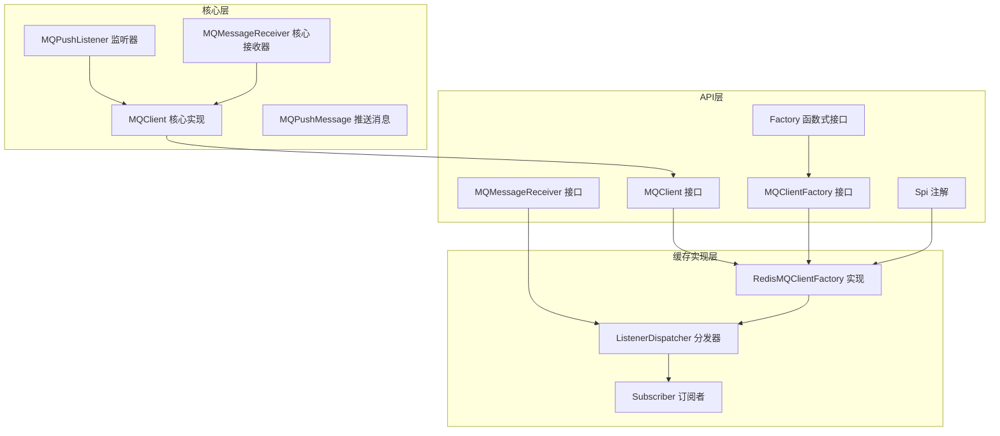
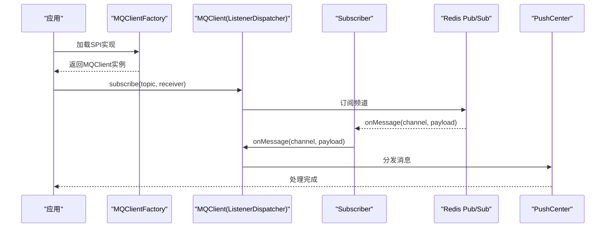
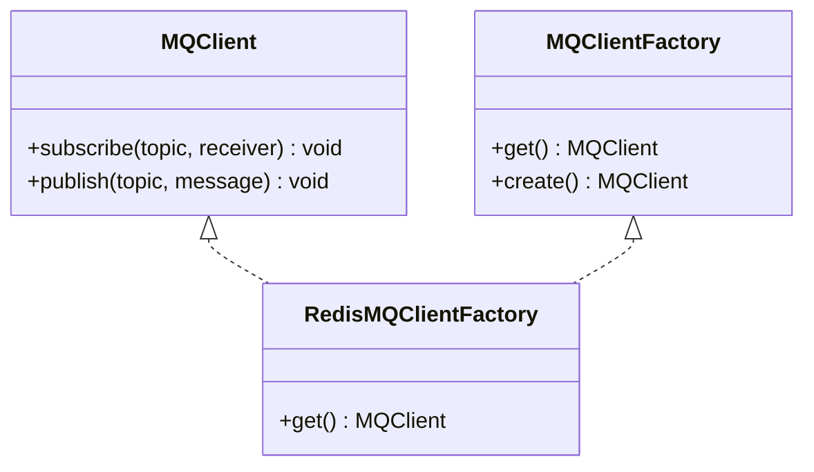
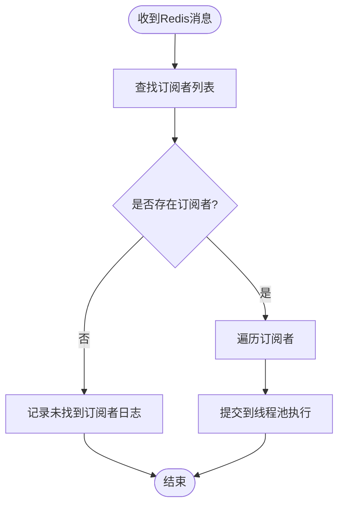
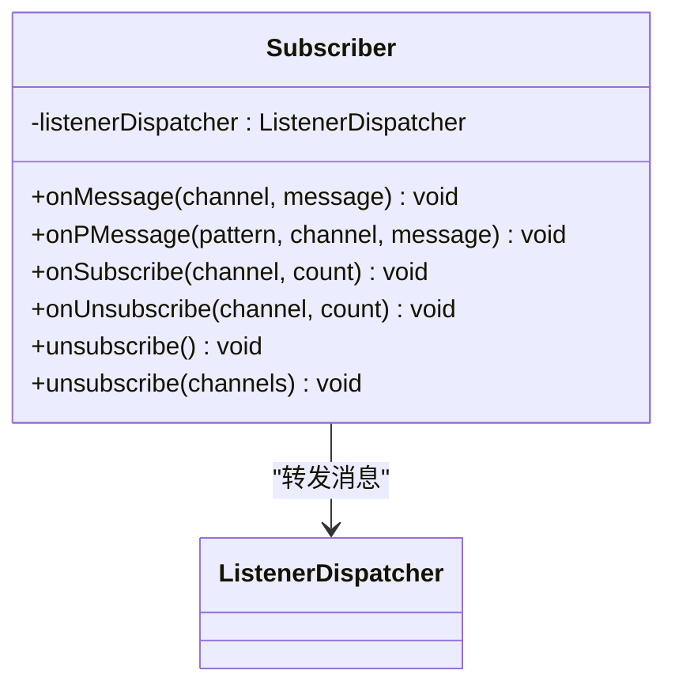
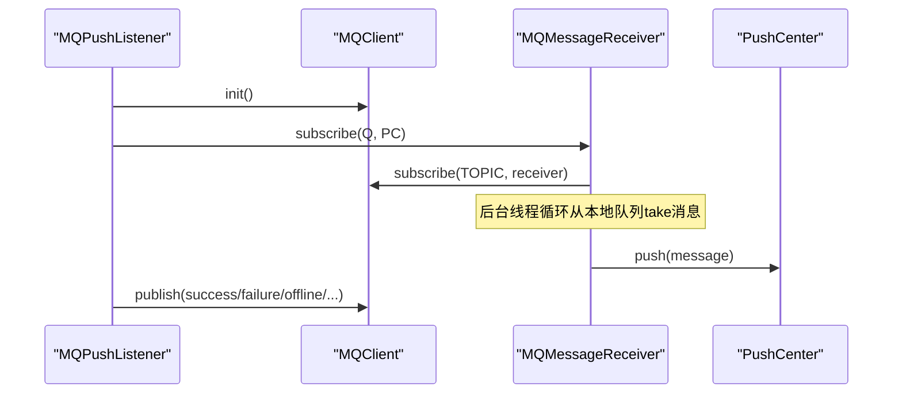
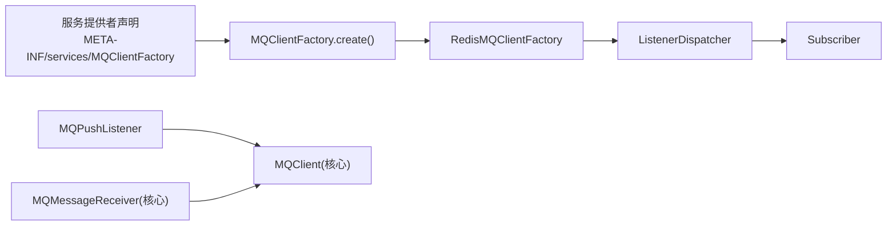

# 消息队列集成

<cite>
**本文引用的文件**
- [MQClient.java](file://mpush-api/src/main/java/com/mpush/api/spi/common/MQClient.java)
- [MQClientFactory.java](file://mpush-api/src/main/java/com/mpush/api/spi/common/MQClientFactory.java)
- [MQMessageReceiver.java（API）](file://mpush-api/src/main/java/com/mpush/api/spi/common/MQMessageReceiver.java)
- [Spi.java](file://mpush-api/src/main/java/com/mpush/api/spi/Spi.java)
- [Factory.java](file://mpush-api/src/main/java/com/mpush/api/spi/Factory.java)
- [RedisMQClientFactory.java](file://mpush-cache/src/main/java/com/mpush/cache/redis/mq/RedisMQClientFactory.java)
- [ListenerDispatcher.java](file://mpush-cache/src/main/java/com/mpush/cache/redis/mq/ListenerDispatcher.java)
- [Subscriber.java](file://mpush-cache/src/main/java/com/mpush/cache/redis/mq/Subscriber.java)
- [MQClient.java（核心实现）](file://mpush-core/src/main/java/com/mpush/core/mq/MQClient.java)
- [MQMessageReceiver.java（核心实现）](file://mpush-core/src/main/java/com/mpush/core/mq/MQMessageReceiver.java)
- [MQPushListener.java](file://mpush-core/src/main/java/com/mpush/core/mq/MQPushListener.java)
- [MQPushMessage.java](file://mpush-core/src/main/java/com/mpush/core/mq/MQPushMessage.java)
- [reference.conf](file://conf/reference.conf)
- [conf-dev.properties](file://conf/conf-dev.properties)
- [服务提供者接口：MQClientFactory](file://mpush-cache/src/main/resources/META-INF/services/com.mpush.api.spi.common.MQClientFactory)
</cite>

## 目录
1. [简介](#简介)
2. [项目结构](#项目结构)
3. [核心组件](#核心组件)
4. [架构总览](#架构总览)
5. [组件详解](#组件详解)
6. [依赖关系分析](#依赖关系分析)
7. [性能与调优](#性能与调优)
8. [监控与可观测性](#监控与可观测性)
9. [故障排查指南](#故障排查指南)
10. [结论](#结论)
11. [附录](#附录)

## 简介
本文件面向MPush的消息队列集成，聚焦于分布式消息推送系统中的异步处理、解耦合与削峰填谷能力。文档从MQClient接口设计出发，结合Redis实现的工厂模式、监听器分发器、订阅管理与核心MQ推送链路，给出完整的技术说明、流程图与排障建议。

## 项目结构
围绕消息队列的关键模块分布于API层与缓存实现层：
- API层定义MQClient、MQClientFactory、MQMessageReceiver等SPI接口与工厂加载机制
- 缓存实现层提供基于Redis的MQClientFactory实现，包含ListenerDispatcher与Subscriber
- 核心层提供MQPushListener、MQMessageReceiver与MQPushMessage等核心推送链路

**图表来源**
- [MQClient.java](file://mpush-api/src/main/java/com/mpush/api/spi/common/MQClient.java#L29-L34)
- [MQClientFactory.java](file://mpush-api/src/main/java/com/mpush/api/spi/common/MQClientFactory.java#L30-L35)
- [MQMessageReceiver.java（API）](file://mpush-api/src/main/java/com/mpush/api/spi/common/MQMessageReceiver.java#L27-L29)
- [Spi.java](file://mpush-api/src/main/java/com/mpush/api/spi/Spi.java#L32-L47)
- [Factory.java](file://mpush-api/src/main/java/com/mpush/api/spi/Factory.java#L29-L31)
- [RedisMQClientFactory.java](file://mpush-cache/src/main/java/com/mpush/cache/redis/mq/RedisMQClientFactory.java#L31-L38)
- [ListenerDispatcher.java](file://mpush-cache/src/main/java/com/mpush/cache/redis/mq/ListenerDispatcher.java#L37-L79)
- [Subscriber.java](file://mpush-cache/src/main/java/com/mpush/cache/redis/mq/Subscriber.java#L26-L83)
- [MQClient.java（核心实现）](file://mpush-core/src/main/java/com/mpush/core/mq/MQClient.java#L30-L47)
- [MQMessageReceiver.java（核心实现）](file://mpush-core/src/main/java/com/mpush/core/mq/MQMessageReceiver.java#L34-L75)
- [MQPushListener.java](file://mpush-core/src/main/java/com/mpush/core/mq/MQPushListener.java#L33-L90)
- [MQPushMessage.java](file://mpush-core/src/main/java/com/mpush/core/mq/MQPushMessage.java#L30-L76)

**章节来源**
- [RedisMQClientFactory.java](file://mpush-cache/src/main/java/com/mpush/cache/redis/mq/RedisMQClientFactory.java#L31-L38)
- [ListenerDispatcher.java](file://mpush-cache/src/main/java/com/mpush/cache/redis/mq/ListenerDispatcher.java#L37-L79)
- [Subscriber.java](file://mpush-cache/src/main/java/com/mpush/cache/redis/mq/Subscriber.java#L26-L83)
- [MQClient.java（核心实现）](file://mpush-core/src/main/java/com/mpush/core/mq/MQClient.java#L30-L47)
- [MQMessageReceiver.java（核心实现）](file://mpush-core/src/main/java/com/mpush/core/mq/MQMessageReceiver.java#L34-L75)
- [MQPushListener.java](file://mpush-core/src/main/java/com/mpush/core/mq/MQPushListener.java#L33-L90)
- [MQPushMessage.java](file://mpush-core/src/main/java/com/mpush/core/mq/MQPushMessage.java#L30-L76)

## 核心组件
- MQClient接口：定义订阅与发布能力，作为SPI扩展点
- MQClientFactory接口：通过SPI加载具体MQClient实现
- MQMessageReceiver接口：消息接收回调
- RedisMQClientFactory：基于Redis的MQClient工厂实现，返回ListenerDispatcher
- ListenerDispatcher：负责订阅登记、消息分发与并发执行
- Subscriber：继承JedisPubSub，桥接Redis订阅与ListenerDispatcher
- 核心MQ组件：MQPushListener、MQMessageReceiver、MQClient与MQPushMessage构成核心推送链路

**章节来源**
- [MQClient.java](file://mpush-api/src/main/java/com/mpush/api/spi/common/MQClient.java#L29-L34)
- [MQClientFactory.java](file://mpush-api/src/main/java/com/mpush/api/spi/common/MQClientFactory.java#L30-L35)
- [MQMessageReceiver.java（API）](file://mpush-api/src/main/java/com/mpush/api/spi/common/MQMessageReceiver.java#L27-L29)
- [RedisMQClientFactory.java](file://mpush-cache/src/main/java/com/mpush/cache/redis/mq/RedisMQClientFactory.java#L31-L38)
- [ListenerDispatcher.java](file://mpush-cache/src/main/java/com/mpush/cache/redis/mq/ListenerDispatcher.java#L37-L79)
- [Subscriber.java](file://mpush-cache/src/main/java/com/mpush/cache/redis/mq/Subscriber.java#L26-L83)
- [MQClient.java（核心实现）](file://mpush-core/src/main/java/com/mpush/core/mq/MQClient.java#L30-L47)
- [MQMessageReceiver.java（核心实现）](file://mpush-core/src/main/java/com/mpush/core/mq/MQMessageReceiver.java#L34-L75)
- [MQPushListener.java](file://mpush-core/src/main/java/com/mpush/core/mq/MQPushListener.java#L33-L90)
- [MQPushMessage.java](file://mpush-core/src/main/java/com/mpush/core/mq/MQPushMessage.java#L30-L76)

## 架构总览
Redis驱动的消息队列架构通过工厂模式加载MQClient，ListenerDispatcher统一管理订阅与并发分发，Subscriber负责与Redis Pub/Sub交互，核心链路由MQPushListener触发MQMessageReceiver从本地队列拉取并投递到PushCenter。

**图表来源**
- [RedisMQClientFactory.java](file://mpush-cache/src/main/java/com/mpush/cache/redis/mq/RedisMQClientFactory.java#L31-L38)
- [ListenerDispatcher.java](file://mpush-cache/src/main/java/com/mpush/cache/redis/mq/ListenerDispatcher.java#L54-L74)
- [Subscriber.java](file://mpush-cache/src/main/java/com/mpush/cache/redis/mq/Subscriber.java#L33-L38)
- [MQMessageReceiver.java（核心实现）](file://mpush-core/src/main/java/com/mpush/core/mq/MQMessageReceiver.java#L53-L55)

## 组件详解

### MQClient接口与工厂模式
- MQClient接口定义订阅与发布方法，作为MQ能力抽象
- MQClientFactory通过SPI加载具体实现；静态工厂方法简化获取
- RedisMQClientFactory使用注解声明优先级，返回ListenerDispatcher实例

**图表来源**
- [MQClient.java](file://mpush-api/src/main/java/com/mpush/api/spi/common/MQClient.java#L29-L34)
- [MQClientFactory.java](file://mpush-api/src/main/java/com/mpush/api/spi/common/MQClientFactory.java#L30-L35)
- [RedisMQClientFactory.java](file://mpush-cache/src/main/java/com/mpush/cache/redis/mq/RedisMQClientFactory.java#L31-L38)

**章节来源**
- [MQClient.java](file://mpush-api/src/main/java/com/mpush/api/spi/common/MQClient.java#L29-L34)
- [MQClientFactory.java](file://mpush-api/src/main/java/com/mpush/api/spi/common/MQClientFactory.java#L30-L35)
- [Spi.java](file://mpush-api/src/main/java/com/mpush/api/spi/Spi.java#L32-L47)
- [Factory.java](file://mpush-api/src/main/java/com/mpush/api/spi/Factory.java#L29-L31)
- [RedisMQClientFactory.java](file://mpush-cache/src/main/java/com/mpush/cache/redis/mq/RedisMQClientFactory.java#L31-L38)

### ListenerDispatcher：监听器分发器
- 维护topic到监听器列表的映射
- 初始化时从监控服务获取线程池，保证并发与资源隔离
- onMessage遍历监听器并提交至线程池执行，避免阻塞Redis回调
- subscribe首次订阅时委托RedisManager进行实际订阅
- publish直接委托RedisManager进行发布

**图表来源**
- [ListenerDispatcher.java](file://mpush-cache/src/main/java/com/mpush/cache/redis/mq/ListenerDispatcher.java#L54-L74)

**章节来源**
- [ListenerDispatcher.java](file://mpush-cache/src/main/java/com/mpush/cache/redis/mq/ListenerDispatcher.java#L37-L79)

### Subscriber：Redis订阅适配器
- 继承JedisPubSub，转发onMessage到ListenerDispatcher
- 提供详细的订阅/退订生命周期日志，便于问题定位
- 保留模式订阅/取消订阅回调，便于扩展

**图表来源**
- [Subscriber.java](file://mpush-cache/src/main/java/com/mpush/cache/redis/mq/Subscriber.java#L26-L83)

**章节来源**
- [Subscriber.java](file://mpush-cache/src/main/java/com/mpush/cache/redis/mq/Subscriber.java#L26-L83)

### 核心MQ推送链路
- MQPushListener实现PushListener与PushListenerFactory，初始化时订阅本地topic并绑定PushCenter
- 成功/失败/离线/路由变更/超时等状态通过MQClient发布到不同topic，便于下游处理
- MQMessageReceiver负责从本地队列take消息并逐条投递到PushCenter
- MQPushMessage承载推送元信息，当前实现为空壳，可扩展条件、用户ID、任务ID等

**图表来源**
- [MQPushListener.java](file://mpush-core/src/main/java/com/mpush/core/mq/MQPushListener.java#L33-L90)
- [MQMessageReceiver.java（核心实现）](file://mpush-core/src/main/java/com/mpush/core/mq/MQMessageReceiver.java#L42-L75)
- [MQClient.java（核心实现）](file://mpush-core/src/main/java/com/mpush/core/mq/MQClient.java#L30-L47)
- [MQPushMessage.java](file://mpush-core/src/main/java/com/mpush/core/mq/MQPushMessage.java#L30-L76)

**章节来源**
- [MQPushListener.java](file://mpush-core/src/main/java/com/mpush/core/mq/MQPushListener.java#L33-L90)
- [MQMessageReceiver.java（核心实现）](file://mpush-core/src/main/java/com/mpush/core/mq/MQMessageReceiver.java#L34-L75)
- [MQClient.java（核心实现）](file://mpush-core/src/main/java/com/mpush/core/mq/MQClient.java#L30-L47)
- [MQPushMessage.java](file://mpush-core/src/main/java/com/mpush/core/mq/MQPushMessage.java#L30-L76)

## 依赖关系分析
- 工厂加载：通过META-INF/services声明RedisMQClientFactory，MQClientFactory.create()自动加载
- 组件耦合：ListenerDispatcher持有Subscriber，二者通过onMessage桥接；MQPushListener依赖MQClient与PushCenter
- 线程模型：ListenerDispatcher使用监控服务提供的线程池，确保MQ回调不阻塞Redis连接

**图表来源**
- [服务提供者接口：MQClientFactory](file://mpush-cache/src/main/resources/META-INF/services/com.mpush.api.spi.common.MQClientFactory#L1)
- [MQClientFactory.java](file://mpush-api/src/main/java/com/mpush/api/spi/common/MQClientFactory.java#L32-L34)
- [RedisMQClientFactory.java](file://mpush-cache/src/main/java/com/mpush/cache/redis/mq/RedisMQClientFactory.java#L31-L38)
- [ListenerDispatcher.java](file://mpush-cache/src/main/java/com/mpush/cache/redis/mq/ListenerDispatcher.java#L37-L79)
- [MQPushListener.java](file://mpush-core/src/main/java/com/mpush/core/mq/MQPushListener.java#L33-L90)
- [MQMessageReceiver.java（核心实现）](file://mpush-core/src/main/java/com/mpush/core/mq/MQMessageReceiver.java#L34-L75)

**章节来源**
- [服务提供者接口：MQClientFactory](file://mpush-cache/src/main/resources/META-INF/services/com.mpush.api.spi.common.MQClientFactory#L1)
- [MQClientFactory.java](file://mpush-api/src/main/java/com/mpush/api/spi/common/MQClientFactory.java#L30-L35)

## 性能与调优
- 线程池配置：参考thread.pool.mq.min/max/queue-size，合理设置MQ线程池规模与队列长度，避免背压
- Redis连接池：通过redis.config.*参数控制连接池容量与空闲回收策略，降低连接抖动
- 并发分发：ListenerDispatcher使用独立线程池执行回调，避免阻塞Redis网络IO
- 流量整形：可结合网络层流量整形参数，配合MQ吞吐进行整体调优
- 日志级别：开发环境可提升日志级别辅助定位，生产环境建议维持默认级别

**章节来源**
- [reference.conf](file://conf/reference.conf#L143-L169)
- [reference.conf](file://conf/reference.conf#L182-L205)
- [ListenerDispatcher.java](file://mpush-cache/src/main/java/com/mpush/cache/redis/mq/ListenerDispatcher.java#L46-L48)

## 监控与可观测性
- 线程池监控：通过MonitorService与ThreadPoolManager暴露的线程池指标进行观测
- Redis订阅日志：Subscriber提供订阅/退订与消息到达的日志，便于追踪消息通路
- 业务指标：MQPushListener在不同状态发布到不同topic，可对接外部监控系统采集成功率、失败率、离线率等

**章节来源**
- [ListenerDispatcher.java](file://mpush-cache/src/main/java/com/mpush/cache/redis/mq/ListenerDispatcher.java#L37-L79)
- [Subscriber.java](file://mpush-cache/src/main/java/com/mpush/cache/redis/mq/Subscriber.java#L33-L81)
- [MQPushListener.java](file://mpush-core/src/main/java/com/mpush/core/mq/MQPushListener.java#L45-L84)

## 故障排查指南
- 无法加载MQClient实现
  - 检查META-INF/services中是否正确声明RedisMQClientFactory
  - 确认类路径包含实现模块
- 订阅不到消息
  - 查看ListenerDispatcher是否成功订阅Redis频道
  - 检查Subscriber日志中onSubscribe/onMessage回调是否触发
- 回调阻塞或延迟
  - 检查线程池配置与队列长度，必要时增大max或调整队列容量
- 生产/消费异常
  - 关注MQPushListener的状态发布topic，结合业务侧重试与降级策略
- 开发调试
  - 使用开发配置文件提升日志级别，定位具体环节

**章节来源**
- [服务提供者接口：MQClientFactory](file://mpush-cache/src/main/resources/META-INF/services/com.mpush.api.spi.common.MQClientFactory#L1)
- [Subscriber.java](file://mpush-cache/src/main/java/com/mpush/cache/redis/mq/Subscriber.java#L33-L81)
- [ListenerDispatcher.java](file://mpush-cache/src/main/java/com/mpush/cache/redis/mq/ListenerDispatcher.java#L54-L74)
- [conf-dev.properties](file://conf/conf-dev.properties#L1-L5)

## 结论
MPush通过SPI抽象与Redis实现，构建了高内聚、低耦合的消息队列集成方案。ListenerDispatcher承担订阅与并发分发职责，Subscriber桥接Redis Pub/Sub，核心链路由MQPushListener与MQMessageReceiver协同完成。配合完善的线程池与监控体系，可在高并发场景下实现稳定可靠的异步推送。

## 附录
- 集成步骤概览
  - 在应用侧引入缓存模块，确保META-INF/services声明MQClientFactory
  - 通过MQClientFactory.create()获取MQClient实例
  - 使用MQClient.subscribe订阅所需topic，并在MQMessageReceiver中处理消息
  - 核心链路中，MQPushListener根据推送结果向不同topic发布状态消息
- 配置要点
  - Redis集群模式与连接池参数
  - MQ线程池规模与队列长度
  - 日志级别与监控开关

**章节来源**
- [RedisMQClientFactory.java](file://mpush-cache/src/main/java/com/mpush/cache/redis/mq/RedisMQClientFactory.java#L31-L38)
- [MQClientFactory.java](file://mpush-api/src/main/java/com/mpush/api/spi/common/MQClientFactory.java#L32-L34)
- [reference.conf](file://conf/reference.conf#L143-L169)
- [reference.conf](file://conf/reference.conf#L182-L205)