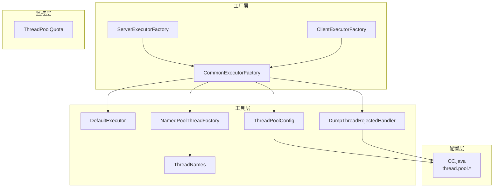
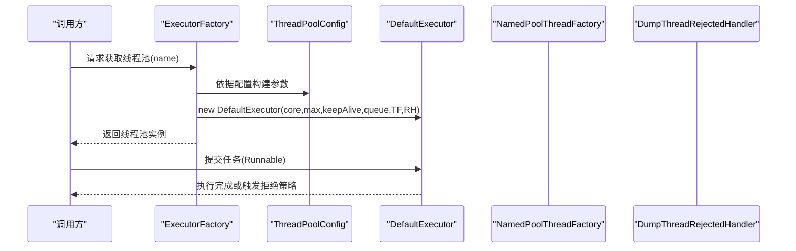
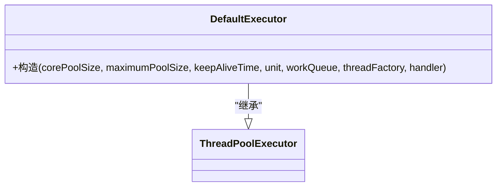
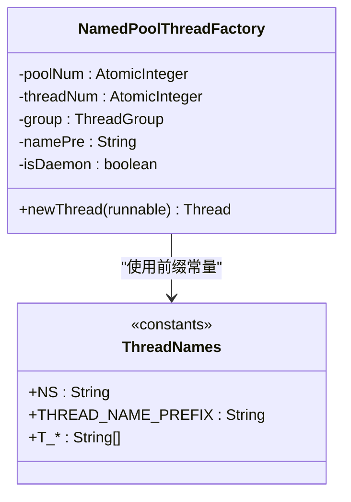
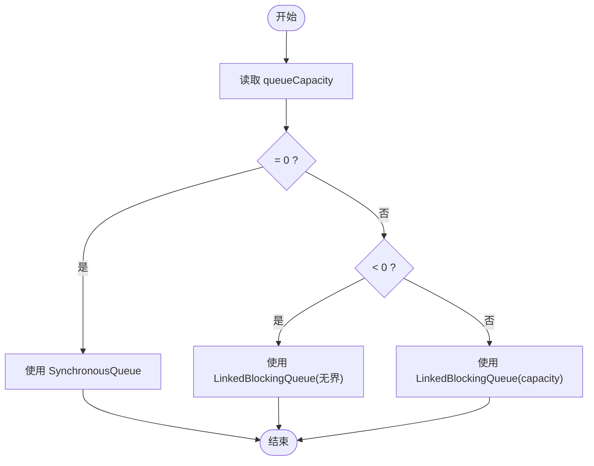
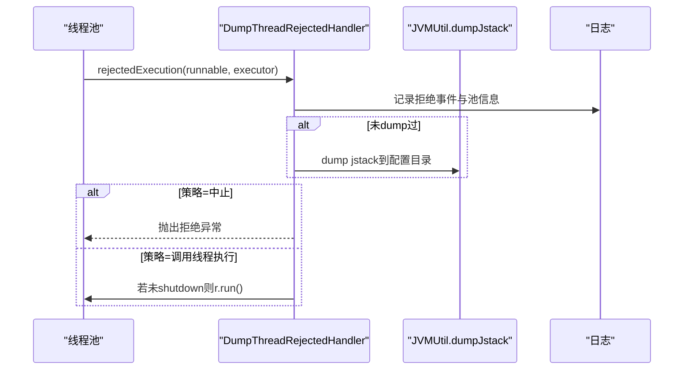
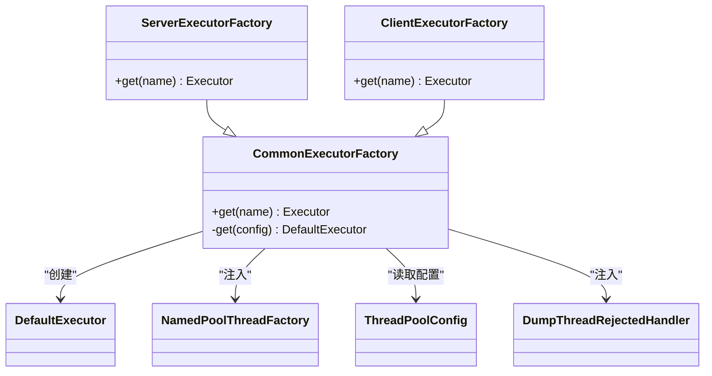
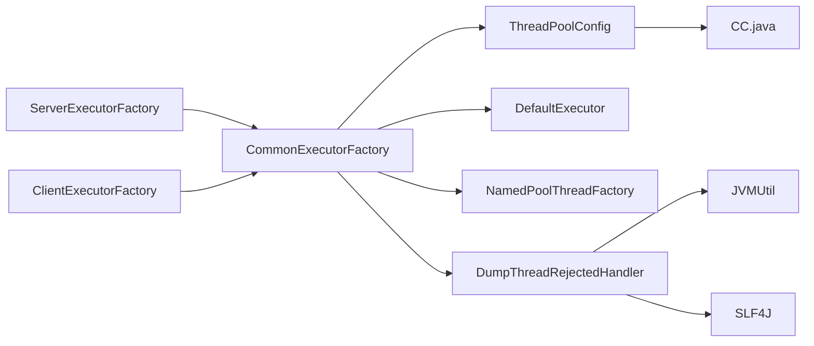

# 线程池管理

<cite>
**本文引用的文件**
- [DefaultExecutor.java](file://mpush-tools/src/main/java/com/mpush/tools/thread/pool/DefaultExecutor.java)
- [NamedPoolThreadFactory.java](file://mpush-tools/src/main/java/com/mpush/tools/thread/NamedPoolThreadFactory.java)
- [NamedThreadFactory.java](file://mpush-tools/src/main/java/com/mpush/tools/thread/NamedThreadFactory.java)
- [ThreadNames.java](file://mpush-tools/src/main/java/com/mpush/tools/thread/ThreadNames.java)
- [ThreadPoolConfig.java](file://mpush-tools/src/main/java/com/mpush/tools/thread/pool/ThreadPoolConfig.java)
- [DumpThreadRejectedHandler.java](file://mpush-tools/src/main/java/com/mpush/tools/thread/pool/DumpThreadRejectedHandler.java)
- [CommonExecutorFactory.java](file://mpush-common/src/main/java/com/mpush/common/CommonExecutorFactory.java)
- [ServerExecutorFactory.java](file://mpush-core/src/main/java/com/mpush/core/ServerExecutorFactory.java)
- [ClientExecutorFactory.java](file://mpush-client/src/main/java/com/mpush/client/ClientExecutorFactory.java)
- [ThreadPoolQuota.java](file://mpush-monitor/src/main/java/com/mpush/monitor/quota/ThreadPoolQuota.java)
- [CC.java](file://mpush-tools/src/main/java/com/mpush/tools/config/CC.java)
</cite>

## 目录
1. [引言](#引言)
2. [项目结构](#项目结构)
3. [核心组件](#核心组件)
4. [架构总览](#架构总览)
5. [详细组件分析](#详细组件分析)
6. [依赖分析](#依赖分析)
7. [性能考虑](#性能考虑)
8. [故障排查指南](#故障排查指南)
9. [结论](#结论)
10. [附录](#附录)

## 引言
本文件围绕 MPush 的线程池管理体系进行系统化技术文档整理，重点覆盖以下方面：
- 高并发系统中线程池的关键价值：资源管理、任务调度、背压与限流、优雅关闭与可观测性。
- DefaultExecutor 的实现与职责边界：基于 JDK 线程池扩展，提供统一的线程池封装。
- NamedPoolThreadFactory 的命名策略：线程命名规范、调试友好性、资源标识与隔离。
- ThreadPoolConfig 的配置管理：核心参数、队列类型选择、拒绝策略、生命周期控制。
- DumpThreadRejectedHandler 的拒绝策略：任务丢弃、日志记录、JVM 堆栈转储、降级处理。
- 最佳实践与调优建议：不同场景下的配置示例、性能基线与监控指标。
- 故障排查方法：拒绝事件定位、堆栈转储触发条件、常见问题根因。

## 项目结构
MPush 将线程池管理能力集中在工具模块（mpush-tools），并通过 SPI 工厂在业务模块（common、core、client）中按需装配。核心文件分布如下：
- 工具层：DefaultExecutor、NamedPoolThreadFactory、ThreadPoolConfig、DumpThreadRejectedHandler、ThreadNames
- 工厂层：CommonExecutorFactory、ServerExecutorFactory、ClientExecutorFactory
- 监控层：ThreadPoolQuota 接口
- 配置层：CC.java 中的 thread.pool.* 配置项

**图表来源**
- [DefaultExecutor.java](file://mpush-tools/src/main/java/com/mpush/tools/thread/pool/DefaultExecutor.java#L28-L38)
- [NamedPoolThreadFactory.java](file://mpush-tools/src/main/java/com/mpush/tools/thread/NamedPoolThreadFactory.java#L25-L59)
- [ThreadNames.java](file://mpush-tools/src/main/java/com/mpush/tools/thread/ThreadNames.java#L22-L46)
- [ThreadPoolConfig.java](file://mpush-tools/src/main/java/com/mpush/tools/thread/pool/ThreadPoolConfig.java#L26-L135)
- [DumpThreadRejectedHandler.java](file://mpush-tools/src/main/java/com/mpush/tools/thread/pool/DumpThreadRejectedHandler.java#L35-L74)
- [CommonExecutorFactory.java](file://mpush-common/src/main/java/com/mpush/common/CommonExecutorFactory.java#L46-L97)
- [ServerExecutorFactory.java](file://mpush-core/src/main/java/com/mpush/core/ServerExecutorFactory.java#L42-L77)
- [ClientExecutorFactory.java](file://mpush-client/src/main/java/com/mpush/client/ClientExecutorFactory.java#L39-L63)
- [ThreadPoolQuota.java](file://mpush-monitor/src/main/java/com/mpush/monitor/quota/ThreadPoolQuota.java#L22-L24)
- [CC.java](file://mpush-tools/src/main/java/com/mpush/tools/config/CC.java#L214-L241)

**章节来源**
- [DefaultExecutor.java](file://mpush-tools/src/main/java/com/mpush/tools/thread/pool/DefaultExecutor.java#L28-L38)
- [ThreadPoolConfig.java](file://mpush-tools/src/main/java/com/mpush/tools/thread/pool/ThreadPoolConfig.java#L26-L135)
- [DumpThreadRejectedHandler.java](file://mpush-tools/src/main/java/com/mpush/tools/thread/pool/DumpThreadRejectedHandler.java#L35-L74)
- [NamedPoolThreadFactory.java](file://mpush-tools/src/main/java/com/mpush/tools/thread/NamedPoolThreadFactory.java#L25-L59)
- [ThreadNames.java](file://mpush-tools/src/main/java/com/mpush/tools/thread/ThreadNames.java#L22-L46)
- [CommonExecutorFactory.java](file://mpush-common/src/main/java/com/mpush/common/CommonExecutorFactory.java#L46-L97)
- [ServerExecutorFactory.java](file://mpush-core/src/main/java/com/mpush/core/ServerExecutorFactory.java#L42-L77)
- [ClientExecutorFactory.java](file://mpush-client/src/main/java/com/mpush/client/ClientExecutorFactory.java#L39-L63)
- [ThreadPoolQuota.java](file://mpush-monitor/src/main/java/com/mpush/monitor/quota/ThreadPoolQuota.java#L22-L24)
- [CC.java](file://mpush-tools/src/main/java/com/mpush/tools/config/CC.java#L214-L241)

## 核心组件
- DefaultExecutor：对 JDK ThreadPoolExecutor 的轻量封装，作为统一的线程池执行器，负责任务提交、执行与回收。
- ThreadPoolConfig：线程池配置模型，支持固定大小、缓存型、可选队列容量与拒绝策略。
- NamedPoolThreadFactory：线程工厂，生成带前缀、编号、守护/非守护属性的线程，便于资源隔离与调试。
- DumpThreadRejectedHandler：拒绝策略处理器，记录拒绝事件、触发 JVM 堆栈转储，并按策略抛出异常或由调用线程执行。
- 工厂类：CommonExecutorFactory、ServerExecutorFactory、ClientExecutorFactory 按场景构建线程池，注入合适的配置与拒绝策略。

**章节来源**
- [DefaultExecutor.java](file://mpush-tools/src/main/java/com/mpush/tools/thread/pool/DefaultExecutor.java#L28-L38)
- [ThreadPoolConfig.java](file://mpush-tools/src/main/java/com/mpush/tools/thread/pool/ThreadPoolConfig.java#L26-L135)
- [NamedPoolThreadFactory.java](file://mpush-tools/src/main/java/com/mpush/tools/thread/NamedPoolThreadFactory.java#L25-L59)
- [DumpThreadRejectedHandler.java](file://mpush-tools/src/main/java/com/mpush/tools/thread/pool/DumpThreadRejectedHandler.java#L35-L74)
- [CommonExecutorFactory.java](file://mpush-common/src/main/java/com/mpush/common/CommonExecutorFactory.java#L46-L97)
- [ServerExecutorFactory.java](file://mpush-core/src/main/java/com/mpush/core/ServerExecutorFactory.java#L42-L77)
- [ClientExecutorFactory.java](file://mpush-client/src/main/java/com/mpush/client/ClientExecutorFactory.java#L39-L63)

## 架构总览
MPush 的线程池管理采用“配置驱动 + 工厂装配”的模式：
- 配置来源：CC.java 提供 thread.pool.* 的配置键，如 event_bus、mq、push-task、push-client、ack-timer 等。
- 工厂装配：CommonExecutorFactory 统一创建 DefaultExecutor，ServerExecutorFactory 与 ClientExecutorFactory 扩展特定场景。
- 线程命名：通过 NamedPoolThreadFactory 与 ThreadNames 前缀组合，确保线程名具备可读性与可追踪性。
- 拒绝策略：默认使用 DumpThreadRejectedHandler，结合 rejectedPolicy 决定行为（中止/调用线程执行/降级）。

**图表来源**
- [CommonExecutorFactory.java](file://mpush-common/src/main/java/com/mpush/common/CommonExecutorFactory.java#L46-L97)
- [DefaultExecutor.java](file://mpush-tools/src/main/java/com/mpush/tools/thread/pool/DefaultExecutor.java#L28-L38)
- [NamedPoolThreadFactory.java](file://mpush-tools/src/main/java/com/mpush/tools/thread/NamedPoolThreadFactory.java#L25-L59)
- [DumpThreadRejectedHandler.java](file://mpush-tools/src/main/java/com/mpush/tools/thread/pool/DumpThreadRejectedHandler.java#L35-L74)
- [ThreadPoolConfig.java](file://mpush-tools/src/main/java/com/mpush/tools/thread/pool/ThreadPoolConfig.java#L26-L135)

## 详细组件分析

### DefaultExecutor 分析
- 角色定位：对 ThreadPoolExecutor 的直接子类，保持与 JDK 线程池一致的生命周期与行为，仅承担封装职责。
- 关键点：
  - 构造函数参数与 JDK 对齐：core/max/keepAlive/queue/threadFactory/rejectedHandler。
  - 与工厂配合：由 CommonExecutorFactory 注入 NamedPoolThreadFactory 与 DumpThreadRejectedHandler。
- 适用场景：通用业务线程池，需要统一命名与拒绝处理策略。

**图表来源**
- [DefaultExecutor.java](file://mpush-tools/src/main/java/com/mpush/tools/thread/pool/DefaultExecutor.java#L28-L38)

**章节来源**
- [DefaultExecutor.java](file://mpush-tools/src/main/java/com/mpush/tools/thread/pool/DefaultExecutor.java#L28-L38)

### NamedPoolThreadFactory 与命名策略
- 命名规则：
  - 前缀：prefix + “-p-” + 池编号 + “-t-” + 线程序号。
  - 线程组：继承当前线程组，保证上下文一致性。
  - 守护属性：可通过构造参数控制是否为守护线程，默认守护。
  - 类加载器与优先级：设置为工厂类加载器与标准优先级。
- 调试友好性：
  - 明确的池编号与线程序号，便于在堆栈与线程列表中快速定位。
  - 结合 ThreadNames 前缀常量，形成统一命名风格。
- 资源隔离：
  - 不同业务线程池使用不同前缀，避免相互干扰。

**图表来源**
- [NamedPoolThreadFactory.java](file://mpush-tools/src/main/java/com/mpush/tools/thread/NamedPoolThreadFactory.java#L25-L59)
- [ThreadNames.java](file://mpush-tools/src/main/java/com/mpush/tools/thread/ThreadNames.java#L22-L46)

**章节来源**
- [NamedPoolThreadFactory.java](file://mpush-tools/src/main/java/com/mpush/tools/thread/NamedPoolThreadFactory.java#L25-L59)
- [ThreadNames.java](file://mpush-tools/src/main/java/com/mpush/tools/thread/ThreadNames.java#L22-L46)

### ThreadPoolConfig 配置管理
- 核心参数：
  - 名称：用于标识线程池用途与命名。
  - 核心/最大线程数：决定并发度与扩容能力。
  - 队列容量：0 表示 SynchronousQueue，负数表示无界队列，正数表示有界队列。
  - 存活时间：空闲线程回收策略。
  - 拒绝策略：支持中止、丢弃、调用线程执行三种策略枚举。
- 工厂方法：
  - buildFixed：固定大小线程池，适合 CPU 密集或稳定性要求高的场景。
  - buildCached：缓存型线程池，适合短任务突发场景。
  - build：基础配置，后续链式设置。
- 队列选择策略：
  - 有界队列：限制内存占用与背压，适合稳定吞吐。
  - 无界队列：避免拒绝但可能 OOM，适合高吞吐且资源充足的场景。
  - 同步队列：严格匹配生产者与消费者，适合强一致场景。

**图表来源**
- [ThreadPoolConfig.java](file://mpush-tools/src/main/java/com/mpush/tools/thread/pool/ThreadPoolConfig.java#L113-L123)

**章节来源**
- [ThreadPoolConfig.java](file://mpush-tools/src/main/java/com/mpush/tools/thread/pool/ThreadPoolConfig.java#L26-L135)

### DumpThreadRejectedHandler 拒绝策略
- 行为特征：
  - 记录拒绝事件与线程池信息，避免重复 dump。
  - 按策略处理：
    - 中止：抛出拒绝异常，上层感知失败。
    - 调用线程执行：由提交线程直接执行，降低丢弃风险。
- 堆栈转储：
  - 使用 JVMUtil.dumpJstack 输出 jstack 到配置目录，便于事后分析。
  - dump 目录来源于 CC.mp.monitor.dump_dir。
- 适用场景：
  - 高可靠性要求的推送与消息处理，拒绝即报警与取证。

**图表来源**
- [DumpThreadRejectedHandler.java](file://mpush-tools/src/main/java/com/mpush/tools/thread/pool/DumpThreadRejectedHandler.java#L52-L73)
- [CC.java](file://mpush-tools/src/main/java/com/mpush/tools/config/CC.java#L214-L241)

**章节来源**
- [DumpThreadRejectedHandler.java](file://mpush-tools/src/main/java/com/mpush/tools/thread/pool/DumpThreadRejectedHandler.java#L35-L74)
- [CC.java](file://mpush-tools/src/main/java/com/mpush/tools/config/CC.java#L214-L241)

### 工厂装配与场景适配
- CommonExecutorFactory：统一创建 DefaultExecutor，注入 NamedPoolThreadFactory 与 DumpThreadRejectedHandler，并从 CC 读取配置。
- ServerExecutorFactory：扩展 MQ、PUSH_TASK、ACK_TIMER 等场景，部分场景使用 ScheduledThreadPoolExecutor 并自定义拒绝策略。
- ClientExecutorFactory：面向客户端的 PUSH_CLIENT、ACK_TIMER 场景，同样自定义拒绝策略以满足客户端低延迟需求。

**图表来源**
- [CommonExecutorFactory.java](file://mpush-common/src/main/java/com/mpush/common/CommonExecutorFactory.java#L46-L97)
- [ServerExecutorFactory.java](file://mpush-core/src/main/java/com/mpush/core/ServerExecutorFactory.java#L42-L77)
- [ClientExecutorFactory.java](file://mpush-client/src/main/java/com/mpush/client/ClientExecutorFactory.java#L39-L63)
- [DefaultExecutor.java](file://mpush-tools/src/main/java/com/mpush/tools/thread/pool/DefaultExecutor.java#L28-L38)
- [NamedPoolThreadFactory.java](file://mpush-tools/src/main/java/com/mpush/tools/thread/NamedPoolThreadFactory.java#L25-L59)
- [ThreadPoolConfig.java](file://mpush-tools/src/main/java/com/mpush/tools/thread/pool/ThreadPoolConfig.java#L26-L135)
- [DumpThreadRejectedHandler.java](file://mpush-tools/src/main/java/com/mpush/tools/thread/pool/DumpThreadRejectedHandler.java#L35-L74)

**章节来源**
- [CommonExecutorFactory.java](file://mpush-common/src/main/java/com/mpush/common/CommonExecutorFactory.java#L46-L97)
- [ServerExecutorFactory.java](file://mpush-core/src/main/java/com/mpush/core/ServerExecutorFactory.java#L42-L77)
- [ClientExecutorFactory.java](file://mpush-client/src/main/java/com/mpush/client/ClientExecutorFactory.java#L39-L63)

## 依赖分析
- 组件耦合：
  - DefaultExecutor 与 ThreadPoolExecutor 强耦合，保持 JDK 行为一致性。
  - NamedPoolThreadFactory 依赖 ThreadNames 常量，形成统一命名风格。
  - DumpThreadRejectedHandler 依赖 CC 配置与 JVMUtil，具备可观测性与诊断能力。
  - 工厂类依赖 CC 配置，实现配置驱动的线程池装配。
- 外部依赖：
  - SLF4J 日志接口、JVMUtil 堆栈转储工具、Typesafe Config 配置系统。
- 循环依赖：
  - 未发现循环依赖，各模块职责清晰。

**图表来源**
- [ThreadPoolConfig.java](file://mpush-tools/src/main/java/com/mpush/tools/thread/pool/ThreadPoolConfig.java#L26-L135)
- [CommonExecutorFactory.java](file://mpush-common/src/main/java/com/mpush/common/CommonExecutorFactory.java#L46-L97)
- [ServerExecutorFactory.java](file://mpush-core/src/main/java/com/mpush/core/ServerExecutorFactory.java#L42-L77)
- [ClientExecutorFactory.java](file://mpush-client/src/main/java/com/mpush/client/ClientExecutorFactory.java#L39-L63)
- [DumpThreadRejectedHandler.java](file://mpush-tools/src/main/java/com/mpush/tools/thread/pool/DumpThreadRejectedHandler.java#L35-L74)
- [CC.java](file://mpush-tools/src/main/java/com/mpush/tools/config/CC.java#L214-L241)

**章节来源**
- [ThreadPoolConfig.java](file://mpush-tools/src/main/java/com/mpush/tools/thread/pool/ThreadPoolConfig.java#L26-L135)
- [CommonExecutorFactory.java](file://mpush-common/src/main/java/com/mpush/common/CommonExecutorFactory.java#L46-L97)
- [ServerExecutorFactory.java](file://mpush-core/src/main/java/com/mpush/core/ServerExecutorFactory.java#L42-L77)
- [ClientExecutorFactory.java](file://mpush-client/src/main/java/com/mpush/client/ClientExecutorFactory.java#L39-L63)
- [DumpThreadRejectedHandler.java](file://mpush-tools/src/main/java/com/mpush/tools/thread/pool/DumpThreadRejectedHandler.java#L35-L74)
- [CC.java](file://mpush-tools/src/main/java/com/mpush/tools/config/CC.java#L214-L241)

## 性能考虑
- 线程数量与队列容量：
  - CPU 密集型：核心线程数≈CPU核数，队列容量适中，避免过多上下文切换。
  - I/O 密集型：适当增大最大线程数与队列容量，提升并发吞吐。
  - 短任务突发：可使用缓存型线程池或同步队列，减少排队延迟。
- 拒绝策略选择：
  - 中止：快速失败，便于上层熔断与降级。
  - 调用线程执行：降低丢弃率，但可能放大热点，需谨慎评估。
- 存活时间：
  - 高频任务场景建议较小存活时间，避免空闲线程占用资源。
- 监控与采样：
  - 通过 ThreadPoolQuota 接口扩展监控指标采集，关注活跃线程、队列长度、拒绝次数、任务耗时等。

[本节为通用性能指导，无需具体文件引用]

## 故障排查指南
- 拒绝事件定位：
  - 查看拒绝日志与线程池信息，确认 rejectedPolicy 与队列状态。
  - 若启用 DumpThreadRejectedHandler，检查 dump 目录下 jstack 文件。
- 堆栈转储触发：
  - 首次拒绝触发 dump，避免重复 dump 的抖动。
  - 确认 CC.mp.monitor.dump_dir 配置正确。
- 常见问题根因：
  - 队列容量不足导致频繁拒绝。
  - 线程数过小导致排队过长。
  - 拒绝策略不当导致业务失败或雪崩。
  - 客户端/服务端线程池配置不匹配，引发背压。

**章节来源**
- [DumpThreadRejectedHandler.java](file://mpush-tools/src/main/java/com/mpush/tools/thread/pool/DumpThreadRejectedHandler.java#L52-L73)
- [CC.java](file://mpush-tools/src/main/java/com/mpush/tools/config/CC.java#L214-L241)

## 结论
MPush 的线程池管理以“配置驱动 + 工厂装配 + 统一拒绝处理”为核心，结合命名规范与可观测性设计，实现了高并发场景下的资源可控、任务有序与故障可诊断。通过合理选择队列类型、线程规模与拒绝策略，并辅以监控指标与堆栈转储，可在稳定性与性能之间取得平衡。

[本节为总结性内容，无需具体文件引用]

## 附录

### 最佳实践与调优建议
- 固定大小线程池（buildFixed）
  - 适用：CPU 密集、稳定性要求高。
  - 建议：core=max，queue_size=适度，rejectedPolicy=调用线程执行或中止。
- 缓存型线程池（buildCached）
  - 适用：I/O 密集、短任务突发。
  - 建议：max=较大值，queue_size=-1（无界），注意内存上限。
- 有界队列
  - 适用：稳定吞吐、内存受限。
  - 建议：根据 P99 延迟与峰值 QPS 设定容量，结合拒绝策略降级。
- 拒绝策略
  - 中止：快速失败，配合熔断与重试。
  - 调用线程执行：降低丢弃率，但需评估主线程负载。
  - 丢弃：适用于可容忍丢弃的后台任务。

[本节为通用指导，无需具体文件引用]

### 不同场景下的配置示例（路径参考）
- 事件总线线程池
  - 参考路径：[CommonExecutorFactory.java](file://mpush-common/src/main/java/com/mpush/common/CommonExecutorFactory.java#L66-L74)
  - 参数来源：CC.mp.thread.pool.event_bus.min/max/queue_size
- MQ 线程池
  - 参考路径：[ServerExecutorFactory.java](file://mpush-core/src/main/java/com/mpush/core/ServerExecutorFactory.java#L48-L55)
  - 参数来源：CC.mp.thread.pool.mq.min/max/queue_size
- 推送任务线程池
  - 参考路径：[ServerExecutorFactory.java](file://mpush-core/src/main/java/com/mpush/core/ServerExecutorFactory.java#L57-L62)
  - 参数来源：CC.mp.thread.pool.push_task
- 客户端定时器线程池
  - 参考路径：[ClientExecutorFactory.java](file://mpush-client/src/main/java/com/mpush/client/ClientExecutorFactory.java#L44-L58)
  - 参数来源：CC.mp.thread.pool.push_client/ack_timer

**章节来源**
- [CommonExecutorFactory.java](file://mpush-common/src/main/java/com/mpush/common/CommonExecutorFactory.java#L66-L74)
- [ServerExecutorFactory.java](file://mpush-core/src/main/java/com/mpush/core/ServerExecutorFactory.java#L48-L62)
- [ClientExecutorFactory.java](file://mpush-client/src/main/java/com/mpush/client/ClientExecutorFactory.java#L44-L58)

### 监控指标与扩展
- 指标建议：活跃线程数、最大线程数、队列长度、完成任务数、拒绝次数、任务平均耗时。
- 扩展点：ThreadPoolQuota 接口可用于接入 JMX 或自定义监控系统。

**章节来源**
- [ThreadPoolQuota.java](file://mpush-monitor/src/main/java/com/mpush/monitor/quota/ThreadPoolQuota.java#L22-L24)