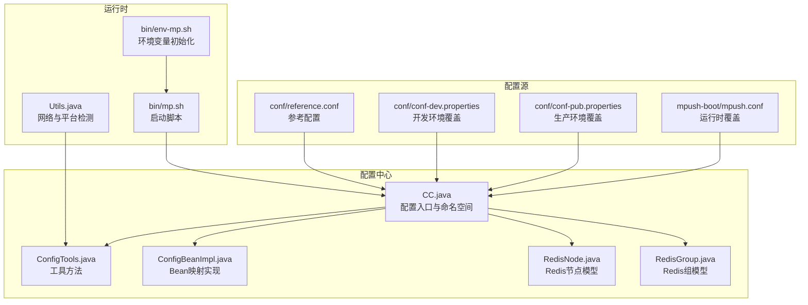
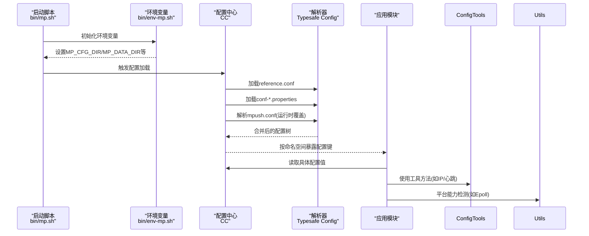
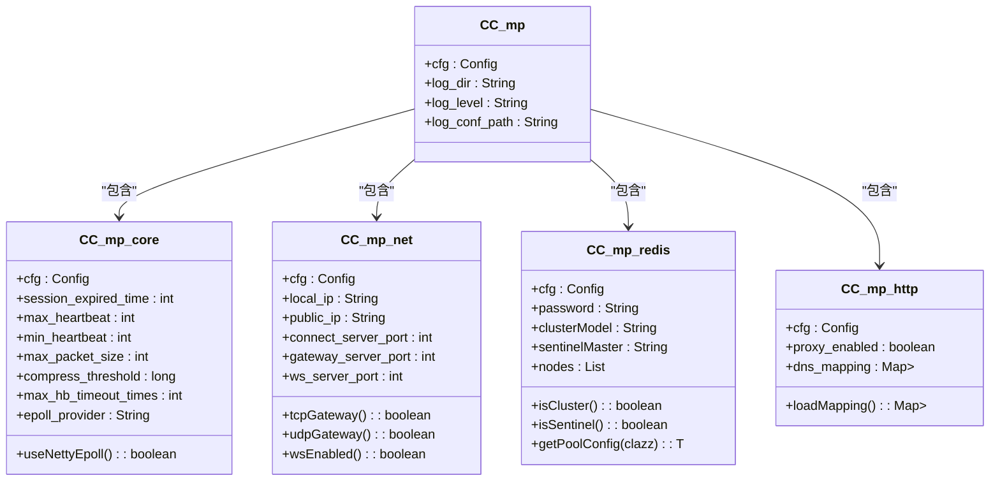
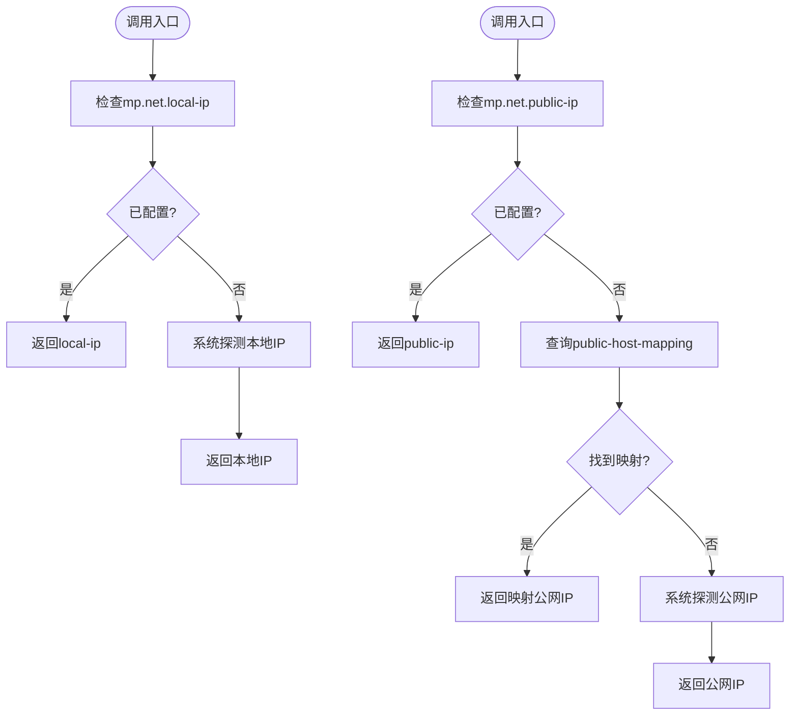
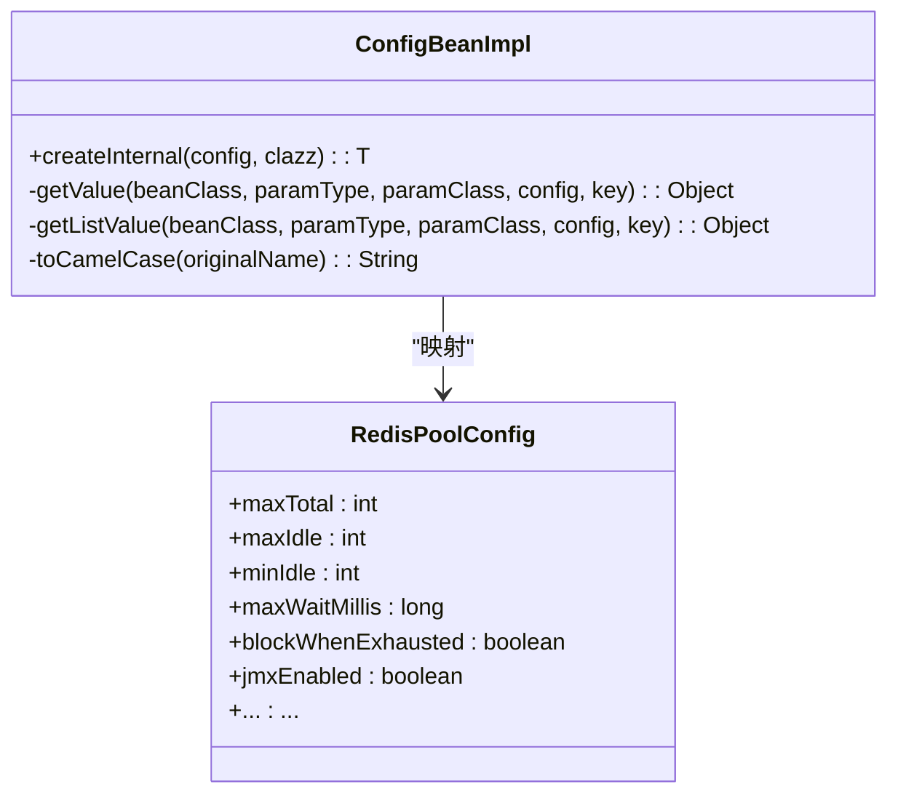
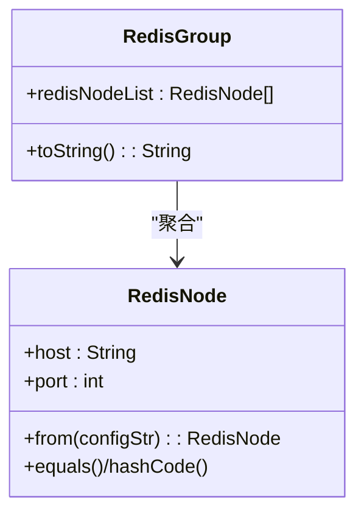
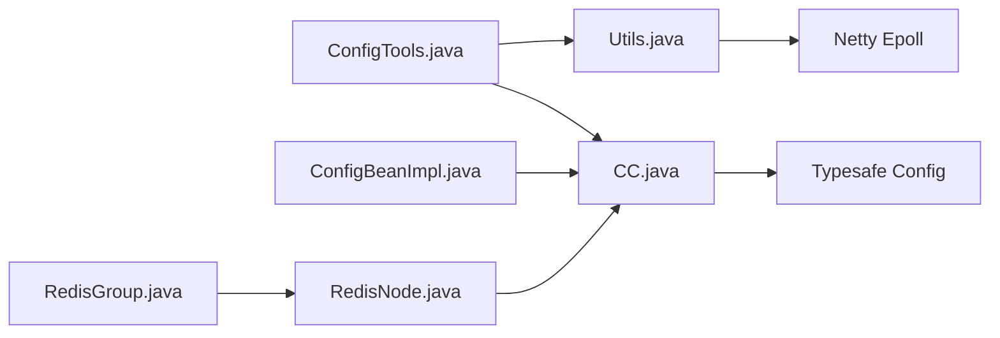

# 配置管理系统

<cite>
**本文引用的文件**   
- [CC.java](file://mpush-tools/src/main/java/com/mpush/tools/config/CC.java)
- [ConfigTools.java](file://mpush-tools/src/main/java/com/mpush/tools/config/ConfigTools.java)
- [ConfigBeanImpl.java](file://mpush-tools/src/main/java/com/mpush/tools/config/ConfigBeanImpl.java)
- [RedisNode.java](file://mpush-tools/src/main/java/com/mpush/tools/config/data/RedisNode.java)
- [RedisGroup.java](file://mpush-tools/src/main/java/com/mpush/tools/config/data/RedisGroup.java)
- [reference.conf](file://conf/reference.conf)
- [conf-dev.properties](file://conf/conf-dev.properties)
- [conf-pub.properties](file://conf/conf-pub.properties)
- [mpush.conf](file://mpush-boot/src/main/resources/mpush.conf)
- [ConfigCenterTest.java](file://mpush-test/src/main/java/com/mpush/test/configcenter/ConfigCenterTest.java)
- [Utils.java](file://mpush-tools/src/main/java/com/mpush/tools/Utils.java)
- [env-mp.sh](file://bin/env-mp.sh)
- [mp.sh](file://bin/mp.sh)
</cite>

## 目录
1. [简介](#简介)
2. [项目结构](#项目结构)
3. [核心组件](#核心组件)
4. [架构总览](#架构总览)
5. [详细组件分析](#详细组件分析)
6. [依赖关系分析](#依赖关系分析)
7. [性能考量](#性能考量)
8. [故障排查指南](#故障排查指南)
9. [结论](#结论)
10. [附录](#附录)

## 简介
本文件面向MPush的配置管理系统，系统性阐述分布式场景下的配置集中化管理、动态更新与环境隔离策略，以及配置文件解析、属性读取、类型转换、默认值处理、Bean映射、Redis集群节点建模、配置验证与合并、热更新支持等关键技术点。文档同时提供配置编写规范、环境变量注入、命令行参数支持、配置验证规则、完整示例与最佳实践，帮助开发者在不同环境中稳定、安全地部署与运维。

## 项目结构
MPush的配置体系主要位于 mpush-tools 模块的 tools.config 包中，配合 conf 目录下的参考配置与 mpush-boot 的运行时配置，形成“参考配置 + 环境覆盖 + 运行时注入”的三层配置链路。bin 目录提供环境变量初始化脚本，便于在不同部署环境下统一加载配置。

图表来源
- [reference.conf](file://conf/reference.conf#L1-L239)
- [conf-dev.properties](file://conf/conf-dev.properties#L1-L5)
- [conf-pub.properties](file://conf/conf-pub.properties#L1-L5)
- [mpush.conf](file://mpush-boot/src/main/resources/mpush.conf#L1-L16)
- [CC.java](file://mpush-tools/src/main/java/com/mpush/tools/config/CC.java#L42-L53)
- [ConfigTools.java](file://mpush-tools/src/main/java/com/mpush/tools/config/ConfigTools.java#L30-L90)
- [ConfigBeanImpl.java](file://mpush-tools/src/main/java/com/mpush/tools/config/ConfigBeanImpl.java#L30-L95)
- [RedisNode.java](file://mpush-tools/src/main/java/com/mpush/tools/config/data/RedisNode.java#L25-L61)
- [RedisGroup.java](file://mpush-tools/src/main/java/com/mpush/tools/config/data/RedisGroup.java#L29-L45)
- [Utils.java](file://mpush-tools/src/main/java/com/mpush/tools/Utils.java#L44-L153)
- [env-mp.sh](file://bin/env-mp.sh#L26-L42)
- [mp.sh](file://bin/mp.sh#L1-L37)

章节来源
- [reference.conf](file://conf/reference.conf#L1-L239)
- [CC.java](file://mpush-tools/src/main/java/com/mpush/tools/config/CC.java#L42-L53)

## 核心组件
- 配置入口与命名空间：CC 提供统一的配置入口，按层级接口暴露配置键，自动合并参考配置与运行时覆盖配置，支持自定义配置文件路径。
- 工具方法：ConfigTools 提供IP解析、心跳区间校验、注册IP推导等实用方法，屏蔽网络与环境差异。
- Bean映射：ConfigBeanImpl 将 HOCON 配置映射为强类型 Java Bean，支持基本类型、集合、Duration、内存大小、嵌套对象等类型转换。
- Redis数据模型：RedisNode/RedisGroup 描述Redis集群节点与分组，支持从字符串解析节点列表。
- 运行时与环境：Utils 提供平台能力检测（如Netty Epoll），env-mp.sh 提供环境变量初始化，mp.sh 作为启动脚本入口。

章节来源
- [CC.java](file://mpush-tools/src/main/java/com/mpush/tools/config/CC.java#L39-L355)
- [ConfigTools.java](file://mpush-tools/src/main/java/com/mpush/tools/config/ConfigTools.java#L30-L90)
- [ConfigBeanImpl.java](file://mpush-tools/src/main/java/com/mpush/tools/config/ConfigBeanImpl.java#L30-L238)
- [RedisNode.java](file://mpush-tools/src/main/java/com/mpush/tools/config/data/RedisNode.java#L25-L90)
- [RedisGroup.java](file://mpush-tools/src/main/java/com/mpush/tools/config/data/RedisGroup.java#L29-L46)
- [Utils.java](file://mpush-tools/src/main/java/com/mpush/tools/Utils.java#L44-L153)

## 架构总览
配置系统采用“参考配置 + 环境覆盖 + 运行时注入”的分层设计，通过 CC 加载并合并配置，再由各子系统按需读取。ConfigTools 与 Utils 提供运行时辅助能力，确保在不同环境与平台下行为一致。

图表来源
- [CC.java](file://mpush-tools/src/main/java/com/mpush/tools/config/CC.java#L42-L53)
- [reference.conf](file://conf/reference.conf#L1-L239)
- [conf-dev.properties](file://conf/conf-dev.properties#L1-L5)
- [conf-pub.properties](file://conf/conf-pub.properties#L1-L5)
- [mpush.conf](file://mpush-boot/src/main/resources/mpush.conf#L1-L16)
- [ConfigTools.java](file://mpush-tools/src/main/java/com/mpush/tools/config/ConfigTools.java#L30-L90)
- [Utils.java](file://mpush-tools/src/main/java/com/mpush/tools/Utils.java#L59-L69)
- [env-mp.sh](file://bin/env-mp.sh#L26-L42)
- [mp.sh](file://bin/mp.sh#L1-L37)

## 详细组件分析

### CC：配置中心与命名空间
- 配置加载顺序
  - 通过 Typesafe Config 加载所有可用配置源（含 reference.conf、conf-*.properties、运行时mpush.conf）。
  - 支持通过 JVM 参数指定自定义配置文件路径（优先级最高）。
- 命名空间与层级
  - 以接口嵌套方式组织配置命名空间，如 mp.core、mp.net、mp.redis 等，每个层级封装 Config 实例与派生常量。
- 关键特性
  - 自动类型转换：Duration、MemorySize、布尔/数值/字符串等。
  - 条件逻辑：如 epoll_provider 与 OS 判断决定是否启用 Netty Epoll。
  - 集合解析：Redis 节点列表解析为 RedisNode 对象列表。
  - DNS 映射解析：http.dns-mapping 解析为 DnsMapping 列表。
- 示例路径
  - [CC.load()](file://mpush-tools/src/main/java/com/mpush/tools/config/CC.java#L42-L53)
  - [mp.core.*](file://mpush-tools/src/main/java/com/mpush/tools/config/CC.java#L61-L83)
  - [mp.net.*](file://mpush-tools/src/main/java/com/mpush/tools/config/CC.java#L85-L130)
  - [mp.redis.*](file://mpush-tools/src/main/java/com/mpush/tools/config/CC.java#L271-L294)
  - [mp.http.dns_mapping](file://mpush-tools/src/main/java/com/mpush/tools/config/CC.java#L308-L318)

图表来源
- [CC.java](file://mpush-tools/src/main/java/com/mpush/tools/config/CC.java#L55-L355)

章节来源
- [CC.java](file://mpush-tools/src/main/java/com/mpush/tools/config/CC.java#L42-L355)

### ConfigTools：配置工具方法
- IP解析与注册IP推导
  - getLocalIp()/getPublicIp()：优先使用配置，否则回退到系统探测。
  - getConnectServerRegisterIp()/getGatewayServerRegisterIp()：根据注册IP优先级推导最终注册地址。
- 心跳区间校验
  - getHeartbeat(min,max)：将业务期望的心跳区间约束在配置允许的最小/最大值之间。
- 示例路径
  - [getLocalIp/getPublicIp](file://mpush-tools/src/main/java/com/mpush/tools/config/ConfigTools.java#L47-L74)
  - [getConnectServerRegisterIp/getGatewayServerRegisterIp](file://mpush-tools/src/main/java/com/mpush/tools/config/ConfigTools.java#L77-L89)
  - [getHeartbeat](file://mpush-tools/src/main/java/com/mpush/tools/config/ConfigTools.java#L35-L40)

图表来源
- [ConfigTools.java](file://mpush-tools/src/main/java/com/mpush/tools/config/ConfigTools.java#L47-L74)

章节来源
- [ConfigTools.java](file://mpush-tools/src/main/java/com/mpush/tools/config/ConfigTools.java#L30-L90)
- [Utils.java](file://mpush-tools/src/main/java/com/mpush/tools/Utils.java#L79-L153)

### ConfigBeanImpl：Bean映射实现
- 设计要点
  - 通过 JavaBeans 反射将 HOCON 配置映射为强类型对象，支持基本类型、Duration、内存大小、集合、嵌套对象等。
  - 键名驼峰化兼容（如 hyphen-case → camelCase），避免重复键冲突。
  - 对泛型集合元素类型进行严格校验，不支持的类型抛出异常。
- 类型支持矩阵（节选）
  - 基本类型：Boolean/boolean、Integer/int、Double/double、Long/long、String、Duration、ConfigMemorySize、Object、Config、ConfigObject、ConfigList、ConfigValue。
  - 集合：List<T>，T ∈ 上述受支持类型。
  - Map：仅支持 Map<String,Object>。
- 示例路径
  - [createInternal](file://mpush-tools/src/main/java/com/mpush/tools/config/ConfigBeanImpl.java#L41-L95)
  - [getValue](file://mpush-tools/src/main/java/com/mpush/tools/config/ConfigBeanImpl.java#L105-L145)
  - [getListValue](file://mpush-tools/src/main/java/com/mpush/tools/config/ConfigBeanImpl.java#L147-L175)

图表来源
- [ConfigBeanImpl.java](file://mpush-tools/src/main/java/com/mpush/tools/config/ConfigBeanImpl.java#L30-L238)
- [CC.java](file://mpush-tools/src/main/java/com/mpush/tools/config/CC.java#L291-L293)

章节来源
- [ConfigBeanImpl.java](file://mpush-tools/src/main/java/com/mpush/tools/config/ConfigBeanImpl.java#L30-L238)
- [CC.java](file://mpush-tools/src/main/java/com/mpush/tools/config/CC.java#L291-L293)

### RedisNode/RedisGroup：Redis集群数据模型
- RedisNode
  - 字段：host、port。
  - 工具方法：from(String) 将“host:port”字符串解析为 RedisNode。
  - 等值与哈希：基于 host/port 的 equals/hashCode。
- RedisGroup
  - 字段：redisNodeList（节点列表）。
  - 用途：承载一组 Redis 节点，便于后续集群/哨兵模式的统一处理。
- 示例路径
  - [RedisNode.from](file://mpush-tools/src/main/java/com/mpush/tools/config/data/RedisNode.java#L54-L61)
  - [RedisGroup.toString](file://mpush-tools/src/main/java/com/mpush/tools/config/data/RedisGroup.java#L40-L44)

图表来源
- [RedisNode.java](file://mpush-tools/src/main/java/com/mpush/tools/config/data/RedisNode.java#L25-L90)
- [RedisGroup.java](file://mpush-tools/src/main/java/com/mpush/tools/config/data/RedisGroup.java#L29-L46)

章节来源
- [RedisNode.java](file://mpush-tools/src/main/java/com/mpush/tools/config/data/RedisNode.java#L25-L90)
- [RedisGroup.java](file://mpush-tools/src/main/java/com/mpush/tools/config/data/RedisGroup.java#L29-L46)

### 配置文件编写规范与验证
- 文件位置与优先级
  - 参考配置：conf/reference.conf（声明所有支持的配置项与默认值）。
  - 环境覆盖：conf/conf-dev.properties、conf/conf-pub.properties（按环境覆盖）。
  - 运行时覆盖：mpush-boot/mpush.conf（启动时注入，优先级最高）。
- 键命名与类型
  - 使用点分层级命名（如 mp.redis.nodes）。
  - 使用 HOCON 语法，字符串含特殊字符需加引号；布尔/数字/Duration/内存大小等类型按约定书写。
- 验证与合并
  - CC.load() 会合并上述配置源，运行时覆盖优先。
  - ConfigBeanImpl 在映射时对不支持的类型抛出异常，便于早期发现配置错误。
- 示例路径
  - [reference.conf 结构](file://conf/reference.conf#L13-L239)
  - [mpush.conf 覆盖示例](file://mpush-boot/src/main/resources/mpush.conf#L1-L16)
  - [conf-dev.properties 示例](file://conf/conf-dev.properties#L1-L5)
  - [conf-pub.properties 示例](file://conf/conf-pub.properties#L1-L5)

章节来源
- [reference.conf](file://conf/reference.conf#L1-L239)
- [mpush.conf](file://mpush-boot/src/main/resources/mpush.conf#L1-L16)
- [conf-dev.properties](file://conf/conf-dev.properties#L1-L5)
- [conf-pub.properties](file://conf/conf-pub.properties#L1-L5)
- [CC.java](file://mpush-tools/src/main/java/com/mpush/tools/config/CC.java#L42-L53)
- [ConfigBeanImpl.java](file://mpush-tools/src/main/java/com/mpush/tools/config/ConfigBeanImpl.java#L105-L145)

### 环境变量与命令行参数支持
- 环境变量
  - bin/env-mp.sh 设置 MP_CFG_DIR、MP_DATA_DIR 等关键环境变量，影响配置与数据目录定位。
- 命令行参数
  - CC.load() 支持通过 JVM 参数 -Dmp.conf 指定自定义配置文件路径，实现“外部化配置”。
- 示例路径
  - [env-mp.sh 环境变量设置](file://bin/env-mp.sh#L26-L42)
  - [CC.load() 自定义配置文件](file://mpush-tools/src/main/java/com/mpush/tools/config/CC.java#L42-L53)
  - [bin/mp.sh 启动脚本入口](file://bin/mp.sh#L1-L37)

章节来源
- [env-mp.sh](file://bin/env-mp.sh#L26-L42)
- [CC.java](file://mpush-tools/src/main/java/com/mpush/tools/config/CC.java#L42-L53)
- [mp.sh](file://bin/mp.sh#L1-L37)

### 动态更新与热更新建议
- 当前实现
  - CC.load() 在应用启动时一次性加载并合并配置，未提供运行时动态刷新。
- 建议方案
  - 引入配置监听（如文件变更或远程配置中心推送），在变更时重建 CC.cfg 并触发相关模块的重新初始化。
  - 对于敏感配置（如密钥、密码），建议通过环境变量或密钥管理服务注入，避免直接写入配置文件。
- 示例路径
  - [CC.load() 单次加载](file://mpush-tools/src/main/java/com/mpush/tools/config/CC.java#L42-L53)

章节来源
- [CC.java](file://mpush-tools/src/main/java/com/mpush/tools/config/CC.java#L42-L53)

## 依赖关系分析
- 组件耦合
  - CC 依赖 Typesafe Config 进行解析与合并；ConfigTools 依赖 CC 与 Utils；ConfigBeanImpl 依赖 CC 的 Config 对象与反射机制；RedisNode/RedisGroup 依赖 CC 的 redis 节点解析结果。
- 外部依赖
  - Typesafe Config：提供 HOCON 解析、类型转换、合并策略。
  - Netty：Utils.useNettyEpoll() 依赖 Netty Epoll 可用性。
- 示例路径
  - [Utils.useNettyEpoll](file://mpush-tools/src/main/java/com/mpush/tools/Utils.java#L59-L69)

图表来源
- [CC.java](file://mpush-tools/src/main/java/com/mpush/tools/config/CC.java#L24-L28)
- [ConfigTools.java](file://mpush-tools/src/main/java/com/mpush/tools/config/ConfigTools.java#L22-L23)
- [ConfigBeanImpl.java](file://mpush-tools/src/main/java/com/mpush/tools/config/ConfigBeanImpl.java#L17-L24)
- [Utils.java](file://mpush-tools/src/main/java/com/mpush/tools/Utils.java#L60-L66)

章节来源
- [Utils.java](file://mpush-tools/src/main/java/com/mpush/tools/Utils.java#L59-L69)

## 性能考量
- 配置解析成本
  - CC.load() 仅在启动阶段执行一次，开销可忽略；后续通过接口常量访问，避免重复解析。
- 类型转换与反射
  - ConfigBeanImpl 在首次映射时进行反射与类型判断，建议在启动阶段完成映射，避免运行时抖动。
- 网络探测与平台检测
  - Utils 的 IP 探测与 Netty Epoll 检测具备缓存与失败降级，减少重复 IO 与类加载开销。

## 故障排查指南
- 常见问题与定位
  - 配置未生效：确认 mpush.conf 是否正确挂载且路径通过 -Dmp.conf 指定；检查 conf-*.properties 是否覆盖了预期键。
  - 类型不匹配：ConfigBeanImpl 对不支持的类型抛异常，检查配置键的类型与目标 Bean 属性类型是否一致。
  - IP 解析异常：若 public-ip 为空且 public-host-mapping 未命中，回退到系统探测；检查网络接口与权限。
  - Epoll 不可用：Utils.useNettyEpoll() 会在类加载失败时降级为 NIO，查看日志警告。
- 示例路径
  - [ConfigBeanImpl 异常抛出](file://mpush-tools/src/main/java/com/mpush/tools/config/ConfigBeanImpl.java#L88-L94)
  - [Utils IP 探测与回退](file://mpush-tools/src/main/java/com/mpush/tools/Utils.java#L79-L153)
  - [Utils Epoll 降级](file://mpush-tools/src/main/java/com/mpush/tools/Utils.java#L59-L69)

章节来源
- [ConfigBeanImpl.java](file://mpush-tools/src/main/java/com/mpush/tools/config/ConfigBeanImpl.java#L88-L94)
- [Utils.java](file://mpush-tools/src/main/java/com/mpush/tools/Utils.java#L59-L153)

## 结论
MPush 的配置管理系统以 CC 为核心，结合 Typesafe Config 的强大解析能力与 Bean 映射机制，实现了“参考配置 + 环境覆盖 + 运行时注入”的灵活配置链路。通过 ConfigTools 与 Utils 提供的运行时辅助能力，系统在不同环境与平台上保持一致的行为。建议在生产环境中采用环境变量与密钥管理服务注入敏感配置，并在需要时引入配置监听以支持热更新。

## 附录
- 配置示例与最佳实践
  - 开发环境：使用 conf-dev.properties 覆盖日志级别与心跳等参数。
  - 生产环境：使用 conf-pub.properties 覆盖安全密钥与公网注册IP。
  - 运行时覆盖：通过 mpush-boot/mpush.conf 注入节点与端口等运行时参数。
  - 环境变量：通过 bin/env-mp.sh 设置 MP_CFG_DIR/MP_DATA_DIR，确保配置与数据目录可被容器/进程正确识别。
- 测试参考
  - 参考 mpush-test 中的 ConfigCenterTest，了解如何遍历与生成 CC 接口代码，验证配置键的完整性与命名一致性。

章节来源
- [mpush.conf](file://mpush-boot/src/main/resources/mpush.conf#L1-L16)
- [conf-dev.properties](file://conf/conf-dev.properties#L1-L5)
- [conf-pub.properties](file://conf/conf-pub.properties#L1-L5)
- [env-mp.sh](file://bin/env-mp.sh#L26-L42)
- [ConfigCenterTest.java](file://mpush-test/src/main/java/com/mpush/test/configcenter/ConfigCenterTest.java#L30-L110)