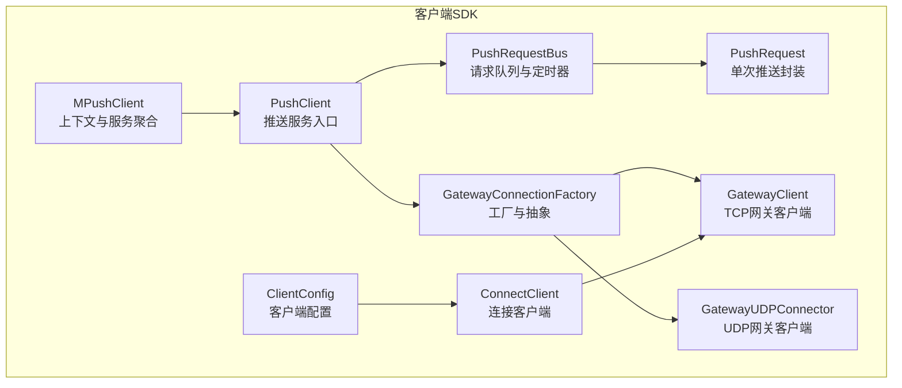
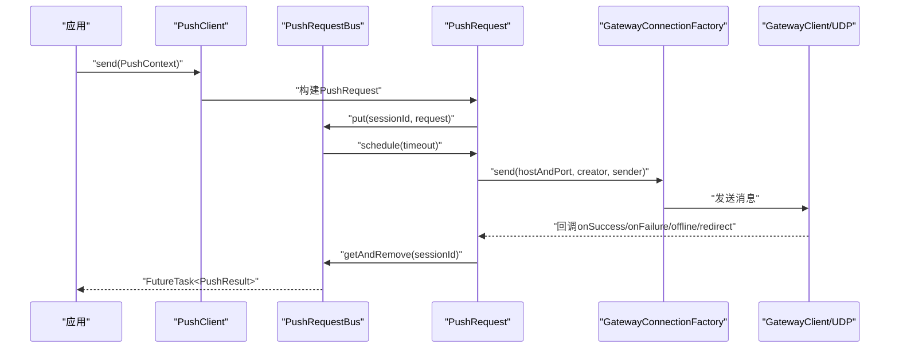
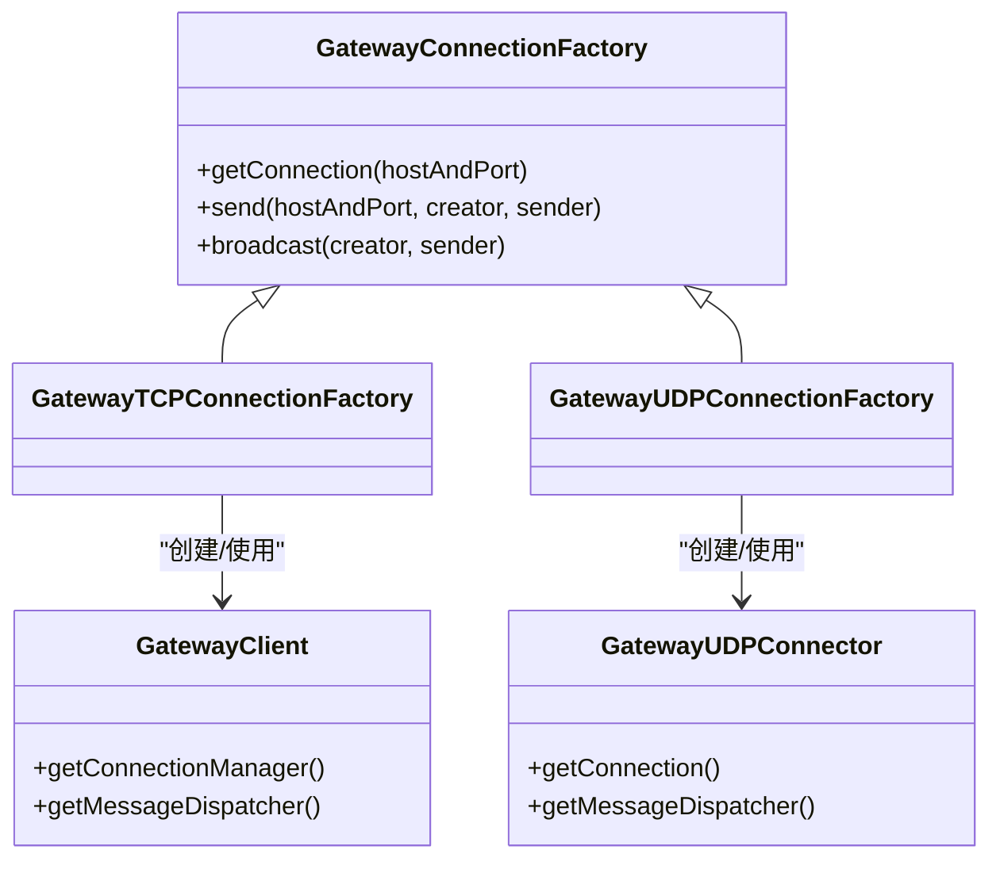
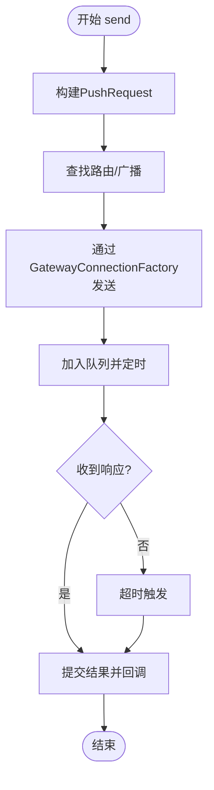
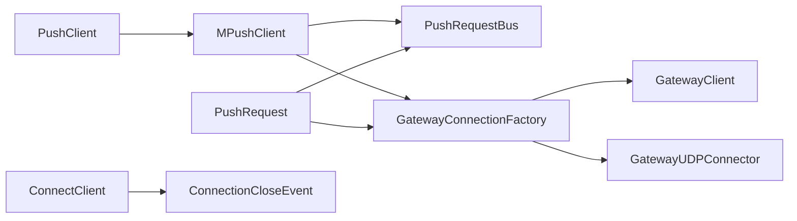

# 客户端SDK

<cite>
**本文引用的文件**
- [MPushClient.java](file://mpush-client/src/main/java/com/mpush/client/MPushClient.java)
- [PushClient.java](file://mpush-client/src/main/java/com/mpush/client/push/PushClient.java)
- [PushRequest.java](file://mpush-client/src/main/java/com/mpush/client/push/PushRequest.java)
- [PushRequestBus.java](file://mpush-client/src/main/java/com/mpush/client/push/PushRequestBus.java)
- [GatewayClient.java](file://mpush-client/src/main/java/com/mpush/client/gateway/GatewayClient.java)
- [GatewayUDPConnector.java](file://mpush-client/src/main/java/com/mpush/client/gateway/GatewayUDPConnector.java)
- [GatewayConnectionFactory.java](file://mpush-client/src/main/java/com/mpush/client/gateway/connection/GatewayConnectionFactory.java)
- [ConnectClient.java](file://mpush-client/src/main/java/com/mpush/client/connect/ConnectClient.java)
- [ClientConfig.java](file://mpush-client/src/main/java/com/mpush/client/connect/ClientConfig.java)
- [MPushContext.java](file://mpush-api/src/main/java/com/mpush/api/MPushContext.java)
- [PushContext.java](file://mpush-api/src/main/java/com/mpush/api/push/PushContext.java)
- [PushCallback.java](file://mpush-api/src/main/java/com/mpush/api/push/PushCallback.java)
- [PushResult.java](file://mpush-api/src/main/java/com/mpush/api/push/PushResult.java)
- [ConnectionManager.java](file://mpush-api/src/main/java/com/mpush/api/connection/ConnectionManager.java)
</cite>

## 目录
1. [简介](#简介)
2. [项目结构](#项目结构)
3. [核心组件](#核心组件)
4. [架构总览](#架构总览)
5. [组件详解](#组件详解)
6. [依赖关系分析](#依赖关系分析)
7. [性能与优化](#性能与优化)
8. [故障排查指南](#故障排查指南)
9. [结论](#结论)
10. [附录：API参考](#附录api参考)

## 简介
本文件面向使用 MPush 客户端 SDK 的开发者，系统性介绍客户端架构设计与使用方法，覆盖以下主题：
- 客户端连接管理：连接建立、断线重连、连接池管理
- 消息发送机制：推送请求构建、请求队列管理、超时处理、成功/失败/离线/超时回调
- 会话状态管理：会话生命周期、状态同步、异常恢复
- 网关客户端：TCP/UDP 网关连接、连接池、多协议适配
- API 参考：完整公共接口、参数与返回值说明
- 使用示例与最佳实践：快速集成与性能优化建议

## 项目结构
客户端SDK位于 mpush-client 模块，围绕 PushClient、PushRequest、PushRequestBus、GatewayClient/GatewayUDPConnector、GatewayConnectionFactory 等核心类组织；同时通过 mpush-api 提供统一的上下文与推送契约。

图表来源
- [MPushClient.java](file://mpush-client/src/main/java/com/mpush/client/MPushClient.java#L38-L105)
- [PushClient.java](file://mpush-client/src/main/java/com/mpush/client/push/PushClient.java#L39-L115)
- [PushRequestBus.java](file://mpush-client/src/main/java/com/mpush/client/push/PushRequestBus.java#L37-L73)
- [PushRequest.java](file://mpush-client/src/main/java/com/mpush/client/push/PushRequest.java#L46-L352)
- [GatewayClient.java](file://mpush-client/src/main/java/com/mpush/client/gateway/GatewayClient.java#L54-L134)
- [GatewayUDPConnector.java](file://mpush-client/src/main/java/com/mpush/client/gateway/GatewayUDPConnector.java#L46-L96)
- [GatewayConnectionFactory.java](file://mpush-client/src/main/java/com/mpush/client/gateway/connection/GatewayConnectionFactory.java#L39-L53)
- [ConnectClient.java](file://mpush-client/src/main/java/com/mpush/client/connect/ConnectClient.java#L28-L50)
- [ClientConfig.java](file://mpush-client/src/main/java/com/mpush/client/connect/ClientConfig.java#L23-L105)

章节来源
- [MPushClient.java](file://mpush-client/src/main/java/com/mpush/client/MPushClient.java#L38-L105)
- [PushClient.java](file://mpush-client/src/main/java/com/mpush/client/push/PushClient.java#L39-L115)

## 核心组件
- MPushClient：客户端上下文容器，负责初始化监控、事件总线、推送请求总线、远程路由缓存、网关连接工厂等。
- PushClient：对外暴露的推送服务入口，负责启动/停止服务发现、缓存、推送请求总线与网关连接工厂。
- PushRequest：单次推送的封装，内含状态机、超时调度、回调分发、离线/重定向处理。
- PushRequestBus：基于定时器的请求队列，维护 sessionId -> PushRequest 映射，负责超时触发与异步回调。
- GatewayClient：TCP 网关客户端，支持流量整形、多工作线程、可选 UDT/SCTP 协议。
- GatewayUDPConnector：UDP 多播网关客户端，支持组播配置与消息分发。
- GatewayConnectionFactory：网关连接工厂抽象，按配置选择 TCP 或 UDP 实现。
- ConnectClient：连接客户端（用于握手/心跳等），订阅连接关闭事件自动停止。
- ClientConfig：客户端基础配置（设备、系统、用户、密钥等）。

章节来源
- [MPushClient.java](file://mpush-client/src/main/java/com/mpush/client/MPushClient.java#L38-L105)
- [PushClient.java](file://mpush-client/src/main/java/com/mpush/client/push/PushClient.java#L39-L115)
- [PushRequest.java](file://mpush-client/src/main/java/com/mpush/client/push/PushRequest.java#L46-L352)
- [PushRequestBus.java](file://mpush-client/src/main/java/com/mpush/client/push/PushRequestBus.java#L37-L73)
- [GatewayClient.java](file://mpush-client/src/main/java/com/mpush/client/gateway/GatewayClient.java#L54-L134)
- [GatewayUDPConnector.java](file://mpush-client/src/main/java/com/mpush/client/gateway/GatewayUDPConnector.java#L46-L96)
- [GatewayConnectionFactory.java](file://mpush-client/src/main/java/com/mpush/client/gateway/connection/GatewayConnectionFactory.java#L39-L53)
- [ConnectClient.java](file://mpush-client/src/main/java/com/mpush/client/connect/ConnectClient.java#L28-L50)
- [ClientConfig.java](file://mpush-client/src/main/java/com/mpush/client/connect/ClientConfig.java#L23-L105)

## 架构总览
客户端整体采用“服务聚合 + 请求队列 + 网关适配”的分层设计：
- 上层通过 PushClient 统一启动/停止各类子服务
- 中层 PushRequest 将每次推送封装为可取消、可超时的任务
- 下层 PushRequestBus 负责队列与定时器调度
- 网关侧根据配置选择 TCP 或 UDP 连接方式，统一通过 Connection 发送消息

图表来源
- [PushClient.java](file://mpush-client/src/main/java/com/mpush/client/push/PushClient.java#L49-L80)
- [PushRequest.java](file://mpush-client/src/main/java/com/mpush/client/push/PushRequest.java#L71-L118)
- [PushRequestBus.java](file://mpush-client/src/main/java/com/mpush/client/push/PushRequestBus.java#L47-L50)
- [GatewayConnectionFactory.java](file://mpush-client/src/main/java/com/mpush/client/gateway/connection/GatewayConnectionFactory.java#L47-L51)

## 组件详解

### 客户端连接管理
- 连接建立
  - TCP：GatewayClient 在启动时初始化 ChannelPipeline，注册 OK/ERROR 处理器，可启用全局流量整形，按配置选择 TCP/UDT/SCTP。
  - UDP：GatewayUDPConnector 初始化多播地址与网络接口，注册消息分发器，设置组播相关 Socket 选项。
- 断线与重连
  - ConnectClient 订阅 ConnectionCloseEvent，收到后主动 stop，避免僵尸连接。
  - PushRequest 在 onRedirect 时清理本地路由缓存并重发；在 offline 时标记离线并结束。
- 连接池管理
  - GatewayConnectionFactory 抽象出 getConnection/send/broadcast 接口，具体实现由 TCP/UDP 工厂类提供。
  - Netty 层通过 Bootstrap/ChannelFactory 管理连接生命周期与资源回收。

图表来源
- [GatewayConnectionFactory.java](file://mpush-client/src/main/java/com/mpush/client/gateway/connection/GatewayConnectionFactory.java#L39-L53)
- [GatewayClient.java](file://mpush-client/src/main/java/com/mpush/client/gateway/GatewayClient.java#L54-L134)
- [GatewayUDPConnector.java](file://mpush-client/src/main/java/com/mpush/client/gateway/GatewayUDPConnector.java#L46-L96)

章节来源
- [GatewayClient.java](file://mpush-client/src/main/java/com/mpush/client/gateway/GatewayClient.java#L54-L134)
- [GatewayUDPConnector.java](file://mpush-client/src/main/java/com/mpush/client/gateway/GatewayUDPConnector.java#L46-L96)
- [GatewayConnectionFactory.java](file://mpush-client/src/main/java/com/mpush/client/gateway/connection/GatewayConnectionFactory.java#L39-L53)
- [ConnectClient.java](file://mpush-client/src/main/java/com/mpush/client/connect/ConnectClient.java#L28-L50)

### 消息发送机制
- 推送请求构建
  - PushRequest.build 从 PushContext 读取内容或序列化 PushMsg，设置 ACK 模式、用户、标签、条件、任务 ID、超时与回调。
- 请求队列管理
  - PushRequestBus.put 将请求放入并发映射，并按超时时间调度 FutureTask；getAndRemove 在收到响应时移除。
- 超时处理
  - PushRequestBus 使用线程池定时器触发 PushRequest.run，若状态仍为 init 则进入 timeout 分支。
- 成功/失败/离线/重定向回调
  - onSuccess/onFailure/offline/redirect 分别更新状态并触发回调；重定向会刷新路由并重发。

图表来源
- [PushRequest.java](file://mpush-client/src/main/java/com/mpush/client/push/PushRequest.java#L71-L118)
- [PushRequest.java](file://mpush-client/src/main/java/com/mpush/client/push/PushRequest.java#L147-L155)
- [PushRequestBus.java](file://mpush-client/src/main/java/com/mpush/client/push/PushRequestBus.java#L47-L50)

章节来源
- [PushRequest.java](file://mpush-client/src/main/java/com/mpush/client/push/PushRequest.java#L46-L352)
- [PushRequestBus.java](file://mpush-client/src/main/java/com/mpush/client/push/PushRequestBus.java#L37-L73)

### 会话状态管理
- 生命周期
  - PushRequest 内部维护状态机：init/success/failure/offline/timeout，保证幂等提交。
  - PushRequestBus 负责超时调度与异步回调执行。
- 状态同步与异常恢复
  - onRedirect：清理本地缓存并按新路由重发，避免陈旧路由导致失败。
  - offline：标记用户离线，清理缓存并结束。
  - failure：发送失败，结束并回调失败。
- 回调线程模型
  - 非超时场景在 Netty 线程池中，通过 PushRequestBus 异步转交至业务线程池执行回调。

章节来源
- [PushRequest.java](file://mpush-client/src/main/java/com/mpush/client/push/PushRequest.java#L120-L140)
- [PushRequest.java](file://mpush-client/src/main/java/com/mpush/client/push/PushRequest.java#L233-L248)

### 网关客户端使用指南
- TCP 网关
  - 支持流量整形、自定义 SO_SNDBUF/SO_RCVBUF、多工作线程；可切换 UDT/SCTP。
  - 通过 GatewayClientChannelHandler 注册 OK/ERROR 处理器。
- UDP 网关
  - 通过多播地址与网络接口初始化，设置组播 TTL/LOOP 等选项。
  - 通过 UDPChannelHandler 接收并分发消息。
- 连接池管理
  - GatewayConnectionFactory.create 根据配置选择 TCP 或 UDP 实现。
  - send/broadcast 返回布尔值指示是否成功获取连接并发起发送。

章节来源
- [GatewayClient.java](file://mpush-client/src/main/java/com/mpush/client/gateway/GatewayClient.java#L54-L134)
- [GatewayUDPConnector.java](file://mpush-client/src/main/java/com/mpush/client/gateway/GatewayUDPConnector.java#L46-L96)
- [GatewayConnectionFactory.java](file://mpush-client/src/main/java/com/mpush/client/gateway/connection/GatewayConnectionFactory.java#L39-L53)

## 依赖关系分析
- PushClient 依赖 MPushClient 提供的上下文能力（监控、线程池、推送总线、路由管理、网关工厂）
- PushRequest 依赖 PushRequestBus 进行队列与超时管理，依赖 GatewayConnectionFactory 发送消息
- GatewayClient/GatewayUDPConnector 依赖 Netty 通道与消息分发器
- ConnectClient 依赖事件总线与连接关闭事件

图表来源
- [PushClient.java](file://mpush-client/src/main/java/com/mpush/client/push/PushClient.java#L83-L104)
- [MPushClient.java](file://mpush-client/src/main/java/com/mpush/client/MPushClient.java#L48-L58)
- [PushRequest.java](file://mpush-client/src/main/java/com/mpush/client/push/PushRequest.java#L86-L112)
- [GatewayConnectionFactory.java](file://mpush-client/src/main/java/com/mpush/client/gateway/connection/GatewayConnectionFactory.java#L43-L44)
- [ConnectClient.java](file://mpush-client/src/main/java/com/mpush/client/connect/ConnectClient.java#L41-L44)

章节来源
- [PushClient.java](file://mpush-client/src/main/java/com/mpush/client/push/PushClient.java#L83-L104)
- [MPushClient.java](file://mpush-client/src/main/java/com/mpush/client/MPushClient.java#L48-L58)

## 性能与优化
- 线程与资源
  - 使用线程池管理器统一调度推送定时器与事件总线，避免阻塞 Netty 线程。
  - GatewayClient 支持流量整形与缓冲区配置，按需调整以平衡吞吐与延迟。
- 路由与缓存
  - 优先命中本地路由缓存，减少远程查询；在重定向/离线时及时失效缓存。
- 超时与队列
  - 为不同场景设置合理超时；避免过长超时占用队列资源。
- 协议选择
  - UDP 适合广播与低延迟场景；TCP 更稳定，适合需要确认的推送。

[本节为通用建议，无需特定文件引用]

## 故障排查指南
- 连接失败
  - 检查 GatewayConnectionFactory 是否正确创建 TCP/UDP 实现；确认目标主机与端口可达。
- 推送超时
  - 检查 PushRequestBus 定时器是否正常；适当增大 PushContext.timeout。
- 用户离线
  - PushRequest.offline 会清理缓存并结束；确认用户是否真的离线。
- 路由变更
  - PushRequest.onRedirect 会刷新路由并重发；检查路由中心与本地缓存一致性。
- 回调未触发
  - 确认回调线程模型：Netty 线程中不会直接回调，需等待 PushRequestBus 异步执行。

章节来源
- [PushRequest.java](file://mpush-client/src/main/java/com/mpush/client/push/PushRequest.java#L209-L248)
- [PushRequestBus.java](file://mpush-client/src/main/java/com/mpush/client/push/PushRequestBus.java#L56-L58)

## 结论
MPush 客户端 SDK 通过清晰的服务分层与强健的请求状态机，提供了高可用、可观测、易扩展的推送能力。结合 TCP/UDP 网关与路由缓存，可在不同网络与业务场景下取得良好性能与稳定性。

[本节为总结，无需特定文件引用]

## 附录：API参考

### MPushClient
- 角色：客户端上下文容器，聚合监控、事件总线、推送总线、路由管理、网关工厂
- 关键方法
  - getMonitorService()/getThreadPoolManager()
  - getPushRequestBus()/getCachedRemoteRouterManager()/getGatewayConnectionFactory()

章节来源
- [MPushClient.java](file://mpush-client/src/main/java/com/mpush/client/MPushClient.java#L38-L105)
- [MPushContext.java](file://mpush-api/src/main/java/com/mpush/api/MPushContext.java#L33-L45)

### PushClient
- 角色：推送服务入口，负责启动/停止服务发现、缓存、推送总线与网关工厂
- 关键方法
  - send(PushContext): FutureTask<PushResult>
  - setMPushContext(MPushContext)
  - 生命周期：doStart/doStop/isRunning

章节来源
- [PushClient.java](file://mpush-client/src/main/java/com/mpush/client/push/PushClient.java#L39-L115)
- [PushContext.java](file://mpush-api/src/main/java/com/mpush/api/push/PushContext.java#L33-L205)

### PushRequest
- 角色：单次推送封装，包含状态机、超时、回调、离线/重定向处理
- 关键方法
  - build(MPushClient, PushContext): PushRequest
  - send(RemoteRouter)/broadcast(): FutureTask<PushResult>
  - onRedirect()/onSuccess()/onFailure()/onOffline()
  - run(): 超时或异步回调入口
- 关键属性
  - ackModel/tags/condition/taskId/content/timeout/callback/userId/location/sessionId

章节来源
- [PushRequest.java](file://mpush-client/src/main/java/com/mpush/client/push/PushRequest.java#L46-L352)

### PushRequestBus
- 角色：请求队列与定时器，维护 sessionId -> PushRequest 映射
- 关键方法
  - put(int, PushRequest): Future
  - getAndRemove(int): PushRequest
  - asyncCall(Runnable): 异步执行

章节来源
- [PushRequestBus.java](file://mpush-client/src/main/java/com/mpush/client/push/PushRequestBus.java#L37-L73)

### GatewayConnectionFactory
- 角色：网关连接工厂抽象
- 关键方法
  - create(MPushClient): GatewayConnectionFactory
  - getConnection(hostAndPort)
  - send(hostAndPort, creator, sender)
  - broadcast(creator, sender)

章节来源
- [GatewayConnectionFactory.java](file://mpush-client/src/main/java/com/mpush/client/gateway/connection/GatewayConnectionFactory.java#L39-L53)

### GatewayClient
- 角色：TCP 网关客户端，支持流量整形、多协议、多工作线程
- 关键方法
  - getConnectionManager()/getMessageDispatcher()
  - getChannelFactory()/getSelectorProvider()
  - initPipeline()/initOptions()

章节来源
- [GatewayClient.java](file://mpush-client/src/main/java/com/mpush/client/gateway/GatewayClient.java#L54-L134)

### GatewayUDPConnector
- 角色：UDP 网关客户端，支持多播与消息分发
- 关键方法
  - getConnection()/getMessageDispatcher()
  - initOptions()/getChannelHandler()

章节来源
- [GatewayUDPConnector.java](file://mpush-client/src/main/java/com/mpush/client/gateway/GatewayUDPConnector.java#L46-L96)

### ConnectClient
- 角色：连接客户端，订阅连接关闭事件并停止
- 关键方法
  - getChannelHandler()
  - on(ConnectionCloseEvent)

章节来源
- [ConnectClient.java](file://mpush-client/src/main/java/com/mpush/client/connect/ConnectClient.java#L28-L50)

### ClientConfig
- 角色：客户端基础配置
- 关键字段
  - clientKey/iv/clientVersion/deviceId/osName/osVersion/cipher/userId

章节来源
- [ClientConfig.java](file://mpush-client/src/main/java/com/mpush/client/connect/ClientConfig.java#L23-L105)

### PushContext
- 角色：推送上下文，承载推送内容、目标、ACK模式、超时、标签、条件、任务ID等
- 关键方法
  - build(String)/build(PushMsg)
  - setUserId/setUserIds/setAckModel/setCallback/setTimeout/setTags/setCondition/setTaskId
  - isBroadcast()

章节来源
- [PushContext.java](file://mpush-api/src/main/java/com/mpush/api/push/PushContext.java#L33-L205)

### PushCallback
- 角色：推送回调接口，默认按结果码分派 onSuccess/onFailure/onOffline/onTimeout
- 关键方法
  - onResult(PushResult)
  - onSuccess/onFailure/onOffline/onTimeout

章节来源
- [PushCallback.java](file://mpush-api/src/main/java/com/mpush/api/push/PushCallback.java#L12-L65)

### PushResult
- 角色：推送结果对象
- 关键常量
  - CODE_SUCCESS/CODE_FAILURE/CODE_OFFLINE/CODE_TIMEOUT
- 关键方法
  - getResultCode()/getResultDesc()/setUserId/setLocation/setTimeLine

章节来源
- [PushResult.java](file://mpush-api/src/main/java/com/mpush/api/push/PushResult.java#L31-L104)

### ConnectionManager
- 角色：连接管理接口
- 关键方法
  - get/removeAndClose/add/getConnNum/init/destroy

章节来源
- [ConnectionManager.java](file://mpush-api/src/main/java/com/mpush/api/connection/ConnectionManager.java#L31-L44)