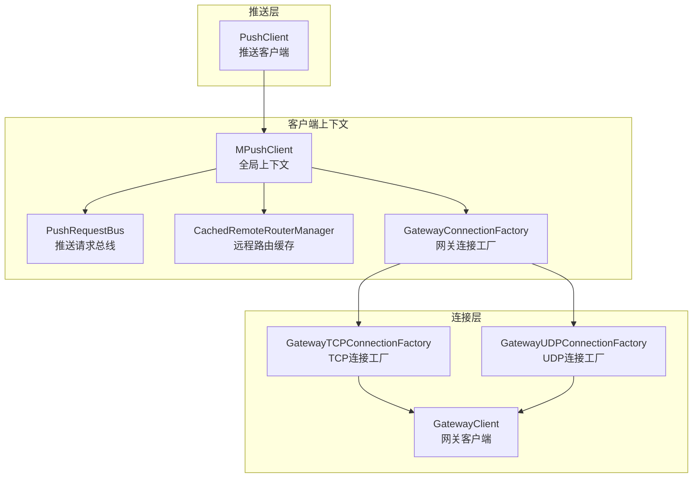
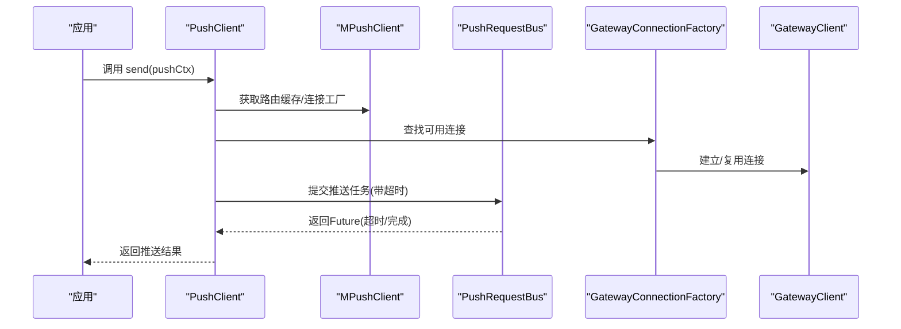
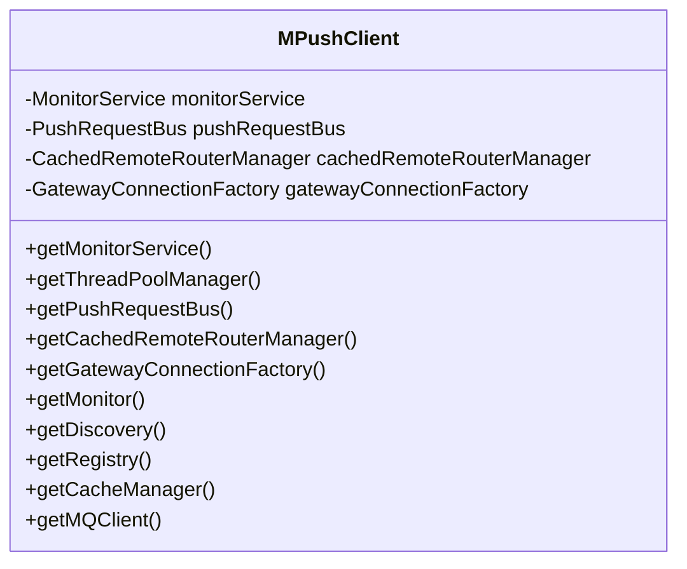
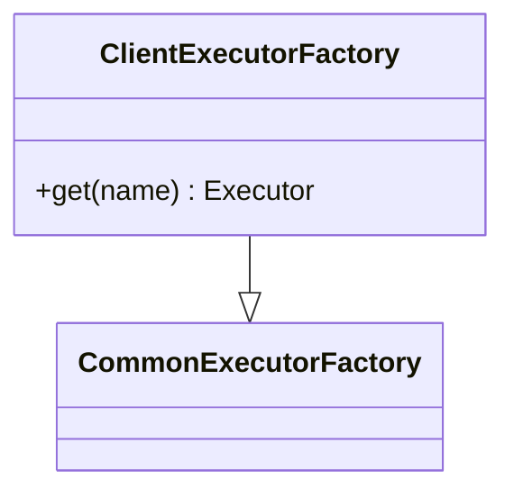
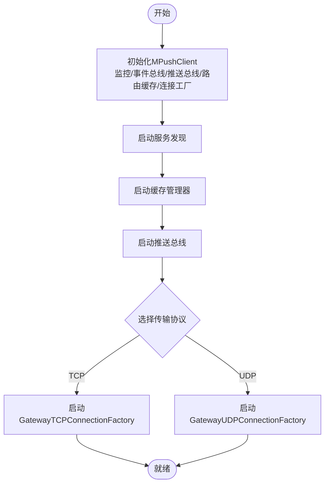
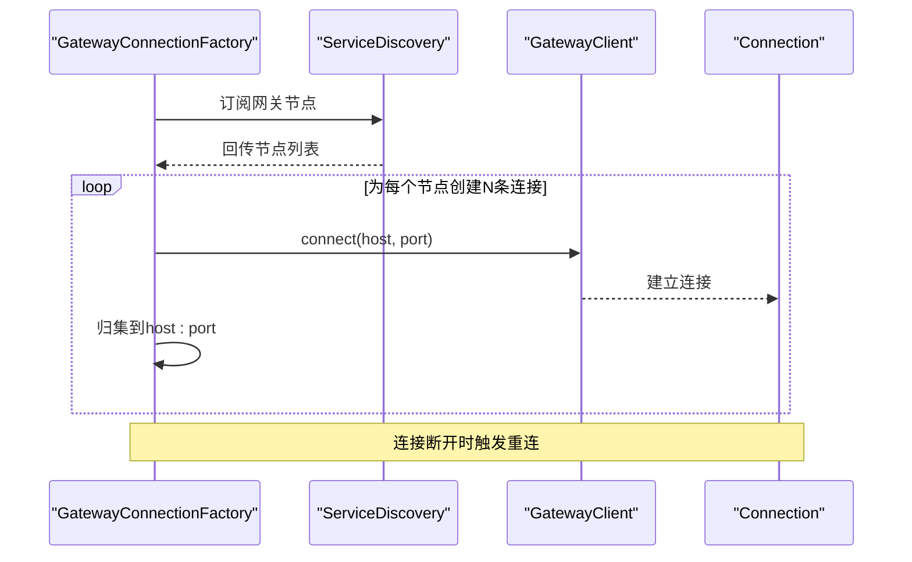
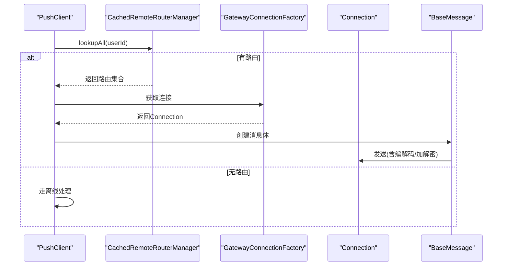
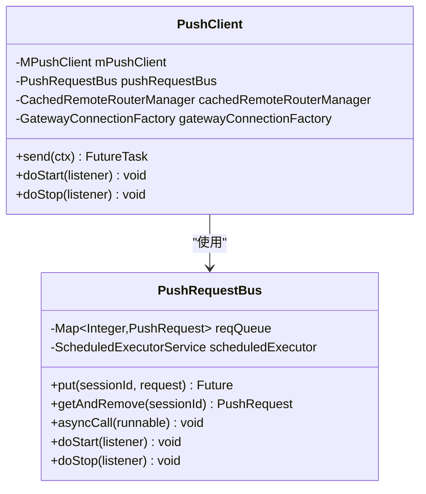
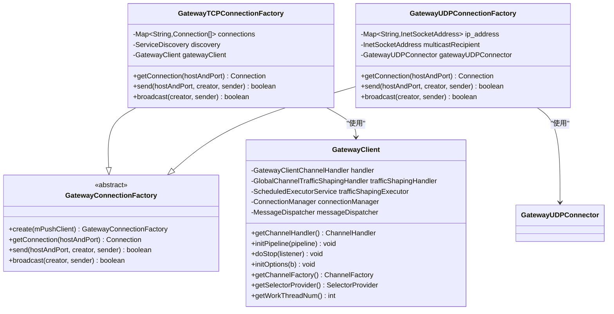
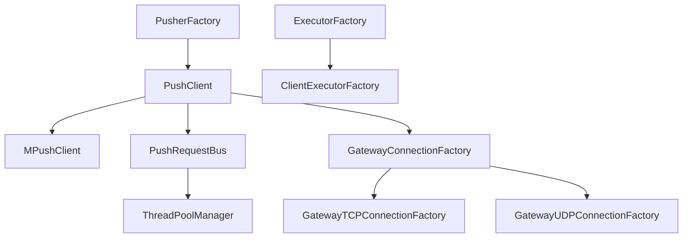

# 客户端架构设计

<cite>
**本文引用的文件**
- [MPushClient.java](file://mpush-client/src/main/java/com/mpush/client/MPushClient.java)
- [ClientExecutorFactory.java](file://mpush-client/src/main/java/com/mpush/client/ClientExecutorFactory.java)
- [ClientConfig.java](file://mpush-client/src/main/java/com/mpush/client/connect/ClientConfig.java)
- [ConnectClient.java](file://mpush-client/src/main/java/com/mpush/client/connect/ConnectClient.java)
- [GatewayClient.java](file://mpush-client/src/main/java/com/mpush/client/gateway/GatewayClient.java)
- [GatewayConnectionFactory.java](file://mpush-client/src/main/java/com/mpush/client/gateway/connection/GatewayConnectionFactory.java)
- [GatewayTCPConnectionFactory.java](file://mpush-client/src/main/java/com/mpush/client/gateway/connection/GatewayTCPConnectionFactory.java)
- [GatewayUDPConnectionFactory.java](file://mpush-client/src/main/java/com/mpush/client/gateway/connection/GatewayUDPConnectionFactory.java)
- [PushClient.java](file://mpush-client/src/main/java/com/mpush/client/push/PushClient.java)
- [PushRequestBus.java](file://mpush-client/src/main/java/com/mpush/client/push/PushRequestBus.java)
- [CachedRemoteRouterManager.java](file://mpush-common/src/main/java/com/mpush/common/router/CachedRemoteRouterManager.java)
- [BaseMessage.java](file://mpush-common/src/main/java/com/mpush/common/message/BaseMessage.java)
- [MPushContext.java](file://mpush-api/src/main/java/com/mpush/api/MPushContext.java)
- [com.mpush.api.spi.client.PusherFactory](file://mpush-client/src/main/resources/META-INF/services/com.mpush.api.spi.client.PusherFactory)
- [com.mpush.api.spi.common.ExecutorFactory](file://mpush-client/src/main/resources/META-INF/services/com.mpush.api.spi.common.ExecutorFactory)
</cite>

## 目录
1. [引言](#引言)
2. [项目结构](#项目结构)
3. [核心组件](#核心组件)
4. [架构总览](#架构总览)
5. [详细组件分析](#详细组件分析)
6. [依赖分析](#依赖分析)
7. [性能考虑](#性能考虑)
8. [故障排查指南](#故障排查指南)
9. [结论](#结论)
10. [附录](#附录)

## 引言
本文件面向MPush客户端的架构设计，系统性阐述客户端整体设计原理与实现细节，重点覆盖以下方面：
- MPushClient主入口类的设计思路与职责边界
- 客户端执行器工厂的作用与实现策略
- 客户端生命周期管理（启动/停止）
- 初始化流程与配置加载机制
- 线程池管理策略与资源回收
- 客户端与服务器的交互模式：连接建立、消息传递、状态同步
- 架构决策的技术考量与性能优化策略

目标是帮助开发者在理解代码的同时，把握客户端的运行机理与扩展点。

## 项目结构
MPush客户端位于模块“mpush-client”，围绕“上下文-连接-推送”三层结构组织：
- 上下文层：MPushClient作为全局上下文容器，聚合监控、推送总线、路由缓存、网关连接工厂等核心组件
- 连接层：GatewayClient负责与网关服务建立长连接；支持TCP/UDP两种传输形态
- 推送层：PushClient封装推送发送逻辑；PushRequestBus负责请求调度与超时控制

**图表来源**
- [MPushClient.java](file://mpush-client/src/main/java/com/mpush/client/MPushClient.java#L38-L105)
- [PushRequestBus.java](file://mpush-client/src/main/java/com/mpush/client/push/PushRequestBus.java#L37-L73)
- [CachedRemoteRouterManager.java](file://mpush-common/src/main/java/com/mpush/common/router/CachedRemoteRouterManager.java#L33-L72)
- [GatewayConnectionFactory.java](file://mpush-client/src/main/java/com/mpush/client/gateway/connection/GatewayConnectionFactory.java#L39-L53)
- [GatewayTCPConnectionFactory.java](file://mpush-client/src/main/java/com/mpush/client/gateway/connection/GatewayTCPConnectionFactory.java#L54-L219)
- [GatewayUDPConnectionFactory.java](file://mpush-client/src/main/java/com/mpush/client/gateway/connection/GatewayUDPConnectionFactory.java#L49-L125)
- [GatewayClient.java](file://mpush-client/src/main/java/com/mpush/client/gateway/GatewayClient.java#L54-L134)
- [PushClient.java](file://mpush-client/src/main/java/com/mpush/client/push/PushClient.java#L39-L115)

**章节来源**
- [MPushClient.java](file://mpush-client/src/main/java/com/mpush/client/MPushClient.java#L38-L105)
- [GatewayConnectionFactory.java](file://mpush-client/src/main/java/com/mpush/client/gateway/connection/GatewayConnectionFactory.java#L39-L53)

## 核心组件
- MPushClient：全局上下文容器，负责初始化监控、事件总线、推送总线、路由缓存与网关连接工厂，并通过SPI暴露服务发现、注册、缓存、消息队列等能力
- PushClient：推送发送器，负责根据用户或广播场景选择路由与连接，协调推送总线与网关工厂完成消息发送
- PushRequestBus：基于定时调度的请求总线，维护会话到请求的映射，统一处理超时与异步回调
- CachedRemoteRouterManager：带过期策略的远程路由缓存，降低路由查询开销并支持失效刷新
- GatewayConnectionFactory及其TCP/UDP实现：抽象出统一的连接获取与消息发送接口，按配置选择传输协议
- GatewayClient：基于Netty的TCP客户端，负责与网关建立连接、注册消息处理器、配置流量整形与网络参数
- ClientExecutorFactory：客户端专用线程池工厂，提供推送定时器与ACK定时器的定制化实现

**章节来源**
- [MPushClient.java](file://mpush-client/src/main/java/com/mpush/client/MPushClient.java#L38-L105)
- [PushClient.java](file://mpush-client/src/main/java/com/mpush/client/push/PushClient.java#L39-L115)
- [PushRequestBus.java](file://mpush-client/src/main/java/com/mpush/client/push/PushRequestBus.java#L37-L73)
- [CachedRemoteRouterManager.java](file://mpush-common/src/main/java/com/mpush/common/router/CachedRemoteRouterManager.java#L33-L72)
- [GatewayConnectionFactory.java](file://mpush-client/src/main/java/com/mpush/client/gateway/connection/GatewayConnectionFactory.java#L39-L53)
- [GatewayTCPConnectionFactory.java](file://mpush-client/src/main/java/com/mpush/client/gateway/connection/GatewayTCPConnectionFactory.java#L54-L219)
- [GatewayUDPConnectionFactory.java](file://mpush-client/src/main/java/com/mpush/client/gateway/connection/GatewayUDPConnectionFactory.java#L49-L125)
- [GatewayClient.java](file://mpush-client/src/main/java/com/mpush/client/gateway/GatewayClient.java#L54-L134)
- [ClientExecutorFactory.java](file://mpush-client/src/main/java/com/mpush/client/ClientExecutorFactory.java#L39-L63)

## 架构总览
客户端采用“上下文聚合+多连接工厂+推送总线”的分层架构。初始化阶段通过SPI加载服务发现、缓存与MQ等基础设施；运行期由PushClient驱动，依据用户路由信息选择合适的网关连接进行消息发送；同时借助PushRequestBus对请求进行统一调度与超时控制。

**图表来源**
- [PushClient.java](file://mpush-client/src/main/java/com/mpush/client/push/PushClient.java#L49-L80)
- [MPushClient.java](file://mpush-client/src/main/java/com/mpush/client/MPushClient.java#L48-L58)
- [PushRequestBus.java](file://mpush-client/src/main/java/com/mpush/client/push/PushRequestBus.java#L47-L58)
- [GatewayConnectionFactory.java](file://mpush-client/src/main/java/com/mpush/client/gateway/connection/GatewayConnectionFactory.java#L43-L45)
- [GatewayClient.java](file://mpush-client/src/main/java/com/mpush/client/gateway/GatewayClient.java#L54-L75)

## 详细组件分析

### MPushClient 主入口类
- 设计要点
  - 作为全局上下文容器，集中初始化监控、事件总线、推送总线、路由缓存与网关连接工厂
  - 通过SPI方法对外暴露服务发现、注册、缓存、MQ等能力，便于上层统一接入
- 生命周期
  - 构造函数内完成各子系统的初始化；对外提供getter方法供其他组件访问
- 关键接口
  - getMonitor()/getDiscovery()/getRegistry()/getCacheManager()/getMQClient()均委托SPI工厂创建

**图表来源**
- [MPushClient.java](file://mpush-client/src/main/java/com/mpush/client/MPushClient.java#L38-L105)

**章节来源**
- [MPushClient.java](file://mpush-client/src/main/java/com/mpush/client/MPushClient.java#L38-L105)
- [MPushContext.java](file://mpush-api/src/main/java/com/mpush/api/MPushContext.java#L33-L45)

### 客户端执行器工厂（ClientExecutorFactory）
- 作用
  - 实现客户端专用线程池工厂，提供推送定时器与ACK定时器的定制化实现
- 策略
  - 推送定时器：使用可回收的调度线程池，拒绝策略为在调用线程直接执行，避免阻塞
  - ACK定时器：使用可回收的调度线程池，拒绝时记录日志，防止ACK上下文丢失
- 与SPI集成
  - 通过SPI标识确保被框架加载

**图表来源**
- [ClientExecutorFactory.java](file://mpush-client/src/main/java/com/mpush/client/ClientExecutorFactory.java#L39-L63)

**章节来源**
- [ClientExecutorFactory.java](file://mpush-client/src/main/java/com/mpush/client/ClientExecutorFactory.java#L39-L63)
- [com.mpush.api.spi.common.ExecutorFactory](file://mpush-client/src/main/resources/META-INF/services/com.mpush.api.spi.common.ExecutorFactory#L1-L1)

### 客户端初始化流程与配置加载
- 初始化顺序
  - 启动服务发现与缓存：PushClient启动时同步启动服务发现与缓存管理器
  - 启动推送总线：PushRequestBus在上下文线程池中启动定时调度
  - 启动网关连接工厂：GatewayConnectionFactory按配置选择TCP/UDP并建立连接
- 配置加载
  - 通过配置中心读取网络参数（如SO_SNDBUF/SO_RCVBUF）、线程池大小、流量整形阈值等
  - TCP/UDP/UDT/SCTP通道类型按配置动态切换
- 生命周期
  - PushClient在停止时逆向关闭服务发现、缓存、推送总线与网关连接

**图表来源**
- [PushClient.java](file://mpush-client/src/main/java/com/mpush/client/push/PushClient.java#L83-L96)
- [GatewayTCPConnectionFactory.java](file://mpush-client/src/main/java/com/mpush/client/gateway/connection/GatewayTCPConnectionFactory.java#L68-L77)
- [GatewayUDPConnectionFactory.java](file://mpush-client/src/main/java/com/mpush/client/gateway/connection/GatewayUDPConnectionFactory.java#L64-L69)

**章节来源**
- [PushClient.java](file://mpush-client/src/main/java/com/mpush/client/push/PushClient.java#L83-L104)
- [GatewayTCPConnectionFactory.java](file://mpush-client/src/main/java/com/mpush/client/gateway/connection/GatewayTCPConnectionFactory.java#L68-L77)
- [GatewayUDPConnectionFactory.java](file://mpush-client/src/main/java/com/mpush/client/gateway/connection/GatewayUDPConnectionFactory.java#L64-L69)

### 线程池管理策略
- 推送定时器线程池
  - 使用可回收的调度线程池，移除取消的任务以节省资源
  - 拒绝策略为在调用线程直接执行，保证高优先级任务及时处理
- ACK定时器线程池
  - 同样可回收，但拒绝时记录错误日志，便于问题定位
- 工作线程数
  - 网关客户端工作线程数由配置项决定，支持TCP/UDP/UDT/SCTP通道类型

**章节来源**
- [ClientExecutorFactory.java](file://mpush-client/src/main/java/com/mpush/client/ClientExecutorFactory.java#L42-L62)
- [GatewayClient.java](file://mpush-client/src/main/java/com/mpush/client/gateway/GatewayClient.java#L123-L125)

### 客户端与服务器交互模式

#### 连接建立
- TCP路径
  - 通过服务发现订阅网关节点，按配置数量为每个节点建立固定数量的连接
  - 连接成功后将连接归集到对应host:port，支持随机选择与重连
- UDP路径
  - 维护目标地址映射表，直接通过UDP连接发送消息
  - 广播时设置多播地址

**图表来源**
- [GatewayTCPConnectionFactory.java](file://mpush-client/src/main/java/com/mpush/client/gateway/connection/GatewayTCPConnectionFactory.java#L71-L77)
- [GatewayTCPConnectionFactory.java](file://mpush-client/src/main/java/com/mpush/client/gateway/connection/GatewayTCPConnectionFactory.java#L176-L197)
- [GatewayUDPConnectionFactory.java](file://mpush-client/src/main/java/com/mpush/client/gateway/connection/GatewayUDPConnectionFactory.java#L64-L69)

**章节来源**
- [GatewayTCPConnectionFactory.java](file://mpush-client/src/main/java/com/mpush/client/gateway/connection/GatewayTCPConnectionFactory.java#L106-L138)
- [GatewayUDPConnectionFactory.java](file://mpush-client/src/main/java/com/mpush/client/gateway/connection/GatewayUDPConnectionFactory.java#L98-L120)

#### 消息传递
- 单播/广播
  - PushClient根据上下文判断是否广播；单播时查询路由缓存，若无则走离线路径
  - 通过连接工厂选择连接并发送消息
- 编解码与安全
  - BaseMessage统一处理消息体的解密、解压、编码与压缩、加密流程
  - 支持JSON与二进制两种消息体格式

**图表来源**
- [PushClient.java](file://mpush-client/src/main/java/com/mpush/client/push/PushClient.java#L49-L63)
- [CachedRemoteRouterManager.java](file://mpush-common/src/main/java/com/mpush/common/router/CachedRemoteRouterManager.java#L40-L49)
- [GatewayConnectionFactory.java](file://mpush-client/src/main/java/com/mpush/client/gateway/connection/GatewayConnectionFactory.java#L47-L51)
- [BaseMessage.java](file://mpush-common/src/main/java/com/mpush/common/message/BaseMessage.java#L55-L83)

**章节来源**
- [PushClient.java](file://mpush-client/src/main/java/com/mpush/client/push/PushClient.java#L49-L80)
- [BaseMessage.java](file://mpush-common/src/main/java/com/mpush/common/message/BaseMessage.java#L85-L134)

#### 状态同步
- 服务发现
  - 通过ServiceDiscovery订阅网关节点变更，动态增删连接
- 连接状态
  - 连接断开事件触发重连；连接建立事件将连接归集到对应host:port
- 路由缓存
  - CachedRemoteRouterManager对路由查询结果进行缓存，定期过期，支持显式失效

**章节来源**
- [GatewayTCPConnectionFactory.java](file://mpush-client/src/main/java/com/mpush/client/gateway/connection/GatewayTCPConnectionFactory.java#L79-L94)
- [GatewayTCPConnectionFactory.java](file://mpush-client/src/main/java/com/mpush/client/gateway/connection/GatewayTCPConnectionFactory.java#L199-L210)
- [CachedRemoteRouterManager.java](file://mpush-common/src/main/java/com/mpush/common/router/CachedRemoteRouterManager.java#L33-L72)

### 推送总线与请求调度
- PushRequestBus
  - 维护sessionId到请求的映射，使用定时调度器统一处理超时
  - 提供异步执行与超时任务提交能力
- PushClient
  - 根据上下文构建PushRequest，单播循环发送，广播批量发送
  - 在启动/停止时协调各子系统生命周期

**图表来源**
- [PushRequestBus.java](file://mpush-client/src/main/java/com/mpush/client/push/PushRequestBus.java#L37-L73)
- [PushClient.java](file://mpush-client/src/main/java/com/mpush/client/push/PushClient.java#L39-L115)

**章节来源**
- [PushRequestBus.java](file://mpush-client/src/main/java/com/mpush/client/push/PushRequestBus.java#L37-L73)
- [PushClient.java](file://mpush-client/src/main/java/com/mpush/client/push/PushClient.java#L39-L115)

### 网关客户端与连接工厂
- GatewayClient
  - 注册消息处理器（OK/ERROR），配置流量整形与网络缓冲区大小
  - 支持多种传输通道类型（TCP/UDP/UDT/SCTP），按配置动态选择
- GatewayConnectionFactory
  - 抽象出getConnection/send/broadcast接口，TCP/UDP分别实现
  - TCP实现支持多连接复用与随机选择，UDP实现维护目标地址映射

**图表来源**
- [GatewayClient.java](file://mpush-client/src/main/java/com/mpush/client/gateway/GatewayClient.java#L54-L134)
- [GatewayConnectionFactory.java](file://mpush-client/src/main/java/com/mpush/client/gateway/connection/GatewayConnectionFactory.java#L39-L53)
- [GatewayTCPConnectionFactory.java](file://mpush-client/src/main/java/com/mpush/client/gateway/connection/GatewayTCPConnectionFactory.java#L54-L219)
- [GatewayUDPConnectionFactory.java](file://mpush-client/src/main/java/com/mpush/client/gateway/connection/GatewayUDPConnectionFactory.java#L49-L125)

**章节来源**
- [GatewayClient.java](file://mpush-client/src/main/java/com/mpush/client/gateway/GatewayClient.java#L54-L134)
- [GatewayConnectionFactory.java](file://mpush-client/src/main/java/com/mpush/client/gateway/connection/GatewayConnectionFactory.java#L43-L45)
- [GatewayTCPConnectionFactory.java](file://mpush-client/src/main/java/com/mpush/client/gateway/connection/GatewayTCPConnectionFactory.java#L54-L219)
- [GatewayUDPConnectionFactory.java](file://mpush-client/src/main/java/com/mpush/client/gateway/connection/GatewayUDPConnectionFactory.java#L49-L125)

## 依赖分析
- 组件耦合
  - PushClient强依赖MPushClient提供的上下文组件
  - PushRequestBus依赖线程池管理器提供的定时器
  - GatewayConnectionFactory抽象出连接获取与发送接口，降低上层对具体传输的耦合
- SPI集成
  - PusherFactory与ExecutorFactory通过META-INF/services注册，确保框架自动发现与加载
- 外部依赖
  - Netty用于网络通信
  - Guava用于并发集合与事件总线
  - 配置中心与服务发现用于节点发现与动态路由

**图表来源**
- [PushClient.java](file://mpush-client/src/main/java/com/mpush/client/push/PushClient.java#L83-L96)
- [PushRequestBus.java](file://mpush-client/src/main/java/com/mpush/client/push/PushRequestBus.java#L62-L63)
- [GatewayConnectionFactory.java](file://mpush-client/src/main/java/com/mpush/client/gateway/connection/GatewayConnectionFactory.java#L43-L45)
- [com.mpush.api.spi.client.PusherFactory](file://mpush-client/src/main/resources/META-INF/services/com.mpush.api.spi.client.PusherFactory#L1-L1)
- [com.mpush.api.spi.common.ExecutorFactory](file://mpush-client/src/main/resources/META-INF/services/com.mpush.api.spi.common.ExecutorFactory#L1-L1)

**章节来源**
- [com.mpush.api.spi.client.PusherFactory](file://mpush-client/src/main/resources/META-INF/services/com.mpush.api.spi.client.PusherFactory#L1-L1)
- [com.mpush.api.spi.common.ExecutorFactory](file://mpush-client/src/main/resources/META-INF/services/com.mpush.api.spi.common.ExecutorFactory#L1-L1)

## 性能考虑
- 线程池策略
  - 可回收的调度线程池减少空闲连接下的资源占用
  - 调度线程池的拒绝策略在不同场景下权衡吞吐与延迟
- 路由缓存
  - CachedRemoteRouterManager对路由查询结果进行短期缓存，显著降低路由查询开销
- 流量整形
  - GatewayClient支持全局与通道级别的流量整形，避免突发流量冲击
- 网络参数
  - 可配置SO_SNDBUF/SO_RCVBUF与工作线程数，适配不同网络环境
- 消息编解码
  - BaseMessage按阈值启用压缩与加解密，平衡带宽与CPU消耗

**章节来源**
- [ClientExecutorFactory.java](file://mpush-client/src/main/java/com/mpush/client/ClientExecutorFactory.java#L42-L62)
- [CachedRemoteRouterManager.java](file://mpush-common/src/main/java/com/mpush/common/router/CachedRemoteRouterManager.java#L33-L49)
- [GatewayClient.java](file://mpush-client/src/main/java/com/mpush/client/gateway/GatewayClient.java#L67-L74)
- [GatewayClient.java](file://mpush-client/src/main/java/com/mpush/client/gateway/GatewayClient.java#L100-L104)
- [BaseMessage.java](file://mpush-common/src/main/java/com/mpush/common/message/BaseMessage.java#L114-L133)

## 故障排查指南
- 连接无法建立
  - 检查服务发现是否正确订阅网关节点
  - 查看连接工厂的连接日志与异常堆栈
- 推送失败
  - 确认路由缓存是否命中；必要时调用失效接口刷新
  - 检查消息编解码与加解密配置是否匹配
- 超时问题
  - 调整PushRequestBus的超时阈值与线程池负载
  - 检查ACK定时器线程池是否饱和
- UDP广播异常
  - 核对多播地址与端口配置
  - 确认防火墙与网络策略允许多播

**章节来源**
- [GatewayTCPConnectionFactory.java](file://mpush-client/src/main/java/com/mpush/client/gateway/connection/GatewayTCPConnectionFactory.java#L191-L196)
- [CachedRemoteRouterManager.java](file://mpush-common/src/main/java/com/mpush/common/router/CachedRemoteRouterManager.java#L69-L71)
- [BaseMessage.java](file://mpush-common/src/main/java/com/mpush/common/message/BaseMessage.java#L85-L107)
- [PushRequestBus.java](file://mpush-client/src/main/java/com/mpush/client/push/PushRequestBus.java#L47-L58)
- [GatewayUDPConnectionFactory.java](file://mpush-client/src/main/java/com/mpush/client/gateway/connection/GatewayUDPConnectionFactory.java#L104-L120)

## 结论
MPush客户端通过清晰的分层设计与SPI集成，实现了可配置、可扩展且高性能的消息推送能力。MPushClient作为上下文核心，统一管理监控、事件、推送与连接；PushClient与PushRequestBus负责业务编排与调度；GatewayConnectionFactory与GatewayClient提供灵活的连接与传输能力。配合路由缓存与流量整形等优化手段，能够在复杂网络环境下保持稳定与高效。

## 附录
- 关键SPI接口与实现
  - PusherFactory → PushClientFactory（由客户端模块提供）
  - ExecutorFactory → ClientExecutorFactory（由客户端模块提供）

**章节来源**
- [com.mpush.api.spi.client.PusherFactory](file://mpush-client/src/main/resources/META-INF/services/com.mpush.api.spi.client.PusherFactory#L1-L1)
- [com.mpush.api.spi.common.ExecutorFactory](file://mpush-client/src/main/resources/META-INF/services/com.mpush.api.spi.common.ExecutorFactory#L1-L1)