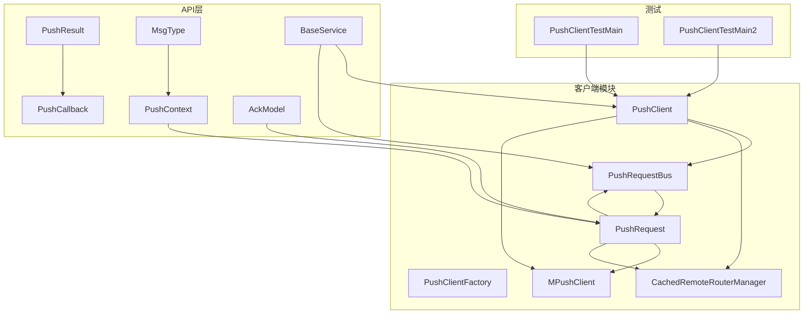
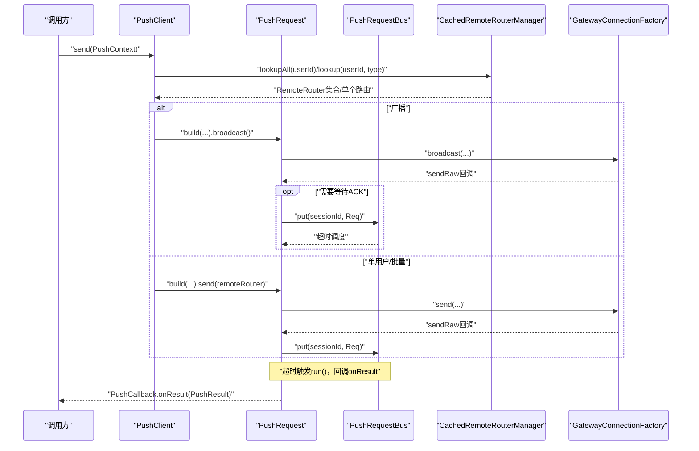
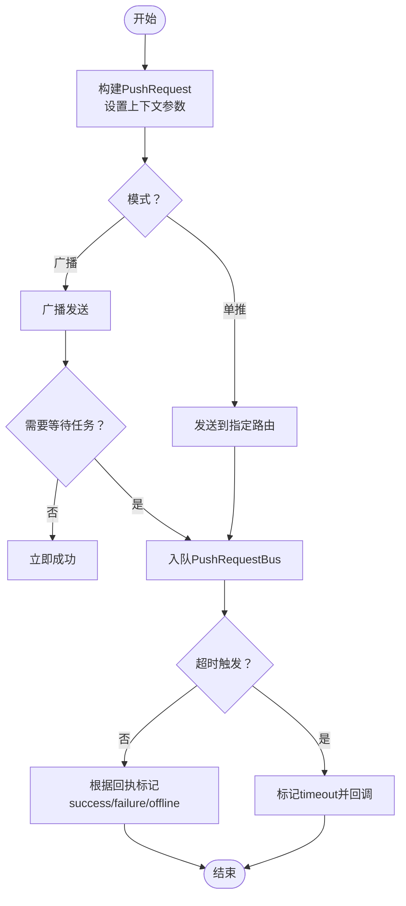
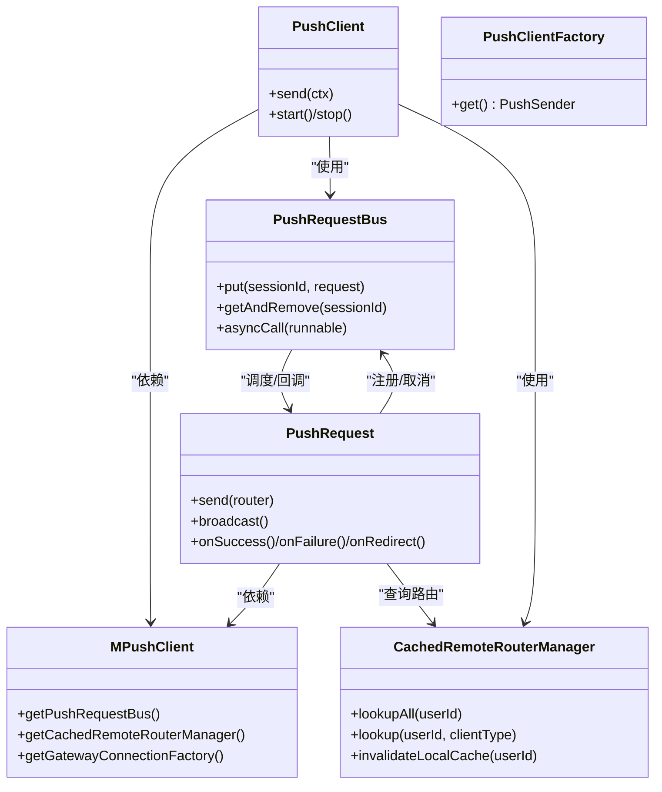

# 推送客户端

<cite>
**本文引用的文件**
- [PushClient.java](file://mpush-client/src/main/java/com/mpush/client/push/PushClient.java)
- [PushClientFactory.java](file://mpush-client/src/main/java/com/mpush/client/push/PushClientFactory.java)
- [PushRequest.java](file://mpush-client/src/main/java/com/mpush/client/push/PushRequest.java)
- [PushRequestBus.java](file://mpush-client/src/main/java/com/mpush/client/push/PushRequestBus.java)
- [MPushClient.java](file://mpush-client/src/main/java/com/mpush/client/MPushClient.java)
- [CachedRemoteRouterManager.java](file://mpush-common/src/main/java/com/mpush/common/router/CachedRemoteRouterManager.java)
- [PushContext.java](file://mpush-api/src/main/java/com/mpush/api/push/PushContext.java)
- [PushCallback.java](file://mpush-api/src/main/java/com/mpush/api/push/PushCallback.java)
- [PushResult.java](file://mpush-api/src/main/java/com/mpush/api/push/PushResult.java)
- [AckModel.java](file://mpush-api/src/main/java/com/mpush/api/push/AckModel.java)
- [MsgType.java](file://mpush-api/src/main/java/com/mpush/api/push/MsgType.java)
- [BaseService.java](file://mpush-api/src/main/java/com/mpush/api/service/BaseService.java)
- [PushClientTestMain.java](file://mpush-test/src/main/java/com/mpush/test/push/PushClientTestMain.java)
- [PushClientTestMain2.java](file://mpush-test/src/main/java/com/mpush/test/push/PushClientTestMain2.java)
</cite>

## 目录
1. [引言](#引言)
2. [项目结构](#项目结构)
3. [核心组件](#核心组件)
4. [架构总览](#架构总览)
5. [详细组件分析](#详细组件分析)
6. [依赖分析](#依赖分析)
7. [性能考量](#性能考量)
8. [故障排查指南](#故障排查指南)
9. [结论](#结论)
10. [附录](#附录)

## 引言
本文件面向MPush推送客户端模块，系统性阐述推送客户端的设计原理与实现机制，覆盖以下关键主题：
- 推送客户端主类PushClient的职责与工作流程
- 工厂类PushClientFactory的单例创建策略
- 推送请求构建器PushRequest及其状态机与回调机制
- 请求总线PushRequestBus的队列管理与超时调度
- 与消息推送中心的交互路径与数据流转
- 单用户、批量、广播等典型使用场景
- 性能优化建议与错误处理最佳实践

## 项目结构
推送客户端位于独立模块中，围绕“上下文构建—请求封装—总线调度—网关投递—结果回调”的链路组织代码。核心文件分布如下：
- 客户端入口与工厂：PushClient、PushClientFactory
- 请求与总线：PushRequest、PushRequestBus
- 上下文与结果模型：PushContext、PushResult、PushCallback、AckModel、MsgType
- 基础服务抽象：BaseService
- 测试示例：PushClientTestMain、PushClientTestMain2

图表来源
- [PushClient.java](file://mpush-client/src/main/java/com/mpush/client/push/PushClient.java#L39-L116)
- [PushClientFactory.java](file://mpush-client/src/main/java/com/mpush/client/push/PushClientFactory.java#L33-L47)
- [PushRequest.java](file://mpush-client/src/main/java/com/mpush/client/push/PushRequest.java#L46-L353)
- [PushRequestBus.java](file://mpush-client/src/main/java/com/mpush/client/push/PushRequestBus.java#L37-L74)
- [MPushClient.java](file://mpush-client/src/main/java/com/mpush/client/MPushClient.java#L38-L106)
- [CachedRemoteRouterManager.java](file://mpush-common/src/main/java/com/mpush/common/router/CachedRemoteRouterManager.java#L33-L73)
- [PushContext.java](file://mpush-api/src/main/java/com/mpush/api/push/PushContext.java#L33-L206)
- [PushResult.java](file://mpush-api/src/main/java/com/mpush/api/push/PushResult.java#L31-L105)
- [PushCallback.java](file://mpush-api/src/main/java/com/mpush/api/push/PushCallback.java#L12-L66)
- [AckModel.java](file://mpush-api/src/main/java/com/mpush/api/push/AckModel.java#L29-L39)
- [MsgType.java](file://mpush-api/src/main/java/com/mpush/api/push/MsgType.java#L3-L23)
- [BaseService.java](file://mpush-api/src/main/java/com/mpush/api/service/BaseService.java#L30-L167)
- [PushClientTestMain.java](file://mpush-test/src/main/java/com/mpush/test/push/PushClientTestMain.java#L37-L77)
- [PushClientTestMain2.java](file://mpush-test/src/main/java/com/mpush/test/push/PushClientTestMain2.java#L38-L139)

章节来源
- [PushClient.java](file://mpush-client/src/main/java/com/mpush/client/push/PushClient.java#L39-L116)
- [PushClientFactory.java](file://mpush-client/src/main/java/com/mpush/client/push/PushClientFactory.java#L33-L47)
- [PushRequest.java](file://mpush-client/src/main/java/com/mpush/client/push/PushRequest.java#L46-L353)
- [PushRequestBus.java](file://mpush-client/src/main/java/com/mpush/client/push/PushRequestBus.java#L37-L74)
- [MPushClient.java](file://mpush-client/src/main/java/com/mpush/client/MPushClient.java#L38-L106)
- [CachedRemoteRouterManager.java](file://mpush-common/src/main/java/com/mpush/common/router/CachedRemoteRouterManager.java#L33-L73)
- [PushContext.java](file://mpush-api/src/main/java/com/mpush/api/push/PushContext.java#L33-L206)
- [PushResult.java](file://mpush-api/src/main/java/com/mpush/api/push/PushResult.java#L31-L105)
- [PushCallback.java](file://mpush-api/src/main/java/com/mpush/api/push/PushCallback.java#L12-L66)
- [AckModel.java](file://mpush-api/src/main/java/com/mpush/api/push/AckModel.java#L29-L39)
- [MsgType.java](file://mpush-api/src/main/java/com/mpush/api/push/MsgType.java#L3-L23)
- [BaseService.java](file://mpush-api/src/main/java/com/mpush/api/service/BaseService.java#L30-L167)
- [PushClientTestMain.java](file://mpush-test/src/main/java/com/mpush/test/push/PushClientTestMain.java#L37-L77)
- [PushClientTestMain2.java](file://mpush-test/src/main/java/com/mpush/test/push/PushClientTestMain2.java#L38-L139)

## 核心组件
- PushClient：推送客户端主类，负责根据PushContext选择单推、批量或广播，并委派给PushRequest构建与发送；同时负责启动/停止各类子服务（服务发现、缓存、请求总线、网关连接）。
- PushClientFactory：基于SPI的工厂类，采用双重检查锁定的懒汉式单例，对外提供PushSender实例。
- PushRequest：请求封装与执行单元，继承FutureTask，内部维护状态机（初始化/成功/失败/离线/超时），负责向网关投递消息、注册到请求总线、处理超时与重定向、触发回调。
- PushRequestBus：请求队列与定时调度器，以sessionId为键存储待完成的PushRequest，按超时时间调度执行，统一异步回调入口。
- MPushClient：客户端上下文容器，聚合线程池、监控、请求总线、路由管理、网关连接工厂等，供PushClient与PushRequest使用。
- CachedRemoteRouterManager：带缓存的远程路由管理器，缓存用户路由集合，支持失效策略，用于定位目标节点。

章节来源
- [PushClient.java](file://mpush-client/src/main/java/com/mpush/client/push/PushClient.java#L39-L116)
- [PushClientFactory.java](file://mpush-client/src/main/java/com/mpush/client/push/PushClientFactory.java#L33-L47)
- [PushRequest.java](file://mpush-client/src/main/java/com/mpush/client/push/PushRequest.java#L46-L353)
- [PushRequestBus.java](file://mpush-client/src/main/java/com/mpush/client/push/PushRequestBus.java#L37-L74)
- [MPushClient.java](file://mpush-client/src/main/java/com/mpush/client/MPushClient.java#L38-L106)
- [CachedRemoteRouterManager.java](file://mpush-common/src/main/java/com/mpush/common/router/CachedRemoteRouterManager.java#L33-L73)

## 架构总览
推送客户端整体交互流程如下：上层通过PushContext构造推送上下文，PushClient根据目标类型分派到PushRequest；PushRequest通过网关连接工厂投递消息，同时注册到PushRequestBus等待结果；网关侧处理完成后回传结果，PushRequestBus触发回调，最终通过PushCallback返回给调用方。

图表来源
- [PushClient.java](file://mpush-client/src/main/java/com/mpush/client/push/PushClient.java#L49-L80)
- [PushRequest.java](file://mpush-client/src/main/java/com/mpush/client/push/PushRequest.java#L71-L118)
- [PushRequest.java](file://mpush-client/src/main/java/com/mpush/client/push/PushRequest.java#L168-L207)
- [PushRequestBus.java](file://mpush-client/src/main/java/com/mpush/client/push/PushRequestBus.java#L47-L58)
- [CachedRemoteRouterManager.java](file://mpush-common/src/main/java/com/mpush/common/router/CachedRemoteRouterManager.java#L40-L61)

## 详细组件分析

### PushClient：推送客户端主类
- 职责
  - 解析PushContext，区分广播、单用户、批量三种场景
  - 对于单用户：查询路由并逐台发送
  - 对于批量：循环对每个用户执行单推
  - 对于广播：直接广播到所有网关
  - 离线处理：当路由为空时，标记离线并返回结果
- 生命周期
  - 启动：初始化MPushClient，启动服务发现、缓存、请求总线、网关连接
  - 停止：依次关闭上述组件
- 关键点
  - 使用FutureTask返回异步结果
  - 通过MPushContext注入MPushClient实例

章节来源
- [PushClient.java](file://mpush-client/src/main/java/com/mpush/client/push/PushClient.java#L39-L116)
- [BaseService.java](file://mpush-api/src/main/java/com/mpush/api/service/BaseService.java#L30-L167)

### PushClientFactory：工厂类与单例
- 设计要点
  - 基于SPI注解，提供PushSender实例
  - 双重检查锁定保证线程安全与延迟初始化
  - 返回PushClient单例，供外部统一调用

章节来源
- [PushClientFactory.java](file://mpush-client/src/main/java/com/mpush/client/push/PushClientFactory.java#L33-L47)

### PushRequest：请求构建与执行
- 数据与状态
  - 字段：ack模型、标签、条件、回调、用户ID、内容、超时、位置、会话ID、任务ID、Future、结果对象
  - 内部状态：init/success/failure/offline/timeout
- 执行流程
  - 单推：解析路由，通过网关连接工厂发送，记录sessionId并入队PushRequestBus
  - 广播：直接广播，若无需等待任务则立即成功，否则同样入队
  - 超时：PushRequestBus调度执行run()，若仍为init则标记timeout并回调
  - 成功/失败：根据网关回执或发送失败标记success/failure
  - 离线：清理本地路由缓存并标记offline
  - 重定向：路由变更时，清理队列与Future，重新拉取路由并重发
- 回调与线程
  - 非超时回调在Netty线程池中异步执行，超时回调在调度线程中直接执行
  - 支持PushCallback接口，默认按结果码分发到onSuccess/onFailure/onOffline/onTimeout

图表来源
- [PushRequest.java](file://mpush-client/src/main/java/com/mpush/client/push/PushRequest.java#L269-L291)
- [PushRequest.java](file://mpush-client/src/main/java/com/mpush/client/push/PushRequest.java#L168-L207)
- [PushRequest.java](file://mpush-client/src/main/java/com/mpush/client/push/PushRequest.java#L214-L227)
- [PushRequest.java](file://mpush-client/src/main/java/com/mpush/client/push/PushRequest.java#L255-L258)

章节来源
- [PushRequest.java](file://mpush-client/src/main/java/com/mpush/client/push/PushRequest.java#L46-L353)

### PushRequestBus：请求队列与超时调度
- 队列管理
  - 以sessionId为键的并发映射，保存未完成的PushRequest
  - 提供入队与移除接口
- 调度机制
  - 使用线程池管理器提供的定时调度器，按超时时间调度run()
  - 异步回调统一走asyncCall，避免阻塞
- 生命周期
  - 启动时获取定时线程池，停止时优雅关闭

章节来源
- [PushRequestBus.java](file://mpush-client/src/main/java/com/mpush/client/push/PushRequestBus.java#L37-L74)

### MPushClient：客户端上下文容器
- 职责
  - 组合线程池、监控、事件总线、请求总线、路由管理、网关连接工厂
  - 作为PushClient与PushRequest的依赖注入源
- 初始化顺序
  - 先创建监控与事件总线，再创建PushRequestBus、CachedRemoteRouterManager、GatewayConnectionFactory

章节来源
- [MPushClient.java](file://mpush-client/src/main/java/com/mpush/client/MPushClient.java#L38-L106)

### CachedRemoteRouterManager：路由缓存与失效
- 缓存策略
  - 基于Guava Cache，按写入/访问过期时间控制
  - 查询时优先命中，未命中则回源查询并写入缓存
- 失效策略
  - 针对特定用户ID进行失效，确保推送一致性

章节来源
- [CachedRemoteRouterManager.java](file://mpush-common/src/main/java/com/mpush/common/router/CachedRemoteRouterManager.java#L33-L73)

### API模型与上下文
- PushContext：构建推送上下文，支持单用户、批量、广播、标签过滤、条件表达式、任务ID、超时与回调
- PushResult：封装结果码、用户ID、时间线、位置信息
- PushCallback：按结果码分发回调，支持自定义onSuccess/onFailure/onOffline/onTimeout
- AckModel：ACK策略枚举（无ACK、自动ACK、业务ACK）
- MsgType：消息类型枚举（通知、消息、通知+消息）

章节来源
- [PushContext.java](file://mpush-api/src/main/java/com/mpush/api/push/PushContext.java#L33-L206)
- [PushResult.java](file://mpush-api/src/main/java/com/mpush/api/push/PushResult.java#L31-L105)
- [PushCallback.java](file://mpush-api/src/main/java/com/mpush/api/push/PushCallback.java#L12-L66)
- [AckModel.java](file://mpush-api/src/main/java/com/mpush/api/push/AckModel.java#L29-L39)
- [MsgType.java](file://mpush-api/src/main/java/com/mpush/api/push/MsgType.java#L3-L23)

## 依赖分析
- 组件耦合
  - PushClient依赖MPushClient提供的路由、总线、网关工厂
  - PushRequest依赖MPushClient与CachedRemoteRouterManager
  - PushRequestBus依赖线程池管理器
- 外部依赖
  - 服务发现、缓存、MQ客户端通过工厂SPI加载
  - 日志、事件总线、JSON序列化等工具类

图表来源
- [PushClient.java](file://mpush-client/src/main/java/com/mpush/client/push/PushClient.java#L39-L116)
- [PushRequest.java](file://mpush-client/src/main/java/com/mpush/client/push/PushRequest.java#L46-L353)
- [PushRequestBus.java](file://mpush-client/src/main/java/com/mpush/client/push/PushRequestBus.java#L37-L74)
- [MPushClient.java](file://mpush-client/src/main/java/com/mpush/client/MPushClient.java#L38-L106)
- [CachedRemoteRouterManager.java](file://mpush-common/src/main/java/com/mpush/common/router/CachedRemoteRouterManager.java#L33-L73)

## 性能考量
- 路由缓存
  - 使用CachedRemoteRouterManager减少远端查询次数，降低延迟与压力
- 超时与队列
  - PushRequestBus以sessionId为键的并发队列，避免锁竞争
  - 超时调度与异步回调分离，避免阻塞主线程
- 广播优化
  - 广播时若无需等待任务，可直接标记成功，减少入队与回调开销
- QPS控制
  - 结合全局流控策略，平滑限速，避免瞬时洪峰
- 内存与对象复用
  - 发送完成后及时释放消息体引用，降低GC压力

## 故障排查指南
- 常见问题与定位
  - 超时：检查PushRequestBus调度是否正常，网络延迟与超时阈值设置
  - 失败：查看网关发送回调中的失败原因，确认连接工厂可用性
  - 离线：确认CachedRemoteRouterManager是否正确失效缓存
  - 路由重定向：关注onRedirect日志，确保重发逻辑生效
- 日志与指标
  - PushRequest内部记录时间线，可用于定位瓶颈
  - PushCallback按结果码统计，便于评估成功率与失败率
- 最佳实践
  - 明确AckModel策略，避免不必要的等待
  - 合理设置超时时间，兼顾实时性与稳定性
  - 使用PushCallback进行结果归因，结合监控指标持续优化

章节来源
- [PushRequest.java](file://mpush-client/src/main/java/com/mpush/client/push/PushRequest.java#L120-L140)
- [PushRequest.java](file://mpush-client/src/main/java/com/mpush/client/push/PushRequest.java#L214-L248)
- [PushClientTestMain.java](file://mpush-test/src/main/java/com/mpush/test/push/PushClientTestMain.java#L37-L77)
- [PushClientTestMain2.java](file://mpush-test/src/main/java/com/mpush/test/push/PushClientTestMain2.java#L38-L139)

## 结论
MPush推送客户端模块以清晰的职责划分与可扩展的工厂模式为基础，通过PushRequest与PushRequestBus实现了高可靠、高性能的推送能力。借助路由缓存、超时调度与异步回调机制，能够满足单用户、批量与广播等多种场景需求。配合完善的API模型与测试示例，开发者可快速集成并稳定运行。

## 附录

### 使用示例与场景
- 单用户推送
  - 构建PushContext，设置userId与消息内容，选择AUTO_ACK或NO_ACK，设置回调
  - 调用sender.send(context)，通过FutureTask或回调获取结果
- 批量推送
  - 在PushContext中设置userIds列表，循环调用单用户推送
- 广播推送
  - 设置broadcast=true，可选tags/condition/taskId，直接广播
- 高并发压测
  - 使用PushClientTestMain2中的统计与流控逻辑，验证系统吞吐与稳定性

章节来源
- [PushClientTestMain.java](file://mpush-test/src/main/java/com/mpush/test/push/PushClientTestMain.java#L37-L77)
- [PushClientTestMain2.java](file://mpush-test/src/main/java/com/mpush/test/push/PushClientTestMain2.java#L38-L139)
- [PushContext.java](file://mpush-api/src/main/java/com/mpush/api/push/PushContext.java#L33-L206)