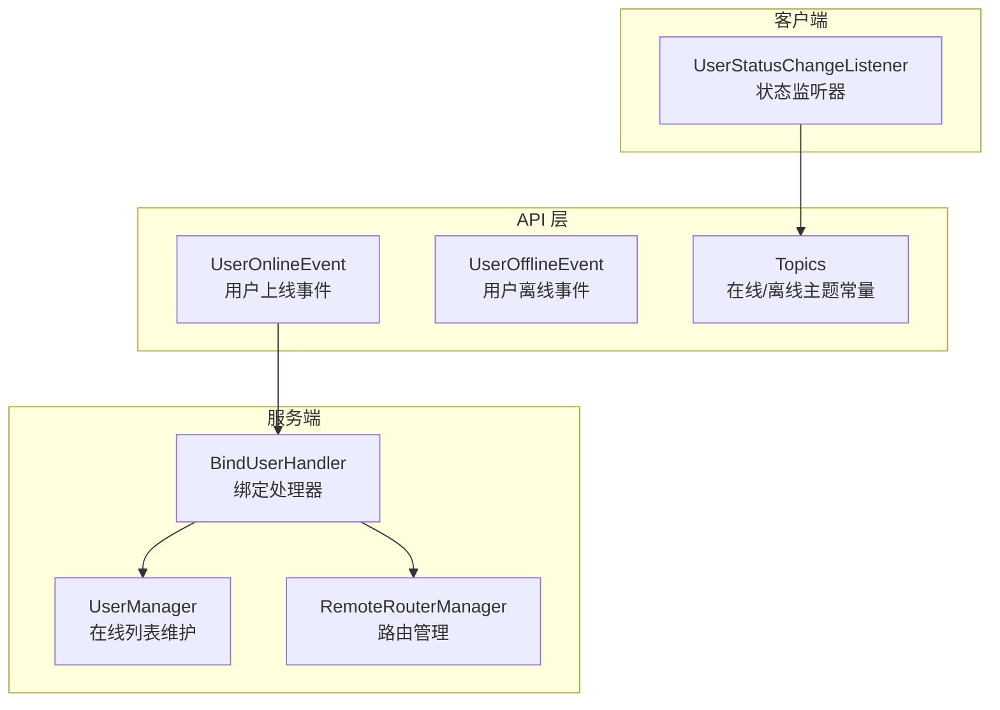
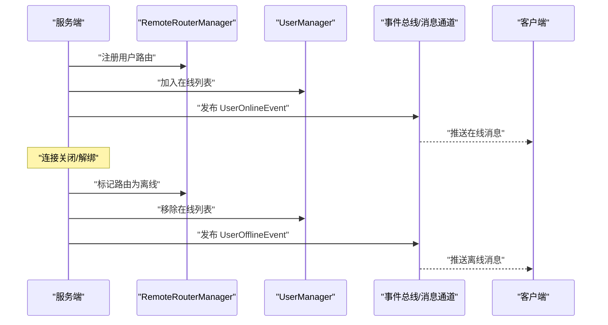
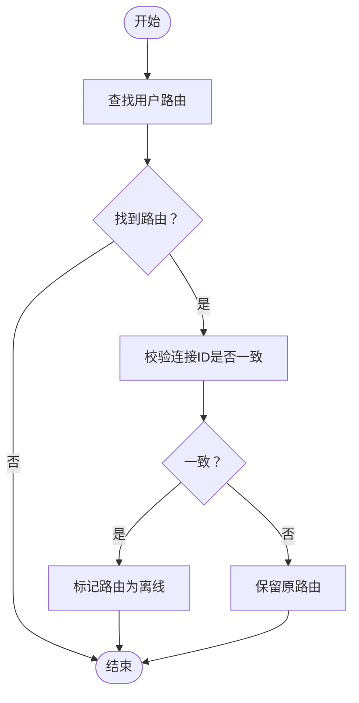
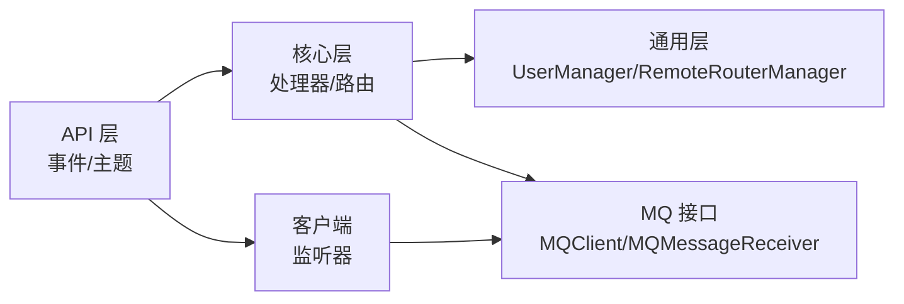

# 用户状态管理

<cite>
**本文引用的文件**
- [UserOnlineEvent.java](file://mpush-api/src/main/java/com/mpush/api/event/UserOnlineEvent.java)
- [UserOfflineEvent.java](file://mpush-api/src/main/java/com/mpush/api/event/UserOfflineEvent.java)
- [Topics.java](file://mpush-api/src/main/java/com/mpush/api/event/Topics.java)
- [UserStatusChangeListener.java](file://mpush-client/src/main/java/com/mpush/client/user/UserStatusChangeListener.java)
- [UserManager.java](file://mpush-common/src/main/java/com/mpush/common/user/UserManager.java)
- [RemoteRouterManager.java](file://mpush-common/src/main/java/com/mpush/common/router/RemoteRouterManager.java)
- [BindUserHandler.java](file://mpush-core/src/main/java/com/mpush/core/handler/BindUserHandler.java)
- [MQClient.java（API 接口）](file://mpush-api/src/main/java/com/mpush/api/spi/common/MQClient.java)
- [MQMessageReceiver.java（API 接口）](file://mpush-api/src/main/java/com/mpush/api/spi/common/MQMessageReceiver.java)
- [MQClient.java（核心实现占位）](file://mpush-core/src/main/java/com/mpush/core/mq/MQClient.java)
- [MQMessageReceiver.java（核心实现）](file://mpush-core/src/main/java/com/mpush/core/mq/MQMessageReceiver.java)
- [BindUserMessage.java](file://mpush-common/src/main/java/com/mpush/common/message/BindUserMessage.java)
</cite>

## 目录
1. [简介](#简介)
2. [项目结构](#项目结构)
3. [核心组件](#核心组件)
4. [架构总览](#架构总览)
5. [详细组件分析](#详细组件分析)
6. [依赖分析](#依赖分析)
7. [性能考量](#性能考量)
8. [故障排查指南](#故障排查指南)
9. [结论](#结论)
10. [附录：使用示例与最佳实践](#附录使用示例与最佳实践)

## 简介
本章节面向 MPush 的“用户状态管理”模块，系统性阐述用户在线/离线状态的监听机制、触发条件、注册与注销流程，以及与消息路由、推送策略、会话管理的协作关系。文档同时给出可直接落地的使用示例路径、常见问题排查方法与性能优化建议，帮助开发者快速理解并正确集成。

## 项目结构
围绕用户状态管理的关键代码分布在以下模块：
- mpush-api：定义事件模型与消息通道常量（事件、Topics）
- mpush-common：用户状态维护与路由管理（UserManager、RemoteRouterManager）
- mpush-core：绑定/解绑处理器，负责在绑定成功后发布在线事件
- mpush-client：客户端侧的状态监听器（订阅在线/离线主题）

图表来源
- [UserOnlineEvent.java](file://mpush-api/src/main/java/com/mpush/api/event/UserOnlineEvent.java#L27-L46)
- [UserOfflineEvent.java](file://mpush-api/src/main/java/com/mpush/api/event/UserOfflineEvent.java#L27-L44)
- [Topics.java](file://mpush-api/src/main/java/com/mpush/api/event/Topics.java#L27-L31)
- [BindUserHandler.java](file://mpush-core/src/main/java/com/mpush/core/handler/BindUserHandler.java#L66-L118)
- [UserManager.java](file://mpush-common/src/main/java/com/mpush/common/user/UserManager.java#L87-L95)
- [RemoteRouterManager.java](file://mpush-common/src/main/java/com/mpush/common/router/RemoteRouterManager.java#L102-L123)
- [UserStatusChangeListener.java](file://mpush-client/src/main/java/com/mpush/client/user/UserStatusChangeListener.java#L42-L45)

章节来源
- [UserOnlineEvent.java](file://mpush-api/src/main/java/com/mpush/api/event/UserOnlineEvent.java#L1-L47)
- [UserOfflineEvent.java](file://mpush-api/src/main/java/com/mpush/api/event/UserOfflineEvent.java#L1-L45)
- [Topics.java](file://mpush-api/src/main/java/com/mpush/api/event/Topics.java#L1-L32)
- [UserStatusChangeListener.java](file://mpush-client/src/main/java/com/mpush/client/user/UserStatusChangeListener.java#L1-L52)
- [UserManager.java](file://mpush-common/src/main/java/com/mpush/common/user/UserManager.java#L1-L116)
- [RemoteRouterManager.java](file://mpush-common/src/main/java/com/mpush/common/router/RemoteRouterManager.java#L1-L125)
- [BindUserHandler.java](file://mpush-core/src/main/java/com/mpush/core/handler/BindUserHandler.java#L1-L184)

## 核心组件
- 事件模型
  - UserOnlineEvent：绑定用户成功后由服务端发布，携带连接与用户标识
  - UserOfflineEvent：连接关闭或解绑等场景触发，携带连接与用户标识
- 主题常量
  - Topics：定义在线/离线主题通道，客户端基于此订阅
- 服务端状态维护
  - UserManager：维护在线用户列表（Redis），提供加入/移除、统计、分页查询
  - RemoteRouterManager：维护用户到连接的路由映射，监听连接关闭事件清理失效路由
- 绑定处理器
  - BindUserHandler：完成绑定后发布在线事件；解绑时清理路由
- 客户端监听器
  - UserStatusChangeListener：订阅在线/离线主题，接收并处理状态变更消息

章节来源
- [UserOnlineEvent.java](file://mpush-api/src/main/java/com/mpush/api/event/UserOnlineEvent.java#L27-L46)
- [UserOfflineEvent.java](file://mpush-api/src/main/java/com/mpush/api/event/UserOfflineEvent.java#L27-L44)
- [Topics.java](file://mpush-api/src/main/java/com/mpush/api/event/Topics.java#L27-L31)
- [UserManager.java](file://mpush-common/src/main/java/com/mpush/common/user/UserManager.java#L87-L114)
- [RemoteRouterManager.java](file://mpush-common/src/main/java/com/mpush/common/router/RemoteRouterManager.java#L102-L123)
- [BindUserHandler.java](file://mpush-core/src/main/java/com/mpush/core/handler/BindUserHandler.java#L66-L118)
- [UserStatusChangeListener.java](file://mpush-client/src/main/java/com/mpush/client/user/UserStatusChangeListener.java#L42-L50)

## 架构总览
用户状态管理以“事件驱动 + 分布式缓存 + 消息通道”的方式实现跨节点的一致性与可扩展性。绑定成功即发布在线事件，离线通过连接关闭事件清理路由并触发离线事件；客户端通过 MQ 订阅主题，实现全局状态感知。

图表来源
- [BindUserHandler.java](file://mpush-core/src/main/java/com/mpush/core/handler/BindUserHandler.java#L99-L107)
- [RemoteRouterManager.java](file://mpush-common/src/main/java/com/mpush/common/router/RemoteRouterManager.java#L102-L123)
- [UserManager.java](file://mpush-common/src/main/java/com/mpush/common/user/UserManager.java#L87-L95)
- [UserOnlineEvent.java](file://mpush-api/src/main/java/com/mpush/api/event/UserOnlineEvent.java#L27-L46)
- [UserOfflineEvent.java](file://mpush-api/src/main/java/com/mpush/api/event/UserOfflineEvent.java#L27-L44)
- [Topics.java](file://mpush-api/src/main/java/com/mpush/api/event/Topics.java#L27-L31)

## 详细组件分析

### 事件模型与触发条件
- UserOnlineEvent
  - 触发时机：绑定用户成功后由处理器发布
  - 字段：连接对象、用户ID
- UserOfflineEvent
  - 触发时机：连接关闭、解绑、超时等导致用户离线
  - 字段：连接对象、用户ID
- 触发链路
  - 绑定成功：处理器注册路由、写入在线列表、发布在线事件
  - 连接关闭：路由管理器清理失效路由、写入离线列表、发布离线事件

章节来源
- [UserOnlineEvent.java](file://mpush-api/src/main/java/com/mpush/api/event/UserOnlineEvent.java#L27-L46)
- [UserOfflineEvent.java](file://mpush-api/src/main/java/com/mpush/api/event/UserOfflineEvent.java#L27-L44)
- [BindUserHandler.java](file://mpush-core/src/main/java/com/mpush/core/handler/BindUserHandler.java#L99-L107)
- [RemoteRouterManager.java](file://mpush-common/src/main/java/com/mpush/common/router/RemoteRouterManager.java#L102-L123)

### 主题与消息通道
- Topics 定义在线/离线主题常量，客户端据此订阅
- 客户端监听器构造函数中订阅这两个主题，用于接收全局状态变更

章节来源
- [Topics.java](file://mpush-api/src/main/java/com/mpush/api/event/Topics.java#L27-L31)
- [UserStatusChangeListener.java](file://mpush-client/src/main/java/com/mpush/client/user/UserStatusChangeListener.java#L42-L45)

### 服务端状态维护与路由管理
- UserManager
  - 在线列表维护：加入/移除、统计、分页查询
  - 踢人：向目标节点发布踢人消息
- RemoteRouterManager
  - 注册/注销路由：哈希存储用户到连接位置
  - 清理失效路由：监听连接关闭事件，校验连接ID一致性后标记离线

图表来源
- [RemoteRouterManager.java](file://mpush-common/src/main/java/com/mpush/common/router/RemoteRouterManager.java#L102-L123)

章节来源
- [UserManager.java](file://mpush-common/src/main/java/com/mpush/common/user/UserManager.java#L60-L81)
- [RemoteRouterManager.java](file://mpush-common/src/main/java/com/mpush/common/router/RemoteRouterManager.java#L69-L78)

### 客户端状态监听器
- 订阅主题：构造时订阅在线/离线主题
- 接收回调：receive(channel, message) 为空实现，需在子类中覆写以处理业务逻辑
- 设计要点：仅需一台机器订阅，避免重复消费

章节来源
- [UserStatusChangeListener.java](file://mpush-client/src/main/java/com/mpush/client/user/UserStatusChangeListener.java#L42-L50)
- [MQMessageReceiver.java（API 接口）](file://mpush-api/src/main/java/com/mpush/api/spi/common/MQMessageReceiver.java#L27-L29)

### 绑定/解绑处理器与状态联动
- 绑定成功：注册路由、设置会话上下文、发布在线事件
- 解绑/失败：清理路由、返回错误、记录日志

章节来源
- [BindUserHandler.java](file://mpush-core/src/main/java/com/mpush/core/handler/BindUserHandler.java#L66-L118)
- [BindUserMessage.java](file://mpush-common/src/main/java/com/mpush/common/message/BindUserMessage.java#L34-L66)

## 依赖分析
- 事件与监听
  - 事件模型位于 API 层，客户端监听器实现位于 mpush-client
  - 监听器通过 MQClientFactory 订阅 Topics 中的主题
- 服务端状态与路由
  - UserManager 与 RemoteRouterManager 位于 mpush-common
  - BindUserHandler 位于 mpush-core，负责在绑定成功后发布在线事件
- MQ 抽象
  - API 层定义 MQClient 与 MQMessageReceiver 接口
  - 核心实现位于 mpush-core 的 MQClient 与 MQMessageReceiver 占位/实现

图表来源
- [UserOnlineEvent.java](file://mpush-api/src/main/java/com/mpush/api/event/UserOnlineEvent.java#L27-L46)
- [UserStatusChangeListener.java](file://mpush-client/src/main/java/com/mpush/client/user/UserStatusChangeListener.java#L42-L45)
- [BindUserHandler.java](file://mpush-core/src/main/java/com/mpush/core/handler/BindUserHandler.java#L99-L107)
- [UserManager.java](file://mpush-common/src/main/java/com/mpush/common/user/UserManager.java#L87-L95)
- [RemoteRouterManager.java](file://mpush-common/src/main/java/com/mpush/common/router/RemoteRouterManager.java#L102-L123)
- [MQClient.java（API 接口）](file://mpush-api/src/main/java/com/mpush/api/spi/common/MQClient.java#L29-L34)
- [MQMessageReceiver.java（API 接口）](file://mpush-api/src/main/java/com/mpush/api/spi/common/MQMessageReceiver.java#L27-L29)
- [MQClient.java（核心实现）](file://mpush-core/src/main/java/com/mpush/core/mq/MQClient.java#L30-L47)
- [MQMessageReceiver.java（核心实现）](file://mpush-core/src/main/java/com/mpush/core/mq/MQMessageReceiver.java#L43-L75)

章节来源
- [MQClient.java（API 接口）](file://mpush-api/src/main/java/com/mpush/api/spi/common/MQClient.java#L29-L34)
- [MQMessageReceiver.java（API 接口）](file://mpush-api/src/main/java/com/mpush/api/spi/common/MQMessageReceiver.java#L27-L29)
- [MQClient.java（核心实现）](file://mpush-core/src/main/java/com/mpush/core/mq/MQClient.java#L30-L47)
- [MQMessageReceiver.java（核心实现）](file://mpush-core/src/main/java/com/mpush/core/mq/MQMessageReceiver.java#L43-L75)

## 性能考量
- 在线列表与路由存储
  - 使用分布式缓存（如 Redis）存储在线列表与路由，避免单点瓶颈
  - 路由更新采用哈希字段定位，支持多客户端类型并行
- 并发与一致性
  - 路由注册/注销为非原子操作，存在极低并发风险；后续可引入脚本保证原子性
  - 连接关闭事件清理路由时进行连接ID校验，避免重连导致的误清
- MQ 订阅
  - 客户端仅需一台机器订阅在线/离线主题，降低重复消费与网络压力
- 日志与可观测性
  - 关键状态变更均输出日志，便于追踪与排障

章节来源
- [RemoteRouterManager.java](file://mpush-common/src/main/java/com/mpush/common/router/RemoteRouterManager.java#L61-L78)
- [RemoteRouterManager.java](file://mpush-common/src/main/java/com/mpush/common/router/RemoteRouterManager.java#L115-L122)
- [UserStatusChangeListener.java](file://mpush-client/src/main/java/com/mpush/client/user/UserStatusChangeListener.java#L41-L45)

## 故障排查指南
- 绑定失败
  - 检查处理器日志与错误响应，确认握手状态与参数合法性
  - 若本地注册成功但远程失败，处理器会回滚本地注册
- 在线列表不一致
  - 核对在线列表键值与公共 IP，确保查询与写入使用同一节点维度
  - 如服务异常退出，可通过路由清理逻辑恢复一致性
- 路由清理异常
  - 确认连接关闭事件是否触发，检查连接ID是否与路由中的连接ID一致
- MQ 订阅未生效
  - 确认客户端监听器已初始化并订阅在线/离线主题
  - 检查 MQ 客户端工厂与消息通道配置

章节来源
- [BindUserHandler.java](file://mpush-core/src/main/java/com/mpush/core/handler/BindUserHandler.java#L109-L118)
- [UserManager.java](file://mpush-common/src/main/java/com/mpush/common/user/UserManager.java#L83-L95)
- [RemoteRouterManager.java](file://mpush-common/src/main/java/com/mpush/common/router/RemoteRouterManager.java#L102-L123)
- [UserStatusChangeListener.java](file://mpush-client/src/main/java/com/mpush/client/user/UserStatusChangeListener.java#L42-L45)

## 结论
MPush 的用户状态管理通过事件与 MQ 实现跨节点一致的状态传播，结合分布式缓存与路由管理，形成高可用、可扩展的在线状态体系。客户端仅需订阅主题即可获得全局状态，服务端在绑定/解绑与连接生命周期内自动维护状态与路由，满足消息路由、推送策略与会话管理等业务需求。

## 附录：使用示例与最佳实践

### 监听器实现与状态处理
- 实现步骤
  - 继承客户端监听器类，在构造函数中完成订阅（参考现有构造逻辑）
  - 覆写消息接收回调，解析主题与消息体，执行业务处理（如刷新本地会话、触发推送策略）
  - 注意幂等性与异常处理，避免重复处理与资源泄漏
- 参考路径
  - [UserStatusChangeListener.java](file://mpush-client/src/main/java/com/mpush/client/user/UserStatusChangeListener.java#L42-L50)
  - [MQMessageReceiver.java（API 接口）](file://mpush-api/src/main/java/com/mpush/api/spi/common/MQMessageReceiver.java#L27-L29)

章节来源
- [UserStatusChangeListener.java](file://mpush-client/src/main/java/com/mpush/client/user/UserStatusChangeListener.java#L42-L50)
- [MQMessageReceiver.java（API 接口）](file://mpush-api/src/main/java/com/mpush/api/spi/common/MQMessageReceiver.java#L27-L29)

### 状态同步机制
- 在线同步
  - 服务端绑定成功后发布在线事件，客户端收到后更新本地状态并建立会话
- 离线同步
  - 连接关闭事件触发路由清理与离线事件发布，客户端收到后释放会话资源
- 参考路径
  - [BindUserHandler.java](file://mpush-core/src/main/java/com/mpush/core/handler/BindUserHandler.java#L99-L107)
  - [RemoteRouterManager.java](file://mpush-common/src/main/java/com/mpush/common/router/RemoteRouterManager.java#L102-L123)

章节来源
- [BindUserHandler.java](file://mpush-core/src/main/java/com/mpush/core/handler/BindUserHandler.java#L99-L107)
- [RemoteRouterManager.java](file://mpush-common/src/main/java/com/mpush/common/router/RemoteRouterManager.java#L102-L123)

### 业务应用场景
- 消息路由
  - 基于用户路由与在线状态，选择最优连接进行消息投递
- 推送策略
  - 根据在线列表与标签过滤，实现精准推送
- 会话管理
  - 离线清理无效会话，避免资源泄露
- 参考路径
  - [UserManager.java](file://mpush-common/src/main/java/com/mpush/common/user/UserManager.java#L87-L114)
  - [RemoteRouterManager.java](file://mpush-common/src/main/java/com/mpush/common/router/RemoteRouterManager.java#L80-L95)

章节来源
- [UserManager.java](file://mpush-common/src/main/java/com/mpush/common/user/UserManager.java#L87-L114)
- [RemoteRouterManager.java](file://mpush-common/src/main/java/com/mpush/common/router/RemoteRouterManager.java#L80-L95)

### 最佳实践
- 客户端
  - 仅在必要节点订阅在线/离线主题，避免重复消费
  - 在回调中进行幂等处理，确保多次到达的消息不会产生副作用
- 服务端
  - 绑定/解绑流程严格校验握手状态与参数
  - 路由清理时进行连接ID一致性校验，防止重连导致的误清
  - 对关键状态变更输出日志，便于问题定位
- MQ
  - 确保 MQ 客户端工厂与消息通道配置正确
  - 对订阅/发布进行异常捕获与重试策略设计

章节来源
- [UserStatusChangeListener.java](file://mpush-client/src/main/java/com/mpush/client/user/UserStatusChangeListener.java#L41-L45)
- [BindUserHandler.java](file://mpush-core/src/main/java/com/mpush/core/handler/BindUserHandler.java#L109-L118)
- [RemoteRouterManager.java](file://mpush-common/src/main/java/com/mpush/common/router/RemoteRouterManager.java#L115-L122)
- [MQClient.java（API 接口）](file://mpush-api/src/main/java/com/mpush/api/spi/common/MQClient.java#L29-L34)