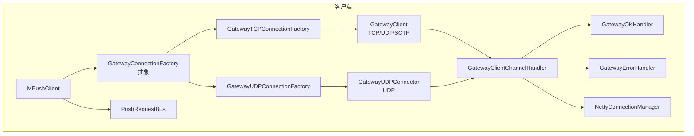
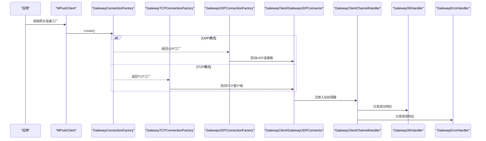
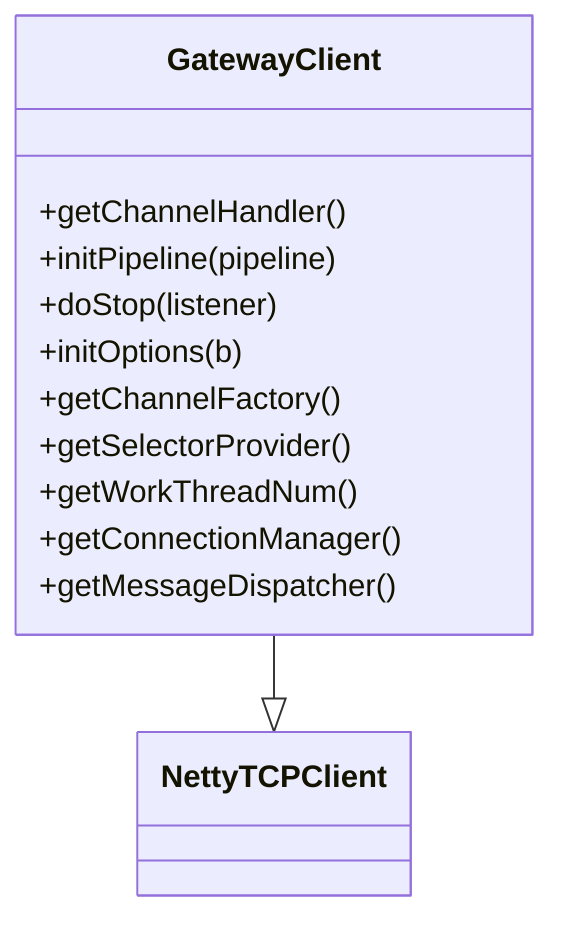
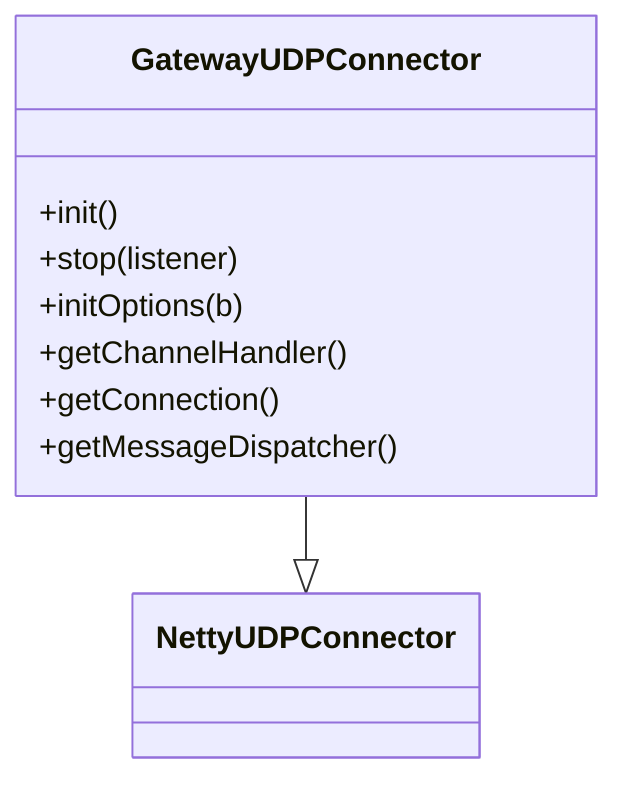
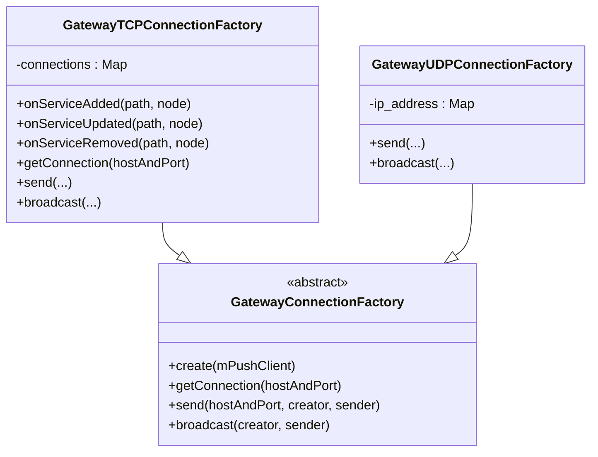
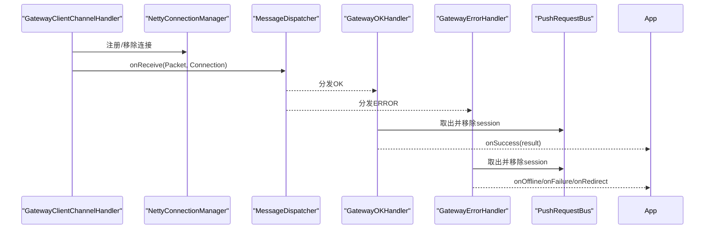
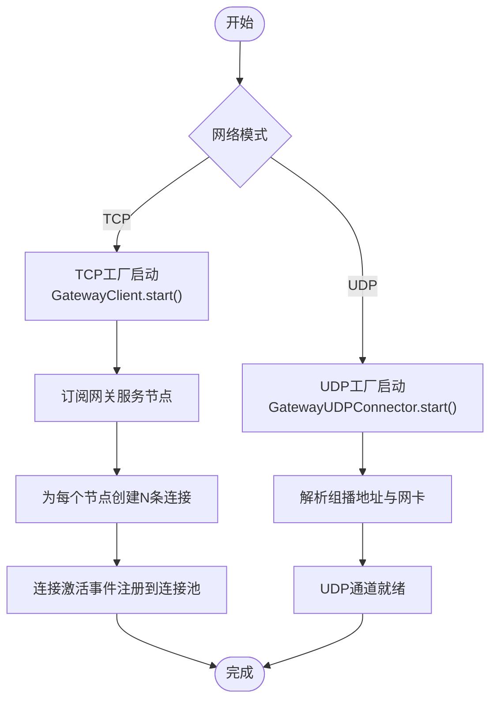
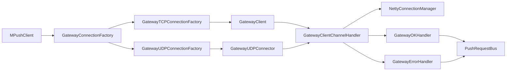

# 网关客户端

<cite>
**本文引用的文件**
- [GatewayClient.java](file://mpush-client/src/main/java/com/mpush/client/gateway/GatewayClient.java)
- [GatewayUDPConnector.java](file://mpush-client/src/main/java/com/mpush/client/gateway/GatewayUDPConnector.java)
- [GatewayConnectionFactory.java](file://mpush-client/src/main/java/com/mpush/client/gateway/connection/GatewayConnectionFactory.java)
- [GatewayTCPConnectionFactory.java](file://mpush-client/src/main/java/com/mpush/client/gateway/connection/GatewayTCPConnectionFactory.java)
- [GatewayUDPConnectionFactory.java](file://mpush-client/src/main/java/com/mpush/client/gateway/connection/GatewayUDPConnectionFactory.java)
- [GatewayClientChannelHandler.java](file://mpush-client/src/main/java/com/mpush/client/gateway/handler/GatewayClientChannelHandler.java)
- [GatewayErrorHandler.java](file://mpush-client/src/main/java/com/mpush/client/gateway/handler/GatewayErrorHandler.java)
- [GatewayOKHandler.java](file://mpush-client/src/main/java/com/mpush/client/gateway/handler/GatewayOKHandler.java)
- [MPushClient.java](file://mpush-client/src/main/java/com/mpush/client/MPushClient.java)
- [Command.java](file://mpush-api/src/main/java/com/mpush/api/protocol/Command.java)
- [Packet.java](file://mpush-api/src/main/java/com/mpush/api/protocol/Packet.java)
- [NettyConnectionManager.java](file://mpush-netty/src/main/java/com/mpush/netty/connection/NettyConnectionManager.java)
- [PushRequestBus.java](file://mpush-client/src/main/java/com/mpush/client/push/PushRequestBus.java)
- [CC.java](file://mpush-tools/src/main/java/com/mpush/tools/config/CC.java)
</cite>

## 目录
1. [简介](#简介)
2. [项目结构](#项目结构)
3. [核心组件](#核心组件)
4. [架构总览](#架构总览)
5. [详细组件分析](#详细组件分析)
6. [依赖关系分析](#依赖关系分析)
7. [性能考量](#性能考量)
8. [故障排查指南](#故障排查指南)
9. [结论](#结论)
10. [附录：使用示例与协议说明](#附录使用示例与协议说明)

## 简介
本文件面向MPush网关客户端模块，系统性阐述其设计原理与实现机制，覆盖以下主题：
- 主客户端类GatewayClient与UDP连接器GatewayUDPConnector
- 连接工厂抽象GatewayConnectionFactory及其TCP/UDP两种实现
- 客户端处理器：GatewayClientChannelHandler、GatewayOKHandler、GatewayErrorHandler
- 网关连接建立流程、TCP与UDP差异及适用场景
- 与服务器的交互协议与数据格式
- 性能优化建议与故障排查

## 项目结构
网关客户端位于mpush-client模块中，主要由以下层次构成：
- 网关客户端入口与连接器：GatewayClient（TCP/UDT/SCTP）、GatewayUDPConnector（UDP）
- 连接工厂：GatewayConnectionFactory抽象、GatewayTCPConnectionFactory、GatewayUDPConnectionFactory
- 处理器：GatewayClientChannelHandler（入站消息分发）、GatewayOKHandler（成功响应）、GatewayErrorHandler（错误响应）
- 上下文与调度：MPushClient、PushRequestBus、NettyConnectionManager、配置CC

图表来源
- [MPushClient.java](file://mpush-client/src/main/java/com/mpush/client/MPushClient.java#L38-L105)
- [GatewayClient.java](file://mpush-client/src/main/java/com/mpush/client/gateway/GatewayClient.java#L54-L134)
- [GatewayUDPConnector.java](file://mpush-client/src/main/java/com/mpush/client/gateway/GatewayUDPConnector.java#L46-L96)
- [GatewayConnectionFactory.java](file://mpush-client/src/main/java/com/mpush/client/gateway/connection/GatewayConnectionFactory.java#L39-L53)
- [GatewayTCPConnectionFactory.java](file://mpush-client/src/main/java/com/mpush/client/gateway/connection/GatewayTCPConnectionFactory.java#L54-L219)
- [GatewayUDPConnectionFactory.java](file://mpush-client/src/main/java/com/mpush/client/gateway/connection/GatewayUDPConnectionFactory.java#L49-L125)
- [GatewayClientChannelHandler.java](file://mpush-client/src/main/java/com/mpush/client/gateway/handler/GatewayClientChannelHandler.java#L44-L87)
- [GatewayOKHandler.java](file://mpush-client/src/main/java/com/mpush/client/gateway/handler/GatewayOKHandler.java#L40-L65)
- [GatewayErrorHandler.java](file://mpush-client/src/main/java/com/mpush/client/gateway/handler/GatewayErrorHandler.java#L41-L74)
- [NettyConnectionManager.java](file://mpush-netty/src/main/java/com/mpush/netty/connection/NettyConnectionManager.java#L35-L68)
- [PushRequestBus.java](file://mpush-client/src/main/java/com/mpush/client/push/PushRequestBus.java#L37-L73)

章节来源
- [GatewayClient.java](file://mpush-client/src/main/java/com/mpush/client/gateway/GatewayClient.java#L54-L134)
- [GatewayUDPConnector.java](file://mpush-client/src/main/java/com/mpush/client/gateway/GatewayUDPConnector.java#L46-L96)
- [GatewayConnectionFactory.java](file://mpush-client/src/main/java/com/mpush/client/gateway/connection/GatewayConnectionFactory.java#L39-L53)
- [GatewayTCPConnectionFactory.java](file://mpush-client/src/main/java/com/mpush/client/gateway/connection/GatewayTCPConnectionFactory.java#L54-L219)
- [GatewayUDPConnectionFactory.java](file://mpush-client/src/main/java/com/mpush/client/gateway/connection/GatewayUDPConnectionFactory.java#L49-L125)
- [GatewayClientChannelHandler.java](file://mpush-client/src/main/java/com/mpush/client/gateway/handler/GatewayClientChannelHandler.java#L44-L87)
- [GatewayOKHandler.java](file://mpush-client/src/main/java/com/mpush/client/gateway/handler/GatewayOKHandler.java#L40-L65)
- [GatewayErrorHandler.java](file://mpush-client/src/main/java/com/mpush/client/gateway/handler/GatewayErrorHandler.java#L41-L74)
- [NettyConnectionManager.java](file://mpush-netty/src/main/java/com/mpush/netty/connection/NettyConnectionManager.java#L35-L68)
- [PushRequestBus.java](file://mpush-client/src/main/java/com/mpush/client/push/PushRequestBus.java#L37-L73)
- [MPushClient.java](file://mpush-client/src/main/java/com/mpush/client/MPushClient.java#L38-L105)

## 核心组件
- GatewayClient：基于Netty的TCP客户端，支持可选的全局流量整形、多通道类型选择（TCP/UDT/SCTP），负责初始化ChannelPipeline、连接管理与消息分发。
- GatewayUDPConnector：基于Netty的UDP连接器，支持组播接收，负责UDP通道初始化、消息分发与连接句柄维护。
- GatewayConnectionFactory抽象：定义统一的连接获取、消息发送与广播接口；根据配置动态选择TCP或UDP实现。
- GatewayTCPConnectionFactory：通过服务发现订阅网关节点，按配置数量为每个节点建立多条TCP连接，维护连接池并处理重连。
- GatewayUDPConnectionFactory：记录网关节点IP映射，封装UDP消息的单播/组播发送。
- GatewayClientChannelHandler：入站消息分发器，负责连接生命周期事件与Packet接收转发。
- GatewayOKHandler/GatewayErrorHandler：针对GATEWAY_PUSH命令的成功/错误响应进行业务回调处理。
- NettyConnectionManager：以ChannelId为键的连接管理器，提供连接注册、查询与清理。
- PushRequestBus：推送请求的会话管理与超时调度，配合处理器完成推送结果回调。

章节来源
- [GatewayClient.java](file://mpush-client/src/main/java/com/mpush/client/gateway/GatewayClient.java#L54-L134)
- [GatewayUDPConnector.java](file://mpush-client/src/main/java/com/mpush/client/gateway/GatewayUDPConnector.java#L46-L96)
- [GatewayConnectionFactory.java](file://mpush-client/src/main/java/com/mpush/client/gateway/connection/GatewayConnectionFactory.java#L39-L53)
- [GatewayTCPConnectionFactory.java](file://mpush-client/src/main/java/com/mpush/client/gateway/connection/GatewayTCPConnectionFactory.java#L54-L219)
- [GatewayUDPConnectionFactory.java](file://mpush-client/src/main/java/com/mpush/client/gateway/connection/GatewayUDPConnectionFactory.java#L49-L125)
- [GatewayClientChannelHandler.java](file://mpush-client/src/main/java/com/mpush/client/gateway/handler/GatewayClientChannelHandler.java#L44-L87)
- [GatewayOKHandler.java](file://mpush-client/src/main/java/com/mpush/client/gateway/handler/GatewayOKHandler.java#L40-L65)
- [GatewayErrorHandler.java](file://mpush-client/src/main/java/com/mpush/client/gateway/handler/GatewayErrorHandler.java#L41-L74)
- [NettyConnectionManager.java](file://mpush-netty/src/main/java/com/mpush/netty/connection/NettyConnectionManager.java#L35-L68)
- [PushRequestBus.java](file://mpush-client/src/main/java/com/mpush/client/push/PushRequestBus.java#L37-L73)

## 架构总览
下图展示从MPushClient到具体连接器与处理器的整体交互：

图表来源
- [MPushClient.java](file://mpush-client/src/main/java/com/mpush/client/MPushClient.java#L57-L57)
- [GatewayConnectionFactory.java](file://mpush-client/src/main/java/com/mpush/client/gateway/connection/GatewayConnectionFactory.java#L43-L45)
- [GatewayTCPConnectionFactory.java](file://mpush-client/src/main/java/com/mpush/client/gateway/connection/GatewayTCPConnectionFactory.java#L67-L77)
- [GatewayUDPConnectionFactory.java](file://mpush-client/src/main/java/com/mpush/client/gateway/connection/GatewayUDPConnectionFactory.java#L64-L69)
- [GatewayClient.java](file://mpush-client/src/main/java/com/mpush/client/gateway/GatewayClient.java#L77-L88)
- [GatewayUDPConnector.java](file://mpush-client/src/main/java/com/mpush/client/gateway/GatewayUDPConnector.java#L58-L66)
- [GatewayClientChannelHandler.java](file://mpush-client/src/main/java/com/mpush/client/gateway/handler/GatewayClientChannelHandler.java#L57-L62)
- [GatewayOKHandler.java](file://mpush-client/src/main/java/com/mpush/client/gateway/handler/GatewayOKHandler.java#L54-L63)
- [GatewayErrorHandler.java](file://mpush-client/src/main/java/com/mpush/client/gateway/handler/GatewayErrorHandler.java#L55-L72)

## 详细组件分析

### GatewayClient：TCP/UDT/SCTP主客户端
- 负责Netty启动、ChannelPipeline初始化、可选流量整形、SO_SNDBUF/SO_RCVBUF设置、工作线程数配置。
- 支持多种传输类型：TCP（默认）、UDT、SCTP，依据配置动态切换。
- 注册消息分发器，将Command.OK/ERROR映射到对应处理器。

图表来源
- [GatewayClient.java](file://mpush-client/src/main/java/com/mpush/client/gateway/GatewayClient.java#L54-L134)

章节来源
- [GatewayClient.java](file://mpush-client/src/main/java/com/mpush/client/gateway/GatewayClient.java#L77-L125)

### GatewayUDPConnector：UDP连接器
- 初始化UDP通道，注册消息分发器，设置组播参数（环回、TTL）与缓冲区大小。
- 提供UDPChannelHandler用于接收与分发消息，并暴露当前连接句柄。

图表来源
- [GatewayUDPConnector.java](file://mpush-client/src/main/java/com/mpush/client/gateway/GatewayUDPConnector.java#L46-L96)

章节来源
- [GatewayUDPConnector.java](file://mpush-client/src/main/java/com/mpush/client/gateway/GatewayUDPConnector.java#L58-L95)

### 连接工厂抽象与实现
- GatewayConnectionFactory：定义抽象方法，按配置创建TCP或UDP工厂实例。
- GatewayTCPConnectionFactory：通过服务发现订阅网关节点，为每个节点按配置数量建立连接，维护连接列表，处理断线重连与广播。
- GatewayUDPConnectionFactory：维护网关节点IP映射，支持单播/组播消息发送。

图表来源
- [GatewayConnectionFactory.java](file://mpush-client/src/main/java/com/mpush/client/gateway/connection/GatewayConnectionFactory.java#L39-L53)
- [GatewayTCPConnectionFactory.java](file://mpush-client/src/main/java/com/mpush/client/gateway/connection/GatewayTCPConnectionFactory.java#L54-L219)
- [GatewayUDPConnectionFactory.java](file://mpush-client/src/main/java/com/mpush/client/gateway/connection/GatewayUDPConnectionFactory.java#L49-L125)

章节来源
- [GatewayConnectionFactory.java](file://mpush-client/src/main/java/com/mpush/client/gateway/connection/GatewayConnectionFactory.java#L43-L45)
- [GatewayTCPConnectionFactory.java](file://mpush-client/src/main/java/com/mpush/client/gateway/connection/GatewayTCPConnectionFactory.java#L67-L103)
- [GatewayUDPConnectionFactory.java](file://mpush-client/src/main/java/com/mpush/client/gateway/connection/GatewayUDPConnectionFactory.java#L63-L95)

### 客户端处理器
- GatewayClientChannelHandler：在channelActive时创建NettyConnection并注册到ConnectionManager，发布连接事件；在channelRead时将Packet交由MessageDispatcher分发；异常时关闭通道并发布断开事件。
- GatewayOKHandler：解析Command.GATEWAY_PUSH的OK响应，从PushRequestBus取出对应请求并回调成功，数据体作为推送结果JSON解析。
- GatewayErrorHandler：解析Command.GATEWAY_PUSH的ERROR响应，区分离线、客户端失败、路由变更等场景并回调相应处理。

图表来源
- [GatewayClientChannelHandler.java](file://mpush-client/src/main/java/com/mpush/client/gateway/handler/GatewayClientChannelHandler.java#L57-L86)
- [NettyConnectionManager.java](file://mpush-netty/src/main/java/com/mpush/netty/connection/NettyConnectionManager.java#L35-L68)
- [GatewayOKHandler.java](file://mpush-client/src/main/java/com/mpush/client/gateway/handler/GatewayOKHandler.java#L48-L63)
- [GatewayErrorHandler.java](file://mpush-client/src/main/java/com/mpush/client/gateway/handler/GatewayErrorHandler.java#L49-L72)
- [PushRequestBus.java](file://mpush-client/src/main/java/com/mpush/client/push/PushRequestBus.java#L47-L58)

章节来源
- [GatewayClientChannelHandler.java](file://mpush-client/src/main/java/com/mpush/client/gateway/handler/GatewayClientChannelHandler.java#L57-L86)
- [GatewayOKHandler.java](file://mpush-client/src/main/java/com/mpush/client/gateway/handler/GatewayOKHandler.java#L54-L63)
- [GatewayErrorHandler.java](file://mpush-client/src/main/java/com/mpush/client/gateway/handler/GatewayErrorHandler.java#L55-L72)

### TCP与UDP连接建立流程对比
- TCP：通过GatewayTCPConnectionFactory订阅服务节点，为每个节点按配置数量创建连接；连接成功后写入host:port属性，加入连接池；断线自动重连。
- UDP：通过GatewayUDPConnector启动UDP通道，设置组播地址与网络接口；通过ServiceDiscovery维护目标网关IP映射，支持单播/组播发送。

图表来源
- [GatewayTCPConnectionFactory.java](file://mpush-client/src/main/java/com/mpush/client/gateway/connection/GatewayTCPConnectionFactory.java#L67-L103)
- [GatewayUDPConnectionFactory.java](file://mpush-client/src/main/java/com/mpush/client/gateway/connection/GatewayUDPConnectionFactory.java#L63-L89)
- [GatewayUDPConnector.java](file://mpush-client/src/main/java/com/mpush/client/gateway/GatewayUDPConnector.java#L58-L66)

章节来源
- [GatewayTCPConnectionFactory.java](file://mpush-client/src/main/java/com/mpush/client/gateway/connection/GatewayTCPConnectionFactory.java#L176-L197)
- [GatewayUDPConnectionFactory.java](file://mpush-client/src/main/java/com/mpush/client/gateway/connection/GatewayUDPConnectionFactory.java#L87-L89)

### 协议与数据格式
- 命令枚举：Command包含心跳、握手、登录、登出、绑定、推送、网关推送等命令。
- 数据包格式：Packet采用固定头+可变体结构，包含长度、命令、校验码、标志位、会话ID、LRC校验与消息体；支持加密、压缩、业务ACK等标志位。
- 入站解码：PacketDecoder读取头部字段与消息体；出站编码：PacketEncoder按协议序列化。
- 推送响应：OK/ERROR消息携带Command.GATEWAY_PUSH与会话ID，处理器据此匹配PushRequest并回调。

章节来源
- [Command.java](file://mpush-api/src/main/java/com/mpush/api/protocol/Command.java#L27-L52)
- [Packet.java](file://mpush-api/src/main/java/com/mpush/api/protocol/Packet.java#L35-L186)

## 依赖关系分析
- 组件耦合
  - MPushClient聚合GatewayConnectionFactory，GatewayConnectionFactory按配置选择TCP/UDP实现。
  - GatewayClient/GatewayUDPConnector分别持有各自的ChannelHandler与MessageDispatcher。
  - GatewayClientChannelHandler依赖NettyConnectionManager与MessageDispatcher。
  - GatewayOKHandler/GatewayErrorHandler依赖PushRequestBus与Command枚举。
- 外部依赖
  - Netty（TCP/UDP/Udt/Sctp）、服务发现（ZK）、配置中心（CC）。

图表来源
- [MPushClient.java](file://mpush-client/src/main/java/com/mpush/client/MPushClient.java#L57-L57)
- [GatewayConnectionFactory.java](file://mpush-client/src/main/java/com/mpush/client/gateway/connection/GatewayConnectionFactory.java#L43-L45)
- [GatewayTCPConnectionFactory.java](file://mpush-client/src/main/java/com/mpush/client/gateway/connection/GatewayTCPConnectionFactory.java#L67-L72)
- [GatewayUDPConnectionFactory.java](file://mpush-client/src/main/java/com/mpush/client/gateway/connection/GatewayUDPConnectionFactory.java#L59-L65)
- [GatewayClient.java](file://mpush-client/src/main/java/com/mpush/client/gateway/GatewayClient.java#L61-L66)
- [GatewayUDPConnector.java](file://mpush-client/src/main/java/com/mpush/client/gateway/GatewayUDPConnector.java#L52-L56)
- [GatewayClientChannelHandler.java](file://mpush-client/src/main/java/com/mpush/client/gateway/handler/GatewayClientChannelHandler.java#L52-L55)
- [NettyConnectionManager.java](file://mpush-netty/src/main/java/com/mpush/netty/connection/NettyConnectionManager.java#L35-L51)
- [GatewayOKHandler.java](file://mpush-client/src/main/java/com/mpush/client/gateway/handler/GatewayOKHandler.java#L45-L46)
- [GatewayErrorHandler.java](file://mpush-client/src/main/java/com/mpush/client/gateway/handler/GatewayErrorHandler.java#L45-L46)
- [PushRequestBus.java](file://mpush-client/src/main/java/com/mpush/client/push/PushRequestBus.java#L43-L44)

章节来源
- [MPushClient.java](file://mpush-client/src/main/java/com/mpush/client/MPushClient.java#L57-L57)
- [GatewayTCPConnectionFactory.java](file://mpush-client/src/main/java/com/mpush/client/gateway/connection/GatewayTCPConnectionFactory.java#L67-L72)
- [GatewayUDPConnectionFactory.java](file://mpush-client/src/main/java/com/mpush/client/gateway/connection/GatewayUDPConnectionFactory.java#L59-L65)

## 性能考量
- 流量整形：GatewayClient可启用GlobalChannelTrafficShapingHandler，按全局/通道维度限制读写速率，避免突发流量影响稳定性。
- 缓冲区优化：通过配置项设置SO_SNDBUF/SO_RCVBUF，提升吞吐与降低丢包。
- 工作线程：根据配置设置工作线程数，平衡CPU与IO。
- 连接复用：TCP工厂为每个网关节点维护多连接，提高可用性与并发度；UDP工厂通过组播减少广播风暴。
- 调度与超时：PushRequestBus使用定时调度器管理请求超时，避免内存泄漏。

章节来源
- [GatewayClient.java](file://mpush-client/src/main/java/com/mpush/client/gateway/GatewayClient.java#L67-L75)
- [GatewayClient.java](file://mpush-client/src/main/java/com/mpush/client/gateway/GatewayClient.java#L100-L104)
- [GatewayClient.java](file://mpush-client/src/main/java/com/mpush/client/gateway/GatewayClient.java#L122-L125)
- [GatewayUDPConnector.java](file://mpush-client/src/main/java/com/mpush/client/gateway/GatewayUDPConnector.java#L76-L82)
- [PushRequestBus.java](file://mpush-client/src/main/java/com/mpush/client/push/PushRequestBus.java#L61-L72)
- [CC.java](file://mpush-tools/src/main/java/com/mpush/tools/config/CC.java#L111-L129)
- [CC.java](file://mpush-tools/src/main/java/com/mpush/tools/config/CC.java#L141-L153)
- [CC.java](file://mpush-tools/src/main/java/com/mpush/tools/config/CC.java#L163-L180)

## 故障排查指南
- 连接问题
  - TCP：检查服务发现是否正确订阅网关节点；确认每个节点已创建指定数量连接；关注断线重连日志。
  - UDP：确认组播地址、TTL与网络接口配置正确；验证目标网关IP映射是否存在。
- 消息处理
  - 成功/错误响应未回调：检查MessageDispatcher是否注册了OK/ERROR处理器；确认Command.GATEWAY_PUSH匹配。
  - 请求超时：PushRequestBus定时器是否正常；请求会话ID是否与响应一致。
- 性能问题
  - 吞吐不足：调整SO_SNDBUF/SO_RCVBUF与工作线程数；评估是否启用流量整形。
  - 抖动/丢包：检查网络质量与组播配置；必要时切换为TCP模式。

章节来源
- [GatewayTCPConnectionFactory.java](file://mpush-client/src/main/java/com/mpush/client/gateway/connection/GatewayTCPConnectionFactory.java#L97-L103)
- [GatewayUDPConnectionFactory.java](file://mpush-client/src/main/java/com/mpush/client/gateway/connection/GatewayUDPConnectionFactory.java#L92-L95)
- [GatewayClientChannelHandler.java](file://mpush-client/src/main/java/com/mpush/client/gateway/handler/GatewayClientChannelHandler.java#L65-L70)
- [GatewayOKHandler.java](file://mpush-client/src/main/java/com/mpush/client/gateway/handler/GatewayOKHandler.java#L54-L63)
- [GatewayErrorHandler.java](file://mpush-client/src/main/java/com/mpush/client/gateway/handler/GatewayErrorHandler.java#L55-L72)
- [PushRequestBus.java](file://mpush-client/src/main/java/com/mpush/client/push/PushRequestBus.java#L47-L58)

## 结论
MPush网关客户端通过抽象的连接工厂与统一的消息分发机制，实现了对TCP/UDP等多种传输方式的支持。GatewayClient与GatewayUDPConnector分别承担长连接与短连接场景下的消息收发职责；GatewayClientChannelHandler负责连接生命周期与消息分发；GatewayOKHandler与GatewayErrorHandler完成推送结果的业务回调。结合配置化的网络参数与流量整形策略，可在不同网络环境下获得稳定且高性能的推送能力。

## 附录：使用示例与协议说明
- 使用步骤（概念性流程）
  - 初始化MPushClient并启动
  - 通过GatewayConnectionFactory获取连接工厂
  - TCP模式：GatewayTCPConnectionFactory为每个网关节点创建多连接
  - UDP模式：GatewayUDPConnector启动UDP通道并设置组播
  - 发送消息：构造消息体并通过工厂send/broadcast发送
  - 处理响应：GatewayOKHandler/GatewayErrorHandler回调PushRequest
- 协议要点
  - Command.GATEWAY_PUSH用于推送请求；OK/ERROR响应携带会话ID与结果数据
  - Packet头包含长度、命令、标志位、会话ID与LRC校验，确保可靠性

章节来源
- [MPushClient.java](file://mpush-client/src/main/java/com/mpush/client/MPushClient.java#L57-L57)
- [GatewayTCPConnectionFactory.java](file://mpush-client/src/main/java/com/mpush/client/gateway/connection/GatewayTCPConnectionFactory.java#L140-L158)
- [GatewayUDPConnectionFactory.java](file://mpush-client/src/main/java/com/mpush/client/gateway/connection/GatewayUDPConnectionFactory.java#L104-L120)
- [GatewayOKHandler.java](file://mpush-client/src/main/java/com/mpush/client/gateway/handler/GatewayOKHandler.java#L54-L63)
- [GatewayErrorHandler.java](file://mpush-client/src/main/java/com/mpush/client/gateway/handler/GatewayErrorHandler.java#L55-L72)
- [Command.java](file://mpush-api/src/main/java/com/mpush/api/protocol/Command.java#L42-L43)
- [Packet.java](file://mpush-api/src/main/java/com/mpush/api/protocol/Packet.java#L35-L186)