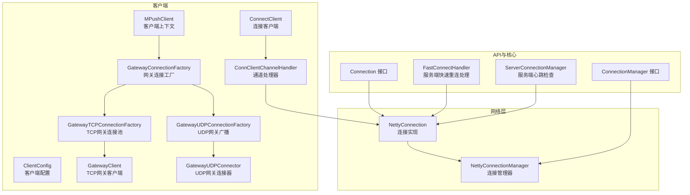
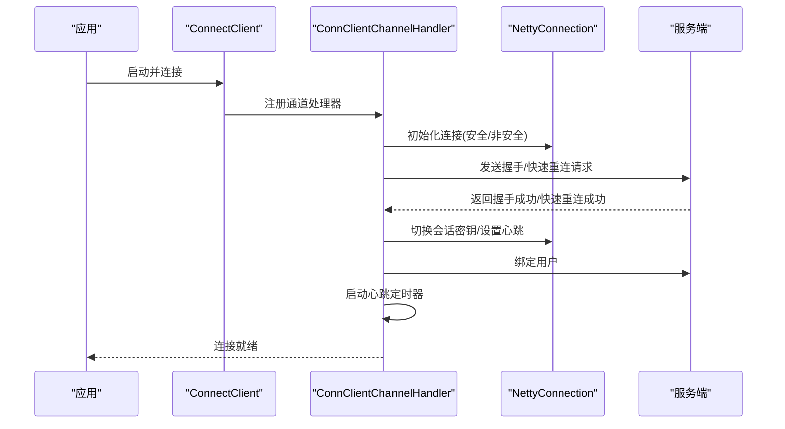
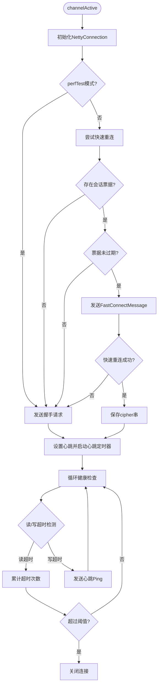
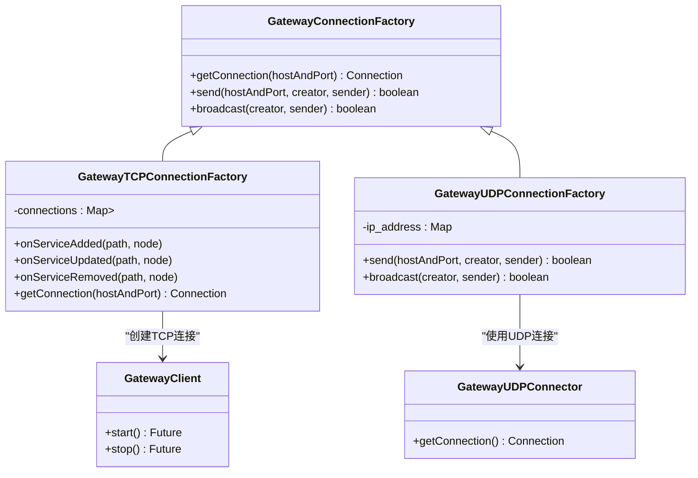
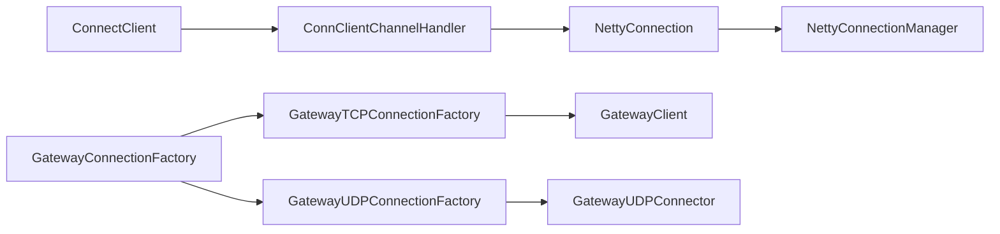

# 连接管理

<cite>
**本文引用的文件**
- [ClientConfig.java](file://mpush-client/src/main/java/com/mpush/client/connect/ClientConfig.java)
- [ConnClientChannelHandler.java](file://mpush-client/src/main/java/com/mpush/client/connect/ConnClientChannelHandler.java)
- [ConnectClient.java](file://mpush-client/src/main/java/com/mpush/client/connect/ConnectClient.java)
- [Connection.java](file://mpush-api/src/main/java/com/mpush/api/connection/Connection.java)
- [ConnectionManager.java](file://mpush-api/src/main/java/com/mpush/api/connection/ConnectionManager.java)
- [NettyConnection.java](file://mpush-netty/src/main/java/com/mpush/netty/connection/NettyConnection.java)
- [NettyConnectionManager.java](file://mpush-netty/src/main/java/com/mpush/netty/connection/NettyConnectionManager.java)
- [GatewayConnectionFactory.java](file://mpush-client/src/main/java/com/mpush/client/gateway/connection/GatewayConnectionFactory.java)
- [GatewayTCPConnectionFactory.java](file://mpush-client/src/main/java/com/mpush/client/gateway/connection/GatewayTCPConnectionFactory.java)
- [GatewayUDPConnectionFactory.java](file://mpush-client/src/main/java/com/mpush/client/gateway/connection/GatewayUDPConnectionFactory.java)
- [GatewayClient.java](file://mpush-client/src/main/java/com/mpush/client/gateway/GatewayClient.java)
- [GatewayUDPConnector.java](file://mpush-client/src/main/java/com/mpush/client/gateway/GatewayUDPConnector.java)
- [MPushClient.java](file://mpush-client/src/main/java/com/mpush/client/MPushClient.java)
- [FastConnectHandler.java](file://mpush-core/src/main/java/com/mpush/core/handler/FastConnectHandler.java)
- [ServerConnectionManager.java](file://mpush-core/src/main/java/com/mpush/core/server/ServerConnectionManager.java)
</cite>

## 目录
1. [引言](#引言)
2. [项目结构](#项目结构)
3. [核心组件](#核心组件)
4. [架构总览](#架构总览)
5. [详细组件分析](#详细组件分析)
6. [依赖关系分析](#依赖关系分析)
7. [性能考量](#性能考量)
8. [故障排查指南](#故障排查指南)
9. [结论](#结论)
10. [附录：配置与最佳实践](#附录配置与最佳实践)

## 引言
本文件聚焦于MPush客户端侧的“连接管理”模块，系统性解析以下关键点：
- ClientConfig配置类的设计与用途
- ConnClientChannelHandler通道处理器在连接生命周期中的作用
- ConnectClient连接客户端的封装与事件集成
- 连接建立流程、状态管理、心跳与健康检查
- 快速重连与会话复用（基于缓存）
- 网关连接工厂（TCP/UDP）与连接池/连接复用策略
- 超时、重试、心跳间隔等配置项的含义与调优建议
- 最佳实践：连接复用、资源清理、异常处理

## 项目结构
客户端连接管理主要分布在以下模块：
- mpush-client：连接客户端与网关连接工厂
- mpush-netty：Netty连接与连接管理器实现
- mpush-api：连接接口与事件契约
- mpush-core：服务端侧心跳与会话复用逻辑（用于对比理解）

图表来源
- [ConnectClient.java](file://mpush-client/src/main/java/com/mpush/client/connect/ConnectClient.java#L28-L50)
- [ConnClientChannelHandler.java](file://mpush-client/src/main/java/com/mpush/client/connect/ConnClientChannelHandler.java#L54-L303)
- [ClientConfig.java](file://mpush-client/src/main/java/com/mpush/client/connect/ClientConfig.java#L23-L106)
- [GatewayConnectionFactory.java](file://mpush-client/src/main/java/com/mpush/client/gateway/connection/GatewayConnectionFactory.java#L39-L53)
- [GatewayTCPConnectionFactory.java](file://mpush-client/src/main/java/com/mpush/client/gateway/connection/GatewayTCPConnectionFactory.java#L54-L220)
- [GatewayUDPConnectionFactory.java](file://mpush-client/src/main/java/com/mpush/client/gateway/connection/GatewayUDPConnectionFactory.java#L49-L126)
- [GatewayClient.java](file://mpush-client/src/main/java/com/mpush/client/gateway/GatewayClient.java#L54-L135)
- [GatewayUDPConnector.java](file://mpush-client/src/main/java/com/mpush/client/gateway/GatewayUDPConnector.java#L46-L97)
- [NettyConnection.java](file://mpush-netty/src/main/java/com/mpush/netty/connection/NettyConnection.java#L38-L179)
- [NettyConnectionManager.java](file://mpush-netty/src/main/java/com/mpush/netty/connection/NettyConnectionManager.java#L35-L69)
- [Connection.java](file://mpush-api/src/main/java/com/mpush/api/connection/Connection.java#L32-L63)
- [ConnectionManager.java](file://mpush-api/src/main/java/com/mpush/api/connection/ConnectionManager.java#L31-L44)
- [FastConnectHandler.java](file://mpush-core/src/main/java/com/mpush/core/handler/FastConnectHandler.java#L44-L66)
- [ServerConnectionManager.java](file://mpush-core/src/main/java/com/mpush/core/server/ServerConnectionManager.java#L137-L197)

章节来源
- [ConnectClient.java](file://mpush-client/src/main/java/com/mpush/client/connect/ConnectClient.java#L28-L50)
- [ConnClientChannelHandler.java](file://mpush-client/src/main/java/com/mpush/client/connect/ConnClientChannelHandler.java#L54-L303)
- [ClientConfig.java](file://mpush-client/src/main/java/com/mpush/client/connect/ClientConfig.java#L23-L106)
- [NettyConnection.java](file://mpush-netty/src/main/java/com/mpush/netty/connection/NettyConnection.java#L38-L179)
- [NettyConnectionManager.java](file://mpush-netty/src/main/java/com/mpush/netty/connection/NettyConnectionManager.java#L35-L69)
- [Connection.java](file://mpush-api/src/main/java/com/mpush/api/connection/Connection.java#L32-L63)
- [ConnectionManager.java](file://mpush-api/src/main/java/com/mpush/api/connection/ConnectionManager.java#L31-L44)
- [GatewayConnectionFactory.java](file://mpush-client/src/main/java/com/mpush/client/gateway/connection/GatewayConnectionFactory.java#L39-L53)
- [GatewayTCPConnectionFactory.java](file://mpush-client/src/main/java/com/mpush/client/gateway/connection/GatewayTCPConnectionFactory.java#L54-L220)
- [GatewayUDPConnectionFactory.java](file://mpush-client/src/main/java/com/mpush/client/gateway/connection/GatewayUDPConnectionFactory.java#L49-L126)
- [GatewayClient.java](file://mpush-client/src/main/java/com/mpush/client/gateway/GatewayClient.java#L54-L135)
- [GatewayUDPConnector.java](file://mpush-client/src/main/java/com/mpush/client/gateway/GatewayUDPConnector.java#L46-L97)
- [MPushClient.java](file://mpush-client/src/main/java/com/mpush/client/MPushClient.java#L38-L106)
- [FastConnectHandler.java](file://mpush-core/src/main/java/com/mpush/core/handler/FastConnectHandler.java#L44-L66)
- [ServerConnectionManager.java](file://mpush-core/src/main/java/com/mpush/core/server/ServerConnectionManager.java#L137-L197)

## 核心组件
- ClientConfig：封装客户端密钥、初始化向量、设备信息、用户标识、快速重连加密串等，作为握手与快速重连的关键输入。
- ConnClientChannelHandler：负责连接建立后的握手/快速重连、绑定用户、心跳启动、推送接收与ACK、错误与被踢处理。
- ConnectClient：继承自NettyTCPClient，注入ConnClientChannelHandler，并订阅连接关闭事件以触发停止。
- Connection/NettyConnection：抽象连接接口与Netty实现，提供发送、读写超时检测、会话上下文、状态管理。
- ConnectionManager/NettyConnectionManager：维护ChannelId到Connection的映射，支持添加、移除、统计连接数。
- 网关连接工厂：GatewayConnectionFactory及其TCP/UDP实现，负责根据服务发现结果创建/复用连接，支持广播与单播。

章节来源
- [ClientConfig.java](file://mpush-client/src/main/java/com/mpush/client/connect/ClientConfig.java#L23-L106)
- [ConnClientChannelHandler.java](file://mpush-client/src/main/java/com/mpush/client/connect/ConnClientChannelHandler.java#L54-L303)
- [ConnectClient.java](file://mpush-client/src/main/java/com/mpush/client/connect/ConnectClient.java#L28-L50)
- [Connection.java](file://mpush-api/src/main/java/com/mpush/api/connection/Connection.java#L32-L63)
- [NettyConnection.java](file://mpush-netty/src/main/java/com/mpush/netty/connection/NettyConnection.java#L38-L179)
- [ConnectionManager.java](file://mpush-api/src/main/java/com/mpush/api/connection/ConnectionManager.java#L31-L44)
- [NettyConnectionManager.java](file://mpush-netty/src/main/java/com/mpush/netty/connection/NettyConnectionManager.java#L35-L69)
- [GatewayConnectionFactory.java](file://mpush-client/src/main/java/com/mpush/client/gateway/connection/GatewayConnectionFactory.java#L39-L53)
- [GatewayTCPConnectionFactory.java](file://mpush-client/src/main/java/com/mpush/client/gateway/connection/GatewayTCPConnectionFactory.java#L54-L220)
- [GatewayUDPConnectionFactory.java](file://mpush-client/src/main/java/com/mpush/client/gateway/connection/GatewayUDPConnectionFactory.java#L49-L126)

## 架构总览
客户端连接管理采用“客户端-通道处理器-网络层”的分层设计：
- 客户端通过ConnectClient发起连接，通道处理器在channelActive时进行握手或快速重连。
- NettyConnection封装底层Channel与会话上下文，提供超时检测与发送能力。
- 网关连接工厂根据服务发现动态维护多路连接，支持TCP连接池与UDP广播。

图表来源
- [ConnectClient.java](file://mpush-client/src/main/java/com/mpush/client/connect/ConnectClient.java#L28-L50)
- [ConnClientChannelHandler.java](file://mpush-client/src/main/java/com/mpush/client/connect/ConnClientChannelHandler.java#L164-L184)
- [NettyConnection.java](file://mpush-netty/src/main/java/com/mpush/netty/connection/NettyConnection.java#L47-L55)
- [FastConnectHandler.java](file://mpush-core/src/main/java/com/mpush/core/handler/FastConnectHandler.java#L44-L66)

## 详细组件分析

### ClientConfig 配置类
- 职责：承载客户端侧的密钥材料、设备与用户标识、快速重连加密串等。
- 关键字段：clientKey、iv、clientVersion、deviceId、osName、osVersion、userId、cipher。
- 使用场景：握手时携带设备与版本信息；快速重连时携带cipher串；保存会话票据以便下次快速连接。

章节来源
- [ClientConfig.java](file://mpush-client/src/main/java/com/mpush/client/connect/ClientConfig.java#L23-L106)

### ConnClientChannelHandler 通道处理器
- 生命周期钩子：
  - channelActive：初始化NettyConnection，按perfTest选择握手或快速重连路径。
  - channelRead：处理握手、快速重连、被踢、错误、推送、心跳、OK等命令。
  - channelInactive：关闭连接并发布连接关闭事件。
  - exceptionCaught：记录异常并关闭连接。
- 快速重连流程：
  - 从缓存读取deviceId对应的会话票据，校验过期时间后构造FastConnectMessage发送。
  - 成功则更新cipher串，失败回退到握手。
- 绑定用户：发送BindUserMessage并将userId写入会话上下文。
- 心跳机制：
  - 基于HashedWheelTimer周期性执行healthCheck。
  - 写超时则发送心跳Ping；连续读超时超过阈值则关闭连接。
- 推送处理：收到推送消息时按需发送ACK。

图表来源
- [ConnClientChannelHandler.java](file://mpush-client/src/main/java/com/mpush/client/connect/ConnClientChannelHandler.java#L164-L184)
- [ConnClientChannelHandler.java](file://mpush-client/src/main/java/com/mpush/client/connect/ConnClientChannelHandler.java#L194-L230)
- [ConnClientChannelHandler.java](file://mpush-client/src/main/java/com/mpush/client/connect/ConnClientChannelHandler.java#L269-L303)

章节来源
- [ConnClientChannelHandler.java](file://mpush-client/src/main/java/com/mpush/client/connect/ConnClientChannelHandler.java#L54-L303)

### ConnectClient 连接客户端
- 继承NettyTCPClient，注入ConnClientChannelHandler。
- 订阅ConnectionCloseEvent，收到后主动stop，确保资源回收。
- 工作线程数固定为1，适合轻量级客户端场景。

章节来源
- [ConnectClient.java](file://mpush-client/src/main/java/com/mpush/client/connect/ConnectClient.java#L28-L50)

### NettyConnection 与 NettyConnectionManager
- NettyConnection：
  - 维护状态、最后读写时间、会话上下文与底层Channel。
  - 提供发送、关闭、读写超时判断、监听发送完成回调。
- NettyConnectionManager：
  - 基于ConcurrentHashMap维护ChannelId到Connection的映射。
  - 支持添加、移除、统计连接数、销毁时批量关闭。

章节来源
- [NettyConnection.java](file://mpush-netty/src/main/java/com/mpush/netty/connection/NettyConnection.java#L38-L179)
- [NettyConnectionManager.java](file://mpush-netty/src/main/java/com/mpush/netty/connection/NettyConnectionManager.java#L35-L69)

### 网关连接工厂与连接池
- GatewayConnectionFactory：
  - 根据配置选择TCP或UDP网关工厂。
  - 抽象getConnection/send/broadcast方法。
- GatewayTCPConnectionFactory：
  - 通过ServiceDiscovery订阅GATEWAY_SERVER节点。
  - 每个host:port维护一个连接列表（连接池），随机挑选可用连接。
  - 连接断开时自动重连，保证高可用。
- GatewayUDPConnectionFactory：
  - 维护目标地址映射，支持组播广播。
  - 通过GatewayUDPConnector共享UDP连接。

图表来源
- [GatewayConnectionFactory.java](file://mpush-client/src/main/java/com/mpush/client/gateway/connection/GatewayConnectionFactory.java#L39-L53)
- [GatewayTCPConnectionFactory.java](file://mpush-client/src/main/java/com/mpush/client/gateway/connection/GatewayTCPConnectionFactory.java#L54-L220)
- [GatewayUDPConnectionFactory.java](file://mpush-client/src/main/java/com/mpush/client/gateway/connection/GatewayUDPConnectionFactory.java#L49-L126)
- [GatewayClient.java](file://mpush-client/src/main/java/com/mpush/client/gateway/GatewayClient.java#L54-L135)
- [GatewayUDPConnector.java](file://mpush-client/src/main/java/com/mpush/client/gateway/GatewayUDPConnector.java#L46-L97)

章节来源
- [GatewayConnectionFactory.java](file://mpush-client/src/main/java/com/mpush/client/gateway/connection/GatewayConnectionFactory.java#L39-L53)
- [GatewayTCPConnectionFactory.java](file://mpush-client/src/main/java/com/mpush/client/gateway/connection/GatewayTCPConnectionFactory.java#L54-L220)
- [GatewayUDPConnectionFactory.java](file://mpush-client/src/main/java/com/mpush/client/gateway/connection/GatewayUDPConnectionFactory.java#L49-L126)
- [GatewayClient.java](file://mpush-client/src/main/java/com/mpush/client/gateway/GatewayClient.java#L54-L135)
- [GatewayUDPConnector.java](file://mpush-client/src/main/java/com/mpush/client/gateway/GatewayUDPConnector.java#L46-L97)

### 服务端对比：快速重连与心跳
- 服务端FastConnectHandler：从可复用会话管理器查询sessionId，若不存在或已过期则返回过期错误。
- 服务端ServerConnectionManager：周期性心跳检查，超过最大读超时次数则关闭连接。

章节来源
- [FastConnectHandler.java](file://mpush-core/src/main/java/com/mpush/core/handler/FastConnectHandler.java#L44-L66)
- [ServerConnectionManager.java](file://mpush-core/src/main/java/com/mpush/core/server/ServerConnectionManager.java#L137-L197)

## 依赖关系分析
- ConnectClient依赖ConnClientChannelHandler，后者依赖NettyConnection与会话上下文。
- NettyConnectionManager提供全局连接管理，供服务端与客户端侧复用。
- 网关工厂依赖ServiceDiscovery与GatewayClient/GatewayUDPConnector，形成“服务发现+连接池/广播”的组合。

图表来源
- [ConnectClient.java](file://mpush-client/src/main/java/com/mpush/client/connect/ConnectClient.java#L28-L50)
- [ConnClientChannelHandler.java](file://mpush-client/src/main/java/com/mpush/client/connect/ConnClientChannelHandler.java#L54-L303)
- [NettyConnection.java](file://mpush-netty/src/main/java/com/mpush/netty/connection/NettyConnection.java#L38-L179)
- [NettyConnectionManager.java](file://mpush-netty/src/main/java/com/mpush/netty/connection/NettyConnectionManager.java#L35-L69)
- [GatewayConnectionFactory.java](file://mpush-client/src/main/java/com/mpush/client/gateway/connection/GatewayConnectionFactory.java#L39-L53)
- [GatewayTCPConnectionFactory.java](file://mpush-client/src/main/java/com/mpush/client/gateway/connection/GatewayTCPConnectionFactory.java#L54-L220)
- [GatewayUDPConnectionFactory.java](file://mpush-client/src/main/java/com/mpush/client/gateway/connection/GatewayUDPConnectionFactory.java#L49-L126)
- [GatewayClient.java](file://mpush-client/src/main/java/com/mpush/client/gateway/GatewayClient.java#L54-L135)
- [GatewayUDPConnector.java](file://mpush-client/src/main/java/com/mpush/client/gateway/GatewayUDPConnector.java#L46-L97)

## 性能考量
- 心跳周期与超时：
  - 客户端心跳周期由服务端返回的heartbeat决定，客户端在写超时后发送心跳Ping，读超时累计超过阈值则关闭连接。
  - 建议：心跳间隔应大于网络RTT的2倍以上，读超时阈值建议≥2次，避免误判抖动。
- 发送背压与阻塞：
  - NettyConnection在Channel不可写或繁忙时，会等待一定时限；建议上层控制并发与队列长度，避免拥塞。
- 连接池规模：
  - TCP网关工厂按配置创建每节点连接数，连接断开自动重连；合理设置连接数以平衡延迟与资源占用。
- 缓存与快速重连：
  - 快速重连依赖deviceId到会话票据的缓存，建议设置合理的过期时间与缓存容量，避免频繁握手。

[本节为通用性能建议，不直接分析具体文件]

## 故障排查指南
- 握手失败/快速重连失败：
  - 检查ClientConfig中clientKey/iv与服务器期望是否一致；确认cipher串格式与有效期。
  - 参考：快速重连路径与回退逻辑。
- 连接频繁断开：
  - 观察心跳超时日志与读写超时判定；检查网络质量与防火墙策略。
  - 参考：心跳定时器与healthCheck实现。
- 被踢下线：
  - 通道处理器收到KICK命令后会关闭连接；检查服务端路由变更或账号冲突。
- 网关连接异常：
  - TCP：确认ServiceDiscovery节点是否存在，连接池是否正常；断线后是否自动重连。
  - UDP：确认组播地址、TTL与网络接口配置。

章节来源
- [ConnClientChannelHandler.java](file://mpush-client/src/main/java/com/mpush/client/connect/ConnClientChannelHandler.java#L113-L121)
- [ConnClientChannelHandler.java](file://mpush-client/src/main/java/com/mpush/client/connect/ConnClientChannelHandler.java#L269-L303)
- [GatewayTCPConnectionFactory.java](file://mpush-client/src/main/java/com/mpush/client/gateway/connection/GatewayTCPConnectionFactory.java#L160-L165)
- [GatewayUDPConnectionFactory.java](file://mpush-client/src/main/java/com/mpush/client/gateway/connection/GatewayUDPConnectionFactory.java#L104-L112)

## 结论
MPush客户端连接管理以“配置驱动+通道处理器+Netty连接”为核心，结合服务端的心跳与快速重连机制，实现了稳定高效的长连接体验。通过连接池与网关广播，进一步提升了多节点与大规模推送场景下的可用性与吞吐。建议在生产环境中合理设置心跳与超时阈值、控制连接池规模，并完善缓存与异常监控。

[本节为总结性内容，不直接分析具体文件]

## 附录：配置与最佳实践

### 连接配置项与含义
- ClientConfig关键项
  - clientKey/iv：握手与会话密钥材料
  - clientVersion/osName/osVersion：客户端版本与平台信息
  - deviceId：设备唯一标识，用于快速重连与会话复用
  - userId：用户标识，用于绑定用户
  - cipher：快速重连加密串，格式通常为“key,iv”
- 心跳与超时
  - heartbeat：心跳周期（毫秒），由服务端下发
  - 读超时阈值：客户端累计读超时达到阈值后关闭连接
  - 写超时：触发心跳Ping发送
- 网关连接
  - gateway_client_num：每个网关节点的连接数
  - gateway_client_port/multicast：UDP端口与组播地址
  - SO_SNDBUF/SO_RCVBUF：收发缓冲区大小

章节来源
- [ClientConfig.java](file://mpush-client/src/main/java/com/mpush/client/connect/ClientConfig.java#L23-L106)
- [ConnClientChannelHandler.java](file://mpush-client/src/main/java/com/mpush/client/connect/ConnClientChannelHandler.java#L92-L93)
- [ConnClientChannelHandler.java](file://mpush-client/src/main/java/com/mpush/client/connect/ConnClientChannelHandler.java#L269-L303)
- [GatewayTCPConnectionFactory.java](file://mpush-client/src/main/java/com/mpush/client/gateway/connection/GatewayTCPConnectionFactory.java#L176-L186)
- [GatewayUDPConnectionFactory.java](file://mpush-client/src/main/java/com/mpush/client/gateway/connection/GatewayUDPConnectionFactory.java#L87-L89)
- [GatewayClient.java](file://mpush-client/src/main/java/com/mpush/client/gateway/GatewayClient.java#L100-L104)
- [GatewayUDPConnector.java](file://mpush-client/src/main/java/com/mpush/client/gateway/GatewayUDPConnector.java#L76-L82)

### 调优建议
- 心跳周期：建议设置为RTT的2~3倍，避免网络抖动导致误判。
- 读超时阈值：建议≥2次，避免瞬时丢包引发的误关闭。
- 连接池规模：根据业务并发与CPU核数调整，避免过多连接造成上下文切换开销。
- 缓存过期：快速重连票据过期时间应略大于心跳周期，确保重连成功率。
- 发送背压：控制消息队列长度与批量发送，避免Channel长时间不可写。

[本节为通用调优建议，不直接分析具体文件]

### 最佳实践
- 连接复用：优先使用快速重连与连接池，减少握手开销。
- 资源清理：在异常捕获与连接关闭时确保释放资源，避免内存泄漏。
- 异常处理：统一记录异常日志并上报监控，便于定位问题。
- 配置管理：将关键参数集中化管理，支持热更新与灰度验证。

[本节为通用最佳实践，不直接分析具体文件]