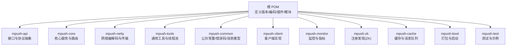
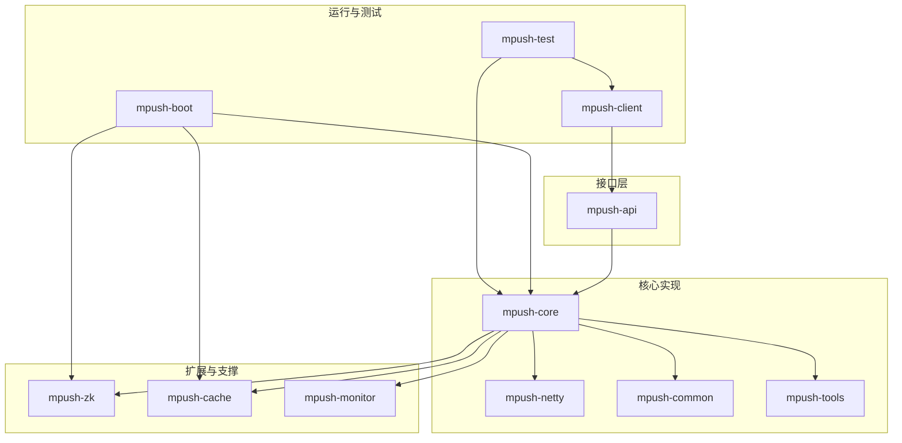
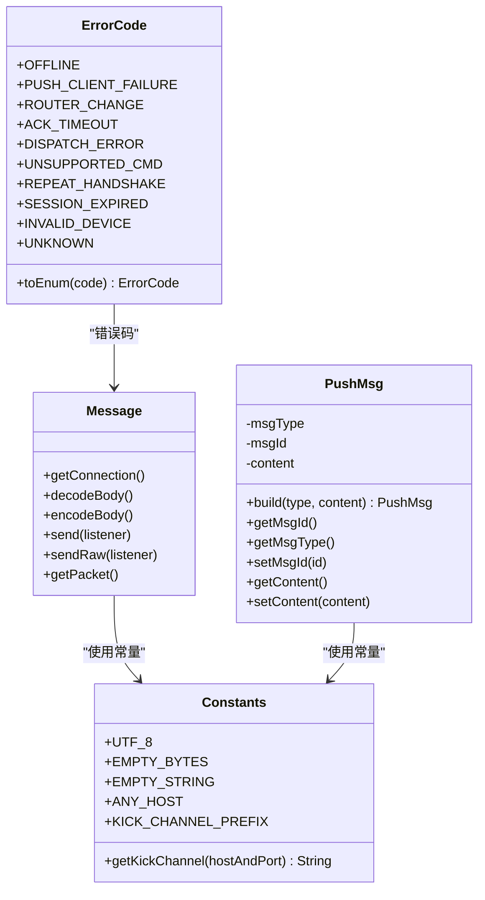
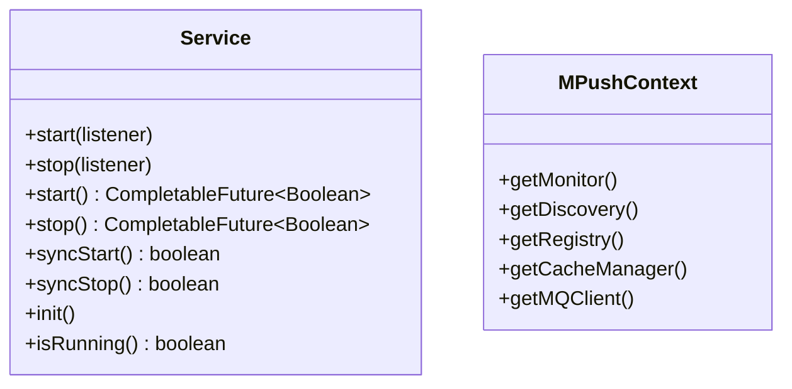
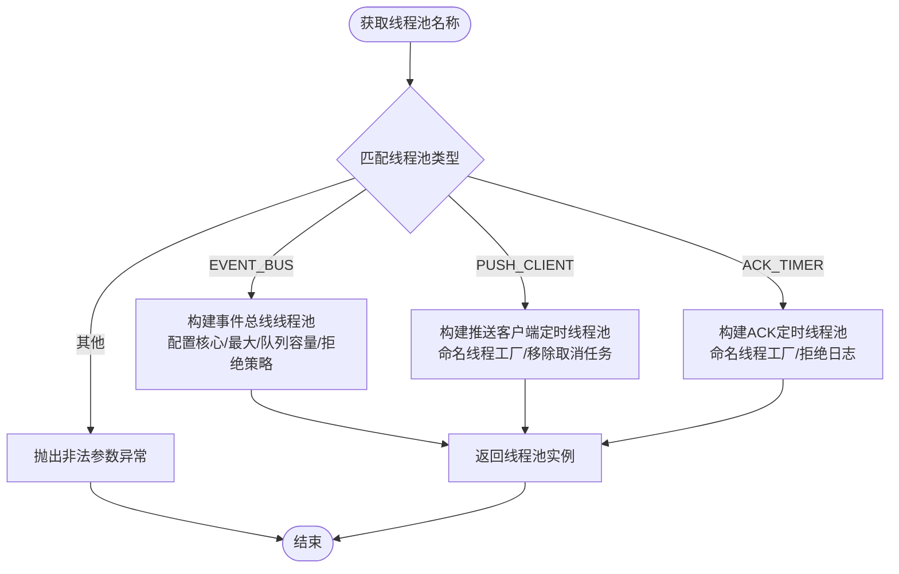
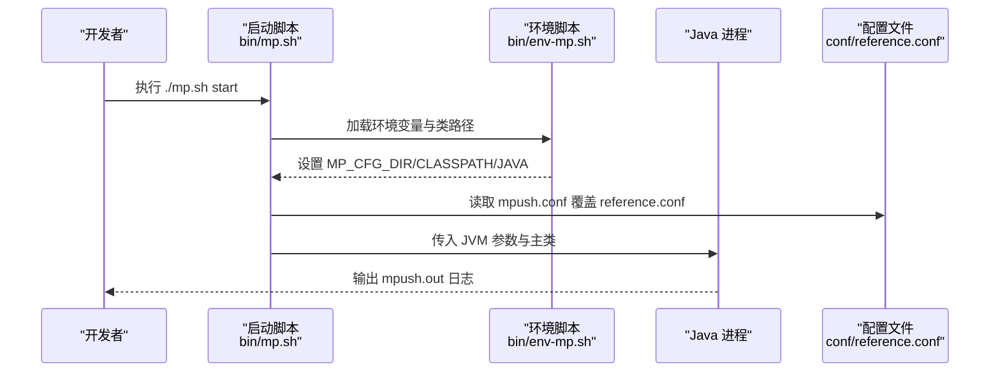
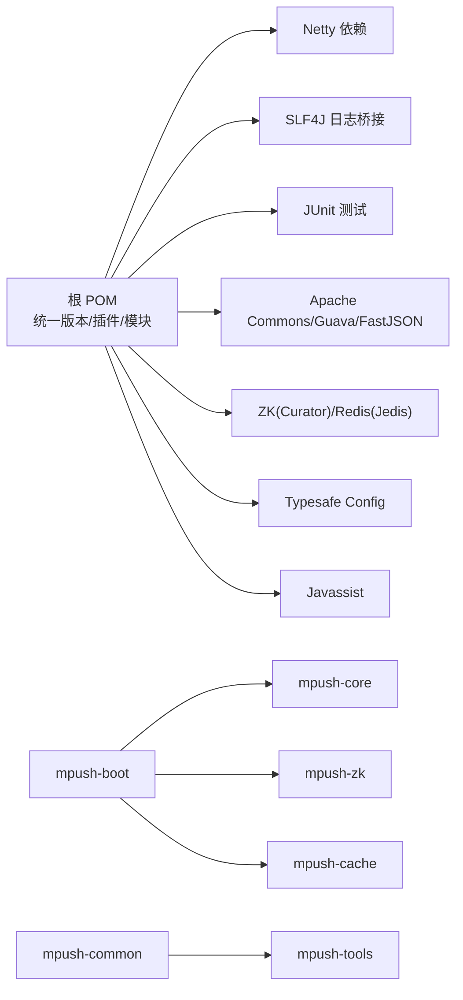

# 代码贡献

<cite>
**本文引用的文件**   
- [README.md](file://README.md)
- [pom.xml](file://pom.xml)
- [mpush-api/pom.xml](file://mpush-api/pom.xml)
- [mpush-boot/pom.xml](file://mpush-boot/pom.xml)
- [mpush-common/pom.xml](file://mpush-common/pom.xml)
- [conf/reference.conf](file://conf/reference.conf)
- [bin/env-mp.sh](file://bin/env-mp.sh)
- [bin/mp.sh](file://bin/mp.sh)
- [mpush-api/src/main/java/com/mpush/api/Constants.java](file://mpush-api/src/main/java/com/mpush/api/Constants.java)
- [mpush-api/src/main/java/com/mpush/api/MPushContext.java](file://mpush-api/src/main/java/com/mpush/api/MPushContext.java)
- [mpush-api/src/main/java/com/mpush/api/service/Service.java](file://mpush-api/src/main/java/com/mpush/api/service/Service.java)
- [mpush-api/src/main/java/com/mpush/api/message/Message.java](file://mpush-api/src/main/java/com/mpush/api/message/Message.java)
- [mpush-api/src/main/java/com/mpush/api/push/PushMsg.java](file://mpush-api/src/main/java/com/mpush/api/push/PushMsg.java)
- [mpush-common/src/main/java/com/mpush/common/CommonExecutorFactory.java](file://mpush-common/src/main/java/com/mpush/common/CommonExecutorFactory.java)
- [mpush-common/src/main/java/com/mpush/common/ErrorCode.java](file://mpush-common/src/main/java/com/mpush/common/ErrorCode.java)
</cite>

## 目录
1. [简介](#简介)
2. [项目结构](#项目结构)
3. [核心组件](#核心组件)
4. [架构总览](#架构总览)
5. [详细组件分析](#详细组件分析)
6. [依赖分析](#依赖分析)
7. [性能考虑](#性能考虑)
8. [故障排查指南](#故障排查指南)
9. [结论](#结论)
10. [附录](#附录)

## 简介
本指南面向希望为 MPush 代码库做出贡献的开发者，涵盖从 Fork 项目、创建分支、提交与 PR 的完整 Git 工作流；统一的 Java 编码规范与风格要求；分支管理与合并策略；代码审查流程与清单；Issue 管理与问题跟踪方法；文档贡献规范；以及社区协作与沟通建议。目标是帮助贡献者高效、高质量地参与项目演进。

## 项目结构
MPush 是一个多模块 Maven 聚合项目，核心模块围绕“API 抽象层、核心服务、网络协议、工具集、客户端、监控、注册发现、缓存”等维度组织。顶层 POM 定义了统一的 Java 版本、编码、依赖版本与构建插件；各子模块通过相对路径继承父 POM，形成清晰的层次化结构。

图表来源
- [pom.xml](file://pom.xml#L54-L66)
- [mpush-api/pom.xml](file://mpush-api/pom.xml#L8-L13)
- [mpush-boot/pom.xml](file://mpush-boot/pom.xml#L6-L11)
- [mpush-common/pom.xml](file://mpush-common/pom.xml#L5-L10)

章节来源
- [pom.xml](file://pom.xml#L54-L66)
- [README.md](file://README.md#L1-L328)

## 核心组件
- API 抽象层：定义连接、消息、协议、推送、路由、服务等接口契约，确保上层实现与底层细节解耦。
- 核心服务：包含握手、心跳、ACK、推送、路由中心、网关、会话管理等核心逻辑。
- 网络层：基于 Netty 的 TCP/UDP/WebSocket 编解码与连接管理。
- 工具与线程池：统一的线程池工厂、日志、配置读取、事件总线等基础设施。
- 公共常量与错误码：统一的常量定义与错误码枚举，便于跨模块一致性。
- 客户端：提供连接、推送、用户状态监听等客户端能力。
- 监控：JMX/MXBean、线程池与 JVM 指标采集。
- 注册发现与缓存：基于 ZooKeeper 的服务注册与发现，Redis 作为缓存与消息通道。

章节来源
- [mpush-api/src/main/java/com/mpush/api/Constants.java](file://mpush-api/src/main/java/com/mpush/api/Constants.java#L30-L42)
- [mpush-api/src/main/java/com/mpush/api/MPushContext.java](file://mpush-api/src/main/java/com/mpush/api/MPushContext.java#L33-L45)
- [mpush-api/src/main/java/com/mpush/api/service/Service.java](file://mpush-api/src/main/java/com/mpush/api/service/Service.java#L29-L47)
- [mpush-api/src/main/java/com/mpush/api/message/Message.java](file://mpush-api/src/main/java/com/mpush/api/message/Message.java#L31-L54)
- [mpush-api/src/main/java/com/mpush/api/push/PushMsg.java](file://mpush-api/src/main/java/com/mpush/api/push/PushMsg.java#L34-L70)
- [mpush-common/src/main/java/com/mpush/common/CommonExecutorFactory.java](file://mpush-common/src/main/java/com/mpush/common/CommonExecutorFactory.java#L46-L96)
- [mpush-common/src/main/java/com/mpush/common/ErrorCode.java](file://mpush-common/src/main/java/com/mpush/common/ErrorCode.java#L27-L55)

## 架构总览
MPush 采用模块化与 SPI 扩展相结合的架构，API 层提供稳定接口，核心与网络层负责具体实现，工具与公共模块提供支撑，客户端与监控模块分别面向使用者与运维视角。

图表来源
- [pom.xml](file://pom.xml#L54-L66)
- [mpush-boot/pom.xml](file://mpush-boot/pom.xml#L19-L32)

## 详细组件分析

### 组件一：消息与推送模型
- Message 接口定义了连接、编解码、发送（含压缩/加密）等能力，是消息处理的核心抽象。
- PushMsg 提供推送消息的结构化封装，包含消息类型、消息 ID、内容等字段。
- 常量与错误码模块提供统一的标识与错误语义，便于跨模块一致处理。

图表来源
- [mpush-api/src/main/java/com/mpush/api/message/Message.java](file://mpush-api/src/main/java/com/mpush/api/message/Message.java#L31-L54)
- [mpush-api/src/main/java/com/mpush/api/push/PushMsg.java](file://mpush-api/src/main/java/com/mpush/api/push/PushMsg.java#L34-L70)
- [mpush-api/src/main/java/com/mpush/api/Constants.java](file://mpush-api/src/main/java/com/mpush/api/Constants.java#L30-L42)
- [mpush-common/src/main/java/com/mpush/common/ErrorCode.java](file://mpush-common/src/main/java/com/mpush/common/ErrorCode.java#L27-L55)

章节来源
- [mpush-api/src/main/java/com/mpush/api/message/Message.java](file://mpush-api/src/main/java/com/mpush/api/message/Message.java#L31-L54)
- [mpush-api/src/main/java/com/mpush/api/push/PushMsg.java](file://mpush-api/src/main/java/com/mpush/api/push/PushMsg.java#L34-L70)
- [mpush-api/src/main/java/com/mpush/api/Constants.java](file://mpush-api/src/main/java/com/mpush/api/Constants.java#L30-L42)
- [mpush-common/src/main/java/com/mpush/common/ErrorCode.java](file://mpush-common/src/main/java/com/mpush/common/ErrorCode.java#L27-L55)

### 组件二：服务生命周期与上下文
- Service 接口定义了异步与同步的启动/停止、初始化与运行态查询，统一服务管理。
- MPushContext 抽象出监控、注册发现、缓存、消息队列等外部能力的访问点，便于替换与扩展。

图表来源
- [mpush-api/src/main/java/com/mpush/api/service/Service.java](file://mpush-api/src/main/java/com/mpush/api/service/Service.java#L29-L47)
- [mpush-api/src/main/java/com/mpush/api/MPushContext.java](file://mpush-api/src/main/java/com/mpush/api/MPushContext.java#L33-L45)

章节来源
- [mpush-api/src/main/java/com/mpush/api/service/Service.java](file://mpush-api/src/main/java/com/mpush/api/service/Service.java#L29-L47)
- [mpush-api/src/main/java/com/mpush/api/MPushContext.java](file://mpush-api/src/main/java/com/mpush/api/MPushContext.java#L33-L45)

### 组件三：线程池与执行器工厂
- CommonExecutorFactory 实现了统一的线程池工厂，依据配置创建不同用途的线程池（事件总线、推送客户端、ACK 定时器等），并提供拒绝策略与命名线程工厂。

图表来源
- [mpush-common/src/main/java/com/mpush/common/CommonExecutorFactory.java](file://mpush-common/src/main/java/com/mpush/common/CommonExecutorFactory.java#L64-L96)

章节来源
- [mpush-common/src/main/java/com/mpush/common/CommonExecutorFactory.java](file://mpush-common/src/main/java/com/mpush/common/CommonExecutorFactory.java#L46-L96)

### 组件四：配置与运行脚本
- reference.conf 提供完整的系统配置项参考，涵盖日志、核心、安全、网络、ZK、Redis、HTTP 代理、线程池、流控、监控与 SPI 扩展等。
- bin/mp.sh 与 bin/env-mp.sh 提供环境变量注入、JVM 参数、PID 文件、日志输出、JMX 开关与远程调试等运行期控制。

图表来源
- [bin/mp.sh](file://bin/mp.sh#L134-L165)
- [bin/env-mp.sh](file://bin/env-mp.sh#L49-L85)
- [conf/reference.conf](file://conf/reference.conf#L1-L239)

章节来源
- [bin/mp.sh](file://bin/mp.sh#L134-L165)
- [bin/env-mp.sh](file://bin/env-mp.sh#L49-L85)
- [conf/reference.conf](file://conf/reference.conf#L1-L239)

## 依赖分析
- 顶层 POM 统一管理 Java 版本、编码、Netty、SLF4J、JUnit、Guava、FastJSON、Curator、Jedis、Typesafe Config、Javassist 等依赖版本与范围。
- mpush-boot 依赖 mpush-core、mpush-cache、mpush-zk，并通过 Assembly 插件打包为可运行发行包。
- mpush-common 依赖 mpush-tools，提供公共工具与线程池工厂。

图表来源
- [pom.xml](file://pom.xml#L79-L284)
- [mpush-boot/pom.xml](file://mpush-boot/pom.xml#L19-L32)
- [mpush-common/pom.xml](file://mpush-common/pom.xml#L19-L24)

章节来源
- [pom.xml](file://pom.xml#L79-L284)
- [mpush-boot/pom.xml](file://mpush-boot/pom.xml#L19-L32)
- [mpush-common/pom.xml](file://mpush-common/pom.xml#L19-L24)

## 性能考虑
- 线程池配置：通过配置项控制接入、网关、HTTP、ACK 定时、推送任务、客户端等线程池规模与队列容量，避免过载与饥饿。
- 流量整形与缓冲区：网络层提供发送/接收缓冲区与写保护水位，结合流量整形限制全局/通道带宽。
- 压缩阈值：超过阈值的数据包启用压缩，降低带宽占用。
- 监控与剖析：开启慢调用日志与堆栈转储，辅助定位热点与瓶颈。

章节来源
- [conf/reference.conf](file://conf/reference.conf#L23-L31)
- [conf/reference.conf](file://conf/reference.conf#L76-L122)
- [conf/reference.conf](file://conf/reference.conf#L182-L205)
- [conf/reference.conf](file://conf/reference.conf#L224-L232)

## 故障排查指南
- 启动失败：检查 bin/mp.sh 输出的日志文件 mpush.out，确认 JVM 参数、配置路径与权限。
- 端口占用：通过 status 命令或直接查看配置文件中的端口设置，必要时修改 mpush.conf。
- 线程池异常：关注线程池拒绝策略与队列积压，调整配置项以适配负载。
- 错误码定位：使用 ErrorCode 枚举快速识别错误类别，结合日志上下文定位问题。

章节来源
- [bin/mp.sh](file://bin/mp.sh#L166-L175)
- [bin/mp.sh](file://bin/mp.sh#L229-L238)
- [mpush-common/src/main/java/com/mpush/common/ErrorCode.java](file://mpush-common/src/main/java/com/mpush/common/ErrorCode.java#L27-L55)

## 结论
通过遵循本文的贡献流程与规范，结合统一的编码风格、严格的代码审查与 Issue 管理，贡献者可以高效地为 MPush 增强功能、修复缺陷并提升整体质量。同时，完善的配置与运行脚本保障了部署与运维的稳定性。

## 附录

### 贡献流程与规范

- Fork 项目与本地开发
  - 在 GitHub 上 Fork 主仓库，克隆到本地，导入 Maven 多模块工程。
  - 使用 IDE 导入 mpush-test 模块，运行测试入口验证环境。
  - 修改配置文件参考 conf/reference.conf，按需覆盖 mpush.conf。

- 分支管理与命名
  - 主分支保护：禁止直接推送至主分支，功能开发使用功能分支。
  - 分支命名建议：feature/xxx、bugfix/xxx、docs/xxx、refactor/xxx。
  - 合并前要求：通过本地测试、代码审查、CI 通过。

- 提交与 PR
  - 提交信息格式：类型(scope): 概述；正文说明动机与影响。
  - PR 描述：关联 Issue、变更摘要、测试要点、兼容性说明。
  - 代码审查：至少一名维护者批准，修复评审意见后复审。

- 代码规范与风格
  - Java 版本与编码：Java 8+，UTF-8。
  - 包与类命名：com.mpush.<模块>.<领域>；类名使用名词；接口以 I 或抽象类前缀区分。
  - 方法命名：动词短语；布尔方法以 is/has/can 前缀。
  - 常量：全大写蛇形；静态常量使用接口或公共静态不可变字段。
  - 注释：类与接口 Javadoc；复杂逻辑行内注释；变更与风险说明。
  - 格式化：统一使用 Maven 编译插件与资源插件编码配置，避免 IDE 自动格式化破坏一致性。

- 分支策略与合并
  - 主分支保护：禁止 force push，需要 CI 与审查通过。
  - 功能分支：从 develop 切出，完成后合并回 develop，再进入 release 流程。
  - Hotfix：紧急修复从 master 切出，同时合并回 master 与 develop。

- 代码审查清单
  - 正确性：边界条件、异常路径、并发安全。
  - 可读性：命名清晰、结构合理、注释充分。
  - 性能：避免热点阻塞、合理使用缓存与线程池。
  - 兼容性：接口向后兼容、配置项可选覆盖。
  - 测试：新增/修改逻辑配套单元测试或集成测试。

- Issue 管理与问题跟踪
  - Bug 报告：环境信息、复现步骤、期望结果、实际结果、日志片段。
  - 功能请求：场景描述、收益说明、兼容性影响、替代方案。
  - 分类与优先级：P0-P3 四级，紧急/高/中/低；按影响面与修复成本评估。
  - 标签：type/bug、type/enhancement、area/xxx、priority/Px。

- 文档贡献
  - 文档规范：标题层级、术语统一、示例最小可用、链接可访问。
  - 更新流程：在 docs/ 目录下新增或修改 Markdown，提交 PR 并附带预览截图。
  - 质量标准：准确、及时、可操作、无敏感信息。

- 社区参与与沟通
  - 讨论区：在 GitHub Discussions 或 README 中提供的 QQ 群进行交流。
  - 邮件列表：关注项目公告与重要通知。
  - 会议：定期线上技术分享与需求对齐，欢迎提交议题与参与决策。

章节来源
- [README.md](file://README.md#L1-L328)
- [pom.xml](file://pom.xml#L68-L76)
- [conf/reference.conf](file://conf/reference.conf#L1-L239)