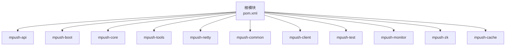
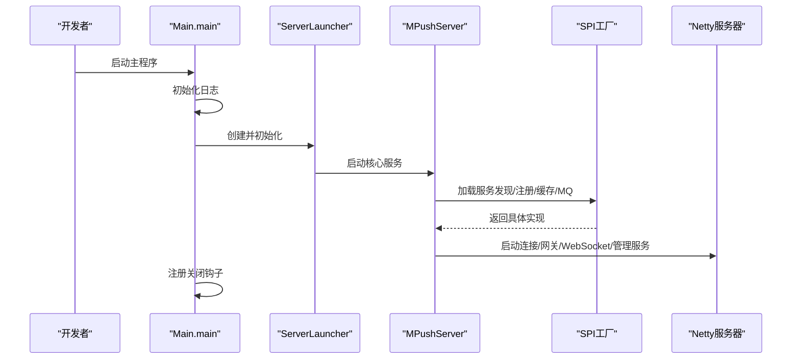
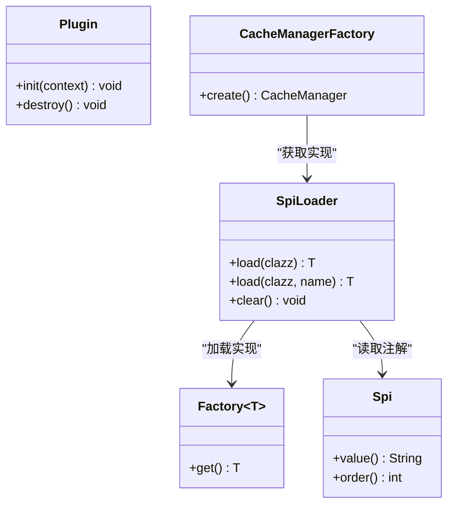
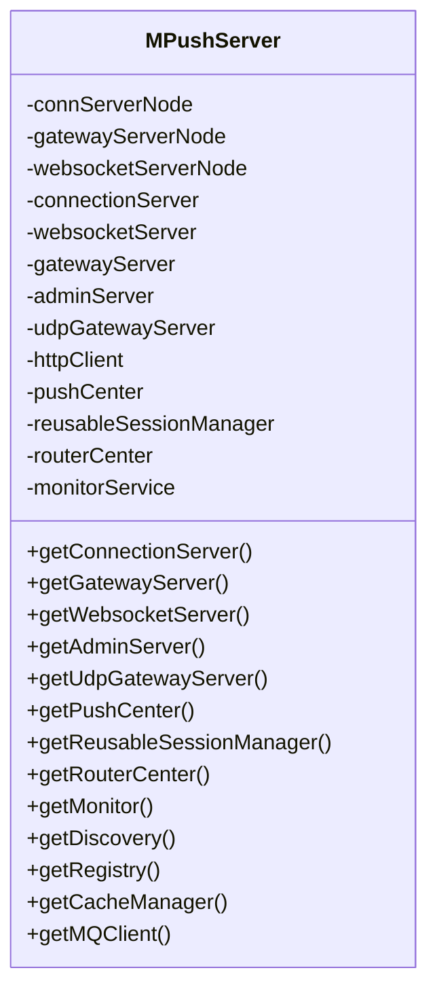
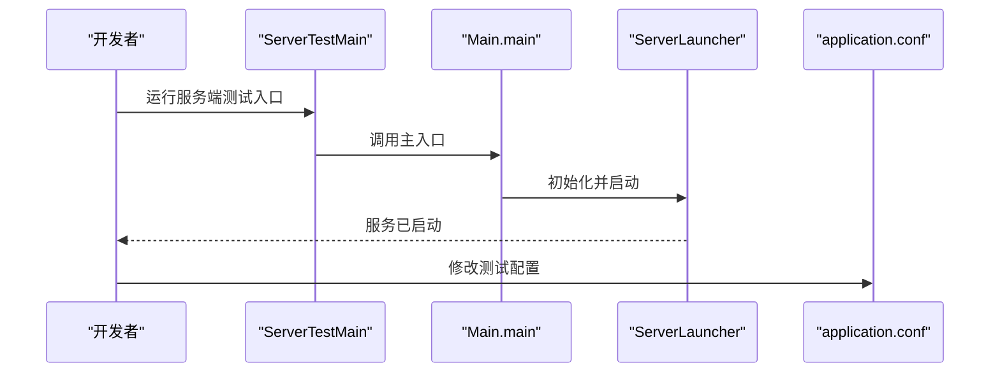
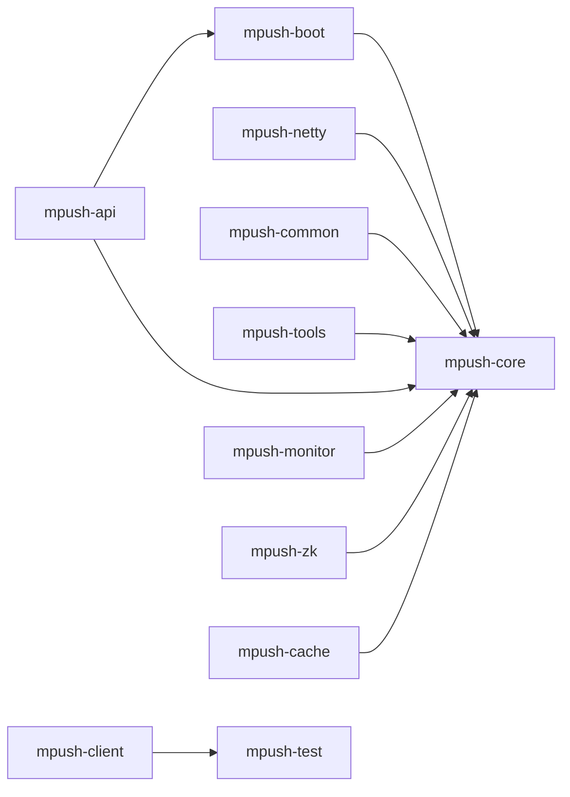

# 开发指南

<cite>
**本文引用的文件**
- [README.md](file://README.md)
- [pom.xml](file://pom.xml)
- [mpush-api/pom.xml](file://mpush-api/pom.xml)
- [mpush-api/src/main/java/com/mpush/api/MPushContext.java](file://mpush-api/src/main/java/com/mpush/api/MPushContext.java)
- [mpush-api/src/main/java/com/mpush/api/spi/Spi.java](file://mpush-api/src/main/java/com/mpush/api/spi/Spi.java)
- [mpush-api/src/main/java/com/mpush/api/spi/Plugin.java](file://mpush-api/src/main/java/com/mpush/api/spi/Plugin.java)
- [mpush-api/src/main/java/com/mpush/api/spi/Factory.java](file://mpush-api/src/main/java/com/mpush/api/spi/Factory.java)
- [mpush-api/src/main/java/com/mpush/api/spi/SpiLoader.java](file://mpush-api/src/main/java/com/mpush/api/spi/SpiLoader.java)
- [mpush-api/src/main/java/com/mpush/api/spi/common/CacheManagerFactory.java](file://mpush-api/src/main/java/com/mpush/api/spi/common/CacheManagerFactory.java)
- [mpush-boot/src/main/java/com/mpush/bootstrap/Main.java](file://mpush-boot/src/main/java/com/mpush/bootstrap/Main.java)
- [mpush-core/src/main/java/com/mpush/core/MPushServer.java](file://mpush-core/src/main/java/com/mpush/core/MPushServer.java)
- [mpush-test/src/main/resources/application.conf](file://mpush-test/src/main/resources/application.conf)
- [conf/reference.conf](file://conf/reference.conf)
- [mpush-test/src/main/java/com/mpush/test/sever/ServerTestMain.java](file://mpush-test/src/main/java/com/mpush/test/sever/ServerTestMain.java)
- [mpush-test/src/main/java/com/mpush/test/client/ConnClientTestMain.java](file://mpush-test/src/main/java/com/mpush/test/client/ConnClientTestMain.java)
</cite>

## 目录
1. [简介](#简介)
2. [项目结构](#项目结构)
3. [核心组件](#核心组件)
4. [架构总览](#架构总览)
5. [详细组件分析](#详细组件分析)
6. [依赖分析](#依赖分析)
7. [性能考虑](#性能考虑)
8. [故障排查指南](#故障排查指南)
9. [结论](#结论)
10. [附录](#附录)

## 简介
本开发指南面向希望参与 MPush 服务端开发与扩展的工程师，目标是帮助你完成开发环境搭建、理解模块结构与依赖、掌握扩展点（SPI 插件、自定义处理器、新协议支持、第三方集成）的使用方法、建立完善的测试体系（单元、集成、性能、回归），并提供代码贡献规范与常见问题的解决方案。

## 项目结构
MPush 采用 Maven 多模块聚合结构，核心模块包括 API、核心服务、网络层、工具集、客户端、监控、ZooKeeper 集成、缓存与消息队列适配等。顶层 POM 定义了统一的 Java 版本、依赖版本与构建插件；各子模块通过相对路径继承父 POM 并声明自身依赖。

图表来源
- [pom.xml](file://pom.xml#L54-L66)

章节来源
- [pom.xml](file://pom.xml#L54-L66)
- [README.md](file://README.md#L22-L31)

## 核心组件
- API 层：定义通用接口与 SPI 扩展点，如 MPushContext、CacheManagerFactory、ServiceDiscoveryFactory 等，为上层提供抽象能力。
- 核心服务：MPushServer 负责装配与启动各类服务（连接、网关、WebSocket、管理、推送中心、路由中心、会话管理、监控服务等）。
- 网络层：基于 Netty 的 TCP/UDP/WebSocket 实现，提供编解码、连接管理与 HTTP 客户端。
- 工具集：提供线程池、日志、配置、加解密、事件总线等基础设施。
- 客户端：提供连接客户端、推送客户端与网关客户端示例，便于联调与测试。
- 测试模块：包含服务端、客户端、推送、Redis、ZK、UDP 等测试入口与配置样例。
- 监控：提供 JVM 指标采集、线程池管理与统计。
- 集成：ZooKeeper 与 Redis 的服务发现与缓存/消息队列适配。

章节来源
- [mpush-api/src/main/java/com/mpush/api/MPushContext.java](file://mpush-api/src/main/java/com/mpush/api/MPushContext.java#L33-L45)
- [mpush-core/src/main/java/com/mpush/core/MPushServer.java](file://mpush-core/src/main/java/com/mpush/core/MPushServer.java#L48-L181)
- [mpush-boot/src/main/java/com/mpush/bootstrap/Main.java](file://mpush-boot/src/main/java/com/mpush/bootstrap/Main.java#L24-L63)

## 架构总览
MPush 服务启动流程从 Main 入口初始化日志、创建 ServerLauncher 并启动，同时注册 JVM 关闭钩子保证优雅停机。MPushServer 负责装配连接、网关、WebSocket、管理、推送中心、路由中心、会话管理与监控服务，并通过 SPI 获取服务发现、注册、缓存与 MQ 客户端实例。

图表来源
- [mpush-boot/src/main/java/com/mpush/bootstrap/Main.java](file://mpush-boot/src/main/java/com/mpush/bootstrap/Main.java#L31-L62)
- [mpush-core/src/main/java/com/mpush/core/MPushServer.java](file://mpush-core/src/main/java/com/mpush/core/MPushServer.java#L71-L96)

章节来源
- [mpush-boot/src/main/java/com/mpush/bootstrap/Main.java](file://mpush-boot/src/main/java/com/mpush/bootstrap/Main.java#L24-L63)
- [mpush-core/src/main/java/com/mpush/core/MPushServer.java](file://mpush-core/src/main/java/com/mpush/core/MPushServer.java#L48-L181)

## 详细组件分析

### SPI 扩展机制与加载
MPush 使用标准的 Java SPI 机制配合自定义注解与加载器实现可插拔扩展。核心包括：
- 注解 Spi：用于标记扩展实现并指定优先级。
- 接口 Factory/Plugin：作为工厂与生命周期接口。
- 类 SpiLoader：负责缓存与按名称过滤、排序选择实现。
- 工厂接口：如 CacheManagerFactory、ServiceDiscoveryFactory 等，通过 SpiLoader.load 获取实现。

图表来源
- [mpush-api/src/main/java/com/mpush/api/spi/Spi.java](file://mpush-api/src/main/java/com/mpush/api/spi/Spi.java#L32-L48)
- [mpush-api/src/main/java/com/mpush/api/spi/Factory.java](file://mpush-api/src/main/java/com/mpush/api/spi/Factory.java#L29-L31)
- [mpush-api/src/main/java/com/mpush/api/spi/Plugin.java](file://mpush-api/src/main/java/com/mpush/api/spi/Plugin.java#L29-L38)
- [mpush-api/src/main/java/com/mpush/api/spi/SpiLoader.java](file://mpush-api/src/main/java/com/mpush/api/spi/SpiLoader.java#L25-L96)
- [mpush-api/src/main/java/com/mpush/api/spi/common/CacheManagerFactory.java](file://mpush-api/src/main/java/com/mpush/api/spi/common/CacheManagerFactory.java#L30-L34)

章节来源
- [mpush-api/src/main/java/com/mpush/api/spi/Spi.java](file://mpush-api/src/main/java/com/mpush/api/spi/Spi.java#L24-L48)
- [mpush-api/src/main/java/com/mpush/api/spi/Plugin.java](file://mpush-api/src/main/java/com/mpush/api/spi/Plugin.java#L24-L38)
- [mpush-api/src/main/java/com/mpush/api/spi/Factory.java](file://mpush-api/src/main/java/com/mpush/api/spi/Factory.java#L24-L31)
- [mpush-api/src/main/java/com/mpush/api/spi/SpiLoader.java](file://mpush-api/src/main/java/com/mpush/api/spi/SpiLoader.java#L25-L96)
- [mpush-api/src/main/java/com/mpush/api/spi/common/CacheManagerFactory.java](file://mpush-api/src/main/java/com/mpush/api/spi/common/CacheManagerFactory.java#L25-L34)

### MPushServer 服务装配
MPushServer 在构造函数中初始化并装配核心服务组件，包括连接服务器、WebSocket 服务器、网关服务器（TCP 或 UDP）、管理服务器、推送中心、路由中心、会话管理、监控服务，并通过 SPI 获取服务发现、注册、缓存与 MQ 客户端。

图表来源
- [mpush-core/src/main/java/com/mpush/core/MPushServer.java](file://mpush-core/src/main/java/com/mpush/core/MPushServer.java#L48-L181)

章节来源
- [mpush-core/src/main/java/com/mpush/core/MPushServer.java](file://mpush-core/src/main/java/com/mpush/core/MPushServer.java#L48-L181)

### 测试入口与运行
- 服务端测试入口：ServerTestMain 提供启动长连接服务的示例，可通过 JVM 参数开启 Netty 泄漏检测等调试选项。
- 客户端测试入口：ConnClientTestMain 提供模拟客户端连接与统计输出，支持参数化并发、同步/异步模式与用户前缀等。
- 测试配置：application.conf 提供日志级别、ZooKeeper 与 Redis 地址、网络端口等测试所需的关键配置。

图表来源
- [mpush-test/src/main/java/com/mpush/test/sever/ServerTestMain.java](file://mpush-test/src/main/java/com/mpush/test/sever/ServerTestMain.java#L32-L50)
- [mpush-test/src/main/resources/application.conf](file://mpush-test/src/main/resources/application.conf#L1-L22)

章节来源
- [mpush-test/src/main/java/com/mpush/test/sever/ServerTestMain.java](file://mpush-test/src/main/java/com/mpush/test/sever/ServerTestMain.java#L32-L50)
- [mpush-test/src/main/resources/application.conf](file://mpush-test/src/main/resources/application.conf#L1-L22)

### 配置体系与参考配置
- 参考配置文件 reference.conf 提供完整的系统配置项说明，包括日志、核心、安全、网络、ZooKeeper、Redis、HTTP 代理、线程池、推送流控、监控与 SPI 扩展等。
- 测试配置 application.conf 提供最小可用示例，便于快速验证。

章节来源
- [conf/reference.conf](file://conf/reference.conf#L13-L239)
- [mpush-test/src/main/resources/application.conf](file://mpush-test/src/main/resources/application.conf#L1-L22)

## 依赖分析
- 顶层 POM 定义了模块聚合、Java 版本、依赖版本管理与构建插件（编译、资源、测试）。各子模块通过相对路径继承父 POM 并声明自身依赖。
- mpush-api 仅依赖 Netty 核心传输与 HTTP 编解码，作为 API 抽象层。
- mpush-boot 作为启动入口，依赖 API 与其他模块，负责装配与启动。
- mpush-core 依赖 API、Netty、监控、工具集等，实现核心业务逻辑。
- mpush-netty 提供网络传输实现。
- mpush-common 提供通用消息、路由、流控、加解密与服务节点信息。
- mpush-client 提供客户端示例与推送客户端。
- mpush-test 提供测试入口与配置。
- mpush-monitor 提供监控与线程池管理。
- mpush-zk 与 mpush-cache 提供服务发现与缓存/消息队列适配。

图表来源
- [pom.xml](file://pom.xml#L54-L66)
- [mpush-api/pom.xml](file://mpush-api/pom.xml#L21-L32)

章节来源
- [pom.xml](file://pom.xml#L54-L66)
- [mpush-api/pom.xml](file://mpush-api/pom.xml#L21-L32)

## 性能考虑
- Netty 参数：发送/接收缓冲区、写保护水位、流量整形等参数可按场景调优，避免背压与丢包。
- 线程池：连接、网关、HTTP、ACK 定时器、推送任务、网关客户端与推送客户端线程池规模可根据 CPU 核数与负载动态调整。
- 压缩阈值与最大包大小：合理设置压缩阈值与最大包大小，平衡带宽与 CPU 开销。
- 监控与剖析：开启慢日志与性能剖析开关，定期导出堆栈与指标，定位瓶颈。
- 流控策略：针对广播与非广播推送设置合理的 QPS 限制与窗口，防止过载。

章节来源
- [conf/reference.conf](file://conf/reference.conf#L23-L239)
- [mpush-test/src/main/resources/application.conf](file://mpush-test/src/main/resources/application.conf#L1-L22)

## 故障排查指南
- 启动失败
  - 检查 ZooKeeper 与 Redis 连通性与配置项。
  - 查看日志输出目录与日志级别，确认是否有异常堆栈。
  - 使用 set-env.sh 脚本调整 JVM 参数（堆大小、远程调试、JMX）。
- 连接异常
  - 校验网络端口与绑定 IP，确认防火墙放行。
  - 检查 Netty 写保护水位与流量整形配置。
- 推送失败
  - 检查路由中心与会话管理状态。
  - 观察流控配置是否触发限速。
- 客户端联调
  - 使用 ConnClientTestMain 启动多个客户端，观察统计输出与握手结果。
  - 如需长时间运行，结合测试入口中的 park 机制保持进程存活。

章节来源
- [README.md](file://README.md#L70-L78)
- [mpush-test/src/main/java/com/mpush/test/client/ConnClientTestMain.java](file://mpush-test/src/main/java/com/mpush/test/client/ConnClientTestMain.java#L38-L118)

## 结论
通过本指南，你可以完成 MPush 的开发环境搭建、理解模块与依赖关系、掌握 SPI 扩展与自定义处理器的开发方法、建立完善的测试体系，并具备常见问题的排查与优化能力。建议在开发过程中遵循统一的代码与提交规范，确保模块边界清晰、扩展点明确、测试覆盖充分。

## 附录

### 开发环境搭建与 IDE 配置
- JDK 1.8+ 与 Maven 环境准备。
- 导入项目至 IntelliJ IDEA 或 Eclipse，确保多模块可见。
- 设置 Maven Profile 为 dev 或 pub，按需切换打包与部署环境。
- 运行 mpush-test 中的测试入口验证环境。

章节来源
- [README.md](file://README.md#L22-L31)
- [pom.xml](file://pom.xml#L324-L340)

### 依赖导入与测试运行
- 依赖导入：使用 Maven 管理依赖，确保 Netty、SLF4J、Logback、Curator、Jedis、FastJSON、Guava、Apache Commons Lang3 等版本一致。
- 测试运行：在 mpush-test 模块中运行 ServerTestMain 与 ConnClientTestMain，按需修改 application.conf。

章节来源
- [pom.xml](file://pom.xml#L79-L284)
- [mpush-test/src/main/resources/application.conf](file://mpush-test/src/main/resources/application.conf#L1-L22)
- [mpush-test/src/main/java/com/mpush/test/sever/ServerTestMain.java](file://mpush-test/src/main/java/com/mpush/test/sever/ServerTestMain.java#L32-L50)
- [mpush-test/src/main/java/com/mpush/test/client/ConnClientTestMain.java](file://mpush-test/src/main/java/com/mpush/test/client/ConnClientTestMain.java#L38-L118)

### 调试配置与开发工具
- JVM 参数：通过 set-env.sh 脚本设置堆大小、GC 参数、远程调试端口、JMX 等。
- Netty 泄漏检测：在测试入口设置 Netty 泄漏检测级别为 PARANOID。
- 日志：使用 Logback 配置文件，调整日志级别与输出位置。

章节来源
- [README.md](file://README.md#L75-L77)
- [mpush-test/src/main/java/com/mpush/test/sever/ServerTestMain.java](file://mpush-test/src/main/java/com/mpush/test/sever/ServerTestMain.java#L44-L48)

### 扩展开发方法
- SPI 插件开发
  - 使用 @Spi 注解标记实现类并指定 order。
  - 实现 Factory 或 Plugin 接口，必要时实现生命周期方法。
  - 在 META-INF/services 下提供服务提供者配置文件，指向实现类全限定名。
  - 通过对应工厂类（如 CacheManagerFactory）加载实现。
- 自定义处理器
  - 在 mpush-core 的 handler 包中新增处理器类，遵循现有消息处理链路。
  - 在相应 ServerChannelHandler 或 WebSocketChannelHandler 中注册。
- 新协议支持
  - 在 mpush-netty 中新增编解码器与通道处理器，适配新协议报文格式。
  - 在 MPushServer 中注册对应服务器实例。
- 第三方集成
  - 通过 SPI 扩展服务发现、注册、缓存与 MQ 客户端，实现与外部系统的对接。

章节来源
- [mpush-api/src/main/java/com/mpush/api/spi/Spi.java](file://mpush-api/src/main/java/com/mpush/api/spi/Spi.java#L32-L48)
- [mpush-api/src/main/java/com/mpush/api/spi/Plugin.java](file://mpush-api/src/main/java/com/mpush/api/spi/Plugin.java#L29-L38)
- [mpush-api/src/main/java/com/mpush/api/spi/Factory.java](file://mpush-api/src/main/java/com/mpush/api/spi/Factory.java#L29-L31)
- [mpush-api/src/main/java/com/mpush/api/spi/common/CacheManagerFactory.java](file://mpush-api/src/main/java/com/mpush/api/spi/common/CacheManagerFactory.java#L30-L33)
- [mpush-core/src/main/java/com/mpush/core/MPushServer.java](file://mpush-core/src/main/java/com/mpush/core/MPushServer.java#L81-L96)

### 测试策略与方法
- 单元测试：在各模块的 test 目录下编写，使用 JUnit 4.10。
- 集成测试：使用 mpush-test 中的服务端与客户端测试入口，验证端到端流程。
- 性能测试：通过调整线程池、缓冲区与流量整形参数，结合监控指标评估性能。
- 回归测试：在关键变更后运行测试入口，确保核心功能稳定。

章节来源
- [pom.xml](file://pom.xml#L224-L230)
- [mpush-test/src/main/java/com/mpush/test/sever/ServerTestMain.java](file://mpush-test/src/main/java/com/mpush/test/sever/ServerTestMain.java#L38-L42)
- [mpush-test/src/main/java/com/mpush/test/client/ConnClientTestMain.java](file://mpush-test/src/main/java/com/mpush/test/client/ConnClientTestMain.java#L65-L69)

### 代码贡献指南
- 代码规范：遵循项目现有风格，保持模块职责单一、接口清晰、注释完整。
- 提交规范：使用语义化提交信息，简明描述变更目的与影响范围。
- 分支管理：采用 Git Flow，master 用于发布，develop 用于集成，特性分支从 develop 分支切出。
- 代码审查：提交 Pull Request，至少一名维护者审查通过后合并。

章节来源
- [pom.xml](file://pom.xml#L36-L52)

### 新功能开发流程与注意事项
- 需求分析：明确功能边界与影响面，评估对现有模块的耦合度。
- 设计评审：确定扩展点与接口设计，优先使用 SPI 与工厂模式降低耦合。
- 开发实现：在独立分支开发，遵循模块划分与依赖约束。
- 测试验证：补充单元与集成测试，验证端到端流程与性能指标。
- 文档更新：完善 README 与配置说明，标注新增配置项与使用示例。
- 代码审查与合并：通过 CI 与人工审查后合并至 develop/master。

章节来源
- [README.md](file://README.md#L22-L31)
- [conf/reference.conf](file://conf/reference.conf#L13-L239)