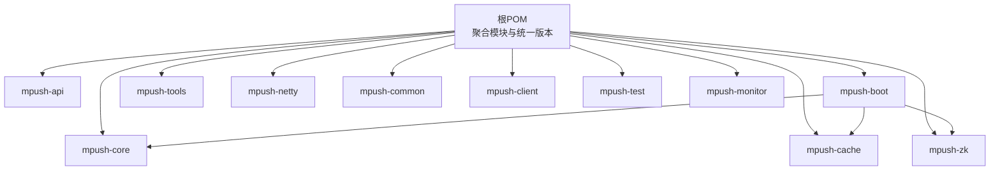
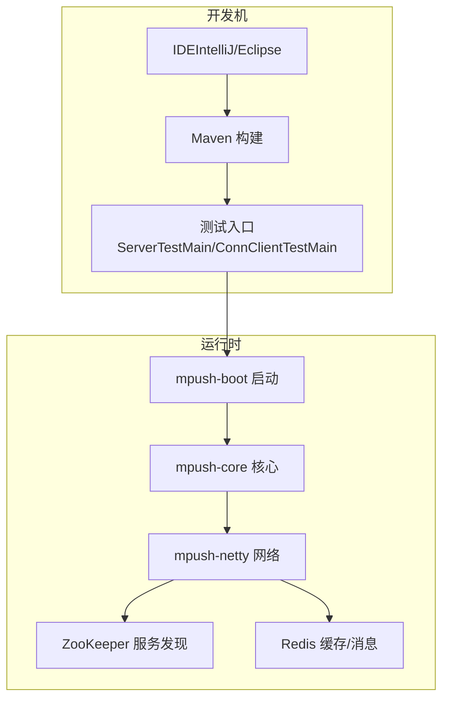
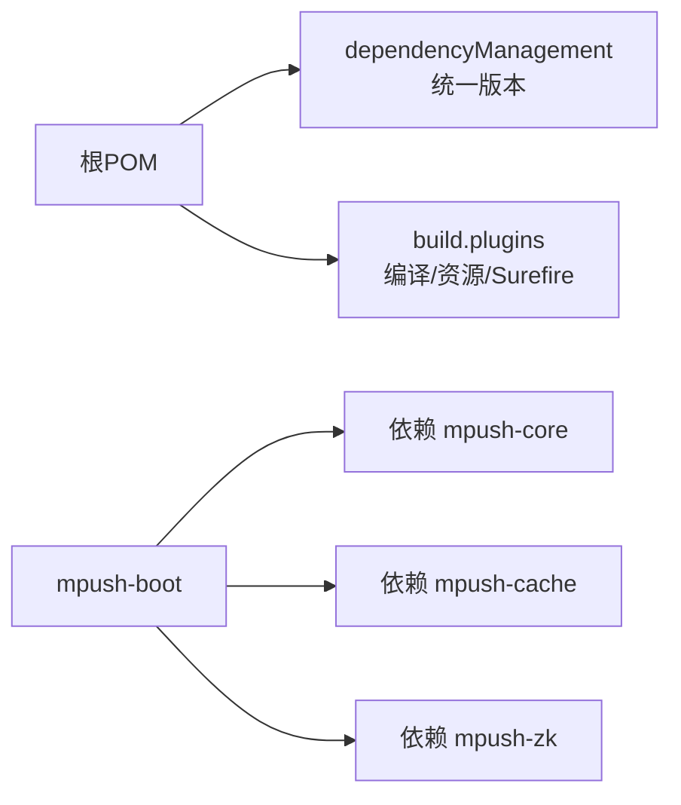
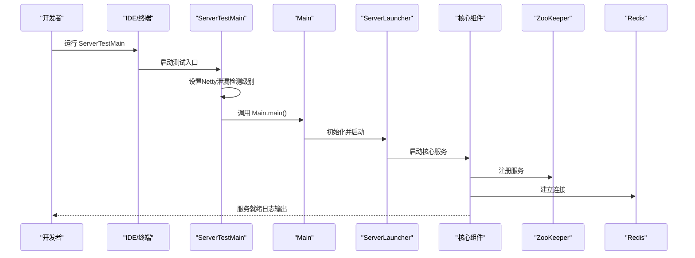

# 开发环境搭建

<cite>
**本文引用的文件**
- [根POM（pom.xml）](file://pom.xml)
- [README（部署与测试说明）](file://README.md)
- [环境变量脚本（env-mp.sh）](file://bin/env-mp.sh)
- [环境变量脚本（env-mp.cmd）](file://bin/env-mp.cmd)
- [参考配置（reference.conf）](file://conf/reference.conf)
- [启动配置（mpush.conf）](file://mpush-boot/src/main/resources/mpush.conf)
- [开发配置（conf-dev.properties）](file://conf/conf-dev.properties)
- [发布配置（conf-pub.properties）](file://conf/conf-pub.properties)
- [测试配置（application.conf）](file://mpush-test/src/main/resources/application.conf)
- [日志配置（logback.xml）](file://mpush-test/src/main/resources/logback.xml)
- [启动入口（Main.java）](file://mpush-boot/src/main/java/com/mpush/bootstrap/Main.java)
- [服务端测试入口（ServerTestMain.java）](file://mpush-test/src/main/java/com/mpush/test/sever/ServerTestMain.java)
- [连接客户端测试入口（ConnClientTestMain.java）](file://mpush-test/src/main/java/com/mpush/test/client/ConnClientTestMain.java)
- [设置JVM参数脚本（set-env.sh）](file://bin/set-env.sh)
- [引导模块POM（mpush-boot/pom.xml）](file://mpush-boot/pom.xml)
</cite>

## 目录
1. [简介](#简介)
2. [项目结构](#项目结构)
3. [核心组件](#核心组件)
4. [架构总览](#架构总览)
5. [详细组件分析](#详细组件分析)
6. [依赖分析](#依赖分析)
7. [性能考虑](#性能考虑)
8. [故障排查指南](#故障排查指南)
9. [结论](#结论)
10. [附录](#附录)

## 简介
本指南面向希望在本地搭建 MPush 开发环境的工程师，覆盖系统要求、IDE 导入、Maven 构建与配置、测试环境准备、调试与日志、常见问题排查等内容。MPush 是基于 Netty 的高性能消息推送系统，核心依赖 ZooKeeper 与 Redis，同时需要 JDK 1.8 或以上版本。

## 项目结构
MPush 采用 Maven 多模块聚合工程组织，顶层 POM 管理版本与插件，各子模块职责清晰：
- mpush-api：公共接口与 SPI 扩展
- mpush-boot：启动与打包模块
- mpush-core：核心业务逻辑
- mpush-tools：通用工具集
- mpush-netty：网络通信实现
- mpush-common：通用常量与消息模型
- mpush-client：客户端示例
- mpush-test：测试与演示
- mpush-monitor：监控能力
- mpush-zk：ZooKeeper 服务发现与注册
- mpush-cache：Redis 缓存与消息队列适配

图表来源
- [根POM（pom.xml）](file://pom.xml#L54-L66)
- [引导模块POM（mpush-boot/pom.xml）](file://mpush-boot/pom.xml#L19-L32)

章节来源
- [根POM（pom.xml）](file://pom.xml#L54-L66)
- [README（部署与测试说明）](file://README.md#L22-L31)

## 核心组件
- Java 版本：JDK 1.8（源码与目标版本均为 1.8）
- 依赖中间件：ZooKeeper、Redis
- 日志框架：SLF4J + Logback
- 网络框架：Netty 4.1.25.Final
- 测试框架：JUnit 4.10（测试模块）

章节来源
- [根POM（pom.xml）](file://pom.xml#L72-L76)
- [根POM（pom.xml）](file://pom.xml#L181-L220)
- [README（部署与测试说明）](file://README.md#L34-L40)

## 架构总览
MPush 的运行时依赖 ZooKeeper 进行服务注册与发现，Redis 用于缓存与消息通道，Netty 提供高性能网络通信。开发时可通过 mpush-test 模块快速启动服务端与客户端进行联调。

图表来源
- [启动入口（Main.java）](file://mpush-boot/src/main/java/com/mpush/bootstrap/Main.java#L31-L38)
- [服务端测试入口（ServerTestMain.java）](file://mpush-test/src/main/java/com/mpush/test/sever/ServerTestMain.java#L44-L48)
- [连接客户端测试入口（ConnClientTestMain.java）](file://mpush-test/src/main/java/com/mpush/test/client/ConnClientTestMain.java#L71-L116)

## 详细组件分析

### 系统要求与环境变量
- 操作系统：Linux/Unix（脚本以 Bash 为主），Windows 使用 .cmd 脚本
- JDK：1.8（源码与目标版本一致）
- 中间件：ZooKeeper、Redis
- 环境变量：通过 bin/env-mp.* 设置 MPUSH_HOME、MP_CFG_DIR、CLASSPATH、JAVA 等

章节来源
- [根POM（pom.xml）](file://pom.xml#L72-L76)
- [环境变量脚本（env-mp.sh）](file://bin/env-mp.sh#L26-L51)
- [环境变量脚本（env-mp.cmd）](file://bin/env-mp.cmd#L17-L49)

### IDE 配置（IntelliJ IDEA）
- 导入方式：打开根目录的 pom.xml，选择“Add as Maven Project”
- SDK 设置：确保项目 SDK 为 JDK 1.8
- 编译器设置：Source 与 Target 均为 1.8，编码 UTF-8
- 代码风格：使用项目内 Maven 插件统一编码设置（资源与编译插件已配置 UTF-8）
- 运行配置：为测试入口类（如 ServerTestMain、ConnClientTestMain）创建运行配置，设置 VM options（可选）以启用 Netty 泄漏检测等

章节来源
- [根POM（pom.xml）](file://pom.xml#L299-L305)
- [根POM（pom.xml）](file://pom.xml#L308-L313)
- [服务端测试入口（ServerTestMain.java）](file://mpush-test/src/main/java/com/mpush/test/sever/ServerTestMain.java#L44-L48)

### IDE 配置（Eclipse）
- 导入方式：File → Import → Maven → Existing Maven Projects，选择根目录
- JDK：设置为 JDK 1.8
- 编码：确保项目编码为 UTF-8（Maven 插件已配置）
- 运行配置：为测试类创建 Java 应用运行配置，VM arguments 可加入 Netty 泄漏检测参数

章节来源
- [根POM（pom.xml）](file://pom.xml#L299-L305)
- [根POM（pom.xml）](file://pom.xml#L308-L313)

### Maven 项目导入与配置
- 导入：使用 IDE 的 Maven 支持导入根 pom.xml
- 依赖下载：Maven 自动从中央仓库与镜像源拉取依赖
- 本地仓库：默认使用用户主目录下的 .m2/repository
- 镜像源：可在 Maven settings.xml 中配置阿里云或其他镜像加速
- 构建：使用 mvn clean install 或 IDE 构建，确保无编译错误

章节来源
- [根POM（pom.xml）](file://pom.xml#L287-L293)
- [根POM（pom.xml）](file://pom.xml#L295-L322)

### 测试环境配置
- 启动服务端：运行 mpush-test 模块中的 ServerTestMain
- 启动客户端：运行 ConnClientTestMain，支持参数化连接数量、用户前缀、同步/异步等
- 配置文件：application.conf 位于 mpush-test/src/main/resources，可覆盖默认配置（如 ZooKeeper、Redis、端口等）
- 日志：logback.xml 控制台输出，支持按模块输出（连接、推送、HTTP、监控等）

章节来源
- [README（部署与测试说明）](file://README.md#L22-L31)
- [测试配置（application.conf）](file://mpush-test/src/main/resources/application.conf#L1-L22)
- [日志配置（logback.xml）](file://mpush-test/src/main/resources/logback.xml#L1-L194)
- [服务端测试入口（ServerTestMain.java）](file://mpush-test/src/main/java/com/mpush/test/sever/ServerTestMain.java#L44-L48)
- [连接客户端测试入口（ConnClientTestMain.java）](file://mpush-test/src/main/java/com/mpush/test/client/ConnClientTestMain.java#L71-L116)

### 调试配置
- 远程调试：通过 bin/set-env.sh 设置 JVM 参数以启用调试端口（注释示例已给出）
- Netty 泄漏检测：可在运行前设置系统属性（如 PARANOID 级别），便于定位内存泄漏
- JMX：可启用 JMX 监控（注释示例已给出）
- 日志级别：通过 application.conf 或 logback.xml 调整日志级别与输出

章节来源
- [设置JVM参数脚本（set-env.sh）](file://bin/set-env.sh#L1-L37)
- [服务端测试入口（ServerTestMain.java）](file://mpush-test/src/main/java/com/mpush/test/sever/ServerTestMain.java#L44-L48)
- [测试配置（application.conf）](file://mpush-test/src/main/resources/application.conf#L1-L22)
- [日志配置（logback.xml）](file://mpush-test/src/main/resources/logback.xml#L1-L194)

### 配置文件详解
- 参考配置：conf/reference.conf 提供完整配置项说明，支持 HOCON 格式
- 启动配置：mpush-boot/src/main/resources/mpush.conf 由构建时过滤注入
- 开发/发布配置：conf/conf-dev.properties 与 conf/conf-pub.properties 通过 Maven 过滤注入
- 测试配置：mpush-test/src/main/resources/application.conf 用于本地测试覆盖

章节来源
- [参考配置（reference.conf）](file://conf/reference.conf#L1-L239)
- [启动配置（mpush.conf）](file://mpush-boot/src/main/resources/mpush.conf#L1-L16)
- [开发配置（conf-dev.properties）](file://conf/conf-dev.properties#L1-L5)
- [发布配置（conf-pub.properties）](file://conf/conf-pub.properties#L1-L5)
- [测试配置（application.conf）](file://mpush-test/src/main/resources/application.conf#L1-L22)

## 依赖分析
- 版本管理：根 POM 在 dependencyManagement 中集中声明 Netty、SLF4J、Logback、Guava、FastJSON、Curator、Jedis、Typesafe Config、Javassist 等版本
- 模块依赖：mpush-boot 依赖 mpush-core、mpush-cache、mpush-zk
- 插件管理：maven-compiler-plugin、maven-resources-plugin、maven-surefire-plugin 等

图表来源
- [根POM（pom.xml）](file://pom.xml#L79-L284)
- [根POM（pom.xml）](file://pom.xml#L295-L322)
- [引导模块POM（mpush-boot/pom.xml）](file://mpush-boot/pom.xml#L19-L32)

章节来源
- [根POM（pom.xml）](file://pom.xml#L79-L284)
- [根POM（pom.xml）](file://pom.xml#L295-L322)
- [引导模块POM（mpush-boot/pom.xml）](file://mpush-boot/pom.xml#L19-L32)

## 性能考虑
- Netty 泄漏检测：开发阶段可启用 advanced 或 paranoid 级别，生产建议 SIMPLE 或关闭
- 选择器重建阈值：可通过系统属性调节以规避 Linux epoll bug
- 线程池与缓冲区：根据 CPU 核心数与负载动态调整，避免过度分配
- 压缩与限流：合理设置压缩阈值与推送流控，平衡吞吐与延迟

章节来源
- [设置JVM参数脚本（set-env.sh）](file://bin/set-env.sh#L1-L37)
- [参考配置（reference.conf）](file://conf/reference.conf#L125-L141)
- [参考配置（reference.conf）](file://conf/reference.conf#L207-L222)

## 故障排查指南
- 依赖冲突
  - 现象：编译报错或运行时报 NoSuchMethodError/NoClassDefFoundError
  - 排查：检查 dependencyManagement 中版本是否一致，优先使用根 POM 管理的版本
  - 参考：根 POM 的 dependencyManagement 已集中声明 Netty、SLF4J、Jedis、FastJSON 等
- 编译错误
  - 现象：Java 版本不匹配导致编译失败
  - 排查：确认 IDE 与 Maven 的 JDK 都为 1.8；检查 maven-compiler-plugin 的 source/target
  - 参考：根 POM 的 java.version 为 1.8
- 运行时异常
  - 现象：启动失败或连接 ZooKeeper/Redis 失败
  - 排查：检查 application.conf 中的 ZooKeeper/Redis 地址与认证信息；确认中间件已启动
  - 参考：测试配置 application.conf 与参考配置 reference.conf
- 日志级别过低
  - 现象：难以定位问题
  - 排查：提高 logback.xml 或 application.conf 中的日志级别，启用模块化日志输出
  - 参考：logback.xml 与 application.conf

章节来源
- [根POM（pom.xml）](file://pom.xml#L72-L76)
- [根POM（pom.xml）](file://pom.xml#L299-L305)
- [测试配置（application.conf）](file://mpush-test/src/main/resources/application.conf#L1-L22)
- [日志配置（logback.xml）](file://mpush-test/src/main/resources/logback.xml#L1-L194)

## 结论
按照本指南完成 JDK、中间件与 IDE/Maven 的配置后，即可在本地快速启动 MPush 的服务端与客户端进行联调。建议在开发阶段启用 Netty 泄漏检测与详细日志，结合测试模块验证核心链路；生产环境则应关闭泄漏检测并优化线程池与缓冲区配置。

## 附录

### 启动流程时序图（测试入口）

图表来源
- [服务端测试入口（ServerTestMain.java）](file://mpush-test/src/main/java/com/mpush/test/sever/ServerTestMain.java#L44-L48)
- [启动入口（Main.java）](file://mpush-boot/src/main/java/com/mpush/bootstrap/Main.java#L31-L38)