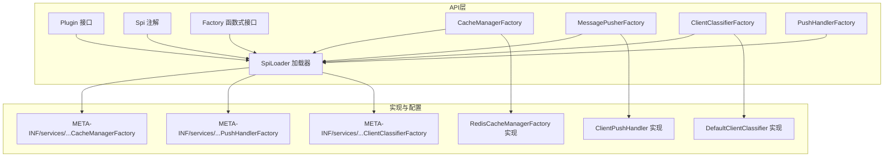
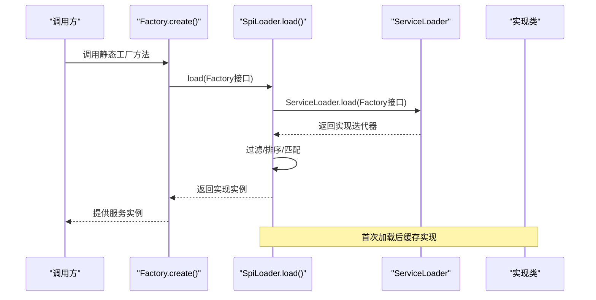
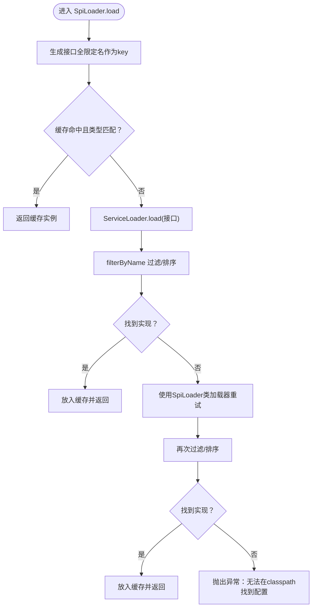
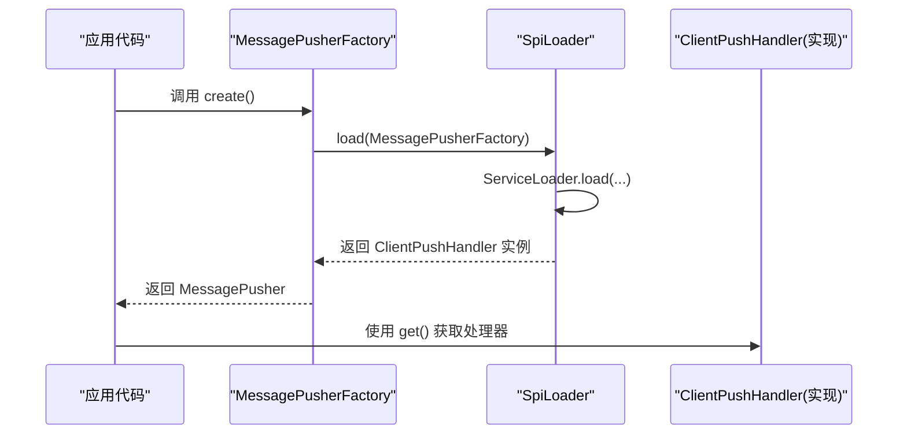
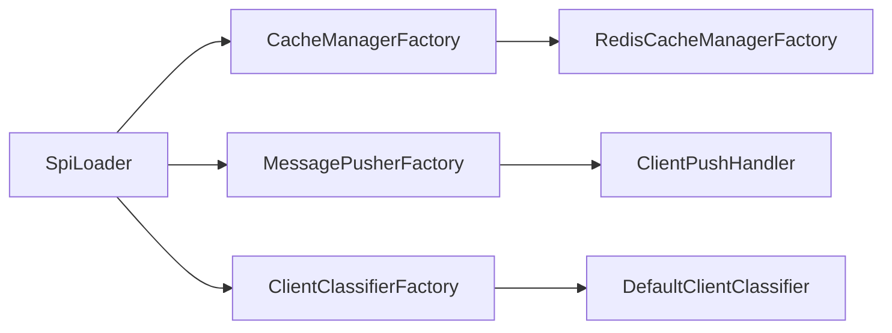

# SPI插件机制

<cite>
**本文引用的文件**
- [mpush-api/src/main/java/com/mpush/api/spi/Plugin.java](file://mpush-api/src/main/java/com/mpush/api/spi/Plugin.java)
- [mpush-api/src/main/java/com/mpush/api/spi/Spi.java](file://mpush-api/src/main/java/com/mpush/api/spi/Spi.java)
- [mpush-api/src/main/java/com/mpush/api/spi/Factory.java](file://mpush-api/src/main/java/com/mpush/api/spi/Factory.java)
- [mpush-api/src/main/java/com/mpush/api/spi/SpiLoader.java](file://mpush-api/src/main/java/com/mpush/api/spi/SpiLoader.java)
- [mpush-api/src/main/java/com/mpush/api/spi/common/CacheManagerFactory.java](file://mpush-api/src/main/java/com/mpush/api/spi/common/CacheManagerFactory.java)
- [mpush-api/src/main/java/com/mpush/api/spi/push/MessagePusherFactory.java](file://mpush-api/src/main/java/com/mpush/api/spi/push/MessagePusherFactory.java)
- [mpush-api/src/main/java/com/mpush/api/spi/router/ClientClassifierFactory.java](file://mpush-api/src/main/java/com/mpush/api/spi/router/ClientClassifierFactory.java)
- [mpush-api/src/main/java/com/mpush/api/spi/handler/PushHandlerFactory.java](file://mpush-api/src/main/java/com/mpush/api/spi/handler/PushHandlerFactory.java)
- [mpush-cache/src/main/resources/META-INF/services/com.mpush.api.spi.common.CacheManagerFactory](file://mpush-cache/src/main/resources/META-INF/services/com.mpush.api.spi.common.CacheManagerFactory)
- [mpush-core/src/main/resources/META-INF/services/com.mpush.api.spi.handler.PushHandlerFactory](file://mpush-core/src/main/resources/META-INF/services/com.mpush.api.spi.handler.PushHandlerFactory)
- [mpush-common/src/main/resources/META-INF/services/com.mpush.api.spi.router.ClientClassifierFactory](file://mpush-common/src/main/resources/META-INF/services/com.mpush.api.spi.router.ClientClassifierFactory)
- [mpush-client/src/main/resources/META-INF/services/com.mpush.api.spi.client.PusherFactory](file://mpush-client/src/main/resources/META-INF/services/com.mpush.api.spi.client.PusherFactory)
- [mpush-cache/src/main/java/com/mpush/cache/redis/manager/RedisCacheManagerFactory.java](file://mpush-cache/src/main/java/com/mpush/cache/redis/manager/RedisCacheManagerFactory.java)
- [mpush-core/src/main/java/com/mpush/core/handler/ClientPushHandler.java](file://mpush-core/src/main/java/com/mpush/core/handler/ClientPushHandler.java)
- [mpush-common/src/main/java/com/mpush/common/router/DefaultClientClassifier.java](file://mpush-common/src/main/java/com/mpush/common/router/DefaultClientClassifier.java)
</cite>

## 目录
1. [简介](#简介)
2. [项目结构](#项目结构)
3. [核心组件](#核心组件)
4. [架构总览](#架构总览)
5. [详细组件分析](#详细组件分析)
6. [依赖分析](#依赖分析)
7. [性能考虑](#性能考虑)
8. [故障排查指南](#故障排查指南)
9. [结论](#结论)
10. [附录](#附录)

## 简介
本文件系统性阐述MPush中Service Provider Interface（SPI）插件机制的设计与实现，覆盖以下关键主题：
- Plugin接口的生命周期管理（init与destroy默认方法）
- Factory工厂模式的抽象与静态便捷入口
- Spi注解用于命名与排序控制
- SpiLoader加载器的查找、过滤与缓存策略
- SPI配置文件的规范写法（META-INF/services目录、接口全限定名文件、实现类注册）
- 插件开发全流程：接口定义、实现类编写、配置文件生成、打包与部署
- 在消息处理器、连接管理器、路由分类器等模块中的应用与最佳实践

## 项目结构
MPush将SPI能力集中在api模块，并通过各功能模块（如core、common、cache、client等）提供具体实现与配置文件。核心SPI相关文件分布如下：
- api层：定义Plugin、Spi、Factory、SpiLoader及各类Factory接口
- 各功能模块：提供具体实现类并在资源目录下放置META-INF/services配置文件

图表来源
- [mpush-api/src/main/java/com/mpush/api/spi/Plugin.java](file://mpush-api/src/main/java/com/mpush/api/spi/Plugin.java#L29-L38)
- [mpush-api/src/main/java/com/mpush/api/spi/Spi.java](file://mpush-api/src/main/java/com/mpush/api/spi/Spi.java#L32-L48)
- [mpush-api/src/main/java/com/mpush/api/spi/Factory.java](file://mpush-api/src/main/java/com/mpush/api/spi/Factory.java#L30-L31)
- [mpush-api/src/main/java/com/mpush/api/spi/SpiLoader.java](file://mpush-api/src/main/java/com/mpush/api/spi/SpiLoader.java#L25-L96)
- [mpush-api/src/main/java/com/mpush/api/spi/common/CacheManagerFactory.java](file://mpush-api/src/main/java/com/mpush/api/spi/common/CacheManagerFactory.java#L30-L34)
- [mpush-api/src/main/java/com/mpush/api/spi/push/MessagePusherFactory.java](file://mpush-api/src/main/java/com/mpush/api/spi/push/MessagePusherFactory.java#L30-L35)
- [mpush-api/src/main/java/com/mpush/api/spi/router/ClientClassifierFactory.java](file://mpush-api/src/main/java/com/mpush/api/spi/router/ClientClassifierFactory.java#L31-L36)
- [mpush-api/src/main/java/com/mpush/api/spi/handler/PushHandlerFactory.java](file://mpush-api/src/main/java/com/mpush/api/spi/handler/PushHandlerFactory.java#L31-L35)
- [mpush-cache/src/main/resources/META-INF/services/com.mpush.api.spi.common.CacheManagerFactory](file://mpush-cache/src/main/resources/META-INF/services/com.mpush.api.spi.common.CacheManagerFactory#L1-L1)
- [mpush-core/src/main/resources/META-INF/services/com.mpush.api.spi.handler.PushHandlerFactory](file://mpush-core/src/main/resources/META-INF/services/com.mpush.api.spi.handler.PushHandlerFactory#L1-L1)
- [mpush-common/src/main/resources/META-INF/services/com.mpush.api.spi.router.ClientClassifierFactory](file://mpush-common/src/main/resources/META-INF/services/com.mpush.api.spi.router.ClientClassifierFactory#L1-L1)

章节来源
- [mpush-api/src/main/java/com/mpush/api/spi/Plugin.java](file://mpush-api/src/main/java/com/mpush/api/spi/Plugin.java#L29-L38)
- [mpush-api/src/main/java/com/mpush/api/spi/Spi.java](file://mpush-api/src/main/java/com/mpush/api/spi/Spi.java#L32-L48)
- [mpush-api/src/main/java/com/mpush/api/spi/Factory.java](file://mpush-api/src/main/java/com/mpush/api/spi/Factory.java#L30-L31)
- [mpush-api/src/main/java/com/mpush/api/spi/SpiLoader.java](file://mpush-api/src/main/java/com/mpush/api/spi/SpiLoader.java#L25-L96)

## 核心组件
- Plugin接口：定义插件生命周期，默认空实现，便于按需覆写init与destroy
- Spi注解：提供value（名称）与order（排序）两个属性，用于实现类命名与优先级排序
- Factory函数式接口：统一工厂抽象，配合静态create方法简化获取实例
- SpiLoader加载器：基于JDK ServiceLoader进行SPI发现、过滤与缓存，支持按名称精确匹配与按order排序选择

章节来源
- [mpush-api/src/main/java/com/mpush/api/spi/Plugin.java](file://mpush-api/src/main/java/com/mpush/api/spi/Plugin.java#L29-L38)
- [mpush-api/src/main/java/com/mpush/api/spi/Spi.java](file://mpush-api/src/main/java/com/mpush/api/spi/Spi.java#L32-L48)
- [mpush-api/src/main/java/com/mpush/api/spi/Factory.java](file://mpush-api/src/main/java/com/mpush/api/spi/Factory.java#L30-L31)
- [mpush-api/src/main/java/com/mpush/api/spi/SpiLoader.java](file://mpush-api/src/main/java/com/mpush/api/spi/SpiLoader.java#L25-L96)

## 架构总览
SPI机制在MPush中的工作流如下：
- 应用启动或需要某类服务时，调用对应Factory的静态create方法
- Factory内部委托SpiLoader.load(clazz)完成SPI查找
- SpiLoader使用ServiceLoader遍历classpath下的META-INF/services配置
- 若存在多个实现，按Spi注解的order进行排序，取第一个；若指定名称，则精确匹配类名或简单名
- 结果被缓存，后续直接返回，避免重复扫描

图表来源
- [mpush-api/src/main/java/com/mpush/api/spi/SpiLoader.java](file://mpush-api/src/main/java/com/mpush/api/spi/SpiLoader.java#L32-L66)
- [mpush-api/src/main/java/com/mpush/api/spi/common/CacheManagerFactory.java](file://mpush-api/src/main/java/com/mpush/api/spi/common/CacheManagerFactory.java#L31-L33)
- [mpush-api/src/main/java/com/mpush/api/spi/push/MessagePusherFactory.java](file://mpush-api/src/main/java/com/mpush/api/spi/push/MessagePusherFactory.java#L32-L34)
- [mpush-api/src/main/java/com/mpush/api/spi/router/ClientClassifierFactory.java](file://mpush-api/src/main/java/com/mpush/api/spi/router/ClientClassifierFactory.java#L33-L35)
- [mpush-api/src/main/java/com/mpush/api/spi/handler/PushHandlerFactory.java](file://mpush-api/src/main/java/com/mpush/api/spi/handler/PushHandlerFactory.java#L32-L34)

## 详细组件分析

### Plugin接口与生命周期
- 设计要点
  - 默认空实现，允许插件按需实现init与destroy
  - 与上下文集成：init接收MPushContext，便于访问全局配置与资源
- 典型用法
  - 在init中完成资源初始化、监听器注册、定时任务启动等
  - 在destroy中释放资源、取消订阅、关闭连接等

章节来源
- [mpush-api/src/main/java/com/mpush/api/spi/Plugin.java](file://mpush-api/src/main/java/com/mpush/api/spi/Plugin.java#L31-L37)

### Spi注解与排序
- 属性说明
  - value：实现类的可选名称标识
  - order：整数排序值，数值越小优先级越高
- 使用场景
  - 多实现共存时，通过order确定首选实现
  - 指定名称时，可通过SpiLoader按名称精确匹配

章节来源
- [mpush-api/src/main/java/com/mpush/api/spi/Spi.java](file://mpush-api/src/main/java/com/mpush/api/spi/Spi.java#L39-L46)

### Factory工厂模式
- 统一抽象
  - Factory为Supplier<T>的别名，约定get()方法返回具体实例
- 静态便捷入口
  - 各Factory接口提供静态create()方法，内部委托SpiLoader.load(clazz).get()

章节来源
- [mpush-api/src/main/java/com/mpush/api/spi/Factory.java](file://mpush-api/src/main/java/com/mpush/api/spi/Factory.java#L30-L31)
- [mpush-api/src/main/java/com/mpush/api/spi/common/CacheManagerFactory.java](file://mpush-api/src/main/java/com/mpush/api/spi/common/CacheManagerFactory.java#L31-L33)
- [mpush-api/src/main/java/com/mpush/api/spi/push/MessagePusherFactory.java](file://mpush-api/src/main/java/com/mpush/api/spi/push/MessagePusherFactory.java#L32-L34)
- [mpush-api/src/main/java/com/mpush/api/spi/router/ClientClassifierFactory.java](file://mpush-api/src/main/java/com/mpush/api/spi/router/ClientClassifierFactory.java#L33-L35)
- [mpush-api/src/main/java/com/mpush/api/spi/handler/PushHandlerFactory.java](file://mpush-api/src/main/java/com/mpush/api/spi/handler/PushHandlerFactory.java#L32-L34)

### SpiLoader加载器
- 关键逻辑
  - 缓存：以接口全限定名为key缓存已加载实例
  - 查找：优先使用当前线程上下文类加载器，失败则回退到SpiLoader.class.getClassLoader()
  - 过滤：当未指定名称时，按Spi.order升序排序，取首个；当指定名称时，精确匹配类名或简单名
  - 异常：找不到实现时抛出IllegalStateException
- 性能特性
  - 单例缓存避免重复扫描，提升运行时性能

图表来源
- [mpush-api/src/main/java/com/mpush/api/spi/SpiLoader.java](file://mpush-api/src/main/java/com/mpush/api/spi/SpiLoader.java#L32-L66)
- [mpush-api/src/main/java/com/mpush/api/spi/SpiLoader.java](file://mpush-api/src/main/java/com/mpush/api/spi/SpiLoader.java#L68-L95)

章节来源
- [mpush-api/src/main/java/com/mpush/api/spi/SpiLoader.java](file://mpush-api/src/main/java/com/mpush/api/spi/SpiLoader.java#L25-L96)

### SPI配置文件与实现类示例

#### 配置文件规范
- 目录结构：META-INF/services
- 文件命名：接口全限定名（例如com.mpush.api.spi.common.CacheManagerFactory）
- 文件内容：每行一个实现类的全限定名，支持空行

示例文件位置
- [mpush-cache/src/main/resources/META-INF/services/com.mpush.api.spi.common.CacheManagerFactory](file://mpush-cache/src/main/resources/META-INF/services/com.mpush.api.spi.common.CacheManagerFactory#L1-L1)
- [mpush-core/src/main/resources/META-INF/services/com.mpush.api.spi.handler.PushHandlerFactory](file://mpush-core/src/main/resources/META-INF/services/com.mpush.api.spi.handler.PushHandlerFactory#L1-L1)
- [mpush-common/src/main/resources/META-INF/services/com.mpush.api.spi.router.ClientClassifierFactory](file://mpush-common/src/main/resources/META-INF/services/com.mpush.api.spi.router.ClientClassifierFactory#L1-L1)
- [mpush-client/src/main/resources/META-INF/services/com.mpush.api.spi.client.PusherFactory](file://mpush-client/src/main/resources/META-INF/services/com.mpush.api.spi.client.PusherFactory#L1-L2)

#### 实现类示例
- RedisCacheManagerFactory：实现CacheManagerFactory，标注Spi(order=1)，get()返回单例
- ClientPushHandler：实现PushHandlerFactory，标注Spi(order=1)，继承BaseMessageHandler并实现get()
- DefaultClientClassifier：实现ClientClassifierFactory，标注Spi(order=1)，get()返回自身

章节来源
- [mpush-cache/src/main/java/com/mpush/cache/redis/manager/RedisCacheManagerFactory.java](file://mpush-cache/src/main/java/com/mpush/cache/redis/manager/RedisCacheManagerFactory.java#L31-L37)
- [mpush-core/src/main/java/com/mpush/core/handler/ClientPushHandler.java](file://mpush-core/src/main/java/com/mpush/core/handler/ClientPushHandler.java#L38-L61)
- [mpush-common/src/main/java/com/mpush/common/router/DefaultClientClassifier.java](file://mpush-common/src/main/java/com/mpush/common/router/DefaultClientClassifier.java#L31-L43)

### 工厂接口与加载序列图
以消息推送处理器为例，展示从Factory到实现类的加载路径。

图表来源
- [mpush-api/src/main/java/com/mpush/api/spi/push/MessagePusherFactory.java](file://mpush-api/src/main/java/com/mpush/api/spi/push/MessagePusherFactory.java#L30-L35)
- [mpush-api/src/main/java/com/mpush/api/spi/SpiLoader.java](file://mpush-api/src/main/java/com/mpush/api/spi/SpiLoader.java#L32-L66)
- [mpush-core/src/main/java/com/mpush/core/handler/ClientPushHandler.java](file://mpush-core/src/main/java/com/mpush/core/handler/ClientPushHandler.java#L38-L61)

## 依赖分析
SPI接口与实现之间的依赖关系清晰，遵循“接口在api、实现与配置在各自模块”的分层设计。

图表来源
- [mpush-api/src/main/java/com/mpush/api/spi/common/CacheManagerFactory.java](file://mpush-api/src/main/java/com/mpush/api/spi/common/CacheManagerFactory.java#L30-L34)
- [mpush-api/src/main/java/com/mpush/api/spi/push/MessagePusherFactory.java](file://mpush-api/src/main/java/com/mpush/api/spi/push/MessagePusherFactory.java#L30-L35)
- [mpush-api/src/main/java/com/mpush/api/spi/router/ClientClassifierFactory.java](file://mpush-api/src/main/java/com/mpush/api/spi/router/ClientClassifierFactory.java#L31-L36)
- [mpush-cache/src/main/java/com/mpush/cache/redis/manager/RedisCacheManagerFactory.java](file://mpush-cache/src/main/java/com/mpush/cache/redis/manager/RedisCacheManagerFactory.java#L32-L37)
- [mpush-core/src/main/java/com/mpush/core/handler/ClientPushHandler.java](file://mpush-core/src/main/java/com/mpush/core/handler/ClientPushHandler.java#L39-L61)
- [mpush-common/src/main/java/com/mpush/common/router/DefaultClientClassifier.java](file://mpush-common/src/main/java/com/mpush/common/router/DefaultClientClassifier.java#L32-L43)

章节来源
- [mpush-api/src/main/java/com/mpush/api/spi/SpiLoader.java](file://mpush-api/src/main/java/com/mpush/api/spi/SpiLoader.java#L25-L96)

## 性能考虑
- 缓存策略：SpiLoader对已加载的实现进行缓存，避免重复扫描，建议在应用启动阶段预热常用Factory
- 排序成本：多实现时按order排序会产生比较开销，建议合理设置order，减少实现数量或采用更细粒度的接口拆分
- 类加载器：优先使用线程上下文类加载器，确保在复杂容器环境下正确加载

## 故障排查指南
- 找不到实现
  - 现象：抛出IllegalStateException，提示无法在classpath找到配置
  - 排查：确认META-INF/services/接口全限定名文件是否存在、内容是否正确、实现类是否在当前类加载器可见范围内
- 多实现冲突
  - 现象：选择了非预期的实现
  - 排查：检查各实现类上的Spi注解order值，确保首选实现的order最小；必要时通过名称精确匹配
- 名称不匹配
  - 现象：按名称加载失败
  - 排查：确认传入的名称为实现类的全限定名或简单名之一

章节来源
- [mpush-api/src/main/java/com/mpush/api/spi/SpiLoader.java](file://mpush-api/src/main/java/com/mpush/api/spi/SpiLoader.java#L64-L65)
- [mpush-api/src/main/java/com/mpush/api/spi/SpiLoader.java](file://mpush-api/src/main/java/com/mpush/api/spi/SpiLoader.java#L85-L93)

## 结论
MPush的SPI机制通过简洁的接口抽象、明确的配置规范与高效的加载器实现，实现了模块间的松耦合与可插拔扩展。开发者只需遵循Factory接口与Spi注解约定、正确编写META-INF/services配置文件，即可快速接入新的实现并参与运行时选择。

## 附录

### SPI插件开发全流程
- 定义接口
  - 在mpush-api模块中新增或复用现有Factory接口，约定get()返回目标服务对象
- 编写实现
  - 在功能模块中实现该接口，添加Spi注解（可选value与order），实现get()返回实例
- 生成配置
  - 在资源目录resources/META-INF/services下创建以接口全限定名为名的文件，写入实现类全限定名
- 打包与部署
  - 将实现模块打包为jar，确保META-INF/services文件随实现类一起被打包
  - 在运行时classpath中包含该jar，确保类加载器可见
- 使用方式
  - 通过对应Factory的静态create()方法获取实例，内部由SpiLoader完成加载与缓存

参考文件
- [mpush-api/src/main/java/com/mpush/api/spi/common/CacheManagerFactory.java](file://mpush-api/src/main/java/com/mpush/api/spi/common/CacheManagerFactory.java#L30-L34)
- [mpush-cache/src/main/java/com/mpush/cache/redis/manager/RedisCacheManagerFactory.java](file://mpush-cache/src/main/java/com/mpush/cache/redis/manager/RedisCacheManagerFactory.java#L31-L37)
- [mpush-cache/src/main/resources/META-INF/services/com.mpush.api.spi.common.CacheManagerFactory](file://mpush-cache/src/main/resources/META-INF/services/com.mpush.api.spi.common.CacheManagerFactory#L1-L1)

### 应用场景与最佳实践
- 消息处理器
  - 使用PushHandlerFactory与SpiLoader，结合Spi(order)保证默认处理器优先级
  - 参考实现：ClientPushHandler
- 连接管理器
  - 建议在连接建立/断开事件中通过Plugin.init/destroy进行资源管理
- 路由分类器
  - 使用ClientClassifierFactory与Spi(order)区分默认与自定义分类策略
  - 参考实现：DefaultClientClassifier

章节来源
- [mpush-core/src/main/java/com/mpush/core/handler/ClientPushHandler.java](file://mpush-core/src/main/java/com/mpush/core/handler/ClientPushHandler.java#L38-L61)
- [mpush-common/src/main/java/com/mpush/common/router/DefaultClientClassifier.java](file://mpush-common/src/main/java/com/mpush/common/router/DefaultClientClassifier.java#L31-L43)
- [mpush-api/src/main/java/com/mpush/api/spi/Plugin.java](file://mpush-api/src/main/java/com/mpush/api/spi/Plugin.java#L31-L37)