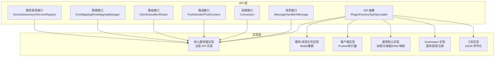
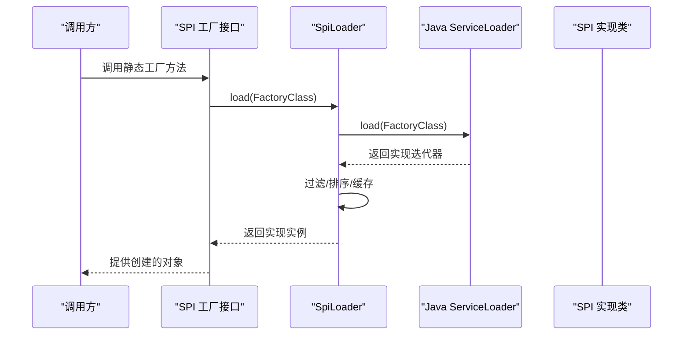
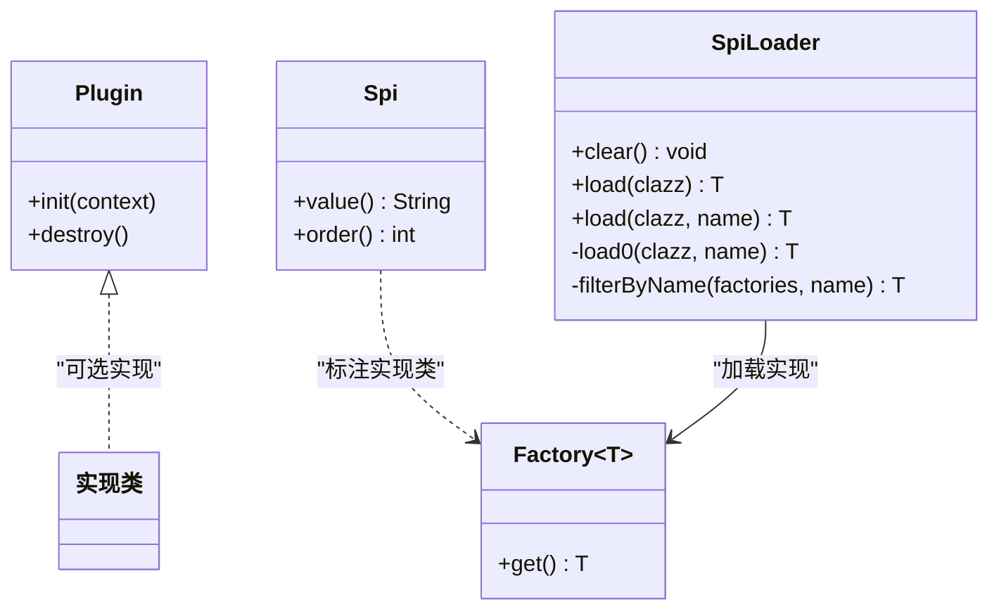
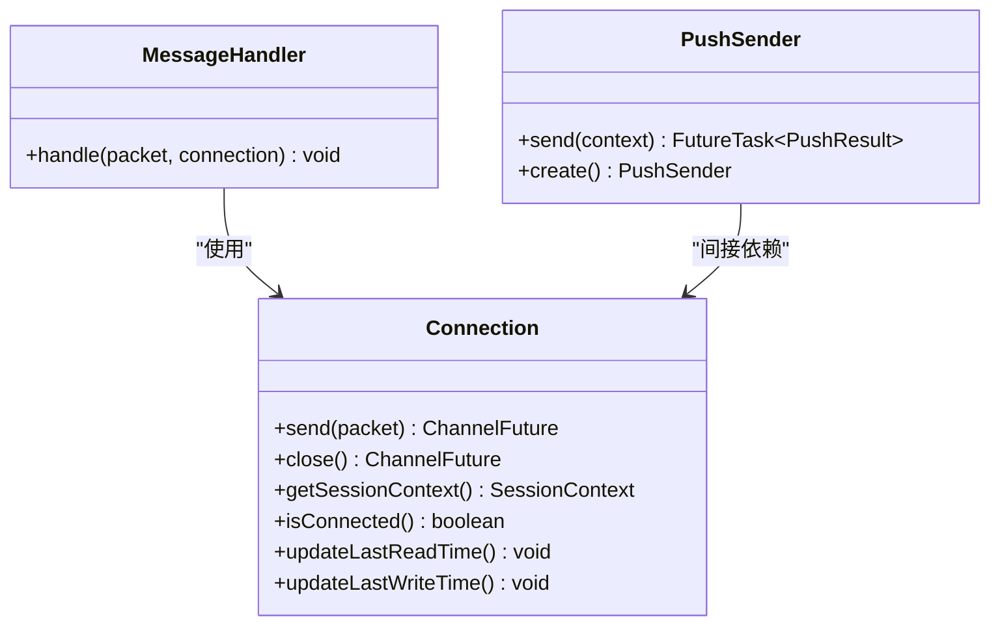
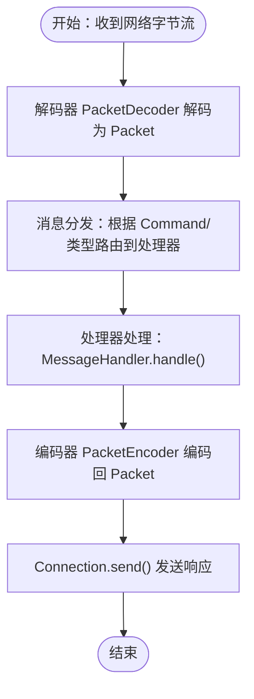
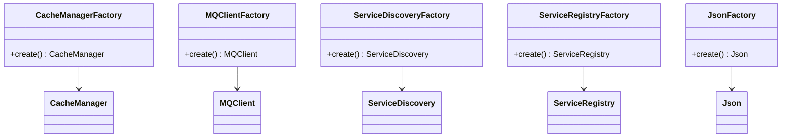

# 扩展开发

<cite>
**本文引用的文件**
- [mpush-api/src/main/java/com/mpush/api/spi/Plugin.java](file://mpush-api/src/main/java/com/mpush/api/spi/Plugin.java)
- [mpush-api/src/main/java/com/mpush/api/spi/SpiLoader.java](file://mpush-api/src/main/java/com/mpush/api/spi/SpiLoader.java)
- [mpush-api/src/main/java/com/mpush/api/spi/Factory.java](file://mpush-api/src/main/java/com/mpush/api/spi/Factory.java)
- [mpush-api/src/main/java/com/mpush/api/spi/Spi.java](file://mpush-api/src/main/java/com/mpush/api/spi/Spi.java)
- [mpush-api/src/main/java/com/mpush/api/message/MessageHandler.java](file://mpush-api/src/main/java/com/mpush/api/message/MessageHandler.java)
- [mpush-api/src/main/java/com/mpush/api/connection/Connection.java](file://mpush-api/src/main/java/com/mpush/api/connection/Connection.java)
- [mpush-api/src/main/java/com/mpush/api/push/PushSender.java](file://mpush-api/src/main/java/com/mpush/api/push/PushSender.java)
- [mpush-api/src/main/java/com/mpush/api/spi/client/PusherFactory.java](file://mpush-api/src/main/java/com/mpush/api/spi/client/PusherFactory.java)
- [mpush-api/src/main/java/com/mpush/api/spi/common/CacheManagerFactory.java](file://mpush-api/src/main/java/com/mpush/api/spi/common/CacheManagerFactory.java)
- [mpush-api/src/main/java/com/mpush/api/spi/common/MQClientFactory.java](file://mpush-api/src/main/java/com/mpush/api/spi/common/MQClientFactory.java)
- [mpush-api/src/main/java/com/mpush/api/spi/common/ExecutorFactory.java](file://mpush-api/src/main/java/com/mpush/api/spi/common/ExecutorFactory.java)
- [mpush-api/src/main/java/com/mpush/api/spi/router/ClientClassifierFactory.java](file://mpush-api/src/main/java/com/mpush/api/spi/router/ClientClassifierFactory.java)
- [mpush-api/src/main/java/com/mpush/api/spi/handler/PushHandlerFactory.java](file://mpush-api/src/main/java/com/mpush/api/spi/handler/PushHandlerFactory.java)
- [mpush-api/src/main/java/com/mpush/api/spi/push/IPushMessage.java](file://mpush-api/src/main/java/com/mpush/api/spi/push/IPushMessage.java)
- [mpush-api/src/main/java/com/mpush/api/spi/push/MessagePusher.java](file://mpush-api/src/main/java/com/mpush/api/spi/push/MessagePusher.java)
- [mpush-api/src/main/java/com/mpush/api/spi/push/MessagePusherFactory.java](file://mpush-api/src/main/java/com/mpush/api/spi/push/MessagePusherFactory.java)
- [mpush-api/src/main/java/com/mpush/api/spi/push/PushListener.java](file://mpush-api/src/main/java/com/mpush/api/spi/push/PushListener.java)
- [mpush-api/src/main/java/com/mpush/api/spi/push/PushListenerFactory.java](file://mpush-api/src/main/java/com/mpush/api/spi/push/PushListenerFactory.java)
- [mpush-api/src/main/java/com/mpush/api/spi/core/RsaCipherFactory.java](file://mpush-api/src/main/java/com/mpush/api/spi/core/RsaCipherFactory.java)
- [mpush-api/src/main/java/com/mpush/api/spi/core/ServerEventListenerFactory.java](file://mpush-api/src/main/java/com/mpush/api/spi/core/ServerEventListenerFactory.java)
- [mpush-api/src/main/java/com/mpush/api/spi/net/DnsMapping.java](file://mpush-api/src/main/java/com/mpush/api/spi/net/DnsMapping.java)
- [mpush-api/src/main/java/com/mpush/api/spi/net/DnsMappingManager.java](file://mpush-api/src/main/java/com/mpush/api/spi/net/DnsMappingManager.java)
- [mpush-api/src/main/java/com/mpush/api/spi/common/ServiceDiscoveryFactory.java](file://mpush-api/src/main/java/com/mpush/api/spi/common/ServiceDiscoveryFactory.java)
- [mpush-api/src/main/java/com/mpush/api/spi/common/ServiceRegistryFactory.java](file://mpush-api/src/main/java/com/mpush/api/spi/common/ServiceRegistryFactory.java)
- [mpush-api/src/main/java/com/mpush/api/spi/common/JsonFactory.java](file://mpush-api/src/main/java/com/mpush/api/spi/common/JsonFactory.java)
- [mpush-api/src/main/java/com/mpush/api/spi/common/CacheManager.java](file://mpush-api/src/main/java/com/mpush/api/spi/common/CacheManager.java)
- [mpush-api/src/main/java/com/mpush/api/spi/common/MQClient.java](file://mpush-api/src/main/java/com/mpush/api/spi/common/MQClient.java)
- [mpush-api/src/main/java/com/mpush/api/spi/common/Json.java](file://mpush-api/src/main/java/com/mpush/api/spi/common/Json.java)
- [mpush-api/src/main/java/com/mpush/api/spi/common/MQMessageReceiver.java](file://mpush-api/src/main/java/com/mpush/api/spi/common/MQMessageReceiver.java)
- [mpush-api/src/main/java/com/mpush/api/router/ClientClassifier.java](file://mpush-api/src/main/java/com/mpush/api/router/ClientClassifier.java)
- [mpush-api/src/main/java/com/mpush/api/router/Router.java](file://mpush-api/src/main/java/com/mpush/api/router/Router.java)
- [mpush-api/src/main/java/com/mpush/api/router/RouterManager.java](file://mpush-api/src/main/java/com/mpush/api/router/RouterManager.java)
- [mpush-api/src/main/java/com/mpush/api/connection/Cipher.java](file://mpush-api/src/main/java/com/mpush/api/connection/Cipher.java)
- [mpush-api/src/main/java/com/mpush/api/connection/ConnectionManager.java](file://mpush-api/src/main/java/com/mpush/api/connection/ConnectionManager.java)
- [mpush-api/src/main/java/com/mpush/api/connection/SessionContext.java](file://mpush-api/src/main/java/com/mpush/api/connection/SessionContext.java)
- [mpush-api/src/main/java/com/mpush/api/message/Message.java](file://mpush-api/src/main/java/com/mpush/api/message/Message.java)
- [mpush-api/src/main/java/com/mpush/api/message/PacketReceiver.java](file://mpush-api/src/main/java/com/mpush/api/message/PacketReceiver.java)
- [mpush-api/src/main/java/com/mpush/api/protocol/Command.java](file://mpush-api/src/main/java/com/mpush/api/protocol/Command.java)
- [mpush-api/src/main/java/com/mpush/api/protocol/Packet.java](file://mpush-api/src/main/java/com/mpush/api/protocol/Packet.java)
- [mpush-api/src/main/java/com/mpush/api/protocol/JsonPacket.java](file://mpush-api/src/main/java/com/mpush/api/protocol/JsonPacket.java)
- [mpush-api/src/main/java/com/mpush/api/protocol/UDPPacket.java](file://mpush-api/src/main/java/com/mpush/api/protocol/UDPPacket.java)
- [mpush-api/src/main/java/com/mpush/api/push/PushContext.java](file://mpush-api/src/main/java/com/mpush/api/push/PushContext.java)
- [mpush-api/src/main/java/com/mpush/api/push/PushResult.java](file://mpush-api/src/main/java/com/mpush/api/push/PushResult.java)
- [mpush-api/src/main/java/com/mpush/api/push/PushCallback.java](file://mpush-api/src/main/java/com/mpush/api/push/PushCallback.java)
- [mpush-api/src/main/java/com/mpush/api/push/AckModel.java](file://mpush-api/src/main/java/com/mpush/api/push/AckModel.java)
- [mpush-api/src/main/java/com/mpush/api/push/MsgType.java](file://mpush-api/src/main/java/com/mpush/api/push/MsgType.java)
- [mpush-api/src/main/java/com/mpush/api/push/PushException.java](file://mpush-api/src/main/java/com/mpush/api/push/PushException.java)
- [mpush-api/src/main/java/com/mpush/api/push/BroadcastController.java](file://mpush-api/src/main/java/com/mpush/api/push/BroadcastController.java)
- [mpush-api/src/main/java/com/mpush/api/service/BaseService.java](file://mpush-api/src/main/java/com/mpush/api/service/BaseService.java)
- [mpush-api/src/main/java/com/mpush/api/service/Service.java](file://mpush-api/src/main/java/com/mpush/api/service/Service.java)
- [mpush-api/src/main/java/com/mpush/api/service/ServiceException.java](file://mpush-api/src/main/java/com/mpush/api/service/ServiceException.java)
- [mpush-api/src/main/java/com/mpush/api/srd/ServiceDiscovery.java](file://mpush-api/src/main/java/com/mpush/api/srd/ServiceDiscovery.java)
- [mpush-api/src/main/java/com/mpush/api/srd/ServiceRegistry.java](file://mpush-api/src/main/java/com/mpush/api/srd/ServiceRegistry.java)
- [mpush-api/src/main/java/com/mpush/api/srd/ServiceNames.java](file://mpush-api/src/main/java/com/mpush/api/srd/ServiceNames.java)
- [mpush-api/src/main/java/com/mpush/api/srd/CommonServiceNode.java](file://mpush-api/src/main/java/com/mpush/api/srd/CommonServiceNode.java)
- [mpush-api/src/main/java/com/mpush/api/srd/ServiceEvent.java](file://mpush-api/src/main/java/com/mpush/api/srd/ServiceEvent.java)
- [mpush-api/src/main/java/com/mpush/api/srd/ServiceListener.java](file://mpush-api/src/main/java/com/mpush/api/srd/ServiceListener.java)
- [mpush-api/src/main/java/com/mpush/api/srd/ServiceNode.java](file://mpush-api/src/main/java/com/mpush/api/srd/ServiceNode.java)
- [mpush-api/src/main/java/com/mpush/api/Constants.java](file://mpush-api/src/main/java/com/mpush/api/Constants.java)
- [mpush-api/src/main/java/com/mpush/api/MPushContext.java](file://mpush-api/src/main/java/com/mpush/api/MPushContext.java)
- [mpush-cache/src/resources/META-INF/services/com.mpush.api.spi.common.CacheManagerFactory](file://mpush-cache/src/resources/META-INF/services/com.mpush.api.spi.common.CacheManagerFactory)
- [mpush-cache/src/resources/META-INF/services/com.mpush.api.spi.common.MQClientFactory](file://mpush-cache/src/resources/META-INF/services/com.mpush.api.spi.common.MQClientFactory)
- [mpush-client/src/resources/META-INF/services/com.mpush.api.spi.client.PusherFactory](file://mpush-client/src/resources/META-INF/services/com.mpush.api.spi.client.PusherFactory)
- [mpush-client/src/resources/META-INF/services/com.mpush.api.spi.common.ExecutorFactory](file://mpush-client/src/resources/META-INF/services/com.mpush.api.spi.common.ExecutorFactory)
- [mpush-common/src/resources/META-INF/services/com.mpush.api.spi.core.RsaCipherFactory](file://mpush-common/src/resources/META-INF/services/com.mpush.api.spi.core.RsaCipherFactory)
- [mpush-common/src/resources/META-INF/services/com.mpush.api.spi.net.DnsMappingManager](file://mpush-common/src/resources/META-INF/services/com.mpush.api.spi.net.DnsMappingManager)
- [mpush-common/src/resources/META-INF/services/com.mpush.api.spi.router.ClientClassifierFactory](file://mpush-common/src/resources/META-INF/services/com.mpush.api.spi.router.ClientClassifierFactory)
- [mpush-core/src/main/resources/META-INF/services/com.mpush.api.spi.common.ExecutorFactory](file://mpush-core/src/main/resources/META-INF/services/com.mpush.api.spi.common.ExecutorFactory)
- [mpush-core/src/main/resources/META-INF/services/com.mpush.api.spi.core.ServerEventListenerFactory](file://mpush-core/src/main/resources/META-INF/services/com.mpush.api.spi.core.ServerEventListenerFactory)
- [mpush-core/src/main/resources/META-INF/services/com.mpush.api.spi.handler.BindValidatorFactory](file://mpush-core/src/main/resources/META-INF/services/com.mpush.api.spi.handler.BindValidatorFactory)
- [mpush-core/src/main/resources/META-INF/services/com.mpush.api.spi.handler.PushHandlerFactory](file://mpush-core/src/main/resources/META-INF/services/com.mpush.api.spi.handler.PushHandlerFactory)
- [mpush-core/src/main/resources/META-INF/services/com.mpush.api.spi.push.PushListenerFactory](file://mpush-core/src/main/resources/META-INF/services/com.mpush.api.spi.push.PushListenerFactory)
- [mpush-test/src/main/resources/META-INF/services/com.mpush.api.spi.common.CacheManagerFactory](file://mpush-test/src/main/resources/META-INF/services/com.mush.api.spi.common.CacheManagerFactory)
- [mpush-test/src/main/resources/META-INF/services/com.mpush.api.spi.common.MQClientFactory](file://mpush-test/src/main/resources/META-INF/services/com.mpush.api.spi.common.MQClientFactory)
- [mpush-test/src/main/resources/META-INF/services/com.mpush.api.spi.common.ServiceDiscoveryFactory](file://mpush-test/src/main/resources/META-INF/services/com.mpush.api.spi.common.ServiceDiscoveryFactory)
- [mpush-test/src/main/resources/META-INF/services/com.mpush.api.spi.common.ServiceRegistryFactory](file://mpush-test/src/main/resources/META-INF/services/com.mpush.api.spi.common.ServiceRegistryFactory)
- [mpush-tools/src/main/resources/META-INF/services/com.mpush.api.spi.common.JsonFactory](file://mpush-tools/src/main/resources/META-INF/services/com.mpush.api.spi.common.JsonFactory)
- [mpush-zk/src/resources/META-INF/services/com.mpush.api.spi.common.ServiceDiscoveryFactory](file://mpush-zk/src/resources/META-INF/services/com.mpush.api.spi.common.ServiceDiscoveryFactory)
- [mpush-zk/src/resources/META-INF/services/com.mpush.api.spi.common.ServiceRegistryFactory](file://mpush-zk/src/resources/META-INF/services/com.mpush.api.spi.common.ServiceRegistryFactory)
</cite>

## 目录
1. [简介](#简介)
2. [项目结构](#项目结构)
3. [核心组件](#核心组件)
4. [架构总览](#架构总览)
5. [详细组件分析](#详细组件分析)
6. [依赖分析](#依赖分析)
7. [性能考虑](#性能考虑)
8. [故障排查指南](#故障排查指南)
9. [结论](#结论)
10. [附录](#附录)

## 简介
本文件面向希望为 MPush 进行扩展开发的工程师，系统讲解 SPI（Service Provider Interface）插件机制的设计与使用，涵盖 Plugin 接口、Factory 工厂模式、SpiLoader 加载器的工作原理；并提供消息处理器、连接处理器、推送处理器等扩展开发方法；给出新增协议支持的开发步骤；介绍第三方集成（外部服务、数据库、缓存）的扩展点；最后总结插件打包、部署与配置（META-INF/services）、动态加载与最佳实践。

## 项目结构
MPush 将 API 定义与具体实现解耦，通过 SPI 抽象层在运行时按需加载实现。核心模块与职责概览：
- mpush-api：对外 API 与 SPI 抽象，定义 Plugin、Factory、Spi、SpiLoader、消息/连接/推送/路由/网络/服务发现等接口与工厂。
- mpush-core：核心服务器实现，注册各类 SPI 实现并通过资源目录暴露 META-INF/services。
- mpush-cache：缓存与消息队列实现示例，提供 CacheManagerFactory、MQClientFactory 的具体实现及服务注册。
- mpush-client：客户端侧的 PusherFactory、ExecutorFactory 等 SPI 实现示例。
- mpush-common：通用工具与默认实现示例（如 RsaCipherFactory、DnsMappingManager、ClientClassifierFactory）。
- mpush-tools：JSON 工具实现示例（JsonFactory）。
- mpush-zk：基于 ZooKeeper 的服务发现与注册实现示例（ServiceDiscoveryFactory、ServiceRegistryFactory）。
- mpush-test：测试模块，包含多种 SPI 实现示例与服务注册。



图表来源
- [mpush-api/src/main/java/com/mpush/api/spi/Plugin.java](file://mpush-api/src/main/java/com/mpush/api/spi/Plugin.java#L29-L38)
- [mpush-api/src/main/java/com/mpush/api/spi/SpiLoader.java](file://mpush-api/src/main/java/com/mpush/api/spi/SpiLoader.java#L25-L96)
- [mpush-api/src/main/java/com/mpush/api/spi/Factory.java](file://mpush-api/src/main/java/com/mpush/api/spi/Factory.java#L29-L31)
- [mpush-api/src/main/java/com/mpush/api/message/MessageHandler.java](file://mpush-api/src/main/java/com/mpush/api/message/MessageHandler.java#L30-L32)
- [mpush-api/src/main/java/com/mpush/api/connection/Connection.java](file://mpush-api/src/main/java/com/mpush/api/connection/Connection.java#L32-L62)
- [mpush-api/src/main/java/com/mpush/api/push/PushSender.java](file://mpush-api/src/main/java/com/mpush/api/push/PushSender.java#L33-L71)

章节来源
- [mpush-api/src/main/java/com/mpush/api/spi/Plugin.java](file://mpush-api/src/main/java/com/mpush/api/spi/Plugin.java#L29-L38)
- [mpush-api/src/main/java/com/mpush/api/spi/SpiLoader.java](file://mpush-api/src/main/java/com/mpush/api/spi/SpiLoader.java#L25-L96)
- [mpush-api/src/main/java/com/mpush/api/spi/Factory.java](file://mpush-api/src/main/java/com/mpush/api/spi/Factory.java#L29-L31)

## 核心组件
- Plugin 接口：插件生命周期钩子，提供初始化与销毁回调，默认空实现，便于按需覆盖。
- Factory 接口：函数式工厂接口，统一对象创建方式，配合 SpiLoader 使用。
- Spi 注解：用于标注 SPI 实现类，支持命名与排序，影响选择逻辑。
- SpiLoader：SPI 加载器，负责从 classpath 的 META-INF/services 中发现实现，支持按名称过滤与排序选择，并带缓存。
- 消息处理接口 MessageHandler：定义消息处理契约，接收 Packet 与 Connection。
- 连接接口 Connection：抽象网络连接，提供发送、关闭、会话上下文等能力。
- 推送接口 PushSender：统一推送发送入口，支持多种重载与异步结果。

章节来源
- [mpush-api/src/main/java/com/mpush/api/spi/Plugin.java](file://mpush-api/src/main/java/com/mpush/api/spi/Plugin.java#L29-L38)
- [mpush-api/src/main/java/com/mpush/api/spi/Factory.java](file://mpush-api/src/main/java/com/mpush/api/spi/Factory.java#L29-L31)
- [mpush-api/src/main/java/com/mpush/api/spi/Spi.java](file://mpush-api/src/main/java/com/mpush/api/spi/Spi.java#L32-L48)
- [mpush-api/src/main/java/com/mpush/api/spi/SpiLoader.java](file://mpush-api/src/main/java/com/mpush/api/spi/SpiLoader.java#L25-L96)
- [mpush-api/src/main/java/com/mpush/api/message/MessageHandler.java](file://mpush-api/src/main/java/com/mpush/api/message/MessageHandler.java#L30-L32)
- [mpush-api/src/main/java/com/mpush/api/connection/Connection.java](file://mpush-api/src/main/java/com/mpush/api/connection/Connection.java#L32-L62)
- [mpush-api/src/main/java/com/mpush/api/push/PushSender.java](file://mpush-api/src/main/java/com/mpush/api/push/PushSender.java#L33-L71)

## 架构总览
SPI 机制通过注解与工厂接口抽象，运行时由 SpiLoader 基于 Java 标准 ServiceLoader 发现实现。核心流程如下：



图表来源
- [mpush-api/src/main/java/com/mpush/api/spi/client/PusherFactory.java](file://mpush-api/src/main/java/com/mpush/api/spi/client/PusherFactory.java#L31-L35)
- [mpush-api/src/main/java/com/mpush/api/spi/SpiLoader.java](file://mpush-api/src/main/java/com/mpush/api/spi/SpiLoader.java#L32-L66)
- [mpush-api/src/main/java/com/mpush/api/spi/Factory.java](file://mpush-api/src/main/java/com/mpush/api/spi/Factory.java#L29-L31)

## 详细组件分析

### SPI 插件机制与加载器
- Plugin：插件生命周期接口，可选实现 init/destroy。
- Factory：函数式工厂接口，统一 get() 创建对象的方式。
- Spi：实现类注解，支持 value() 命名与 order() 排序。
- SpiLoader：核心加载器，优先从当前类加载器加载，支持按名称精确匹配或按 order 排序选择首个实现，失败抛出异常并提示缺失 META-INF/services 文件。



图表来源
- [mpush-api/src/main/java/com/mpush/api/spi/Plugin.java](file://mpush-api/src/main/java/com/mpush/api/spi/Plugin.java#L29-L38)
- [mpush-api/src/main/java/com/mpush/api/spi/Factory.java](file://mpush-api/src/main/java/com/mpush/api/spi/Factory.java#L29-L31)
- [mpush-api/src/main/java/com/mpush/api/spi/Spi.java](file://mpush-api/src/main/java/com/mpush/api/spi/Spi.java#L32-L48)
- [mpush-api/src/main/java/com/mpush/api/spi/SpiLoader.java](file://mpush-api/src/main/java/com/mpush/api/spi/SpiLoader.java#L25-L96)

章节来源
- [mpush-api/src/main/java/com/mpush/api/spi/Plugin.java](file://mpush-api/src/main/java/com/mpush/api/spi/Plugin.java#L29-L38)
- [mpush-api/src/main/java/com/mpush/api/spi/Factory.java](file://mpush-api/src/main/java/com/mpush/api/spi/Factory.java#L29-L31)
- [mpush-api/src/main/java/com/mpush/api/spi/Spi.java](file://mpush-api/src/main/java/com/mpush/api/spi/Spi.java#L32-L48)
- [mpush-api/src/main/java/com/mpush/api/spi/SpiLoader.java](file://mpush-api/src/main/java/com/mpush/api/spi/SpiLoader.java#L25-L96)

### 工厂模式与消息/连接/推送处理器
- 消息处理器：实现 MessageHandler.handle(packet, connection)，在核心服务器中被路由到对应处理器。
- 连接接口：Connection 提供发送、关闭、超时检测、会话上下文等能力，是消息处理的基础载体。
- 推送发送器：PushSender 统一推送入口，支持多种重载与异步结果返回。



图表来源
- [mpush-api/src/main/java/com/mpush/api/message/MessageHandler.java](file://mpush-api/src/main/java/com/mpush/api/message/MessageHandler.java#L30-L32)
- [mpush-api/src/main/java/com/mpush/api/connection/Connection.java](file://mpush-api/src/main/java/com/mpush/api/connection/Connection.java#L32-L62)
- [mpush-api/src/main/java/com/mpush/api/push/PushSender.java](file://mpush-api/src/main/java/com/mpush/api/push/PushSender.java#L33-L71)

章节来源
- [mpush-api/src/main/java/com/mpush/api/message/MessageHandler.java](file://mpush-api/src/main/java/com/mpush/api/message/MessageHandler.java#L30-L32)
- [mpush-api/src/main/java/com/mpush/api/connection/Connection.java](file://mpush-api/src/main/java/com/mpush/api/connection/Connection.java#L32-L62)
- [mpush-api/src/main/java/com/mpush/api/push/PushSender.java](file://mpush-api/src/main/java/com/mpush/api/push/PushSender.java#L33-L71)

### 开发自定义处理器（消息/连接/推送）
- 消息处理器开发要点
  - 实现 MessageHandler 接口，定义 handle(packet, connection) 业务逻辑。
  - 在实现类上使用 @Spi(value="yourName", order=N) 注解，确保被 SpiLoader 正确识别与排序。
  - 将实现类注册到 META-INF/services 对应的工厂接口文件中，以便运行时发现。
  - 在核心服务器中，根据 Command 或 Packet 类型路由到你的处理器。
- 连接处理器开发要点
  - 基于 Connection 接口抽象，关注发送、关闭、超时与会话上下文管理。
  - 如需自定义加密/解密，可实现 Cipher 并通过 RsaCipherFactory 注册。
- 推送处理器开发要点
  - 实现 PushSender 接口，提供 send(context) 的异步推送能力。
  - 支持 PushContext 参数构建，结合 AckModel、PushCallback 处理结果。
  - 通过 PusherFactory 暴露静态工厂方法，便于外部调用。

章节来源
- [mpush-api/src/main/java/com/mpush/api/message/MessageHandler.java](file://mpush-api/src/main/java/com/mpush/api/message/MessageHandler.java#L30-L32)
- [mpush-api/src/main/java/com/mpush/api/connection/Connection.java](file://mpush-api/src/main/java/com/mpush/api/connection/Connection.java#L32-L62)
- [mpush-api/src/main/java/com/mpush/api/push/PushSender.java](file://mpush-api/src/main/java/com/mpush/api/push/PushSender.java#L33-L71)
- [mpush-api/src/main/java/com/mpush/api/spi/handler/PushHandlerFactory.java](file://mpush-api/src/main/java/com/mpush/api/spi/handler/PushHandlerFactory.java#L31-L35)
- [mpush-api/src/main/java/com/mpush/api/spi/client/PusherFactory.java](file://mpush-api/src/main/java/com/mpush/api/spi/client/PusherFactory.java#L31-L35)
- [mpush-api/src/main/java/com/mpush/api/spi/core/RsaCipherFactory.java](file://mpush-api/src/main/java/com/mpush/api/spi/core/RsaCipherFactory.java)

### 新增协议支持（协议定义、编解码器、消息格式转换）
- 协议定义
  - 在 protocol 包下定义 Packet 子类（如 JsonPacket、UDPPacket），以及 Command 枚举标识命令类型。
- 编解码器
  - 在 netty 模块实现 PacketDecoder/PacketEncoder，完成字节流与 Packet 的互转。
  - 处理粘包/拆包、校验、压缩/加密等细节。
- 消息格式转换
  - 在消息层定义 Message 接口与具体消息类型，结合 PacketReceiver 进行接收与分发。
  - 在路由层 Router/RouterManager 中维护用户与节点映射，支持广播/单播/多播。
- 集成点
  - 通过 ConnectionManager 管理会话与连接，结合 SessionContext 维护用户状态。
  - 在核心服务器中注册对应的 PacketDecoder/PacketEncoder 与消息处理器。



图表来源
- [mpush-api/src/main/java/com/mpush/api/protocol/Packet.java](file://mpush-api/src/main/java/com/mpush/api/protocol/Packet.java)
- [mpush-api/src/main/java/com/mpush/api/protocol/Command.java](file://mpush-api/src/main/java/com/mpush/api/protocol/Command.java)
- [mpush-api/src/main/java/com/mpush/api/message/PacketReceiver.java](file://mpush-api/src/main/java/com/mpush/api/message/PacketReceiver.java)
- [mpush-api/src/main/java/com/mpush/api/router/Router.java](file://mpush-api/src/main/java/com/mpush/api/router/Router.java)
- [mpush-api/src/main/java/com/mpush/api/router/RouterManager.java](file://mpush-api/src/main/java/com/mpush/api/router/RouterManager.java)
- [mpush-netty/src/main/java/com/mpush/netty/codec/PacketDecoder.java](file://mpush-netty/src/main/java/com/mpush/netty/codec/PacketDecoder.java)
- [mpush-netty/src/main/java/com/mpush/netty/codec/PacketEncoder.java](file://mpush-netty/src/main/java/com/mpush/netty/codec/PacketEncoder.java)

章节来源
- [mpush-api/src/main/java/com/mpush/api/protocol/Packet.java](file://mpush-api/src/main/java/com/mpush/api/protocol/Packet.java)
- [mpush-api/src/main/java/com/mpush/api/protocol/Command.java](file://mpush-api/src/main/java/com/mpush/api/protocol/Command.java)
- [mpush-api/src/main/java/com/mpush/api/message/PacketReceiver.java](file://mpush-api/src/main/java/com/mpush/api/message/PacketReceiver.java)
- [mpush-api/src/main/java/com/mpush/api/router/Router.java](file://mpush-api/src/main/java/com/mpush/api/router/Router.java)
- [mpush-api/src/main/java/com/mpush/api/router/RouterManager.java](file://mpush-api/src/main/java/com/mpush/api/router/RouterManager.java)
- [mpush-netty/src/main/java/com/mpush/netty/codec/PacketDecoder.java](file://mpush-netty/src/main/java/com/mpush/netty/codec/PacketDecoder.java)
- [mpush-netty/src/main/java/com/mpush/netty/codec/PacketEncoder.java](file://mpush-netty/src/main/java/com/mpush/netty/codec/PacketEncoder.java)

### 第三方集成（外部服务、数据库、缓存、消息队列）
- 缓存系统集成
  - 实现 CacheManagerFactory 与 CacheManager，提供 get/set/remove 等缓存操作。
  - 在实现模块的 META-INF/services 下注册工厂类全限定名。
- 消息队列集成
  - 实现 MQClientFactory 与 MQClient，提供生产/消费能力。
  - 通过 MQMessageReceiver 订阅消息并触发业务处理。
- 服务发现与注册
  - 实现 ServiceDiscoveryFactory 与 ServiceRegistryFactory，对接外部注册中心（如 ZooKeeper）。
- JSON 工具集成
  - 实现 JsonFactory 与 Json 接口，提供序列化/反序列化能力。



图表来源
- [mpush-api/src/main/java/com/mpush/api/spi/common/CacheManagerFactory.java](file://mpush-api/src/main/java/com/mpush/api/spi/common/CacheManagerFactory.java#L30-L34)
- [mpush-api/src/main/java/com/mpush/api/spi/common/MQClientFactory.java](file://mpush-api/src/main/java/com/mpush/api/spi/common/MQClientFactory.java#L30-L35)
- [mpush-api/src/main/java/com/mpush/api/spi/common/ServiceDiscoveryFactory.java](file://mpush-api/src/main/java/com/mpush/api/spi/common/ServiceDiscoveryFactory.java)
- [mpush-api/src/main/java/com/mpush/api/spi/common/ServiceRegistryFactory.java](file://mpush-api/src/main/java/com/mpush/api/spi/common/ServiceRegistryFactory.java)
- [mpush-api/src/main/java/com/mpush/api/spi/common/JsonFactory.java](file://mpush-api/src/main/java/com/mpush/api/spi/common/JsonFactory.java)

章节来源
- [mpush-api/src/main/java/com/mpush/api/spi/common/CacheManagerFactory.java](file://mpush-api/src/main/java/com/mpush/api/spi/common/CacheManagerFactory.java#L30-L34)
- [mpush-api/src/main/java/com/mpush/api/spi/common/MQClientFactory.java](file://mpush-api/src/main/java/com/mpush/api/spi/common/MQClientFactory.java#L30-L35)
- [mpush-api/src/main/java/com/mpush/api/spi/common/ServiceDiscoveryFactory.java](file://mpush-api/src/main/java/com/mpush/api/spi/common/ServiceDiscoveryFactory.java)
- [mpush-api/src/main/java/com/mpush/api/spi/common/ServiceRegistryFactory.java](file://mpush-api/src/main/java/com/mpush/api/spi/common/ServiceRegistryFactory.java)
- [mpush-api/src/main/java/com/mpush/api/spi/common/JsonFactory.java](file://mpush-api/src/main/java/com/mpush/api/spi/common/JsonFactory.java)

### 插件打包、部署与配置（META-INF/services、动态加载）
- 编写 META-INF/services 文件
  - 在实现模块 resources/META-INF/services 下，以 SPI 接口全限定名为文件名，内容为实现类全限定名。
  - 示例文件路径参考以下模块中的注册文件：
    - [mpush-cache/src/resources/META-INF/services/com.mpush.api.spi.common.CacheManagerFactory](file://mpush-cache/src/resources/META-INF/services/com.mpush.api.spi.common.CacheManagerFactory)
    - [mpush-cache/src/resources/META-INF/services/com.mpush.api.spi.common.MQClientFactory](file://mpush-cache/src/resources/META-INF/services/com.mpush.api.spi.common.MQClientFactory)
    - [mpush-client/src/resources/META-INF/services/com.mpush.api.spi.client.PusherFactory](file://mpush-client/src/resources/META-INF/services/com.mpush.api.spi.client.PusherFactory)
    - [mpush-client/src/resources/META-INF/services/com.mpush.api.spi.common.ExecutorFactory](file://mpush-client/src/resources/META-INF/services/com.mpush.api.spi.common.ExecutorFactory)
    - [mpush-common/src/resources/META-INF/services/com.mpush.api.spi.core.RsaCipherFactory](file://mpush-common/src/resources/META-INF/services/com.mpush.api.spi.core.RsaCipherFactory)
    - [mpush-common/src/resources/META-INF/services/com.mpush.api.spi.net.DnsMappingManager](file://mpush-common/src/resources/META-INF/services/com.mpush.api.spi.net.DnsMappingManager)
    - [mpush-common/src/resources/META-INF/services/com.mpush.api.spi.router.ClientClassifierFactory](file://mpush-common/src/resources/META-INF/services/com.mpush.api.spi.router.ClientClassifierFactory)
    - [mpush-core/src/main/resources/META-INF/services/com.mpush.api.spi.common.ExecutorFactory](file://mpush-core/src/main/resources/META-INF/services/com.mpush.api.spi.common.ExecutorFactory)
    - [mpush-core/src/main/resources/META-INF/services/com.mpush.api.spi.core.ServerEventListenerFactory](file://mpush-core/src/main/resources/META-INF/services/com.mpush.api.spi.core.ServerEventListenerFactory)
    - [mpush-core/src/main/resources/META-INF/services/com.mpush.api.spi.handler.BindValidatorFactory](file://mpush-core/src/main/resources/META-INF/services/com.mpush.api.spi.handler.BindValidatorFactory)
    - [mpush-core/src/main/resources/META-INF/services/com.mpush.api.spi.handler.PushHandlerFactory](file://mpush-core/src/main/resources/META-INF/services/com.mpush.api.spi.handler.PushHandlerFactory)
    - [mpush-core/src/main/resources/META-INF/services/com.mush.api.spi.push.PushListenerFactory](file://mpush-core/src/main/resources/META-INF/services/com.mpush.api.spi.push.PushListenerFactory)
    - [mpush-test/src/main/resources/META-INF/services/com.mpush.api.spi.common.CacheManagerFactory](file://mpush-test/src/main/resources/META-INF/services/com.mpush.api.spi.common.CacheManagerFactory)
    - [mpush-test/src/main/resources/META-INF/services/com.mpush.api.spi.common.MQClientFactory](file://mpush-test/src/main/resources/META-INF/services/com.mpush.api.spi.common.MQClientFactory)
    - [mpush-test/src/main/resources/META-INF/services/com.mpush.api.spi.common.ServiceDiscoveryFactory](file://mpush-test/src/main/resources/META-INF/services/com.mpush.api.spi.common.ServiceDiscoveryFactory)
    - [mpush-test/src/main/resources/META-INF/services/com.mpush.api.spi.common.ServiceRegistryFactory](file://mpush-test/src/main/resources/META-INF/services/com.mpush.api.spi.common.ServiceRegistryFactory)
    - [mpush-tools/src/main/resources/META-INF/services/com.mpush.api.spi.common.JsonFactory](file://mpush-tools/src/main/resources/META-INF/services/com.mpush.api.spi.common.JsonFactory)
    - [mpush-zk/src/resources/META-INF/services/com.mpush.api.spi.common.ServiceDiscoveryFactory](file://mpush-zk/src/resources/META-INF/services/com.mpush.api.spi.common.ServiceDiscoveryFactory)
    - [mpush-zk/src/resources/META-INF/services/com.mpush.api.spi.common.ServiceRegistryFactory](file://mpush-zk/src/resources/META-INF/services/com.mpush.api.spi.common.ServiceRegistryFactory)
- 动态加载机制
  - SpiLoader 使用 Java 标准 ServiceLoader.load(clazz) 发现实现。
  - 支持按名称精确匹配（简单类名或全限定名）或按 @Spi(order) 排序选择第一个。
  - 内部缓存已加载实例，避免重复创建。

章节来源
- [mpush-api/src/main/java/com/mpush/api/spi/SpiLoader.java](file://mpush-api/src/main/java/com/mpush/api/spi/SpiLoader.java#L32-L66)
- [mpush-api/src/main/java/com/mpush/api/spi/Spi.java](file://mpush-api/src/main/java/com/mpush/api/spi/Spi.java#L32-L48)
- [mpush-cache/src/resources/META-INF/services/com.mpush.api.spi.common.CacheManagerFactory](file://mpush-cache/src/resources/META-INF/services/com.mpush.api.spi.common.CacheManagerFactory)
- [mpush-cache/src/resources/META-INF/services/com.mpush.api.spi.common.MQClientFactory](file://mpush-cache/src/resources/META-INF/services/com.mpush.api.spi.common.MQClientFactory)
- [mpush-client/src/resources/META-INF/services/com.mpush.api.spi.client.PusherFactory](file://mpush-client/src/resources/META-INF/services/com.mpush.api.spi.client.PusherFactory)
- [mpush-client/src/resources/META-INF/services/com.mpush.api.spi.common.ExecutorFactory](file://mpush-client/src/resources/META-INF/services/com.mpush.api.spi.common.ExecutorFactory)
- [mpush-common/src/resources/META-INF/services/com.mpush.api.spi.core.RsaCipherFactory](file://mpush-common/src/resources/META-INF/services/com.mpush.api.spi.core.RsaCipherFactory)
- [mpush-common/src/resources/META-INF/services/com.mpush.api.spi.net.DnsMappingManager](file://mpush-common/src/resources/META-INF/services/com.mpush.api.spi.net.DnsMappingManager)
- [mpush-common/src/resources/META-INF/services/com.mpush.api.spi.router.ClientClassifierFactory](file://mpush-common/src/resources/META-INF/services/com.mpush.api.spi.router.ClientClassifierFactory)
- [mpush-core/src/main/resources/META-INF/services/com.mpush.api.spi.common.ExecutorFactory](file://mpush-core/src/main/resources/META-INF/services/com.mpush.api.spi.common.ExecutorFactory)
- [mpush-core/src/main/resources/META-INF/services/com.mpush.api.spi.core.ServerEventListenerFactory](file://mpush-core/src/main/resources/META-INF/services/com.mpush.api.spi.core.ServerEventListenerFactory)
- [mpush-core/src/main/resources/META-INF/services/com.mpush.api.spi.handler.BindValidatorFactory](file://mpush-core/src/main/resources/META-INF/services/com.mpush.api.spi.handler.BindValidatorFactory)
- [mpush-core/src/main/resources/META-INF/services/com.mpush.api.spi.handler.PushHandlerFactory](file://mpush-core/src/main/resources/META-INF/services/com.mpush.api.spi.handler.PushHandlerFactory)
- [mpush-core/src/main/resources/META-INF/services/com.mpush.api.spi.push.PushListenerFactory](file://mpush-core/src/main/resources/META-INF/services/com.mpush.api.spi.push.PushListenerFactory)
- [mpush-test/src/main/resources/META-INF/services/com.mpush.api.spi.common.CacheManagerFactory](file://mpush-test/src/main/resources/META-INF/services/com.mpush.api.spi.common.CacheManagerFactory)
- [mpush-test/src/main/resources/META-INF/services/com.mpush.api.spi.common.MQClientFactory](file://mpush-test/src/main/resources/META-INF/services/com.mpush.api.spi.common.MQClientFactory)
- [mpush-test/src/main/resources/META-INF/services/com.mpush.api.spi.common.ServiceDiscoveryFactory](file://mpush-test/src/main/resources/META-INF/services/com.mpush.api.spi.common.ServiceDiscoveryFactory)
- [mpush-test/src/main/resources/META-INF/services/com.mpush.api.spi.common.ServiceRegistryFactory](file://mpush-test/src/main/resources/META-INF/services/com.mpush.api.spi.common.ServiceRegistryFactory)
- [mpush-tools/src/main/resources/META-INF/services/com.mpush.api.spi.common.JsonFactory](file://mpush-tools/src/main/resources/META-INF/services/com.mpush.api.spi.common.JsonFactory)
- [mpush-zk/src/resources/META-INF/services/com.mpush.api.spi.common.ServiceDiscoveryFactory](file://mpush-zk/src/resources/META-INF/services/com.mpush.api.spi.common.ServiceDiscoveryFactory)
- [mpush-zk/src/resources/META-INF/services/com.mpush.api.spi.common.ServiceRegistryFactory](file://mpush-zk/src/resources/META-INF/services/com.mpush.api.spi.common.ServiceRegistryFactory)

### 最佳实践与常见问题
- 性能优化
  - 使用 SpiLoader 缓存减少重复加载开销。
  - 合理设置 @Spi(order) 保证默认实现优先级。
  - 在高并发场景下，确保工厂实现线程安全与无共享状态。
- 错误处理
  - 当 META-INF/services 文件缺失或实现类不存在时，SpiLoader 会抛出异常，需检查打包与类路径。
  - 在实现 Plugin.destroy() 中释放资源，避免内存泄漏。
- 版本兼容性
  - 保持接口稳定，新增功能通过 SPI 扩展而非修改核心接口。
  - 对于不同版本的实现，使用 @Spi(value="v1/v2") 区分并提供向后兼容策略。
- 配置与调试
  - 通过 MPushContext 注入全局上下文，便于访问配置与服务。
  - 在测试模块中提供最小可用实现，验证 SPI 发现与加载链路。

章节来源
- [mpush-api/src/main/java/com/mpush/api/spi/SpiLoader.java](file://mpush-api/src/main/java/com/mpush/api/spi/SpiLoader.java#L25-L96)
- [mpush-api/src/main/java/com/mpush/api/spi/Plugin.java](file://mpush-api/src/main/java/com/mpush/api/spi/Plugin.java#L29-L38)
- [mpush-api/src/main/java/com/mpush/api/MPushContext.java](file://mpush-api/src/main/java/com/mpush/api/MPushContext.java)

## 依赖分析
SPI 工厂与实现之间的依赖关系如下：

```mermaid
graph LR
PF["PusherFactory"] --> |create()| PS["PushSender"]
PHF["PushHandlerFactory"] --> |create()| MH["MessageHandler"]
CMF["CacheManagerFactory"] --> |create()| CM["CacheManager"]
MQF["MQClientFactory"] --> |create()| MQ["MQClient"]
EF["ExecutorFactory"] --> |get(name)| EX["Executor"]
CCF["ClientClassifierFactory"] --> |create()| CC["ClientClassifier"]
RCF["RsaCipherFactory"] --> |create()| RC["Cipher"]
DMF["DnsMappingManager"] --> |create()| DM["DnsMapping"]
SDF["ServiceDiscoveryFactory"] --> |create()| SD["ServiceDiscovery"]
REGF["ServiceRegistryFactory"] --> |create()| REG["ServiceRegistry"]
JF["JsonFactory"] --> |create()| J["Json"]
```

图表来源
- [mpush-api/src/main/java/com/mpush/api/spi/client/PusherFactory.java](file://mpush-api/src/main/java/com/mpush/api/spi/client/PusherFactory.java#L31-L35)
- [mpush-api/src/main/java/com/mpush/api/spi/handler/PushHandlerFactory.java](file://mpush-api/src/main/java/com/mpush/api/spi/handler/PushHandlerFactory.java#L31-L35)
- [mpush-api/src/main/java/com/mpush/api/spi/common/CacheManagerFactory.java](file://mpush-api/src/main/java/com/mpush/api/spi/common/CacheManagerFactory.java#L30-L34)
- [mpush-api/src/main/java/com/mpush/api/spi/common/MQClientFactory.java](file://mpush-api/src/main/java/com/mpush/api/spi/common/MQClientFactory.java#L30-L35)
- [mpush-api/src/main/java/com/mpush/api/spi/common/ExecutorFactory.java](file://mpush-api/src/main/java/com/mpush/api/spi/common/ExecutorFactory.java#L31-L43)
- [mpush-api/src/main/java/com/mpush/api/spi/router/ClientClassifierFactory.java](file://mpush-api/src/main/java/com/mpush/api/spi/router/ClientClassifierFactory.java#L31-L35)
- [mpush-api/src/main/java/com/mpush/api/spi/core/RsaCipherFactory.java](file://mpush-api/src/main/java/com/mpush/api/spi/core/RsaCipherFactory.java)
- [mpush-api/src/main/java/com/mpush/api/spi/net/DnsMappingManager.java](file://mpush-api/src/main/java/com/mpush/api/spi/net/DnsMappingManager.java)
- [mpush-api/src/main/java/com/mpush/api/spi/common/ServiceDiscoveryFactory.java](file://mpush-api/src/main/java/com/mpush/api/spi/common/ServiceDiscoveryFactory.java)
- [mpush-api/src/main/java/com/mpush/api/spi/common/ServiceRegistryFactory.java](file://mpush-api/src/main/java/com/mpush/api/spi/common/ServiceRegistryFactory.java)
- [mpush-api/src/main/java/com/mpush/api/spi/common/JsonFactory.java](file://mpush-api/src/main/java/com/mpush/api/spi/common/JsonFactory.java)

章节来源
- [mpush-api/src/main/java/com/mpush/api/spi/client/PusherFactory.java](file://mpush-api/src/main/java/com/mpush/api/spi/client/PusherFactory.java#L31-L35)
- [mpush-api/src/main/java/com/mpush/api/spi/handler/PushHandlerFactory.java](file://mpush-api/src/main/java/com/mpush/api/spi/handler/PushHandlerFactory.java#L31-L35)
- [mpush-api/src/main/java/com/mpush/api/spi/common/CacheManagerFactory.java](file://mpush-api/src/main/java/com/mpush/api/spi/common/CacheManagerFactory.java#L30-L34)
- [mpush-api/src/main/java/com/mpush/api/spi/common/MQClientFactory.java](file://mpush-api/src/main/java/com/mpush/api/spi/common/MQClientFactory.java#L30-L35)
- [mpush-api/src/main/java/com/mpush/api/spi/common/ExecutorFactory.java](file://mpush-api/src/main/java/com/mpush/api/spi/common/ExecutorFactory.java#L31-L43)
- [mpush-api/src/main/java/com/mpush/api/spi/router/ClientClassifierFactory.java](file://mpush-api/src/main/java/com/mpush/api/spi/router/ClientClassifierFactory.java#L31-L35)
- [mpush-api/src/main/java/com/mpush/api/spi/core/RsaCipherFactory.java](file://mpush-api/src/main/java/com/mpush/api/spi/core/RsaCipherFactory.java)
- [mpush-api/src/main/java/com/mpush/api/spi/net/DnsMappingManager.java](file://mpush-api/src/main/java/com/mpush/api/spi/net/DnsMappingManager.java)
- [mpush-api/src/main/java/com/mpush/api/spi/common/ServiceDiscoveryFactory.java](file://mpush-api/src/main/java/com/mpush/api/spi/common/ServiceDiscoveryFactory.java)
- [mpush-api/src/main/java/com/mpush/api/spi/common/ServiceRegistryFactory.java](file://mpush-api/src/main/java/com/mpush/api/spi/common/ServiceRegistryFactory.java)
- [mpush-api/src/main/java/com/mpush/api/spi/common/JsonFactory.java](file://mpush-api/src/main/java/com/mpush/api/spi/common/JsonFactory.java)

## 性能考虑
- SPI 实例缓存：SpiLoader 内部使用并发缓存，避免重复加载与实例化。
- 选择策略：当存在多个实现时，按 @Spi(order) 排序选择首个实现，减少比较成本。
- 线程模型：ExecutorFactory 提供命名执行器，建议为不同任务类型（推送、ACK、事件、MQ）分配独立线程池。
- 序列化：JsonFactory 提供统一 JSON 工具，建议复用实现以减少反射与解析开销。

## 故障排查指南
- 无法找到实现
  - 检查 META-INF/services 文件是否存在且内容正确。
  - 确认实现类在当前 classpath 中可被加载。
- 加载异常
  - 若抛出“无法找到 META-INF/services/...”异常，请确认服务注册文件路径与内容。
- 默认实现未生效
  - 检查 @Spi(order) 设置是否合理，或实现类是否被正确命名。
- 资源释放
  - 在 Plugin.destroy() 中释放连接、线程池、缓存等资源，防止内存泄漏。

章节来源
- [mpush-api/src/main/java/com/mpush/api/spi/SpiLoader.java](file://mpush-api/src/main/java/com/mpush/api/spi/SpiLoader.java#L52-L66)
- [mpush-api/src/main/java/com/mpush/api/spi/Plugin.java](file://mpush-api/src/main/java/com/mpush/api/spi/Plugin.java#L29-L38)

## 结论
MPush 的 SPI 机制通过 Plugin、Factory、Spi、SpiLoader 四大构件实现了高度可扩展的架构。开发者可通过实现相应接口并在 META-INF/services 中注册，即可无缝接入消息处理、连接管理、推送发送、缓存/消息队列、服务发现与注册、JSON 工具等扩展点。遵循本文提供的开发步骤、最佳实践与排错指南，可快速、稳定地完成自定义扩展的开发与上线。

## 附录
- 关键接口与工厂一览
  - 消息处理：MessageHandler、PushHandlerFactory
  - 连接管理：Connection、ConnectionManager、SessionContext、Cipher
  - 推送发送：PushSender、PushContext、PushResult、PushCallback、AckModel、MsgType、PushException、BroadcastController
  - 路由与分类：ClientClassifier、ClientClassifierFactory、Router、RouterManager
  - 网络与 DNS：DnsMapping、DnsMappingManager
  - 服务发现与注册：ServiceDiscovery、ServiceRegistry、ServiceDiscoveryFactory、ServiceRegistryFactory、ServiceNames、ServiceNode、ServiceEvent、ServiceListener、CommonServiceNode
  - 缓存与 MQ：CacheManager、CacheManagerFactory、MQClient、MQClientFactory、MQMessageReceiver
  - 工具与执行器：Json、JsonFactory、ExecutorFactory
  - 协议与消息：Packet、Command、JsonPacket、UDPPacket、Message、PacketReceiver
  - 服务基类：BaseService、Service、ServiceException
  - 上下文与常量：MPushContext、Constants