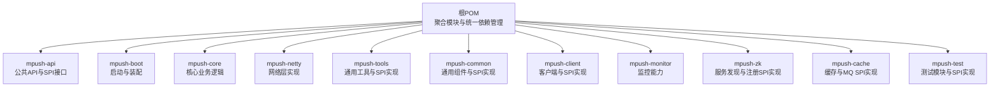
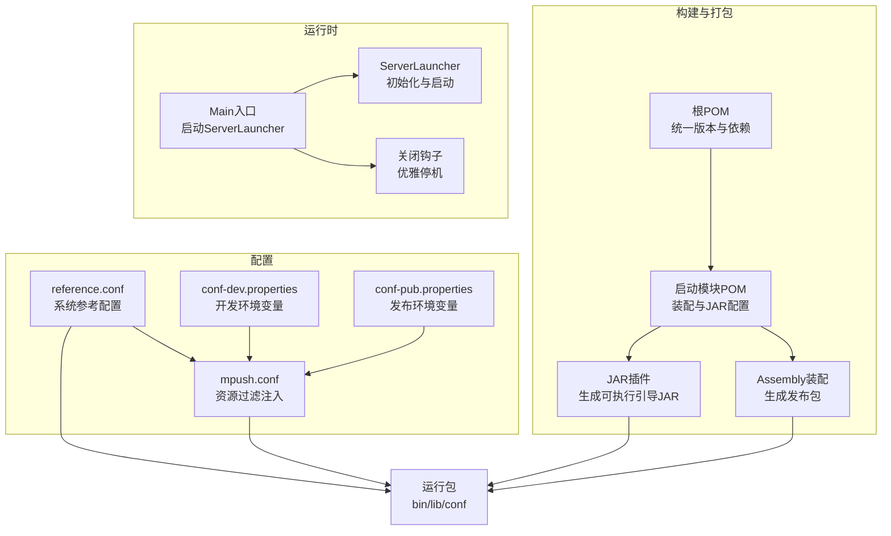
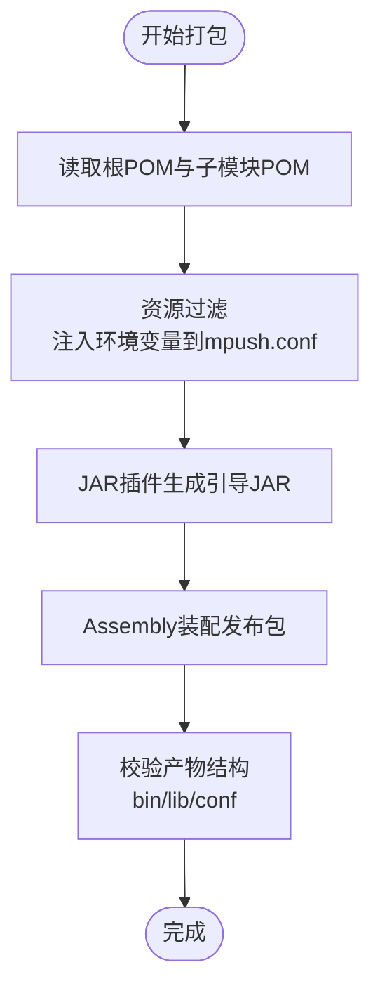
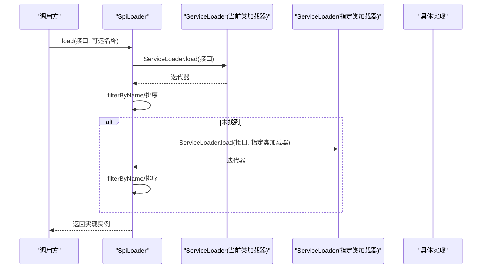
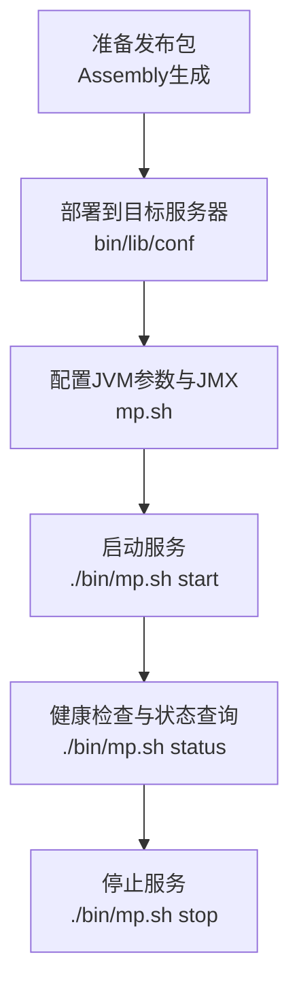
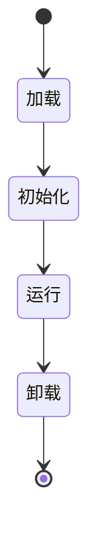
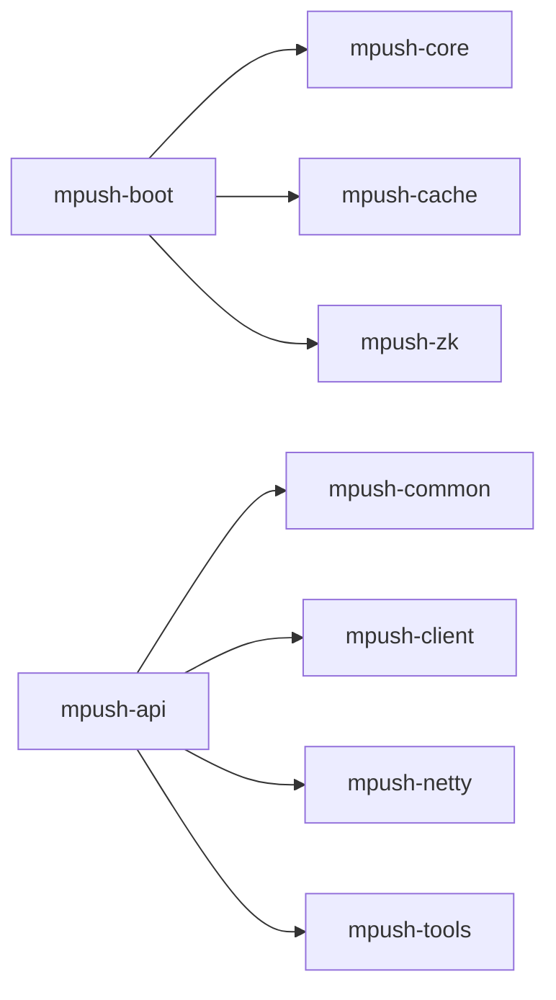

# 插件打包与部署

<cite>
**本文引用的文件**   
- [根POM（pom.xml）](file://pom.xml)
- [API模块POM（mpush-api/pom.xml）](file://mpush-api/pom.xml)
- [启动模块POM（mpush-boot/pom.xml）](file://mpush-boot/pom.xml)
- [启动装配（mpush-boot/assembly.xml）](file://mpush-boot/assembly.xml)
- [启动配置（mpush-boot/src/main/resources/mpush.conf）](file://mpush-boot/src/main/resources/mpush.conf)
- [参考配置（conf/reference.conf）](file://conf/reference.conf)
- [开发环境配置（conf/conf-dev.properties）](file://conf/conf-dev.properties)
- [发布环境配置（conf/conf-pub.properties）](file://conf/conf-pub.properties)
- [主入口（mpush-boot/src/main/java/com/mpush/bootstrap/Main.java）](file://mpush-boot/src/main/java/com/mpush/bootstrap/Main.java)
- [插件接口（mpush-api/src/main/java/com/mpush/api/spi/Plugin.java）](file://mpush-api/src/main/java/com/mpush/api/spi/Plugin.java)
- [SPI加载器（mpush-api/src/main/java/com/mpush/api/spi/SpiLoader.java）](file://mpush-api/src/main/java/com/mpush/api/spi/SpiLoader.java)
- [工厂接口（mpush-api/src/main/java/com/mpush/api/spi/Factory.java）](file://mpush-api/src/main/java/com/mpush/api/spi/Factory.java)
- [缓存SPI接口实现注册（mpush-cache/src/main/resources/META-INF/services/com.mpush.api.spi.common.CacheManagerFactory）](file://mpush-cache/src/main/resources/META-INF/services/com.mpush.api.spi.common.CacheManagerFactory)
- [客户端SPI接口实现注册（mpush-client/src/main/resources/META-INF/services/com.mpush.api.spi.client.PusherFactory）](file://mpush-client/src/main/resources/META-INF/services/com.mpush.api.spi.client.PusherFactory)
- [Shell启动脚本（bin/mp.sh）](file://bin/mp.sh)
</cite>

## 目录
1. [简介](#简介)
2. [项目结构](#项目结构)
3. [核心组件](#核心组件)
4. [架构总览](#架构总览)
5. [详细组件分析](#详细组件分析)
6. [依赖分析](#依赖分析)
7. [性能考虑](#性能考虑)
8. [故障排查指南](#故障排查指南)
9. [结论](#结论)
10. [附录](#附录)

## 简介
本指南面向需要在MPush平台上进行插件打包与部署的工程师，系统讲解以下内容：
- 插件打包全流程：项目结构组织、Maven配置、依赖管理、资源过滤与打包产物生成
- META-INF/services配置：接口全限定名文件的创建、实现类注册、版本兼容性与选择策略
- 插件部署策略：类路径部署、JAR包部署、装配包部署、进程管理与JMX远程监控
- 插件配置管理：配置文件格式（HOCON）、参数传递、环境变量注入、配置验证
- 生命周期管理：插件加载、初始化、运行时管理、卸载
- 调试与测试：单元测试、集成测试、性能测试、故障排查
- 部署脚本与配置模板：可直接复用的脚本与配置样例

## 项目结构
MPush采用多模块Maven聚合工程，核心模块包括API、核心、网络、工具、缓存、ZK、客户端、监控、测试等。启动模块负责打包与装配，提供可直接运行的发布包。

图表来源
- [根POM（pom.xml）](file://pom.xml#L54-L66)
- [API模块POM（mpush-api/pom.xml）](file://mpush-api/pom.xml#L1-L35)
- [启动模块POM（mpush-boot/pom.xml）](file://mpush-boot/pom.xml#L1-L101)

章节来源
- [根POM（pom.xml）](file://pom.xml#L54-L66)
- [API模块POM（mpush-api/pom.xml）](file://mpush-api/pom.xml#L1-L35)
- [启动模块POM（mpush-boot/pom.xml）](file://mpush-boot/pom.xml#L1-L101)

## 核心组件
- SPI与插件体系
  - 插件接口定义位于API模块，提供默认生命周期钩子，便于扩展实现。
  - SPI加载器通过ServiceLoader机制查找实现，支持按名称或优先级选择。
  - 工厂接口作为函数式抽象，用于延迟创建具体实现。
- 配置体系
  - 参考配置采用HOCON格式，集中定义系统参数；启动配置通过Maven资源过滤注入环境变量。
  - 提供开发与发布两套环境属性文件，配合Maven Profile切换。
- 打包与装配
  - 启动模块使用Assembly插件生成发布包，包含二进制、脚本、配置与依赖库。
  - 使用JAR插件生成可执行引导JAR，设置Main-Class与类路径前缀。

章节来源
- [插件接口（mpush-api/src/main/java/com/mpush/api/spi/Plugin.java）](file://mpush-api/src/main/java/com/mpush/api/spi/Plugin.java#L29-L38)
- [SPI加载器（mpush-api/src/main/java/com/mpush/api/spi/SpiLoader.java）](file://mpush-api/src/main/java/com/mpush/api/spi/SpiLoader.java#L25-L97)
- [工厂接口（mpush-api/src/main/java/com/mpush/api/spi/Factory.java）](file://mpush-api/src/main/java/com/mpush/api/spi/Factory.java#L29-L31)
- [参考配置（conf/reference.conf）](file://conf/reference.conf#L1-L239)
- [启动配置（mpush-boot/src/main/resources/mpush.conf）](file://mpush-boot/src/main/resources/mpush.conf#L1-L16)
- [开发环境配置（conf/conf-dev.properties）](file://conf/conf-dev.properties#L1-L5)
- [发布环境配置（conf/conf-pub.properties）](file://conf/conf-pub.properties#L1-L5)
- [启动装配（mpush-boot/assembly.xml）](file://mpush-boot/assembly.xml#L1-L58)
- [启动模块POM（mpush-boot/pom.xml）](file://mpush-boot/pom.xml#L34-L99)

## 架构总览
MPush的启动与部署围绕“配置—装配—运行”展开。启动模块负责将各子模块产物与依赖打包为发布包，并通过Shell脚本进行进程管理与JMX远程监控配置。

图表来源
- [根POM（pom.xml）](file://pom.xml#L68-L76)
- [启动模块POM（mpush-boot/pom.xml）](file://mpush-boot/pom.xml#L34-L99)
- [启动装配（mpush-boot/assembly.xml）](file://mpush-boot/assembly.xml#L1-L58)
- [启动配置（mpush-boot/src/main/resources/mpush.conf）](file://mpush-boot/src/main/resources/mpush.conf#L1-L16)
- [参考配置（conf/reference.conf）](file://conf/reference.conf#L1-L239)
- [开发环境配置（conf/conf-dev.properties）](file://conf/conf-dev.properties#L1-L5)
- [发布环境配置（conf/conf-pub.properties）](file://conf/conf-pub.properties#L1-L5)
- [主入口（mpush-boot/src/main/java/com/mpush/bootstrap/Main.java）](file://mpush-boot/src/main/java/com/mpush/bootstrap/Main.java#L24-L63)

## 详细组件分析

### 组件A：插件打包与装配
- 项目结构组织
  - 多模块聚合，API模块提供公共接口与SPI约定；各功能模块（缓存、ZK、客户端等）提供SPI实现并通过META-INF/services注册。
- Maven配置与依赖管理
  - 根POM集中管理版本与依赖范围，避免重复声明；子模块继承父POM并声明自身依赖。
  - 启动模块通过资源过滤引入环境变量，结合Maven Profile实现不同环境的差异化打包。
- 资源文件处理
  - 启动模块使用资源过滤将环境变量注入到mpush.conf；Assembly插件将classes下的配置与脚本、lib依赖打包到发布包。
- 打包产物
  - 生成可执行引导JAR与发布包（含bin、lib、conf），便于部署与升级。

图表来源
- [根POM（pom.xml）](file://pom.xml#L68-L76)
- [启动模块POM（mpush-boot/pom.xml）](file://mpush-boot/pom.xml#L34-L99)
- [启动装配（mpush-boot/assembly.xml）](file://mpush-boot/assembly.xml#L1-L58)
- [启动配置（mpush-boot/src/main/resources/mpush.conf）](file://mpush-boot/src/main/resources/mpush.conf#L1-L16)

章节来源
- [根POM（pom.xml）](file://pom.xml#L68-L76)
- [启动模块POM（mpush-boot/pom.xml）](file://mpush-boot/pom.xml#L34-L99)
- [启动装配（mpush-boot/assembly.xml）](file://mpush-boot/assembly.xml#L1-L58)
- [启动配置（mpush-boot/src/main/resources/mpush.conf）](file://mpush-boot/src/main/resources/mpush.conf#L1-L16)

### 组件B：META-INF/services配置与SPI加载
- 接口全限定名文件的创建
  - 在实现模块的resources/META-INF/services目录下，创建与SPI接口全限定名同名的文本文件，文件内容为实现类的全限定名。
  - 示例：缓存SPI接口实现注册文件指向Redis实现工厂；客户端Pusher工厂注册文件指向客户端实现工厂。
- 实现类注册与版本兼容性
  - 加载器通过ServiceLoader扫描类路径，支持按名称精确匹配与按注解优先级排序，默认缓存已加载实例，提升性能。
  - 当存在多个实现时，可通过名称筛选或注解order排序选择最优实现，确保版本演进下的兼容性。
- SPI加载流程

图表来源
- [SPI加载器（mpush-api/src/main/java/com/mpush/api/spi/SpiLoader.java）](file://mpush-api/src/main/java/com/mpush/api/spi/SpiLoader.java#L32-L95)
- [插件接口（mpush-api/src/main/java/com/mpush/api/spi/Plugin.java）](file://mpush-api/src/main/java/com/mpush/api/spi/Plugin.java#L29-L38)
- [工厂接口（mpush-api/src/main/java/com/mpush/api/spi/Factory.java）](file://mpush-api/src/main/java/com/mpush/api/spi/Factory.java#L29-L31)

章节来源
- [缓存SPI接口实现注册（mpush-cache/src/main/resources/META-INF/services/com.mpush.api.spi.common.CacheManagerFactory）](file://mpush-cache/src/main/resources/META-INF/services/com.mpush.api.spi.common.CacheManagerFactory#L1-L1)
- [客户端SPI接口实现注册（mpush-client/src/main/resources/META-INF/services/com.mpush.api.spi.client.PusherFactory）](file://mpush-client/src/main/resources/META-INF/services/com.mpush.api.spi.client.PusherFactory#L1-L2)
- [SPI加载器（mpush-api/src/main/java/com/mpush/api/spi/SpiLoader.java）](file://mpush-api/src/main/java/com/mpush/api/spi/SpiLoader.java#L25-L97)

### 组件C：插件部署策略
- 类路径部署
  - 将实现模块编译产物与依赖加入应用类路径，确保META-INF/services文件随实现类一起被打包。
- JAR包部署
  - 将实现模块打成独立JAR，放置于运行时lib目录，配合Assembly生成的发布包进行部署。
- 装配包部署
  - 使用启动模块的Assembly插件生成tar.gz发布包，包含bin、lib、conf，部署后直接运行。
- 进程管理与JMX
  - Shell脚本提供start/stop/restart/status命令，支持JMX远程监控配置，便于运维与诊断。

图表来源
- [启动装配（mpush-boot/assembly.xml）](file://mpush-boot/assembly.xml#L1-L58)
- [Shell启动脚本（bin/mp.sh）](file://bin/mp.sh#L133-L216)

章节来源
- [启动装配（mpush-boot/assembly.xml）](file://mpush-boot/assembly.xml#L1-L58)
- [Shell启动脚本（bin/mp.sh）](file://bin/mp.sh#L133-L216)

### 组件D：插件配置管理
- 配置文件格式与层次
  - 参考配置采用HOCON格式，集中定义系统参数；启动配置通过Maven资源过滤注入环境变量，实现环境差异化。
- 参数传递与环境变量
  - 开发/发布环境分别对应不同的属性文件，通过Maven Profile激活，影响最终装配包中的配置。
- 配置验证
  - 启动前建议校验配置文件语法与关键参数（如端口、ZK地址、Redis节点等），确保服务可用性。

章节来源
- [参考配置（conf/reference.conf）](file://conf/reference.conf#L1-L239)
- [启动配置（mpush-boot/src/main/resources/mpush.conf）](file://mpush-boot/src/main/resources/mpush.conf#L1-L16)
- [开发环境配置（conf/conf-dev.properties）](file://conf/conf-dev.properties#L1-L5)
- [发布环境配置（conf/conf-pub.properties）](file://conf/conf-pub.properties#L1-L5)

### 组件E：插件生命周期管理
- 生命周期阶段
  - 加载：通过SPI加载器定位并实例化插件实现。
  - 初始化：调用插件的初始化方法，传入上下文对象，完成资源准备。
  - 运行时管理：在服务运行期间维护插件状态，处理事件与回调。
  - 卸载：在优雅停机时调用销毁方法，释放资源。
- 关键接口与入口
  - 插件接口提供默认空实现，便于增量扩展。
  - 主入口负责启动与关闭钩子，确保插件在进程生命周期内得到正确管理。

图表来源
- [插件接口（mpush-api/src/main/java/com/mpush/api/spi/Plugin.java）](file://mpush-api/src/main/java/com/mpush/api/spi/Plugin.java#L31-L37)
- [主入口（mpush-boot/src/main/java/com/mpush/bootstrap/Main.java）](file://mpush-boot/src/main/java/com/mpush/bootstrap/Main.java#L49-L62)

章节来源
- [插件接口（mpush-api/src/main/java/com/mpush/api/spi/Plugin.java）](file://mpush-api/src/main/java/com/mpush/api/spi/Plugin.java#L29-L38)
- [主入口（mpush-boot/src/main/java/com/mpush/bootstrap/Main.java）](file://mpush-boot/src/main/java/com/mpush/bootstrap/Main.java#L24-L63)

### 组件F：调试与测试
- 单元测试
  - 各模块提供单元测试，例如核心模块的安全相关测试，确保关键逻辑正确性。
- 集成测试
  - 测试模块提供多种场景测试（如推送、加密、ZK、Redis等），可作为集成测试基线。
- 性能测试
  - 可结合监控模块与JMX配置进行性能观测，关注线程池、内存、GC与网络指标。
- 故障排查
  - 使用Shell脚本提供的status命令检查端口与服务状态；必要时触发线程转储辅助诊断。

章节来源
- [主入口（mpush-boot/src/main/java/com/mpush/bootstrap/Main.java）](file://mpush-boot/src/main/java/com/mpush/bootstrap/Main.java#L24-L63)
- [Shell启动脚本（bin/mp.sh）](file://bin/mp.sh#L217-L238)

## 依赖分析
- 模块间耦合
  - 启动模块依赖核心、缓存、ZK模块，形成“引导—核心—存储/注册”的依赖链。
  - 各功能模块通过API模块与SPI接口解耦，实现可插拔扩展。
- 外部依赖
  - 通过根POM集中管理Netty、日志桥接、配置库、ZK客户端、Redis客户端等第三方依赖，保证版本一致性。

图表来源
- [启动模块POM（mpush-boot/pom.xml）](file://mpush-boot/pom.xml#L19-L32)
- [根POM（pom.xml）](file://pom.xml#L79-L284)

章节来源
- [启动模块POM（mpush-boot/pom.xml）](file://mpush-boot/pom.xml#L19-L32)
- [根POM（pom.xml）](file://pom.xml#L79-L284)

## 性能考虑
- 线程池与资源隔离
  - 参考配置提供多处线程池参数，建议根据业务规模与硬件资源进行调优。
- 网络与缓冲区
  - 网络层提供发送/接收缓冲区与写保护阈值配置，需结合实际流量特征进行优化。
- 监控与JMX
  - 启动脚本支持JMX远程监控，建议在生产环境开启并合理配置认证与SSL。

章节来源
- [参考配置（conf/reference.conf）](file://conf/reference.conf#L182-L205)
- [参考配置（conf/reference.conf）](file://conf/reference.conf#L45-L123)
- [Shell启动脚本（bin/mp.sh）](file://bin/mp.sh#L46-L77)

## 故障排查指南
- 启动失败
  - 检查日志输出与PID文件是否存在；确认JVM参数与类路径配置正确。
- 配置错误
  - 校验mpush.conf与reference.conf的语法与关键参数；确认环境变量注入是否生效。
- 服务不可达
  - 使用status命令检查端口监听状态；核对防火墙与网络策略。
- 优雅停机
  - 观察关闭钩子执行情况，确保所有资源释放完成。

章节来源
- [主入口（mpush-boot/src/main/java/com/mpush/bootstrap/Main.java）](file://mpush-boot/src/main/java/com/mpush/bootstrap/Main.java#L49-L62)
- [Shell启动脚本（bin/mp.sh）](file://bin/mp.sh#L176-L216)

## 结论
通过规范的模块化设计与SPI机制，MPush实现了良好的可插拔扩展能力。结合Maven资源过滤与Assembly装配，能够快速生成可部署的发布包，并通过Shell脚本实现便捷的进程管理与监控。遵循本文的打包与部署实践，可显著提升插件开发与上线效率。

## 附录
- 部署脚本示例
  - 使用启动模块的Assembly插件生成发布包，包含bin、lib、conf目录，直接运行即可。
  - Shell脚本提供start/stop/restart/status/print-cmd等命令，支持JMX远程监控配置。
- 配置文件模板
  - 参考配置文件提供了完整的参数清单与注释，建议基于此模板定制环境配置。
  - 启动配置通过资源过滤注入环境变量，实现开发/发布的差异化。

章节来源
- [启动装配（mpush-boot/assembly.xml）](file://mpush-boot/assembly.xml#L1-L58)
- [Shell启动脚本（bin/mp.sh）](file://bin/mp.sh#L133-L242)
- [参考配置（conf/reference.conf）](file://conf/reference.conf#L1-L239)
- [启动配置（mpush-boot/src/main/resources/mpush.conf）](file://mpush-boot/src/main/resources/mpush.conf#L1-L16)