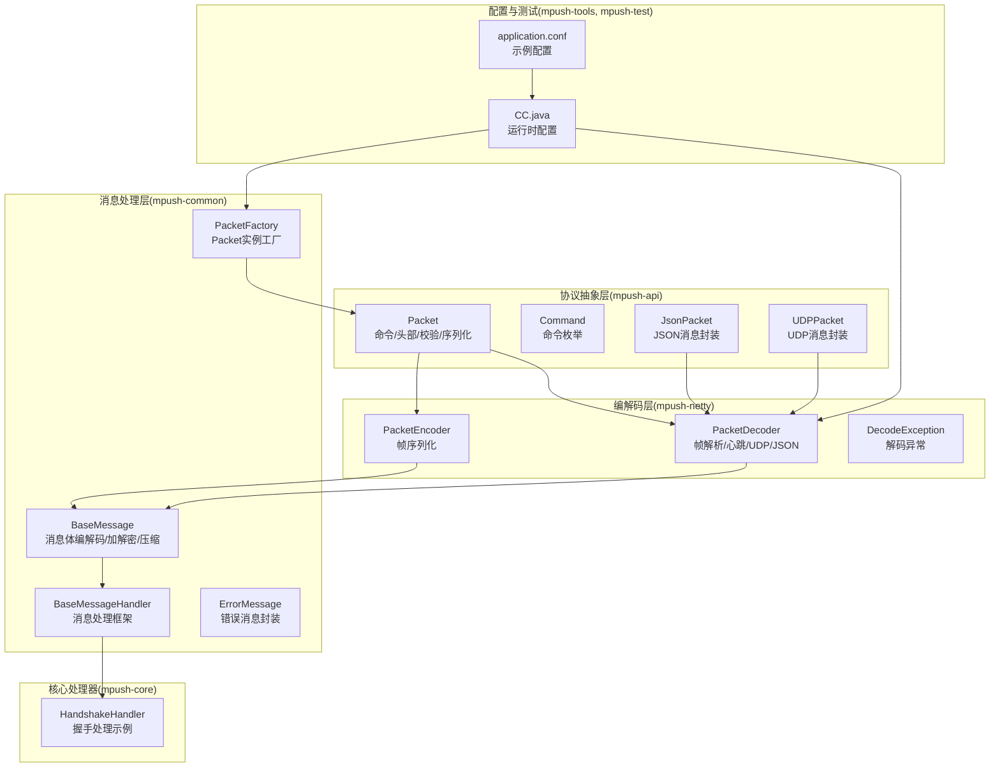
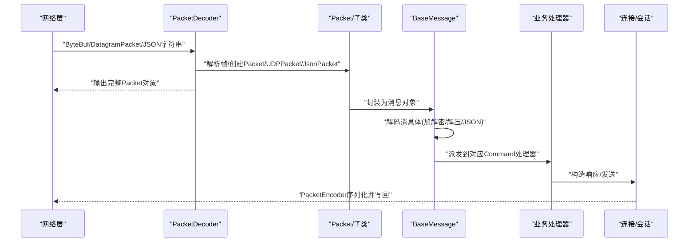
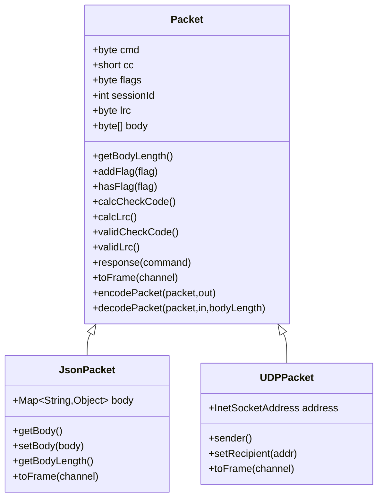
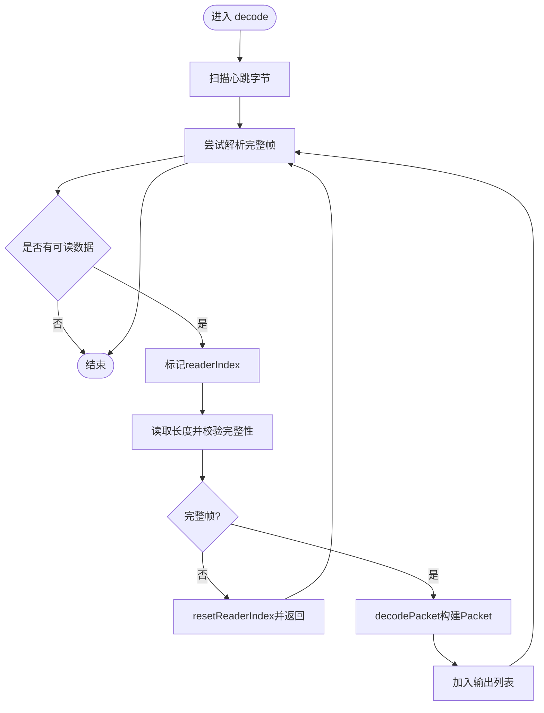
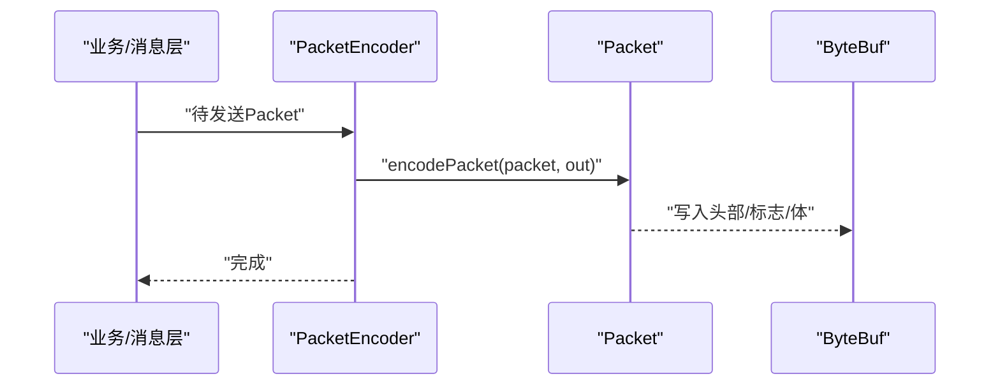
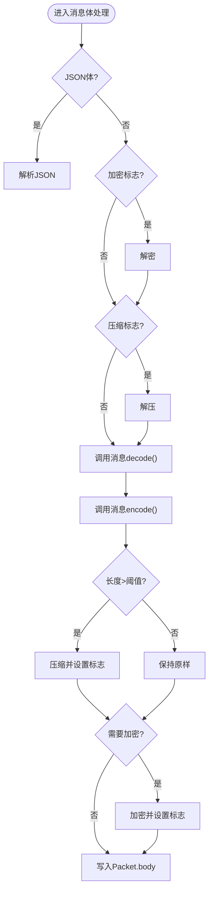
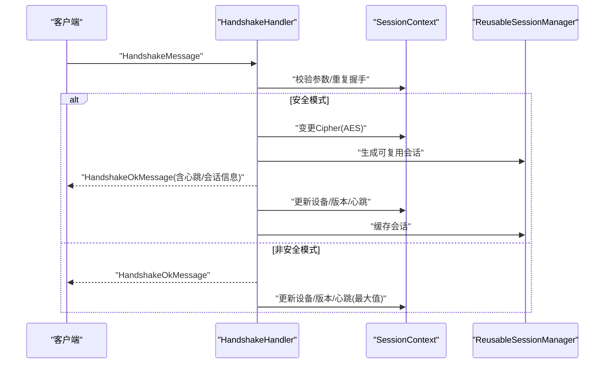
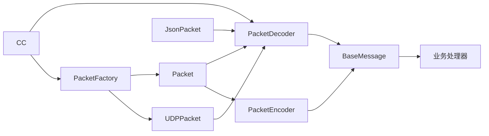

# 新协议支持开发

<cite>
**本文引用的文件**
- [Packet.java](file://mpush-api/src/main/java/com/mpush/api/protocol/Packet.java)
- [Command.java](file://mpush-api/src/main/java/com/mpush/api/protocol/Command.java)
- [JsonPacket.java](file://mpush-api/src/main/java/com/mpush/api/protocol/JsonPacket.java)
- [UDPPacket.java](file://mpush-api/src/main/java/com/mpush/api/protocol/UDPPacket.java)
- [PacketDecoder.java](file://mpush-netty/src/main/java/com/mpush/netty/codec/PacketDecoder.java)
- [PacketEncoder.java](file://mpush-netty/src/main/java/com/mpush/netty/codec/PacketEncoder.java)
- [DecodeException.java](file://mpush-netty/src/main/java/com/mpush/netty/codec/DecodeException.java)
- [BaseMessage.java](file://mpush-common/src/main/java/com/mpush/common/message/BaseMessage.java)
- [PacketFactory.java](file://mpush-common/src/main/java/com/mpush/common/memory/PacketFactory.java)
- [BaseMessageHandler.java](file://mpush-common/src/main/java/com/mpush/common/handler/BaseMessageHandler.java)
- [HandshakeHandler.java](file://mpush-core/src/main/java/com/mpush/core/handler/HandshakeHandler.java)
- [ErrorMessage.java](file://mpush-common/src/main/java/com/mpush/common/message/ErrorMessage.java)
- [application.conf](file://mpush-test/src/main/resources/application.conf)
- [CC.java](file://mpush-tools/src/main/java/com/mpush/tools/config/CC.java)
</cite>

## 目录
1. [引言](#引言)
2. [项目结构](#项目结构)
3. [核心组件](#核心组件)
4. [架构总览](#架构总览)
5. [详细组件分析](#详细组件分析)
6. [依赖分析](#依赖分析)
7. [性能考虑](#性能考虑)
8. [故障排查指南](#故障排查指南)
9. [结论](#结论)
10. [附录](#附录)

## 引言
本文件面向为 MPush 开发“新协议支持”的工程师，系统阐述协议抽象层的设计与实现，涵盖 Packet 基类、协议字段与消息格式封装、编解码器（PacketDecoder、PacketEncoder）的工作原理、消息体的二进制与 JSON 处理流程、以及从协议规范制定到网络服务器集成的完整开发流程。同时提供兼容性处理、错误处理、性能优化与测试策略的实践指导。

## 项目结构
MPush 的协议与编解码能力主要分布在以下模块：
- 协议抽象层：mpush-api 中的协议模型与命令定义
- 编解码器：mpush-netty 中的 PacketDecoder、PacketEncoder
- 消息处理与调度：mpush-common 中的消息基类与处理器框架
- 核心业务处理器：mpush-core 中的业务处理器示例
- 配置与测试：mpush-tools 与 mpush-test 提供配置与测试样例

图表来源
- [Packet.java](file://mpush-api/src/main/java/com/mpush/api/protocol/Packet.java#L35-L186)
- [Command.java](file://mpush-api/src/main/java/com/mpush/api/protocol/Command.java#L27-L65)
- [JsonPacket.java](file://mpush-api/src/main/java/com/mpush/api/protocol/JsonPacket.java#L37-L95)
- [UDPPacket.java](file://mpush-api/src/main/java/com/mpush/api/protocol/UDPPacket.java#L35-L82)
- [PacketDecoder.java](file://mpush-netty/src/main/java/com/mpush/netty/codec/PacketDecoder.java#L44-L106)
- [PacketEncoder.java](file://mpush-netty/src/main/java/com/mpush/netty/codec/PacketEncoder.java#L39-L46)
- [DecodeException.java](file://mpush-netty/src/main/java/com/mpush/netty/codec/DecodeException.java#L27-L31)
- [BaseMessage.java](file://mpush-common/src/main/java/com/mpush/common/message/BaseMessage.java#L42-L246)
- [BaseMessageHandler.java](file://mpush-common/src/main/java/com/mpush/common/handler/BaseMessageHandler.java#L34-L70)
- [HandshakeHandler.java](file://mpush-core/src/main/java/com/mpush/core/handler/HandshakeHandler.java#L47-L159)
- [ErrorMessage.java](file://mpush-common/src/main/java/com/mpush/common/message/ErrorMessage.java#L38-L123)
- [PacketFactory.java](file://mpush-common/src/main/java/com/mpush/common/memory/PacketFactory.java#L32-L39)
- [CC.java](file://mpush-tools/src/main/java/com/mpush/tools/config/CC.java#L102-L180)
- [application.conf](file://mpush-test/src/main/resources/application.conf#L1-L22)

章节来源
- [Packet.java](file://mpush-api/src/main/java/com/mpush/api/protocol/Packet.java#L35-L186)
- [PacketDecoder.java](file://mpush-netty/src/main/java/com/mpush/netty/codec/PacketDecoder.java#L44-L106)
- [BaseMessage.java](file://mpush-common/src/main/java/com/mpush/common/message/BaseMessage.java#L42-L246)

## 核心组件
本节聚焦协议抽象层与编解码器的核心设计与职责。

- Packet 基类
  - 设计目标：统一 TCP/UDP/WebSocket 等传输层的消息格式，提供头部字段、标志位、会话标识、校验机制与通用编解码入口。
  - 关键字段：命令、校验码、标志位、会话ID、LRC 校验、消息体。
  - 标志位：加密、压缩、业务应答、自动应答、JSON 消息体等。
  - 校验：校验码（按字节求和）、LRC（对头部进行异或校验），并提供校验方法。
  - 序列化：静态 encodePacket/decodePacket 方法，统一写出/读入逻辑；心跳包有专用字节常量与快速路径。
  - 响应构造：response() 基于相同会话ID生成响应包。
  - 适配帧：toFrame() 将消息转为具体传输帧（如 WebSocket 文本帧、UDP 数据报）。

- Command 命令枚举
  - 定义所有协议命令，提供字节映射与未知命令处理，确保扩展时的向后兼容。

- JsonPacket
  - 继承自 Packet，标记为 JSON 消息体，toFrame() 将 JSON 字符串包装为 WebSocket 文本帧，适合文本协议场景。

- UDPPacket
  - 继承自 Packet，携带发送方地址，toFrame() 将消息封装为 DatagramPacket，适配 UDP 场景。

- PacketDecoder
  - 责任：从 ByteBuf 中解析出完整帧，处理心跳包、TCP 帧、UDP 帧与 JSON 字符串帧。
  - 心跳：单字节快速识别与透传。
  - TCP 帧：固定头部长度、最大包长限制、不完整帧回退。
  - UDP 帧：从 DatagramPacket 中解析。
  - JSON 帧：字符串反序列化为 JsonPacket。

- PacketEncoder
  - 责任：将 Packet 序列化为 ByteBuf，委托给 Packet.encodePacket。

- BaseMessage
  - 责任：在消息生命周期内完成消息体的二进制/JSON 解析与编码，处理加解密、压缩、阈值控制与内存释放。
  - 支持 JSON 与二进制两种消息体格式，按标志位自动选择处理路径。

- PacketFactory
  - 责任：根据运行时配置选择 Packet 或 UDPPacket 实例，实现 TCP/UDP 网关的动态切换。

章节来源
- [Packet.java](file://mpush-api/src/main/java/com/mpush/api/protocol/Packet.java#L35-L186)
- [Command.java](file://mpush-api/src/main/java/com/mpush/api/protocol/Command.java#L27-L65)
- [JsonPacket.java](file://mpush-api/src/main/java/com/mpush/api/protocol/JsonPacket.java#L37-L95)
- [UDPPacket.java](file://mpush-api/src/main/java/com/mpush/api/protocol/UDPPacket.java#L35-L82)
- [PacketDecoder.java](file://mpush-netty/src/main/java/com/mpush/netty/codec/PacketDecoder.java#L44-L106)
- [PacketEncoder.java](file://mpush-netty/src/main/java/com/mpush/netty/codec/PacketEncoder.java#L39-L46)
- [BaseMessage.java](file://mpush-common/src/main/java/com/mpush/common/message/BaseMessage.java#L42-L246)
- [PacketFactory.java](file://mpush-common/src/main/java/com/mpush/common/memory/PacketFactory.java#L32-L39)

## 架构总览
下图展示了从网络接收到底层消息处理的整体流程，强调协议抽象层与编解码器的衔接，以及消息体处理与业务处理器的协作。

图表来源
- [PacketDecoder.java](file://mpush-netty/src/main/java/com/mpush/netty/codec/PacketDecoder.java#L44-L106)
- [PacketEncoder.java](file://mpush-netty/src/main/java/com/mpush/netty/codec/PacketEncoder.java#L39-L46)
- [BaseMessage.java](file://mpush-common/src/main/java/com/mpush/common/message/BaseMessage.java#L42-L246)
- [HandshakeHandler.java](file://mpush-core/src/main/java/com/mpush/core/handler/HandshakeHandler.java#L47-L159)

## 详细组件分析

### 组件一：Packet 抽象与消息格式
- 设计思想
  - 以“头部+标志位+会话ID+校验+消息体”的统一格式抽象跨传输层的消息，降低上层协议差异带来的复杂度。
  - 通过静态 encodePacket/decodePacket 将协议细节集中管理，避免分散的序列化逻辑。
  - 心跳包采用单字节快速路径，减少 CPU 与内存开销。
- 协议字段
  - 长度、命令、校验码、标志位、会话ID、LRC、消息体。
- 消息体封装
  - 二进制与 JSON 双栈支持，通过标志位区分；二进制体支持加解密与压缩。
- 错误处理
  - 校验失败与超长帧抛出明确异常，便于上层快速失败与日志定位。

图表来源
- [Packet.java](file://mpush-api/src/main/java/com/mpush/api/protocol/Packet.java#L35-L186)
- [JsonPacket.java](file://mpush-api/src/main/java/com/mpush/api/protocol/JsonPacket.java#L37-L95)
- [UDPPacket.java](file://mpush-api/src/main/java/com/mpush/api/protocol/UDPPacket.java#L35-L82)

章节来源
- [Packet.java](file://mpush-api/src/main/java/com/mpush/api/protocol/Packet.java#L35-L186)
- [JsonPacket.java](file://mpush-api/src/main/java/com/mpush/api/protocol/JsonPacket.java#L37-L95)
- [UDPPacket.java](file://mpush-api/src/main/java/com/mpush/api/protocol/UDPPacket.java#L35-L82)

### 组件二：PacketDecoder 解码器
- 工作原理
  - 快速扫描心跳字节，批量透传心跳帧。
  - 对 TCP 帧：先读取长度，检查是否超过最大包长与是否完整；完整则调用 decodePacket 构造 Packet。
  - 对 UDP 帧：从 DatagramPacket 中解析，构造 UDPPacket 并附带发送方地址。
  - 对 JSON 帧：直接反序列化为 JsonPacket。
- 不完整帧处理
  - 使用 mark/reset 回退到上次正确读取位置，避免阻塞等待后续数据。
- 异常处理
  - 超长帧抛出 TooLongFrameException；解码异常由 DecodeException 表达。

图表来源
- [PacketDecoder.java](file://mpush-netty/src/main/java/com/mpush/netty/codec/PacketDecoder.java#L44-L106)

章节来源
- [PacketDecoder.java](file://mpush-netty/src/main/java/com/mpush/netty/codec/PacketDecoder.java#L44-L106)
- [DecodeException.java](file://mpush-netty/src/main/java/com/mpush/netty/codec/DecodeException.java#L27-L31)

### 组件三：PacketEncoder 编码器
- 实现细节
  - 将 Packet 交给 Packet.encodePacket 输出到 ByteBuf。
  - 心跳包走快速路径，仅写出单字节。
  - 通过共享实例减少对象创建开销。
- 性能要点
  - 避免中间对象复制，直接复用 ByteBuf 分配策略。

图表来源
- [PacketEncoder.java](file://mpush-netty/src/main/java/com/mpush/netty/codec/PacketEncoder.java#L39-L46)
- [Packet.java](file://mpush-api/src/main/java/com/mpush/api/protocol/Packet.java#L154-L169)

章节来源
- [PacketEncoder.java](file://mpush-netty/src/main/java/com/mpush/netty/codec/PacketEncoder.java#L39-L46)
- [Packet.java](file://mpush-api/src/main/java/com/mpush/api/protocol/Packet.java#L154-L169)

### 组件四：消息体处理与安全/压缩
- 处理流程
  - 解码阶段：若为 JSON，则直接解析；否则按标志位执行解密与解压，再调用具体消息的 decode()。
  - 编码阶段：先调用具体消息的 encode() 产出原始字节，再按阈值压缩，必要时加解密，最后写入 Packet.body。
- 安全与压缩阈值
  - 压缩阈值来自运行时配置，避免小包压缩带来的额外开销。
- 内存优化
  - 解码完成后及时释放 body，降低 GC 压力。

图表来源
- [BaseMessage.java](file://mpush-common/src/main/java/com/mpush/common/message/BaseMessage.java#L56-L163)
- [CC.java](file://mpush-tools/src/main/java/com/mpush/tools/config/CC.java#L102-L180)

章节来源
- [BaseMessage.java](file://mpush-common/src/main/java/com/mpush/common/message/BaseMessage.java#L56-L163)
- [CC.java](file://mpush-tools/src/main/java/com/mpush/tools/config/CC.java#L102-L180)

### 组件五：业务处理器示例（握手）
- 握手流程要点
  - 安全模式：校验参数、重复握手检测、RSA/AES 密钥混合、生成会话密钥、下发握手成功并更新会话上下文。
  - 非安全模式：简化参数校验与会话上下文更新。
  - 错误处理：参数无效、重复握手等场景下发错误消息并关闭连接。
- 与消息体处理的关系
  - 握手消息继承 BaseMessage，利用统一的解码/编码流程与加解密/压缩能力。

图表来源
- [HandshakeHandler.java](file://mpush-core/src/main/java/com/mpush/core/handler/HandshakeHandler.java#L47-L159)
- [BaseMessage.java](file://mpush-common/src/main/java/com/mpush/common/message/BaseMessage.java#L42-L246)

章节来源
- [HandshakeHandler.java](file://mpush-core/src/main/java/com/mpush/core/handler/HandshakeHandler.java#L47-L159)
- [ErrorMessage.java](file://mpush-common/src/main/java/com/mpush/common/message/ErrorMessage.java#L38-L123)

## 依赖分析
- 组件耦合
  - Packet 与 PacketDecoder/PacketEncoder 强耦合，但通过静态方法隔离了具体实现细节。
  - BaseMessage 依赖 Packet 的标志位与序列化接口，向上提供统一的消息生命周期管理。
  - PacketFactory 依据运行时配置选择 Packet/UDPPacket，实现 TCP/UDP 网关切换。
- 外部依赖
  - Netty ByteBuf、DatagramPacket、WebSocket 文本帧等作为传输适配层。
  - 运行时配置 CC 提供网络与压缩阈值等参数。

图表来源
- [Packet.java](file://mpush-api/src/main/java/com/mpush/api/protocol/Packet.java#L35-L186)
- [PacketDecoder.java](file://mpush-netty/src/main/java/com/mpush/netty/codec/PacketDecoder.java#L44-L106)
- [PacketEncoder.java](file://mpush-netty/src/main/java/com/mpush/netty/codec/PacketEncoder.java#L39-L46)
- [BaseMessage.java](file://mpush-common/src/main/java/com/mpush/common/message/BaseMessage.java#L42-L246)
- [PacketFactory.java](file://mpush-common/src/main/java/com/mpush/common/memory/PacketFactory.java#L32-L39)
- [CC.java](file://mpush-tools/src/main/java/com/mpush/tools/config/CC.java#L102-L180)

章节来源
- [PacketFactory.java](file://mpush-common/src/main/java/com/mpush/common/memory/PacketFactory.java#L32-L39)
- [CC.java](file://mpush-tools/src/main/java/com/mpush/tools/config/CC.java#L102-L180)

## 性能考虑
- 心跳优化
  - 心跳包采用单字节快速路径，减少序列化与拷贝成本。
- 压缩阈值
  - 通过配置项设置压缩阈值，避免小包压缩带来的 CPU 与内存浪费。
- 内存管理
  - 解码完成后及时释放消息体，降低 GC 压力。
- 编解码器复用
  - PacketEncoder 标记为共享实例，减少对象创建。
- 最大包长限制
  - PacketDecoder 在 TCP 帧解析中限制最大包长，防止内存膨胀与 DoS 攻击。

章节来源
- [Packet.java](file://mpush-api/src/main/java/com/mpush/api/protocol/Packet.java#L154-L169)
- [BaseMessage.java](file://mpush-common/src/main/java/com/mpush/common/message/BaseMessage.java#L114-L133)
- [PacketDecoder.java](file://mpush-netty/src/main/java/com/mpush/netty/codec/PacketDecoder.java#L45-L87)
- [CC.java](file://mpush-tools/src/main/java/com/mpush/tools/config/CC.java#L102-L180)

## 故障排查指南
- 常见问题与定位
  - 超长帧：PacketDecoder 抛出 TooLongFrameException，检查业务消息体大小与压缩策略。
  - 校验失败：Packet.validCheckCode()/validLrc() 返回 false，检查发送端与接收端的校验逻辑一致性。
  - 参数无效/重复握手：HandshakeHandler 中的参数校验失败或重复握手，查看 ErrorMessage 的原因与数据字段。
  - UDP 地址丢失：UDPPacket.sender()/setRecipient() 未正确设置发送方地址，导致无法回包。
- 日志与监控
  - ErrorMessage 提供统一的错误封装与关闭连接的能力，便于快速定位与反馈。
  - 运行时配置 CC 提供网络参数与缓冲区水位等可观测点，辅助性能调优。

章节来源
- [PacketDecoder.java](file://mpush-netty/src/main/java/com/mpush/netty/codec/PacketDecoder.java#L85-L87)
- [Packet.java](file://mpush-api/src/main/java/com/mpush/api/protocol/Packet.java#L118-L124)
- [HandshakeHandler.java](file://mpush-core/src/main/java/com/mpush/core/handler/HandshakeHandler.java#L76-L90)
- [ErrorMessage.java](file://mpush-common/src/main/java/com/mpush/common/message/ErrorMessage.java#L38-L123)

## 结论
MPush 的协议抽象层以 Packet 为核心，结合 PacketDecoder/PacketEncoder 与 BaseMessage 的消息体处理机制，形成了高内聚、低耦合且易于扩展的协议栈。通过标志位与工厂模式，系统实现了对 TCP/UDP/WebSocket 等多种传输的透明支持，并提供了完善的错误处理与性能优化手段。基于此架构，开发者可以高效地完成新协议的开发与集成。

## 附录

### 新协议开发流程（从零到上线）
- 协议规范制定
  - 明确命令集（参考 Command），定义消息体结构与语义。
  - 确定是否需要 JSON 体或二进制体，是否启用加解密与压缩。
- 数据结构设计
  - 若为二进制体：在消息类中实现 encode()/decode()，并在 BaseMessage 生命周期中被调用。
  - 若为 JSON 体：继承 JsonPacket，使用统一的 JSON 序列化/反序列化。
- 编解码器实现
  - 若为新增命令：在 PacketDecoder 中增加对应解析分支（如 UDP 帧或 JSON 帧）。
  - 若为新增传输：在 PacketFactory 中根据 CC 配置选择 Packet/UDPPacket。
- 网络服务器集成
  - 在业务处理器中注册对应 Command 的处理逻辑（参考 HandshakeHandler）。
  - 使用 ErrorMessage 统一封装错误响应。
- 兼容性处理
  - 向后兼容：新增命令/字段时保留旧字段，Unknown 命令降级处理。
  - 版本升级：通过标志位或版本号字段区分不同版本的消息体格式。
  - 协议迁移：提供过渡期双栈支持，逐步切流。
- 测试策略
  - 单元测试：验证 Packet 编解码、校验逻辑、压缩/解压链路。
  - 集成测试：覆盖 TCP/UDP/WebSocket 三种传输，模拟心跳、握手、推送等场景。
  - 性能测试：压测最大包长、压缩阈值、并发连接数等关键指标。
- 配置与部署
  - 在 application.conf 中调整网络参数（端口、协议类型、压缩阈值等）。
  - 通过 CC 动态生效网络与性能参数。

章节来源
- [Command.java](file://mpush-api/src/main/java/com/mpush/api/protocol/Command.java#L27-L65)
- [PacketDecoder.java](file://mpush-netty/src/main/java/com/mpush/netty/codec/PacketDecoder.java#L44-L106)
- [PacketFactory.java](file://mpush-common/src/main/java/com/mpush/common/memory/PacketFactory.java#L32-L39)
- [HandshakeHandler.java](file://mpush-core/src/main/java/com/mpush/core/handler/HandshakeHandler.java#L47-L159)
- [application.conf](file://mpush-test/src/main/resources/application.conf#L1-L22)
- [CC.java](file://mpush-tools/src/main/java/com/mpush/tools/config/CC.java#L102-L180)