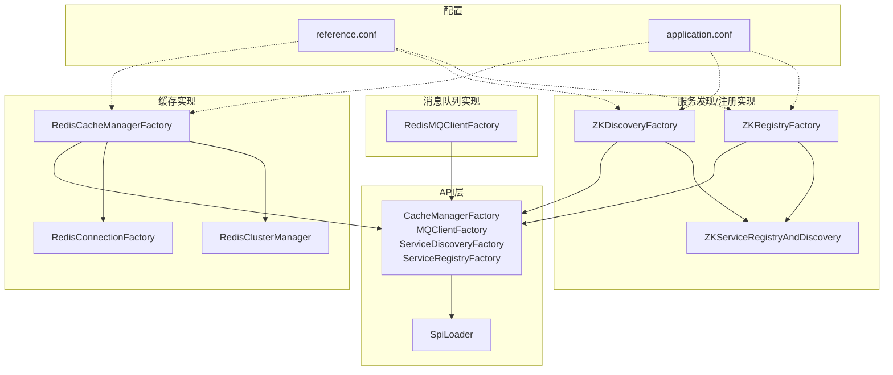
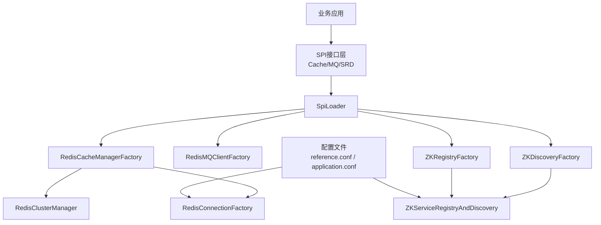
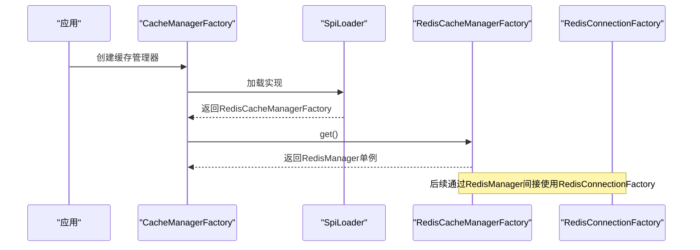
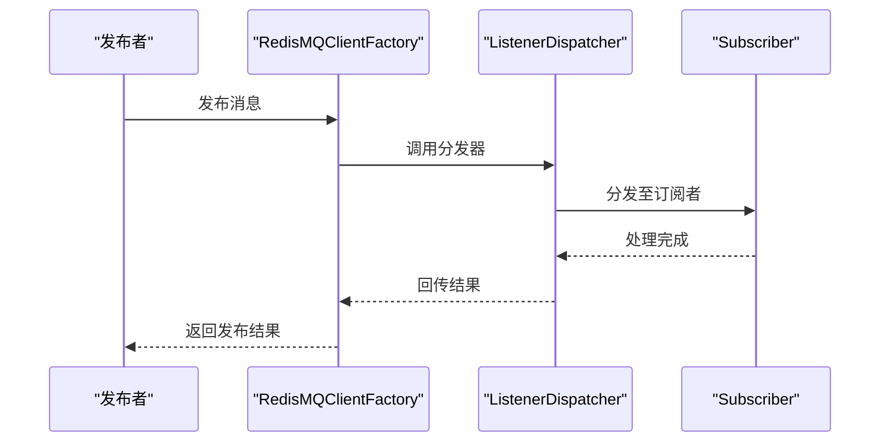
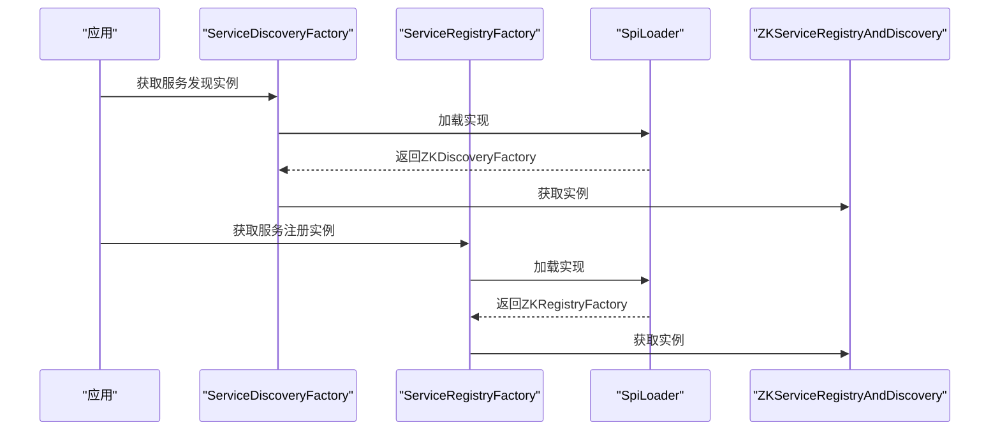
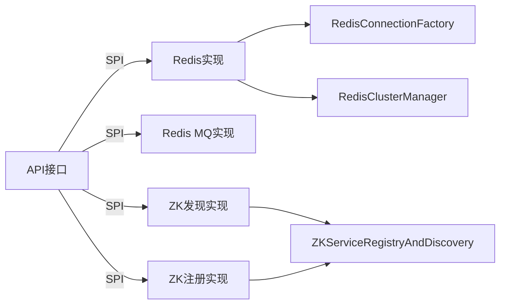

# 第三方系统集成

<cite>
**本文引用的文件**
- [mpush-api/src/main/java/com/mpush/api/spi/common/CacheManagerFactory.java](file://mpush-api/src/main/java/com/mpush/api/spi/common/CacheManagerFactory.java)
- [mpush-api/src/main/java/com/mpush/api/spi/common/MQClientFactory.java](file://mpush-api/src/main/java/com/mpush/api/spi/common/MQClientFactory.java)
- [mpush-api/src/main/java/com/mpush/api/spi/common/ServiceDiscoveryFactory.java](file://mpush-api/src/main/java/com/mpush/api/spi/common/ServiceDiscoveryFactory.java)
- [mpush-api/src/main/java/com/mpush/api/spi/common/ServiceRegistryFactory.java](file://mpush-api/src/main/java/com/mpush/api/spi/common/ServiceRegistryFactory.java)
- [mpush-api/src/main/java/com/mpush/api/spi/SpiLoader.java](file://mpush-api/src/main/java/com/mpush/api/spi/SpiLoader.java)
- [mpush-cache/src/main/java/com/mpush/cache/redis/manager/RedisCacheManagerFactory.java](file://mpush-cache/src/main/java/com/mpush/cache/redis/manager/RedisCacheManagerFactory.java)
- [mpush-cache/src/main/java/com/mpush/cache/redis/mq/RedisMQClientFactory.java](file://mpush-cache/src/main/java/com/mpush/cache/redis/mq/RedisMQClientFactory.java)
- [mpush-cache/src/main/java/com/mpush/cache/redis/connection/RedisConnectionFactory.java](file://mpush-cache/src/main/java/com/mpush/cache/redis/connection/RedisConnectionFactory.java)
- [mpush-cache/src/main/java/com/mpush/cache/redis/manager/RedisClusterManager.java](file://mpush-cache/src/main/java/com/mpush/cache/redis/manager/RedisClusterManager.java)
- [mpush-zk/src/main/java/com/mpush/zk/ZKDiscoveryFactory.java](file://mpush-zk/src/main/java/com/mpush/zk/ZKDiscoveryFactory.java)
- [mpush-zk/src/main/java/com/mpush/zk/ZKRegistryFactory.java](file://mpush-zk/src/main/java/com/mpush/zk/ZKRegistryFactory.java)
- [mpush-zk/src/main/java/com/mpush/zk/ZKServiceRegistryAndDiscovery.java](file://mpush-zk/src/main/java/com/mpush/zk/ZKServiceRegistryAndDiscovery.java)
- [conf/reference.conf](file://conf/reference.conf)
- [mpush-test/src/main/resources/application.conf](file://mpush-test/src/main/resources/application.conf)
</cite>

## 目录
1. [简介](#简介)
2. [项目结构](#项目结构)
3. [核心组件](#核心组件)
4. [架构总览](#架构总览)
5. [详细组件分析](#详细组件分析)
6. [依赖分析](#依赖分析)
7. [性能考虑](#性能考虑)
8. [故障排查指南](#故障排查指南)
9. [结论](#结论)
10. [附录](#附录)

## 简介
本指南面向需要将MPush与第三方系统（缓存、消息队列、服务发现与注册、数据库连接等）进行集成的开发者。文档从架构设计、组件关系、数据流与处理逻辑出发，结合源码路径定位，给出可操作的集成步骤、配置要点与最佳实践，帮助读者快速完成缓存系统（含Redis集群）、消息队列（基于Redis的发布订阅）、服务发现与注册（Zookeeper）以及数据库连接（连接池与事务）的集成。

## 项目结构
MPush采用模块化与SPI扩展机制组织代码，核心能力通过API接口定义，具体实现分布在独立模块中。关键模块与职责概览：
- mpush-api：定义SPI接口与通用抽象（缓存、消息队列、服务发现/注册工厂等）
- mpush-cache：提供缓存与消息队列的Redis实现
- mpush-zk：提供基于Zookeeper的服务发现与注册实现
- conf：系统参考配置（HOCON格式）
- mpush-test：测试与示例配置

图表来源
- [mpush-api/src/main/java/com/mpush/api/spi/common/CacheManagerFactory.java](file://mpush-api/src/main/java/com/mpush/api/spi/common/CacheManagerFactory.java#L30-L34)
- [mpush-api/src/main/java/com/mpush/api/spi/common/MQClientFactory.java](file://mpush-api/src/main/java/com/mpush/api/spi/common/MQClientFactory.java#L30-L35)
- [mpush-api/src/main/java/com/mpush/api/spi/common/ServiceDiscoveryFactory.java](file://mpush-api/src/main/java/com/mpush/api/spi/common/ServiceDiscoveryFactory.java#L32-L35)
- [mpush-api/src/main/java/com/mpush/api/spi/common/ServiceRegistryFactory.java](file://mpush-api/src/main/java/com/mpush/api/spi/common/ServiceRegistryFactory.java#L31-L34)
- [mpush-api/src/main/java/com/mpush/api/spi/SpiLoader.java](file://mpush-api/src/main/java/com/mpush/api/spi/SpiLoader.java#L32-L66)
- [mpush-cache/src/main/java/com/mpush/cache/redis/manager/RedisCacheManagerFactory.java](file://mpush-cache/src/main/java/com/mpush/cache/redis/manager/RedisCacheManagerFactory.java#L31-L36)
- [mpush-cache/src/main/java/com/mpush/cache/redis/connection/RedisConnectionFactory.java](file://mpush-cache/src/main/java/com/mpush/cache/redis/connection/RedisConnectionFactory.java#L89-L107)
- [mpush-cache/src/main/java/com/mpush/cache/redis/manager/RedisClusterManager.java](file://mpush-cache/src/main/java/com/mpush/cache/redis/manager/RedisClusterManager.java#L26-L31)
- [mpush-cache/src/main/java/com/mpush/cache/redis/mq/RedisMQClientFactory.java](file://mpush-cache/src/main/java/com/mpush/cache/redis/mq/RedisMQClientFactory.java#L31-L38)
- [mpush-zk/src/main/java/com/mpush/zk/ZKDiscoveryFactory.java](file://mpush-zk/src/main/java/com/mpush/zk/ZKDiscoveryFactory.java#L31-L36)
- [mpush-zk/src/main/java/com/mpush/zk/ZKRegistryFactory.java](file://mpush-zk/src/main/java/com/mpush/zk/ZKRegistryFactory.java#L31-L36)
- [mpush-zk/src/main/java/com/mpush/zk/ZKServiceRegistryAndDiscovery.java](file://mpush-zk/src/main/java/com/mpush/zk/ZKServiceRegistryAndDiscovery.java)
- [conf/reference.conf](file://conf/reference.conf#L143-L169)
- [mpush-test/src/main/resources/application.conf](file://mpush-test/src/main/resources/application.conf#L7-L11)

章节来源
- [mpush-api/src/main/java/com/mpush/api/spi/common/CacheManagerFactory.java](file://mpush-api/src/main/java/com/mpush/api/spi/common/CacheManagerFactory.java#L30-L34)
- [mpush-api/src/main/java/com/mpush/api/spi/common/MQClientFactory.java](file://mpush-api/src/main/java/com/mpush/api/spi/common/MQClientFactory.java#L30-L35)
- [mpush-api/src/main/java/com/mpush/api/spi/common/ServiceDiscoveryFactory.java](file://mpush-api/src/main/java/com/mpush/api/spi/common/ServiceDiscoveryFactory.java#L32-L35)
- [mpush-api/src/main/java/com/mpush/api/spi/common/ServiceRegistryFactory.java](file://mpush-api/src/main/java/com/mpush/api/spi/common/ServiceRegistryFactory.java#L31-L34)
- [mpush-api/src/main/java/com/mpush/api/spi/SpiLoader.java](file://mpush-api/src/main/java/com/mpush/api/spi/SpiLoader.java#L32-L66)
- [conf/reference.conf](file://conf/reference.conf#L143-L169)
- [mpush-test/src/main/resources/application.conf](file://mpush-test/src/main/resources/application.conf#L7-L11)

## 核心组件
本节聚焦于第三方系统集成的关键接口与实现，说明如何通过SPI机制加载具体实现，并给出配置与使用指引。

- 缓存系统集成
  - 工厂接口：CacheManagerFactory
  - 默认实现：RedisCacheManagerFactory（加载RedisManager单例）
  - 连接工厂：RedisConnectionFactory（支持单机、哨兵、集群）
  - 集群管理：RedisClusterManager（服务器列表与初始化）

- 消息队列集成
  - 工厂接口：MQClientFactory
  - 默认实现：RedisMQClientFactory（基于Redis发布/订阅的监听分发器）

- 服务发现与注册集成
  - 工厂接口：ServiceDiscoveryFactory、ServiceRegistryFactory
  - 默认实现：ZKDiscoveryFactory、ZKRegistryFactory（加载ZKServiceRegistryAndDiscovery单例）

- SPI加载器
  - SpiLoader：负责按名称或优先级加载实现类，支持缓存与排序

章节来源
- [mpush-api/src/main/java/com/mpush/api/spi/common/CacheManagerFactory.java](file://mpush-api/src/main/java/com/mpush/api/spi/common/CacheManagerFactory.java#L30-L34)
- [mpush-cache/src/main/java/com/mpush/cache/redis/manager/RedisCacheManagerFactory.java](file://mpush-cache/src/main/java/com/mpush/cache/redis/manager/RedisCacheManagerFactory.java#L31-L36)
- [mpush-cache/src/main/java/com/mpush/cache/redis/connection/RedisConnectionFactory.java](file://mpush-cache/src/main/java/com/mpush/cache/redis/connection/RedisConnectionFactory.java#L89-L107)
- [mpush-cache/src/main/java/com/mpush/cache/redis/manager/RedisClusterManager.java](file://mpush-cache/src/main/java/com/mpush/cache/redis/manager/RedisClusterManager.java#L26-L31)
- [mpush-api/src/main/java/com/mpush/api/spi/common/MQClientFactory.java](file://mpush-api/src/main/java/com/mpush/api/spi/common/MQClientFactory.java#L30-L35)
- [mpush-cache/src/main/java/com/mpush/cache/redis/mq/RedisMQClientFactory.java](file://mpush-cache/src/main/java/com/mpush/cache/redis/mq/RedisMQClientFactory.java#L31-L38)
- [mpush-api/src/main/java/com/mpush/api/spi/common/ServiceDiscoveryFactory.java](file://mpush-api/src/main/java/com/mpush/api/spi/common/ServiceDiscoveryFactory.java#L32-L35)
- [mpush-api/src/main/java/com/mpush/api/spi/common/ServiceRegistryFactory.java](file://mpush-api/src/main/java/com/mpush/api/spi/common/ServiceRegistryFactory.java#L31-L34)
- [mpush-zk/src/main/java/com/mpush/zk/ZKDiscoveryFactory.java](file://mpush-zk/src/main/java/com/mpush/zk/ZKDiscoveryFactory.java#L31-L36)
- [mpush-zk/src/main/java/com/mpush/zk/ZKRegistryFactory.java](file://mpush-zk/src/main/java/com/mpush/zk/ZKRegistryFactory.java#L31-L36)
- [mpush-zk/src/main/java/com/mpush/zk/ZKServiceRegistryAndDiscovery.java](file://mpush-zk/src/main/java/com/mpush/zk/ZKServiceRegistryAndDiscovery.java)
- [mpush-api/src/main/java/com/mpush/api/spi/SpiLoader.java](file://mpush-api/src/main/java/com/mpush/api/spi/SpiLoader.java#L32-L66)

## 架构总览
下图展示了第三方系统集成的整体架构：应用通过SPI接口解耦，具体实现位于各自模块中；配置文件驱动连接参数与行为；Redis与Zookeeper分别承担缓存/消息队列与服务治理职责。

图表来源
- [mpush-api/src/main/java/com/mpush/api/spi/SpiLoader.java](file://mpush-api/src/main/java/com/mpush/api/spi/SpiLoader.java#L32-L66)
- [mpush-cache/src/main/java/com/mpush/cache/redis/manager/RedisCacheManagerFactory.java](file://mpush-cache/src/main/java/com/mpush/cache/redis/manager/RedisCacheManagerFactory.java#L31-L36)
- [mpush-cache/src/main/java/com/mpush/cache/redis/mq/RedisMQClientFactory.java](file://mpush-cache/src/main/java/com/mpush/cache/redis/mq/RedisMQClientFactory.java#L31-L38)
- [mpush-zk/src/main/java/com/mpush/zk/ZKDiscoveryFactory.java](file://mpush-zk/src/main/java/com/mpush/zk/ZKDiscoveryFactory.java#L31-L36)
- [mpush-zk/src/main/java/com/mpush/zk/ZKRegistryFactory.java](file://mpush-zk/src/main/java/com/mpush/zk/ZKRegistryFactory.java#L31-L36)
- [conf/reference.conf](file://conf/reference.conf#L143-L169)
- [mpush-test/src/main/resources/application.conf](file://mpush-test/src/main/resources/application.conf#L7-L11)

## 详细组件分析

### 缓存系统集成（Redis）
- 设计要点
  - 工厂接口：通过CacheManagerFactory统一创建缓存管理器实例
  - 实现加载：RedisCacheManagerFactory标注@Spi(order=1)，默认优先加载
  - 连接工厂：RedisConnectionFactory支持单机、哨兵、集群三种模式，提供连接池与集群对象
  - 集群管理：RedisClusterManager定义集群初始化与节点列表查询

- 关键流程（连接建立与初始化）

图表来源
- [mpush-api/src/main/java/com/mpush/api/spi/common/CacheManagerFactory.java](file://mpush-api/src/main/java/com/mpush/api/spi/common/CacheManagerFactory.java#L30-L34)
- [mpush-api/src/main/java/com/mpush/api/spi/SpiLoader.java](file://mpush-api/src/main/java/com/mpush/api/spi/SpiLoader.java#L32-L66)
- [mpush-cache/src/main/java/com/mpush/cache/redis/manager/RedisCacheManagerFactory.java](file://mpush-cache/src/main/java/com/mpush/cache/redis/manager/RedisCacheManagerFactory.java#L31-L36)

- 配置要点（来自配置文件）
  - Redis集群模式与节点列表：cluster-model、nodes
  - 密码与连接池参数：password、config.*（最大连接数、空闲数、等待时间等）
  - 参考路径：[conf/reference.conf](file://conf/reference.conf#L143-L169)

- 集成步骤
  1) 在配置文件中设置Redis相关参数（单机/哨兵/集群）
  2) 通过CacheManagerFactory.create()获取缓存管理器
  3) 使用RedisConnectionFactory.init()完成连接池或集群初始化
  4) 通过RedisManager执行读写操作（由具体实现封装）

- 技术细节
  - 单机/哨兵/集群分支：init()内根据isCluster与sentinelMaster选择不同初始化路径
  - 连接池配置：JedisPoolConfig由配置文件注入
  - 销毁资源：destroy()确保连接池与集群正确关闭

章节来源
- [mpush-cache/src/main/java/com/mpush/cache/redis/manager/RedisCacheManagerFactory.java](file://mpush-cache/src/main/java/com/mpush/cache/redis/manager/RedisCacheManagerFactory.java#L31-L36)
- [mpush-cache/src/main/java/com/mpush/cache/redis/connection/RedisConnectionFactory.java](file://mpush-cache/src/main/java/com/mpush/cache/redis/connection/RedisConnectionFactory.java#L89-L107)
- [mpush-cache/src/main/java/com/mpush/cache/redis/connection/RedisConnectionFactory.java](file://mpush-cache/src/main/java/com/mpush/cache/redis/connection/RedisConnectionFactory.java#L109-L159)
- [mpush-cache/src/main/java/com/mpush/cache/redis/connection/RedisConnectionFactory.java](file://mpush-cache/src/main/java/com/mpush/cache/redis/connection/RedisConnectionFactory.java#L165-L182)
- [mpush-cache/src/main/java/com/mpush/cache/redis/manager/RedisClusterManager.java](file://mpush-cache/src/main/java/com/mpush/cache/redis/manager/RedisClusterManager.java#L26-L31)
- [conf/reference.conf](file://conf/reference.conf#L143-L169)

### 消息队列集成（基于Redis的发布/订阅）
- 设计要点
  - 工厂接口：MQClientFactory统一创建消息客户端
  - 实现加载：RedisMQClientFactory标注@Spi(order=1)，默认优先加载
  - 监听分发：通过ListenerDispatcher实现消息接收与分发

- 关键流程（发布/订阅）

图表来源
- [mpush-api/src/main/java/com/mpush/api/spi/common/MQClientFactory.java](file://mpush-api/src/main/java/com/mpush/api/spi/common/MQClientFactory.java#L30-L35)
- [mpush-cache/src/main/java/com/mpush/cache/redis/mq/RedisMQClientFactory.java](file://mpush-cache/src/main/java/com/mpush/cache/redis/mq/RedisMQClientFactory.java#L31-L38)

- 集成步骤
  1) 通过MQClientFactory.create()获取MQ客户端
  2) 订阅主题并注册消息处理器
  3) 发布消息到指定主题
  4) 异步处理消息回调

- 技术细节
  - 基于Redis的发布/订阅机制，适合低延迟、高吞吐的消息分发
  - 分发器负责路由与并发控制，便于扩展新的订阅者

章节来源
- [mpush-cache/src/main/java/com/mpush/cache/redis/mq/RedisMQClientFactory.java](file://mpush-cache/src/main/java/com/mpush/cache/redis/mq/RedisMQClientFactory.java#L31-L38)
- [mpush-api/src/main/java/com/mpush/api/spi/common/MQClientFactory.java](file://mpush-api/src/main/java/com/mpush/api/spi/common/MQClientFactory.java#L30-L35)

### 服务发现与注册集成（Zookeeper）
- 设计要点
  - 工厂接口：ServiceDiscoveryFactory、ServiceRegistryFactory
  - 实现加载：ZKDiscoveryFactory、ZKRegistryFactory标注@Spi(order=1)
  - 单例：ZKServiceRegistryAndDiscovery.I作为统一入口

- 关键流程（注册/发现）

图表来源
- [mpush-api/src/main/java/com/mpush/api/spi/common/ServiceDiscoveryFactory.java](file://mpush-api/src/main/java/com/mpush/api/spi/common/ServiceDiscoveryFactory.java#L32-L35)
- [mpush-api/src/main/java/com/mpush/api/spi/common/ServiceRegistryFactory.java](file://mpush-api/src/main/java/com/mpush/api/spi/common/ServiceRegistryFactory.java#L31-L34)
- [mpush-zk/src/main/java/com/mpush/zk/ZKDiscoveryFactory.java](file://mpush-zk/src/main/java/com/mpush/zk/ZKDiscoveryFactory.java#L31-L36)
- [mpush-zk/src/main/java/com/mpush/zk/ZKRegistryFactory.java](file://mpush-zk/src/main/java/com/mpush/zk/ZKRegistryFactory.java#L31-L36)
- [mpush-api/src/main/java/com/mpush/api/spi/SpiLoader.java](file://mpush-api/src/main/java/com/mpush/api/spi/SpiLoader.java#L32-L66)

- 配置要点（来自配置文件）
  - Zookeeper地址与命名空间：server-address、namespace
  - ACL与重试策略：digest、retry.*（初始等待、最大重试、最大睡眠）
  - 参考路径：[conf/reference.conf](file://conf/reference.conf#L125-L141)

- 集成步骤
  1) 在配置文件中设置ZK地址与命名空间
  2) 通过ServiceRegistryFactory.create()与ServiceDiscoveryFactory.create()获取实例
  3) 注册服务节点并订阅变更事件
  4) 健康检查与故障转移由ZK实现保障

- 技术细节
  - 支持ACL认证与重试策略，提升稳定性
  - 通过命名空间隔离不同环境

章节来源
- [mpush-zk/src/main/java/com/mpush/zk/ZKDiscoveryFactory.java](file://mpush-zk/src/main/java/com/mpush/zk/ZKDiscoveryFactory.java#L31-L36)
- [mpush-zk/src/main/java/com/mpush/zk/ZKRegistryFactory.java](file://mpush-zk/src/main/java/com/mpush/zk/ZKRegistryFactory.java#L31-L36)
- [mpush-zk/src/main/java/com/mpush/zk/ZKServiceRegistryAndDiscovery.java](file://mpush-zk/src/main/java/com/mpush/zk/ZKServiceRegistryAndDiscovery.java)
- [conf/reference.conf](file://conf/reference.conf#L125-L141)

### 数据库连接集成（连接池与事务）
- 设计要点
  - 连接池：通过配置文件中的线程池与连接池参数控制资源使用
  - 事务处理：建议在业务层封装事务边界，避免跨模块事务复杂性
  - 数据访问层：可复用现有工具类与线程池工厂进行统一管理

- 配置要点（来自配置文件）
  - 线程池参数：thread.pool.*（conn-work、gateway-server-work、http-work等）
  - 系统监控与性能：thread.*、monitor.*
  - 参考路径：[conf/reference.conf](file://conf/reference.conf#L182-L232)

- 集成步骤
  1) 在配置文件中设置线程池与连接池参数
  2) 使用线程池工厂创建业务线程池
  3) 封装数据库连接与事务，确保异常回滚与资源释放
  4) 结合监控配置观察性能指标

- 技术细节
  - 线程池大小建议根据CPU核数与业务负载动态调整
  - 监控配置可用于定位慢查询与阻塞问题

章节来源
- [conf/reference.conf](file://conf/reference.conf#L182-L232)

## 依赖分析
- 组件耦合
  - API层通过SPI接口与实现解耦，降低耦合度
  - Redis实现依赖连接工厂与集群管理器
  - Zookeeper实现依赖统一的注册/发现单例

- 外部依赖
  - Redis：Jedis连接池与集群客户端
  - Zookeeper：ZooKeeper客户端与重试策略
  - 配置解析：HOCON格式配置文件

图表来源
- [mpush-api/src/main/java/com/mpush/api/spi/common/CacheManagerFactory.java](file://mpush-api/src/main/java/com/mpush/api/spi/common/CacheManagerFactory.java#L30-L34)
- [mpush-api/src/main/java/com/mpush/api/spi/common/MQClientFactory.java](file://mpush-api/src/main/java/com/mpush/api/spi/common/MQClientFactory.java#L30-L35)
- [mpush-api/src/main/java/com/mpush/api/spi/common/ServiceDiscoveryFactory.java](file://mpush-api/src/main/java/com/mpush/api/spi/common/ServiceDiscoveryFactory.java#L32-L35)
- [mpush-api/src/main/java/com/mpush/api/spi/common/ServiceRegistryFactory.java](file://mpush-api/src/main/java/com/mpush/api/spi/common/ServiceRegistryFactory.java#L31-L34)
- [mpush-cache/src/main/java/com/mpush/cache/redis/connection/RedisConnectionFactory.java](file://mpush-cache/src/main/java/com/mpush/cache/redis/connection/RedisConnectionFactory.java#L89-L107)
- [mpush-cache/src/main/java/com/mpush/cache/redis/manager/RedisClusterManager.java](file://mpush-cache/src/main/java/com/mpush/cache/redis/manager/RedisClusterManager.java#L26-L31)
- [mpush-zk/src/main/java/com/mpush/zk/ZKDiscoveryFactory.java](file://mpush-zk/src/main/java/com/mpush/zk/ZKDiscoveryFactory.java#L31-L36)
- [mpush-zk/src/main/java/com/mpush/zk/ZKRegistryFactory.java](file://mpush-zk/src/main/java/com/mpush/zk/ZKRegistryFactory.java#L31-L36)

章节来源
- [mpush-api/src/main/java/com/mpush/api/spi/common/CacheManagerFactory.java](file://mpush-api/src/main/java/com/mpush/api/spi/common/CacheManagerFactory.java#L30-L34)
- [mpush-api/src/main/java/com/mpush/api/spi/common/MQClientFactory.java](file://mpush-api/src/main/java/com/mpush/api/spi/common/MQClientFactory.java#L30-L35)
- [mpush-api/src/main/java/com/mpush/api/spi/common/ServiceDiscoveryFactory.java](file://mpush-api/src/main/java/com/mpush/api/spi/common/ServiceDiscoveryFactory.java#L32-L35)
- [mpush-api/src/main/java/com/mpush/api/spi/common/ServiceRegistryFactory.java](file://mpush-api/src/main/java/com/mpush/api/spi/common/ServiceRegistryFactory.java#L31-L34)
- [mpush-cache/src/main/java/com/mpush/cache/redis/connection/RedisConnectionFactory.java](file://mpush-cache/src/main/java/com/mpush/cache/redis/connection/RedisConnectionFactory.java#L89-L107)
- [mpush-cache/src/main/java/com/mpush/cache/redis/manager/RedisClusterManager.java](file://mpush-cache/src/main/java/com/mpush/cache/redis/manager/RedisClusterManager.java#L26-L31)
- [mpush-zk/src/main/java/com/mpush/zk/ZKDiscoveryFactory.java](file://mpush-zk/src/main/java/com/mpush/zk/ZKDiscoveryFactory.java#L31-L36)
- [mpush-zk/src/main/java/com/mpush/zk/ZKRegistryFactory.java](file://mpush-zk/src/main/java/com/mpush/zk/ZKRegistryFactory.java#L31-L36)

## 性能考虑
- 缓存与消息队列
  - Redis连接池参数应结合业务QPS调优，避免连接耗尽或过度占用
  - 发布/订阅路径尽量短链路，减少序列化开销
- 服务发现与注册
  - Zookeeper会话与连接超时需平衡延迟与稳定性
  - 命名空间隔离可减少冲突与扫描成本
- 线程池与监控
  - 线程池大小按功能模块拆分，避免相互影响
  - 启用监控与慢日志，定期评估性能瓶颈

## 故障排查指南
- 缓存连接失败
  - 检查Redis节点列表与密码配置
  - 查看连接池初始化与销毁流程是否正常
  - 参考路径：[RedisConnectionFactory.init/destroy](file://mpush-cache/src/main/java/com/mpush/cache/redis/connection/RedisConnectionFactory.java#L89-L107)

- 消息队列无订阅
  - 确认MQClientFactory实现已加载
  - 检查主题与订阅者绑定是否正确
  - 参考路径：[RedisMQClientFactory](file://mpush-cache/src/main/java/com/mpush/cache/redis/mq/RedisMQClientFactory.java#L31-L38)

- 服务发现/注册异常
  - 校验ZK地址、命名空间与ACL配置
  - 观察重试策略与会话超时设置
  - 参考路径：[ZKDiscoveryFactory/ZKRegistryFactory](file://mpush-zk/src/main/java/com/mpush/zk/ZKDiscoveryFactory.java#L31-L36), [ZKRegistryFactory](file://mpush-zk/src/main/java/com/mpush/zk/ZKRegistryFactory.java#L31-L36)

- 配置问题
  - 使用HOCON格式，注意特殊字符与引号
  - 参考路径：[reference.conf](file://conf/reference.conf#L1-L239), [application.conf](file://mpush-test/src/main/resources/application.conf#L1-L22)

章节来源
- [mpush-cache/src/main/java/com/mpush/cache/redis/connection/RedisConnectionFactory.java](file://mpush-cache/src/main/java/com/mpush/cache/redis/connection/RedisConnectionFactory.java#L89-L107)
- [mpush-cache/src/main/java/com/mpush/cache/redis/mq/RedisMQClientFactory.java](file://mpush-cache/src/main/java/com/mpush/cache/redis/mq/RedisMQClientFactory.java#L31-L38)
- [mpush-zk/src/main/java/com/mpush/zk/ZKDiscoveryFactory.java](file://mpush-zk/src/main/java/com/mpush/zk/ZKDiscoveryFactory.java#L31-L36)
- [mpush-zk/src/main/java/com/mpush/zk/ZKRegistryFactory.java](file://mpush-zk/src/main/java/com/mpush/zk/ZKRegistryFactory.java#L31-L36)
- [conf/reference.conf](file://conf/reference.conf#L1-L239)
- [mpush-test/src/main/resources/application.conf](file://mpush-test/src/main/resources/application.conf#L1-L22)

## 结论
通过SPI机制与模块化设计，MPush为第三方系统集成提供了清晰的扩展点。缓存系统（Redis）与消息队列（Redis发布/订阅）可快速落地；服务发现与注册（Zookeeper）提供稳定的治理能力；配合完善的配置与监控体系，能够满足生产环境的可用性与性能要求。建议在集成过程中严格遵循配置规范、关注连接池与线程池参数，并结合监控持续优化。

## 附录
- 配置文件位置与用途
  - 参考配置：conf/reference.conf（系统全部配置项与默认值）
  - 测试配置：mpush-test/src/main/resources/application.conf（示例与演示）
- SPI加载顺序
  - 通过@Spi(order=1)指定默认实现优先级
  - SpiLoader按名称或优先级过滤实现，支持缓存与排序

章节来源
- [conf/reference.conf](file://conf/reference.conf#L1-L239)
- [mpush-test/src/main/resources/application.conf](file://mpush-test/src/main/resources/application.conf#L1-L22)
- [mpush-api/src/main/java/com/mpush/api/spi/SpiLoader.java](file://mpush-api/src/main/java/com/mpush/api/spi/SpiLoader.java#L68-L95)