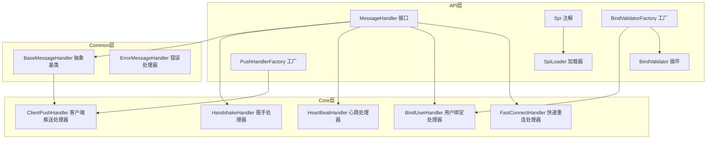
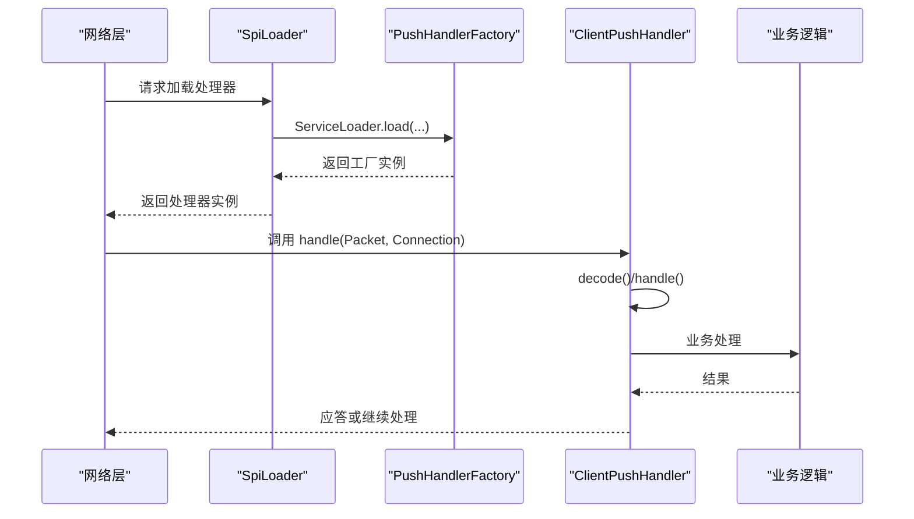
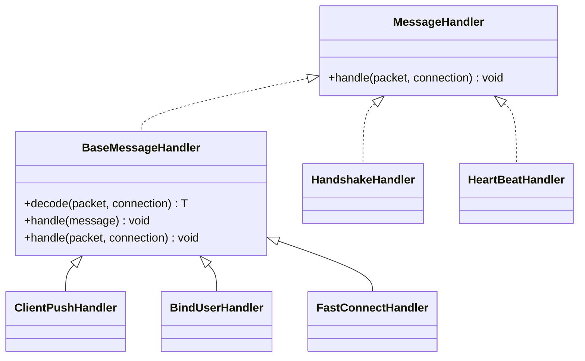
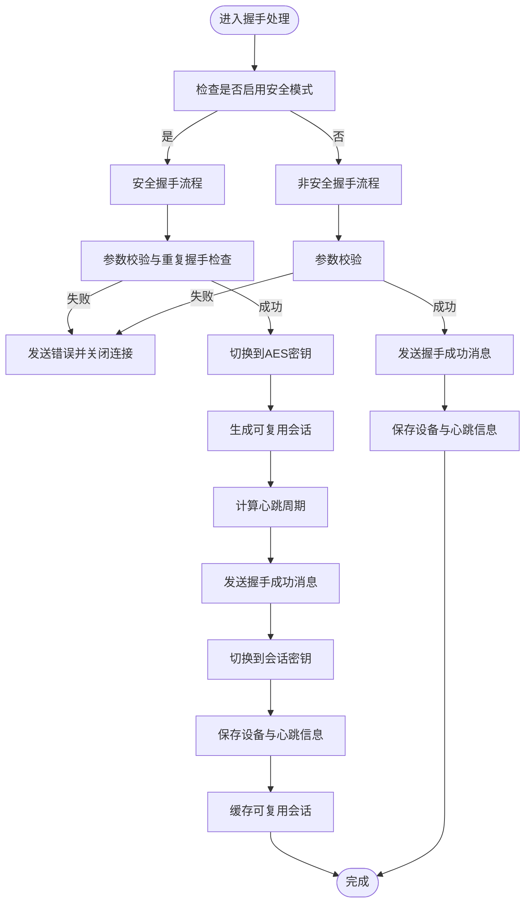
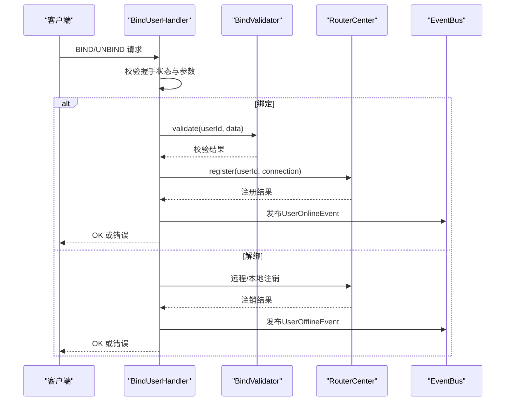
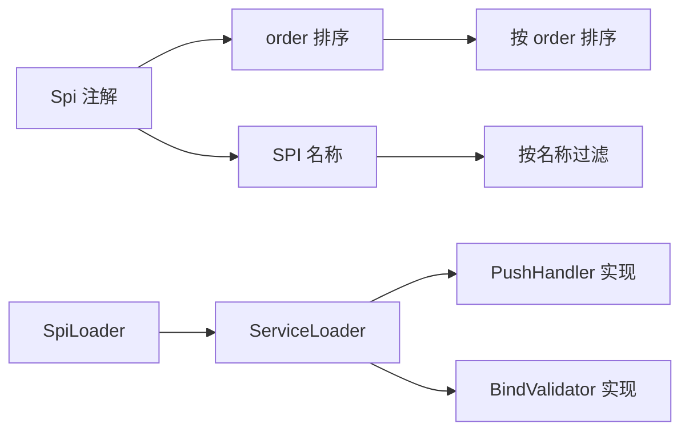

# 自定义处理器开发

<cite>
**本文引用的文件**
- [mpush-api/src/main/java/com/mpush/api/message/MessageHandler.java](file://mpush-api/src/main/java/com/mpush/api/message/MessageHandler.java)
- [mpush-api/src/main/java/com/mpush/api/spi/Spi.java](file://mpush-api/src/main/java/com/mpush/api/spi/Spi.java)
- [mpush-api/src/main/java/com/mpush/api/spi/SpiLoader.java](file://mpush-api/src/main/java/com/mpush/api/spi/SpiLoader.java)
- [mpush-api/src/main/java/com/mpush/api/spi/Factory.java](file://mpush-api/src/main/java/com/mpush/api/spi/Factory.java)
- [mpush-api/src/main/java/com/mpush/api/spi/handler/PushHandlerFactory.java](file://mpush-api/src/main/java/com/mpush/api/spi/handler/PushHandlerFactory.java)
- [mpush-api/src/main/java/com/mpush/api/spi/handler/BindValidatorFactory.java](file://mpush-api/src/main/java/com/mpush/api/spi/handler/BindValidatorFactory.java)
- [mpush-api/src/main/java/com/mpush/api/spi/handler/BindValidator.java](file://mpush-api/src/main/java/com/mpush/api/spi/handler/BindValidator.java)
- [mpush-common/src/main/java/com/mpush/common/handler/BaseMessageHandler.java](file://mpush-common/src/main/java/com/mpush/common/handler/BaseMessageHandler.java)
- [mpush-common/src/main/java/com/mpush/common/handler/ErrorMessageHandler.java](file://mpush-common/src/main/java/com/mpush/common/handler/ErrorMessageHandler.java)
- [mpush-core/src/main/java/com/mpush/core/handler/ClientPushHandler.java](file://mpush-core/src/main/java/com/mpush/core/handler/ClientPushHandler.java)
- [mpush-core/src/main/java/com/mpush/core/handler/HandshakeHandler.java](file://mpush-core/src/main/java/com/mpush/core/handler/HandshakeHandler.java)
- [mpush-core/src/main/java/com/mpush/core/handler/HeartBeatHandler.java](file://mpush-core/src/main/java/com/mpush/core/handler/HeartBeatHandler.java)
- [mpush-core/src/main/java/com/mpush/core/handler/BindUserHandler.java](file://mpush-core/src/main/java/com/mpush/core/handler/BindUserHandler.java)
- [mpush-core/src/main/java/com/mpush/core/handler/FastConnectHandler.java](file://mpush-core/src/main/java/com/mpush/core/handler/FastConnectHandler.java)
- [mpush-core/src/main/resources/META-INF/services/com.mpush.api.spi.handler.PushHandlerFactory](file://mpush-core/src/main/resources/META-INF/services/com.mpush.api.spi.handler.PushHandlerFactory)
- [mpush-core/src/main/resources/META-INF/services/com.mpush.api.spi.handler.BindValidatorFactory](file://mpush-core/src/main/resources/META-INF/services/com.mpush.api.spi.handler.BindValidatorFactory)
</cite>

## 目录
1. [简介](#简介)
2. [项目结构](#项目结构)
3. [核心组件](#核心组件)
4. [架构总览](#架构总览)
5. [详细组件分析](#详细组件分析)
6. [依赖分析](#依赖分析)
7. [性能考量](#性能考量)
8. [故障排查指南](#故障排查指南)
9. [结论](#结论)
10. [附录](#附录)

## 简介
本指南面向需要在MPush中开发自定义处理器的工程师，系统讲解处理器架构设计与实现方法，涵盖处理器链执行顺序、消息拦截机制、异常处理策略、不同处理器类型（握手、心跳、用户绑定、推送、连接）的开发要点与编程模式，并提供基于SPI的注册与配置方式、最佳实践以及常见问题与调试技巧。

## 项目结构
MPush采用模块化分层设计：API层定义通用接口与SPI；Common层提供通用处理器基类与消息模型；Core层实现具体业务处理器；Netty等模块负责网络传输；Cache/Tools/ZK等模块提供基础设施能力。处理器开发主要围绕API层的MessageHandler接口与SPI机制展开。

图表来源
- [mpush-api/src/main/java/com/mpush/api/message/MessageHandler.java](file://mpush-api/src/main/java/com/mpush/api/message/MessageHandler.java#L30-L32)
- [mpush-api/src/main/java/com/mpush/api/spi/Spi.java](file://mpush-api/src/main/java/com/mpush/api/spi/Spi.java#L32-L48)
- [mpush-api/src/main/java/com/mpush/api/spi/SpiLoader.java](file://mpush-api/src/main/java/com/mpush/api/spi/SpiLoader.java#L32-L95)
- [mpush-api/src/main/java/com/mpush/api/spi/handler/PushHandlerFactory.java](file://mpush-api/src/main/java/com/mpush/api/spi/handler/PushHandlerFactory.java#L31-L35)
- [mpush-api/src/main/java/com/mpush/api/spi/handler/BindValidatorFactory.java](file://mpush-api/src/main/java/com/mpush/api/spi/handler/BindValidatorFactory.java#L30-L34)
- [mpush-api/src/main/java/com/mpush/api/spi/handler/BindValidator.java](file://mpush-api/src/main/java/com/mpush/api/spi/handler/BindValidator.java#L29-L31)
- [mpush-common/src/main/java/com/mpush/common/handler/BaseMessageHandler.java](file://mpush-common/src/main/java/com/mpush/common/handler/BaseMessageHandler.java#L34-L70)
- [mpush-common/src/main/java/com/mpush/common/handler/ErrorMessageHandler.java](file://mpush-common/src/main/java/com/mpush/common/handler/ErrorMessageHandler.java#L31-L41)
- [mpush-core/src/main/java/com/mpush/core/handler/ClientPushHandler.java](file://mpush-core/src/main/java/com/mpush/core/handler/ClientPushHandler.java#L38-L61)
- [mpush-core/src/main/java/com/mpush/core/handler/HandshakeHandler.java](file://mpush-core/src/main/java/com/mpush/core/handler/HandshakeHandler.java#L47-L159)
- [mpush-core/src/main/java/com/mpush/core/handler/HeartBeatHandler.java](file://mpush-core/src/main/java/com/mpush/core/handler/HeartBeatHandler.java#L32-L39)
- [mpush-core/src/main/java/com/mpush/core/handler/BindUserHandler.java](file://mpush-core/src/main/java/com/mpush/core/handler/BindUserHandler.java#L50-L184)
- [mpush-core/src/main/java/com/mpush/core/handler/FastConnectHandler.java](file://mpush-core/src/main/java/com/mpush/core/handler/FastConnectHandler.java#L44-L94)

章节来源
- [mpush-api/src/main/java/com/mpush/api/message/MessageHandler.java](file://mpush-api/src/main/java/com/mpush/api/message/MessageHandler.java#L30-L32)
- [mpush-common/src/main/java/com/mpush/common/handler/BaseMessageHandler.java](file://mpush-common/src/main/java/com/mpush/common/handler/BaseMessageHandler.java#L34-L70)
- [mpush-core/src/main/java/com/mpush/core/handler/ClientPushHandler.java](file://mpush-core/src/main/java/com/mpush/core/handler/ClientPushHandler.java#L38-L61)
- [mpush-core/src/main/java/com/mpush/core/handler/HandshakeHandler.java](file://mpush-core/src/main/java/com/mpush/core/handler/HandshakeHandler.java#L47-L159)
- [mpush-core/src/main/java/com/mpush/core/handler/HeartBeatHandler.java](file://mpush-core/src/main/java/com/mpush/core/handler/HeartBeatHandler.java#L32-L39)
- [mpush-core/src/main/java/com/mpush/core/handler/BindUserHandler.java](file://mpush-core/src/main/java/com/mpush/core/handler/BindUserHandler.java#L50-L184)
- [mpush-core/src/main/java/com/mpush/core/handler/FastConnectHandler.java](file://mpush-core/src/main/java/com/mpush/core/handler/FastConnectHandler.java#L44-L94)

## 核心组件
- 处理器接口与基类
  - MessageHandler：统一的消息处理入口，接收Packet与Connection。
  - BaseMessageHandler：提供解码与处理的模板方法，自动计时与错误分支处理。
- SPI机制
  - Spi注解：声明SPI名称与排序优先级。
  - SpiLoader：基于JDK ServiceLoader的SPI加载器，支持缓存与按名称过滤、按order排序。
  - Factory接口：约定工厂方法get()返回实例。
- 具体处理器
  - ClientPushHandler：客户端推送消息处理器，支持自动应答与业务扩展点。
  - HandshakeHandler：握手处理器，支持安全握手与非安全握手路径。
  - HeartBeatHandler：心跳处理器，简单回显。
  - BindUserHandler：用户绑定/解绑处理器，集成BindValidator进行身份校验。
  - FastConnectHandler：快速重连处理器，基于可复用会话恢复上下文。

章节来源
- [mpush-api/src/main/java/com/mpush/api/message/MessageHandler.java](file://mpush-api/src/main/java/com/mpush/api/message/MessageHandler.java#L30-L32)
- [mpush-common/src/main/java/com/mpush/common/handler/BaseMessageHandler.java](file://mpush-common/src/main/java/com/mpush/common/handler/BaseMessageHandler.java#L34-L70)
- [mpush-api/src/main/java/com/mpush/api/spi/Spi.java](file://mpush-api/src/main/java/com/mpush/api/spi/Spi.java#L32-L48)
- [mpush-api/src/main/java/com/mpush/api/spi/SpiLoader.java](file://mpush-api/src/main/java/com/mpush/api/spi/SpiLoader.java#L32-L95)
- [mpush-api/src/main/java/com/mpush/api/spi/Factory.java](file://mpush-api/src/main/java/com/mpush/api/spi/Factory.java)
- [mpush-core/src/main/java/com/mpush/core/handler/ClientPushHandler.java](file://mpush-core/src/main/java/com/mpush/core/handler/ClientPushHandler.java#L38-L61)
- [mpush-core/src/main/java/com/mpush/core/handler/HandshakeHandler.java](file://mpush-core/src/main/java/com/mpush/core/handler/HandshakeHandler.java#L47-L159)
- [mpush-core/src/main/java/com/mpush/core/handler/HeartBeatHandler.java](file://mpush-core/src/main/java/com/mpush/core/handler/HeartBeatHandler.java#L32-L39)
- [mpush-core/src/main/java/com/mpush/core/handler/BindUserHandler.java](file://mpush-core/src/main/java/com/mpush/core/handler/BindUserHandler.java#L50-L184)
- [mpush-core/src/main/java/com/mpush/core/handler/FastConnectHandler.java](file://mpush-core/src/main/java/com/mpush/core/handler/FastConnectHandler.java#L44-L94)

## 架构总览
MPush的处理器链由网络层接收到Packet后，交由MessageHandler处理。BaseMessageHandler统一执行解码与处理流程，并通过SPI机制加载具体实现。握手、心跳、绑定、推送、快速重连等处理器分别覆盖不同协议阶段与业务场景。

图表来源
- [mpush-api/src/main/java/com/mpush/api/spi/SpiLoader.java](file://mpush-api/src/main/java/com/mpush/api/spi/SpiLoader.java#L32-L95)
- [mpush-api/src/main/java/com/mpush/api/spi/handler/PushHandlerFactory.java](file://mpush-api/src/main/java/com/mpush/api/spi/handler/PushHandlerFactory.java#L31-L35)
- [mpush-core/src/main/java/com/mpush/core/handler/ClientPushHandler.java](file://mpush-core/src/main/java/com/mpush/core/handler/ClientPushHandler.java#L38-L61)

## 详细组件分析

### 处理器接口与基类
- MessageHandler.handle(Packet, Connection)：统一入口，所有处理器必须实现。
- BaseMessageHandler：
  - decode(Packet, Connection)：子类实现具体解码。
  - handle(T message)：子类实现具体业务处理。
  - handle(Packet, Connection)：模板方法，自动计时与错误分支处理。

图表来源
- [mpush-api/src/main/java/com/mpush/api/message/MessageHandler.java](file://mpush-api/src/main/java/com/mpush/api/message/MessageHandler.java#L30-L32)
- [mpush-common/src/main/java/com/mpush/common/handler/BaseMessageHandler.java](file://mpush-common/src/main/java/com/mpush/common/handler/BaseMessageHandler.java#L34-L70)
- [mpush-core/src/main/java/com/mpush/core/handler/ClientPushHandler.java](file://mpush-core/src/main/java/com/mpush/core/handler/ClientPushHandler.java#L38-L61)
- [mpush-core/src/main/java/com/mpush/core/handler/HandshakeHandler.java](file://mpush-core/src/main/java/com/mpush/core/handler/HandshakeHandler.java#L47-L159)
- [mpush-core/src/main/java/com/mpush/core/handler/HeartBeatHandler.java](file://mpush-core/src/main/java/com/mpush/core/handler/HeartBeatHandler.java#L32-L39)
- [mpush-core/src/main/java/com/mpush/core/handler/BindUserHandler.java](file://mpush-core/src/main/java/com/mpush/core/handler/BindUserHandler.java#L50-L184)
- [mpush-core/src/main/java/com/mpush/core/handler/FastConnectHandler.java](file://mpush-core/src/main/java/com/mpush/core/handler/FastConnectHandler.java#L44-L94)

章节来源
- [mpush-api/src/main/java/com/mpush/api/message/MessageHandler.java](file://mpush-api/src/main/java/com/mpush/api/message/MessageHandler.java#L30-L32)
- [mpush-common/src/main/java/com/mpush/common/handler/BaseMessageHandler.java](file://mpush-common/src/main/java/com/mpush/common/handler/BaseMessageHandler.java#L34-L70)

### 握手处理器（HandshakeHandler）
- 功能要点
  - 支持安全与非安全两种握手路径。
  - 参数校验、重复握手检测、会话密钥切换、可复用会话生成与缓存、心跳计算与下发。
- 开发要点
  - 在handle中根据连接上下文选择安全/非安全部署。
  - 使用SessionContext更新设备信息、版本信息、心跳周期。
  - 成功后切换加密算法并持久化可复用会话。

图表来源
- [mpush-core/src/main/java/com/mpush/core/handler/HandshakeHandler.java](file://mpush-core/src/main/java/com/mpush/core/handler/HandshakeHandler.java#L61-L159)

章节来源
- [mpush-core/src/main/java/com/mpush/core/handler/HandshakeHandler.java](file://mpush-core/src/main/java/com/mpush/core/handler/HandshakeHandler.java#L47-L159)

### 心跳处理器（HeartBeatHandler）
- 功能要点
  - 接收Ping包直接回显Pong包，维持连接活性。
- 开发要点
  - 保持极简处理，避免阻塞与额外开销。

章节来源
- [mpush-core/src/main/java/com/mpush/core/handler/HeartBeatHandler.java](file://mpush-core/src/main/java/com/mpush/core/handler/HeartBeatHandler.java#L32-L39)

### 用户绑定处理器（BindUserHandler）
- 功能要点
  - 绑定/解绑用户，校验握手状态，调用BindValidator进行身份验证，注册/注销本地与远程路由，发布在线/离线事件。
- 开发要点
  - 绑定前校验握手状态与参数合法性。
  - 使用BindValidatorFactory.create()加载校验器，支持自定义校验策略。
  - 解绑时需确保同一设备来源，避免跨设备误操作。

图表来源
- [mpush-core/src/main/java/com/mpush/core/handler/BindUserHandler.java](file://mpush-core/src/main/java/com/mpush/core/handler/BindUserHandler.java#L66-L172)
- [mpush-api/src/main/java/com/mpush/api/spi/handler/BindValidatorFactory.java](file://mpush-api/src/main/java/com/mpush/api/spi/handler/BindValidatorFactory.java#L30-L34)
- [mpush-api/src/main/java/com/mpush/api/spi/handler/BindValidator.java](file://mpush-api/src/main/java/com/mpush/api/spi/handler/BindValidator.java#L29-L31)

章节来源
- [mpush-core/src/main/java/com/mpush/core/handler/BindUserHandler.java](file://mpush-core/src/main/java/com/mpush/core/handler/BindUserHandler.java#L50-L184)
- [mpush-api/src/main/java/com/mpush/api/spi/handler/BindValidatorFactory.java](file://mpush-api/src/main/java/com/mpush/api/spi/handler/BindValidatorFactory.java#L30-L34)
- [mpush-api/src/main/java/com/mpush/api/spi/handler/BindValidator.java](file://mpush-api/src/main/java/com/mpush/api/spi/handler/BindValidator.java#L29-L31)

### 推送处理器（ClientPushHandler）
- 功能要点
  - 接收客户端推送消息，支持自动应答（Ack），提供业务扩展点。
- 开发要点
  - 在handle中实现业务逻辑，必要时发送Ack以保证可靠性。
  - 可通过@Spi(order=...)控制执行顺序。

章节来源
- [mpush-core/src/main/java/com/mpush/core/handler/ClientPushHandler.java](file://mpush-core/src/main/java/com/mpush/core/handler/ClientPushHandler.java#L38-L61)
- [mpush-api/src/main/java/com/mpush/api/spi/Spi.java](file://mpush-api/src/main/java/com/mpush/api/spi/Spi.java#L32-L48)

### 快速重连处理器（FastConnectHandler）
- 功能要点
  - 基于sessionId与deviceId校验可复用会话，恢复会话上下文并下发心跳。
- 开发要点
  - 查询可复用会话、校验设备一致性、更新心跳、恢复会话上下文。

章节来源
- [mpush-core/src/main/java/com/mpush/core/handler/FastConnectHandler.java](file://mpush-core/src/main/java/com/mpush/core/handler/FastConnectHandler.java#L44-L94)

### 错误处理器（ErrorMessageHandler）
- 功能要点
  - 统一处理错误消息，作为默认错误分支的兜底处理器。
- 开发要点
  - 可继承BaseMessageHandler，按需实现解码与空处理逻辑。

章节来源
- [mpush-common/src/main/java/com/mpush/common/handler/ErrorMessageHandler.java](file://mpush-common/src/main/java/com/mpush/common/handler/ErrorMessageHandler.java#L31-L41)

## 依赖分析
- SPI加载与优先级
  - SpiLoader.load(clazz, name)：支持按名称过滤与按order排序，默认使用ServiceLoader加载。
  - Spi.order()：用于多实现时的排序，数值越小优先级越高。
- 工厂接口
  - PushHandlerFactory/BindValidatorFactory：通过SpiLoader.load(factoryClass).get()获取实例。
- 资源文件
  - META-INF/services/com.mpush.api.spi.handler.PushHandlerFactory：指向默认的ClientPushHandler实现。
  - META-INF/services/com.mpush.api.spi.handler.BindValidatorFactory：指向默认的BindValidator实现。

图表来源
- [mpush-api/src/main/java/com/mpush/api/spi/Spi.java](file://mpush-api/src/main/java/com/mpush/api/spi/Spi.java#L32-L48)
- [mpush-api/src/main/java/com/mpush/api/spi/SpiLoader.java](file://mpush-api/src/main/java/com/mpush/api/spi/SpiLoader.java#L32-L95)
- [mpush-core/src/main/resources/META-INF/services/com.mpush.api.spi.handler.PushHandlerFactory](file://mpush-core/src/main/resources/META-INF/services/com.mpush.api.spi.handler.PushHandlerFactory#L1)
- [mpush-core/src/main/resources/META-INF/services/com.mpush.api.spi.handler.BindValidatorFactory](file://mpush-core/src/main/resources/META-INF/services/com.mpush.api.spi.handler.BindValidatorFactory#L1)

章节来源
- [mpush-api/src/main/java/com/mpush/api/spi/Spi.java](file://mpush-api/src/main/java/com/mpush/api/spi/Spi.java#L32-L48)
- [mpush-api/src/main/java/com/mpush/api/spi/SpiLoader.java](file://mpush-api/src/main/java/com/mpush/api/spi/SpiLoader.java#L32-L95)
- [mpush-core/src/main/resources/META-INF/services/com.mpush.api.spi.handler.PushHandlerFactory](file://mpush-core/src/main/resources/META-INF/services/com.mpush.api.spi.handler.PushHandlerFactory#L1)
- [mpush-core/src/main/resources/META-INF/services/com.mpush.api.spi.handler.BindValidatorFactory](file://mpush-core/src/main/resources/META-INF/services/com.mpush.api.spi.handler.BindValidatorFactory#L1)

## 性能考量
- 计时与剖析
  - BaseMessageHandler对解码与处理阶段进行Profiler.enter/release，便于定位热点。
- 异步与非阻塞
  - 处理器应避免长时间阻塞，必要时委托异步任务执行。
- 缓存与复用
  - 可复用会话（FastConnectHandler）减少握手成本。
- 日志分级
  - 使用Logs.CONN/Logs.HB/Logs.PUSH等分类日志，便于监控与排障。

章节来源
- [mpush-common/src/main/java/com/mpush/common/handler/BaseMessageHandler.java](file://mpush-common/src/main/java/com/mpush/common/handler/BaseMessageHandler.java#L42-L53)
- [mpush-core/src/main/java/com/mpush/core/handler/FastConnectHandler.java](file://mpush-core/src/main/java/com/mpush/core/handler/FastConnectHandler.java#L57-L93)

## 故障排查指南
- 握手失败
  - 参数无效或重复握手：检查HandshakeHandler中的参数校验与deviceId重复判断。
  - 安全握手密钥不匹配：确认客户端与服务端密钥长度一致。
- 绑定失败
  - 未握手即绑定：检查握手状态后再进行绑定。
  - 身份校验失败：确认BindValidator.validate返回true。
  - 路由注册失败：检查本地/远程路由注册一致性。
- 快速重连失败
  - 会话过期：sessionId不存在或已过期。
  - 非法设备：deviceId与缓存不一致。
- 心跳异常
  - 心跳未回显：确认HeartBeatHandler被正确加载并处理。

章节来源
- [mpush-core/src/main/java/com/mpush/core/handler/HandshakeHandler.java](file://mpush-core/src/main/java/com/mpush/core/handler/HandshakeHandler.java#L69-L159)
- [mpush-core/src/main/java/com/mpush/core/handler/BindUserHandler.java](file://mpush-core/src/main/java/com/mpush/core/handler/BindUserHandler.java#L74-L172)
- [mpush-core/src/main/java/com/mpush/core/handler/FastConnectHandler.java](file://mpush-core/src/main/java/com/mpush/core/handler/FastConnectHandler.java#L57-L93)
- [mpush-core/src/main/java/com/mpush/core/handler/HeartBeatHandler.java](file://mpush-core/src/main/java/com/mpush/core/handler/HeartBeatHandler.java#L32-L39)

## 结论
MPush通过MessageHandler统一入口与BaseMessageHandler模板方法，结合SPI机制实现了灵活可插拔的处理器体系。开发者可基于该架构快速实现自定义处理器，遵循参数校验、握手前置、路由一致性与异常处理等最佳实践，即可在保证性能与安全的前提下扩展业务能力。

## 附录

### 自定义处理器开发步骤
- 选择处理器类型
  - 消息处理器：继承BaseMessageHandler，实现decode与handle。
  - 连接处理器：实现MessageHandler，处理连接生命周期事件。
  - 推送处理器：继承BaseMessageHandler，实现推送消息处理。
- 实现接口与重写方法
  - 实现MessageHandler.handle或继承BaseMessageHandler。
  - 在handle中编写业务逻辑，必要时发送应答或错误消息。
- 参数与返回值处理
  - 通过Packet与Connection获取上下文信息。
  - 使用工具类（如Logs、ConfigTools、EventBus）辅助处理。
- 注册与配置
  - 通过@Spi(order=...)设置执行顺序。
  - 在META-INF/services目录下提供工厂实现文件，指向你的实现类。
  - 如需按名称加载，可通过SpiLoader.load(FactoryClass.class, "实现类名")。
- 最佳实践
  - 严格前置校验（握手状态、参数合法性）。
  - 保持处理逻辑轻量，复杂逻辑异步化。
  - 使用日志分级与计时工具定位性能瓶颈。
  - 注意异常处理与资源释放，避免内存泄漏。

章节来源
- [mpush-api/src/main/java/com/mpush/api/spi/Spi.java](file://mpush-api/src/main/java/com/mpush/api/spi/Spi.java#L32-L48)
- [mpush-api/src/main/java/com/mpush/api/spi/SpiLoader.java](file://mpush-api/src/main/java/com/mpush/api/spi/SpiLoader.java#L32-L95)
- [mpush-common/src/main/java/com/mpush/common/handler/BaseMessageHandler.java](file://mpush-common/src/main/java/com/mpush/common/handler/BaseMessageHandler.java#L34-L70)
- [mpush-core/src/main/resources/META-INF/services/com.mpush.api.spi.handler.PushHandlerFactory](file://mpush-core/src/main/resources/META-INF/services/com.mpush.api.spi.handler.PushHandlerFactory#L1)
- [mpush-core/src/main/resources/META-INF/services/com.mpush.api.spi.handler.BindValidatorFactory](file://mpush-core/src/main/resources/META-INF/services/com.mpush.api.spi.handler.BindValidatorFactory#L1)