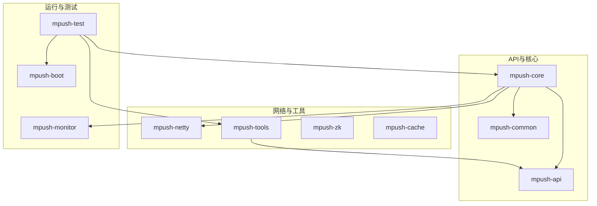
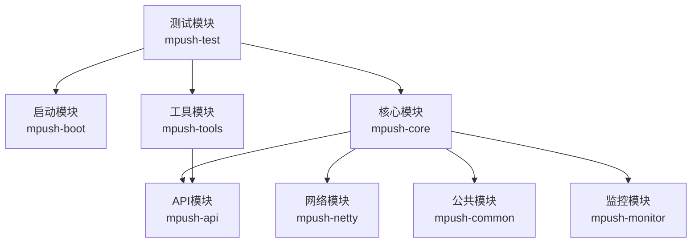
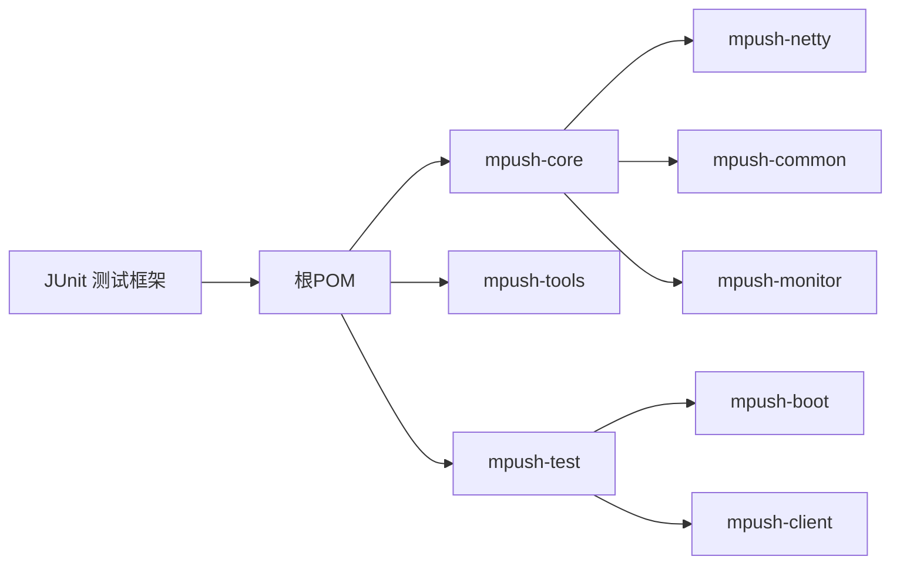

# 单元测试

<cite>
**本文引用的文件**
- [pom.xml](file://pom.xml)
- [mpush-core/pom.xml](file://mpush-core/pom.xml)
- [mpush-api/pom.xml](file://mpush-api/pom.xml)
- [mpush-tools/pom.xml](file://mpush-tools/pom.xml)
- [mpush-test/pom.xml](file://mpush-test/pom.xml)
- [mpush-core/src/test/java/com/mpush/core/security/CipherBoxTest.java](file://mpush-core/src/test/java/com/mpush/core/security/CipherBoxTest.java)
- [mpush-tools/src/test/java/com/mpush/tools/crypto/AESUtilsTest.java](file://mpush-tools/src/test/java/com/mpush/tools/crypto/AESUtilsTest.java)
- [mpush-tools/src/test/java/com/mpush/tools/crypto/RSAUtilsTest.java](file://mpush-tools/src/test/java/com/mpush/tools/crypto/RSAUtilsTest.java)
- [mpush-tools/src/test/java/com/mpush/tools/IOUtilsTest.java](file://mpush-tools/src/test/java/com/mpush/tools/IOUtilsTest.java)
- [mpush-monitor/src/test/java/com/mpush/AppTest.java](file://mpush-monitor/src/test/java/com/mpush/AppTest.java)
</cite>

## 目录
1. [简介](#简介)
2. [项目结构](#项目结构)
3. [核心组件](#核心组件)
4. [架构总览](#架构总览)
5. [详细组件分析](#详细组件分析)
6. [依赖分析](#依赖分析)
7. [性能考虑](#性能考虑)
8. [故障排查指南](#故障排查指南)
9. [结论](#结论)
10. [附录](#附录)

## 简介
本指南面向MPush项目的单元测试实践，目标是帮助开发者为消息推送系统的核心模块（如消息推送、路由管理、网络通信等）编写高质量的单元测试。内容涵盖：
- 单元测试基本概念与重要性
- 测试金字塔在MPush中的应用
- 核心模块测试策略与示例路径
- JUnit断言与Mockito模拟外部依赖
- 测试数据准备与测试夹具设计
- 异常与边界条件测试
- 测试覆盖率分析（JaCoCo）与配置
- 测试命名约定与组织最佳实践

## 项目结构
MPush采用多模块Maven工程组织，核心模块与测试模块分布如下：
- mpush-api：对外API与协议定义
- mpush-core：核心业务逻辑（消息推送、路由中心、服务器等）
- mpush-tools：通用工具库（加解密、IO、线程池等）
- mpush-netty：网络传输层（基于Netty）
- mpush-common：公共组件（消息分发、流量控制、用户管理等）
- mpush-test：集成测试与客户端测试工具
- mpush-monitor：监控与JMX统计
- mpush-zk：服务注册与发现（ZooKeeper）
- mpush-cache：缓存与消息队列（Redis）

图表来源
- [pom.xml](file://pom.xml#L54-L66)
- [mpush-core/pom.xml](file://mpush-core/pom.xml#L21-L34)
- [mpush-api/pom.xml](file://mpush-api/pom.xml#L21-L32)
- [mpush-tools/pom.xml](file://mpush-tools/pom.xml#L38-L91)
- [mpush-test/pom.xml](file://mpush-test/pom.xml#L19-L33)

章节来源
- [pom.xml](file://pom.xml#L54-L66)
- [mpush-core/pom.xml](file://mpush-core/pom.xml#L1-L36)
- [mpush-api/pom.xml](file://mpush-api/pom.xml#L1-L35)
- [mpush-tools/pom.xml](file://mpush-tools/pom.xml#L1-L93)
- [mpush-test/pom.xml](file://mpush-test/pom.xml#L1-L90)

## 核心组件
- 消息推送模块：负责消息的接收、分发、ACK确认、广播与单播任务调度
- 路由管理模块：本地与远程路由管理、用户事件消费、路由变更监听
- 网络通信模块：基于Netty的TCP/UDP/WebSocket连接、编解码器、连接管理
- 工具库模块：加解密（AES/RSA）、IO压缩/解压、线程池与通用工具
- 公共组件：消息分发器、流量控制、用户状态管理

章节来源
- [mpush-core/pom.xml](file://mpush-core/pom.xml#L21-L34)
- [mpush-tools/pom.xml](file://mpush-tools/pom.xml#L38-L91)

## 架构总览
下图展示了测试关注点与模块关系，突出测试对核心业务与网络层的覆盖。

图表来源
- [pom.xml](file://pom.xml#L54-L66)
- [mpush-test/pom.xml](file://mpush-test/pom.xml#L19-L33)
- [mpush-core/pom.xml](file://mpush-core/pom.xml#L21-L34)

## 详细组件分析

### 消息推送模块测试策略
- 关注点
  - 推送任务构建与执行（单播/广播）
  - ACK回调与超时处理
  - MQ消息监听与转发
  - 广播控制器与网关推送
- 建议测试类型
  - 正向流程：构造PushTask/SendTask，断言执行结果与回调触发
  - 边界条件：空消息、超长消息、重复用户、离线用户
  - 错误场景：MQ失败、网关不可达、序列化异常
- 示例参考
  - [PushCenter测试样例](file://mpush-core/src/test/java/com/mpush/core/security/CipherBoxTest.java#L32-L48)
- Mock建议
  - 使用Mockito模拟MQClient/MQPushListener/GatewayPushListener
  - 使用桩对象模拟ConnectionManager/SessionContext

章节来源
- [mpush-core/src/test/java/com/mpush/core/security/CipherBoxTest.java](file://mpush-core/src/test/java/com/mpush/core/security/CipherBoxTest.java#L30-L48)

### 路由管理模块测试策略
- 关注点
  - 本地路由表增删改查
  - 远程路由同步与失效处理
  - 用户上下线事件消费
  - 客户端分类与位置信息
- 建议测试类型
  - 正向流程：添加/移除路由、查询命中率
  - 异常流程：重复注册、并发更新、跨节点一致性
- 示例参考
  - [LocalRouterManager测试样例](file://mpush-core/src/test/java/com/mpush/core/security/CipherBoxTest.java#L32-L48)
- Mock建议
  - Mock RouterCenter/RemoteRouterManager
  - 使用内存存储替代Redis/ZK以避免外部依赖

章节来源
- [mpush-core/src/test/java/com/mpush/core/security/CipherBoxTest.java](file://mpush-core/src/test/java/com/mpush/core/security/CipherBoxTest.java#L30-L48)

### 网络通信模块测试策略
- 关注点
  - 编解码器正确性（PacketDecoder/PacketEncoder）
  - 连接生命周期（建立/关闭/心跳）
  - UDP/TCP/WebSocket通道行为
- 建议测试类型
  - 正向流程：编码/解码完整包、握手序列
  - 边界条件：空包、畸形包、超大包
  - 错误场景：解码异常、连接中断
- 示例参考
  - [NettyTCPServer测试样例](file://mpush-core/src/test/java/com/mpush/core/security/CipherBoxTest.java#L32-L48)
- Mock建议
  - 使用EmbeddedChannel测试编解码
  - 使用Mock ChannelHandlerContext

章节来源
- [mpush-core/src/test/java/com/mpush/core/security/CipherBoxTest.java](file://mpush-core/src/test/java/com/mpush/core/security/CipherBoxTest.java#L30-L48)

### 工具库模块测试策略
- 加解密工具
  - AESUtils：对称加解密、随机密钥生成
  - RSAUtils：公私钥生成、加密/解密、签名/验签
- IO工具
  - IOUtils：压缩/解压、字节流处理
- 建议测试类型
  - 功能测试：输入输出一致性、异常抛出
  - 性能测试：批量处理耗时、内存占用
- 示例参考
  - [AESUtilsTest](file://mpush-tools/src/test/java/com/mpush/tools/crypto/AESUtilsTest.java#L32-L42)
  - [RSAUtilsTest](file://mpush-tools/src/test/java/com/mpush/tools/crypto/RSAUtilsTest.java#L52-L90)
  - [IOUtilsTest](file://mpush-tools/src/test/java/com/mpush/tools/IOUtilsTest.java#L32-L75)

章节来源
- [mpush-tools/src/test/java/com/mpush/tools/crypto/AESUtilsTest.java](file://mpush-tools/src/test/java/com/mpush/tools/crypto/AESUtilsTest.java#L30-L47)
- [mpush-tools/src/test/java/com/mpush/tools/crypto/RSAUtilsTest.java](file://mpush-tools/src/test/java/com/mpush/tools/crypto/RSAUtilsTest.java#L35-L135)
- [mpush-tools/src/test/java/com/mpush/tools/IOUtilsTest.java](file://mpush-tools/src/test/java/com/mpush/tools/IOUtilsTest.java#L30-L80)

### 监控与基础测试
- 监控模块测试
  - JMX Bean可用性、指标采集
- 基础测试
  - AppTest使用JUnit框架进行简单断言

章节来源
- [mpush-monitor/src/test/java/com/mpush/AppTest.java](file://mpush-monitor/src/test/java/com/mpush/AppTest.java#L10-L34)

## 依赖分析
- 测试框架
  - JUnit：单元测试框架，版本在根POM中统一管理
- 模块间依赖
  - mpush-core依赖mpush-netty、mpush-common、mpush-monitor
  - mpush-test依赖mpush-boot与mpush-client，用于集成测试
  - mpush-tools提供API与通用能力，被多个模块复用

图表来源
- [pom.xml](file://pom.xml#L224-L293)
- [mpush-core/pom.xml](file://mpush-core/pom.xml#L21-L34)
- [mpush-test/pom.xml](file://mpush-test/pom.xml#L19-L33)

章节来源
- [pom.xml](file://pom.xml#L224-L293)
- [mpush-core/pom.xml](file://mpush-core/pom.xml#L21-L34)
- [mpush-test/pom.xml](file://mpush-test/pom.xml#L19-L33)

## 性能考虑
- 单元测试应避免外部依赖（网络、磁盘、数据库），确保可重复与快速执行
- 对于IO密集型工具（如压缩/解压），可在测试中控制循环次数与数据规模，记录耗时并输出日志
- 对于加密/解密，建议使用固定种子或预生成密钥，保证可重现性

## 故障排查指南
- 测试无法运行
  - 检查Surefire插件是否被跳过（根POM中默认skip=true）
  - 在本地开发环境取消跳过或使用命令行参数执行测试
- 外部依赖问题
  - 使用Mockito替换Redis/ZK/Netty等外部组件
  - 对于编解码器测试，使用EmbeddedChannel进行纯内存测试
- 断言与日志
  - 使用System.out.println输出中间状态（仅限调试），生产测试应使用断言而非打印
- 覆盖率不足
  - 配置JaCoCo插件收集覆盖率，定位未覆盖分支与路径

## 结论
通过在MPush中实施以单元测试为核心的测试金字塔，结合Mockito模拟外部依赖、合理设计测试夹具与边界条件测试，可以显著提升核心模块的稳定性与可维护性。配合JaCoCo覆盖率分析，持续优化测试质量与覆盖率，确保系统在演进过程中保持高可靠性。

## 附录

### 测试命名约定与组织
- 类命名：被测类名+Test（如CipherBoxTest）
- 方法命名：testXxx（功能描述），如testEncryptDES、testGetPrivateKey
- 包组织：按模块划分，如core.security、crypto、common等

### 测试夹具设计
- 共享初始化：使用@Before准备测试数据与Mock对象
- 数据工厂：为不同场景构造测试数据（如随机密钥、消息体）
- 环境隔离：避免共享状态，每个测试独立初始化

### 异常测试与边界条件
- 异常场景：构造非法输入、空值、超长字符串、异常网络响应
- 边界条件：空集合、最大/最小值、null、空字符串
- 错误传播：验证异常是否按预期向上抛出或转换为特定错误码

### JUnit断言与Mockito使用
- 断言：使用JUnit提供的断言方法（assertEquals、assertTrue、assertNull等）
- Mock：使用Mockito创建桩对象，模拟外部依赖行为
- 验证：使用verify验证方法调用次数与参数

### JaCoCo覆盖率配置与使用
- 插件配置：在根POM中引入JaCoCo插件，并绑定到verify阶段
- 报告生成：执行mvn clean test jacoco:report生成覆盖率报告
- 覆盖率目标：设定关键模块的行覆盖率与分支覆盖率阈值

章节来源
- [pom.xml](file://pom.xml#L295-L322)