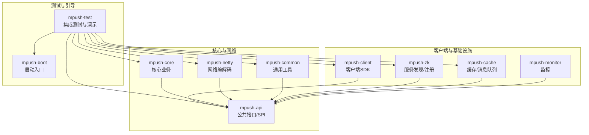
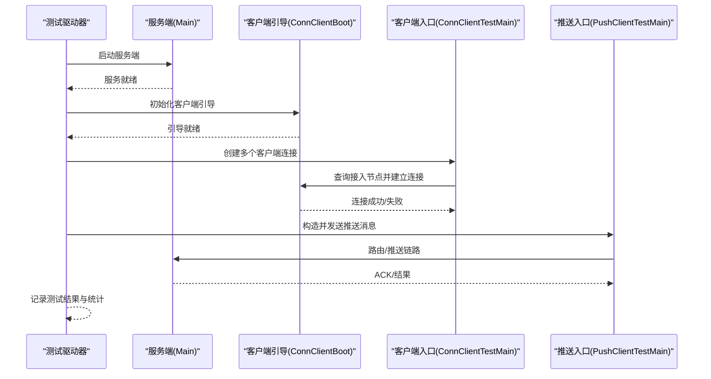
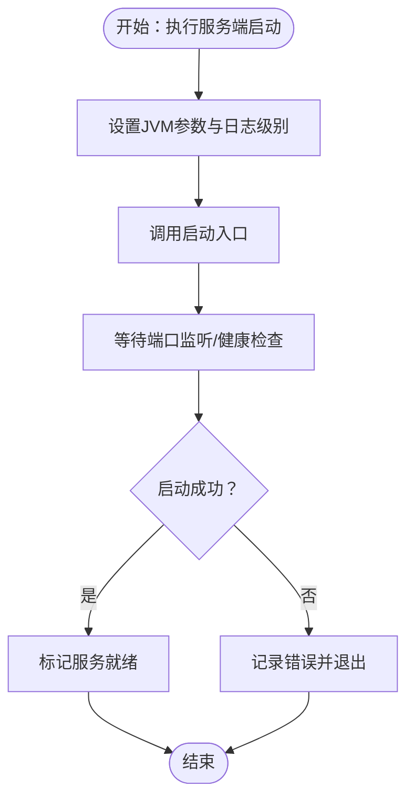
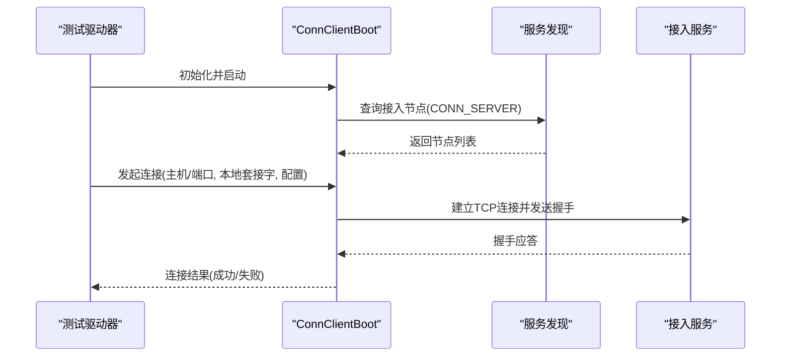
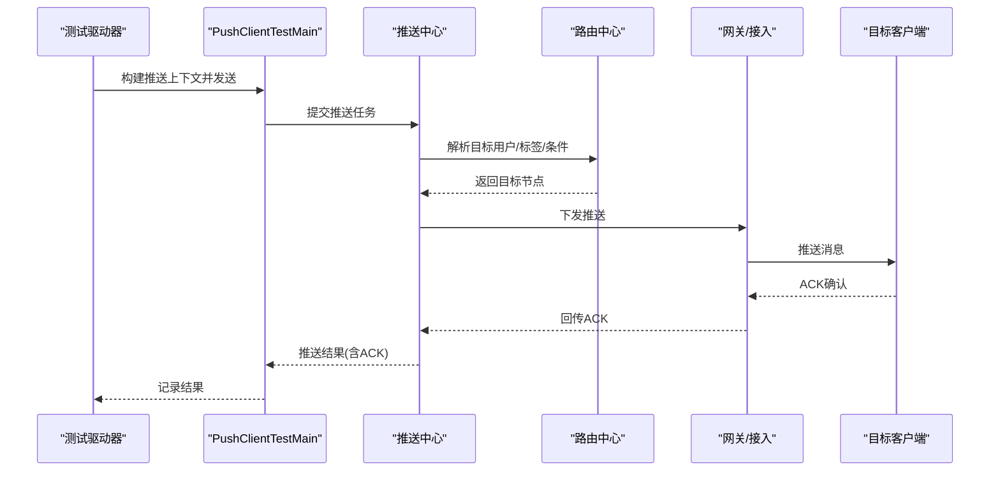
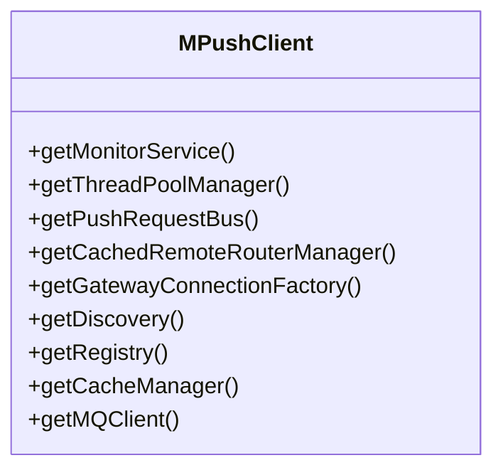
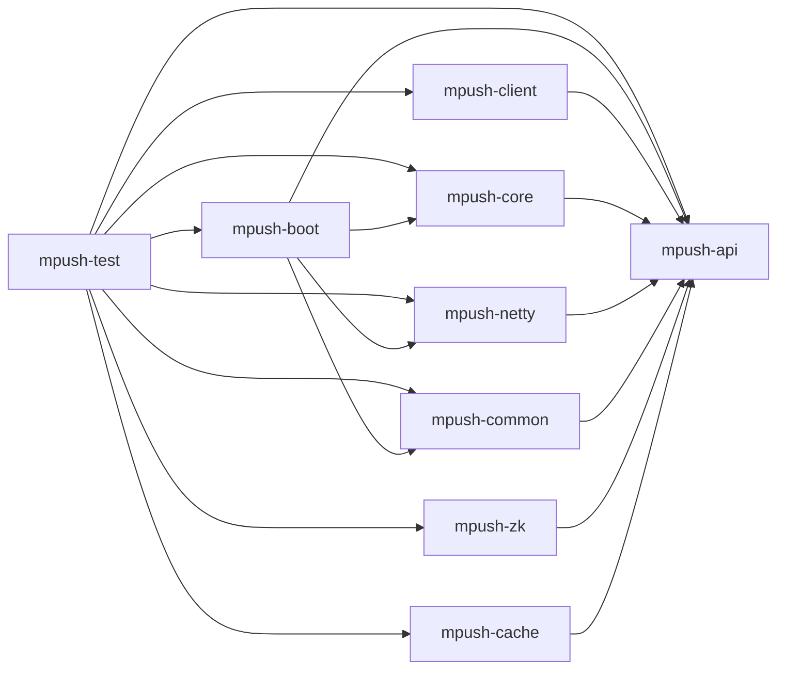

# 回归测试

<cite>
**本文引用的文件**
- [README.md](file://README.md)
- [pom.xml](file://pom.xml)
- [mpush-test/pom.xml](file://mpush-test/pom.xml)
- [mpush-test/src/main/resources/application.conf](file://mpush-test/src/main/resources/application.conf)
- [mpush-test/src/main/java/com/mpush/test/sever/ServerTestMain.java](file://mpush-test/src/main/java/com/mpush/test/sever/ServerTestMain.java)
- [mpush-test/src/main/java/com/mpush/test/client/ConnClientTestMain.java](file://mpush-test/src/main/java/com/mpush/test/client/ConnClientTestMain.java)
- [mpush-test/src/main/java/com/mpush/test/client/ConnClientBoot.java](file://mpush-test/src/main/java/com/mpush/test/client/ConnClientBoot.java)
- [mpush-test/src/main/java/com/mpush/test/push/PushClientTestMain.java](file://mpush-test/src/main/java/com/mpush/test/push/PushClientTestMain.java)
- [mpush-boot/src/main/java/com/mpush/bootstrap/Main.java](file://mpush-boot/src/main/java/com/mpush/bootstrap/Main.java)
- [mpush-client/src/main/java/com/mpush/client/MPushClient.java](file://mpush-client/src/main/java/com/mpush/client/MPushClient.java)
- [mpush-core/src/test/java/com/mpush/core/security/CipherBoxTest.java](file://mpush-core/src/test/java/com/mpush/core/security/CipherBoxTest.java)
</cite>

## 目录
1. [简介](#简介)
2. [项目结构](#项目结构)
3. [核心组件](#核心组件)
4. [架构总览](#架构总览)
5. [详细组件分析](#详细组件分析)
6. [依赖分析](#依赖分析)
7. [性能考量](#性能考量)
8. [故障排查指南](#故障排查指南)
9. [结论](#结论)
10. [附录](#附录)

## 简介
本指南面向MPush项目的回归测试实践，围绕“版本更新后的功能验证、新功能引入后的兼容性测试、缺陷修复后的验证测试”三大场景，系统阐述回归测试的概念与重要性，并结合仓库现有的测试模块与启动脚本，给出可落地的自动化流程设计、持续集成配置思路、测试用例选择策略、测试环境管理方法以及测试结果分析与跟踪要点。目标是帮助测试团队在MPush平台上建立稳定高效的回归测试体系。

## 项目结构
MPush采用多模块Maven聚合工程组织，核心模块与测试模块如下：
- mpush-api：公共接口与SPI定义
- mpush-boot：服务引导与启动入口
- mpush-core：核心业务逻辑（含单元测试）
- mpush-netty：网络编解码与连接层
- mpush-common：通用工具与消息模型
- mpush-client：客户端SDK与示例
- mpush-test：集成测试与演示脚本
- mpush-monitor：监控与指标
- mpush-zk：ZooKeeper服务发现与注册
- mpush-cache：缓存与消息队列适配

图表来源
- [pom.xml](file://pom.xml#L54-L66)
- [mpush-test/pom.xml](file://mpush-test/pom.xml#L19-L33)

章节来源
- [pom.xml](file://pom.xml#L54-L66)
- [README.md](file://README.md#L22-L31)

## 核心组件
- 测试引导与演示
  - 服务端启动演示：通过测试入口启动MPush服务，便于回归测试时快速拉起环境。
  - 客户端连接演示：模拟多客户端并发连接，验证接入层与握手流程。
  - 推送演示：通过推送客户端向指定用户下发消息，验证消息链路与ACK机制。
- 客户端SDK
  - 提供MPushClient封装，统一管理监控、路由、网关连接工厂与消息总线，便于在回归测试中复用。
- 单元测试
  - 核心模块包含安全算法等单元测试，可作为回归测试中稳定性与正确性的基线。

章节来源
- [mpush-test/src/main/java/com/mpush/test/sever/ServerTestMain.java](file://mpush-test/src/main/java/com/mpush/test/sever/ServerTestMain.java#L34-L48)
- [mpush-test/src/main/java/com/mpush/test/client/ConnClientTestMain.java](file://mpush-test/src/main/java/com/mpush/test/client/ConnClientTestMain.java#L71-L116)
- [mpush-test/src/main/java/com/mpush/test/push/PushClientTestMain.java](file://mpush-test/src/main/java/com/mpush/test/push/PushClientTestMain.java#L43-L75)
- [mpush-client/src/main/java/com/mpush/client/MPushClient.java](file://mpush-client/src/main/java/com/mpush/client/MPushClient.java#L38-L105)
- [mpush-core/src/test/java/com/mpush/core/security/CipherBoxTest.java](file://mpush-core/src/test/java/com/mpush/core/security/CipherBoxTest.java#L32-L48)

## 架构总览
下图展示回归测试在MPush中的典型交互路径：测试驱动器启动服务端与客户端，客户端通过服务发现定位接入节点并完成握手，随后发起消息推送，服务端经路由与推送中心完成消息投递与ACK返回。

图表来源
- [mpush-boot/src/main/java/com/mpush/bootstrap/Main.java](file://mpush-boot/src/main/java/com/mpush/bootstrap/Main.java#L31-L38)
- [mpush-test/src/main/java/com/mpush/test/client/ConnClientBoot.java](file://mpush-test/src/main/java/com/mpush/test/client/ConnClientBoot.java#L62-L88)
- [mpush-test/src/main/java/com/mpush/test/client/ConnClientTestMain.java](file://mpush-test/src/main/java/com/mpush/test/client/ConnClientTestMain.java#L71-L116)
- [mpush-test/src/main/java/com/mpush/test/push/PushClientTestMain.java](file://mpush-test/src/main/java/com/mpush/test/push/PushClientTestMain.java#L43-L75)

## 详细组件分析

### 服务端启动与回归验证
- 目标：确保每次版本变更后，服务端能按预期启动、注册与对外提供服务。
- 关键点：
  - 使用测试入口启动服务端，结合JVM参数与日志级别，便于问题定位。
  - 通过服务发现查询接入节点，验证服务注册与发现链路。
- 自动化建议：
  - 在CI中以无头模式启动服务端，等待健康检查或端口监听成功后再进入下一步。
  - 将启动日志与JVM参数纳入制品归档，便于回溯。

图表来源
- [mpush-test/src/main/java/com/mpush/test/sever/ServerTestMain.java](file://mpush-test/src/main/java/com/mpush/test/sever/ServerTestMain.java#L34-L48)
- [mpush-boot/src/main/java/com/mpush/bootstrap/Main.java](file://mpush-boot/src/main/java/com/mpush/bootstrap/Main.java#L31-L38)

章节来源
- [mpush-test/src/main/java/com/mpush/test/sever/ServerTestMain.java](file://mpush-test/src/main/java/com/mpush/test/sever/ServerTestMain.java#L34-L48)
- [mpush-boot/src/main/java/com/mpush/bootstrap/Main.java](file://mpush-boot/src/main/java/com/mpush/bootstrap/Main.java#L31-L38)

### 客户端连接与握手回归
- 目标：验证接入层的连接建立、握手协议与多客户端并发场景。
- 关键点：
  - 通过客户端引导查询接入节点列表，随机或轮询选择目标节点建立连接。
  - 支持同步/异步连接模式，便于覆盖不同网络与负载场景。
- 自动化建议：
  - 并发启动N个客户端，统计连接成功率、平均耗时与异常分布。
  - 对关键节点进行断言（如至少存在一个可用接入节点）。

图表来源
- [mpush-test/src/main/java/com/mpush/test/client/ConnClientBoot.java](file://mpush-test/src/main/java/com/mpush/test/client/ConnClientBoot.java#L98-L100)
- [mpush-test/src/main/java/com/mpush/test/client/ConnClientTestMain.java](file://mpush-test/src/main/java/com/mpush/test/client/ConnClientTestMain.java#L71-L116)

章节来源
- [mpush-test/src/main/java/com/mpush/test/client/ConnClientBoot.java](file://mpush-test/src/main/java/com/mpush/test/client/ConnClientBoot.java#L62-L100)
- [mpush-test/src/main/java/com/mpush/test/client/ConnClientTestMain.java](file://mpush-test/src/main/java/com/mpush/test/client/ConnClientTestMain.java#L71-L116)

### 推送链路与ACK回归
- 目标：验证从客户端发起推送至服务端投递与ACK返回的完整链路。
- 关键点：
  - 构造消息上下文，设置用户ID、ACK模式、超时与回调。
  - 并发发送多条消息，统计成功/失败与耗时分布。
- 自动化建议：
  - 将每条消息的msgId与回调结果写入测试报告，支持重放与对比。
  - 对广播与单播场景分别进行回归覆盖。

图表来源
- [mpush-test/src/main/java/com/mpush/test/push/PushClientTestMain.java](file://mpush-test/src/main/java/com/mpush/test/push/PushClientTestMain.java#L50-L75)

章节来源
- [mpush-test/src/main/java/com/mpush/test/push/PushClientTestMain.java](file://mpush-test/src/main/java/com/mpush/test/push/PushClientTestMain.java#L43-L75)

### 客户端SDK封装与测试复用
- 目标：通过MPushClient统一管理监控、路由、连接工厂与消息总线，提升测试一致性与可维护性。
- 关键点：
  - SDK初始化时创建监控服务与事件总线，便于在回归测试中采集指标。
  - 提供路由管理与网关连接工厂，简化测试用例编写。

图表来源
- [mpush-client/src/main/java/com/mpush/client/MPushClient.java](file://mpush-client/src/main/java/com/mpush/client/MPushClient.java#L38-L105)

章节来源
- [mpush-client/src/main/java/com/mpush/client/MPushClient.java](file://mpush-client/src/main/java/com/mpush/client/MPushClient.java#L38-L105)

### 单元测试基线与回归稳定性
- 目标：利用现有单元测试作为回归基线，确保核心算法与工具类的稳定性。
- 关键点：
  - 安全算法测试覆盖密钥生成与混合过程，保证消息加解密的正确性。
- 自动化建议：
  - 将单元测试纳入每日构建，失败即阻断回归流程。

章节来源
- [mpush-core/src/test/java/com/mpush/core/security/CipherBoxTest.java](file://mpush-core/src/test/java/com/mpush/core/security/CipherBoxTest.java#L32-L48)

## 依赖分析
- 模块间耦合
  - mpush-test依赖mpush-boot与mpush-client，用于启动服务端与构造客户端。
  - mpush-boot依赖核心模块与网络模块，负责整体启动与生命周期管理。
  - mpush-client依赖API与网络模块，提供SDK能力。
- 外部依赖
  - ZooKeeper用于服务发现与注册；Redis用于缓存与消息队列。
  - Netty提供网络编解码与连接管理。
- 测试依赖
  - JUnit用于单元测试；Guava用于集合与并发工具。

图表来源
- [pom.xml](file://pom.xml#L54-L66)
- [mpush-test/pom.xml](file://mpush-test/pom.xml#L19-L33)

章节来源
- [pom.xml](file://pom.xml#L54-L66)
- [mpush-test/pom.xml](file://mpush-test/pom.xml#L19-L33)

## 性能考量
- 连接并发与资源占用
  - 在回归测试中控制并发连接数量，避免资源枯竭导致误判。
  - 关注Netty缓冲区、线程池与写水位配置，防止背压与丢包。
- 推送吞吐与延迟
  - 通过批量发送与ACK统计评估吞吐与延迟分布，识别瓶颈。
- 监控与日志
  - 开启必要的监控指标与日志级别，便于回归后分析与定位。

## 故障排查指南
- 服务端启动失败
  - 检查JVM参数与日志输出，确认端口占用与依赖服务（ZooKeeper/Redis）可达。
  - 参考服务端启动入口与关闭钩子逻辑，确保优雅停机。
- 客户端连接异常
  - 校验服务发现返回的接入节点列表，确认网络连通性与防火墙策略。
  - 关注连接超时、握手失败与异常断开的统计信息。
- 推送失败与延迟
  - 核对消息上下文（用户ID、ACK模式、超时）与路由规则。
  - 检查网关/接入与目标客户端的ACK链路。

章节来源
- [mpush-test/src/main/java/com/mpush/test/sever/ServerTestMain.java](file://mpush-test/src/main/java/com/mpush/test/sever/ServerTestMain.java#L34-L48)
- [mpush-test/src/main/java/com/mpush/test/client/ConnClientBoot.java](file://mpush-test/src/main/java/com/mpush/test/client/ConnClientBoot.java#L98-L100)
- [mpush-test/src/main/java/com/mpush/test/push/PushClientTestMain.java](file://mpush-test/src/main/java/com/mpush/test/push/PushClientTestMain.java#L50-L75)

## 结论
MPush的测试模块与启动入口为回归测试提供了良好的基础。通过服务端启动、客户端连接与推送链路的自动化编排，结合监控与日志，可以在CI环境中高效地完成版本回归验证。建议进一步完善测试用例矩阵、测试数据准备与环境自动化，持续优化回归效率与稳定性。

## 附录

### 回归测试自动化流程设计
- 测试用例自动化编写
  - 以测试入口为脚手架，封装服务端启动、客户端连接与推送发送的步骤。
  - 使用参数化与并发策略覆盖关键路径与边界条件。
- 测试脚本维护
  - 将启动脚本与配置文件纳入版本管理，确保可重复执行。
  - 对关键节点与阈值进行断言，失败即报警。
- 测试数据自动准备
  - 使用测试配置文件集中管理ZooKeeper/Redis地址、端口与认证信息。
  - 通过服务发现自动获取接入节点，减少手工配置。

章节来源
- [mpush-test/src/main/resources/application.conf](file://mpush-test/src/main/resources/application.conf#L1-L22)
- [mpush-test/src/main/java/com/mpush/test/sever/ServerTestMain.java](file://mpush-test/src/main/java/com/mpush/test/sever/ServerTestMain.java#L34-L48)
- [mpush-test/src/main/java/com/mpush/test/client/ConnClientTestMain.java](file://mpush-test/src/main/java/com/mpush/test/client/ConnClientTestMain.java#L71-L116)
- [mpush-test/src/main/java/com/mpush/test/push/PushClientTestMain.java](file://mpush-test/src/main/java/com/mpush/test/push/PushClientTestMain.java#L43-L75)

### 持续集成环境下的回归测试配置
- Jenkins/GitLab CI流水线建议
  - 触发条件：分支合并或发布标签。
  - 步骤：拉取代码 → 安装依赖 → 启动ZooKeeper/Redis → 启动服务端 → 并发客户端连接 → 推送链路验证 → 生成报告与制品。
  - 结果：失败邮件通知与制品归档。
- 自动化测试执行与报告
  - 将测试日志与指标导出到制品库，支持回溯与趋势分析。

### 测试用例选择策略
- 关键功能优先：接入握手、消息投递与ACK、路由与广播。
- 随机用例补充：并发连接数、不同设备与系统组合。
- 边界条件：心跳超时、连接抖动、网络分区、高负载。

### 测试环境管理
- 自动部署：容器化ZooKeeper/Redis与服务端，通过脚本一键部署。
- 数据版本管理：测试数据隔离与清理策略，避免交叉污染。
- 动态资源分配：按回归规模弹性扩缩容接入节点与客户端实例。

### 测试结果分析与跟踪
- 覆盖率统计：结合单元测试与集成测试，关注关键路径覆盖率。
- 缺陷趋势：按版本与模块统计缺陷密度与修复周期。
- 效率评估：回归执行时长、失败率与重试次数，持续优化流水线。