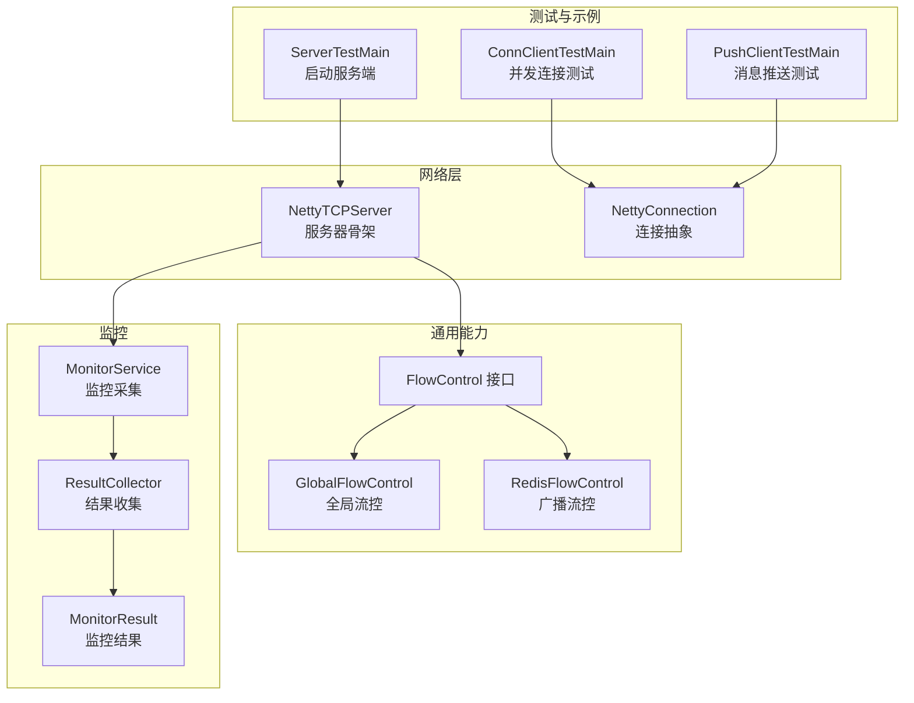
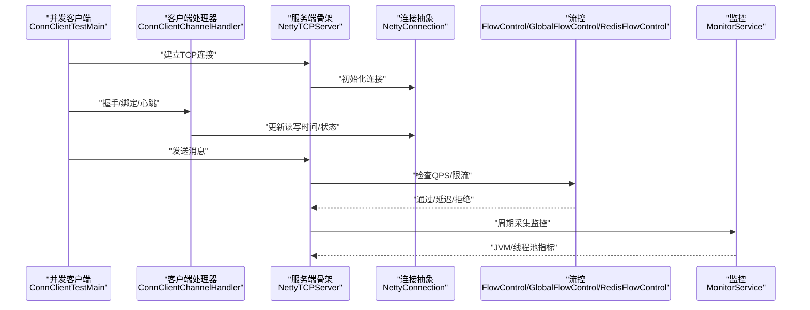
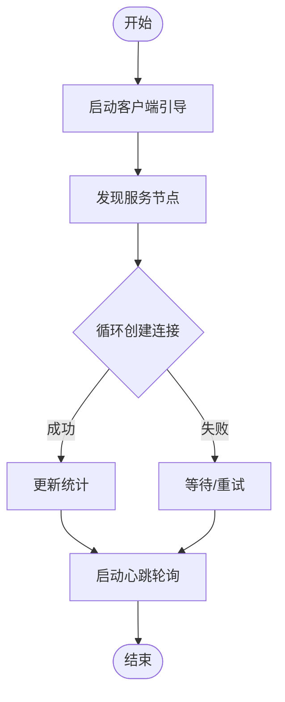
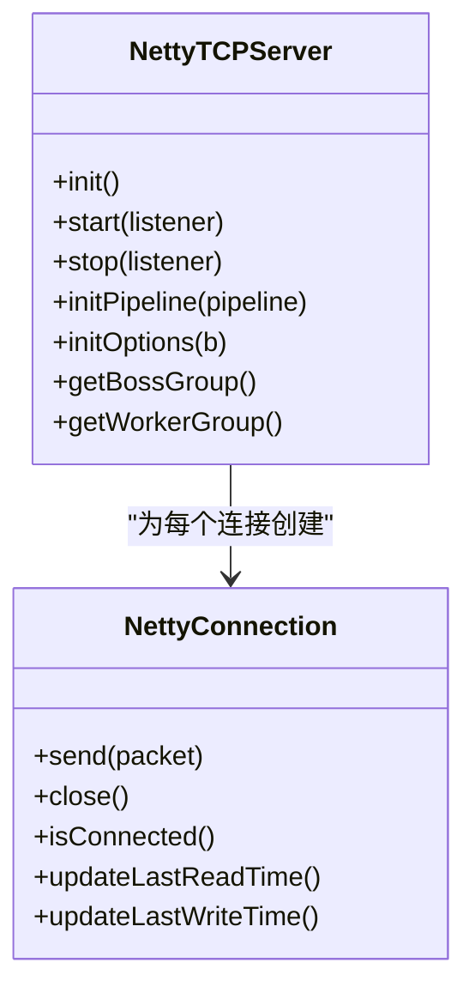
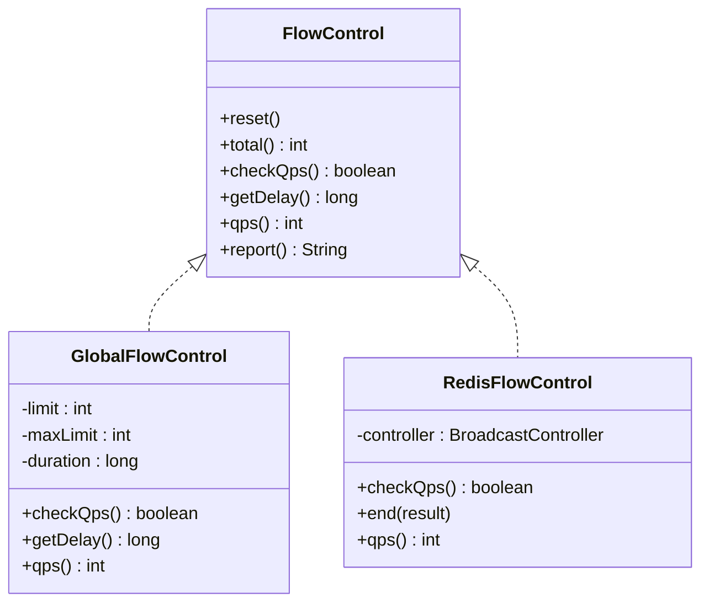
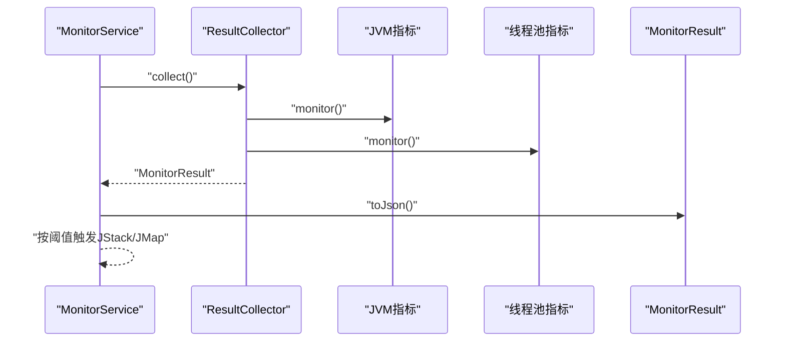
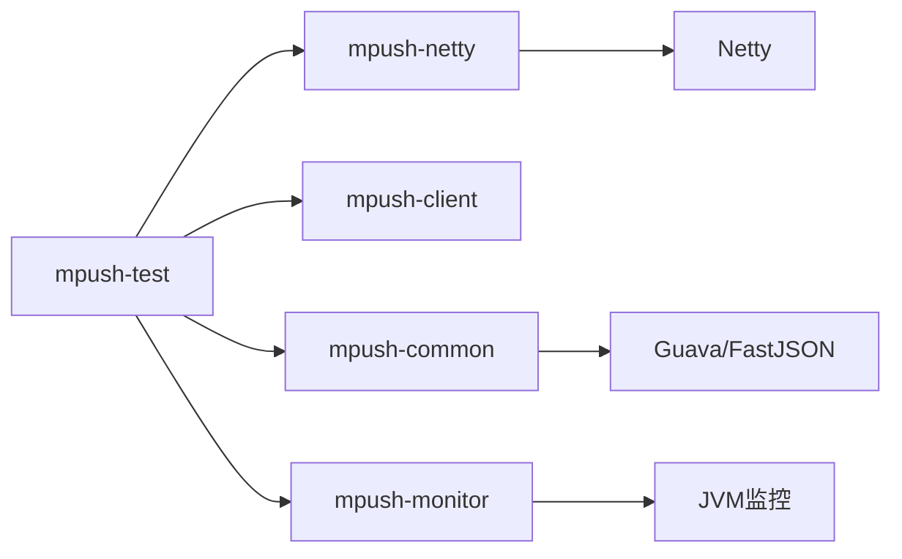

# 性能测试

<cite>
**本文引用的文件**   
- [README.md](file://README.md)
- [pom.xml](file://pom.xml)
- [mpush-test/src/main/java/com/mpush/test/sever/ServerTestMain.java](file://mpush-test/src/main/java/com/mpush/test/sever/ServerTestMain.java)
- [mpush-test/src/main/java/com/mpush/test/client/ConnClientTestMain.java](file://mpush-test/src/main/java/com/mpush/test/client/ConnClientTestMain.java)
- [mpush-test/src/main/java/com/mpush/test/push/PushClientTestMain.java](file://mpush-test/src/main/java/com/mpush/test/push/PushClientTestMain.java)
- [mpush-client/src/main/java/com/mpush/client/connect/ConnClientChannelHandler.java](file://mpush-client/src/main/java/com/mpush/client/connect/ConnClientChannelHandler.java)
- [mpush-netty/src/main/java/com/mpush/netty/connection/NettyConnection.java](file://mpush-netty/src/main/java/com/mpush/netty/connection/NettyConnection.java)
- [mpush-netty/src/main/java/com/mpush/netty/server/NettyTCPServer.java](file://mpush-netty/src/main/java/com/mpush/netty/server/NettyTCPServer.java)
- [mpush-common/src/main/java/com/mpush/common/qps/FlowControl.java](file://mpush-common/src/main/java/com/mpush/common/qps/FlowControl.java)
- [mpush-common/src/main/java/com/mpush/common/qps/GlobalFlowControl.java](file://mpush-common/src/main/java/com/mpush/common/qps/GlobalFlowControl.java)
- [mpush-common/src/main/java/com/mpush/common/qps/RedisFlowControl.java](file://mpush-common/src/main/java/com/mpush/common/qps/RedisFlowControl.java)
- [mpush-monitor/src/main/java/com/mpush/monitor/service/MonitorService.java](file://mpush-monitor/src/main/java/com/mpush/monitor/service/MonitorService.java)
- [mpush-monitor/src/main/java/com/mpush/monitor/data/ResultCollector.java](file://mpush-monitor/src/main/java/com/mpush/monitor/data/ResultCollector.java)
- [mpush-monitor/src/main/java/com/mpush/monitor/data/MonitorResult.java](file://mpush-monitor/src/main/java/com/mpush/monitor/data/MonitorResult.java)
- [mpush-tools/src/main/java/com/mpush/tools/config/CC.java](file://mpush-tools/src/main/java/com/mpush/tools/config/CC.java)
</cite>

## 目录
1. [简介](#简介)
2. [项目结构](#项目结构)
3. [核心组件](#核心组件)
4. [架构总览](#架构总览)
5. [详细组件分析](#详细组件分析)
6. [依赖分析](#依赖分析)
7. [性能考虑](#性能考虑)
8. [故障排查指南](#故障排查指南)
9. [结论](#结论)
10. [附录](#附录)

## 简介
本指南面向MPush的性能测试与评估，目标是帮助读者建立完整的性能测试体系，涵盖性能指标定义、基准设定、瓶颈识别、压力与负载测试、并发测试、网络性能测试、工具使用与报告解读，并给出基于代码实现的优化建议。MPush基于Netty构建，采用模块化设计，核心能力包括长连接接入、网关转发、消息推送、流控与监控等。测试应围绕“吞吐量、延迟、资源占用、稳定性”四个维度展开。

## 项目结构
MPush采用多模块聚合结构，便于按功能拆分与独立演进。与性能测试密切相关的模块包括：
- mpush-test：内置测试入口，便于快速启动服务端与客户端进行性能验证
- mpush-netty：网络层实现（TCP/UDP），包含连接、编解码、服务器骨架
- mpush-common：通用能力，含流控接口与实现（全局/Redis）
- mpush-monitor：监控采集与JVM诊断输出
- mpush-client：客户端示例，包含统计与握手流程
- mpush-tools：配置中心与公共工具（含配置读取）

图表来源
- [ServerTestMain.java](file://mpush-test/src/main/java/com/mpush/test/sever/ServerTestMain.java#L44-L48)
- [NettyTCPServer.java](file://mpush-netty/src/main/java/com/mpush/netty/server/NettyTCPServer.java#L104-L113)
- [NettyConnection.java](file://mpush-netty/src/main/java/com/mpush/netty/connection/NettyConnection.java#L38-L55)
- [FlowControl.java](file://mpush-common/src/main/java/com/mpush/common/qps/FlowControl.java#L27-L60)
- [GlobalFlowControl.java](file://mpush-common/src/main/java/com/mpush/common/qps/GlobalFlowControl.java#L30-L47)
- [RedisFlowControl.java](file://mpush-common/src/main/java/com/mpush/common/qps/RedisFlowControl.java#L32-L51)
- [MonitorService.java](file://mpush-monitor/src/main/java/com/mpush/monitor/service/MonitorService.java#L36-L60)
- [ResultCollector.java](file://mpush-monitor/src/main/java/com/mpush/monitor/data/ResultCollector.java#L30-L43)
- [MonitorResult.java](file://mpush-monitor/src/main/java/com/mpush/monitor/data/MonitorResult.java#L27-L34)

章节来源
- [pom.xml](file://pom.xml#L54-L66)
- [README.md](file://README.md#L22-L31)

## 核心组件
- 测试入口与示例
  - 服务端启动：ServerTestMain 提供启动入口，便于快速拉起服务端进行性能验证
  - 并发连接测试：ConnClientTestMain 支持批量并发连接，结合客户端处理器统计指标
  - 推送测试：PushClientTestMain 演示单播/广播消息发送流程
- 网络层
  - NettyTCPServer：统一的服务器骨架，负责线程池、通道工厂、管道初始化、选项配置
  - NettyConnection：连接抽象，封装读写、心跳、状态与错误处理
- 流控
  - FlowControl接口：统一的流控契约（检查QPS、计算延迟、统计QPS、报告）
  - GlobalFlowControl：基于原子计数的全局限流
  - RedisFlowControl：基于Redis的广播任务限流与动态调整
- 监控
  - MonitorService：周期采集JVM与线程池指标，支持JStack/JMap导出
  - ResultCollector/MonitorResult：采集与序列化监控结果

章节来源
- [ServerTestMain.java](file://mpush-test/src/main/java/com/mpush/test/sever/ServerTestMain.java#L44-L48)
- [ConnClientTestMain.java](file://mpush-test/src/main/java/com/mpush/test/client/ConnClientTestMain.java#L71-L116)
- [PushClientTestMain.java](file://mpush-test/src/main/java/com/mpush/test/push/PushClientTestMain.java#L39-L75)
- [NettyTCPServer.java](file://mpush-netty/src/main/java/com/mpush/netty/server/NettyTCPServer.java#L104-L113)
- [NettyConnection.java](file://mpush-netty/src/main/java/com/mpush/netty/connection/NettyConnection.java#L73-L105)
- [FlowControl.java](file://mpush-common/src/main/java/com/mpush/common/qps/FlowControl.java#L27-L60)
- [GlobalFlowControl.java](file://mpush-common/src/main/java/com/mpush/common/qps/GlobalFlowControl.java#L30-L47)
- [RedisFlowControl.java](file://mpush-common/src/main/java/com/mpush/common/qps/RedisFlowControl.java#L32-L51)
- [MonitorService.java](file://mpush-monitor/src/main/java/com/mpush/monitor/service/MonitorService.java#L64-L82)
- [ResultCollector.java](file://mpush-monitor/src/main/java/com/mpush/monitor/data/ResultCollector.java#L45-L53)
- [MonitorResult.java](file://mpush-monitor/src/main/java/com/mpush/monitor/data/MonitorResult.java#L31-L34)

## 架构总览
MPush的性能测试应覆盖端到端链路：客户端并发连接 → 服务端接入与处理 → 消息路由与推送 → 监控与诊断。下图展示典型测试路径与关键组件交互：

图表来源
- [ConnClientTestMain.java](file://mpush-test/src/main/java/com/mpush/test/client/ConnClientTestMain.java#L113-L115)
- [ConnClientChannelHandler.java](file://mpush-client/src/main/java/com/mpush/client/connect/ConnClientChannelHandler.java#L80-L155)
- [NettyTCPServer.java](file://mpush-netty/src/main/java/com/mpush/netty/server/NettyTCPServer.java#L157-L162)
- [NettyConnection.java](file://mpush-netty/src/main/java/com/mpush/netty/connection/NettyConnection.java#L130-L142)
- [FlowControl.java](file://mpush-common/src/main/java/com/mpush/common/qps/FlowControl.java#L39-L49)
- [MonitorService.java](file://mpush-monitor/src/main/java/com/mpush/monitor/service/MonitorService.java#L66-L71)

## 详细组件分析

### 并发连接与统计
- 并发连接入口：ConnClientTestMain 支持批量创建连接，打印统计信息，便于观察连接成功率、推送接收数等
- 客户端处理器：ConnClientChannelHandler 在握手、绑定、心跳、推送等阶段记录统计，便于定位瓶颈
- 心跳与健康检查：处理器内含心跳轮询与超时判定逻辑，可用于评估网络质量与服务端处理能力

图表来源
- [ConnClientTestMain.java](file://mpush-test/src/main/java/com/mpush/test/client/ConnClientTestMain.java#L71-L116)
- [ConnClientChannelHandler.java](file://mpush-client/src/main/java/com/mpush/client/connect/ConnClientChannelHandler.java#L164-L184)
- [ConnClientChannelHandler.java](file://mpush-client/src/main/java/com/mpush/client/connect/ConnClientChannelHandler.java#L269-L278)

章节来源
- [ConnClientTestMain.java](file://mpush-test/src/main/java/com/mpush/test/client/ConnClientTestMain.java#L71-L116)
- [ConnClientChannelHandler.java](file://mpush-client/src/main/java/com/mpush/client/connect/ConnClientChannelHandler.java#L80-L155)
- [ConnClientChannelHandler.java](file://mpush-client/src/main/java/com/mpush/client/connect/ConnClientChannelHandler.java#L280-L302)

### 服务器骨架与网络性能
- 服务器骨架：NettyTCPServer 提供统一的启动流程、线程池配置、管道初始化与选项设置，支持Epoll/NIO两种事件循环
- 线程模型：boss/worker线程分离，IO比率可调；默认使用池化ByteBuf分配器，降低GC压力
- 管道初始化：解码器、编码器、业务处理器按序加入，便于扩展与替换

图表来源
- [NettyTCPServer.java](file://mpush-netty/src/main/java/com/mpush/netty/server/NettyTCPServer.java#L104-L113)
- [NettyTCPServer.java](file://mpush-netty/src/main/java/com/mpush/netty/server/NettyTCPServer.java#L259-L263)
- [NettyConnection.java](file://mpush-netty/src/main/java/com/mpush/netty/connection/NettyConnection.java#L73-L105)

章节来源
- [NettyTCPServer.java](file://mpush-netty/src/main/java/com/mpush/netty/server/NettyTCPServer.java#L104-L113)
- [NettyTCPServer.java](file://mpush-netty/src/main/java/com/mpush/netty/server/NettyTCPServer.java#L230-L241)
- [NettyConnection.java](file://mpush-netty/src/main/java/com/mpush/netty/connection/NettyConnection.java#L73-L105)

### 流控与QPS
- FlowControl接口：定义检查QPS、统计总量/瞬时、计算延迟、报告等能力
- GlobalFlowControl：基于原子计数的滑动窗口限流，适合全局/单机场景
- RedisFlowControl：基于Redis的广播任务限流，支持动态调整与累计发送统计

图表来源
- [FlowControl.java](file://mpush-common/src/main/java/com/mpush/common/qps/FlowControl.java#L27-L60)
- [GlobalFlowControl.java](file://mpush-common/src/main/java/com/mpush/common/qps/GlobalFlowControl.java#L30-L47)
- [RedisFlowControl.java](file://mpush-common/src/main/java/com/mpush/common/qps/RedisFlowControl.java#L32-L51)

章节来源
- [FlowControl.java](file://mpush-common/src/main/java/com/mpush/common/qps/FlowControl.java#L27-L60)
- [GlobalFlowControl.java](file://mpush-common/src/main/java/com/mpush/common/qps/GlobalFlowControl.java#L61-L75)
- [RedisFlowControl.java](file://mpush-common/src/main/java/com/mpush/common/qps/RedisFlowControl.java#L65-L87)

### 监控与诊断
- MonitorService：周期采集JVM信息、GC、内存、线程、线程池等指标，支持打印日志与JStack/JMap导出
- ResultCollector/MonitorResult：将采集结果组织为结构化对象，便于持久化或上报

图表来源
- [MonitorService.java](file://mpush-monitor/src/main/java/com/mpush/monitor/service/MonitorService.java#L64-L82)
- [ResultCollector.java](file://mpush-monitor/src/main/java/com/mpush/monitor/data/ResultCollector.java#L45-L53)
- [MonitorResult.java](file://mpush-monitor/src/main/java/com/mpush/monitor/data/MonitorResult.java#L62-L64)

章节来源
- [MonitorService.java](file://mpush-monitor/src/main/java/com/mpush/monitor/service/MonitorService.java#L64-L82)
- [MonitorService.java](file://mpush-monitor/src/main/java/com/mpush/monitor/service/MonitorService.java#L101-L130)
- [ResultCollector.java](file://mpush-monitor/src/main/java/com/mpush/monitor/data/ResultCollector.java#L45-L53)
- [MonitorResult.java](file://mpush-monitor/src/main/java/com/mpush/monitor/data/MonitorResult.java#L31-L34)

## 依赖分析
- 模块依赖：pom.xml声明了各模块聚合关系，测试模块依赖核心网络与工具模块
- 外部依赖：Netty、SLF4J、Curator/ZK、Jedis/Redis、FastJSON、Guava等
- 性能相关：Netty池化缓冲区、线程模型、事件循环选择（Epoll/NIO）、JVM监控与线程池配置

图表来源
- [pom.xml](file://pom.xml#L54-L66)
- [pom.xml](file://pom.xml#L79-L284)

章节来源
- [pom.xml](file://pom.xml#L54-L66)
- [pom.xml](file://pom.xml#L79-L284)

## 性能考虑
- 线程与事件循环
  - 优先使用Epoll（Linux）以提升高并发下的IO效率；NIO作为跨平台回退
  - 调整boss/worker线程数与IO比率，平衡CPU与背压
- 缓冲区与内存
  - 启用池化ByteBuf分配器，减少GC压力；合理设置发送/接收缓冲区
- 心跳与超时
  - 结合客户端处理器的心跳逻辑，评估网络质量与服务端处理能力
- 流控策略
  - 全局流控适用于单机/单实例限速；广播流控结合Redis实现跨实例协调
- 监控与诊断
  - 开启监控日志与周期性JStack/JMap导出，定位CPU/内存/线程池瓶颈

章节来源
- [NettyTCPServer.java](file://mpush-netty/src/main/java/com/mpush/netty/server/NettyTCPServer.java#L108-L123)
- [NettyTCPServer.java](file://mpush-netty/src/main/java/com/mpush/netty/server/NettyTCPServer.java#L230-L241)
- [NettyConnection.java](file://mpush-netty/src/main/java/com/mpush/netty/connection/NettyConnection.java#L120-L127)
- [GlobalFlowControl.java](file://mpush-common/src/main/java/com/mpush/common/qps/GlobalFlowControl.java#L61-L75)
- [RedisFlowControl.java](file://mpush-common/src/main/java/com/mpush/common/qps/RedisFlowControl.java#L65-L87)
- [MonitorService.java](file://mpush-monitor/src/main/java/com/mpush/monitor/service/MonitorService.java#L101-L130)

## 故障排查指南
- 启动与环境
  - 使用ServerTestMain启动服务端，确保JVM参数（泄漏检测、Netty优化开关）已正确设置
- 连接问题
  - 关注客户端处理器的异常捕获与连接关闭逻辑，检查握手/绑定阶段日志
- QPS与限流
  - 通过流控接口的报告与延迟计算，定位是否因限流导致吞吐下降
- 监控与诊断
  - 开启监控日志与周期性JStack/JMap导出，结合JVM指标定位瓶颈

章节来源
- [ServerTestMain.java](file://mpush-test/src/main/java/com/mpush/test/sever/ServerTestMain.java#L44-L48)
- [ConnClientChannelHandler.java](file://mpush-client/src/main/java/com/mpush/client/connect/ConnClientChannelHandler.java#L158-L161)
- [FlowControl.java](file://mpush-common/src/main/java/com/mpush/common/qps/FlowControl.java#L58-L59)
- [MonitorService.java](file://mpush-monitor/src/main/java/com/mpush/monitor/service/MonitorService.java#L69-L71)
- [MonitorService.java](file://mpush-monitor/src/main/java/com/mpush/monitor/service/MonitorService.java#L101-L130)

## 结论
MPush提供了完善的网络层、流控与监控基础设施，能够支撑高性能的消息推送系统。通过结合内置测试入口与流控/监控组件，可以系统地开展压力、负载与并发测试，识别并优化性能瓶颈。建议在真实环境中逐步扩大并发规模，结合监控数据与JVM诊断，持续迭代优化线程模型、缓冲区与限流策略。

## 附录

### 性能测试基本概念与实施要点
- 性能指标定义
  - 吞吐量：消息/连接/字节/请求的单位时间处理量
  - 延迟：端到端往返时间、首包延迟、P50/P95/P99
  - 资源占用：CPU、内存、线程数、GC频率与停顿
  - 稳定性：错误率、超时率、连接断开率、服务可用性
- 基准设定
  - 明确基线环境（硬件、JVM、网络、依赖版本）
  - 设定关键阈值（QPS、P95延迟、CPU/内存上限）
- 瓶颈识别
  - 从连接、编解码、业务处理、流控、网络、存储等环节逐层排查
  - 结合监控与诊断工具定位热点线程与慢操作

### 压力测试实施方案
- 并发用户数测试
  - 使用ConnClientTestMain批量创建连接，逐步提升并发数，观察连接成功率、握手耗时、绑定耗时
- 消息吞吐量测试
  - 使用PushClientTestMain发送消息，统计QPS、P95延迟、丢包率
- 内存与CPU占用
  - 开启MonitorService周期采集，关注GC、堆内存、线程数与线程池排队情况
- 稳定性验证
  - 长时间运行（如30分钟以上），观察错误累积、连接抖动、资源泄露迹象

### 负载测试实施方案
- 渐进式负载
  - 以固定速率或阶梯式增加并发/消息速率，观察系统响应曲线
- 稳定性测试
  - 在峰值负载下维持一段时间，评估系统恢复能力与资源回收
- 资源消耗分析
  - 对比不同线程模型（NIO/Epoll）、缓冲区大小、限流策略的资源占用差异

### 并发测试技术实现
- 多线程测试
  - 使用ConnClientTestMain的并发参数与自定义线程池，模拟多用户同时在线
- 异步处理测试
  - 通过Netty的事件循环与线程模型，评估异步编解码与消息派发的性能
- 锁竞争测试
  - 关注流控与监控组件中的原子操作与共享状态访问，避免热点锁

### 网络性能测试
- 带宽与延迟
  - 使用系统工具或第三方工具在目标机器上进行带宽与延迟测试，评估网络上限
- 丢包率
  - 在高负载下观察连接断开与重连次数，结合客户端处理器的日志定位
- 连接池性能
  - 针对HTTP代理或外部服务调用，评估连接池大小与超时配置对整体性能的影响

### 性能测试工具使用指南
- JMeter/Gatling/LoadRunner
  - 可用于模拟客户端行为与消息发送，但需结合MPush的协议与握手流程定制脚本
  - 建议优先使用内置测试入口进行端到端验证，再引入专业工具进行大规模并发

### 报告分析与优化建议
- 报告要素
  - 场景描述、环境信息、指标趋势、异常与告警、根因分析
- 优化建议
  - 调整线程模型与IO比率、优化缓冲区与编解码、完善流控策略、增强监控与告警