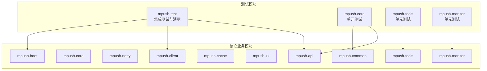
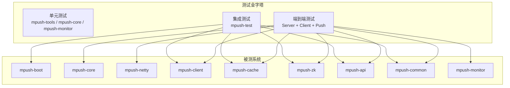
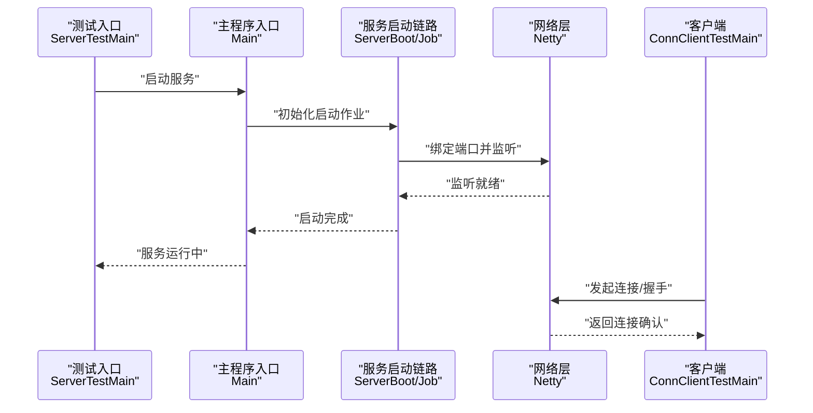
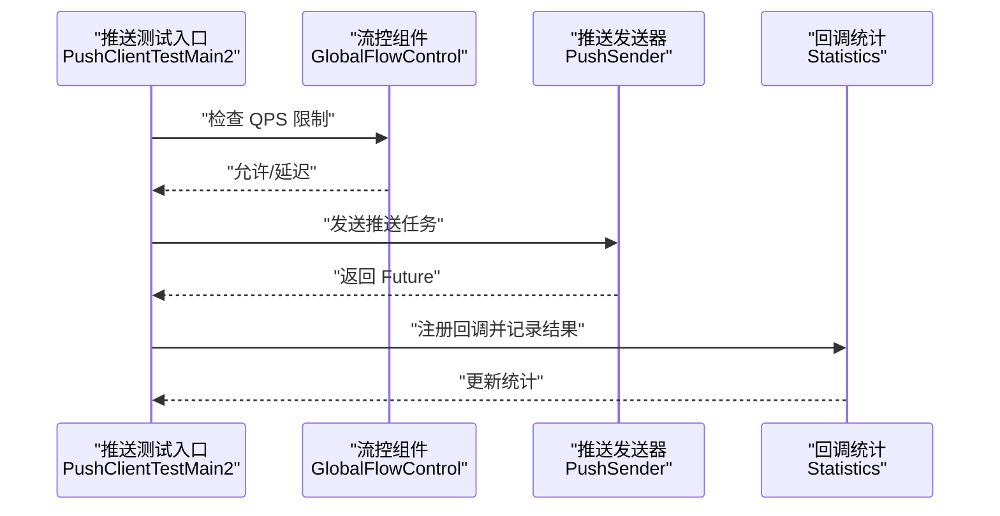
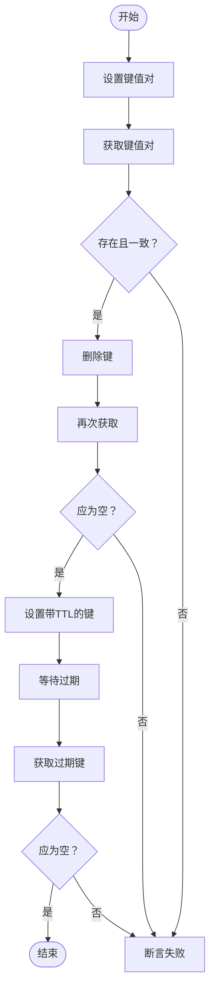
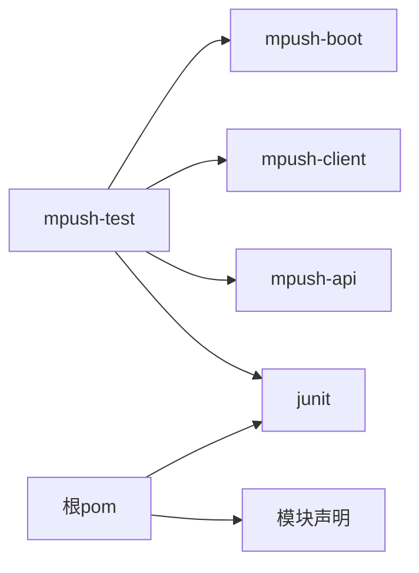

# 测试策略

<cite>
**本文引用的文件**
- [README.md](file://README.md)
- [pom.xml](file://pom.xml)
- [mpush-test/pom.xml](file://mpush-test/pom.xml)
- [application.conf](file://mpush-test/src/main/resources/application.conf)
- [CipherBoxTest.java](file://mpush-core/src/test/java/com/mpush/core/security/CipherBoxTest.java)
- [AESUtilsTest.java](file://mpush-tools/src/test/java/com/mpush/tools/crypto/AESUtilsTest.java)
- [RsaTest.java](file://mpush-test/src/main/java/com/mpush/test/crypto/RsaTest.java)
- [RedisUtilTest.java](file://mpush-test/src/main/java/com/mpush/test/redis/RedisUtilTest.java)
- [ServerTestMain.java](file://mpush-test/src/main/java/com/mpush/test/sever/ServerTestMain.java)
- [ConnClientTestMain.java](file://mpush-test/src/main/java/com/mpush/test/client/ConnClientTestMain.java)
- [PushClientTestMain.java](file://mpush-test/src/main/java/com/mpush/test/push/PushClientTestMain.java)
- [PushClientTestMain2.java](file://mpush-test/src/main/java/com/mpush/test/push/PushClientTestMain2.java)
- [AppTest.java](file://mpush-monitor/src/test/java/com/mpush/AppTest.java)
</cite>

## 目录
1. [简介](#简介)
2. [项目结构](#项目结构)
3. [核心组件](#核心组件)
4. [架构总览](#架构总览)
5. [详细组件分析](#详细组件分析)
6. [依赖分析](#依赖分析)
7. [性能考虑](#性能考虑)
8. [故障排查指南](#故障排查指南)
9. [结论](#结论)
10. [附录](#附录)

## 简介
本测试策略文档面向 MPush 消息推送系统，围绕单元测试、集成测试、性能测试、回归测试与自动化、测试环境搭建与管理、测试工具与框架使用、测试覆盖率与报告、缺陷跟踪等方面，提供系统化、可操作的实践指南。文档基于仓库现有测试代码与配置，结合模块职责划分，给出从单模块验证到端到端集成的测试路径，并补充持续集成与质量保障建议。

## 项目结构
MPush 采用 Maven 多模块结构，核心模块包括 API、核心服务、网络层、客户端、缓存、ZooKeeper、监控、工具集等；测试集中在 mpush-test 模块，同时各功能模块也包含少量单元测试。整体结构如下：

图表来源
- [pom.xml](file://pom.xml#L54-L66)
- [mpush-test/pom.xml](file://mpush-test/pom.xml#L19-L33)

章节来源
- [pom.xml](file://pom.xml#L54-L66)
- [README.md](file://README.md#L22-L31)

## 核心组件
- 单元测试（工具与通用模块）
  - 加解密工具：AESUtilsTest、RSAUtilsTest 展示了对称/非对称加解密的基本正确性验证与简单性能观测思路。
  - 安全组件：CipherBoxTest 提供密钥混合与随机密钥生成的验证示例。
- 集成测试（mpush-test）
  - 服务端启动：ServerTestMain 通过 Main 启动完整服务，便于端到端联调。
  - 客户端连接：ConnClientTestMain 模拟多客户端连接、握手、统计输出。
  - 推送测试：PushClientTestMain 与 PushClientTestMain2 分别演示单次推送与高并发推送、流控统计。
  - 缓存与消息：RedisUtilTest 展示 Redis KV/Hash/Set/List/有序集合等常用操作与过期行为验证。
  - 加密握手：RsaTest 展示握手消息的加解密流程与并发性能观测。
- 配置与环境
  - application.conf 提供 ZooKeeper、Redis、网络端口、日志级别等测试所需的关键配置项。

章节来源
- [AESUtilsTest.java](file://mpush-tools/src/test/java/com/mpush/tools/crypto/AESUtilsTest.java#L30-L47)
- [CipherBoxTest.java](file://mpush-core/src/test/java/com/mpush/core/security/CipherBoxTest.java#L30-L48)
- [ServerTestMain.java](file://mpush-test/src/main/java/com/mpush/test/sever/ServerTestMain.java#L32-L48)
- [ConnClientTestMain.java](file://mpush-test/src/main/java/com/mpush/test/client/ConnClientTestMain.java#L38-L117)
- [PushClientTestMain.java](file://mpush-test/src/main/java/com/mpush/test/push/PushClientTestMain.java#L37-L76)
- [PushClientTestMain2.java](file://mpush-test/src/main/java/com/mpush/test/push/PushClientTestMain2.java#L38-L138)
- [RedisUtilTest.java](file://mpush-test/src/main/java/com/mpush/test/redis/RedisUtilTest.java#L35-L217)
- [RsaTest.java](file://mpush-test/src/main/java/com/mpush/test/crypto/RsaTest.java#L34-L174)
- [application.conf](file://mpush-test/src/main/resources/application.conf#L1-L22)

## 架构总览
下图展示测试策略在系统中的位置与交互关系，强调从单元测试到集成测试再到端到端验证的层次化推进。

图表来源
- [pom.xml](file://pom.xml#L54-L66)
- [mpush-test/pom.xml](file://mpush-test/pom.xml#L19-L33)

## 详细组件分析

### 单元测试：加解密与工具类
- 测试目标
  - 验证对称/非对称加解密算法正确性与基本性能特征。
  - 验证安全组件密钥生成与混合逻辑。
- 设计原则
  - 使用确定性输入与已知输出进行断言，确保算法一致性。
  - 对耗时敏感的路径进行轻量级性能观测（如 RSA 加解密耗时）。
- 断言方法
  - 字符串/字节数组比较、异常捕获与状态检查。
- 示例参考
  - AES 加解密正确性验证：[AESUtilsTest.java](file://mpush-tools/src/test/java/com/mpush/tools/crypto/AESUtilsTest.java#L32-L42)
  - RSA 握手加解密与并发观测：[RsaTest.java](file://mpush-test/src/main/java/com/mpush/test/crypto/RsaTest.java#L51-L114)
  - 密钥混合与随机密钥生成：[CipherBoxTest.java](file://mpush-core/src/test/java/com/mpush/core/security/CipherBoxTest.java#L32-L48)

章节来源
- [AESUtilsTest.java](file://mpush-tools/src/test/java/com/mpush/tools/crypto/AESUtilsTest.java#L30-L47)
- [CipherBoxTest.java](file://mpush-core/src/test/java/com/mpush/core/security/CipherBoxTest.java#L30-L48)
- [RsaTest.java](file://mpush-test/src/main/java/com/mpush/test/crypto/RsaTest.java#L34-L174)

### 集成测试：服务端启动与网络交互
- 测试目标
  - 验证服务端启动流程、网络监听、事件处理与资源释放。
  - 验证客户端连接建立、握手、心跳与统计输出。
- 设计原则
  - 使用测试桩或最小化配置启动服务，避免外部依赖干扰。
  - 通过锁/等待机制模拟长时间运行，便于人工观察日志与指标。
- 关键流程序列

图表来源
- [ServerTestMain.java](file://mpush-test/src/main/java/com/mpush/test/sever/ServerTestMain.java#L38-L48)
- [ConnClientTestMain.java](file://mpush-test/src/main/java/com/mpush/test/client/ConnClientTestMain.java#L71-L116)

章节来源
- [ServerTestMain.java](file://mpush-test/src/main/java/com/mpush/test/sever/ServerTestMain.java#L32-L48)
- [ConnClientTestMain.java](file://mpush-test/src/main/java/com/mpush/test/client/ConnClientTestMain.java#L38-L117)

### 集成测试：推送与流控
- 测试目标
  - 验证单用户/广播推送、ACK 回调、流控与统计。
  - 验证高并发场景下的吞吐、延迟与失败率。
- 设计原则
  - 使用固定参数构建 PushMsg/PushContext，确保可重复性。
  - 通过回调收集 PushResult 并统计成功率/离线率/超时率。
- 关键流程序列

图表来源
- [PushClientTestMain2.java](file://mpush-test/src/main/java/com/mpush/test/push/PushClientTestMain2.java#L44-L116)

章节来源
- [PushClientTestMain.java](file://mpush-test/src/main/java/com/mpush/test/push/PushClientTestMain.java#L37-L76)
- [PushClientTestMain2.java](file://mpush-test/src/main/java/com/mpush/test/push/PushClientTestMain2.java#L38-L138)

### 集成测试：缓存与消息
- 测试目标
  - 验证 Redis 连接池、KV/Hash/Set/List/有序集合等操作与过期行为。
- 设计原则
  - 使用真实节点地址与密码，确保连接可用性。
  - 对过期键进行时序验证，确保 TTL 生效。
- 关键流程流程图

图表来源
- [RedisUtilTest.java](file://mpush-test/src/main/java/com/mpush/test/redis/RedisUtilTest.java#L42-L151)

章节来源
- [RedisUtilTest.java](file://mpush-test/src/main/java/com/mpush/test/redis/RedisUtilTest.java#L35-L217)

### 单元测试：监控与基础断言
- 测试目标
  - 验证最小化测试用例，确保测试框架与构建链路可用。
- 示例参考
  - 基础断言测试：[AppTest.java](file://mpush-monitor/src/test/java/com/mpush/AppTest.java#L31-L33)

章节来源
- [AppTest.java](file://mpush-monitor/src/test/java/com/mpush/AppTest.java#L10-L34)

## 依赖分析
- 模块间依赖
  - mpush-test 依赖 mpush-boot、mpush-client、junit，用于启动服务与驱动客户端测试。
  - 各模块通过 API 与 SPI 进行解耦，测试时可通过 SPI 实现替换实现（例如缓存、MQ、DNS 映射等）。
- 测试依赖
  - JUnit 版本与作用域在根 pom 中统一管理，确保各模块测试一致性。
- 配置依赖
  - application.conf 提供 ZooKeeper、Redis、网络端口等测试必需配置，需按环境调整。

图表来源
- [mpush-test/pom.xml](file://mpush-test/pom.xml#L19-L33)
- [pom.xml](file://pom.xml#L224-L292)

章节来源
- [mpush-test/pom.xml](file://mpush-test/pom.xml#L19-L33)
- [pom.xml](file://pom.xml#L224-L292)

## 性能考虑
- 单元测试性能
  - 对加解密等 CPU 密集型操作，采用小数据量与固定种子，避免随机性导致的不稳定。
- 集成测试性能
  - 使用固定 QPS 与限流器（如 GlobalFlowControl）控制并发，防止内存与资源耗尽。
  - 通过回调统计成功/失败/离线/超时，形成性能基线。
- 观测手段
  - 在测试中输出关键指标（如加解密耗时、推送速率、队列长度），作为回归对比依据。
- 资源管理
  - 控制并发连接数与线程池大小，避免 Redis/JVM 资源瓶颈。

章节来源
- [PushClientTestMain2.java](file://mpush-test/src/main/java/com/mpush/test/push/PushClientTestMain2.java#L53-L86)
- [RsaTest.java](file://mpush-test/src/main/java/com/mpush/test/crypto/RsaTest.java#L77-L114)

## 故障排查指南
- 服务端无法启动
  - 检查 application.conf 的端口占用与网络绑定，确认 ZooKeeper/Redis 地址可达。
  - 使用 ServerTestMain 的测试入口启动，观察日志输出。
- 客户端连接失败
  - 核对服务端注册的公网/内网 IP 与客户端 DNS 映射。
  - 通过 ConnClientTestMain 输出的统计信息定位连接/握手阶段问题。
- 推送无响应
  - 检查 PushClientTestMain 的回调统计，区分超时与离线。
  - 使用 PushClientTestMain2 的流控与统计，逐步提升并发定位瓶颈。
- 缓存访问异常
  - 使用 RedisUtilTest 的 KV/Hash/过期用例验证连接池与 TTL 行为。

章节来源
- [application.conf](file://mpush-test/src/main/resources/application.conf#L1-L22)
- [ServerTestMain.java](file://mpush-test/src/main/java/com/mpush/test/sever/ServerTestMain.java#L38-L48)
- [ConnClientTestMain.java](file://mpush-test/src/main/java/com/mpush/test/client/ConnClientTestMain.java#L71-L116)
- [PushClientTestMain.java](file://mpush-test/src/main/java/com/mpush/test/push/PushClientTestMain.java#L44-L75)
- [PushClientTestMain2.java](file://mpush-test/src/main/java/com/mpush/test/push/PushClientTestMain2.java#L44-L116)
- [RedisUtilTest.java](file://mpush-test/src/main/java/com/mpush/test/redis/RedisUtilTest.java#L42-L151)

## 结论
本测试策略以“单元测试—集成测试—端到端测试”三层体系为核心，结合 MPush 的模块化架构与现有测试代码，提供了可落地的测试实践路径。通过明确测试目标、设计原则、断言方法与性能观测手段，能够有效支撑系统的质量保障与持续演进。

## 附录

### 测试环境搭建与管理
- 环境准备
  - 安装 JDK 1.8+、ZooKeeper、Redis，确保网络连通。
- 配置管理
  - application.conf 中维护 ZooKeeper/Redis 地址、端口、日志级别等关键参数。
- 数据准备
  - 使用 RedisUtilTest 的 KV/Hash 用例准备测试数据，或通过业务接口预热缓存。
- 资源隔离
  - 不同环境使用不同端口与命名空间，避免冲突。

章节来源
- [application.conf](file://mpush-test/src/main/resources/application.conf#L1-L22)
- [README.md](file://README.md#L34-L87)

### 测试工具与框架使用
- 测试框架
  - JUnit：用于单元测试与简单断言。
- 工具类
  - Guava、Apache Commons Lang3、Fastjson 等在测试中广泛使用。
- 框架插件
  - Maven Surefire 插件用于执行测试，当前配置默认跳过测试，可在 CI 中启用。

章节来源
- [pom.xml](file://pom.xml#L224-L292)
- [mpush-test/pom.xml](file://mpush-test/pom.xml#L19-L33)

### 测试覆盖率与报告
- 覆盖率采集
  - 建议在 CI 中启用覆盖率工具（如 JaCoCo），对核心模块（core、netty、client、cache、zk）进行覆盖率统计。
- 报告生成
  - 将覆盖率报告与测试报告一并归档，作为质量门禁依据。
- 缺陷跟踪
  - 基于测试失败与日志输出，建立缺陷跟踪清单，按严重程度与影响面排序。

章节来源
- [pom.xml](file://pom.xml#L314-L321)

### 回归测试与持续集成
- 自动化执行
  - 在 CI 中启用 Maven Surefire，按模块顺序执行测试，优先运行单元测试，再执行 mpush-test 集成测试。
- 结果分析
  - 对测试失败、超时、覆盖率不足的模块进行阻断，确保主干稳定。
- 质量门禁
  - 设置最低覆盖率阈值与失败数阈值，作为合并前提条件。

章节来源
- [README.md](file://README.md#L22-L31)
- [pom.xml](file://pom.xml#L314-L321)