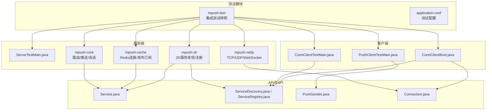
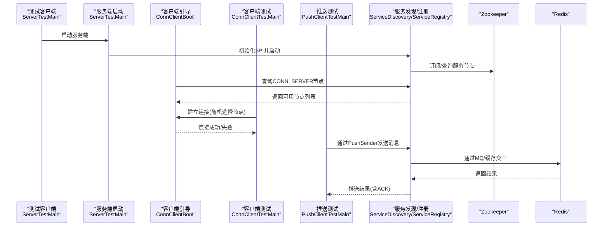
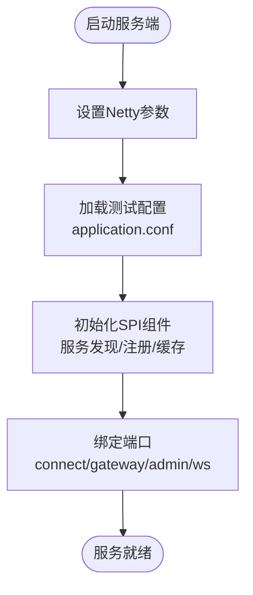
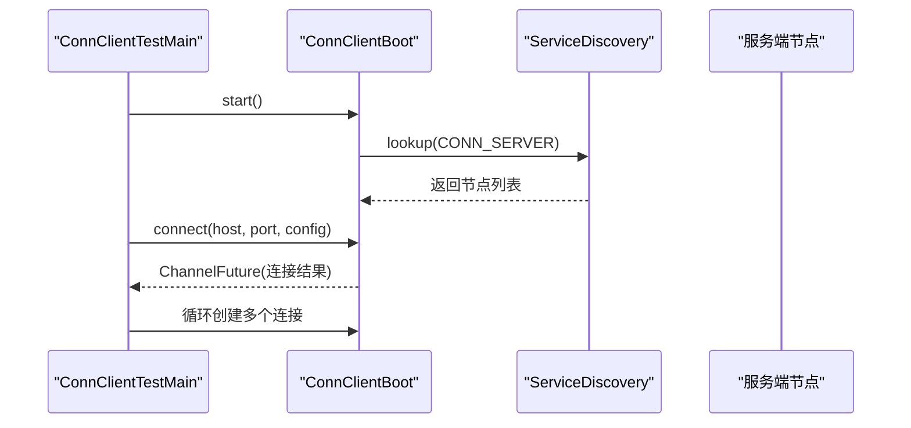
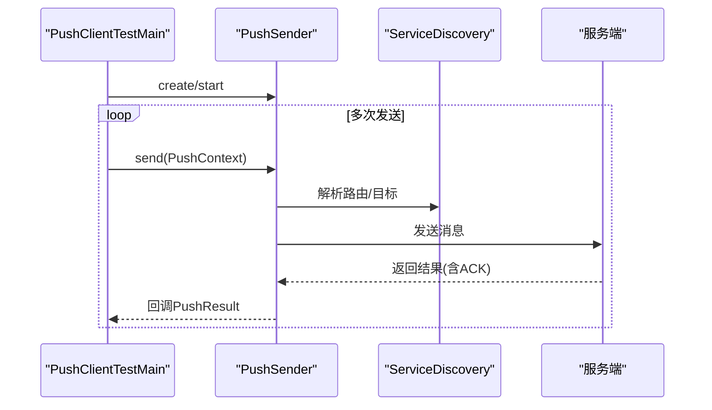
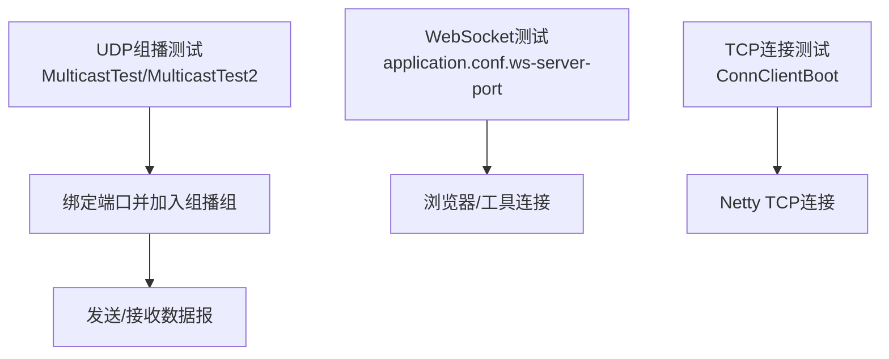
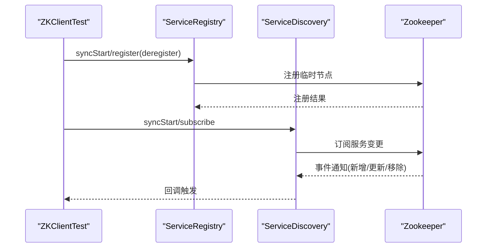
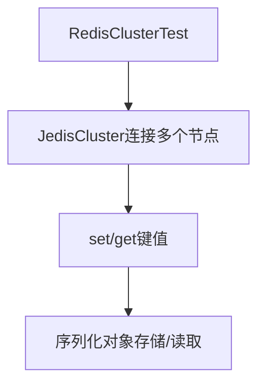
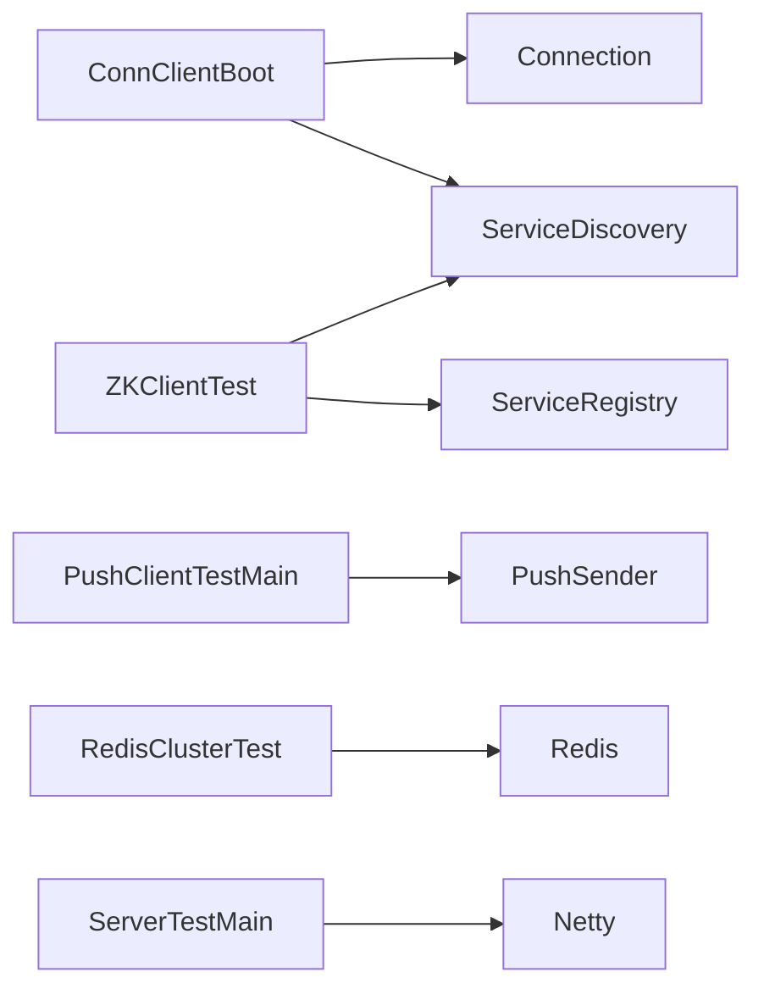

# 集成测试

<cite>
**本文引用的文件**
- [README.md](file://README.md)
- [application.conf](file://mpush-test/src/main/resources/application.conf)
- [ServerTestMain.java](file://mpush-test/src/main/java/com/mpush/test/sever/ServerTestMain.java)
- [ConnClientTestMain.java](file://mpush-test/src/main/java/com/mpush/test/client/ConnClientTestMain.java)
- [ConnClientBoot.java](file://mpush-test/src/main/java/com/mpush/test/client/ConnClientBoot.java)
- [PushClientTestMain.java](file://mpush-test/src/main/java/com/mpush/test/push/PushClientTestMain.java)
- [ZKClientTest.java](file://mpush-test/src/main/java/com/mpush/test/zk/ZKClientTest.java)
- [MulticastTest.java](file://mpush-test/src/main/java/com/mpush/test/udp/MulticastTest.java)
- [MulticastTest2.java](file://mpush-test/src/main/java/com/mpush/test/udp/MulticastTest2.java)
- [RedisClusterTest.java](file://mpush-test/src/main/java/com/mpush/test/redis/RedisClusterTest.java)
- [Service.java](file://mpush-api/src/main/java/com/mpush/api/service/Service.java)
- [ServiceDiscovery.java](file://mpush-api/src/main/java/com/mpush/api/srd/ServiceDiscovery.java)
- [ServiceRegistry.java](file://mpush-api/src/main/java/com/mpush/api/srd/ServiceRegistry.java)
- [PushSender.java](file://mpush-api/src/main/java/com/mpush/api/push/PushSender.java)
- [Connection.java](file://mpush-api/src/main/java/com/mpush/api/connection/Connection.java)
</cite>

## 目录
1. [简介](#简介)
2. [项目结构](#项目结构)
3. [核心组件](#核心组件)
4. [架构总览](#架构总览)
5. [详细组件分析](#详细组件分析)
6. [依赖分析](#依赖分析)
7. [性能考量](#性能考量)
8. [故障排查指南](#故障排查指南)
9. [结论](#结论)
10. [附录](#附录)

## 简介
本指南面向MPush项目的集成测试实践，目标与范围涵盖：
- 模块间接口测试：验证服务发现、服务注册、缓存与消息队列等SPI扩展接口的正确性与兼容性。
- 服务间通信测试：验证TCP/UDP/组播、WebSocket等网络协议的连通性与稳定性。
- 数据库集成测试：验证Redis连接、发布订阅、集群模式与数据一致性。
- 消息推送集成测试：验证客户端-服务端消息传递、多客户端并发、消息可靠性（含ACK）。
- 服务发现与注册测试：验证Zookeeper集成、服务注册/注销、订阅变更通知与负载均衡效果。
- 测试环境搭建：测试服务器配置、测试客户端设置、网络环境准备与隔离管理。

## 项目结构
MPush采用多模块结构，集成测试主要围绕以下模块展开：
- mpush-test：集成测试入口与示例，包含服务端、客户端、ZK、Redis、UDP等测试样例。
- mpush-api：公共API与SPI接口，定义服务、服务发现/注册、推送、连接等抽象。
- mpush-boot：服务端启动入口与配置加载。
- mpush-zk：基于Zookeeper的服务发现与注册实现。
- mpush-cache：基于Redis的缓存与消息队列实现。
- mpush-netty：基于Netty的TCP/UDP/WebSocket网络层实现。
- mpush-client：客户端连接与推送实现。
- mpush-core：核心业务逻辑（路由、推送、网关、会话等）。

图表来源
- [ServerTestMain.java](file://mpush-test/src/main/java/com/mpush/test/sever/ServerTestMain.java#L44-L48)
- [ConnClientBoot.java](file://mpush-test/src/main/java/com/mpush/test/client/ConnClientBoot.java#L53-L96)
- [ConnClientTestMain.java](file://mpush-test/src/main/java/com/mpush/test/client/ConnClientTestMain.java#L71-L116)
- [PushClientTestMain.java](file://mpush-test/src/main/java/com/mpush/test/push/PushClientTestMain.java#L39-L75)
- [Service.java](file://mpush-api/src/main/java/com/mpush/api/service/Service.java#L29-L47)
- [ServiceDiscovery.java](file://mpush-api/src/main/java/com/mpush/api/srd/ServiceDiscovery.java#L31-L38)
- [ServiceRegistry.java](file://mpush-api/src/main/java/com/mpush/api/srd/ServiceRegistry.java#L29-L34)
- [PushSender.java](file://mpush-api/src/main/java/com/mpush/api/push/PushSender.java#L33-L71)
- [Connection.java](file://mpush-api/src/main/java/com/mpush/api/connection/Connection.java#L32-L63)

章节来源
- [README.md](file://README.md#L22-L31)
- [application.conf](file://mpush-test/src/main/resources/application.conf#L1-L22)

## 核心组件
- 服务接口与生命周期：Service接口定义了start/stop、异步启动/停止与同步启动/停止等能力，贯穿服务端与客户端测试。
- 服务发现与注册：ServiceDiscovery与ServiceRegistry接口定义了服务查询、订阅与注册/注销能力，测试通过ZKClientTest验证。
- 推送接口：PushSender提供构建与发送推送消息的能力，测试通过PushClientTestMain验证。
- 连接接口：Connection接口定义了通道发送、关闭、读写超时与会话上下文等，测试通过客户端连接流程验证。
- 测试配置：application.conf集中定义ZK、Redis、网络端口等测试参数，便于统一管理。

章节来源
- [Service.java](file://mpush-api/src/main/java/com/mpush/api/service/Service.java#L29-L47)
- [ServiceDiscovery.java](file://mpush-api/src/main/java/com/mpush/api/srd/ServiceDiscovery.java#L31-L38)
- [ServiceRegistry.java](file://mpush-api/src/main/java/com/mpush/api/srd/ServiceRegistry.java#L29-L34)
- [PushSender.java](file://mpush-api/src/main/java/com/mpush/api/push/PushSender.java#L33-L71)
- [Connection.java](file://mpush-api/src/main/java/com/mpush/api/connection/Connection.java#L32-L63)
- [application.conf](file://mpush-test/src/main/resources/application.conf#L7-L21)

## 架构总览
集成测试关注的服务间交互与数据流如下：

图表来源
- [ServerTestMain.java](file://mpush-test/src/main/java/com/mpush/test/sever/ServerTestMain.java#L44-L48)
- [ConnClientBoot.java](file://mpush-test/src/main/java/com/mpush/test/client/ConnClientBoot.java#L98-L100)
- [ConnClientTestMain.java](file://mpush-test/src/main/java/com/mpush/test/client/ConnClientTestMain.java#L76-L81)
- [PushClientTestMain.java](file://mpush-test/src/main/java/com/mpush/test/push/PushClientTestMain.java#L46-L47)
- [ServiceDiscovery.java](file://mpush-api/src/main/java/com/mpush/api/srd/ServiceDiscovery.java#L33-L35)
- [ServiceRegistry.java](file://mpush-api/src/main/java/com/mpush/api/srd/ServiceRegistry.java#L31-L33)
- [application.conf](file://mpush-test/src/main/resources/application.conf#L7-L21)

## 详细组件分析

### 服务端启动与网络监听
- 启动入口：通过ServerTestMain调用Main.main启动服务端，设置Netty泄漏检测级别与优化参数，便于集成测试期间定位问题。
- 端口与网络：application.conf中定义connect/gateway/admin/ws等端口，确保测试客户端能正确连接。

图表来源
- [ServerTestMain.java](file://mpush-test/src/main/java/com/mpush/test/sever/ServerTestMain.java#L44-L48)
- [application.conf](file://mpush-test/src/main/resources/application.conf#L14-L21)

章节来源
- [ServerTestMain.java](file://mpush-test/src/main/java/com/mpush/test/sever/ServerTestMain.java#L34-L48)
- [application.conf](file://mpush-test/src/main/resources/application.conf#L14-L21)

### 客户端连接与消息传递
- 客户端引导：ConnClientBoot负责初始化服务发现、缓存、事件总线与Netty引导，建立TCP连接并注入客户端配置。
- 多客户端并发：ConnClientTestMain支持批量创建客户端，随机选择服务节点，验证高并发下的连接稳定性与统计输出。
- 连接接口：Connection接口提供发送、关闭、读写超时与会话上下文，保障消息可靠传递的基础能力。

图表来源
- [ConnClientTestMain.java](file://mpush-test/src/main/java/com/mpush/test/client/ConnClientTestMain.java#L71-L116)
- [ConnClientBoot.java](file://mpush-test/src/main/java/com/mpush/test/client/ConnClientBoot.java#L62-L88)
- [ConnClientBoot.java](file://mpush-test/src/main/java/com/mpush/test/client/ConnClientBoot.java#L98-L100)
- [ServiceDiscovery.java](file://mpush-api/src/main/java/com/mpush/api/srd/ServiceDiscovery.java#L33-L35)

章节来源
- [ConnClientTestMain.java](file://mpush-test/src/main/java/com/mpush/test/client/ConnClientTestMain.java#L40-L116)
- [ConnClientBoot.java](file://mpush-test/src/main/java/com/mpush/test/client/ConnClientBoot.java#L53-L127)
- [Connection.java](file://mpush-api/src/main/java/com/mpush/api/connection/Connection.java#L32-L63)

### 推送消息集成测试
- 推送发送：PushClientTestMain通过PushSender创建并启动，构建PushContext（含消息ID、ACK模型、用户ID、超时与回调），发送多条消息并等待结果。
- 回调与可靠性：通过PushCallback接收PushResult，结合AUTO_ACK模型验证消息可靠性与ACK机制。

图表来源
- [PushClientTestMain.java](file://mpush-test/src/main/java/com/mpush/test/push/PushClientTestMain.java#L46-L75)
- [PushSender.java](file://mpush-api/src/main/java/com/mpush/api/push/PushSender.java#L40-L50)
- [ServiceDiscovery.java](file://mpush-api/src/main/java/com/mpush/api/srd/ServiceDiscovery.java#L33-L35)

章节来源
- [PushClientTestMain.java](file://mpush-test/src/main/java/com/mpush/test/push/PushClientTestMain.java#L39-L77)
- [PushSender.java](file://mpush-api/src/main/java/com/mpush/api/push/PushSender.java#L33-L71)

### 网络通信集成测试
- TCP/UDP/组播：通过MulticastTest与MulticastTest2验证组播收发，结合application.conf中的gateway-client-port与gateway-server-net配置，验证UDP路径。
- WebSocket：application.conf中ws-server-port可启用WebSocket对外端口，便于Web客户端接入测试。

图表来源
- [MulticastTest.java](file://mpush-test/src/main/java/com/mpush/test/udp/MulticastTest.java#L36-L52)
- [MulticastTest2.java](file://mpush-test/src/main/java/com/mpush/test/udp/MulticastTest2.java#L106-L124)
- [application.conf](file://mpush-test/src/main/resources/application.conf#L14-L21)

章节来源
- [MulticastTest.java](file://mpush-test/src/main/java/com/mpush/test/udp/MulticastTest.java#L35-L71)
- [MulticastTest2.java](file://mpush-test/src/main/java/com/mpush/test/udp/MulticastTest2.java#L34-L125)
- [application.conf](file://mpush-test/src/main/resources/application.conf#L14-L21)

### 服务发现与注册集成测试
- 服务注册/注销：ZKClientTest通过ServiceRegistryFactory创建注册器，注册多个Gateway节点并注销，验证注册生命周期。
- 服务发现与订阅：ZKClientTest通过ServiceDiscoveryFactory创建发现器，订阅服务变更事件，验证新增/更新/移除回调。
- ZK客户端：ZKClientTest直接使用ZKClient进行临时节点注册与子节点读取，验证ZK可用性。

图表来源
- [ZKClientTest.java](file://mpush-test/src/main/java/com/mpush/test/zk/ZKClientTest.java#L41-L47)
- [ZKClientTest.java](file://mpush-test/src/main/java/com/mpush/test/zk/ZKClientTest.java#L51-L76)
- [ZKClientTest.java](file://mpush-test/src/main/java/com/mpush/test/zk/ZKClientTest.java#L79-L93)
- [ServiceRegistry.java](file://mpush-api/src/main/java/com/mpush/api/srd/ServiceRegistry.java#L31-L33)
- [ServiceDiscovery.java](file://mpush-api/src/main/java/com/mpush/api/srd/ServiceDiscovery.java#L35-L37)

章节来源
- [ZKClientTest.java](file://mpush-test/src/main/java/com/mpush/test/zk/ZKClientTest.java#L39-L94)
- [ServiceRegistry.java](file://mpush-api/src/main/java/com/mpush/api/srd/ServiceRegistry.java#L29-L34)
- [ServiceDiscovery.java](file://mpush-api/src/main/java/com/mpush/api/srd/ServiceDiscovery.java#L31-L38)

### 数据库集成测试（Redis）
- 集群连接：RedisClusterTest通过JedisCluster连接多个节点，进行键值存取与序列化对象读写，验证Redis集群可用性。
- 配置参考：application.conf中redis.nodes与password用于测试环境连接。

图表来源
- [RedisClusterTest.java](file://mpush-test/src/main/java/com/mpush/test/redis/RedisClusterTest.java#L35-L63)
- [application.conf](file://mpush-test/src/main/resources/application.conf#L8-L11)

章节来源
- [RedisClusterTest.java](file://mpush-test/src/main/java/com/mpush/test/redis/RedisClusterTest.java#L35-L63)
- [application.conf](file://mpush-test/src/main/resources/application.conf#L8-L11)

## 依赖分析
- 组件耦合：客户端引导依赖服务发现SPI；推送发送依赖PushSender SPI；ZK与Redis作为外部依赖通过SPI注入。
- 外部依赖：Zookeeper用于服务发现/注册；Redis用于缓存与消息队列；Netty用于网络传输。
- 配置契约：application.conf集中管理ZK、Redis、网络端口等，确保测试一致性。

图表来源
- [ConnClientBoot.java](file://mpush-test/src/main/java/com/mpush/test/client/ConnClientBoot.java#L22-L35)
- [PushClientTestMain.java](file://mpush-test/src/main/java/com/mpush/test/push/PushClientTestMain.java#L46-L47)
- [ZKClientTest.java](file://mpush-test/src/main/java/com/mpush/test/zk/ZKClientTest.java#L41-L42)
- [application.conf](file://mpush-test/src/main/resources/application.conf#L7-L21)

章节来源
- [ConnClientBoot.java](file://mpush-test/src/main/java/com/mpush/test/client/ConnClientBoot.java#L53-L96)
- [PushClientTestMain.java](file://mpush-test/src/main/java/com/mpush/test/push/PushClientTestMain.java#L46-L47)
- [ZKClientTest.java](file://mpush-test/src/main/java/com/mpush/test/zk/ZKClientTest.java#L41-L48)
- [application.conf](file://mpush-test/src/main/resources/application.conf#L7-L21)

## 性能考量
- 心跳与超时：application.conf中min/max-heartbeat与session-expired-time影响连接稳定性与资源占用，建议在集成测试中适当放宽以避免误判。
- 缓冲区与水位：snd_buf/rcv_buf与write-buffer-water-mark影响高并发下的吞吐与背压，建议按测试规模调整。
- 线程池：thread.pool.*配置决定各服务线程池大小，需结合并发客户端数量与消息QPS进行调优。
- 流量整形：traffic-shaping可限制带宽，测试时可根据需要启用/禁用以评估极限性能。

章节来源
- [application.conf](file://mpush-test/src/main/resources/application.conf#L4-L21)

## 故障排查指南
- 服务端无法启动：检查application.conf中的ZK与Redis地址、端口与密码；确认ServerTestMain已设置Netty相关系统属性。
- 客户端连接失败：确认服务发现返回的节点列表非空；检查ConnClientBoot的Bootstrap配置与连接超时；观察ConnClientChannelHandler的统计信息。
- 推送无响应：确认PushSender已启动；检查PushContext参数（用户ID、ACK模型、超时）；关注回调中的PushResult。
- ZK异常：验证ZKClientTest中注册/订阅流程；检查ServiceDiscoveryFactory与ServiceRegistryFactory的SPI实现。
- Redis异常：验证RedisClusterTest连接与读写；检查nodes与password配置；确认Redis服务可达且无认证错误。
- 网络异常：通过MulticastTest/MulticastTest2验证组播连通性；检查防火墙与网络接口；确认ws-server-port已启用。

章节来源
- [ServerTestMain.java](file://mpush-test/src/main/java/com/mpush/test/sever/ServerTestMain.java#L44-L48)
- [ConnClientTestMain.java](file://mpush-test/src/main/java/com/mpush/test/client/ConnClientTestMain.java#L76-L81)
- [PushClientTestMain.java](file://mpush-test/src/main/java/com/mpush/test/push/PushClientTestMain.java#L63-L68)
- [ZKClientTest.java](file://mpush-test/src/main/java/com/mpush/test/zk/ZKClientTest.java#L79-L93)
- [RedisClusterTest.java](file://mpush-test/src/main/java/com/mpush/test/redis/RedisClusterTest.java#L52-L61)
- [MulticastTest.java](file://mpush-test/src/main/java/com/mpush/test/udp/MulticastTest.java#L36-L52)
- [MulticastTest2.java](file://mpush-test/src/main/java/com/mpush/test/udp/MulticastTest2.java#L106-L124)

## 结论
本集成测试指南围绕MPush的核心模块与接口，提供了从服务端启动、客户端连接、消息推送、服务发现/注册到数据库连接的完整测试策略。通过application.conf统一配置与mpush-test模块的示例代码，可快速搭建稳定可靠的集成测试环境，并覆盖高并发、网络异常与可靠性等关键场景。

## 附录
- 测试环境准备清单
  - 安装并运行Zookeeper与Redis（或Redis集群）。
  - 准备测试配置文件application.conf，设置ZK地址、Redis节点与网络端口。
  - 启动服务端（ServerTestMain），确认端口监听正常。
  - 启动客户端（ConnClientTestMain）与推送测试（PushClientTestMain）进行消息传递与并发验证。
  - 使用ZKClientTest与RedisClusterTest验证服务发现/注册与数据库连接。
- 测试数据准备与清理
  - 使用RedisClusterTest进行键值存取，测试结束后清理测试键。
  - 通过ZKClientTest完成注册/注销，确保ZK节点状态干净。
- 测试环境隔离
  - 不同测试套件使用独立的ZK命名空间与Redis数据库，避免相互污染。
  - 通过application.conf切换不同的ZK/Redis实例与端口，实现多环境并行测试。

章节来源
- [README.md](file://README.md#L32-L87)
- [application.conf](file://mpush-test/src/main/resources/application.conf#L1-L22)