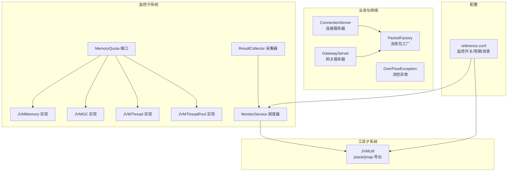
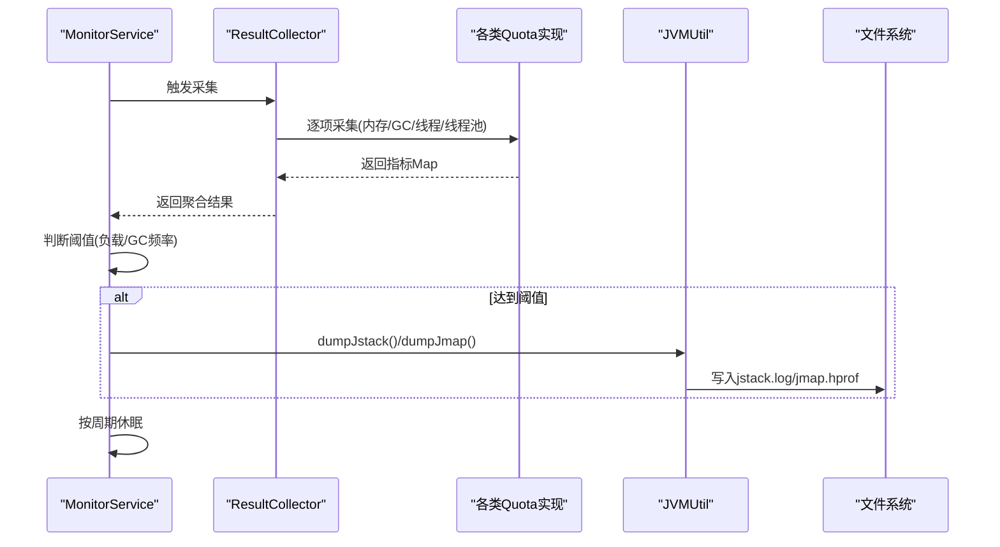
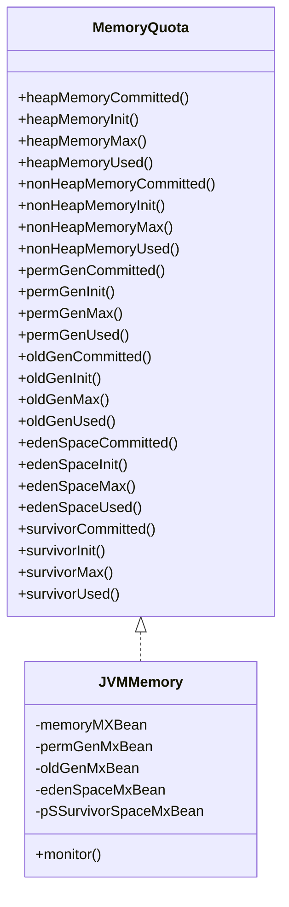
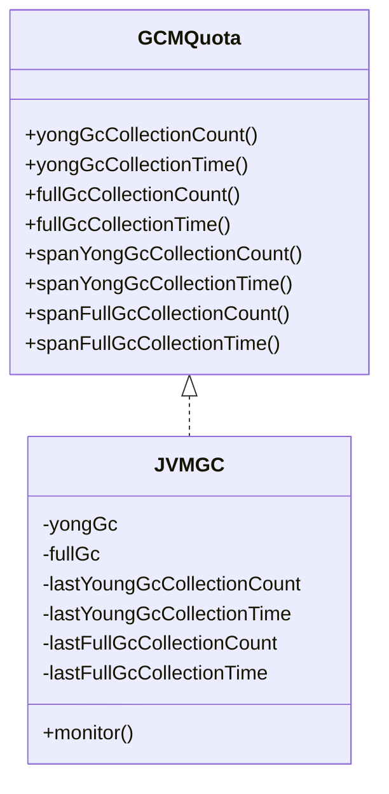
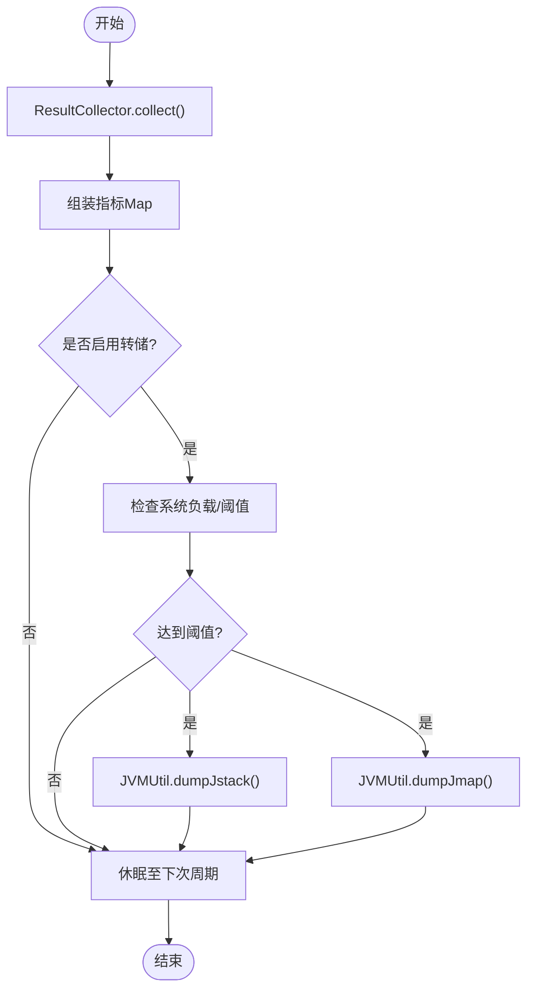
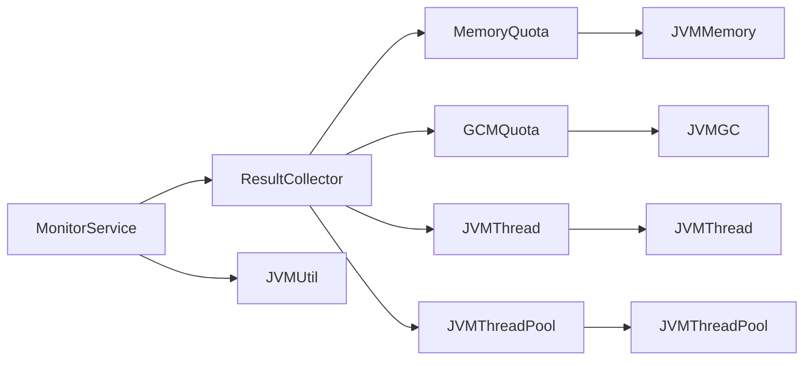

# 内存调试

<cite>
**本文引用的文件**
- [mpush-monitor/src/main/java/com/mpush/monitor/quota/MemoryQuota.java](file://mpush-monitor/src/main/java/com/mpush/monitor/quota/MemoryQuota.java)
- [mpush-monitor/src/main/java/com/mpush/monitor/quota/impl/JVMMemory.java](file://mpush-monitor/src/main/java/com/mpush/monitor/quota/impl/JVMMemory.java)
- [mpush-monitor/src/main/java/com/mpush/monitor/quota/GCMQuota.java](file://mpush-monitor/src/main/java/com/mpush/monitor/quota/GCMQuota.java)
- [mpush-monitor/src/main/java/com/mpush/monitor/quota/impl/JVMGC.java](file://mpush-monitor/src/main/java/com/mpush/monitor/quota/impl/JVMGC.java)
- [mpush-monitor/src/main/java/com/mpush/monitor/quota/impl/JVMThread.java](file://mpush-monitor/src/main/java/com/mpush/monitor/quota/impl/JVMThread.java)
- [mpush-monitor/src/main/java/com/mpush/monitor/quota/impl/JVMThreadPool.java](file://mpush-monitor/src/main/java/com/mpush/monitor/quota/impl/JVMThreadPool.java)
- [mpush-monitor/src/main/java/com/mpush/monitor/data/ResultCollector.java](file://mpush-monitor/src/main/java/com/mpush/monitor/data/ResultCollector.java)
- [mpush-monitor/src/main/java/com/mpush/monitor/service/MonitorService.java](file://mpush-monitor/src/main/java/com/mpush/monitor/service/MonitorService.java)
- [mpush-tools/src/main/java/com/mpush/tools/common/JVMUtil.java](file://mpush-tools/src/main/java/com/mpush/tools/common/JVMUtil.java)
- [mpush-common/src/main/java/com/mpush/common/memory/PacketFactory.java](file://mpush-common/src/main/java/com/mpush/common/memory/PacketFactory.java)
- [mpush-core/src/main/java/com/mpush/core/server/ConnectionServer.java](file://mpush-core/src/main/java/com/mpush/core/server/ConnectionServer.java)
- [mpush-core/src/main/java/com/mpush/core/server/GatewayServer.java](file://mpush-core/src/main/java/com/mpush/core/server/GatewayServer.java)
- [mpush-common/src/main/java/com/mpush/common/qps/OverFlowException.java](file://mpush-common/src/main/java/com/mpush/common/qps/OverFlowException.java)
- [conf/reference.conf](file://conf/reference.conf)
</cite>

## 目录
1. [简介](#简介)
2. [项目结构](#项目结构)
3. [核心组件](#核心组件)
4. [架构总览](#架构总览)
5. [详细组件分析](#详细组件分析)
6. [依赖分析](#依赖分析)
7. [性能考虑](#性能考虑)
8. [故障排查指南](#故障排查指南)
9. [结论](#结论)
10. [附录](#附录)

## 简介
本指南面向MPush项目的内存调试与优化，聚焦以下目标：
- 内存泄漏检测与分析：内存快照对比、对象引用链分析、弱引用检测思路
- 堆转储分析：基于jmap/jstack输出的工具化实践（如MAT/Eclipse Memory Analyzer）
- 内存使用监控：堆内存、非堆内存、内存池监控的实时采集与可视化
- 垃圾回收调优：GC日志分析、GC性能监控、内存分配策略调优
- 大对象与长生命周期对象管理：对象池、缓存策略、内存复用
- 内存相关异常诊断：OutOfMemoryError、GC Overhead Limit Exceeded等

MPush通过监控模块对JVM内存、GC、线程与线程池进行采集，并结合工具模块导出堆栈与堆转储，为内存问题诊断提供数据基础。

## 项目结构
围绕内存调试的关键模块与文件：
- 监控指标接口与实现：MemoryQuota、JVMGC、JVMThread、JVMThreadPool
- 监控采集与调度：ResultCollector、MonitorService
- 工具与转储：JVMUtil（jstack、jmap导出）
- 内存工厂与网络层：PacketFactory
- 服务器与缓冲区：ConnectionServer、GatewayServer
- 流控异常：OverFlowException
- 配置：conf/reference.conf（监控开关、周期、输出目录）

**图表来源**
- [mpush-monitor/src/main/java/com/mpush/monitor/quota/MemoryQuota.java](file://mpush-monitor/src/main/java/com/mpush/monitor/quota/MemoryQuota.java#L22-L78)
- [mpush-monitor/src/main/java/com/mpush/monitor/quota/impl/JVMMemory.java](file://mpush-monitor/src/main/java/com/mpush/monitor/quota/impl/JVMMemory.java#L32-L266)
- [mpush-monitor/src/main/java/com/mpush/monitor/quota/GCMQuota.java](file://mpush-monitor/src/main/java/com/mpush/monitor/quota/GCMQuota.java#L22-L40)
- [mpush-monitor/src/main/java/com/mpush/monitor/quota/impl/JVMGC.java](file://mpush-monitor/src/main/java/com/mpush/monitor/quota/impl/JVMGC.java#L31-L159)
- [mpush-monitor/src/main/java/com/mpush/monitor/quota/impl/JVMThread.java](file://mpush-monitor/src/main/java/com/mpush/monitor/quota/impl/JVMThread.java#L29-L75)
- [mpush-monitor/src/main/java/com/mpush/monitor/quota/impl/JVMThreadPool.java](file://mpush-monitor/src/main/java/com/mpush/monitor/quota/impl/JVMThreadPool.java#L34-L57)
- [mpush-monitor/src/main/java/com/mpush/monitor/data/ResultCollector.java](file://mpush-monitor/src/main/java/com/mpush/monitor/data/ResultCollector.java#L45-L74)
- [mpush-monitor/src/main/java/com/mpush/monitor/service/MonitorService.java](file://mpush-monitor/src/main/java/com/mpush/monitor/service/MonitorService.java#L65-L119)
- [mpush-tools/src/main/java/com/mpush/tools/common/JVMUtil.java](file://mpush-tools/src/main/java/com/mpush/tools/common/JVMUtil.java#L48-L177)
- [mpush-common/src/main/java/com/mpush/common/memory/PacketFactory.java](file://mpush-common/src/main/java/com/mpush/common/memory/PacketFactory.java#L32-L40)
- [mpush-core/src/main/java/com/mpush/core/server/ConnectionServer.java](file://mpush-core/src/main/java/com/mpush/core/server/ConnectionServer.java#L155-L162)
- [mpush-core/src/main/java/com/mpush/core/server/GatewayServer.java](file://mpush-core/src/main/java/com/mpush/core/server/GatewayServer.java#L135-L142)
- [conf/reference.conf](file://conf/reference.conf#L224-L232)

**章节来源**
- [mpush-monitor/src/main/java/com/mpush/monitor/quota/MemoryQuota.java](file://mpush-monitor/src/main/java/com/mpush/monitor/quota/MemoryQuota.java#L22-L78)
- [mpush-monitor/src/main/java/com/mpush/monitor/quota/impl/JVMMemory.java](file://mpush-monitor/src/main/java/com/mpush/monitor/quota/impl/JVMMemory.java#L32-L266)
- [mpush-monitor/src/main/java/com/mpush/monitor/quota/GCMQuota.java](file://mpush-monitor/src/main/java/com/mpush/monitor/quota/GCMQuota.java#L22-L40)
- [mpush-monitor/src/main/java/com/mpush/monitor/quota/impl/JVMGC.java](file://mpush-monitor/src/main/java/com/mpush/monitor/quota/impl/JVMGC.java#L31-L159)
- [mpush-monitor/src/main/java/com/mpush/monitor/quota/impl/JVMThread.java](file://mpush-monitor/src/main/java/com/mpush/monitor/quota/impl/JVMThread.java#L29-L75)
- [mpush-monitor/src/main/java/com/mpush/monitor/quota/impl/JVMThreadPool.java](file://mpush-monitor/src/main/java/com/mpush/monitor/quota/impl/JVMThreadPool.java#L34-L57)
- [mpush-monitor/src/main/java/com/mpush/monitor/data/ResultCollector.java](file://mpush-monitor/src/main/java/com/mpush/monitor/data/ResultCollector.java#L45-L74)
- [mpush-monitor/src/main/java/com/mpush/monitor/service/MonitorService.java](file://mpush-monitor/src/main/java/com/mpush/monitor/service/MonitorService.java#L65-L119)
- [mpush-tools/src/main/java/com/mpush/tools/common/JVMUtil.java](file://mpush-tools/src/main/java/com/mpush/tools/common/JVMUtil.java#L48-L177)
- [mpush-common/src/main/java/com/mpush/common/memory/PacketFactory.java](file://mpush-common/src/main/java/com/mpush/common/memory/PacketFactory.java#L32-L40)
- [mpush-core/src/main/java/com/mpush/core/server/ConnectionServer.java](file://mpush-core/src/main/java/com/mpush/core/server/ConnectionServer.java#L155-L162)
- [mpush-core/src/main/java/com/mpush/core/server/GatewayServer.java](file://mpush-core/src/main/java/com/mpush/core/server/GatewayServer.java#L135-L142)
- [conf/reference.conf](file://conf/reference.conf#L224-L232)

## 核心组件
- 内存指标接口与实现：提供堆/非堆/老年代/Eden/Survivor等维度的内存使用统计
- GC指标接口与实现：提供年轻代/老年代GC次数与时长及增量统计
- 线程与线程池指标：线程数、死锁检测、线程池状态
- 监控采集器：统一采集各指标并封装为结果
- 监控调度器：按配置周期采集、打印日志、触发转储
- JVM工具：导出jstack与堆转储（jmap），便于外部分析工具使用

**章节来源**
- [mpush-monitor/src/main/java/com/mpush/monitor/quota/MemoryQuota.java](file://mpush-monitor/src/main/java/com/mpush/monitor/quota/MemoryQuota.java#L22-L78)
- [mpush-monitor/src/main/java/com/mpush/monitor/quota/impl/JVMMemory.java](file://mpush-monitor/src/main/java/com/mpush/monitor/quota/impl/JVMMemory.java#L68-L266)
- [mpush-monitor/src/main/java/com/mpush/monitor/quota/GCMQuota.java](file://mpush-monitor/src/main/java/com/mpush/monitor/quota/GCMQuota.java#L22-L40)
- [mpush-monitor/src/main/java/com/mpush/monitor/quota/impl/JVMGC.java](file://mpush-monitor/src/main/java/com/mpush/monitor/quota/impl/JVMGC.java#L60-L159)
- [mpush-monitor/src/main/java/com/mpush/monitor/quota/impl/JVMThread.java](file://mpush-monitor/src/main/java/com/mpush/monitor/quota/impl/JVMThread.java#L37-L75)
- [mpush-monitor/src/main/java/com/mpush/monitor/quota/impl/JVMThreadPool.java](file://mpush-monitor/src/main/java/com/mpush/monitor/quota/impl/JVMThreadPool.java#L41-L57)
- [mpush-monitor/src/main/java/com/mpush/monitor/data/ResultCollector.java](file://mpush-monitor/src/main/java/com/mpush/monitor/data/ResultCollector.java#L45-L74)
- [mpush-monitor/src/main/java/com/mpush/monitor/service/MonitorService.java](file://mpush-monitor/src/main/java/com/mpush/monitor/service/MonitorService.java#L65-L119)
- [mpush-tools/src/main/java/com/mpush/tools/common/JVMUtil.java](file://mpush-tools/src/main/java/com/mpush/tools/common/JVMUtil.java#L113-L177)

## 架构总览
监控体系从采集器统一收集JVM内存、GC、线程与线程池指标，调度器按周期执行采集与转储逻辑；同时通过配置项控制是否打印日志与是否导出转储文件。

**图表来源**
- [mpush-monitor/src/main/java/com/mpush/monitor/service/MonitorService.java](file://mpush-monitor/src/main/java/com/mpush/monitor/service/MonitorService.java#L65-L119)
- [mpush-monitor/src/main/java/com/mpush/monitor/data/ResultCollector.java](file://mpush-monitor/src/main/java/com/mpush/monitor/data/ResultCollector.java#L45-L74)
- [mpush-tools/src/main/java/com/mpush/tools/common/JVMUtil.java](file://mpush-tools/src/main/java/com/mpush/tools/common/JVMUtil.java#L113-L177)

## 详细组件分析

### 内存监控组件（JVMMemory）
- 功能要点
  - 识别不同GC代的内存池名称，分别统计堆/非堆/老年代/Eden/Survivor等
  - 提供committed/init/max/used等维度指标
  - 通过ManagementFactory采集JMX数据
- 适用场景
  - 快照对比：记录heap/nonHeap/oldGen/eden/survivor等指标变化
  - 峰值与容量预警：结合阈值触发告警或转储

**图表来源**
- [mpush-monitor/src/main/java/com/mpush/monitor/quota/MemoryQuota.java](file://mpush-monitor/src/main/java/com/mpush/monitor/quota/MemoryQuota.java#L22-L78)
- [mpush-monitor/src/main/java/com/mpush/monitor/quota/impl/JVMMemory.java](file://mpush-monitor/src/main/java/com/mpush/monitor/quota/impl/JVMMemory.java#L32-L266)

**章节来源**
- [mpush-monitor/src/main/java/com/mpush/monitor/quota/impl/JVMMemory.java](file://mpush-monitor/src/main/java/com/mpush/monitor/quota/impl/JVMMemory.java#L51-L266)

### GC监控组件（JVMGC）
- 功能要点
  - 识别年轻代与老年代GC名称，统计GC次数与时长
  - 提供增量统计（spanXxx）用于观察短期变化趋势
- 适用场景
  - GC频繁：结合young/full GC次数与时长判断GC压力
  - GC停顿：关注full GC time与span time

**图表来源**
- [mpush-monitor/src/main/java/com/mpush/monitor/quota/GCMQuota.java](file://mpush-monitor/src/main/java/com/mpush/monitor/quota/GCMQuota.java#L22-L40)
- [mpush-monitor/src/main/java/com/mpush/monitor/quota/impl/JVMGC.java](file://mpush-monitor/src/main/java/com/mpush/monitor/quota/impl/JVMGC.java#L31-L159)

**章节来源**
- [mpush-monitor/src/main/java/com/mpush/monitor/quota/impl/JVMGC.java](file://mpush-monitor/src/main/java/com/mpush/monitor/quota/impl/JVMGC.java#L49-L159)

### 线程与线程池监控（JVMThread / JVMThreadPool）
- 功能要点
  - 线程：daemon线程数、总线程数、累计启动数、死锁检测
  - 线程池：遍历活跃线程池，输出队列长度、核心/最大线程、完成任务数等
- 适用场景
  - 线程泄露：daemon线程数长期上升、死锁数>0
  - 线程池积压：任务队列长度持续增长、拒绝策略触发

**章节来源**
- [mpush-monitor/src/main/java/com/mpush/monitor/quota/impl/JVMThread.java](file://mpush-monitor/src/main/java/com/mpush/monitor/quota/impl/JVMThread.java#L37-L75)
- [mpush-monitor/src/main/java/com/mpush/monitor/quota/impl/JVMThreadPool.java](file://mpush-monitor/src/main/java/com/mpush/monitor/quota/impl/JVMThreadPool.java#L41-L57)

### 监控采集与调度（ResultCollector / MonitorService）
- 功能要点
  - ResultCollector统一采集jvm-info/gc/memory/thread/thread-pool
  - MonitorService按周期运行，打印日志并根据负载阈值触发转储
- 适用场景
  - 自动化监控：周期性采集与日志输出
  - 告警联动：当负载过高时触发jstack/jmap导出

**图表来源**
- [mpush-monitor/src/main/java/com/mpush/monitor/data/ResultCollector.java](file://mpush-monitor/src/main/java/com/mpush/monitor/data/ResultCollector.java#L45-L74)
- [mpush-monitor/src/main/java/com/mpush/monitor/service/MonitorService.java](file://mpush-monitor/src/main/java/com/mpush/monitor/service/MonitorService.java#L65-L119)
- [mpush-tools/src/main/java/com/mpush/tools/common/JVMUtil.java](file://mpush-tools/src/main/java/com/mpush/tools/common/JVMUtil.java#L113-L177)

**章节来源**
- [mpush-monitor/src/main/java/com/mpush/monitor/data/ResultCollector.java](file://mpush-monitor/src/main/java/com/mpush/monitor/data/ResultCollector.java#L45-L74)
- [mpush-monitor/src/main/java/com/mpush/monitor/service/MonitorService.java](file://mpush-monitor/src/main/java/com/mpush/monitor/service/MonitorService.java#L65-L119)

### JVM工具与转储（JVMUtil）
- 功能要点
  - jstack：导出全量线程栈信息，含CPU时间、锁持有、监视器等
  - dumpJstack/dumpJmap：异步写入到指定目录，文件名包含时间戳
- 适用场景
  - 死锁/高占用：通过jstack定位热点线程与锁竞争
  - 堆内存问题：通过jmap导出堆快照，配合MAT/Eclipse Memory Analyzer分析

**章节来源**
- [mpush-tools/src/main/java/com/mpush/tools/common/JVMUtil.java](file://mpush-tools/src/main/java/com/mpush/tools/common/JVMUtil.java#L48-L177)

### 内存工厂与网络层（PacketFactory）
- 功能要点
  - 根据配置选择Packet或UDPPacket实例，减少不必要的对象创建
- 适用场景
  - 对象复用：避免频繁构造消息包导致的临时对象增多
  - UDP路径：在UDP网关场景下选择轻量包类型

**章节来源**
- [mpush-common/src/main/java/com/mpush/common/memory/PacketFactory.java](file://mpush-common/src/main/java/com/mpush/common/memory/PacketFactory.java#L32-L40)

### 服务器与缓冲区（ConnectionServer / GatewayServer）
- 功能要点
  - 提示ChannelOutboundBuffer可能无限增长的风险，强调异步写入与背压的重要性
- 适用场景
  - 高延迟下游：防止写缓冲膨胀导致内存飙升
  - 限流与背压：结合write buffer watermark与限流策略

**章节来源**
- [mpush-core/src/main/java/com/mpush/core/server/ConnectionServer.java](file://mpush-core/src/main/java/com/mpush/core/server/ConnectionServer.java#L155-L162)
- [mpush-core/src/main/java/com/mpush/core/server/GatewayServer.java](file://mpush-core/src/main/java/com/mpush/core/server/GatewayServer.java#L135-L142)

### 流控异常（OverFlowException）
- 功能要点
  - 表达“超出限制”的语义，区分是否超过最大限制
- 适用场景
  - 与内存压力联动：当内存紧张且流量过大时，触发拒绝策略并记录异常

**章节来源**
- [mpush-common/src/main/java/com/mpush/common/qps/OverFlowException.java](file://mpush-common/src/main/java/com/mpush/common/qps/OverFlowException.java#L27-L47)

## 依赖分析
- 组件内聚与耦合
  - JVMMemory/JVMGC/JVMThread/JVMThreadPool均实现各自的Quota接口，职责清晰
  - ResultCollector聚合多个Quota实现，降低上层调用复杂度
  - MonitorService依赖ResultCollector与JVMUtil，形成“采集—决策—转储”的闭环
- 外部依赖
  - 使用ManagementFactory与JMX MXBean进行指标采集
  - 使用HotSpotDiagnosticMXBean进行堆转储

**图表来源**
- [mpush-monitor/src/main/java/com/mpush/monitor/data/ResultCollector.java](file://mpush-monitor/src/main/java/com/mpush/monitor/data/ResultCollector.java#L45-L74)
- [mpush-monitor/src/main/java/com/mpush/monitor/service/MonitorService.java](file://mpush-monitor/src/main/java/com/mpush/monitor/service/MonitorService.java#L65-L119)
- [mpush-tools/src/main/java/com/mpush/tools/common/JVMUtil.java](file://mpush-tools/src/main/java/com/mpush/tools/common/JVMUtil.java#L113-L177)

**章节来源**
- [mpush-monitor/src/main/java/com/mpush/monitor/data/ResultCollector.java](file://mpush-monitor/src/main/java/com/mpush/monitor/data/ResultCollector.java#L45-L74)
- [mpush-monitor/src/main/java/com/mpush/monitor/service/MonitorService.java](file://mpush-monitor/src/main/java/com/mpush/monitor/service/MonitorService.java#L65-L119)

## 性能考虑
- 采集频率与开销
  - 合理设置监控周期，避免频繁JMX查询造成额外开销
- 指标粒度
  - 在高频路径上避免过度采样，优先关注关键指标（heap used、old used、full gc time）
- 转储触发策略
  - 结合系统负载与GC频率阈值触发，避免无意义的频繁转储

[本节为通用建议，无需具体文件引用]

## 故障排查指南

### 内存泄漏检测与分析
- 快照对比
  - 使用JVMMemory采集heap/oldGen/eden/survivor等指标，建立基线与对比曲线
  - 关注oldGen/heap used持续上升且无法回落
- 对象引用链分析
  - 通过JVMUtil导出堆转储（jmap），使用MAT/Eclipse Memory Analyzer分析
  - 关注大对象与长生命周期对象的保留集（Retained Set）
- 弱引用检测
  - 检查是否存在强引用替代弱引用导致的无法回收
  - 关注缓存与对象池的生命周期管理

**章节来源**
- [mpush-monitor/src/main/java/com/mpush/monitor/quota/impl/JVMMemory.java](file://mpush-monitor/src/main/java/com/mpush/monitor/quota/impl/JVMMemory.java#L237-L266)
- [mpush-tools/src/main/java/com/mpush/tools/common/JVMUtil.java](file://mpush-tools/src/main/java/com/mpush/tools/common/JVMUtil.java#L160-L177)

### 堆转储分析工具与方法
- 工具
  - jmap：导出堆快照
  - jstack：导出线程栈
  - Eclipse Memory Analyzer（MAT）、VisualVM、JProfiler
- 方法
  - 通过MonitorService在高负载时自动触发转储
  - 使用MAT查看Histogram、Dominator Tree、OQL查询，定位大对象与泄漏根因

**章节来源**
- [mpush-monitor/src/main/java/com/mpush/monitor/service/MonitorService.java](file://mpush-monitor/src/main/java/com/mpush/monitor/service/MonitorService.java#L101-L119)
- [mpush-tools/src/main/java/com/mpush/tools/common/JVMUtil.java](file://mpush-tools/src/main/java/com/mpush/tools/common/JVMUtil.java#L113-L177)

### 内存使用监控（堆/非堆/内存池）
- 堆内存监控
  - heapMemoryUsed/heapMemoryMax/oldGenUsed/edenSpaceUsed/survivorUsed
- 非堆内存监控
  - nonHeapMemoryUsed/permGenUsed（视JDK版本）
- 内存池监控
  - 结合JVMThreadPool监控线程池队列长度与拒绝策略触发次数

**章节来源**
- [mpush-monitor/src/main/java/com/mpush/monitor/quota/impl/JVMMemory.java](file://mpush-monitor/src/main/java/com/mpush/monitor/quota/impl/JVMMemory.java#L68-L266)
- [mpush-monitor/src/main/java/com/mpush/monitor/quota/impl/JVMThreadPool.java](file://mpush-monitor/src/main/java/com/mpush/monitor/quota/impl/JVMThreadPool.java#L41-L57)

### 垃圾回收调优与调试
- GC日志分析
  - 关注young/full GC次数与时长，结合span指标观察短期变化
- GC性能监控
  - 当full GC time持续升高或次数频繁时，触发转储
- 内存分配策略调优
  - 调整新生代/老年代比例，优化晋升阈值，避免频繁Full GC

**章节来源**
- [mpush-monitor/src/main/java/com/mpush/monitor/quota/impl/JVMGC.java](file://mpush-monitor/src/main/java/com/mpush/monitor/quota/impl/JVMGC.java#L60-L159)
- [mpush-monitor/src/main/java/com/mpush/monitor/service/MonitorService.java](file://mpush-monitor/src/main/java/com/mpush/monitor/service/MonitorService.java#L101-L119)

### 大对象与长生命周期对象管理
- 对象池与缓存
  - 使用缓存管理器（CacheManager）控制对象生命周期
  - 通过PacketFactory在UDP场景选择合适的消息包类型
- 内存复用
  - 减少临时对象创建，避免写缓冲无限增长（参考服务器注释）

**章节来源**
- [mpush-common/src/main/java/com/mpush/common/memory/PacketFactory.java](file://mpush-common/src/main/java/com/mpush/common/memory/PacketFactory.java#L32-L40)
- [mpush-core/src/main/java/com/mpush/core/server/ConnectionServer.java](file://mpush-core/src/main/java/com/mpush/core/server/ConnectionServer.java#L155-L162)
- [mpush-core/src/main/java/com/mpush/core/server/GatewayServer.java](file://mpush-core/src/main/java/com/mpush/core/server/GatewayServer.java#L135-L142)

### 内存相关异常诊断
- OutOfMemoryError
  - 观察heap/oldGen持续上升，结合转储分析泄漏根因
- GC Overhead Limit Exceeded
  - full GC time占比过高，触发转储并评估对象存活时间与缓存策略

**章节来源**
- [mpush-monitor/src/main/java/com/mpush/monitor/quota/impl/JVMGC.java](file://mpush-monitor/src/main/java/com/mpush/monitor/quota/impl/JVMGC.java#L119-L159)
- [mpush-monitor/src/main/java/com/mpush/monitor/service/MonitorService.java](file://mpush-monitor/src/main/java/com/mpush/monitor/service/MonitorService.java#L101-L119)

## 结论
MPush提供了完善的JVM内存与GC监控能力，并通过工具模块支持堆栈与堆转储导出。结合配置项可实现自动化监控与告警联动。在实际内存问题诊断中，应以指标趋势为依据，结合转储与分析工具定位根因，并通过对象池、缓存策略与线程池治理实现长效优化。

[本节为总结，无需具体文件引用]

## 附录

### 配置项参考（监控相关）
- dump-dir：转储文件输出目录
- dump-stack：是否启用转储
- dump-period：监控周期
- print-log：是否打印监控日志

**章节来源**
- [conf/reference.conf](file://conf/reference.conf#L224-L232)