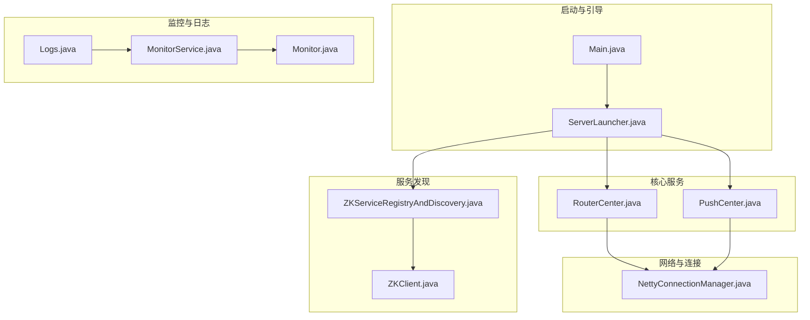
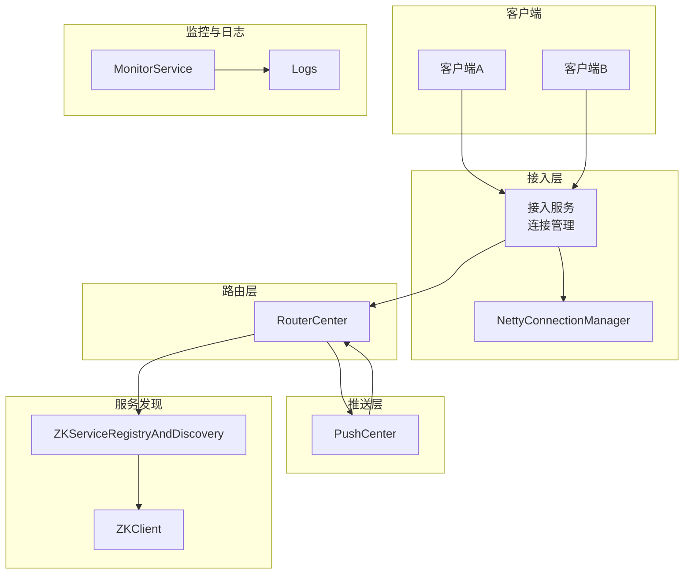
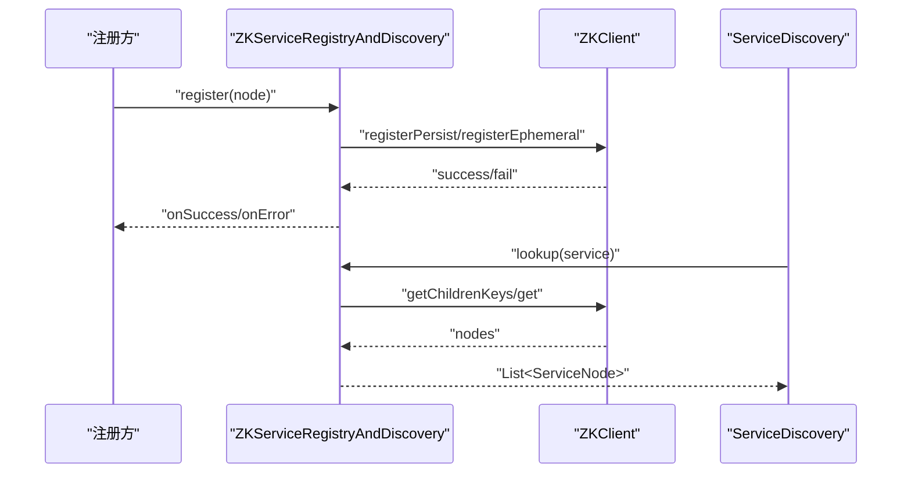
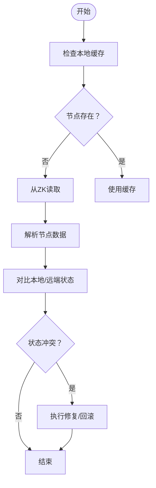
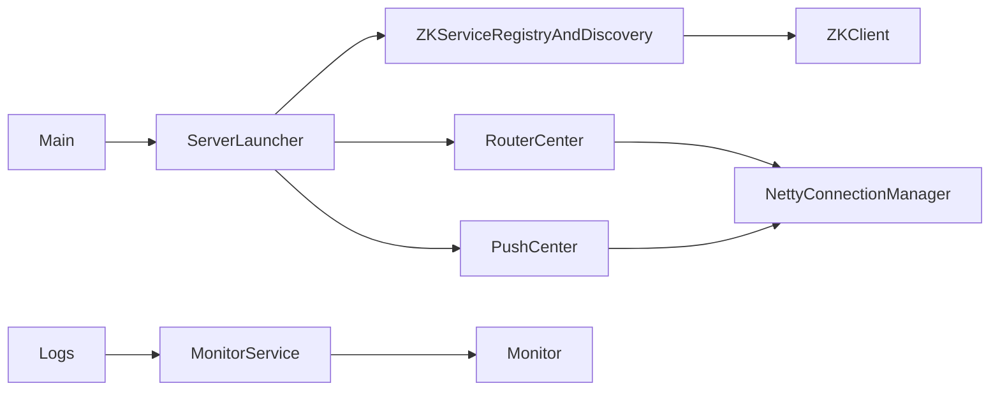

# 分布式调试

<cite>
**本文引用的文件**
- [README.md](file://README.md)
- [reference.conf](file://conf/reference.conf)
- [mpush.conf](file://mpush-boot/src/main/resources/mpush.conf)
- [Main.java](file://mpush-boot/src/main/java/com/mpush/bootstrap/Main.java)
- [ServerLauncher.java](file://mpush-boot/src/main/java/com/mpush/bootstrap/ServerLauncher.java)
- [ZKClient.java](file://mpush-zk/src/main/java/com/mpush/zk/ZKClient.java)
- [ZKServiceRegistryAndDiscovery.java](file://mpush-zk/src/main/java/com/mpush/zk/ZKServiceRegistryAndDiscovery.java)
- [MonitorService.java](file://mpush-monitor/src/main/java/com/mpush/monitor/service/MonitorService.java)
- [Logs.java](file://mpush-tools/src/main/java/com/mpush/tools/log/Logs.java)
- [ZKClientTest.java](file://mpush-test/src/main/java/com/mpush/test/zk/ZKClientTest.java)
- [application.conf](file://mpush-test/src/main/resources/application.conf)
- [PushCenter.java](file://mpush-core/src/main/java/com/mpush/core/push/PushCenter.java)
- [RouterCenter.java](file://mpush-core/src/main/java/com/mpush/core/router/RouterCenter.java)
- [NettyConnectionManager.java](file://mpush-netty/src/main/java/com/mpush/netty/connection/NettyConnectionManager.java)
- [Monitor.java](file://mpush-api/src/main/java/com/mpush/api/common/Monitor.java)
</cite>

## 目录
1. [简介](#简介)
2. [项目结构](#项目结构)
3. [核心组件](#核心组件)
4. [架构总览](#架构总览)
5. [组件详解](#组件详解)
6. [依赖关系分析](#依赖关系分析)
7. [性能与调试要点](#性能与调试要点)
8. [故障排查指南](#故障排查指南)
9. [结论](#结论)
10. [附录](#附录)

## 简介
本指南面向MPush分布式系统，聚焦多节点调试与运维场景，涵盖多实例启动、日志聚合、分布式追踪、服务发现调试（Zookeeper）、一致性问题定位、分布式锁与协调、跨节点通信诊断以及分布式性能监控与分析。文档基于仓库源码与配置文件，提供可操作的调试流程与可视化图示，帮助快速定位与解决分布式系统中的常见问题。

## 项目结构
MPush采用模块化设计，核心模块包括启动引导、网络协议、服务注册发现、路由中心、推送中心、监控与日志、Zookeeper集成等。下图展示与调试相关的关键模块及其交互关系。

**图表来源**
- [Main.java](file://mpush-boot/src/main/java/com/mpush/bootstrap/Main.java#L31-L38)
- [ServerLauncher.java](file://mpush-boot/src/main/java/com/mpush/bootstrap/ServerLauncher.java#L42-L71)
- [ZKClient.java](file://mpush-zk/src/main/java/com/mpush/zk/ZKClient.java#L42-L95)
- [ZKServiceRegistryAndDiscovery.java](file://mpush-zk/src/main/java/com/mpush/zk/ZKServiceRegistryAndDiscovery.java#L39-L75)
- [RouterCenter.java](file://mpush-core/src/main/java/com/mpush/core/router/RouterCenter.java#L40-L67)
- [PushCenter.java](file://mpush-core/src/main/java/com/mpush/core/push/PushCenter.java#L49-L109)
- [NettyConnectionManager.java](file://mpush-netty/src/main/java/com/mpush/netty/connection/NettyConnectionManager.java#L35-L68)
- [MonitorService.java](file://mpush-monitor/src/main/java/com/mpush/monitor/service/MonitorService.java#L36-L93)
- [Logs.java](file://mpush-tools/src/main/java/com/mpush/tools/log/Logs.java#L33-L64)
- [Monitor.java](file://mpush-api/src/main/java/com/mpush/api/common/Monitor.java#L29-L34)

**章节来源**
- [Main.java](file://mpush-boot/src/main/java/com/mpush/bootstrap/Main.java#L31-L38)
- [ServerLauncher.java](file://mpush-boot/src/main/java/com/mpush/bootstrap/ServerLauncher.java#L42-L71)

## 核心组件
- 启动引导与生命周期
  - 主入口负责初始化日志与启动ServerLauncher，后者按顺序装配缓存、服务注册发现、接入/网关/控制台、路由中心、推送中心、HTTP代理、监控等组件。
- 服务发现与Zookeeper
  - ZKClient封装Curator连接、本地缓存、临时/顺序节点注册、连接状态监听与重连恢复。
  - ZKServiceRegistryAndDiscovery基于ZKClient实现服务注册、注销、查询与订阅。
- 路由与推送
  - RouterCenter维护本地与远程路由表，处理用户上下线与查找。
  - PushCenter负责消息推送任务调度与限流控制，支持广播与单播。
- 监控与日志
  - MonitorService周期采集JVM与线程池指标，按阈值触发堆栈/堆转储；Logs统一初始化日志系统。
- 网络连接
  - NettyConnectionManager维护ChannelId到Connection的映射，便于连接级统计与诊断。

**章节来源**
- [ServerLauncher.java](file://mpush-boot/src/main/java/com/mpush/bootstrap/ServerLauncher.java#L42-L71)
- [ZKClient.java](file://mpush-zk/src/main/java/com/mpush/zk/ZKClient.java#L42-L95)
- [ZKServiceRegistryAndDiscovery.java](file://mpush-zk/src/main/java/com/mpush/zk/ZKServiceRegistryAndDiscovery.java#L39-L118)
- [RouterCenter.java](file://mpush-core/src/main/java/com/mpush/core/router/RouterCenter.java#L40-L134)
- [PushCenter.java](file://mpush-core/src/main/java/com/mpush/core/push/PushCenter.java#L49-L182)
- [MonitorService.java](file://mpush-monitor/src/main/java/com/mpush/monitor/service/MonitorService.java#L36-L146)
- [Logs.java](file://mpush-tools/src/main/java/com/mpush/tools/log/Logs.java#L33-L64)
- [NettyConnectionManager.java](file://mpush-netty/src/main/java/com/mpush/netty/connection/NettyConnectionManager.java#L35-L68)

## 架构总览
下图展示多节点环境下关键组件的交互与调试关注点：服务发现、路由、推送、监控与日志。

**图表来源**
- [RouterCenter.java](file://mpush-core/src/main/java/com/mpush/core/router/RouterCenter.java#L40-L134)
- [PushCenter.java](file://mpush-core/src/main/java/com/mpush/core/push/PushCenter.java#L49-L182)
- [NettyConnectionManager.java](file://mpush-netty/src/main/java/com/mpush/netty/connection/NettyConnectionManager.java#L35-L68)
- [ZKServiceRegistryAndDiscovery.java](file://mpush-zk/src/main/java/com/mpush/zk/ZKServiceRegistryAndDiscovery.java#L39-L118)
- [ZKClient.java](file://mpush-zk/src/main/java/com/mpush/zk/ZKClient.java#L42-L95)
- [MonitorService.java](file://mpush-monitor/src/main/java/com/mpush/monitor/service/MonitorService.java#L36-L146)
- [Logs.java](file://mpush-tools/src/main/java/com/mpush/tools/log/Logs.java#L33-L64)

## 组件详解

### 多实例启动与多节点调试
- 启动流程
  - 主入口初始化日志，随后ServerLauncher按顺序启动各组件，确保服务发现与注册在接入服务之前完成，避免路由不可用。
- 多实例差异
  - 通过配置文件覆盖不同节点的端口、注册IP与权重等，保证Zookeeper中服务列表正确。
- 关键配置参考
  - 端口与注册IP、网络类型、WS端口等在网络配置段落；Zookeeper地址与命名空间在ZK配置段落；日志级别与输出路径在日志配置段落。

**章节来源**
- [Main.java](file://mpush-boot/src/main/java/com/mpush/bootstrap/Main.java#L31-L38)
- [ServerLauncher.java](file://mpush-boot/src/main/java/com/mpush/bootstrap/ServerLauncher.java#L42-L71)
- [reference.conf](file://conf/reference.conf#L45-L123)
- [reference.conf](file://conf/reference.conf#L125-L141)
- [mpush.conf](file://mpush-boot/src/main/resources/mpush.conf#L1-L16)

### 日志聚合与多节点日志
- 日志初始化
  - Logs接口统一设置日志根级别、配置文件路径与工作目录，便于集中管理。
- 日志分类
  - 连接、监控、推送、心跳、缓存、服务发现、HTTP、性能剖析等通道日志，便于按模块定位问题。
- 多节点日志收集
  - 建议将日志输出到共享存储或集中式日志系统，结合日志通道区分节点与实例。

**章节来源**
- [Logs.java](file://mpush-tools/src/main/java/com/mpush/tools/log/Logs.java#L33-L64)
- [reference.conf](file://conf/reference.conf#L17-L21)

### 分布式追踪与链路诊断
- 追踪建议
  - 在关键路径（接入、路由、推送）埋点，记录请求ID、节点信息、耗时与状态。
  - 结合日志通道与监控指标，形成端到端链路视图。
- 性能剖析
  - 开启性能剖析开关，记录慢调用与热点路径，辅助定位瓶颈。

**章节来源**
- [reference.conf](file://conf/reference.conf#L224-L232)
- [MonitorService.java](file://mpush-monitor/src/main/java/com/mpush/monitor/service/MonitorService.java#L36-L93)

### 服务发现调试（Zookeeper）
- 连接调试
  - 检查ZK地址、命名空间、连接/会话超时、重试策略；关注连接状态变化与自动重连恢复。
- 服务注册状态
  - 通过ZKClient注册持久/临时节点，确认节点存在性与数据更新；在断线重连后自动恢复临时节点。
- 服务列表监控
  - 使用ServiceDiscovery查询服务列表，订阅变更事件，观察节点增删与更新。
- 测试验证
  - 使用ZKClientTest演示注册、注销与订阅流程，验证服务发现行为。

**图表来源**
- [ZKServiceRegistryAndDiscovery.java](file://mpush-zk/src/main/java/com/mpush/zk/ZKServiceRegistryAndDiscovery.java#L78-L107)
- [ZKClient.java](file://mpush-zk/src/main/java/com/mpush/zk/ZKClient.java#L237-L287)
- [ZKClient.java](file://mpush-zk/src/main/java/com/mpush/zk/ZKClient.java#L289-L332)
- [ZKClient.java](file://mpush-zk/src/main/java/com/mpush/zk/ZKClient.java#L170-L196)

**章节来源**
- [ZKClient.java](file://mpush-zk/src/main/java/com/mpush/zk/ZKClient.java#L76-L95)
- [ZKClient.java](file://mpush-zk/src/main/java/com/mpush/zk/ZKClient.java#L148-L156)
- [ZKServiceRegistryAndDiscovery.java](file://mpush-zk/src/main/java/com/mpush/zk/ZKServiceRegistryAndDiscovery.java#L94-L112)
- [ZKClientTest.java](file://mpush-test/src/main/java/com/mpush/test/zk/ZKClientTest.java#L40-L93)

### 分布式一致性问题调试
- 数据同步检查
  - 对比Zookeeper中的服务节点数据与本地缓存，确认读写一致性。
- 事务冲突检测
  - 使用ZK事务写入（检查-设置）保障原子性，出现异常时回溯冲突原因。
- 状态不一致诊断
  - 观察路由中心本地/远程路由表，结合用户上下线事件，定位状态漂移。

**图表来源**
- [ZKClient.java](file://mpush-zk/src/main/java/com/mpush/zk/ZKClient.java#L170-L196)
- [ZKClient.java](file://mpush-zk/src/main/java/com/mpush/zk/ZKClient.java#L256-L268)
- [RouterCenter.java](file://mpush-core/src/main/java/com/mpush/core/router/RouterCenter.java#L76-L104)

**章节来源**
- [ZKClient.java](file://mpush-zk/src/main/java/com/mpush/zk/ZKClient.java#L256-L268)
- [RouterCenter.java](file://mpush-core/src/main/java/com/mpush/core/router/RouterCenter.java#L76-L104)

### 分布式锁与协调机制调试
- 锁状态监控
  - 通过ZK顺序临时节点实现公平锁，观察节点序号与最小序号者获得锁。
- 等待队列分析
  - 订阅父节点变更，分析等待队列推进情况，定位阻塞点。
- 死锁检测
  - 若长时间无序号推进，结合日志与监控判断是否存在悬挂节点或异常退出。

**章节来源**
- [ZKClient.java](file://mpush-zk/src/main/java/com/mpush/zk/ZKClient.java#L316-L332)

### 跨节点通信调试
- RPC调用跟踪
  - 在接入、网关与路由层埋点，记录请求ID、目标节点、往返时间与错误码。
- 消息传递监控
  - 使用NettyConnectionManager统计连接数与活跃度，结合推送中心的任务队列与ACK队列，定位丢包与积压。
- 网络分区检测
  - 监控ZK连接状态与重连次数，识别网络抖动与分区。

**章节来源**
- [NettyConnectionManager.java](file://mpush-netty/src/main/java/com/mpush/netty/connection/NettyConnectionManager.java#L35-L68)
- [PushCenter.java](file://mpush-core/src/main/java/com/mpush/core/push/PushCenter.java#L84-L92)
- [ZKClient.java](file://mpush-zk/src/main/java/com/mpush/zk/ZKClient.java#L148-L156)

### 分布式性能监控与分析
- 指标采集
  - MonitorService周期采集JVM与线程池指标，按阈值触发堆栈/堆转储，辅助定位CPU与内存压力。
- 性能瓶颈定位
  - 结合日志通道与性能剖析，定位高延迟路径与热点线程。
- 资源竞争分析
  - 观察线程池队列长度与拒绝次数，评估并发与资源配比。

**章节来源**
- [MonitorService.java](file://mpush-monitor/src/main/java/com/mpush/monitor/service/MonitorService.java#L36-L146)
- [Monitor.java](file://mpush-api/src/main/java/com/mpush/api/common/Monitor.java#L29-L34)

## 依赖关系分析
- 启动阶段
  - Main依赖ServerLauncher；ServerLauncher按顺序装配各组件，确保服务发现先于接入服务启动。
- 服务发现
  - ZKServiceRegistryAndDiscovery依赖ZKClient；ZKClient封装Curator框架与本地缓存。
- 路由与推送
  - RouterCenter与PushCenter依赖连接管理与监控；NettyConnectionManager提供连接维度统计。
- 监控与日志
  - MonitorService实现Monitor接口，Logs统一初始化日志系统。

**图表来源**
- [Main.java](file://mpush-boot/src/main/java/com/mpush/bootstrap/Main.java#L31-L38)
- [ServerLauncher.java](file://mpush-boot/src/main/java/com/mpush/bootstrap/ServerLauncher.java#L42-L71)
- [ZKServiceRegistryAndDiscovery.java](file://mpush-zk/src/main/java/com/mpush/zk/ZKServiceRegistryAndDiscovery.java#L39-L75)
- [ZKClient.java](file://mpush-zk/src/main/java/com/mpush/zk/ZKClient.java#L42-L95)
- [RouterCenter.java](file://mpush-core/src/main/java/com/mpush/core/router/RouterCenter.java#L40-L67)
- [PushCenter.java](file://mpush-core/src/main/java/com/mpush/core/push/PushCenter.java#L49-L109)
- [NettyConnectionManager.java](file://mpush-netty/src/main/java/com/mpush/netty/connection/NettyConnectionManager.java#L35-L68)
- [MonitorService.java](file://mpush-monitor/src/main/java/com/mpush/monitor/service/MonitorService.java#L36-L93)
- [Logs.java](file://mpush-tools/src/main/java/com/mpush/tools/log/Logs.java#L33-L64)
- [Monitor.java](file://mpush-api/src/main/java/com/mpush/api/common/Monitor.java#L29-L34)

**章节来源**
- [ServerLauncher.java](file://mpush-boot/src/main/java/com/mpush/bootstrap/ServerLauncher.java#L42-L71)
- [ZKServiceRegistryAndDiscovery.java](file://mpush-zk/src/main/java/com/mpush/zk/ZKServiceRegistryAndDiscovery.java#L39-L118)
- [ZKClient.java](file://mpush-zk/src/main/java/com/mpush/zk/ZKClient.java#L42-L95)
- [RouterCenter.java](file://mpush-core/src/main/java/com/mpush/core/router/RouterCenter.java#L40-L134)
- [PushCenter.java](file://mpush-core/src/main/java/com/mpush/core/push/PushCenter.java#L49-L182)
- [NettyConnectionManager.java](file://mpush-netty/src/main/java/com/mpush/netty/connection/NettyConnectionManager.java#L35-L68)
- [MonitorService.java](file://mpush-monitor/src/main/java/com/mpush/monitor/service/MonitorService.java#L36-L146)
- [Logs.java](file://mpush-tools/src/main/java/com/mpush/tools/log/Logs.java#L33-L64)
- [Monitor.java](file://mpush-api/src/main/java/com/mpush/api/common/Monitor.java#L29-L34)

## 性能与调试要点
- 多实例调试
  - 通过配置文件差异化端口与注册IP，确保Zookeeper中服务列表正确；使用日志通道区分节点。
- 服务发现
  - 关注ZK连接状态与重连次数，验证临时节点在断线后自动恢复。
- 路由与推送
  - 结合连接数、任务队列与ACK队列，定位消息积压与丢包。
- 监控与日志
  - 启用性能剖析与慢调用阈值，定期导出堆栈与堆快照，辅助定位热点。

**章节来源**
- [reference.conf](file://conf/reference.conf#L125-L141)
- [reference.conf](file://conf/reference.conf#L224-L232)
- [application.conf](file://mpush-test/src/main/resources/application.conf#L1-L22)
- [MonitorService.java](file://mpush-monitor/src/main/java/com/mpush/monitor/service/MonitorService.java#L101-L130)

## 故障排查指南
- 启动失败
  - 检查日志初始化是否成功，确认配置文件路径与级别；查看启动钩子是否正确注册。
- 服务发现异常
  - 校验ZK地址与命名空间，确认连接超时与重试策略；观察连接状态事件。
- 路由不一致
  - 对比本地与远程路由表，检查用户上下线事件是否正确分发。
- 推送积压
  - 检查线程池队列长度与拒绝次数，评估并发与资源配比；结合慢调用日志定位瓶颈。
- 网络分区
  - 监控ZK连接状态与重连频率，识别网络抖动与分区。

**章节来源**
- [Main.java](file://mpush-boot/src/main/java/com/mpush/bootstrap/Main.java#L49-L62)
- [ZKClient.java](file://mpush-zk/src/main/java/com/mpush/zk/ZKClient.java#L76-L95)
- [RouterCenter.java](file://mpush-core/src/main/java/com/mpush/core/router/RouterCenter.java#L76-L104)
- [PushCenter.java](file://mpush-core/src/main/java/com/mpush/core/push/PushCenter.java#L84-L92)
- [MonitorService.java](file://mpush-monitor/src/main/java/com/mpush/monitor/service/MonitorService.java#L65-L83)

## 结论
通过规范化的多实例启动流程、完善的日志与监控体系、健壮的服务发现与路由机制，以及针对性的分布式一致性与通信诊断手段，MPush能够在复杂多节点环境中实现高效调试与稳定运行。建议在生产环境持续完善埋点与告警，结合集中式日志与监控平台，形成闭环的可观测性体系。

## 附录
- 快速参考
  - 启动入口与生命周期：见[Main.java](file://mpush-boot/src/main/java/com/mpush/bootstrap/Main.java#L31-L38)、[ServerLauncher.java](file://mpush-boot/src/main/java/com/mpush/bootstrap/ServerLauncher.java#L42-L71)
  - 配置参考：见[reference.conf](file://conf/reference.conf#L45-L123)、[reference.conf](file://conf/reference.conf#L125-L141)、[mpush.conf](file://mpush-boot/src/main/resources/mpush.conf#L1-L16)、[application.conf](file://mpush-test/src/main/resources/application.conf#L1-L22)
  - 服务发现：见[ZKClient.java](file://mpush-zk/src/main/java/com/mpush/zk/ZKClient.java#L76-L95)、[ZKServiceRegistryAndDiscovery.java](file://mpush-zk/src/main/java/com/mpush/zk/ZKServiceRegistryAndDiscovery.java#L94-L112)
  - 路由与推送：见[RouterCenter.java](file://mpush-core/src/main/java/com/mpush/core/router/RouterCenter.java#L76-L104)、[PushCenter.java](file://mpush-core/src/main/java/com/mpush/core/push/PushCenter.java#L84-L92)
  - 监控与日志：见[MonitorService.java](file://mpush-monitor/src/main/java/com/mpush/monitor/service/MonitorService.java#L65-L83)、[Logs.java](file://mpush-tools/src/main/java/com/mpush/tools/log/Logs.java#L33-L64)