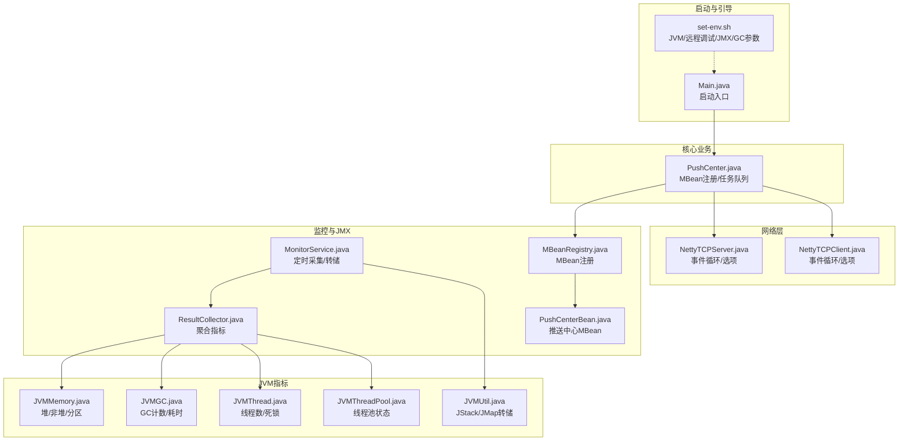
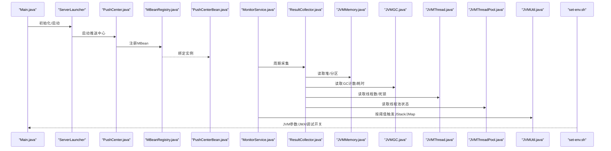
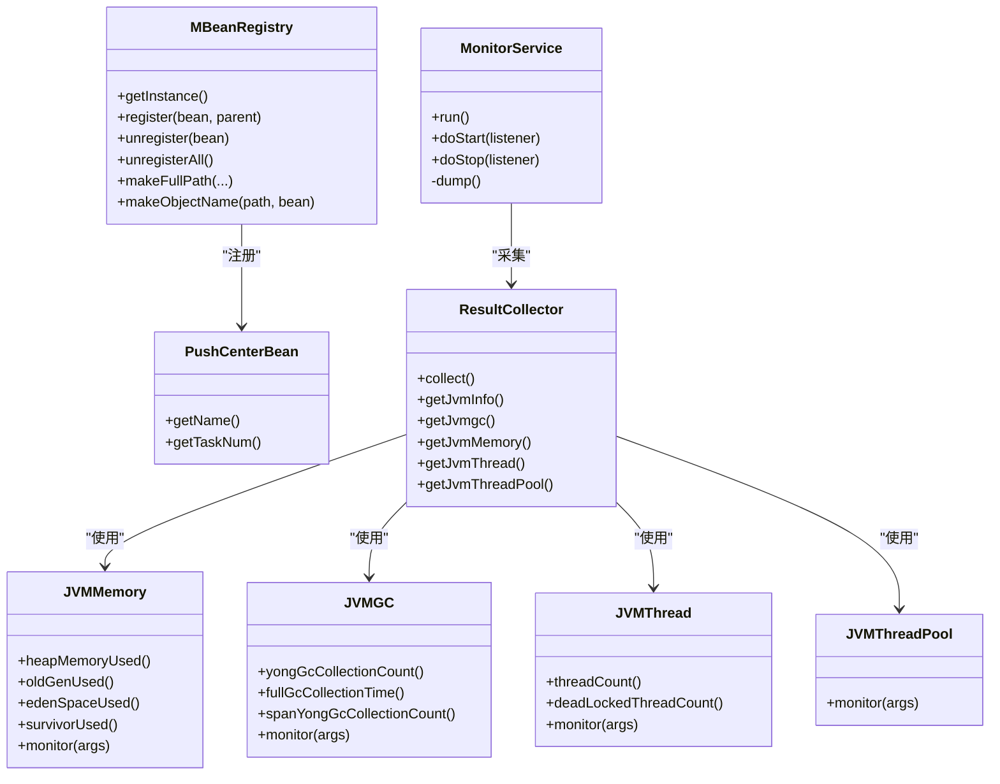
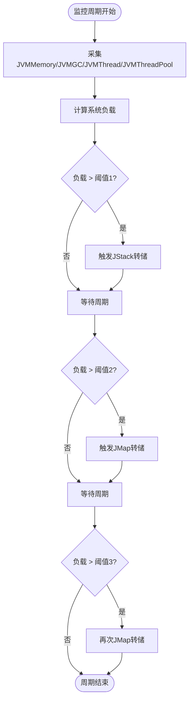
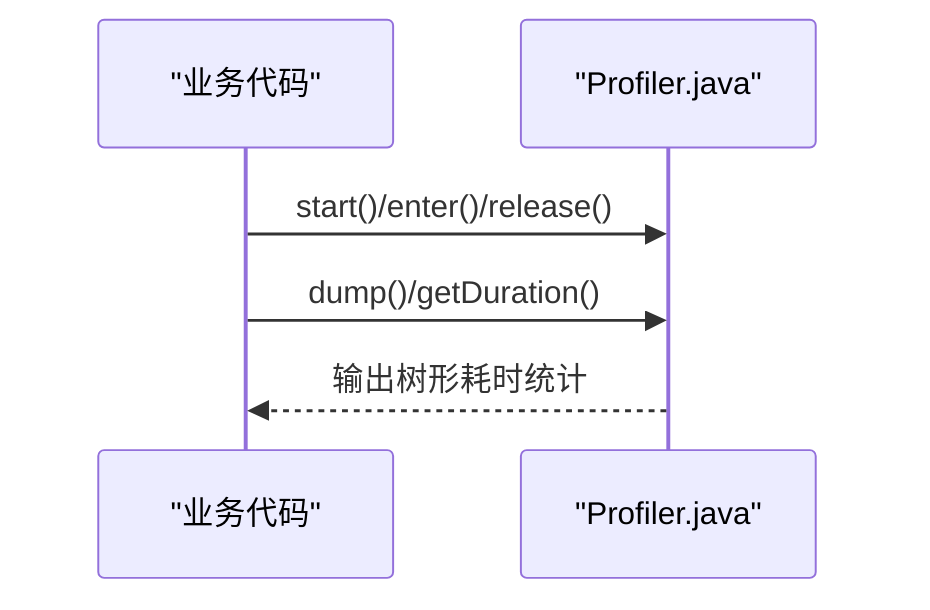
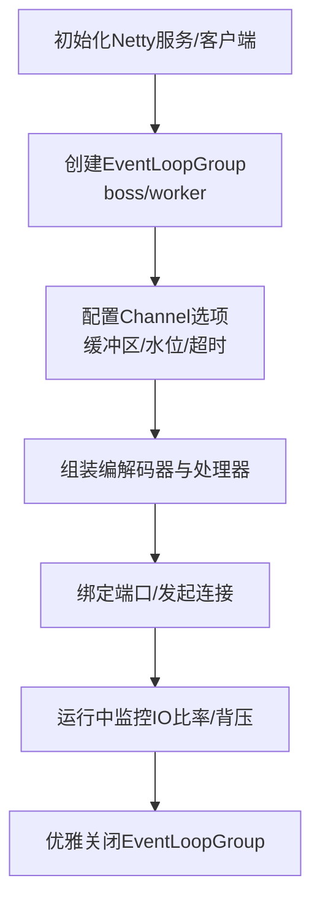
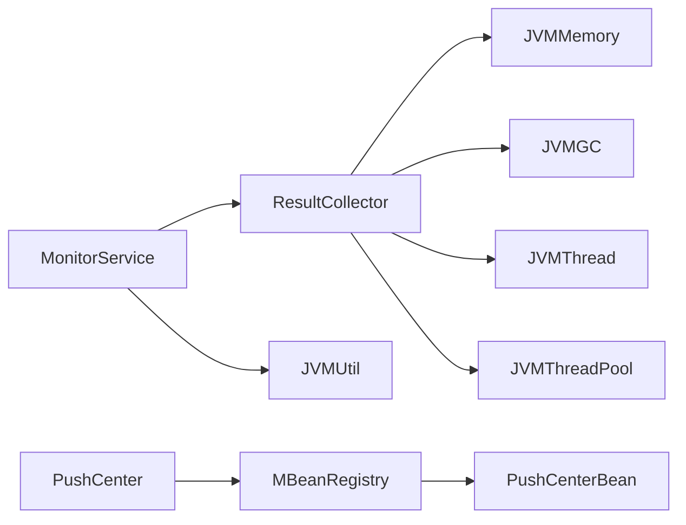

# 性能分析

<cite>
**本文引用的文件**
- [README.md](file://README.md)
- [set-env.sh](file://bin/set-env.sh)
- [Main.java](file://mpush-boot/src/main/java/com/mpush/bootstrap/Main.java)
- [MonitorService.java](file://mpush-monitor/src/main/java/com/mpush/monitor/service/MonitorService.java)
- [ResultCollector.java](file://mpush-monitor/src/main/java/com/mpush/monitor/data/ResultCollector.java)
- [MBeanRegistry.java](file://mpush-monitor/src/main/java/com/mpush/monitor/jmx/MBeanRegistry.java)
- [PushCenterBean.java](file://mpush-monitor/src/main/java/com/mpush/monitor/jmx/mxbean/PushCenterBean.java)
- [JVMMemory.java](file://mpush-monitor/src/main/java/com/mpush/monitor/quota/impl/JVMMemory.java)
- [JVMGC.java](file://mpush-monitor/src/main/java/com/mpush/monitor/quota/impl/JVMGC.java)
- [JVMThread.java](file://mpush-monitor/src/main/java/com/mpush/monitor/quota/impl/JVMThread.java)
- [JVMThreadPool.java](file://mpush-monitor/src/main/java/com/mpush/monitor/quota/impl/JVMThreadPool.java)
- [JVMUtil.java](file://mpush-tools/src/main/java/com/mpush/tools/common/JVMUtil.java)
- [Profiler.java](file://mpush-tools/src/main/java/com/mpush/tools/common/Profiler.java)
- [PushCenter.java](file://mpush-core/src/main/java/com/mpush/core/push/PushCenter.java)
- [NettyTCPServer.java](file://mpush-netty/src/main/java/com/mpush/netty/server/NettyTCPServer.java)
- [NettyTCPClient.java](file://mpush-netty/src/main/java/com/mpush/netty/client/NettyTCPClient.java)
</cite>

## 目录
1. [简介](#简介)
2. [项目结构](#项目结构)
3. [核心组件](#核心组件)
4. [架构总览](#架构总览)
5. [详细组件分析](#详细组件分析)
6. [依赖分析](#依赖分析)
7. [性能注意事项](#性能注意事项)
8. [故障排查指南](#故障排查指南)
9. [结论](#结论)
10. [附录](#附录)

## 简介
本指南面向MPush项目的性能分析与调试，聚焦于JVM性能分析工具使用、JMX监控配置与MBean注册、内存分析与GC调优、CPU热点与线程分析、网络性能观测与优化，以及性能基准与压力测试的完整流程。文档基于仓库内实际实现，结合启动脚本与监控组件，给出可落地的操作步骤与最佳实践。

## 项目结构
MPush采用多模块结构，与性能分析密切相关的模块包括：
- mpush-boot：启动入口与生命周期钩子
- mpush-monitor：JMX监控、指标采集与定时转储
- mpush-tools：JVM工具（JStack/JMap）、性能剖析器
- mpush-core：核心业务（推送中心），包含MBean注册
- mpush-netty：网络层（TCP服务器/客户端），涉及线程池与缓冲区配置

**图表来源**
- [Main.java](file://mpush-boot/src/main/java/com/mpush/bootstrap/Main.java#L24-L63)
- [set-env.sh](file://bin/set-env.sh#L1-L37)
- [MonitorService.java](file://mpush-monitor/src/main/java/com/mpush/monitor/service/MonitorService.java#L36-L146)
- [ResultCollector.java](file://mpush-monitor/src/main/java/com/mpush/monitor/data/ResultCollector.java#L41-L74)
- [MBeanRegistry.java](file://mpush-monitor/src/main/java/com/mpush/monitor/jmx/MBeanRegistry.java#L12-L177)
- [PushCenterBean.java](file://mpush-monitor/src/main/java/com/mpush/monitor/jmx/mxbean/PushCenterBean.java#L32-L48)
- [JVMMemory.java](file://mpush-monitor/src/main/java/com/mpush/monitor/quota/impl/JVMMemory.java#L32-L266)
- [JVMGC.java](file://mpush-monitor/src/main/java/com/mpush/monitor/quota/impl/JVMGC.java#L31-L159)
- [JVMThread.java](file://mpush-monitor/src/main/java/com/mpush/monitor/quota/impl/JVMThread.java#L29-L75)
- [JVMThreadPool.java](file://mpush-monitor/src/main/java/com/mpush/monitor/quota/impl/JVMThreadPool.java#L34-L57)
- [JVMUtil.java](file://mpush-tools/src/main/java/com/mpush/tools/common/JVMUtil.java#L113-L127)
- [PushCenter.java](file://mpush-core/src/main/java/com/mpush/core/push/PushCenter.java#L49-L125)
- [NettyTCPServer.java](file://mpush-netty/src/main/java/com/mpush/netty/server/NettyTCPServer.java#L53-L200)
- [NettyTCPClient.java](file://mpush-netty/src/main/java/com/mpush/netty/client/NettyTCPClient.java#L44-L161)

**章节来源**
- [README.md](file://README.md#L72-L77)
- [set-env.sh](file://bin/set-env.sh#L19-L37)

## 核心组件
- 启动与生命周期：Main负责初始化日志、启动ServerLauncher并注册优雅停机钩子，确保服务平滑退出。
- 监控服务：MonitorService周期性采集JVM与线程池指标，按阈值触发JStack/JMap转储，支持打印JSON日志。
- JMX注册：MBeanRegistry统一注册与注销MBean，PushCenterBean暴露推送中心任务数等指标。
- JVM指标采集：JVMMemory/JVMGC/JVMThread/JVMThreadPool封装标准MXBean指标。
- JVM工具：JVMUtil提供JStack/JMap转储能力；Profiler提供轻量级CPU热点与方法调用链分析工具。
- 网络层：NettyTCPServer/NettyTCPClient配置事件循环、IO比率、缓冲区与连接选项，直接影响网络吞吐与延迟。

**章节来源**
- [Main.java](file://mpush-boot/src/main/java/com/mpush/bootstrap/Main.java#L24-L63)
- [MonitorService.java](file://mpush-monitor/src/main/java/com/mpush/monitor/service/MonitorService.java#L36-L146)
- [MBeanRegistry.java](file://mpush-monitor/src/main/java/com/mpush/monitor/jmx/MBeanRegistry.java#L52-L111)
- [PushCenterBean.java](file://mpush-monitor/src/main/java/com/mpush/monitor/jmx/mxbean/PushCenterBean.java#L32-L48)
- [JVMMemory.java](file://mpush-monitor/src/main/java/com/mpush/monitor/quota/impl/JVMMemory.java#L32-L266)
- [JVMGC.java](file://mpush-monitor/src/main/java/com/mpush/monitor/quota/impl/JVMGC.java#L31-L159)
- [JVMThread.java](file://mpush-monitor/src/main/java/com/mpush/monitor/quota/impl/JVMThread.java#L29-L75)
- [JVMThreadPool.java](file://mpush-monitor/src/main/java/com/mpush/monitor/quota/impl/JVMThreadPool.java#L34-L57)
- [JVMUtil.java](file://mpush-tools/src/main/java/com/mpush/tools/common/JVMUtil.java#L113-L127)
- [Profiler.java](file://mpush-tools/src/main/java/com/mpush/tools/common/Profiler.java#L35-L530)
- [NettyTCPServer.java](file://mpush-netty/src/main/java/com/mpush/netty/server/NettyTCPServer.java#L104-L200)
- [NettyTCPClient.java](file://mpush-netty/src/main/java/com/mpush/netty/client/NettyTCPClient.java#L124-L161)

## 架构总览
下图展示从启动到监控、JMX注册、指标采集与网络层的关键交互路径。

**图表来源**
- [Main.java](file://mpush-boot/src/main/java/com/mpush/bootstrap/Main.java#L31-L38)
- [PushCenter.java](file://mpush-core/src/main/java/com/mpush/core/push/PushCenter.java#L95-L109)
- [MBeanRegistry.java](file://mpush-monitor/src/main/java/com/mpush/monitor/jmx/MBeanRegistry.java#L52-L68)
- [PushCenterBean.java](file://mpush-monitor/src/main/java/com/mpush/monitor/jmx/mxbean/PushCenterBean.java#L32-L48)
- [MonitorService.java](file://mpush-monitor/src/main/java/com/mpush/monitor/service/MonitorService.java#L65-L83)
- [ResultCollector.java](file://mpush-monitor/src/main/java/com/mpush/monitor/data/ResultCollector.java#L45-L53)
- [JVMMemory.java](file://mpush-monitor/src/main/java/com/mpush/monitor/quota/impl/JVMMemory.java#L68-L106)
- [JVMGC.java](file://mpush-monitor/src/main/java/com/mpush/monitor/quota/impl/JVMGC.java#L60-L90)
- [JVMThread.java](file://mpush-monitor/src/main/java/com/mpush/monitor/quota/impl/JVMThread.java#L37-L50)
- [JVMThreadPool.java](file://mpush-monitor/src/main/java/com/mpush/monitor/quota/impl/JVMThreadPool.java#L41-L54)
- [JVMUtil.java](file://mpush-tools/src/main/java/com/mpush/tools/common/JVMUtil.java#L113-L127)
- [set-env.sh](file://bin/set-env.sh#L19-L37)

## 详细组件分析

### JVM性能分析工具与JMX监控
- 启动参数与JMX/调试开关：通过set-env.sh设置Netty泄漏检测、JMX端口、远程调试端口、GC日志与OOM转储策略。
- MBean注册与访问：MBeanRegistry统一注册/注销MBean，PushCenterBean暴露任务数等指标，便于外部监控系统或JConsole/JVisualVM查询。
- 监控采集与转储：MonitorService周期采集JVMMemory/JVMGC/JVMThread/JVMThreadPool指标，按负载阈值触发JStack/JMap转储，支持将结果输出为JSON日志。

**图表来源**
- [MBeanRegistry.java](file://mpush-monitor/src/main/java/com/mpush/monitor/jmx/MBeanRegistry.java#L52-L111)
- [PushCenterBean.java](file://mpush-monitor/src/main/java/com/mpush/monitor/jmx/mxbean/PushCenterBean.java#L32-L48)
- [MonitorService.java](file://mpush-monitor/src/main/java/com/mpush/monitor/service/MonitorService.java#L65-L130)
- [ResultCollector.java](file://mpush-monitor/src/main/java/com/mpush/monitor/data/ResultCollector.java#L45-L73)
- [JVMMemory.java](file://mpush-monitor/src/main/java/com/mpush/monitor/quota/impl/JVMMemory.java#L68-L170)
- [JVMGC.java](file://mpush-monitor/src/main/java/com/mpush/monitor/quota/impl/JVMGC.java#L60-L90)
- [JVMThread.java](file://mpush-monitor/src/main/java/com/mpush/monitor/quota/impl/JVMThread.java#L37-L50)
- [JVMThreadPool.java](file://mpush-monitor/src/main/java/com/mpush/monitor/quota/impl/JVMThreadPool.java#L41-L54)

**章节来源**
- [set-env.sh](file://bin/set-env.sh#L19-L37)
- [MBeanRegistry.java](file://mpush-monitor/src/main/java/com/mpush/monitor/jmx/MBeanRegistry.java#L52-L111)
- [PushCenterBean.java](file://mpush-monitor/src/main/java/com/mpush/monitor/jmx/mxbean/PushCenterBean.java#L32-L48)
- [MonitorService.java](file://mpush-monitor/src/main/java/com/mpush/monitor/service/MonitorService.java#L65-L130)
- [ResultCollector.java](file://mpush-monitor/src/main/java/com/mpush/monitor/data/ResultCollector.java#L45-L73)

### 内存分析与GC调优
- 指标采集：JVMMemory提供堆/非堆/分区（Old/Eden/Survivor）使用量；JVMGC提供年轻代/老年代GC次数与耗时及增量指标。
- 转储触发：MonitorService依据系统负载阈值触发JStack/JMap转储，便于离线分析。
- 工具使用：JVMUtil.dumpJstack/dumpJmap生成快照，结合JConsole/VisualVM/JProfiler进行堆分析与泄漏定位。

**图表来源**
- [MonitorService.java](file://mpush-monitor/src/main/java/com/mpush/monitor/service/MonitorService.java#L101-L130)
- [JVMMemory.java](file://mpush-monitor/src/main/java/com/mpush/monitor/quota/impl/JVMMemory.java#L68-L106)
- [JVMGC.java](file://mpush-monitor/src/main/java/com/mpush/monitor/quota/impl/JVMGC.java#L60-L90)
- [JVMUtil.java](file://mpush-tools/src/main/java/com/mpush/tools/common/JVMUtil.java#L113-L127)

**章节来源**
- [JVMMemory.java](file://mpush-monitor/src/main/java/com/mpush/monitor/quota/impl/JVMMemory.java#L68-L170)
- [JVMGC.java](file://mpush-monitor/src/main/java/com/mpush/monitor/quota/impl/JVMGC.java#L60-L143)
- [MonitorService.java](file://mpush-monitor/src/main/java/com/mpush/monitor/service/MonitorService.java#L101-L130)
- [JVMUtil.java](file://mpush-tools/src/main/java/com/mpush/tools/common/JVMUtil.java#L113-L127)

### CPU性能分析与线程分析
- Profiler：轻量级CPU热点与方法调用链分析工具，支持嵌套计时、百分比统计与树形输出，适合在生产环境按需开启。
- 线程监控：JVMThread提供线程总数、守护线程数、总启动线程数与死锁检测，辅助定位线程风暴与死锁问题。
- 线程池监控：JVMThreadPool聚合线程池状态，便于评估任务排队与执行效率。

**图表来源**
- [Profiler.java](file://mpush-tools/src/main/java/com/mpush/tools/common/Profiler.java#L48-L176)
- [JVMThread.java](file://mpush-monitor/src/main/java/com/mpush/monitor/quota/impl/JVMThread.java#L37-L50)
- [JVMThreadPool.java](file://mpush-monitor/src/main/java/com/mpush/monitor/quota/impl/JVMThreadPool.java#L41-L54)

**章节来源**
- [Profiler.java](file://mpush-tools/src/main/java/com/mpush/tools/common/Profiler.java#L35-L530)
- [JVMThread.java](file://mpush-monitor/src/main/java/com/mpush/monitor/quota/impl/JVMThread.java#L29-L75)
- [JVMThreadPool.java](file://mpush-monitor/src/main/java/com/mpush/monitor/quota/impl/JVMThreadPool.java#L34-L57)

### 网络性能分析与优化
- 事件循环与IO比率：NettyTCPServer/NettyTCPClient在NIO/Epoll模式下配置boss/worker线程组与IO比率，影响网络事件处理能力。
- 缓冲区与水位：通过snd_buf/rcv_buf与write-buffer-water-mark配置发送/接收缓冲区与写保护水位，避免背压与内存浪费。
- 连接与选项：TCP_NODELAY、连接超时等选项影响延迟与稳定性；EventLoopGroup优雅关闭顺序保证资源释放。

**图表来源**
- [NettyTCPServer.java](file://mpush-netty/src/main/java/com/mpush/netty/server/NettyTCPServer.java#L104-L185)
- [NettyTCPClient.java](file://mpush-netty/src/main/java/com/mpush/netty/client/NettyTCPClient.java#L124-L161)

**章节来源**
- [NettyTCPServer.java](file://mpush-netty/src/main/java/com/mpush/netty/server/NettyTCPServer.java#L104-L200)
- [NettyTCPClient.java](file://mpush-netty/src/main/java/com/mpush/netty/client/NettyTCPClient.java#L124-L161)

### 性能基准与压力测试
- 测试场景设计：结合消息类型（单播/广播）、QPS目标、并发连接数、消息大小与压缩阈值进行场景拆分。
- 指标收集：关注CPU使用率、线程数、GC频率/耗时、堆内存使用、网络RTT/吞吐、任务排队时延与ACK超时。
- 结果分析：对比不同线程池规模、缓冲区配置、IO比率与GC策略下的指标变化，定位瓶颈并迭代优化。

[本节为通用指导，无需具体文件引用]

## 依赖分析
- 组件耦合：MonitorService依赖ResultCollector与JVMUtil；ResultCollector聚合JVMMemory/JVMGC/JVMThread/JVMThreadPool；PushCenter通过MBeanRegistry注册PushCenterBean。
- 外部依赖：Netty事件循环、JMX平台MBeanServer、JDK管理MXBean（Memory/GC/Thread/ThreadPool）。

**图表来源**
- [MonitorService.java](file://mpush-monitor/src/main/java/com/mpush/monitor/service/MonitorService.java#L57-L60)
- [ResultCollector.java](file://mpush-monitor/src/main/java/com/mpush/monitor/data/ResultCollector.java#L45-L53)
- [PushCenter.java](file://mpush-core/src/main/java/com/mpush/core/push/PushCenter.java#L105-L105)

**章节来源**
- [MonitorService.java](file://mpush-monitor/src/main/java/com/mpush/monitor/service/MonitorService.java#L57-L60)
- [ResultCollector.java](file://mpush-monitor/src/main/java/com/mpush/monitor/data/ResultCollector.java#L45-L53)
- [PushCenter.java](file://mpush-core/src/main/java/com/mpush/core/push/PushCenter.java#L105-L105)

## 性能注意事项
- JVM参数：通过set-env.sh设置Netty泄漏检测等级、JMX端口、远程调试端口、GC日志与OOM转储路径，确保问题可复现与可分析。
- 线程模型：合理设置Netty事件循环线程数与IO比率，避免CPU争用与上下文切换开销。
- 缓冲区与水位：根据业务消息大小与网络条件调整发送/接收缓冲区与写保护水位，防止频繁阻塞与内存膨胀。
- 监控周期：MonitorService的采集周期与阈值需结合业务峰值与告警策略进行权衡，避免过度采样影响性能。

**章节来源**
- [set-env.sh](file://bin/set-env.sh#L19-L37)
- [NettyTCPServer.java](file://mpush-netty/src/main/java/com/mpush/netty/server/NettyTCPServer.java#L187-L200)
- [MonitorService.java](file://mpush-monitor/src/main/java/com/mpush/monitor/service/MonitorService.java#L38-L46)

## 故障排查指南
- 启动与优雅停机：Main注册了关闭钩子，确保停止流程可控；若出现死循环或无法退出，检查钩子线程与非守护线程的异常处理。
- 监控日志：开启print_log后，MonitorService会输出JSON格式监控结果，便于集中化采集与分析。
- 转储策略：根据负载阈值自动触发JStack/JMap，结合set-env.sh中的GC日志与OOM转储，快速定位内存与GC问题。
- 线程与死锁：JVMThread的deadLockedThreadCount可用于快速发现死锁；Profiler可辅助定位热点方法与调用链。

**章节来源**
- [Main.java](file://mpush-boot/src/main/java/com/mpush/bootstrap/Main.java#L49-L62)
- [MonitorService.java](file://mpush-monitor/src/main/java/com/mpush/monitor/service/MonitorService.java#L69-L71)
- [JVMUtil.java](file://mpush-tools/src/main/java/com/mpush/tools/common/JVMUtil.java#L113-L127)
- [JVMThread.java](file://mpush-monitor/src/main/java/com/mpush/monitor/quota/impl/JVMThread.java#L53-L62)
- [Profiler.java](file://mpush-tools/src/main/java/com/mpush/tools/common/Profiler.java#L147-L176)

## 结论
MPush在启动、监控、JMX与网络层均提供了完善的性能分析基础。通过合理的JVM参数、线程模型与缓冲区配置，配合MonitorService的周期采集与阈值转储，能够有效定位内存、GC、CPU与网络层面的性能瓶颈。建议在生产环境中按需启用Profiler与JMX监控，并结合外部工具（JProfiler/VisualVM/JConsole）进行深入分析与调优。

## 附录
- 启动与JVM参数参考：README中关于启动命令与set-env.sh的说明。
- 配置项参考：mpush.conf与reference.conf中的网络、线程池、监控等配置项。

**章节来源**
- [README.md](file://README.md#L72-L77)
- [set-env.sh](file://bin/set-env.sh#L19-L37)