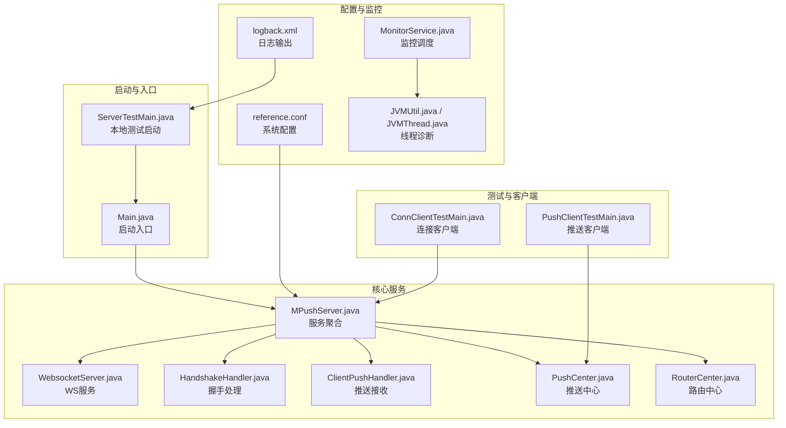
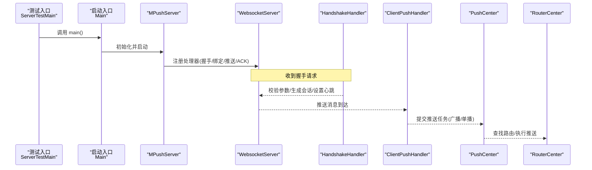
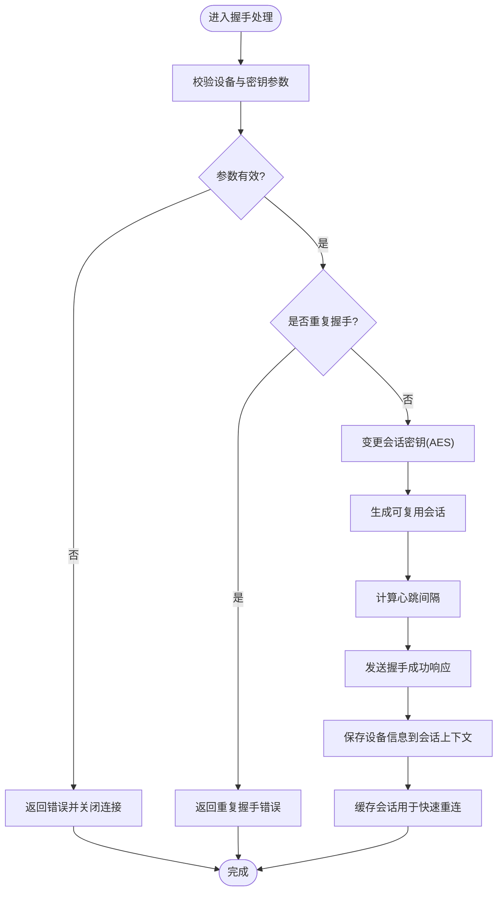
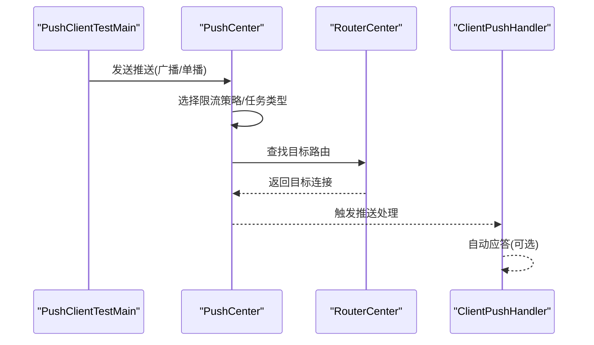
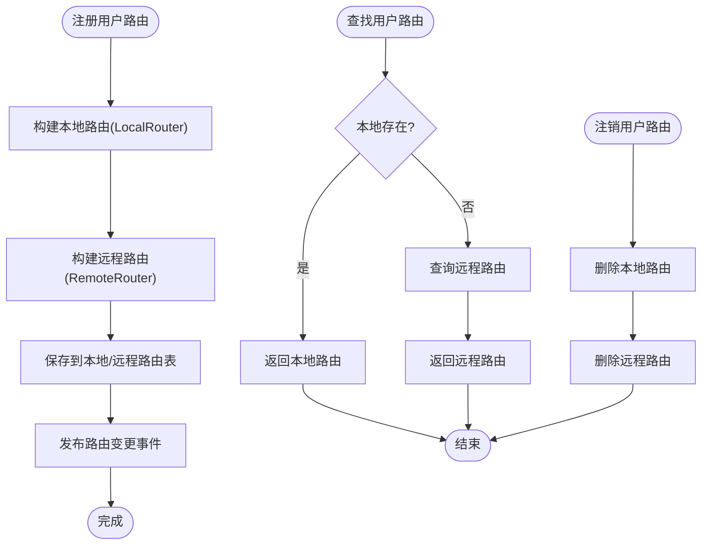
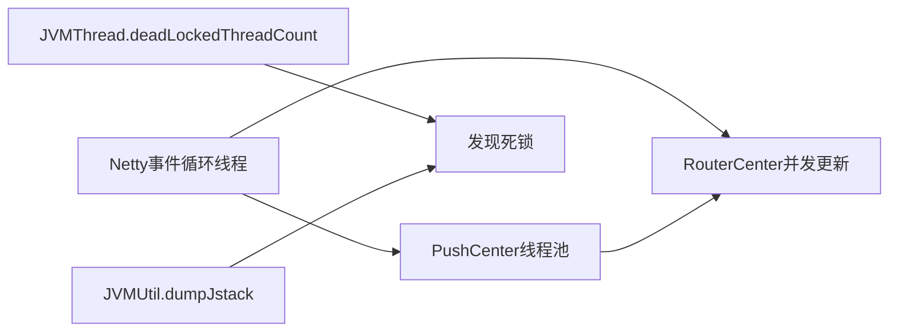
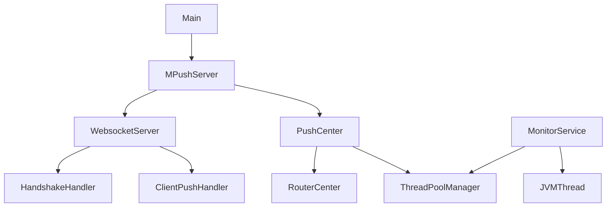

# 断点调试

<cite>
**本文引用的文件**
- [README.md](file://README.md)
- [Main.java](file://mpush-boot/src/main/java/com/mpush/bootstrap/Main.java)
- [MPushServer.java](file://mpush-core/src/main/java/com/mpush/core/MPushServer.java)
- [reference.conf](file://conf/reference.conf)
- [HandshakeHandler.java](file://mpush-core/src/main/java/com/mpush/core/handler/HandshakeHandler.java)
- [RouterCenter.java](file://mpush-core/src/main/java/com/mpush/core/router/RouterCenter.java)
- [PushCenter.java](file://mpush-core/src/main/java/com/mpush/core/push/PushCenter.java)
- [ServerTestMain.java](file://mpush-test/src/main/java/com/mpush/test/sever/ServerTestMain.java)
- [ConnClientTestMain.java](file://mpush-test/src/main/java/com/mpush/test/client/ConnClientTestMain.java)
- [PushClientTestMain.java](file://mpush-test/src/main/java/com/mpush/test/push/PushClientTestMain.java)
- [logback.xml](file://mpush-test/src/main/resources/logback.xml)
- [JVMUtil.java](file://mpush-tools/src/main/java/com/mpush/tools/common/JVMUtil.java)
- [JVMThread.java](file://mpush-monitor/src/main/java/com/mpush/monitor/quota/impl/JVMThread.java)
- [MonitorService.java](file://mpush-monitor/src/main/java/com/mpush/monitor/service/MonitorService.java)
- [WebsocketServer.java](file://mpush-core/src/main/java/com/mpush/core/server/WebsocketServer.java)
- [HandshakeMessage.java](file://mpush-common/src/main/java/com/mpush/common/message/HandshakeMessage.java)
- [ClientPushHandler.java](file://mpush-core/src/main/java/com/mpush/core/handler/ClientPushHandler.java)
- [set-env.sh](file://bin/set-env.sh)
</cite>

## 目录
1. [简介](#简介)
2. [项目结构](#项目结构)
3. [核心组件](#核心组件)
4. [架构总览](#架构总览)
5. [详细组件分析](#详细组件分析)
6. [依赖分析](#依赖分析)
7. [性能与调试特性](#性能与调试特性)
8. [故障排查指南](#故障排查指南)
9. [结论](#结论)
10. [附录](#附录)

## 简介
本指南面向使用 MPush 的开发者，系统讲解如何在 IDE 中进行断点调试，覆盖条件断点、表达式断点、异常断点；变量监视与观察点；多线程调试（线程切换、线程同步、死锁检测）；以及远程调试（JVM 参数、远程连接、断点管理）。同时结合 MPush 的握手、消息推送、路由管理等关键流程，给出断点调试实战建议与常见问题的解决方案。

## 项目结构
MPush 采用多模块分层设计，核心模块包括核心服务器、网络编解码、消息与推送、路由、监控、工具与测试等。调试时建议从启动入口、核心处理器、推送中心、路由中心入手，配合测试模块模拟客户端与推送场景。

图表来源
- [Main.java](file://mpush-boot/src/main/java/com/mpush/bootstrap/Main.java#L31-L38)
- [MPushServer.java](file://mpush-core/src/main/java/com/mpush/core/MPushServer.java#L71-L96)
- [WebsocketServer.java](file://mpush-core/src/main/java/com/mpush/core/server/WebsocketServer.java#L69-L103)
- [HandshakeHandler.java](file://mpush-core/src/main/java/com/mpush/core/handler/HandshakeHandler.java#L61-L128)
- [ClientPushHandler.java](file://mpush-core/src/main/java/com/mpush/core/handler/ClientPushHandler.java#L47-L55)
- [PushCenter.java](file://mpush-core/src/main/java/com/mpush/core/push/PushCenter.java#L73-L82)
- [RouterCenter.java](file://mpush-core/src/main/java/com/mpush/core/router/RouterCenter.java#L76-L104)
- [reference.conf](file://conf/reference.conf#L103-L121)
- [logback.xml](file://mpush-test/src/main/resources/logback.xml#L32-L72)
- [MonitorService.java](file://mpush-monitor/src/main/java/com/mpush/monitor/service/MonitorService.java#L65-L78)
- [JVMUtil.java](file://mpush-tools/src/main/java/com/mpush/tools/common/JVMUtil.java#L113-L127)
- [JVMThread.java](file://mpush-monitor/src/main/java/com/mpush/monitor/quota/impl/JVMThread.java#L53-L63)
- [ServerTestMain.java](file://mpush-test/src/main/java/com/mpush/test/sever/ServerTestMain.java#L44-L48)
- [ConnClientTestMain.java](file://mpush-test/src/main/java/com/mpush/test/client/ConnClientTestMain.java#L71-L116)
- [PushClientTestMain.java](file://mpush-test/src/main/java/com/mpush/test/push/PushClientTestMain.java#L44-L75)

章节来源
- [README.md](file://README.md#L22-L31)
- [Main.java](file://mpush-boot/src/main/java/com/mpush/bootstrap/Main.java#L31-L38)
- [reference.conf](file://conf/reference.conf#L103-L121)

## 核心组件
- 启动入口与生命周期
  - 启动入口 Main：初始化日志、创建并启动 ServerLauncher，注册关闭钩子。
  - 测试入口 ServerTestMain：设置 Netty 泄漏检测级别，调用 Main 启动。
- 核心服务聚合 MPushServer：聚合连接、WebSocket、网关、管理、HTTP 客户端、推送中心、路由中心、会话管理、监控服务等。
- 处理器链路
  - 握手处理器 HandshakeHandler：完成设备信息校验、会话密钥变更、心跳计算、会话缓存与响应。
  - 推送处理器 ClientPushHandler：接收推送消息并自动应答。
  - 路由中心 RouterCenter：注册/注销/查找用户路由，发布路由变更事件。
  - 推送中心 PushCenter：根据广播/单播选择不同任务与限流策略，提交到线程池执行。
- 监控与诊断
  - MonitorService：周期采集监控指标、可选打印日志与转储堆栈。
  - JVMUtil/JVMThread：线程堆栈转储与死锁检测能力。

章节来源
- [Main.java](file://mpush-boot/src/main/java/com/mpush/bootstrap/Main.java#L31-L62)
- [ServerTestMain.java](file://mpush-test/src/main/java/com/mpush/test/sever/ServerTestMain.java#L44-L48)
- [MPushServer.java](file://mpush-core/src/main/java/com/mpush/core/MPushServer.java#L71-L181)
- [HandshakeHandler.java](file://mpush-core/src/main/java/com/mpush/core/handler/HandshakeHandler.java#L61-L159)
- [ClientPushHandler.java](file://mpush-core/src/main/java/com/mpush/core/handler/ClientPushHandler.java#L47-L55)
- [RouterCenter.java](file://mpush-core/src/main/java/com/mpush/core/router/RouterCenter.java#L76-L133)
- [PushCenter.java](file://mpush-core/src/main/java/com/mpush/core/push/PushCenter.java#L73-L109)
- [MonitorService.java](file://mpush-monitor/src/main/java/com/mpush/monitor/service/MonitorService.java#L65-L78)
- [JVMUtil.java](file://mpush-tools/src/main/java/com/mpush/tools/common/JVMUtil.java#L113-L127)
- [JVMThread.java](file://mpush-monitor/src/main/java/com/mpush/monitor/quota/impl/JVMThread.java#L53-L63)

## 架构总览
MPush 通过 Netty 提供 TCP/UDP/WebSocket 等多种协议接入，握手完成后建立会话，消息经由处理器链路进入推送中心，再由路由中心定位目标节点并执行推送。监控服务周期性采集指标，必要时触发堆栈转储辅助定位问题。

图表来源
- [ServerTestMain.java](file://mpush-test/src/main/java/com/mpush/test/sever/ServerTestMain.java#L44-L48)
- [Main.java](file://mpush-boot/src/main/java/com/mpush/bootstrap/Main.java#L31-L38)
- [MPushServer.java](file://mpush-core/src/main/java/com/mpush/core/MPushServer.java#L71-L96)
- [WebsocketServer.java](file://mpush-core/src/main/java/com/mpush/core/server/WebsocketServer.java#L69-L75)
- [HandshakeHandler.java](file://mpush-core/src/main/java/com/mpush/core/handler/HandshakeHandler.java#L61-L128)
- [ClientPushHandler.java](file://mpush-core/src/main/java/com/mpush/core/handler/ClientPushHandler.java#L47-L55)
- [PushCenter.java](file://mpush-core/src/main/java/com/mpush/core/push/PushCenter.java#L73-L82)
- [RouterCenter.java](file://mpush-core/src/main/java/com/mpush/core/router/RouterCenter.java#L112-L117)

## 详细组件分析

### 握手处理流程（断点调试要点）
- 关键断点位置
  - 握手参数校验处：检查设备标识、密钥长度等。
  - 重复握手判断：避免同一设备多次握手。
  - 会话密钥变更：从 RSA 到 AES 的密钥切换。
  - 心跳计算与会话缓存：生成 ReusableSession 并写入缓存。
  - 成功/失败响应发送：确认握手结果。
- 变量监视
  - 局部变量：设备标识、密钥数组、心跳区间、会话 ID。
  - 全局/上下文：SessionContext、ReusableSessionManager。
- 异常断点
  - 参数非法、重复握手、发送失败等错误路径。
- 多线程关注
  - 握手发生在连接通道的事件循环中，注意与业务线程隔离。
- 远程调试
  - 在 set-env.sh 中开启远程调试端口，连接后在上述断点处验证握手状态。

图表来源
- [HandshakeHandler.java](file://mpush-core/src/main/java/com/mpush/core/handler/HandshakeHandler.java#L75-L127)
- [HandshakeMessage.java](file://mpush-common/src/main/java/com/mpush/common/message/HandshakeMessage.java#L58-L80)

章节来源
- [HandshakeHandler.java](file://mpush-core/src/main/java/com/mpush/core/handler/HandshakeHandler.java#L61-L159)
- [HandshakeMessage.java](file://mpush-common/src/main/java/com/mpush/common/message/HandshakeMessage.java#L42-L84)
- [set-env.sh](file://bin/set-env.sh)

### 消息推送流程（断点调试要点）
- 关键断点位置
  - PushCenter.push：区分广播与单播，选择限流策略与任务类型。
  - PushCenter.addTask/delayTask：提交到线程池或事件循环。
  - RouterCenter.register/lookup：注册用户路由与查找目标连接。
  - ClientPushHandler.handle：接收推送并自动应答。
- 变量监视
  - 局部变量：消息体、任务 ID、限流阈值、延迟时间。
  - 上下文：推送上下文、路由表、连接集合。
- 多线程关注
  - PushCenter 使用自定义线程池或 Netty 事件循环，注意任务排队与执行顺序。
  - RouterCenter 的注册/查找涉及并发更新，需关注竞态。
- 远程调试
  - 在 set-env.sh 开启远程调试，连接后在推送路径断点验证消息流转。

图表来源
- [PushClientTestMain.java](file://mpush-test/src/main/java/com/mpush/test/push/PushClientTestMain.java#L49-L74)
- [PushCenter.java](file://mpush-core/src/main/java/com/mpush/core/push/PushCenter.java#L73-L82)
- [RouterCenter.java](file://mpush-core/src/main/java/com/mpush/core/router/RouterCenter.java#L112-L117)
- [ClientPushHandler.java](file://mpush-core/src/main/java/com/mpush/core/handler/ClientPushHandler.java#L47-L55)

章节来源
- [PushCenter.java](file://mpush-core/src/main/java/com/mpush/core/push/PushCenter.java#L73-L109)
- [RouterCenter.java](file://mpush-core/src/main/java/com/mpush/core/router/RouterCenter.java#L76-L133)
- [ClientPushHandler.java](file://mpush-core/src/main/java/com/mpush/core/handler/ClientPushHandler.java#L47-L55)
- [PushClientTestMain.java](file://mpush-test/src/main/java/com/mpush/test/push/PushClientTestMain.java#L44-L75)

### 路由管理流程（断点调试要点）
- 关键断点位置
  - RouterCenter.register：注册本地/远程路由，发布路由变更事件。
  - RouterCenter.lookup：优先本地路由，回退远程路由。
  - RouterCenter.unRegister：注销用户路由。
- 变量监视
  - 局部变量：用户 ID、连接对象、客户端类型。
  - 全局状态：本地/远程路由表、用户事件消费者。
- 多线程关注
  - 路由注册/查找/注销可能并发发生，注意线程安全与事件一致性。
- 远程调试
  - 在 set-env.sh 开启远程调试，连接后在路由变更事件断点验证一致性。

图表来源
- [RouterCenter.java](file://mpush-core/src/main/java/com/mpush/core/router/RouterCenter.java#L76-L133)

章节来源
- [RouterCenter.java](file://mpush-core/src/main/java/com/mpush/core/router/RouterCenter.java#L49-L133)

### 多线程调试与死锁检测
- 线程切换
  - Netty 事件循环线程与自定义线程池线程混用，断点时注意切换上下文。
- 线程同步
  - 路由表与会话管理涉及并发更新，断点时关注锁竞争与可见性。
- 死锁检测
  - 使用 JVMUtil.dumpJstack 或 MonitorService 周期转储，结合 JVMThread.deadLockedThreadCount 辅助定位。

图表来源
- [PushCenter.java](file://mpush-core/src/main/java/com/mpush/core/push/PushCenter.java#L99-L103)
- [JVMThread.java](file://mpush-monitor/src/main/java/com/mpush/monitor/quota/impl/JVMThread.java#L53-L63)
- [JVMUtil.java](file://mpush-tools/src/main/java/com/mpush/tools/common/JVMUtil.java#L113-L127)
- [MonitorService.java](file://mpush-monitor/src/main/java/com/mpush/monitor/service/MonitorService.java#L65-L78)

章节来源
- [JVMThread.java](file://mpush-monitor/src/main/java/com/mpush/monitor/quota/impl/JVMThread.java#L53-L63)
- [JVMUtil.java](file://mpush-tools/src/main/java/com/mpush/tools/common/JVMUtil.java#L113-L127)
- [MonitorService.java](file://mpush-monitor/src/main/java/com/mpush/monitor/service/MonitorService.java#L65-L78)

## 依赖分析
- 启动入口依赖 ServerLauncher 与 MPushServer，后者聚合各子服务。
- WebsocketServer 注册消息处理器，握手与推送处理分别由 HandshakeHandler 与 ClientPushHandler 实现。
- PushCenter 依赖 RouterCenter 与线程池管理，RouterCenter 依赖本地/远程路由管理器与事件总线。
- 监控服务依赖线程池管理器与 JVM MXBean，提供周期性转储能力。

图表来源
- [Main.java](file://mpush-boot/src/main/java/com/mpush/bootstrap/Main.java#L31-L38)
- [MPushServer.java](file://mpush-core/src/main/java/com/mpush/core/MPushServer.java#L71-L181)
- [WebsocketServer.java](file://mpush-core/src/main/java/com/mpush/core/server/WebsocketServer.java#L69-L103)
- [HandshakeHandler.java](file://mpush-core/src/main/java/com/mpush/core/handler/HandshakeHandler.java#L61-L159)
- [ClientPushHandler.java](file://mpush-core/src/main/java/com/mpush/core/handler/ClientPushHandler.java#L47-L55)
- [PushCenter.java](file://mpush-core/src/main/java/com/mpush/core/push/PushCenter.java#L95-L109)
- [RouterCenter.java](file://mpush-core/src/main/java/com/mpush/core/router/RouterCenter.java#L54-L67)
- [MonitorService.java](file://mpush-monitor/src/main/java/com/mpush/monitor/service/MonitorService.java#L57-L60)
- [JVMThread.java](file://mpush-monitor/src/main/java/com/mpush/monitor/quota/impl/JVMThread.java#L53-L63)

章节来源
- [Main.java](file://mpush-boot/src/main/java/com/mpush/bootstrap/Main.java#L31-L38)
- [MPushServer.java](file://mpush-core/src/main/java/com/mpush/core/MPushServer.java#L71-L181)
- [WebsocketServer.java](file://mpush-core/src/main/java/com/mpush/core/server/WebsocketServer.java#L69-L103)
- [PushCenter.java](file://mpush-core/src/main/java/com/mpush/core/push/PushCenter.java#L95-L109)
- [RouterCenter.java](file://mpush-core/src/main/java/com/mpush/core/router/RouterCenter.java#L54-L67)
- [MonitorService.java](file://mpush-monitor/src/main/java/com/mpush/monitor/service/MonitorService.java#L57-L60)

## 性能与调试特性
- 日志输出
  - 测试模块使用 logback.xml 将不同模块日志输出到控制台，便于断点时观察。
- 监控与转储
  - MonitorService 周期采集并可选打印日志与转储堆栈，JVMUtil 提供 jstack 转储能力。
- 配置项
  - reference.conf 中包含线程池、网络、监控等配置，可按需调整以影响调试体验。

章节来源
- [logback.xml](file://mpush-test/src/main/resources/logback.xml#L32-L72)
- [MonitorService.java](file://mpush-monitor/src/main/java/com/mpush/monitor/service/MonitorService.java#L65-L78)
- [JVMUtil.java](file://mpush-tools/src/main/java/com/mpush/tools/common/JVMUtil.java#L113-L127)
- [reference.conf](file://conf/reference.conf#L182-L205)

## 故障排查指南
- 握手失败
  - 断点于参数校验与重复握手判断处，检查设备标识与密钥长度。
  - 关注握手成功后的会话密钥切换与缓存写入。
- 推送未达
  - 断点于 PushCenter 的任务提交与 RouterCenter 的路由查找，确认广播/单播分支与限流策略。
  - 检查 ClientPushHandler 是否收到推送并自动应答。
- 路由异常
  - 断点于 RouterCenter 的注册/查找/注销，关注事件总线与远程路由回退逻辑。
- 死锁与高线程占用
  - 使用 JVMThread.deadLockedThreadCount 与 JVMUtil.dumpJstack 定位阻塞点。
  - 结合 MonitorService 的周期转储，观察线程数与负载均值。

章节来源
- [HandshakeHandler.java](file://mpush-core/src/main/java/com/mpush/core/handler/HandshakeHandler.java#L75-L127)
- [PushCenter.java](file://mpush-core/src/main/java/com/mpush/core/push/PushCenter.java#L73-L109)
- [RouterCenter.java](file://mpush-core/src/main/java/com/mpush/core/router/RouterCenter.java#L76-L133)
- [ClientPushHandler.java](file://mpush-core/src/main/java/com/mpush/core/handler/ClientPushHandler.java#L47-L55)
- [JVMThread.java](file://mpush-monitor/src/main/java/com/mpush/monitor/quota/impl/JVMThread.java#L53-L63)
- [JVMUtil.java](file://mpush-tools/src/main/java/com/mpush/tools/common/JVMUtil.java#L113-L127)
- [MonitorService.java](file://mpush-monitor/src/main/java/com/mpush/monitor/service/MonitorService.java#L65-L78)

## 结论
通过在握手、推送、路由等关键路径设置断点，并结合变量监视、异常断点与远程调试，能够高效定位 MPush 的行为问题。配合日志输出、监控转储与死锁检测工具，可进一步提升复杂场景下的调试效率与稳定性。

## 附录
- IDE 断点设置建议
  - 条件断点：基于设备标识、用户 ID、消息类型等条件触发。
  - 表达式断点：监视会话上下文、路由表容量、任务队列长度等。
  - 异常断点：在握手与推送处理的异常路径上启用。
- 变量监视技巧
  - 局部变量：参数校验、密钥数组、心跳区间、会话 ID。
  - 全局变量：会话管理器、路由中心、推送中心、线程池管理器。
  - 静态变量：配置读取器、事件总线、JVM MXBean。
- 多线程调试技巧
  - 线程切换：关注 Netty 事件循环与自定义线程池的上下文切换。
  - 线程同步：在并发更新点设置断点，观察锁竞争与可见性。
  - 死锁检测：定期触发 jstack 转储，结合 deadLockedThreadCount。
- 远程调试配置
  - 在 set-env.sh 中设置 JVM 远程调试参数，启动服务后在 IDE 中连接。
  - 使用 ServerTestMain 作为本地启动入口，便于断点与日志联调。

章节来源
- [set-env.sh](file://bin/set-env.sh)
- [ServerTestMain.java](file://mpush-test/src/main/java/com/mpush/test/sever/ServerTestMain.java#L44-L48)
- [logback.xml](file://mpush-test/src/main/resources/logback.xml#L32-L72)
- [JVMUtil.java](file://mpush-tools/src/main/java/com/mpush/tools/common/JVMUtil.java#L113-L127)
- [JVMThread.java](file://mpush-monitor/src/main/java/com/mpush/monitor/quota/impl/JVMThread.java#L53-L63)
- [MonitorService.java](file://mpush-monitor/src/main/java/com/mpush/monitor/service/MonitorService.java#L65-L78)