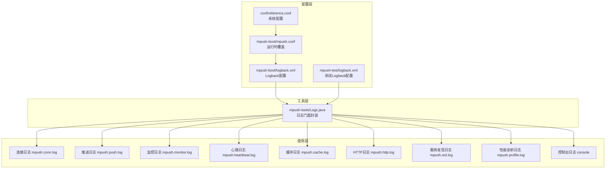
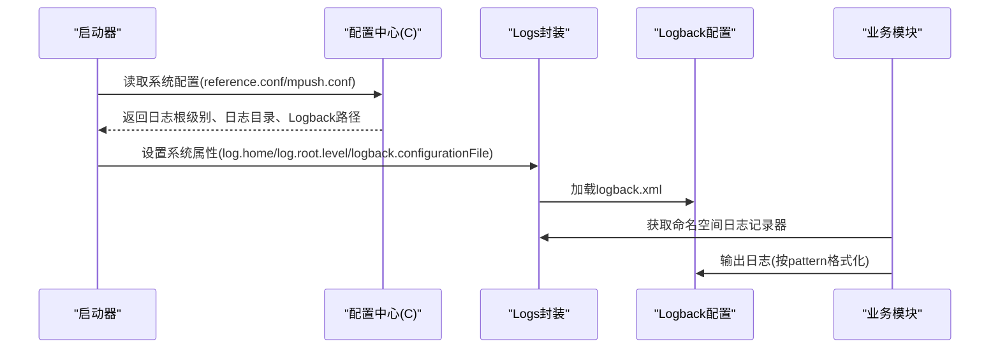

# 日志调试

<cite>
**本文引用的文件**
- [mpush-boot/src/main/resources/logback.xml](file://mpush-boot/src/main/resources/logback.xml)
- [mpush-test/src/main/resources/logback.xml](file://mpush-test/src/main/resources/logback.xml)
- [conf/reference.conf](file://conf/reference.conf)
- [mpush-boot/src/main/resources/mpush.conf](file://mpush-boot/src/main/resources/mpush.conf)
- [mpush-tools/src/main/java/com/mpush/tools/log/Logs.java](file://mpush-tools/src/main/java/com/mpush/tools/log/Logs.java)
- [mpush-cache/src/main/java/com/mpush/cache/redis/manager/RedisManager.java](file://mpush-cache/src/main/java/com/mpush/cache/redis/manager/RedisManager.java)
- [mpush-client/src/main/java/com/mpush/client/gateway/handler/GatewayClientChannelHandler.java](file://mpush-client/src/main/java/com/mpush/client/gateway/handler/GatewayClientChannelHandler.java)
- [mpush-core/src/main/java/com/mpush/core/push/PushCenter.java](file://mpush-core/src/main/java/com/mpush/core/push/PushCenter.java)
- [mpush-monitor/src/main/java/com/mpush/monitor/service/MonitorService.java](file://mpush-monitor/src/main/java/com/mpush/monitor/service/MonitorService.java)
</cite>

## 目录
1. [简介](#简介)
2. [项目结构](#项目结构)
3. [核心组件](#核心组件)
4. [架构总览](#架构总览)
5. [详细组件分析](#详细组件分析)
6. [依赖分析](#依赖分析)
7. [性能考虑](#性能考虑)
8. [故障排查指南](#故障排查指南)
9. [结论](#结论)
10. [附录](#附录)

## 简介
本指南面向MPush的日志调试与运维，聚焦于Logback配置、日志级别策略、格式化输出、MPush特有日志模块（连接、推送、监控、心跳、缓存、HTTP、服务发现、性能剖析）以及日志聚合与管理实践。通过系统化的配置与使用方式，帮助开发者在开发、测试与生产环境中高效定位问题并优化性能。

## 项目结构
MPush的日志体系由三部分构成：
- 配置层：系统级配置文件定义日志根级别、日志目录与Logback配置文件路径；Logback XML定义各类Appender与Logger。
- 工具层：统一日志门面接口封装，负责初始化系统属性与获取命名空间日志记录器。
- 使用层：各业务模块按命名空间记录日志，形成连接、推送、监控、心跳、缓存、HTTP、服务发现、性能剖析等专用日志通道。

图表来源
- [conf/reference.conf](file://conf/reference.conf#L17-L21)
- [mpush-boot/src/main/resources/mpush.conf](file://mpush-boot/src/main/resources/mpush.conf#L1-L16)
- [mpush-boot/src/main/resources/logback.xml](file://mpush-boot/src/main/resources/logback.xml#L1-L231)
- [mpush-test/src/main/resources/logback.xml](file://mpush-test/src/main/resources/logback.xml#L1-L194)
- [mpush-tools/src/main/java/com/mpush/tools/log/Logs.java](file://mpush-tools/src/main/java/com/mpush/tools/log/Logs.java#L36-L64)

章节来源
- [conf/reference.conf](file://conf/reference.conf#L17-L21)
- [mpush-boot/src/main/resources/mpush.conf](file://mpush-boot/src/main/resources/mpush.conf#L1-L16)
- [mpush-boot/src/main/resources/logback.xml](file://mpush-boot/src/main/resources/logback.xml#L1-L231)
- [mpush-test/src/main/resources/logback.xml](file://mpush-test/src/main/resources/logback.xml#L1-L194)
- [mpush-tools/src/main/java/com/mpush/tools/log/Logs.java](file://mpush-tools/src/main/java/com/mpush/tools/log/Logs.java#L36-L64)

## 核心组件
- Logback配置文件
  - 生产环境：mpush-boot/logback.xml，定义root级别与多个专用Appender（应用、信息、调试、监控、连接、推送、心跳、缓存、HTTP、服务发现、性能剖析），并为每个专用模块配置独立Logger。
  - 测试环境：mpush-test/logback.xml，提供更丰富的彩色控制台输出与阈值过滤，便于本地调试。
- 日志门面封装
  - mpush-tools/Logs.java：在启动时设置log.home、log.root.level、logback.configurationFile等系统属性，并初始化各命名空间日志记录器，确保日志配置生效。
- 日志级别与格式
  - 根据reference.conf与mpush.conf，日志根级别由系统配置决定；Logback pattern定义了时间戳、线程、级别、Logger名称、消息等字段。
- 专用日志模块
  - 连接日志：mpush.conn.log
  - 推送日志：mpush.push.log
  - 监控日志：mpush.monitor.log
  - 心跳日志：mpush.heartbeat.log
  - 缓存日志：mpush.cache.log
  - HTTP日志：mpush.http.log
  - 服务发现日志：mpush.srd.log
  - 性能剖析日志：mpush.profile.log
  - 控制台日志：console

章节来源
- [mpush-boot/src/main/resources/logback.xml](file://mpush-boot/src/main/resources/logback.xml#L1-L231)
- [mpush-test/src/main/resources/logback.xml](file://mpush-test/src/main/resources/logback.xml#L1-L194)
- [mpush-tools/src/main/java/com/mpush/tools/log/Logs.java](file://mpush-tools/src/main/java/com/mpush/tools/log/Logs.java#L36-L64)
- [conf/reference.conf](file://conf/reference.conf#L17-L21)
- [mpush-boot/src/main/resources/mpush.conf](file://mpush-boot/src/main/resources/mpush.conf#L1-L16)

## 架构总览
下面的序列图展示了日志初始化与输出的关键流程：系统启动时加载配置，设置Logback配置文件路径，随后各模块通过Logs接口获取命名空间日志记录器并输出。

图表来源
- [conf/reference.conf](file://conf/reference.conf#L17-L21)
- [mpush-boot/src/main/resources/mpush.conf](file://mpush-boot/src/main/resources/mpush.conf#L1-L16)
- [mpush-tools/src/main/java/com/mpush/tools/log/Logs.java](file://mpush-tools/src/main/java/com/mpush/tools/log/Logs.java#L36-L45)
- [mpush-boot/src/main/resources/logback.xml](file://mpush-boot/src/main/resources/logback.xml#L1-L231)

## 详细组件分析

### Logback配置文件结构与选项
- 属性与根级别
  - 通过系统属性控制日志根级别与输出目录，避免硬编码。
- Appender类型
  - 文件滚动：RollingFileAppender + TimeBasedRollingPolicy，按日期滚动并限制历史数量。
  - 控制台：ConsoleAppender，配合ThresholdFilter或LevelFilter实现按级别筛选。
- 过滤器
  - LevelFilter：精确匹配级别（如仅输出info或debug）。
  - ThresholdFilter：阈值过滤（如输出>=DEBUG）。
- Encoder与Pattern
  - 支持时间戳、线程、级别、Logger名称、消息等字段，便于检索与聚合。
- Logger与命名空间
  - 为mpush.conn.log、mpush.push.log、mpush.monitor.log、mpush.heartbeat.log、mpush.cache.log、mpush.http.log、mpush.srd.log、mpush.profile.log分别配置独立Logger，避免相互干扰。
  - root Logger同时绑定多个Appender，满足多维度输出需求。

章节来源
- [mpush-boot/src/main/resources/logback.xml](file://mpush-boot/src/main/resources/logback.xml#L1-L231)
- [mpush-test/src/main/resources/logback.xml](file://mpush-test/src/main/resources/logback.xml#L1-L194)

### 日志级别与调试价值
- TRACE：极细粒度跟踪，适合深入分析协议细节或异常链路，生产中谨慎使用。
- DEBUG：常规调试，输出连接建立/断开、消息收发、推送任务调度等关键节点。
- INFO：运行状态与关键流程确认，如服务启动/停止、推送中心状态。
- WARN：潜在问题但未失败的场景，如超时响应、限流告警。
- ERROR：错误与异常，需立即关注与修复。
- 建议策略
  - 开发/测试：DEBUG/INFO为主，必要时临时提升至TRACE。
  - 生产：INFO/WARN为主，ERROR必查；仅在定位复杂问题时临时开启DEBUG。

章节来源
- [mpush-boot/src/main/resources/logback.xml](file://mpush-boot/src/main/resources/logback.xml#L182-L187)
- [mpush-test/src/main/resources/logback.xml](file://mpush-test/src/main/resources/logback.xml#L7-L9)

### 日志输出格式定制
- 时间戳格式：支持yyyy-MM-dd HH:mm:ss.SSS或yyyy-MM-dd等，便于日志聚合与排序。
- 线程信息：包含线程名/线程ID，便于并发场景定位。
- 类名信息：可截断Logger名称长度，平衡可读性与字段宽度。
- 消息体：建议保留关键上下文（如连接ID、用户ID、消息ID、操作类型）。

章节来源
- [mpush-boot/src/main/resources/logback.xml](file://mpush-boot/src/main/resources/logback.xml#L17-L18)
- [mpush-test/src/main/resources/logback.xml](file://mpush-test/src/main/resources/logback.xml#L10-L11)

### MPush特有日志模块与调试应用
- 连接日志（mpush.conn.log）
  - 记录连接建立/断开、异常捕获、消息接收等，便于排查网络与握手问题。
  - 示例：GatewayClientChannelHandler中对连接状态与异常的记录。
- 推送日志（mpush.push.log）
  - 记录推送任务创建、执行、拒绝、超时等，辅助定位推送瓶颈与失败原因。
  - 示例：PushCenter中对任务添加与延迟任务的记录。
- 监控日志（mpush.monitor.log）
  - 输出系统指标JSON，便于外部采集与可视化。
  - 示例：MonitorService中周期性输出监控结果。
- 心跳日志（mpush.heartbeat.log）
  - 记录心跳发送/接收、超时统计，辅助定位网络抖动与服务不可用。
- 缓存日志（mpush.cache.log）
  - 记录Redis初始化、订阅/发布、异常等，便于排查缓存链路问题。
  - 示例：RedisManager中对初始化与异常的记录。
- HTTP日志（mpush.http.log）
  - 记录HTTP代理请求/响应、DNS映射等，辅助排查跨服务通信。
- 服务发现日志（mpush.srd.log）
  - 记录ZK连接、注册/发现事件，辅助定位服务治理问题。
- 性能剖析日志（mpush.profile.log）
  - 记录慢调用与性能指标，辅助性能优化。

章节来源
- [mpush-client/src/main/java/com/mpush/client/gateway/handler/GatewayClientChannelHandler.java](file://mpush-client/src/main/java/com/mpush/client/gateway/handler/GatewayClientChannelHandler.java#L58-L86)
- [mpush-core/src/main/java/com/mpush/core/push/PushCenter.java](file://mpush-core/src/main/java/com/mpush/core/push/PushCenter.java#L84-L92)
- [mpush-monitor/src/main/java/com/mpush/monitor/service/MonitorService.java](file://mpush-monitor/src/main/java/com/mpush/monitor/service/MonitorService.java#L69-L71)
- [mpush-cache/src/main/java/com/mpush/cache/redis/manager/RedisManager.java](file://mpush-cache/src/main/java/com/mpush/cache/redis/manager/RedisManager.java#L45-L56)

### 日志聚合与管理
- 文件轮转
  - TimeBasedRollingPolicy按日期滚动，合理设置maxHistory避免磁盘占用过大。
- 动态级别调整
  - 通过修改系统属性或配置文件，动态调整log.root.level与各Logger级别，无需重启。
- 输出重定向
  - 生产使用RollingFileAppender，测试使用ConsoleAppender并配合过滤器，提高可读性。
- 外部采集
  - 将各专用日志文件纳入日志收集系统，按命名空间分类索引，便于检索与告警。

章节来源
- [mpush-boot/src/main/resources/logback.xml](file://mpush-boot/src/main/resources/logback.xml#L12-L16)
- [mpush-test/src/main/resources/logback.xml](file://mpush-test/src/main/resources/logback.xml#L7-L9)

## 依赖分析
- 配置依赖
  - reference.conf定义日志根级别、日志目录与Logback配置路径；mpush.conf提供运行时覆盖。
- 初始化依赖
  - Logs.java在启动阶段设置系统属性并加载Logback配置，确保各Logger可用。
- 模块依赖
  - 各业务模块通过Logs接口获取命名空间日志记录器，避免直接依赖具体实现。

图表来源
- [conf/reference.conf](file://conf/reference.conf#L17-L21)
- [mpush-boot/src/main/resources/mpush.conf](file://mpush-boot/src/main/resources/mpush.conf#L1-L16)
- [mpush-tools/src/main/java/com/mpush/tools/log/Logs.java](file://mpush-tools/src/main/java/com/mpush/tools/log/Logs.java#L36-L45)
- [mpush-boot/src/main/resources/logback.xml](file://mpush-boot/src/main/resources/logback.xml#L1-L231)

章节来源
- [conf/reference.conf](file://conf/reference.conf#L17-L21)
- [mpush-boot/src/main/resources/mpush.conf](file://mpush-boot/src/main/resources/mpush.conf#L1-L16)
- [mpush-tools/src/main/java/com/mpush/tools/log/Logs.java](file://mpush-tools/src/main/java/com/mpush/tools/log/Logs.java#L36-L45)

## 性能考虑
- 日志级别
  - 生产环境避免使用TRACE，减少I/O与CPU消耗。
- 过滤器
  - 使用LevelFilter/ThresholdFilter精准过滤，降低无关日志输出。
- Encoder
  - 简化pattern字段，避免过长字符串影响吞吐。
- Appender
  - 控制台输出仅在测试环境使用；生产环境优先RollingFileAppender并合理设置滚动策略。
- 异步化
  - 可结合异步Appender进一步降低阻塞风险（需评估内存与丢日志风险）。

## 故障排查指南
- 启动无日志
  - 检查系统属性是否正确设置（log.home/log.root.level/logback.configurationFile）。
  - 确认Logback配置文件路径与权限。
- 日志过多或过少
  - 调整log.root.level与各Logger级别；检查过滤器配置。
- 日志格式不符合预期
  - 检查Encoder的pattern配置，确保包含所需字段。
- 特定模块异常
  - 查看对应命名空间日志（如连接、推送、监控、心跳、缓存、HTTP、服务发现、性能剖析）。
- 性能问题
  - 降低日志级别、简化pattern、使用文件滚动而非控制台输出。

章节来源
- [mpush-tools/src/main/java/com/mpush/tools/log/Logs.java](file://mpush-tools/src/main/java/com/mpush/tools/log/Logs.java#L36-L45)
- [mpush-boot/src/main/resources/logback.xml](file://mpush-boot/src/main/resources/logback.xml#L172-L180)

## 结论
通过规范的Logback配置、清晰的日志级别策略与专用命名空间日志，MPush能够在开发、测试与生产环境中实现高效的问题定位与性能优化。建议在生产中坚持INFO/WARN为主，仅在必要时临时开启DEBUG/TRACE，并配合文件轮转与外部采集系统，构建完善的日志可观测性体系。

## 附录
- 常用日志命名空间
  - 连接：mpush.conn.log
  - 推送：mpush.push.log
  - 监控：mpush.monitor.log
  - 心跳：mpush.heartbeat.log
  - 缓存：mpush.cache.log
  - HTTP：mpush.http.log
  - 服务发现：mpush.srd.log
  - 性能剖析：mpush.profile.log
  - 控制台：console