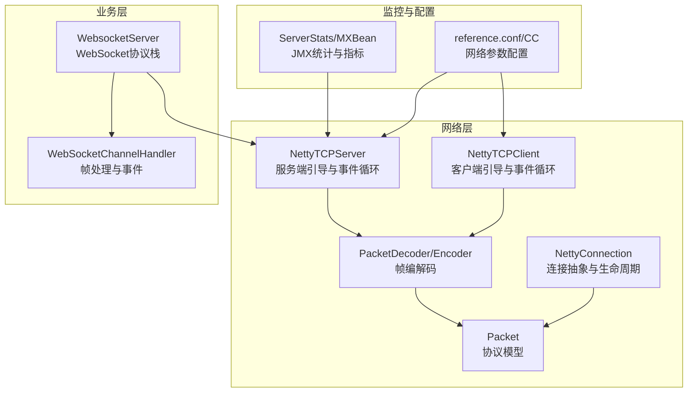
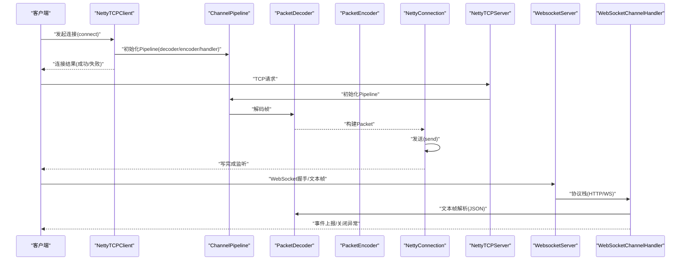
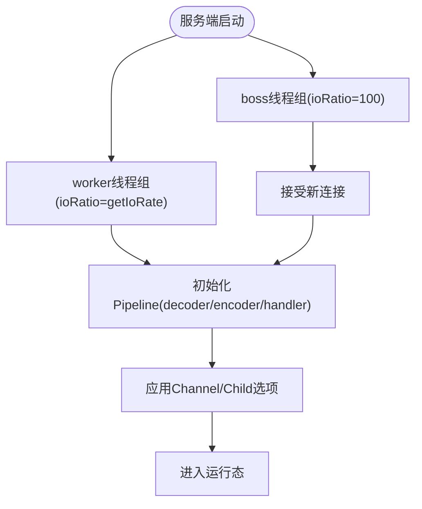
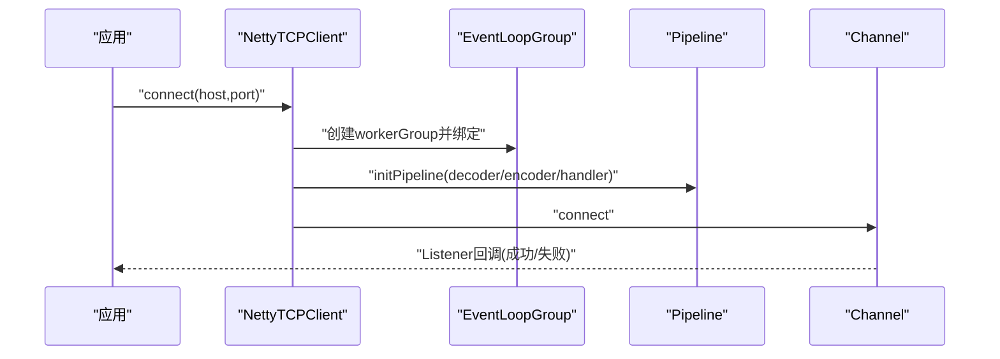
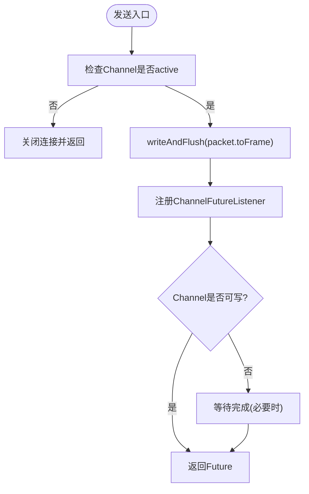
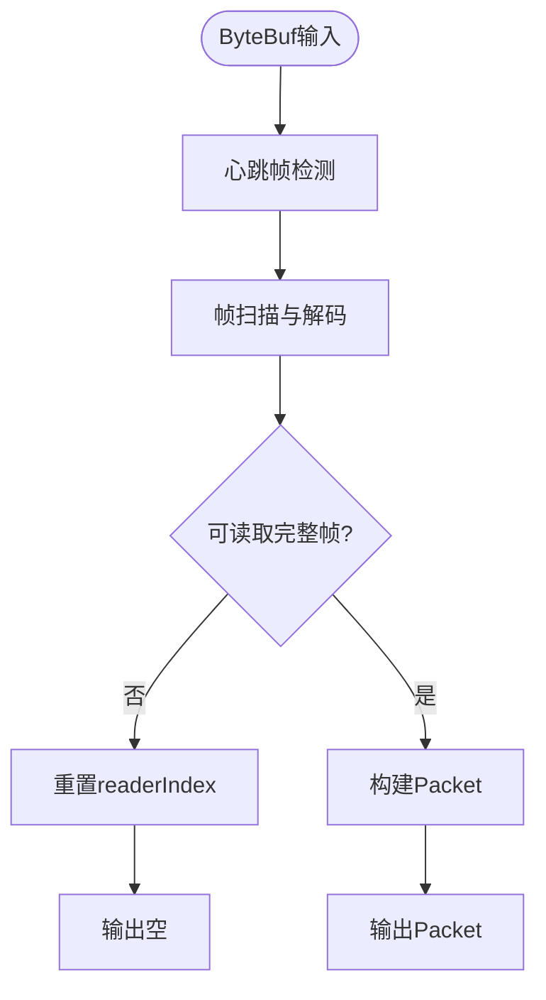
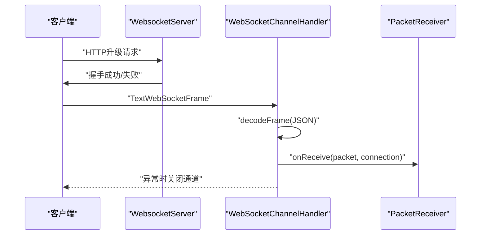
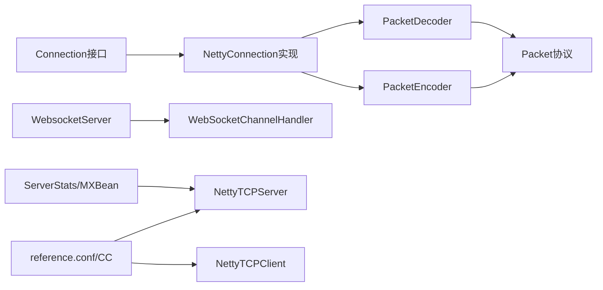

# 网络调试

<cite>
**本文引用的文件**   
- [NettyTCPServer.java](file://mpush-netty/src/main/java/com/mpush/netty/server/NettyTCPServer.java)
- [NettyTCPClient.java](file://mpush-netty/src/main/java/com/mpush/netty/client/NettyTCPClient.java)
- [NettyConnection.java](file://mpush-netty/src/main/java/com/mpush/netty/connection/NettyConnection.java)
- [PacketDecoder.java](file://mpush-netty/src/main/java/com/mpush/netty/codec/PacketDecoder.java)
- [PacketEncoder.java](file://mpush-netty/src/main/java/com/mpush/netty/codec/PacketEncoder.java)
- [Packet.java](file://mpush-api/src/main/java/com/mpush/api/protocol/Packet.java)
- [Connection.java](file://mpush-api/src/main/java/com/mpush/api/connection/Connection.java)
- [WebSocketChannelHandler.java](file://mpush-core/src/main/java/com/mpush/core/server/WebSocketChannelHandler.java)
- [WebsocketServer.java](file://mpush-core/src/main/java/com/mpush/core/server/WebsocketServer.java)
- [reference.conf](file://conf/reference.conf)
- [CC.java](file://mpush-tools/src/main/java/com/mpush/tools/config/CC.java)
- [ServerStats.java](file://mpush-monitor/src/main/java/com/mpush/monitor/jmx/stats/ServerStats.java)
- [ServerMXBean.java](file://mpush-monitor/src/main/java/com/mpush/monitor/jmx/mxbean/ServerMXBean.java)
- [HandshakeMessage.java](file://mpush-common/src/main/java/com/mpush/common/message/HandshakeMessage.java)
- [UDPPacket.java](file://mpush-api/src/main/java/com/mpush/api/protocol/UDPPacket.java)
</cite>

## 目录
1. [简介](#简介)
2. [项目结构](#项目结构)
3. [核心组件](#核心组件)
4. [架构总览](#架构总览)
5. [详细组件分析](#详细组件分析)
6. [依赖分析](#依赖分析)
7. [性能考虑](#性能考虑)
8. [故障排查指南](#故障排查指南)
9. [结论](#结论)
10. [附录](#附录)

## 简介
本指南聚焦于MPush的网络层调试技术，围绕Netty调试（ChannelPipeline、事件循环、内存池）、抓包与协议分析、连接问题诊断、WebSocket调试以及网络性能监控等方面，结合代码实现给出可操作的调试方法与最佳实践。目标读者既包括一线工程师，也包括对Netty与网络调试感兴趣但技术背景有限的读者。

## 项目结构
MPush的网络层主要由以下模块构成：
- mpush-netty：基于Netty的TCP/UDP客户端与服务端、编解码器、连接抽象
- mpush-api：协议与接口定义（Packet、Connection等）
- mpush-core：业务服务器（含WebSocket）与处理器
- mpush-monitor：JMX监控指标与统计
- mpush-tools：配置中心与通用工具
- conf：系统配置参考（含网络、缓冲区、写水位、流量整形等）

图表来源
- [NettyTCPServer.java](file://mpush-netty/src/main/java/com/mpush/netty/server/NettyTCPServer.java#L104-L223)
- [NettyTCPClient.java](file://mpush-netty/src/main/java/com/mpush/netty/client/NettyTCPClient.java#L124-L144)
- [NettyConnection.java](file://mpush-netty/src/main/java/com/mpush/netty/connection/NettyConnection.java#L73-L105)
- [PacketDecoder.java](file://mpush-netty/src/main/java/com/mpush/netty/codec/PacketDecoder.java#L44-L51)
- [PacketEncoder.java](file://mpush-netty/src/main/java/com/mpush/netty/codec/PacketEncoder.java#L38-L45)
- [Packet.java](file://mpush-api/src/main/java/com/mpush/api/protocol/Packet.java#L34-L71)
- [WebsocketServer.java](file://mpush-core/src/main/java/com/mpush/core/server/WebsocketServer.java#L48-L101)
- [WebSocketChannelHandler.java](file://mpush-core/src/main/java/com/mpush/core/server/WebSocketChannelHandler.java#L24-L47)
- [ServerStats.java](file://mpush-monitor/src/main/java/com/mpush/monitor/jmx/stats/ServerStats.java#L97-L152)
- [reference.conf](file://conf/reference.conf#L45-L123)

章节来源
- [NettyTCPServer.java](file://mpush-netty/src/main/java/com/mpush/netty/server/NettyTCPServer.java#L104-L223)
- [NettyTCPClient.java](file://mpush-netty/src/main/java/com/mpush/netty/client/NettyTCPClient.java#L124-L144)
- [reference.conf](file://conf/reference.conf#L45-L123)

## 核心组件
- 服务端引导与事件循环：NettyTCPServer负责boss/worker线程组、ChannelPipeline初始化、选项配置与优雅停机。
- 客户端引导与事件循环：NettyTCPClient负责连接建立、Pipeline初始化、选项配置与线程模型选择。
- 连接抽象：NettyConnection封装Channel、会话上下文、读写超时、发送与关闭流程。
- 协议编解码：PacketDecoder/Encoder实现帧格式解析与序列化；Packet定义协议头字段与校验逻辑。
- WebSocket：WebsocketServer与WebSocketChannelHandler实现HTTP握手、帧聚合、文本帧解析与事件上报。
- 监控与统计：ServerStats提供延迟与包计数统计，ServerMXBean暴露JMX指标；reference.conf/CC提供网络参数配置入口。

章节来源
- [NettyTCPServer.java](file://mpush-netty/src/main/java/com/mpush/netty/server/NettyTCPServer.java#L53-L113)
- [NettyTCPClient.java](file://mpush-netty/src/main/java/com/mpush/netty/client/NettyTCPClient.java#L44-L81)
- [NettyConnection.java](file://mpush-netty/src/main/java/com/mpush/netty/connection/NettyConnection.java#L38-L105)
- [PacketDecoder.java](file://mpush-netty/src/main/java/com/mpush/netty/codec/PacketDecoder.java#L44-L51)
- [PacketEncoder.java](file://mpush-netty/src/main/java/com/mpush/netty/codec/PacketEncoder.java#L38-L45)
- [Packet.java](file://mpush-api/src/main/java/com/mpush/api/protocol/Packet.java#L34-L71)
- [WebsocketServer.java](file://mpush-core/src/main/java/com/mpush/core/server/WebsocketServer.java#L48-L101)
- [WebSocketChannelHandler.java](file://mpush-core/src/main/java/com/mpush/core/server/WebSocketChannelHandler.java#L24-L47)
- [ServerStats.java](file://mpush-monitor/src/main/java/com/mpush/monitor/jmx/stats/ServerStats.java#L97-L152)
- [ServerMXBean.java](file://mpush-monitor/src/main/java/com/mpush/monitor/jmx/mxbean/ServerMXBean.java#L105-L132)
- [reference.conf](file://conf/reference.conf#L45-L123)
- [CC.java](file://mpush-tools/src/main/java/com/mpush/tools/config/CC.java#L135-L180)

## 架构总览
下面的架构图展示了从客户端到服务端、再到业务处理器与监控的整体链路，以及WebSocket特例路径。

图表来源
- [NettyTCPClient.java](file://mpush-netty/src/main/java/com/mpush/netty/client/NettyTCPClient.java#L67-L81)
- [NettyTCPServer.java](file://mpush-netty/src/main/java/com/mpush/netty/server/NettyTCPServer.java#L157-L180)
- [PacketDecoder.java](file://mpush-netty/src/main/java/com/mpush/netty/codec/PacketDecoder.java#L44-L51)
- [PacketEncoder.java](file://mpush-netty/src/main/java/com/mpush/netty/codec/PacketEncoder.java#L38-L45)
- [NettyConnection.java](file://mpush-netty/src/main/java/com/mpush/netty/connection/NettyConnection.java#L73-L105)
- [WebsocketServer.java](file://mpush-core/src/main/java/com/mpush/core/server/WebsocketServer.java#L94-L101)
- [WebSocketChannelHandler.java](file://mpush-core/src/main/java/com/mpush/core/server/WebSocketChannelHandler.java#L35-L47)

## 详细组件分析

### Netty服务端调试：ChannelPipeline与事件循环
- Pipeline初始化：服务端在每条连接建立时调用initPipeline，顺序包含decoder、encoder与业务handler，确保解码-编码-处理的清晰边界。
- 事件循环：boss/worker两组EventLoopGroup分离“接受连接”和“处理业务”，可通过线程工厂与IO比例调节CPU亲和性与I/O占比。
- 选项配置：内存池、背压、缓冲区大小、写水位等均在ServerBootstrap与ChannelOption层面集中配置，便于统一调试与优化。

图表来源
- [NettyTCPServer.java](file://mpush-netty/src/main/java/com/mpush/netty/server/NettyTCPServer.java#L187-L223)
- [NettyTCPServer.java](file://mpush-netty/src/main/java/com/mpush/netty/server/NettyTCPServer.java#L259-L263)
- [NettyTCPServer.java](file://mpush-netty/src/main/java/com/mpush/netty/server/NettyTCPServer.java#L230-L241)

章节来源
- [NettyTCPServer.java](file://mpush-netty/src/main/java/com/mpush/netty/server/NettyTCPServer.java#L187-L223)
- [NettyTCPServer.java](file://mpush-netty/src/main/java/com/mpush/netty/server/NettyTCPServer.java#L230-L241)

### Netty客户端调试：连接建立与Pipeline
- 连接建立：支持同步/异步连接，连接结果通过Listener回调，便于在调试中区分成功与失败路径。
- 线程模型：根据环境选择Epoll或NIO，线程数与IO比例可配置，便于在不同平台验证性能与稳定性。
- 编解码：与服务端一致的decoder/encoder，确保两端协议兼容性。

图表来源
- [NettyTCPClient.java](file://mpush-netty/src/main/java/com/mpush/netty/client/NettyTCPClient.java#L67-L81)
- [NettyTCPClient.java](file://mpush-netty/src/main/java/com/mpush/netty/client/NettyTCPClient.java#L124-L144)

章节来源
- [NettyTCPClient.java](file://mpush-netty/src/main/java/com/mpush/netty/client/NettyTCPClient.java#L67-L81)
- [NettyTCPClient.java](file://mpush-netty/src/main/java/com/mpush/netty/client/NettyTCPClient.java#L124-L144)

### 连接抽象与发送流程：NettyConnection
- 生命周期：连接建立后初始化SessionContext，维护状态、读写时间戳与超时判定。
- 发送流程：通过Channel写入帧并刷新，若Channel不可写或不在事件循环内，等待写完成，必要时触发关闭以避免悬挂。
- 错误处理：写完成监听记录错误日志，便于定位发送失败原因。

图表来源
- [NettyConnection.java](file://mpush-netty/src/main/java/com/mpush/netty/connection/NettyConnection.java#L73-L105)
- [NettyConnection.java](file://mpush-netty/src/main/java/com/mpush/netty/connection/NettyConnection.java#L135-L142)

章节来源
- [NettyConnection.java](file://mpush-netty/src/main/java/com/mpush/netty/connection/NettyConnection.java#L73-L105)
- [NettyConnection.java](file://mpush-netty/src/main/java/com/mpush/netty/connection/NettyConnection.java#L135-L142)

### 协议编解码：PacketDecoder/Encoder 与 Packet
- 解码流程：先尝试心跳帧识别，再尝试完整帧解析；若帧不完整则回退readerIndex，避免丢帧。
- 编码流程：心跳帧走特殊字节，普通帧按length+header+body顺序写出；支持标志位与校验。
- 协议头：长度、命令、校验码、标志位、会话ID、LRC等字段定义明确，便于抓包与协议分析。

图表来源
- [PacketDecoder.java](file://mpush-netty/src/main/java/com/mpush/netty/codec/PacketDecoder.java#L47-L77)
- [PacketDecoder.java](file://mpush-netty/src/main/java/com/mpush/netty/codec/PacketDecoder.java#L79-L89)
- [Packet.java](file://mpush-api/src/main/java/com/mpush/api/protocol/Packet.java#L141-L152)

章节来源
- [PacketDecoder.java](file://mpush-netty/src/main/java/com/mpush/netty/codec/PacketDecoder.java#L47-L77)
- [PacketEncoder.java](file://mpush-netty/src/main/java/com/mpush/netty/codec/PacketEncoder.java#L42-L45)
- [Packet.java](file://mpush-api/src/main/java/com/mpush/api/protocol/Packet.java#L34-L71)

### WebSocket调试：握手、帧与状态
- 握手与协议栈：WebsocketServer在Pipeline中加入HTTP编解码、聚合器、压缩处理器与协议处理器，最后接入业务handler。
- 文本帧解析：WebSocketChannelHandler将TextWebSocketFrame转为Packet并交由消息分发器处理，异常时关闭通道并记录日志。
- 连接状态：channelActive/channelInactive分别做连接登记与清理，并上报事件。

图表来源
- [WebsocketServer.java](file://mpush-core/src/main/java/com/mpush/core/server/WebsocketServer.java#L94-L101)
- [WebSocketChannelHandler.java](file://mpush-core/src/main/java/com/mpush/core/server/WebSocketChannelHandler.java#L35-L47)
- [WebSocketChannelHandler.java](file://mpush-core/src/main/java/com/mpush/core/server/WebSocketChannelHandler.java#L57-L70)

章节来源
- [WebsocketServer.java](file://mpush-core/src/main/java/com/mpush/core/server/WebsocketServer.java#L94-L101)
- [WebSocketChannelHandler.java](file://mpush-core/src/main/java/com/mpush/core/server/WebSocketChannelHandler.java#L35-L47)

### 抓包与协议分析
- 抓包工具：建议使用Wireshark/tshark进行TCP/UDP抓包；对WebSocket可结合浏览器开发者工具或抓包工具查看HTTP升级与文本帧。
- 数据包格式：依据Packet头部字段（长度、命令、标志位、会话ID、LRC等）进行过滤与解码，结合业务命令（如HANDSHAKE、BIND、PUSH、ACK）定位问题。
- 自定义协议：利用PacketDecoder/Encoder的解析逻辑，编写脚本或工具对原始字节流进行还原，验证协议正确性与边界条件。

章节来源
- [Packet.java](file://mpush-api/src/main/java/com/mpush/api/protocol/Packet.java#L34-L71)
- [PacketDecoder.java](file://mpush-netty/src/main/java/com/mpush/netty/codec/PacketDecoder.java#L44-L51)
- [PacketEncoder.java](file://mpush-netty/src/main/java/com/mpush/netty/codec/PacketEncoder.java#L38-L45)

### 网络连接问题诊断
- 连接超时：客户端CONNECT_TIMEOUT_MILLIS与服务端backlog、child options共同影响；检查DNS解析、防火墙与路由。
- 连接复用：关注keep-alive策略与应用层心跳；Netty侧避免频繁重建连接。
- 拥塞与背压：通过write buffer watermarks与流量整形（traffic shaping）观察写队列积压与限速效果；结合ServerStats统计延迟与丢包趋势。

章节来源
- [NettyTCPClient.java](file://mpush-netty/src/main/java/com/mpush/netty/client/NettyTCPClient.java#L141-L144)
- [NettyTCPServer.java](file://mpush-netty/src/main/java/com/mpush/netty/server/NettyTCPServer.java#L230-L241)
- [WebsocketServer.java](file://mpush-core/src/main/java/com/mpush/core/server/WebsocketServer.java#L104-L109)
- [reference.conf](file://conf/reference.conf#L88-L122)
- [CC.java](file://mpush-tools/src/main/java/com/mpush/tools/config/CC.java#L155-L180)

### WebSocket调试要点
- 握手过程：确认HTTP升级请求头、路径(ws-path)与协议处理器配置；失败时优先检查路径与跨域。
- 帧格式：区分文本帧与二进制帧；文本帧需符合JSON结构，异常类型抛出并关闭通道。
- 连接状态：通过channelActive/Inactive与事件总线联动，定位断线与重连时机。

章节来源
- [WebsocketServer.java](file://mpush-core/src/main/java/com/mpush/core/server/WebsocketServer.java#L94-L101)
- [WebSocketChannelHandler.java](file://mpush-core/src/main/java/com/mpush/core/server/WebSocketChannelHandler.java#L57-L70)

### 网络性能监控与分析
- JMX指标：ServerMXBean提供连接数、延迟统计重置等能力；ServerStats计算最小/平均/最大延迟与收发包计数。
- 关键指标：RTT可通过延迟统计推导；吞吐量结合包计数与时间窗口；丢包可通过异常与重传机制观测。
- 配置入口：通过reference.conf与CC读取网络参数，动态调整缓冲区、水位与限速策略。

章节来源
- [ServerMXBean.java](file://mpush-monitor/src/main/java/com/mpush/monitor/jmx/mxbean/ServerMXBean.java#L105-L132)
- [ServerStats.java](file://mpush-monitor/src/main/java/com/mpush/monitor/jmx/stats/ServerStats.java#L97-L152)
- [reference.conf](file://conf/reference.conf#L224-L232)
- [CC.java](file://mpush-tools/src/main/java/com/mpush/tools/config/CC.java#L135-L180)

## 依赖分析
- 低耦合高内聚：网络层以接口（Connection、Packet）与编解码器为核心，业务层通过消息分发器与处理器扩展。
- 外部依赖：Netty事件循环、ByteBuf内存池、JVM线程模型；配置中心提供运行时参数。
- 潜在风险：内存池未释放导致泄漏、写队列积压引发背压、协议字段不匹配导致解码失败。

图表来源
- [Connection.java](file://mpush-api/src/main/java/com/mpush/api/connection/Connection.java#L32-L63)
- [NettyConnection.java](file://mpush-netty/src/main/java/com/mpush/netty/connection/NettyConnection.java#L38-L65)
- [PacketDecoder.java](file://mpush-netty/src/main/java/com/mpush/netty/codec/PacketDecoder.java#L44-L51)
- [PacketEncoder.java](file://mpush-netty/src/main/java/com/mpush/netty/codec/PacketEncoder.java#L38-L45)
- [Packet.java](file://mpush-api/src/main/java/com/mpush/api/protocol/Packet.java#L34-L71)
- [WebsocketServer.java](file://mpush-core/src/main/java/com/mpush/core/server/WebsocketServer.java#L48-L101)
- [WebSocketChannelHandler.java](file://mpush-core/src/main/java/com/mpush/core/server/WebSocketChannelHandler.java#L24-L47)
- [ServerStats.java](file://mpush-monitor/src/main/java/com/mpush/monitor/jmx/stats/ServerStats.java#L97-L152)
- [reference.conf](file://conf/reference.conf#L45-L123)

## 性能考虑
- 内存池：启用PooledByteBufAllocator减少GC压力，注意及时释放ByteBuf避免泄漏。
- 线程模型：合理设置boss/worker线程数与IO比例，避免CPU争用与上下文切换开销。
- 缓冲区与水位：根据业务峰值调整SO_SNDBUF/SO_RCVBUF与write-buffer-water-mark，防止频繁阻塞。
- 流量整形：在高并发场景启用traffic shaping，平滑突发流量，降低丢包与抖动。
- 心跳与超时：应用层心跳与Netty选项协同，避免误判连接异常。

章节来源
- [NettyTCPServer.java](file://mpush-netty/src/main/java/com/mpush/netty/server/NettyTCPServer.java#L230-L241)
- [NettyTCPClient.java](file://mpush-netty/src/main/java/com/mpush/netty/client/NettyTCPClient.java#L141-L144)
- [reference.conf](file://conf/reference.conf#L76-L122)
- [CC.java](file://mpush-tools/src/main/java/com/mpush/tools/config/CC.java#L155-L180)

## 故障排查指南
- 连接失败
  - 检查connect超时、端口可达性与防火墙策略。
  - 查看客户端/服务端启动日志与Listener回调结果。
- 解码异常
  - 核对Packet头部字段与长度，确认帧完整性；关注TooLongFrameException与readerIndex回退逻辑。
- 发送失败
  - 通过NettyConnection的写完成监听定位错误；检查Channel状态与写队列。
- WebSocket异常
  - 检查HTTP升级路径与协议处理器；文本帧类型不支持时抛出异常并关闭通道。
- 监控与统计
  - 使用JMX指标与ServerStats统计延迟与包计数，结合配置参数进行对比分析。

章节来源
- [NettyTCPClient.java](file://mpush-netty/src/main/java/com/mpush/netty/client/NettyTCPClient.java#L71-L81)
- [PacketDecoder.java](file://mpush-netty/src/main/java/com/mpush/netty/codec/PacketDecoder.java#L82-L89)
- [NettyConnection.java](file://mpush-netty/src/main/java/com/mpush/netty/connection/NettyConnection.java#L135-L142)
- [WebSocketChannelHandler.java](file://mpush-core/src/main/java/com/mpush/core/server/WebSocketChannelHandler.java#L49-L55)
- [ServerStats.java](file://mpush-monitor/src/main/java/com/mpush/monitor/jmx/stats/ServerStats.java#L97-L152)

## 结论
通过对Netty事件循环、ChannelPipeline、内存池与协议编解码的系统性调试，配合抓包与协议分析、连接问题诊断与WebSocket专项调试，以及JMX与统计指标的持续监控，能够有效提升MPush网络层的稳定性与可观测性。建议在生产环境中结合配置中心参数动态调整，形成“可观测—可调试—可优化”的闭环。

## 附录
- 相关配置项（节选）
  - 网络参数：端口、缓冲区、写水位、流量整形
  - 心跳与会话：最小/最大心跳、会话过期时间
  - 日志与监控：日志级别、监控周期、慢调用阈值

章节来源
- [reference.conf](file://conf/reference.conf#L22-L31)
- [reference.conf](file://conf/reference.conf#L45-L123)
- [reference.conf](file://conf/reference.conf#L224-L232)
- [HandshakeMessage.java](file://mpush-common/src/main/java/com/mpush/common/message/HandshakeMessage.java#L38-L80)
- [UDPPacket.java](file://mpush-api/src/main/java/com/mpush/api/protocol/UDPPacket.java#L44-L82)