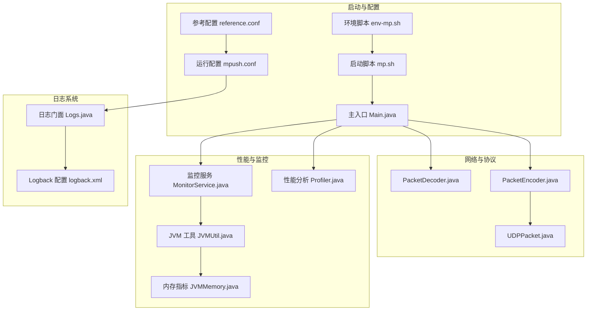
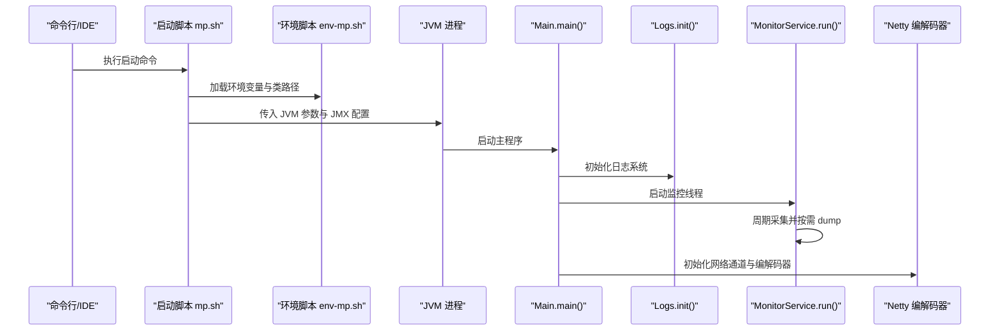
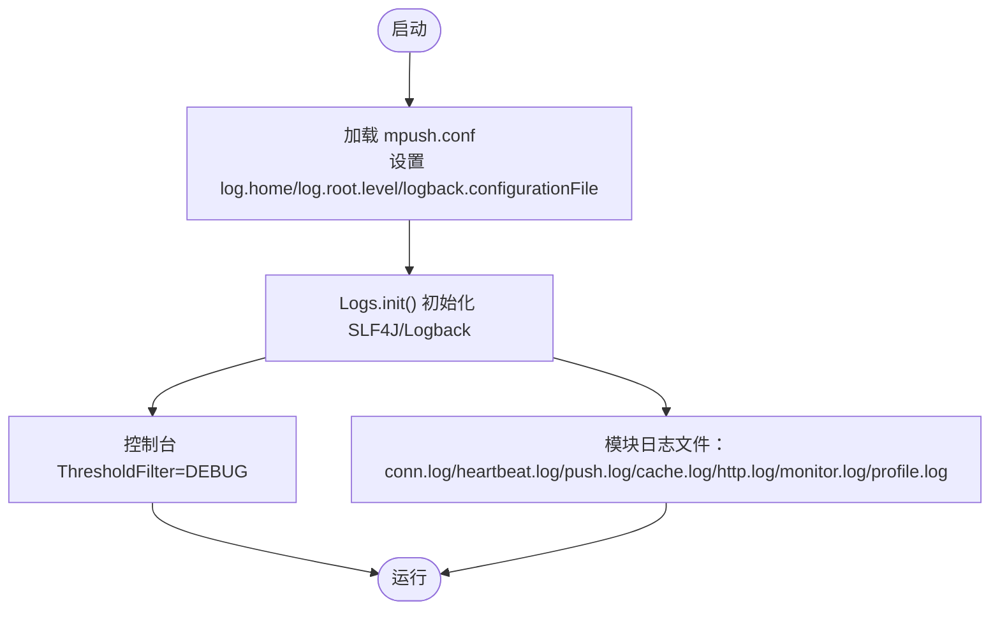
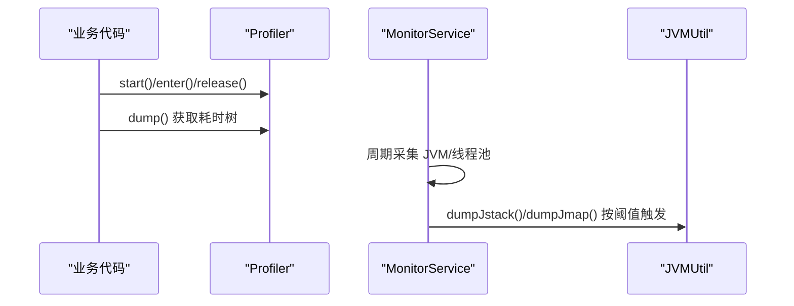
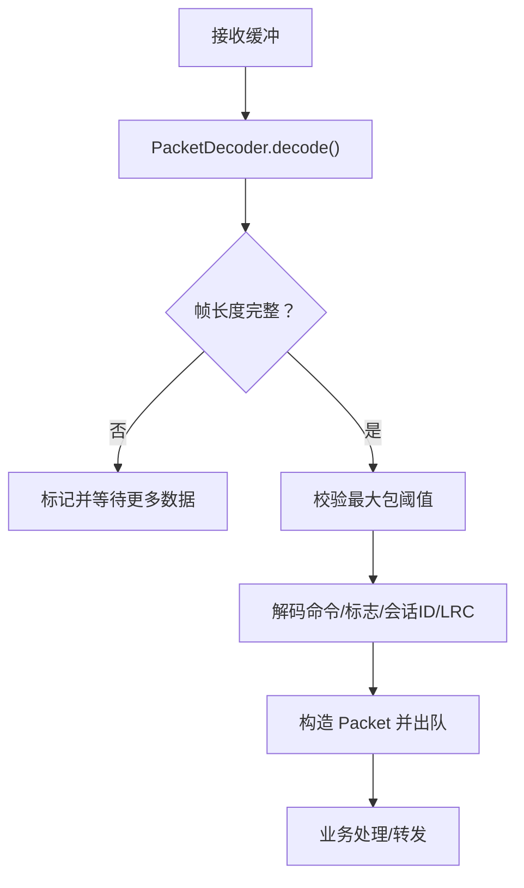
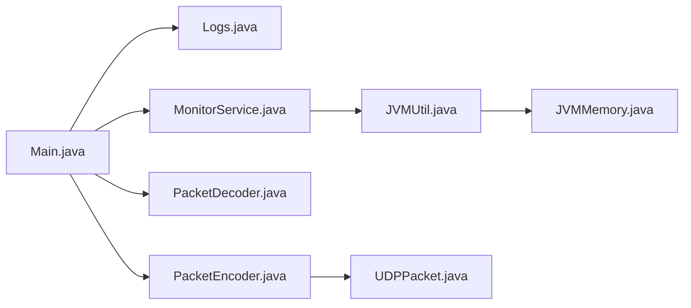

# 调试技巧

<cite>
**本文引用的文件**
- [参考配置 reference.conf](file://conf/reference.conf)
- [运行配置 mpush.conf](file://mpush-boot/src/main/resources/mpush.conf)
- [日志配置 logback.xml](file://mpush-boot/src/main/resources/logback.xml)
- [环境脚本 env-mp.sh](file://bin/env-mp.sh)
- [启动脚本 mp.sh](file://bin/mp.sh)
- [主入口 Main.java](file://mpush-boot/src/main/java/com/mpush/bootstrap/Main.java)
- [日志门面 Logs.java](file://mpush-tools/src/main/java/com/mpush/tools/log/Logs.java)
- [性能分析 Profiler.java](file://mpush-tools/src/main/java/com/mpush/tools/common/Profiler.java)
- [监控服务 MonitorService.java](file://mpush-monitor/src/main/java/com/mpush/monitor/service/MonitorService.java)
- [JVM 工具 JVMUtil.java](file://mpush-tools/src/main/java/com/mpush/tools/common/JVMUtil.java)
- [内存指标 JVMMemory.java](file://mpush-monitor/src/main/java/com/mpush/monitor/quota/impl/JVMMemory.java)
- [编解码器 PacketDecoder.java](file://mpush-netty/src/main/java/com/mpush/netty/codec/PacketDecoder.java)
- [编解码器 PacketEncoder.java](file://mpush-netty/src/main/java/com/mpush/netty/codec/PacketEncoder.java)
- [UDP 数据包 UDPPacket.java](file://mpush-api/src/main/java/com/mpush/api/protocol/UDPPacket.java)
</cite>

## 目录
1. [简介](#简介)
2. [项目结构](#项目结构)
3. [核心组件](#核心组件)
4. [架构总览](#架构总览)
5. [详细组件分析](#详细组件分析)
6. [依赖分析](#依赖分析)
7. [性能考虑](#性能考虑)
8. [故障排查指南](#故障排查指南)
9. [结论](#结论)
10. [附录](#附录)

## 简介
本指南面向 MPush 的开发者与运维工程师，聚焦于实际开发与生产环境中的调试技巧与最佳实践。内容涵盖断点调试与变量监视、日志系统配置与输出、性能分析工具与方法、网络层调试（Netty、抓包、协议分析）、内存泄漏检测与 GC 调优、分布式系统调试（多节点、服务发现、一致性验证），以及常见问题（死锁、性能瓶颈、异常追踪）的定位与解决思路。

## 项目结构
MPush 采用模块化组织，关键与调试相关的模块与文件如下：
- 配置与启动
  - 参考配置：conf/reference.conf
  - 运行配置：mpush-boot/src/main/resources/mpush.conf
  - 启动脚本：bin/mp.sh、bin/env-mp.sh
  - 主入口：mpush-boot/src/main/java/com/mpush/bootstrap/Main.java
- 日志系统
  - Logback 配置：mpush-boot/src/main/resources/logback.xml
  - 日志门面初始化：mpush-tools/src/main/java/com/mpush/tools/log/Logs.java
- 性能与监控
  - 性能分析工具：mpush-tools/src/main/java/com/mpush/tools/common/Profiler.java
  - 监控服务：mpush-monitor/src/main/java/com/mpush/monitor/service/MonitorService.java
  - JVM 工具：mpush-tools/src/main/java/com/mpush/tools/common/JVMUtil.java
  - 内存指标：mpush-monitor/src/main/java/com/mpush/monitor/quota/impl/JVMMemory.java
- 网络与协议
  - 编解码器：mpush-netty/src/main/java/com/mpush/netty/codec/PacketDecoder.java、PacketEncoder.java
  - 协议模型：mpush-api/src/main/java/com/mpush/api/protocol/UDPPacket.java
- 环境与 JMX
  - 环境变量与类路径：bin/env-mp.sh
  - JMX 远程管理：bin/mp.sh（JMX 参数注入）

**图示来源**
- [参考配置 reference.conf](file://conf/reference.conf#L1-L239)
- [运行配置 mpush.conf](file://mpush-boot/src/main/resources/mpush.conf#L1-L16)
- [环境脚本 env-mp.sh](file://bin/env-mp.sh#L1-L103)
- [启动脚本 mp.sh](file://bin/mp.sh#L1-L242)
- [主入口 Main.java](file://mpush-boot/src/main/java/com/mpush/bootstrap/Main.java#L1-L64)
- [日志配置 logback.xml](file://mpush-boot/src/main/resources/logback.xml#L1-L231)
- [日志门面 Logs.java](file://mpush-tools/src/main/java/com/mpush/tools/log/Logs.java#L1-L65)
- [性能分析 Profiler.java](file://mpush-tools/src/main/java/com/mpush/tools/common/Profiler.java#L1-L530)
- [监控服务 MonitorService.java](file://mpush-monitor/src/main/java/com/mpush/monitor/service/MonitorService.java#L1-L147)
- [JVM 工具 JVMUtil.java](file://mpush-tools/src/main/java/com/mpush/tools/common/JVMUtil.java#L1-L177)
- [内存指标 JVMMemory.java](file://mpush-monitor/src/main/java/com/mpush/monitor/quota/impl/JVMMemory.java#L1-L254)
- [编解码器 PacketDecoder.java](file://mpush-netty/src/main/java/com/mpush/netty/codec/PacketDecoder.java#L1-L107)
- [编解码器 PacketEncoder.java](file://mpush-netty/src/main/java/com/mpush/netty/codec/PacketEncoder.java#L1-L47)
- [UDP 数据包 UDPPacket.java](file://mpush-api/src/main/java/com/mpush/api/protocol/UDPPacket.java#L1-L82)

**章节来源**
- [参考配置 reference.conf](file://conf/reference.conf#L1-L239)
- [运行配置 mpush.conf](file://mpush-boot/src/main/resources/mpush.conf#L1-L16)
- [环境脚本 env-mp.sh](file://bin/env-mp.sh#L1-L103)
- [启动脚本 mp.sh](file://bin/mp.sh#L1-L242)
- [主入口 Main.java](file://mpush-boot/src/main/java/com/mpush/bootstrap/Main.java#L1-L64)

## 核心组件
- 配置体系
  - 参考配置提供完整参数清单与默认值；运行配置通过 HOCON 合并覆盖。
  - 关键调试相关项：日志级别、日志目录、日志配置路径、核心参数（心跳、压缩阈值、最大包）、网络端口与缓冲区、线程池规模、监控开关与周期。
- 日志系统
  - 通过 Logs 初始化系统属性，绑定 Logback 配置文件，按模块输出到不同日志文件，支持控制台输出与阈值过滤。
- 性能分析
  - Profiler 提供线程内嵌套计时、耗时统计与树形输出；MonitorService 周期采集 JVM 与线程池状态，按负载触发 jstack/jmap dump。
- 网络与协议
  - Netty 编解码器负责帧长度校验、超长帧异常、心跳帧识别；UDP 数据包封装发送方地址；协议包定义统一编码/解码入口。

**章节来源**
- [参考配置 reference.conf](file://conf/reference.conf#L17-L239)
- [运行配置 mpush.conf](file://mpush-boot/src/main/resources/mpush.conf#L1-L16)
- [日志门面 Logs.java](file://mpush-tools/src/main/java/com/mpush/tools/log/Logs.java#L1-L65)
- [性能分析 Profiler.java](file://mpush-tools/src/main/java/com/mpush/tools/common/Profiler.java#L1-L530)
- [监控服务 MonitorService.java](file://mpush-monitor/src/main/java/com/mpush/monitor/service/MonitorService.java#L1-L147)
- [编解码器 PacketDecoder.java](file://mpush-netty/src/main/java/com/mpush/netty/codec/PacketDecoder.java#L1-L107)
- [编解码器 PacketEncoder.java](file://mpush-netty/src/main/java/com/mpush/netty/codec/PacketEncoder.java#L1-L47)
- [UDP 数据包 UDPPacket.java](file://mpush-api/src/main/java/com/mpush/api/protocol/UDPPacket.java#L1-L82)

## 架构总览
下图展示从启动到日志、监控、网络编解码的关键交互路径，便于理解调试切入点与数据流。

**图示来源**
- [启动脚本 mp.sh](file://bin/mp.sh#L1-L242)
- [环境脚本 env-mp.sh](file://bin/env-mp.sh#L1-L103)
- [主入口 Main.java](file://mpush-boot/src/main/java/com/mpush/bootstrap/Main.java#L1-L64)
- [日志门面 Logs.java](file://mpush-tools/src/main/java/com/mpush/tools/log/Logs.java#L1-L65)
- [监控服务 MonitorService.java](file://mpush-monitor/src/main/java/com/mpush/monitor/service/MonitorService.java#L1-L147)
- [编解码器 PacketDecoder.java](file://mpush-netty/src/main/java/com/mpush/netty/codec/PacketDecoder.java#L1-L107)
- [编解码器 PacketEncoder.java](file://mpush-netty/src/main/java/com/mpush/netty/codec/PacketEncoder.java#L1-L47)

## 详细组件分析

### 断点调试与变量监视
- 设置断点
  - 在 IDE 中为关键业务入口（如处理器、推送任务、握手/心跳处理）设置断点。
  - 对网络编解码流程（PacketDecoder/Encoder）设置断点，观察帧头、命令字、会话 ID、负载长度与内容。
- 条件断点
  - 针对高频事件（心跳、推送、握手）设置条件断点，例如基于命令字、会话 ID 或负载大小。
- 变量监视
  - 观察读写指针、可读字节、包体长度、超长帧异常阈值、心跳超时次数等。
- 线程视角
  - 使用线程面板查看 Netty I/O 线程、业务线程池、监控线程、JVM 垃圾回收线程状态。

**章节来源**
- [编解码器 PacketDecoder.java](file://mpush-netty/src/main/java/com/mpush/netty/codec/PacketDecoder.java#L1-L107)
- [编解码器 PacketEncoder.java](file://mpush-netty/src/main/java/com/mpush/netty/codec/PacketEncoder.java#L1-L47)

### 日志调试配置与使用
- 配置文件位置与加载
  - 运行配置 mpush.conf 指定日志级别、日志目录与 Logback 配置路径；Logs 初始化时将系统属性绑定到配置值。
- 日志级别与输出
  - 控制台输出阈值为 DEBUG；各模块日志独立输出到不同文件（连接、心跳、推送、缓存、HTTP、监控、性能剖析等）。
- 动态调整
  - 通过修改 mpush.conf 的日志级别与重启生效，或结合运行时参数覆盖。
- 输出格式
  - 时间戳、线程名、级别、Logger 名称、消息内容；模块化日志便于按功能域检索。

**图示来源**
- [运行配置 mpush.conf](file://mpush-boot/src/main/resources/mpush.conf#L1-L16)
- [日志门面 Logs.java](file://mpush-tools/src/main/java/com/mpush/tools/log/Logs.java#L1-L65)
- [日志配置 logback.xml](file://mpush-boot/src/main/resources/logback.xml#L1-L231)

**章节来源**
- [运行配置 mpush.conf](file://mpush-boot/src/main/resources/mpush.conf#L1-L16)
- [日志门面 Logs.java](file://mpush-tools/src/main/java/com/mpush/tools/log/Logs.java#L1-L65)
- [日志配置 logback.xml](file://mpush-boot/src/main/resources/logback.xml#L1-L231)

### 性能分析工具使用
- Profiler 计时
  - 在关键路径调用 start()/enter()/release()/dump()，输出树形耗时报告，定位热点子段。
  - 可通过配置启用/禁用性能剖析与慢日志阈值。
- 监控服务
  - MonitorService 周期采集 JVM 与线程池指标，按 CPU 负载阈值触发 jstack/jmap dump，辅助定位阻塞与内存问题。
- JVM 工具
  - JVMUtil.dumpJstack/dumpJmap 支持异步落盘，便于生产环境按需采样。

**图示来源**
- [性能分析 Profiler.java](file://mpush-tools/src/main/java/com/mpush/tools/common/Profiler.java#L1-L530)
- [监控服务 MonitorService.java](file://mpush-monitor/src/main/java/com/mpush/monitor/service/MonitorService.java#L1-L147)
- [JVM 工具 JVMUtil.java](file://mpush-tools/src/main/java/com/mpush/tools/common/JVMUtil.java#L1-L177)

**章节来源**
- [性能分析 Profiler.java](file://mpush-tools/src/main/java/com/mpush/tools/common/Profiler.java#L1-L530)
- [监控服务 MonitorService.java](file://mpush-monitor/src/main/java/com/mpush/monitor/service/MonitorService.java#L1-L147)
- [JVM 工具 JVMUtil.java](file://mpush-tools/src/main/java/com/mpush/tools/common/JVMUtil.java#L1-L177)

### 网络调试技巧（Netty、抓包、协议）
- Netty 调试
  - 在 PacketDecoder/Encoder 设置断点，观察帧头长度、命令字、标志位、会话 ID、LRC 校验、UDP 发送方地址。
  - 关注超长帧异常（TooLongFrameException）与心跳帧处理逻辑。
- 抓包与协议分析
  - 使用抓包工具捕获 TCP/UDP 流量，对照协议头字段与负载长度，确认粘包/拆包与异常帧。
  - 对比日志中的包体长度与抓包结果，定位编解码边界问题。
- UDP 特性
  - UDPPacket 封装发送方地址，注意跨网段/防火墙对 UDP 的影响与丢包特征。

**图示来源**
- [编解码器 PacketDecoder.java](file://mpush-netty/src/main/java/com/mpush/netty/codec/PacketDecoder.java#L1-L107)
- [编解码器 PacketEncoder.java](file://mpush-netty/src/main/java/com/mpush/netty/codec/PacketEncoder.java#L1-L47)
- [UDP 数据包 UDPPacket.java](file://mpush-api/src/main/java/com/mpush/api/protocol/UDPPacket.java#L1-L82)

**章节来源**
- [编解码器 PacketDecoder.java](file://mpush-netty/src/main/java/com/mpush/netty/codec/PacketDecoder.java#L1-L107)
- [编解码器 PacketEncoder.java](file://mpush-netty/src/main/java/com/mpush/netty/codec/PacketEncoder.java#L1-L47)
- [UDP 数据包 UDPPacket.java](file://mpush-api/src/main/java/com/mpush/api/protocol/UDPPacket.java#L1-L82)

### 内存泄漏检测与分析
- 堆转储与分析
  - MonitorService 在高负载时触发 jmap dump；JVMUtil.dumpJmap 异步落盘，便于后续分析。
  - 使用可视化工具对比不同时间点的堆快照，关注对象数量增长与大对象存活。
- 内存使用监控
  - JVMMemory 提供堆/非堆、老年代/Eden/Survivor 等指标，结合日志监控文件观察趋势。
- 垃圾回收调优
  - 结合 GC 日志与 JVMMemory 指标，评估晋升失败、Full GC 频率与停顿时间，优化新生代/老年代比例与回收器策略。

**章节来源**
- [监控服务 MonitorService.java](file://mpush-monitor/src/main/java/com/mpush/monitor/service/MonitorService.java#L1-L147)
- [JVM 工具 JVMUtil.java](file://mpush-tools/src/main/java/com/mpush/tools/common/JVMUtil.java#L1-L177)
- [内存指标 JVMMemory.java](file://mpush-monitor/src/main/java/com/mpush/monitor/quota/impl/JVMMemory.java#L1-L254)

### 分布式系统调试
- 多节点调试
  - 通过 mpush.conf 配置不同节点的端口、注册 IP 与网络类型，结合日志模块区分节点行为。
- 服务发现调试
  - 关注 ZooKeeper 连接与命名空间，核对节点注册属性（权重、路径）与分配策略。
- 数据一致性验证
  - 对推送/踢人/路由变更事件进行序列化与幂等校验，结合监控日志与模块日志交叉比对。

**章节来源**
- [参考配置 reference.conf](file://conf/reference.conf#L125-L141)
- [运行配置 mpush.conf](file://mpush-boot/src/main/resources/mpush.conf#L5-L16)

## 依赖分析
- 组件耦合
  - Main 作为启动入口，依赖 Logs 初始化日志；监控服务依赖 JVM 工具与内存指标；网络编解码器依赖协议包与配置。
- 外部依赖
  - Logback（日志）、Netty（网络）、Typesafe Config（配置）、JDK MXBean（JMX/堆转储）。

**图示来源**
- [主入口 Main.java](file://mpush-boot/src/main/java/com/mpush/bootstrap/Main.java#L1-L64)
- [日志门面 Logs.java](file://mpush-tools/src/main/java/com/mpush/tools/log/Logs.java#L1-L65)
- [监控服务 MonitorService.java](file://mpush-monitor/src/main/java/com/mpush/monitor/service/MonitorService.java#L1-L147)
- [JVM 工具 JVMUtil.java](file://mpush-tools/src/main/java/com/mpush/tools/common/JVMUtil.java#L1-L177)
- [内存指标 JVMMemory.java](file://mpush-monitor/src/main/java/com/mpush/monitor/quota/impl/JVMMemory.java#L1-L254)
- [编解码器 PacketDecoder.java](file://mpush-netty/src/main/java/com/mpush/netty/codec/PacketDecoder.java#L1-L107)
- [编解码器 PacketEncoder.java](file://mpush-netty/src/main/java/com/mpush/netty/codec/PacketEncoder.java#L1-L47)
- [UDP 数据包 UDPPacket.java](file://mpush-api/src/main/java/com/mpush/api/protocol/UDPPacket.java#L1-L82)

**章节来源**
- [主入口 Main.java](file://mpush-boot/src/main/java/com/mpush/bootstrap/Main.java#L1-L64)
- [监控服务 MonitorService.java](file://mpush-monitor/src/main/java/com/mpush/monitor/service/MonitorService.java#L1-L147)
- [编解码器 PacketDecoder.java](file://mpush-netty/src/main/java/com/mpush/netty/codec/PacketDecoder.java#L1-L107)
- [编解码器 PacketEncoder.java](file://mpush-netty/src/main/java/com/mpush/netty/codec/PacketEncoder.java#L1-L47)

## 性能考虑
- 心跳与超时
  - 合理设置最小/最大心跳与超时次数，避免频繁断链与资源占用。
- 缓冲区与水位
  - 根据业务 QPS 与包体大小调整发送/接收缓冲区与 Netty 写保护水位，防止背压与 OOM。
- 线程池规模
  - 根据 CPU 核数与业务特性调整接入/网关/推送线程池大小，避免 I/O 密集型场景线程不足。
- 流量整形
  - 启用/调整网关侧流量整形参数，限制全局/通道级读写速率，平滑突发流量。

**章节来源**
- [参考配置 reference.conf](file://conf/reference.conf#L23-L122)

## 故障排查指南
- 死锁检测
  - 使用 JVMUtil.dumpJstack 生成线程栈，定位相互等待的锁持有者与等待队列。
- 性能瓶颈定位
  - 结合 Profiler 树形耗时与 MonitorService 指标，优先检查编解码、路由查询、推送队列与外部依赖延迟。
- 异常追踪
  - 通过模块日志（连接/心跳/HTTP/缓存/监控/推送）定位异常发生阶段，配合抓包与协议解析复现问题。
- 启动与停止
  - 使用 mp.sh 的 print-cmd 查看最终 JVM 启动命令，必要时开启远程 JMX（mp.sh 注入 JMX 参数）进行诊断。

**章节来源**
- [JVM 工具 JVMUtil.java](file://mpush-tools/src/main/java/com/mpush/tools/common/JVMUtil.java#L1-L177)
- [性能分析 Profiler.java](file://mpush-tools/src/main/java/com/mpush/tools/common/Profiler.java#L1-L530)
- [监控服务 MonitorService.java](file://mpush-monitor/src/main/java/com/mpush/monitor/service/MonitorService.java#L1-L147)
- [启动脚本 mp.sh](file://bin/mp.sh#L1-L242)

## 结论
通过系统化的配置与日志、完善的性能剖析与监控、严谨的网络与协议调试、以及规范的内存与分布式调试流程，能够高效定位并解决 MPush 在开发与生产中的各类问题。建议在开发阶段开启更细粒度日志与性能剖析，在预生产环境启用周期性 dump，在生产环境严格控制日志级别与 dump 频率，确保可观测性与稳定性平衡。

## 附录
- 常用调试命令与参数
  - 启动：bin/mp.sh start
  - 前台启动：bin/mp.sh start-foreground
  - 打印最终命令：bin/mp.sh print-cmd
  - 停止：bin/mp.sh stop
  - 状态：bin/mp.sh status
- 关键配置项速查
  - 日志：mp.log-level、mp.log-dir、mp.log-conf-path
  - 核心：mp.core.max-packet-size、mp.core.compress-threshold、mp.core.min/max-heartbeat、mp.core.max-hb-timeout-times
  - 网络：mp.net.connect-server-port、mp.net.gateway-server-port、mp.net.gateway-server-net、snd_buf/rcv_buf/write-buffer-water-mark
  - 线程池：mp.thread.pool.*
  - 监控：mp.monitor.dump-dir、mp.monitor.dump-stack、mp.monitor.dump-period、mp.monitor.print-log、mp.monitor.profile-enabled、mp.monitor.profile-slowly-duration

**章节来源**
- [启动脚本 mp.sh](file://bin/mp.sh#L1-L242)
- [参考配置 reference.conf](file://conf/reference.conf#L17-L239)
- [运行配置 mpush.conf](file://mpush-boot/src/main/resources/mpush.conf#L1-L16)