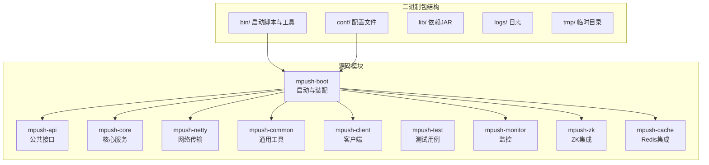
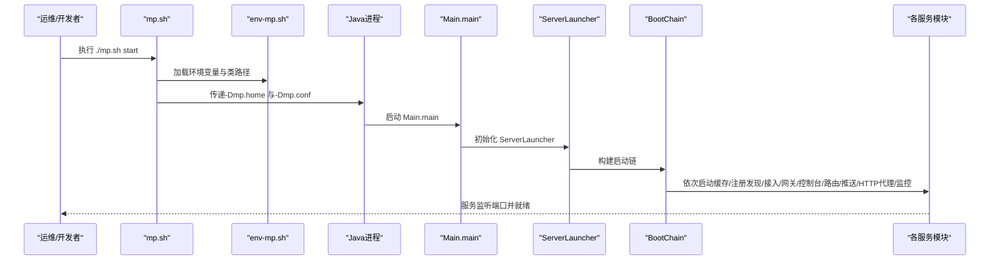
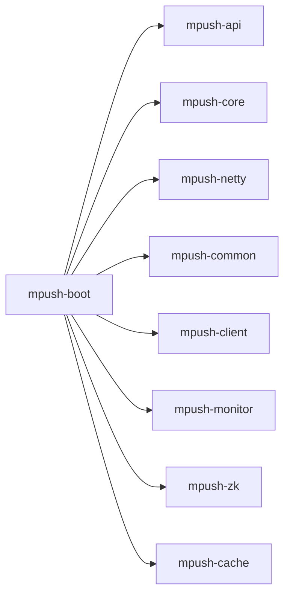

# 快速开始

<cite>
**本文引用的文件**
- [README.md](file://README.md)
- [mpush.conf](file://mpush-boot/src/main/resources/mpush.conf)
- [reference.conf](file://conf/reference.conf)
- [env-mp.sh](file://bin/env-mp.sh)
- [set-env.sh](file://bin/set-env.sh)
- [rsa.sh](file://bin/rsa.sh)
- [mp.sh](file://bin/mp.sh)
- [Main.java](file://mpush-boot/src/main/java/com/mpush/bootstrap/Main.java)
- [ServerLauncher.java](file://mpush-boot/src/main/java/com/mpush/bootstrap/ServerLauncher.java)
- [conf-dev.properties](file://conf/conf-dev.properties)
- [conf-pub.properties](file://conf/conf-pub.properties)
- [assembly.xml](file://mpush-boot/assembly.xml)
- [pom.xml](file://pom.xml)
- [ServerTestMain.java](file://mpush-test/src/main/java/com/mpush/test/sever/ServerTestMain.java)
- [ConnClientTestMain.java](file://mpush-test/src/main/java/com/mpush/test/client/ConnClientTestMain.java)
- [PushClientTestMain.java](file://mpush-test/src/main/java/com/mpush/test/push/PushClientTestMain.java)
</cite>

## 目录
1. [简介](#简介)
2. [项目结构](#项目结构)
3. [核心组件](#核心组件)
4. [架构总览](#架构总览)
5. [详细组件分析](#详细组件分析)
6. [依赖分析](#依赖分析)
7. [性能注意事项](#性能注意事项)
8. [故障排查指南](#故障排查指南)
9. [结论](#结论)
10. [附录](#附录)

## 简介
本指南面向初学者，帮助你在最短时间内完成 MPush 的环境准备、服务部署、配置修改、启动与健康检查，并提供集成部署与测试验证的步骤。你将学会：
- 准备 JDK 1.8+、Zookeeper、Redis 环境
- 下载并部署发布包，启动服务
- 区分 mpush.conf 与 reference.conf 并正确修改配置
- 使用启动脚本进行 start/stop/restart/status 等操作
- 健康检查与常见问题排查
- 将 MPush 集成到现有 Web 工程（Tomcat）
- 测试验证服务是否正常运行

## 项目结构
MPush 是一个多模块 Maven 工程，核心与启动逻辑集中在 mpush-boot 模块，配置文件位于 conf 与 mpush-boot/src/main/resources。bin 目录提供启动脚本与工具脚本。

图表来源
- [assembly.xml](file://mpush-boot/assembly.xml#L39-L57)
- [pom.xml](file://pom.xml#L54-L66)

章节来源
- [pom.xml](file://pom.xml#L54-L66)
- [assembly.xml](file://mpush-boot/assembly.xml#L39-L57)

## 核心组件
- 启动入口：Main 与 ServerLauncher 负责初始化与启动服务链路，按顺序启动缓存、注册发现、接入服务、网关、控制台、路由中心、推送中心、HTTP代理、监控等模块。
- 配置体系：reference.conf 提供完整配置项参考；mpush.conf 用于覆盖与自定义配置；开发/生产环境可通过 conf-dev.properties 与 conf-pub.properties 进行属性过滤。
- 启动脚本：env-mp.sh 设置环境变量与类路径；set-env.sh 配置 JVM 参数（如 GC、JMX、Netty 泄漏检测）；rsa.sh 生成 RSA 密钥；mp.sh 提供 start/stop/restart/status/print-cmd 等命令。

章节来源
- [Main.java](file://mpush-boot/src/main/java/com/mpush/bootstrap/Main.java#L31-L38)
- [ServerLauncher.java](file://mpush-boot/src/main/java/com/mpush/bootstrap/ServerLauncher.java#L42-L71)
- [reference.conf](file://conf/reference.conf#L1-L239)
- [mpush.conf](file://mpush-boot/src/main/resources/mpush.conf#L1-L16)
- [env-mp.sh](file://bin/env-mp.sh#L30-L58)
- [set-env.sh](file://bin/set-env.sh#L19-L37)
- [rsa.sh](file://bin/rsa.sh#L29-L35)
- [mp.sh](file://bin/mp.sh#L134-L165)

## 架构总览
MPush 服务启动流程概览：

图表来源
- [mp.sh](file://bin/mp.sh#L134-L165)
- [env-mp.sh](file://bin/env-mp.sh#L77-L85)
- [Main.java](file://mpush-boot/src/main/java/com/mpush/bootstrap/Main.java#L31-L38)
- [ServerLauncher.java](file://mpush-boot/src/main/java/com/mpush/bootstrap/ServerLauncher.java#L42-L71)

## 详细组件分析

### 环境准备与安装
- JDK 1.8+
  - 设置 JAVA_HOME 并确保 java 命令可用。
- Zookeeper
  - 安装并启动 Zookeeper，确保可访问其地址与端口。
- Redis
  - 安装并启动 Redis，确保可访问节点列表与密码（如有）。

章节来源
- [README.md](file://README.md#L36-L40)

### 下载与解压发布包
- 从发布页下载最新稳定版本的 tar 包，解压至 mpush 目录。
- 解压后目录包含：bin、conf、lib、logs、tmp 等。

章节来源
- [README.md](file://README.md#L42-L54)

### 配置文件详解与区别
- reference.conf
  - 完整配置项参考，包含日志、核心、安全、网络、ZK、Redis、HTTP、线程池、流控、监控、SPI 等。
  - 作用：作为“模板”与“参考”，列出所有可配置项。
- mpush.conf
  - 实际生效的配置文件，覆盖 reference.conf 中的同名项。
  - 位置：与 conf 目录同级，或通过 -Dmp.conf 指定。
- 开发/生产环境属性文件
  - conf-dev.properties：开发环境（如 debug 日志、较短心跳等）。
  - conf-pub.properties：生产环境（如 warn 日志、较长心跳等）。
- 配置加载优先级
  - mpush.conf 覆盖 reference.conf；构建时可通过过滤器注入属性文件中的值。

章节来源
- [reference.conf](file://conf/reference.conf#L1-L239)
- [mpush.conf](file://mpush-boot/src/main/resources/mpush.conf#L1-L16)
- [conf-dev.properties](file://conf/conf-dev.properties#L1-L5)
- [conf-pub.properties](file://conf/conf-pub.properties#L1-L5)
- [README.md](file://README.md#L56-L67)

### 修改关键配置项
- 网络端口与注册IP
  - 接入服务端口、注册到 Zookeeper 的 IP/属性等。
- Zookeeper 地址与命名空间
  - server-address、namespace、digest、watch-path、重试策略等。
- Redis 集群/单机/哨兵
  - nodes、cluster-model、password、连接池参数等。
- 安全密钥
  - RSA 私钥/公钥（可使用 rsa.sh 生成或自行准备）。
- 其他
  - 线程池大小、最大包大小、压缩阈值、心跳间隔、WS/TCP 网关开关、HTTP 代理等。

章节来源
- [reference.conf](file://conf/reference.conf#L103-L325)
- [mpush.conf](file://mpush-boot/src/main/resources/mpush.conf#L1-L16)
- [rsa.sh](file://bin/rsa.sh#L29-L35)

### 启动脚本使用说明
- 设置权限
  - 给 bin 目录下脚本增加执行权限。
- 启动命令
  - ./mp.sh start：后台启动
  - ./mp.sh start-foreground：前台启动
  - ./mp.sh stop：停止服务
  - ./mp.sh restart：重启
  - ./mp.sh status：查看状态（基于端口探测）
  - ./mp.sh print-cmd：打印最终启动命令
- JVM 参数与 JMX
  - set-env.sh 可配置 Netty 泄漏检测、JMX、GC 参数、远程调试等。
- 环境变量
  - env-mp.sh 设置 MPUSH_HOME、MP_CFG_DIR、MP_LOG_DIR、MP_DATA_DIR、CLASSPATH 等。

章节来源
- [README.md](file://README.md#L69-L76)
- [mp.sh](file://bin/mp.sh#L134-L165)
- [mp.sh](file://bin/mp.sh#L229-L238)
- [set-env.sh](file://bin/set-env.sh#L19-L37)
- [env-mp.sh](file://bin/env-mp.sh#L30-L58)

### 服务健康检查
- 日志检查
  - 进入 logs 目录，查看 mpush.out 是否包含启动成功的日志。
- 端口检查
  - 使用 status 命令或 telnet 检查控制台端口（默认 3002），确认服务已监听。
- 功能验证（可选）
  - 使用 mpush-test 模块中的测试入口模拟客户端与推送，观察日志输出。

章节来源
- [README.md](file://README.md#L77-L78)
- [mp.sh](file://bin/mp.sh#L229-L238)
- [ServerTestMain.java](file://mpush-test/src/main/java/com/mpush/test/sever/ServerTestMain.java#L44-L48)
- [ConnClientTestMain.java](file://mpush-test/src/main/java/com/mpush/test/client/ConnClientTestMain.java#L71-L115)
- [PushClientTestMain.java](file://mpush-test/src/main/java/com/mpush/test/push/PushClientTestMain.java#L39-L75)

### 集成部署示例（集成到现有 Web 工程）
- 添加依赖
  - 在现有 Web 工程的 pom.xml 中引入 mpush-boot 依赖。
- 启动入口
  - 使用 com.mpush.bootstrap.ServerLauncher 作为启动入口。
- 配置与打包
  - 将 mpush.conf 放入工程的 classpath:/conf 或通过 -Dmp.conf 指定。
  - 参考 mpush-boot 的 assembly.xml 将 bootstrap.jar 与依赖放入 lib 目录。

章节来源
- [README.md](file://README.md#L78-L87)
- [assembly.xml](file://mpush-boot/assembly.xml#L39-L57)
- [ServerLauncher.java](file://mpush-boot/src/main/java/com/mpush/bootstrap/ServerLauncher.java#L42-L71)

### 测试验证步骤
- 启动服务
  - ./mp.sh start 后等待日志输出服务已启动。
- 启动测试客户端
  - 运行 ServerTestMain、ConnClientTestMain、PushClientTestMain，观察控制台输出与日志。
- 观察指标
  - 可通过测试客户端统计输出与日志判断连接、推送是否成功。

章节来源
- [ServerTestMain.java](file://mpush-test/src/main/java/com/mpush/test/sever/ServerTestMain.java#L44-L48)
- [ConnClientTestMain.java](file://mpush-test/src/main/java/com/mpush/test/client/ConnClientTestMain.java#L71-L115)
- [PushClientTestMain.java](file://mpush-test/src/main/java/com/mpush/test/push/PushClientTestMain.java#L39-L75)

## 依赖分析
- 模块依赖
  - mpush-boot 依赖 mpush-api、mpush-core、mpush-netty、mpush-common、mpush-client、mpush-monitor、mpush-zk、mpush-cache 等模块。
- 启动装配
  - assembly.xml 将 bootstrap.jar 与依赖打包到 lib，便于独立运行。
- Java 版本
  - 项目要求 Java 1.8+。

图表来源
- [pom.xml](file://pom.xml#L54-L66)
- [assembly.xml](file://mpush-boot/assembly.xml#L39-L57)

章节来源
- [pom.xml](file://pom.xml#L54-L66)
- [assembly.xml](file://mpush-boot/assembly.xml#L39-L57)

## 性能注意事项
- Netty 泄漏检测
  - set-env.sh 默认开启 advanced 级别，建议仅在测试环境使用，生产环境可按需调整。
- JVM 参数
  - 可配置 GC 策略、堆大小、JMX、远程调试等，结合业务 QPS 与延迟目标调优。
- 线程池与网络缓冲
  - 根据接入规模与消息量调整线程池大小与 TCP/UDP 缓冲区、水位线。
- 流控与压缩
  - 合理设置最大包大小、压缩阈值与全局/广播流控，避免过载。

章节来源
- [set-env.sh](file://bin/set-env.sh#L19-L37)
- [reference.conf](file://conf/reference.conf#L268-L325)

## 故障排查指南
- 无法启动
  - 检查 JAVA_HOME 与 java 命令是否可用；查看 logs/mpush.out 错误日志。
- 端口占用
  - 修改 mpush.conf 中的端口（接入/网关/控制台/WS），确保未被占用。
- Zookeeper 连接失败
  - 校验 server-address、namespace、digest、重试参数；确认 Zookeeper 可达。
- Redis 连接失败
  - 校验 nodes、cluster-model、password；确认 Redis 可达且认证正确。
- RSA 密钥问题
  - 使用 rsa.sh 生成密钥，或将生成的密钥填入 mpush.conf 对应字段。
- 停止无响应
  - 使用 ./mp.sh stop；若超时，查看 PID 文件与线程堆栈，必要时手动终止。

章节来源
- [mp.sh](file://bin/mp.sh#L176-L214)
- [rsa.sh](file://bin/rsa.sh#L29-L35)
- [reference.conf](file://conf/reference.conf#L211-L255)

## 结论
通过本指南，你已完成 MPush 的环境准备、配置修改、服务启动与健康检查，并掌握了集成部署与测试验证的基本流程。建议在生产环境中进一步细化 JVM 参数、网络与流控配置，并结合监控与日志持续优化。

## 附录

### 常用命令清单
- 启动/停止/重启/状态
  - ./mp.sh start
  - ./mp.sh stop
  - ./mp.sh restart
  - ./mp.sh status
- 查看最终启动命令
  - ./mp.sh print-cmd
- 生成 RSA 密钥
  - ./bin/rsa.sh [keySize]

章节来源
- [mp.sh](file://bin/mp.sh#L134-L165)
- [mp.sh](file://bin/mp.sh#L229-L238)
- [rsa.sh](file://bin/rsa.sh#L29-L35)