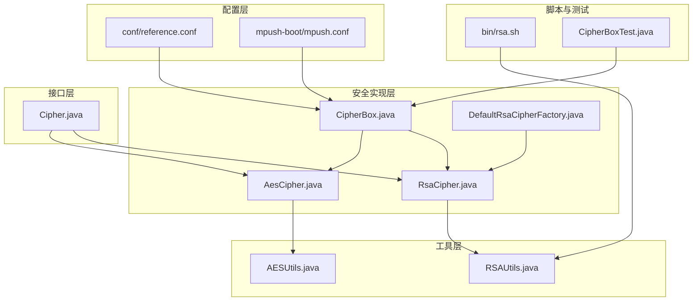
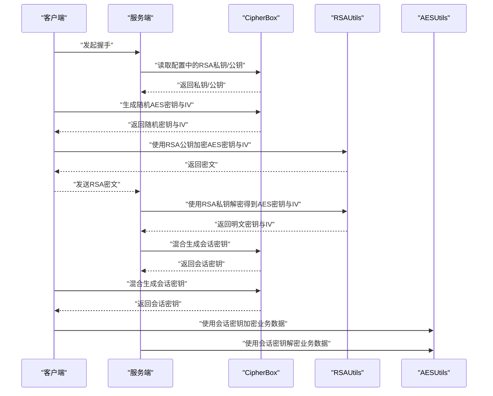
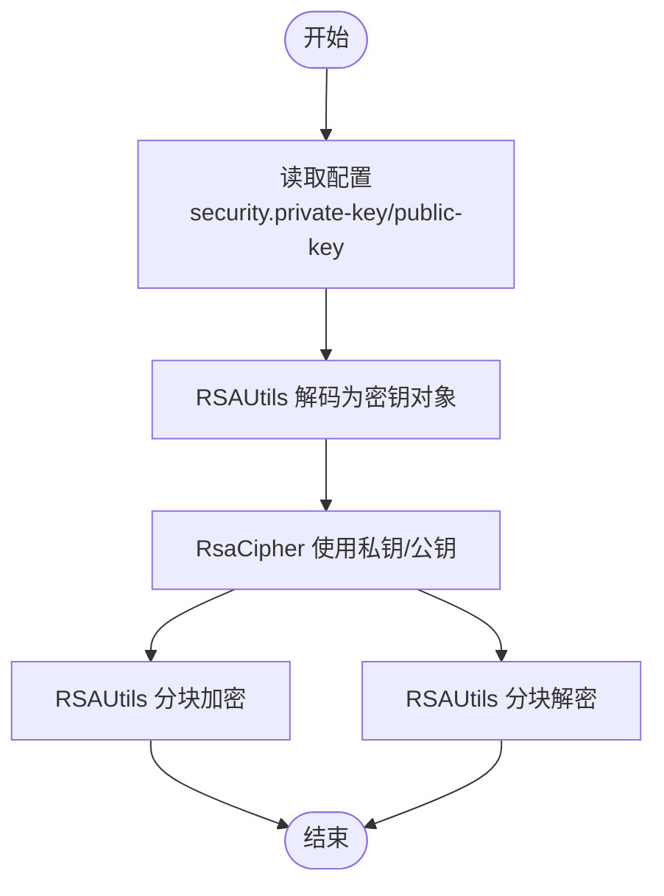
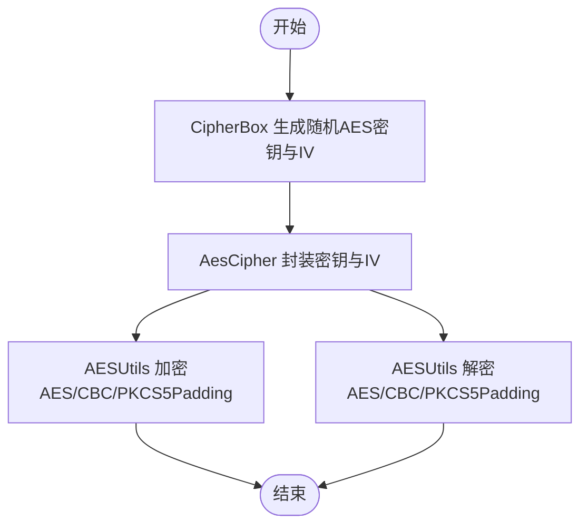
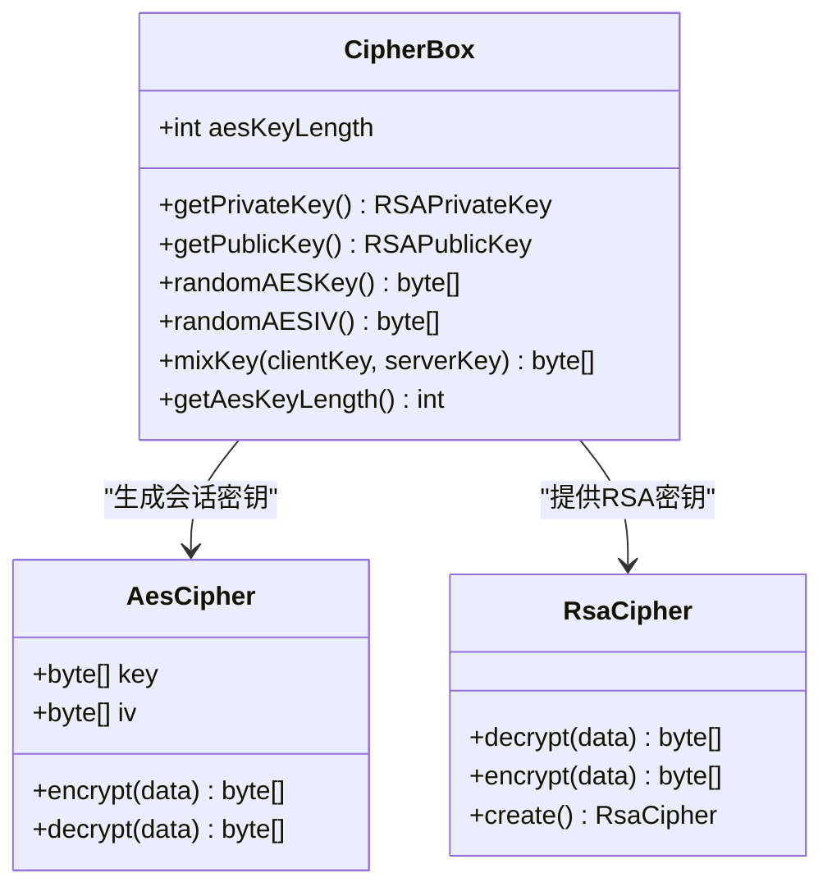
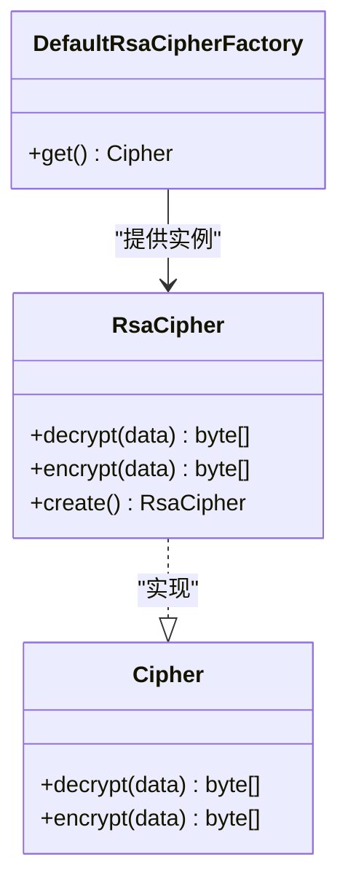
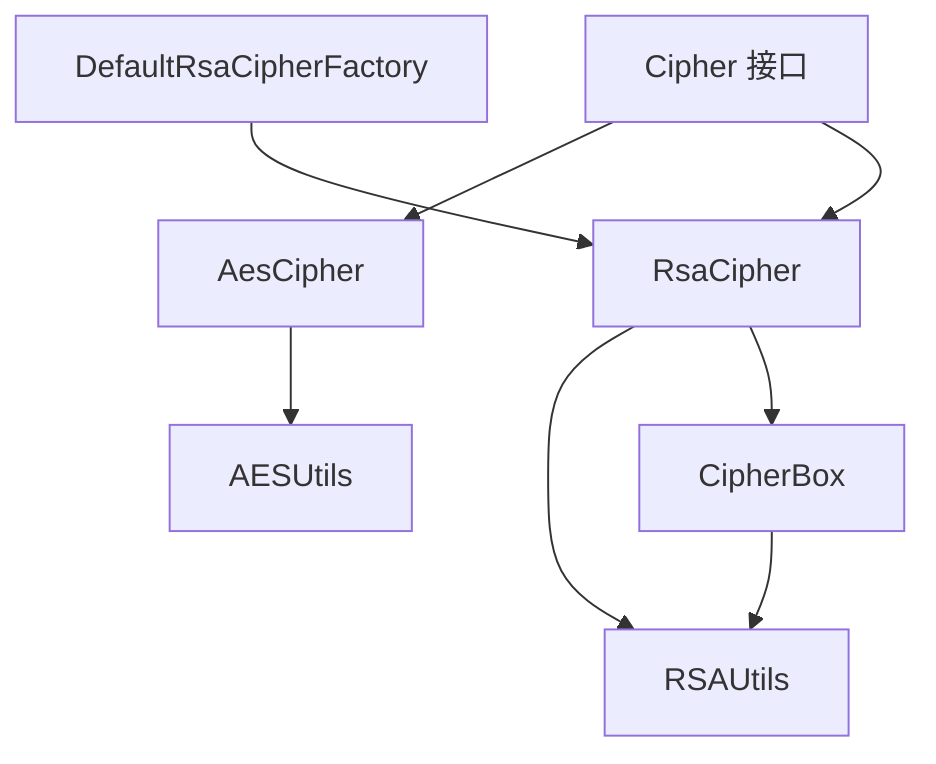

# 加密配置

<cite>
**本文引用的文件**
- [conf/reference.conf](file://conf/reference.conf)
- [mpush-boot/mpush.conf](file://mpush-boot/mpush.conf)
- [mpush-common/security/CipherBox.java](file://mpush-common/security/CipherBox.java)
- [mpush-common/security/AesCipher.java](file://mpush-common/security/AesCipher.java)
- [mpush-common/security/RsaCipher.java](file://mpush-common/security/RsaCipher.java)
- [mpush-common/security/DefaultRsaCipherFactory.java](file://mpush-common/security/DefaultRsaCipherFactory.java)
- [mpush-tools/crypto/AESUtils.java](file://mpush-tools/crypto/AESUtils.java)
- [mpush-tools/crypto/RSAUtils.java](file://mpush-tools/crypto/RSAUtils.java)
- [mpush-api/connection/Cipher.java](file://mpush-api/connection/Cipher.java)
- [bin/rsa.sh](file://bin/rsa.sh)
- [mpush-core/security/CipherBoxTest.java](file://mpush-core/security/CipherBoxTest.java)
</cite>

## 目录
1. [简介](#简介)
2. [项目结构](#项目结构)
3. [核心组件](#核心组件)
4. [架构总览](#架构总览)
5. [详细组件分析](#详细组件分析)
6. [依赖分析](#依赖分析)
7. [性能考虑](#性能考虑)
8. [故障排查指南](#故障排查指南)
9. [结论](#结论)
10. [附录](#附录)

## 简介
本技术文档聚焦于 MPush 的加密配置与实现，围绕 RSA 非对称加密与 AES 对称加密两大体系，系统阐述以下内容：
- RSA 私钥/公钥的生成流程、格式转换与配置方法
- AES 加密参数（密钥长度、加密模式、填充方式）的正确设置
- CipherBox 会话加密盒的工作原理与会话密钥生成/管理/销毁机制
- 结合 RSAUtils 与 AESUtils 工具类的实际使用与最佳实践
- 在 reference.conf 中的配置示例与参考路径

## 项目结构
与加密配置直接相关的模块与文件分布如下：
- 配置层：conf/reference.conf 提供默认配置；mpush-boot/mpush.conf 提供运行时覆盖
- 工具层：mpush-tools/crypto 下的 RSAUtils、AESUtils 提供底层加解密能力
- 安全实现层：mpush-common/security 下的 CipherBox、AesCipher、RsaCipher、DefaultRsaCipherFactory 实现会话加密与工厂装配
- 接口层：mpush-api/connection/Cipher.java 定义统一加解密接口
- 脚本与测试：bin/rsa.sh 用于生成密钥；CipherBoxTest 展示会话密钥混合逻辑

图表来源
- [conf/reference.conf](file://conf/reference.conf#L33-L43)
- [mpush-boot/mpush.conf](file://mpush-boot/mpush.conf#L3-L4)
- [mpush-common/security/CipherBox.java](file://mpush-common/security/CipherBox.java#L34-L92)
- [mpush-common/security/AesCipher.java](file://mpush-common/security/AesCipher.java#L36-L85)
- [mpush-common/security/RsaCipher.java](file://mpush-common/security/RsaCipher.java#L33-L60)
- [mpush-common/security/DefaultRsaCipherFactory.java](file://mpush-common/security/DefaultRsaCipherFactory.java#L32-L39)
- [mpush-tools/crypto/RSAUtils.java](file://mpush-tools/crypto/RSAUtils.java#L46-L138)
- [mpush-tools/crypto/AESUtils.java](file://mpush-tools/crypto/AESUtils.java#L39-L95)
- [bin/rsa.sh](file://bin/rsa.sh#L29-L37)
- [mpush-api/connection/Cipher.java](file://mpush-api/connection/Cipher.java#L27-L33)
- [mpush-core/security/CipherBoxTest.java](file://mpush-core/security/CipherBoxTest.java#L30-L48)

章节来源
- [conf/reference.conf](file://conf/reference.conf#L33-L43)
- [mpush-boot/mpush.conf](file://mpush-boot/mpush.conf#L3-L4)

## 核心组件
- CipherBox：负责加载配置中的 RSA 私钥/公钥，生成随机 AES 密钥与初始化向量（IV），并提供会话密钥混合算法
- AesCipher：基于 AES/CBC/PKCS5Padding 的对称加密实现，封装密钥与 IV
- RsaCipher：基于 RSA/ECB/PKCS1Padding 的非对称加密实现，封装私钥与公钥
- DefaultRsaCipherFactory：SPI 工厂，提供全局可用的 RsaCipher 单例
- RSAUtils / AESUtils：底层加解密工具，分别封装 RSA 与 AES 的加密/解密、分块处理、密钥编码/解码等

章节来源
- [mpush-common/security/CipherBox.java](file://mpush-common/security/CipherBox.java#L34-L92)
- [mpush-common/security/AesCipher.java](file://mpush-common/security/AesCipher.java#L36-L85)
- [mpush-common/security/RsaCipher.java](file://mpush-common/security/RsaCipher.java#L33-L60)
- [mpush-common/security/DefaultRsaCipherFactory.java](file://mpush-common/security/DefaultRsaCipherFactory.java#L32-L39)
- [mpush-tools/crypto/RSAUtils.java](file://mpush-tools/crypto/RSAUtils.java#L46-L138)
- [mpush-tools/crypto/AESUtils.java](file://mpush-tools/crypto/AESUtils.java#L39-L95)

## 架构总览
MPush 的加密体系采用“非对称握手 + 对称会话”的混合策略：
- 启动阶段：从配置加载 RSA 私钥/公钥
- 握手阶段：客户端与服务端各自生成随机 AES 密钥与 IV，通过 RSA 公钥/私钥安全交换，再用混合算法生成会话密钥
- 会话阶段：使用 AesCipher 进行高效对称加解密

图表来源
- [mpush-common/security/CipherBox.java](file://mpush-common/security/CipherBox.java#L41-L87)
- [mpush-tools/crypto/RSAUtils.java](file://mpush-tools/crypto/RSAUtils.java#L226-L260)
- [mpush-tools/crypto/AESUtils.java](file://mpush-tools/crypto/AESUtils.java#L64-L94)
- [mpush-common/security/AesCipher.java](file://mpush-common/security/AesCipher.java#L50-L58)
- [mpush-common/security/RsaCipher.java](file://mpush-common/security/RsaCipher.java#L42-L50)

## 详细组件分析

### RSA 配置与使用
- 私钥/公钥加载
  - CipherBox 从配置中读取 RSA 私钥与公钥字符串，使用 RSAUtils 解码为 Java 密钥对象
  - 配置项位于 security 段落，包含 private-key 与 public-key
- 密钥格式转换
  - 支持 PKCS#8 私钥与 X.509 公钥格式的 Base64 编码字符串
  - 参考脚本 bin/rsa.sh 可生成指定长度的密钥对（默认 1024 位）
- 加密/解密流程
  - RsaCipher 封装私钥/公钥，提供 encrypt/decrypt 方法
  - RSAUtils 提供分块加解密与签名/验签能力

图表来源
- [mpush-common/security/CipherBox.java](file://mpush-common/security/CipherBox.java#L41-L63)
- [mpush-tools/crypto/RSAUtils.java](file://mpush-tools/crypto/RSAUtils.java#L119-L138)
- [mpush-common/security/RsaCipher.java](file://mpush-common/security/RsaCipher.java#L37-L50)

章节来源
- [conf/reference.conf](file://conf/reference.conf#L33-L43)
- [mpush-boot/mpush.conf](file://mpush-boot/mpush.conf#L3-L4)
- [mpush-common/security/CipherBox.java](file://mpush-common/security/CipherBox.java#L41-L63)
- [mpush-tools/crypto/RSAUtils.java](file://mpush-tools/crypto/RSAUtils.java#L119-L138)
- [bin/rsa.sh](file://bin/rsa.sh#L29-L37)

### AES 配置与使用
- AES 参数
  - 密钥长度：通过 security.aes-key-length 控制（16/24/32 字节对应 128/192/256 位）
  - 加密模式：AES/CBC
  - 填充方式：PKCS5Padding
- 密钥与 IV
  - CipherBox 生成随机 AES 密钥与 IV，长度由 aes-key-length 决定
  - AesCipher 封装密钥与 IV，提供 encrypt/decrypt
- 分块处理
  - AESUtils 使用 Cipher/CBC/PKCS5Padding，自动处理分块与最终块

图表来源
- [mpush-common/security/CipherBox.java](file://mpush-common/security/CipherBox.java#L65-L75)
- [mpush-common/security/AesCipher.java](file://mpush-common/security/AesCipher.java#L42-L58)
- [mpush-tools/crypto/AESUtils.java](file://mpush-tools/crypto/AESUtils.java#L42-L95)

章节来源
- [conf/reference.conf](file://conf/reference.conf#L42-L43)
- [mpush-common/security/CipherBox.java](file://mpush-common/security/CipherBox.java#L65-L75)
- [mpush-common/security/AesCipher.java](file://mpush-common/security/AesCipher.java#L42-L58)
- [mpush-tools/crypto/AESUtils.java](file://mpush-tools/crypto/AESUtils.java#L42-L95)

### CipherBox 会话加密盒
- 作用
  - 加载 RSA 私钥/公钥
  - 生成随机 AES 密钥与 IV
  - 混合客户端与服务端密钥，生成会话密钥
- 生命周期
  - 私钥/公钥：首次访问时从配置加载并缓存
  - AES 密钥/IV：每次握手生成新的随机值
  - 会话密钥：在握手完成后生成，用于后续对称加解密
- 销毁机制
  - 会话结束后释放会话密钥与临时状态（由上层调用方负责）

图表来源
- [mpush-common/security/CipherBox.java](file://mpush-common/security/CipherBox.java#L34-L92)
- [mpush-common/security/AesCipher.java](file://mpush-common/security/AesCipher.java#L36-L85)
- [mpush-common/security/RsaCipher.java](file://mpush-common/security/RsaCipher.java#L33-L60)

章节来源
- [mpush-common/security/CipherBox.java](file://mpush-common/security/CipherBox.java#L34-L92)
- [mpush-common/security/AesCipher.java](file://mpush-common/security/AesCipher.java#L36-L85)
- [mpush-common/security/RsaCipher.java](file://mpush-common/security/RsaCipher.java#L33-L60)

### SPI 工厂与接口
- 接口
  - Cipher.java 定义统一的 encrypt/decrypt 接口
- 工厂
  - DefaultRsaCipherFactory 提供全局唯一的 RsaCipher 实例，依赖 CipherBox 获取 RSA 密钥

图表来源
- [mpush-api/connection/Cipher.java](file://mpush-api/connection/Cipher.java#L27-L33)
- [mpush-common/security/RsaCipher.java](file://mpush-common/security/RsaCipher.java#L33-L60)
- [mpush-common/security/DefaultRsaCipherFactory.java](file://mpush-common/security/DefaultRsaCipherFactory.java#L32-L39)

章节来源
- [mpush-api/connection/Cipher.java](file://mpush-api/connection/Cipher.java#L27-L33)
- [mpush-common/security/DefaultRsaCipherFactory.java](file://mpush-common/security/DefaultRsaCipherFactory.java#L32-L39)

### 配置示例与参考路径
- RSA 配置
  - 在 conf/reference.conf 的 security 段落设置 private-key 与 public-key
  - 在 mpush-boot/mpush.conf 中可通过环境变量覆盖
- AES 配置
  - 在 conf/reference.conf 的 security 段落设置 aes-key-length（16/24/32）
- 参考路径
  - RSA 私钥/公钥生成脚本：bin/rsa.sh
  - RSA 工具类：mpush-tools/crypto/RSAUtils.java
  - AES 工具类：mpush-tools/crypto/AESUtils.java

章节来源
- [conf/reference.conf](file://conf/reference.conf#L33-L43)
- [mpush-boot/mpush.conf](file://mpush-boot/mpush.conf#L3-L4)
- [bin/rsa.sh](file://bin/rsa.sh#L29-L37)

## 依赖分析
- 组件耦合
  - CipherBox 依赖 RSAUtils 与配置系统
  - AesCipher 依赖 AESUtils
  - RsaCipher 依赖 RSAUtils 与 CipherBox
  - DefaultRsaCipherFactory 依赖 RsaCipher
- 外部依赖
  - Java JCE（JCE Unlimited Strength Jurisdiction Policy）对大密钥长度的支持
  - HOCON 配置解析库（typesafehub/config）

图表来源
- [mpush-common/security/CipherBox.java](file://mpush-common/security/CipherBox.java#L22-L27)
- [mpush-common/security/AesCipher.java](file://mpush-common/security/AesCipher.java#L22-L28)
- [mpush-common/security/RsaCipher.java](file://mpush-common/security/RsaCipher.java#L22-L26)
- [mpush-common/security/DefaultRsaCipherFactory.java](file://mpush-common/security/DefaultRsaCipherFactory.java#L22-L26)
- [mpush-api/connection/Cipher.java](file://mpush-api/connection/Cipher.java#L27-L33)

章节来源
- [mpush-common/security/CipherBox.java](file://mpush-common/security/CipherBox.java#L22-L27)
- [mpush-common/security/AesCipher.java](file://mpush-common/security/AesCipher.java#L22-L28)
- [mpush-common/security/RsaCipher.java](file://mpush-common/security/RsaCipher.java#L22-L26)
- [mpush-common/security/DefaultRsaCipherFactory.java](file://mpush-common/security/DefaultRsaCipherFactory.java#L22-L26)
- [mpush-api/connection/Cipher.java](file://mpush-api/connection/Cipher.java#L27-L33)

## 性能考虑
- RSA 分块处理
  - RSAUtils 对超长明文进行分块加解密，避免一次性处理超出模长的数据
- AES CBC 模式
  - AESUtils 使用 CBC 模式与 PKCS5Padding，适合大数据量的对称加解密
- 密钥长度权衡
  - aes-key-length 越长安全性越高但开销越大，需结合业务吞吐与合规要求选择（16/24/32 字节）
- 会话密钥复用
  - 握手后生成的会话密钥应尽量复用，减少频繁握手带来的性能损耗

[本节为通用性能建议，无需特定文件引用]

## 故障排查指南
- RSA 密钥加载失败
  - 检查 conf/reference.conf 与 mpush-boot/mpush.conf 中的 private-key/public-key 是否为有效的 Base64 编码字符串
  - 确认私钥格式为 PKCS#8，公钥格式为 X.509
- AES 密钥长度不匹配
  - 确认 security.aes-key-length 设置与会话密钥长度一致
  - 若长度不一致，AesCipher.toArray 将返回空，导致解密失败
- 握手阶段会话密钥异常
  - 使用 CipherBoxTest 验证 mixKey 逻辑与随机密钥生成
- 日志定位
  - AESUtils 与 RSAUtils 在异常时记录详细日志，包含 IV 与密钥摘要，便于问题定位

章节来源
- [conf/reference.conf](file://conf/reference.conf#L33-L43)
- [mpush-boot/mpush.conf](file://mpush-boot/mpush.conf#L3-L4)
- [mpush-tools/crypto/AESUtils.java](file://mpush-tools/crypto/AESUtils.java#L71-L93)
- [mpush-tools/crypto/RSAUtils.java](file://mpush-tools/crypto/RSAUtils.java#L236-L259)
- [mpush-common/security/AesCipher.java](file://mpush-common/security/AesCipher.java#L74-L84)
- [mpush-core/security/CipherBoxTest.java](file://mpush-core/security/CipherBoxTest.java#L36-L48)

## 结论
MPush 的加密体系通过“RSA 非对称握手 + AES 对称会话”的组合，在保证安全性的同时兼顾性能。正确配置 RSA 与 AES 参数、规范密钥格式与长度、合理管理会话密钥生命周期，是确保系统安全与稳定的关键。

[本节为总结性内容，无需特定文件引用]

## 附录
- RSA 密钥生成脚本
  - 使用 bin/rsa.sh 可生成指定长度的密钥对（默认 1024 位）
- 测试参考
  - CipherBoxTest 展示了会话密钥混合与随机密钥生成的流程

章节来源
- [bin/rsa.sh](file://bin/rsa.sh#L29-L37)
- [mpush-core/security/CipherBoxTest.java](file://mpush-core/security/CipherBoxTest.java#L36-L48)