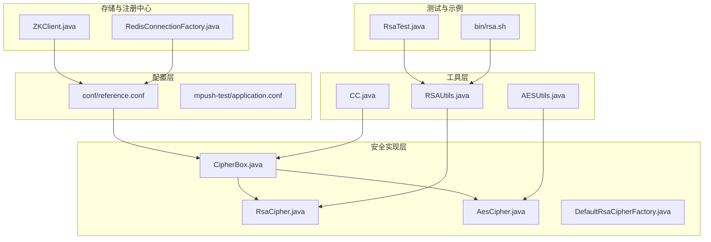
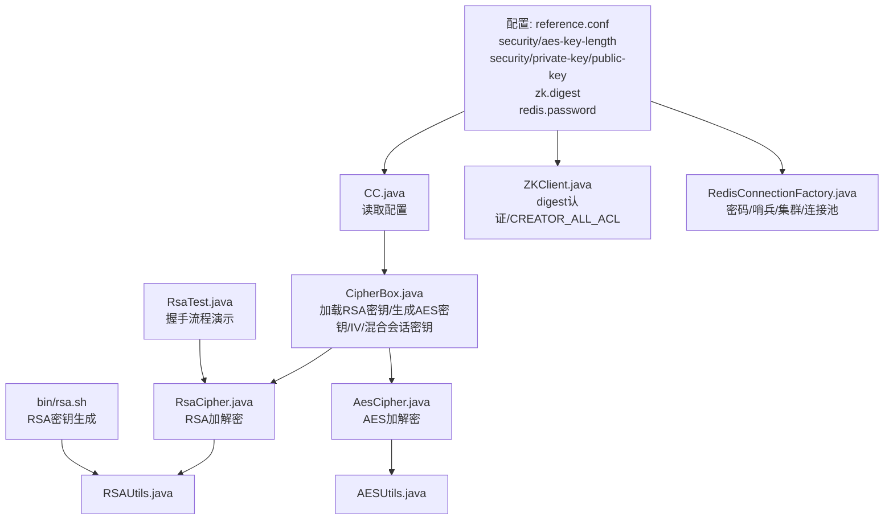
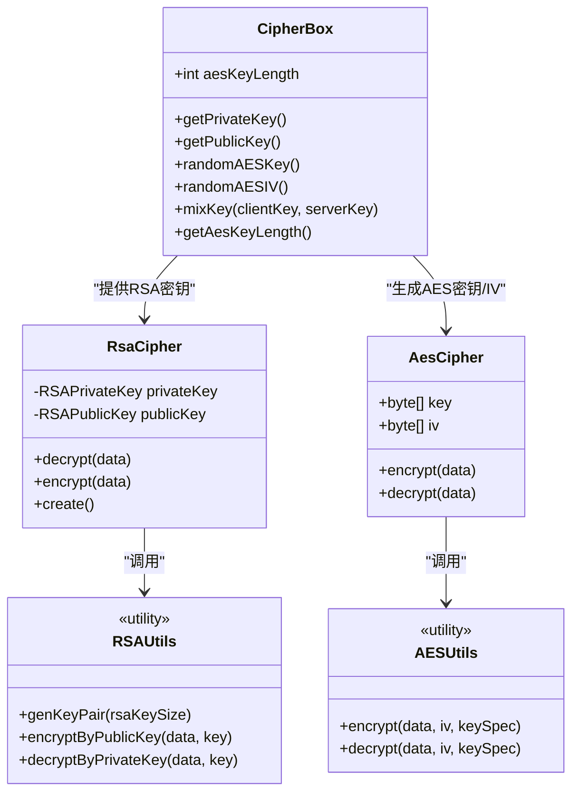
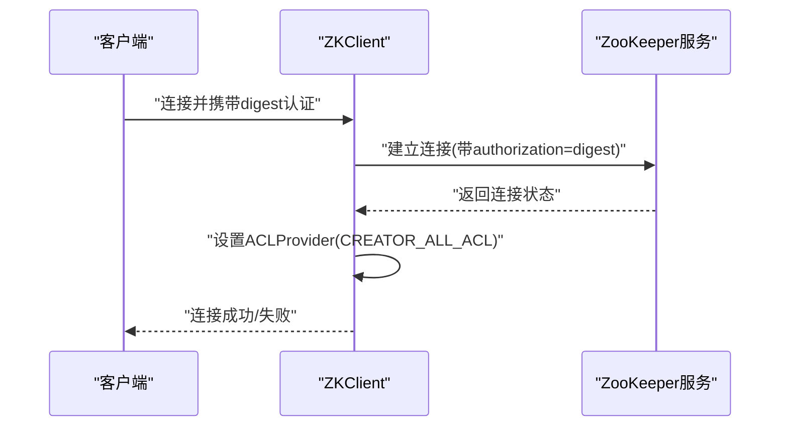
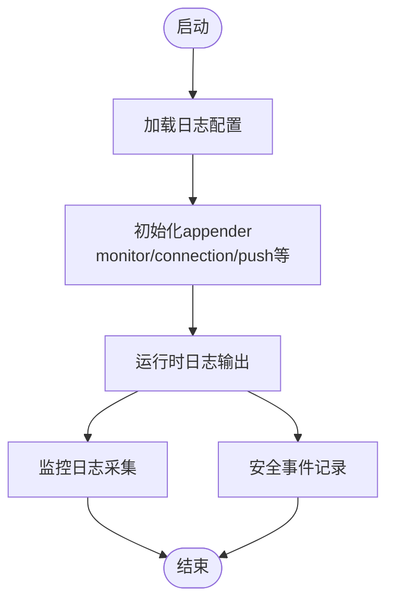
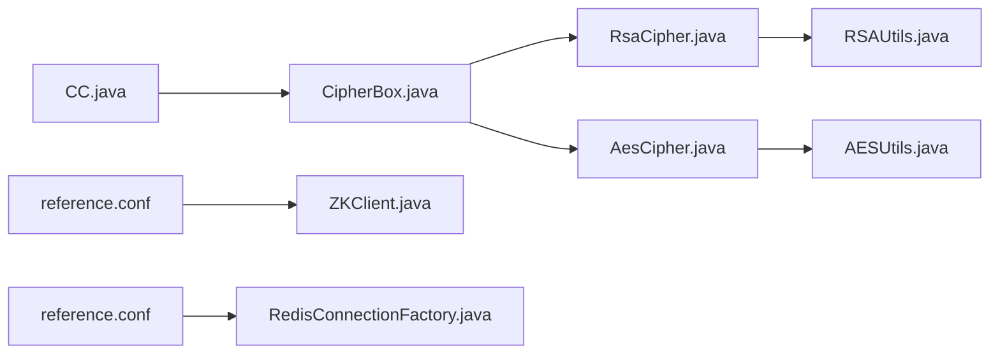

# 安全考虑

<cite>
**本文引用的文件**   
- [conf/reference.conf](file://conf/reference.conf)
- [bin/rsa.sh](file://bin/rsa.sh)
- [mpush-common/src/main/java/com/mpush/common/security/CipherBox.java](file://mpush-common/src/main/java/com/mpush/common/security/CipherBox.java)
- [mpush-common/src/main/java/com/mpush/common/security/AesCipher.java](file://mpush-common/src/main/java/com/mpush/common/security/AesCipher.java)
- [mpush-common/src/main/java/com/mpush/common/security/RsaCipher.java](file://mpush-common/src/main/java/com/mpush/common/security/RsaCipher.java)
- [mpush-common/src/main/java/com/mpush/common/security/DefaultRsaCipherFactory.java](file://mpush-common/src/main/java/com/mpush/common/security/DefaultRsaCipherFactory.java)
- [mpush-tools/src/main/java/com/mpush/tools/crypto/AESUtils.java](file://mpush-tools/src/main/java/com/mpush/tools/crypto/AESUtils.java)
- [mpush-tools/src/main/java/com/mpush/tools/crypto/RSAUtils.java](file://mpush-tools/src/main/java/com/mpush/tools/crypto/RSAUtils.java)
- [mpush-zk/src/main/java/com/mpush/zk/ZKClient.java](file://mpush-zk/src/main/java/com/mpush/zk/ZKClient.java)
- [mpush-cache/src/main/java/com/mpush/cache/redis/connection/RedisConnectionFactory.java](file://mpush-cache/src/main/java/com/mpush/cache/redis/connection/RedisConnectionFactory.java)
- [mpush-test/src/main/java/com/mpush/test/crypto/RsaTest.java](file://mpush-test/src/main/java/com/mpush/test/crypto/RsaTest.java)
- [mpush-test/src/main/resources/application.conf](file://mpush-test/src/main/resources/application.conf)
- [mpush-tools/src/main/java/com/mpush/tools/config/CC.java](file://mpush-tools/src/main/java/com/mpush/tools/config/CC.java)
</cite>

## 目录
1. [简介](#简介)
2. [项目结构](#项目结构)
3. [核心组件](#核心组件)
4. [架构总览](#架构总览)
5. [详细组件分析](#详细组件分析)
6. [依赖分析](#依赖分析)
7. [性能与安全权衡](#性能与安全权衡)
8. [故障排查指南](#故障排查指南)
9. [结论](#结论)
10. [附录](#附录)

## 简介
本文件面向MPush的安全运维与开发人员，围绕“加密配置、权限控制、审计日志、风险评估与常见威胁防护”五个维度，结合代码级实现与配置文件，给出可落地的安全指导与最佳实践。内容涵盖：
- 加密配置：RSA密钥生成与配置、AES密钥长度、加密算法选择与参数
- 权限控制：Zookeeper ACL、Redis访问控制、客户端权限验证
- 审计日志：日志级别与输出、监控日志与连接日志分类
- 风险评估：安全基线检查、渗透测试建议、漏洞扫描要点
- 威胁防护：防重放、防注入、防暴力破解等

## 项目结构
MPush采用模块化设计，安全相关能力主要分布在以下模块：
- 配置层：conf/reference.conf 提供默认安全参数（RSA、AES、ZK、Redis）
- 工具层：mpush-tools 提供加解密工具类（AES/RSA）
- 安全实现层：mpush-common 实现CipherBox、RsaCipher、AesCipher及工厂
- 存储与注册中心：mpush-zk 提供ZK客户端与ACL；mpush-cache 提供Redis连接工厂
- 测试与示例：mpush-test 展示RSA握手流程与配置示例

**图表来源**
- [conf/reference.conf](file://conf/reference.conf#L33-L43)
- [mpush-tools/src/main/java/com/mpush/tools/crypto/AESUtils.java](file://mpush-tools/src/main/java/com/mpush/tools/crypto/AESUtils.java#L42-L50)
- [mpush-tools/src/main/java/com/mpush/tools/crypto/RSAUtils.java](file://mpush-tools/src/main/java/com/mpush/tools/crypto/RSAUtils.java#L52-L62)
- [mpush-common/src/main/java/com/mpush/common/security/CipherBox.java](file://mpush-common/src/main/java/com/mpush/common/security/CipherBox.java#L34-L91)
- [mpush-common/src/main/java/com/mpush/common/security/RsaCipher.java](file://mpush-common/src/main/java/com/mpush/common/security/RsaCipher.java#L33-L59)
- [mpush-common/src/main/java/com/mpush/common/security/AesCipher.java](file://mpush-common/src/main/java/com/mpush/common/security/AesCipher.java#L36-L58)
- [mpush-zk/src/main/java/com/mpush/zk/ZKClient.java](file://mpush-zk/src/main/java/com/mpush/zk/ZKClient.java#L119-L142)
- [mpush-cache/src/main/java/com/mpush/cache/redis/connection/RedisConnectionFactory.java](file://mpush-cache/src/main/java/com/mpush/cache/redis/connection/RedisConnectionFactory.java#L89-L107)
- [mpush-test/src/main/java/com/mpush/test/crypto/RsaTest.java](file://mpush-test/src/main/java/com/mpush/test/crypto/RsaTest.java#L51-L75)
- [bin/rsa.sh](file://bin/rsa.sh#L29-L35)

**章节来源**
- [conf/reference.conf](file://conf/reference.conf#L1-L239)
- [mpush-test/src/main/resources/application.conf](file://mpush-test/src/main/resources/application.conf#L1-L22)

## 核心组件
- 加密配置与参数
  - RSA私钥/公钥：在配置中以字符串形式提供，支持通过内置脚本生成
  - AES密钥长度：通过配置项控制，CipherBox读取并用于会话密钥生成
- 加密实现
  - CipherBox：加载RSA密钥、生成随机AES密钥与IV、混合生成会话密钥
  - RsaCipher：基于RSA公私钥进行加解密
  - AesCipher：基于AES/CBC/PKCS5Padding进行加解密
- 权限控制
  - Zookeeper：启用digest认证并设置CREATOR_ALL_ACL，默认ACL策略
  - Redis：支持密码认证、哨兵/集群模式、连接池配置
- 审计与日志
  - 日志级别与输出：参考配置与测试环境的日志配置
  - 监控日志与连接日志：测试资源中定义了专用appender

**章节来源**
- [conf/reference.conf](file://conf/reference.conf#L33-L43)
- [mpush-tools/src/main/java/com/mpush/tools/crypto/RSAUtils.java](file://mpush-tools/src/main/java/com/mpush/tools/crypto/RSAUtils.java#L52-L62)
- [mpush-tools/src/main/java/com/mpush/tools/crypto/AESUtils.java](file://mpush-tools/src/main/java/com/mpush/tools/crypto/AESUtils.java#L42-L50)
- [mpush-common/src/main/java/com/mpush/common/security/CipherBox.java](file://mpush-common/src/main/java/com/mpush/common/security/CipherBox.java#L34-L91)
- [mpush-common/src/main/java/com/mpush/common/security/RsaCipher.java](file://mpush-common/src/main/java/com/mpush/common/security/RsaCipher.java#L33-L59)
- [mpush-common/src/main/java/com/mpush/common/security/AesCipher.java](file://mpush-common/src/main/java/com/mpush/common/security/AesCipher.java#L36-L58)
- [mpush-zk/src/main/java/com/mpush/zk/ZKClient.java](file://mpush-zk/src/main/java/com/mpush/zk/ZKClient.java#L119-L142)
- [mpush-cache/src/main/java/com/mpush/cache/redis/connection/RedisConnectionFactory.java](file://mpush-cache/src/main/java/com/mpush/cache/redis/connection/RedisConnectionFactory.java#L89-L107)
- [mpush-test/src/main/resources/application.conf](file://mpush-test/src/main/resources/application.conf#L1-L22)

## 架构总览
下图展示了MPush安全相关的关键交互：配置驱动加密参数，CipherBox与工具类完成密钥生成与加解密，ZK与Redis分别承担注册中心与缓存的权限控制。

**图表来源**
- [conf/reference.conf](file://conf/reference.conf#L33-L43)
- [mpush-tools/src/main/java/com/mpush/tools/config/CC.java](file://mpush-tools/src/main/java/com/mpush/tools/config/CC.java#L198-L208)
- [mpush-common/src/main/java/com/mpush/common/security/CipherBox.java](file://mpush-common/src/main/java/com/mpush/common/security/CipherBox.java#L34-L91)
- [mpush-common/src/main/java/com/mpush/common/security/RsaCipher.java](file://mpush-common/src/main/java/com/mpush/common/security/RsaCipher.java#L33-L59)
- [mpush-common/src/main/java/com/mpush/common/security/AesCipher.java](file://mpush-common/src/main/java/com/mpush/common/security/AesCipher.java#L36-L58)
- [mpush-tools/src/main/java/com/mpush/tools/crypto/RSAUtils.java](file://mpush-tools/src/main/java/com/mpush/tools/crypto/RSAUtils.java#L52-L62)
- [mpush-tools/src/main/java/com/mpush/tools/crypto/AESUtils.java](file://mpush-tools/src/main/java/com/mpush/tools/crypto/AESUtils.java#L42-L50)
- [mpush-zk/src/main/java/com/mpush/zk/ZKClient.java](file://mpush-zk/src/main/java/com/mpush/zk/ZKClient.java#L119-L142)
- [mpush-cache/src/main/java/com/mpush/cache/redis/connection/RedisConnectionFactory.java](file://mpush-cache/src/main/java/com/mpush/cache/redis/connection/RedisConnectionFactory.java#L89-L107)
- [mpush-test/src/main/java/com/mpush/test/crypto/RsaTest.java](file://mpush-test/src/main/java/com/mpush/test/crypto/RsaTest.java#L51-L75)
- [bin/rsa.sh](file://bin/rsa.sh#L29-L35)

## 详细组件分析

### 加密配置与实现
- RSA密钥生成与配置
  - 使用内置脚本生成RSA密钥对，支持指定密钥长度
  - 配置文件提供RSA私钥与公钥字符串，需去除头尾标识并合并为单行
- AES密钥长度与算法
  - AES算法采用AES/CBC/PKCS5Padding
  - 密钥长度由配置项决定，CipherBox据此生成随机密钥与IV
- 会话密钥混合
  - 通过CipherBox的混合逻辑生成会话密钥，增强抗统计分析能力

**图表来源**
- [mpush-common/src/main/java/com/mpush/common/security/CipherBox.java](file://mpush-common/src/main/java/com/mpush/common/security/CipherBox.java#L34-L91)
- [mpush-common/src/main/java/com/mpush/common/security/RsaCipher.java](file://mpush-common/src/main/java/com/mpush/common/security/RsaCipher.java#L33-L59)
- [mpush-common/src/main/java/com/mpush/common/security/AesCipher.java](file://mpush-common/src/main/java/com/mpush/common/security/AesCipher.java#L36-L58)
- [mpush-tools/src/main/java/com/mpush/tools/crypto/RSAUtils.java](file://mpush-tools/src/main/java/com/mpush/tools/crypto/RSAUtils.java#L52-L62)
- [mpush-tools/src/main/java/com/mpush/tools/crypto/AESUtils.java](file://mpush-tools/src/main/java/com/mpush/tools/crypto/AESUtils.java#L42-L50)

**章节来源**
- [bin/rsa.sh](file://bin/rsa.sh#L29-L35)
- [conf/reference.conf](file://conf/reference.conf#L33-L43)
- [mpush-tools/src/main/java/com/mpush/tools/crypto/RSAUtils.java](file://mpush-tools/src/main/java/com/mpush/tools/crypto/RSAUtils.java#L87-L99)
- [mpush-tools/src/main/java/com/mpush/tools/crypto/AESUtils.java](file://mpush-tools/src/main/java/com/mpush/tools/crypto/AESUtils.java#L42-L50)
- [mpush-common/src/main/java/com/mpush/common/security/CipherBox.java](file://mpush-common/src/main/java/com/mpush/common/security/CipherBox.java#L34-L91)
- [mpush-common/src/main/java/com/mpush/common/security/AesCipher.java](file://mpush-common/src/main/java/com/mpush/common/security/AesCipher.java#L36-L58)
- [mpush-common/src/main/java/com/mpush/common/security/RsaCipher.java](file://mpush-common/src/main/java/com/mpush/common/security/RsaCipher.java#L33-L59)

### 权限控制机制
- Zookeeper ACL
  - 启用digest认证，使用配置中的digest作为授权凭据
  - 设置默认ACL为CREATOR_ALL_ACL，确保创建者拥有完全权限
- Redis访问控制
  - 支持密码认证；在集群模式下不支持密码保护的配置
  - 提供哨兵与集群模式配置入口，便于高可用部署

**图表来源**
- [mpush-zk/src/main/java/com/mpush/zk/ZKClient.java](file://mpush-zk/src/main/java/com/mpush/zk/ZKClient.java#L119-L142)
- [conf/reference.conf](file://conf/reference.conf#L125-L141)

**章节来源**
- [mpush-zk/src/main/java/com/mpush/zk/ZKClient.java](file://mpush-zk/src/main/java/com/mpush/zk/ZKClient.java#L119-L142)
- [conf/reference.conf](file://conf/reference.conf#L125-L141)
- [mpush-cache/src/main/java/com/mpush/cache/redis/connection/RedisConnectionFactory.java](file://mpush-cache/src/main/java/com/mpush/cache/redis/connection/RedisConnectionFactory.java#L89-L107)

### 审计日志与监控
- 日志配置
  - 通过配置文件设置日志级别与输出路径
  - 测试资源中定义了monitor与connection专用appender，便于区分审计与连接事件
- 监控与性能
  - 配置中提供监控开关、慢日志阈值等参数，有助于安全事件与异常行为的识别

**图表来源**
- [conf/reference.conf](file://conf/reference.conf#L17-L20)
- [mpush-test/src/main/resources/application.conf](file://mpush-test/src/main/resources/application.conf#L1-L22)

**章节来源**
- [conf/reference.conf](file://conf/reference.conf#L17-L20)
- [mpush-test/src/main/resources/application.conf](file://mpush-test/src/main/resources/application.conf#L1-L22)

### 风险评估与威胁防护
- 风险评估实践
  - 安全基线检查：核对密钥长度、算法填充、ACL策略、密码强度
  - 渗透测试：模拟重放、注入、暴力破解场景，验证防护有效性
  - 漏洞扫描：定期扫描ZK/Redis暴露面与弱口令
- 威胁防护建议
  - 防重放：引入时间戳与随机nonce，服务端严格校验窗口
  - 防注入：对输入进行白名单过滤与长度限制
  - 防暴力破解：结合限流与账户锁定策略

[本节为通用安全建议，不直接分析具体文件，故不附“章节来源”]

## 依赖分析
- 组件耦合
  - CipherBox依赖配置读取与RSA/AES工具类
  - RsaCipher/AesCipher分别依赖RSAUtils/AESUtils
  - ZKClient依赖Curator框架与ZK配置
  - RedisConnectionFactory依赖Jedis与配置
- 外部依赖
  - Zookeeper Curator：提供ACL与连接管理
  - Jedis：提供Redis连接池与集群/哨兵支持

**图表来源**
- [mpush-tools/src/main/java/com/mpush/tools/config/CC.java](file://mpush-tools/src/main/java/com/mpush/tools/config/CC.java#L198-L208)
- [mpush-common/src/main/java/com/mpush/common/security/CipherBox.java](file://mpush-common/src/main/java/com/mpush/common/security/CipherBox.java#L34-L91)
- [mpush-common/src/main/java/com/mpush/common/security/RsaCipher.java](file://mpush-common/src/main/java/com/mpush/common/security/RsaCipher.java#L33-L59)
- [mpush-common/src/main/java/com/mpush/common/security/AesCipher.java](file://mpush-common/src/main/java/com/mpush/common/security/AesCipher.java#L36-L58)
- [mpush-zk/src/main/java/com/mpush/zk/ZKClient.java](file://mpush-zk/src/main/java/com/mpush/zk/ZKClient.java#L119-L142)
- [mpush-cache/src/main/java/com/mpush/cache/redis/connection/RedisConnectionFactory.java](file://mpush-cache/src/main/java/com/mpush/cache/redis/connection/RedisConnectionFactory.java#L89-L107)

**章节来源**
- [mpush-tools/src/main/java/com/mpush/tools/config/CC.java](file://mpush-tools/src/main/java/com/mpush/tools/config/CC.java#L198-L208)
- [conf/reference.conf](file://conf/reference.conf#L125-L169)

## 性能与安全权衡
- RSA与AES的选择
  - RSA用于密钥交换，AES用于数据加密；合理设置AES密钥长度与CBC模式IV
- 连接与会话
  - 合理配置ZK/Redis连接池与超时，避免资源泄露导致拒绝服务
- 日志与监控
  - 开启必要的监控与慢日志，平衡性能与可观测性

[本节为通用指导，不直接分析具体文件，故不附“章节来源”]

## 故障排查指南
- RSA密钥加载失败
  - 检查配置中的私钥/公钥格式是否正确（去除头尾标识、合并为单行）
  - 使用内置脚本生成新密钥对并替换配置
- AES加解密异常
  - 核对AES密钥长度与IV一致性，确保双方使用相同参数
- ZK连接失败或权限不足
  - 确认digest认证配置与ACL策略一致
- Redis无法连接或认证失败
  - 核对密码、主机与端口、集群/哨兵配置

**章节来源**
- [conf/reference.conf](file://conf/reference.conf#L33-L43)
- [bin/rsa.sh](file://bin/rsa.sh#L29-L35)
- [mpush-zk/src/main/java/com/mpush/zk/ZKClient.java](file://mpush-zk/src/main/java/com/mpush/zk/ZKClient.java#L119-L142)
- [mpush-cache/src/main/java/com/mpush/cache/redis/connection/RedisConnectionFactory.java](file://mpush-cache/src/main/java/com/mpush/cache/redis/connection/RedisConnectionFactory.java#L89-L107)

## 结论
MPush在配置层提供了明确的安全参数，在工具与实现层提供了完善的加解密能力，并在ZK与Redis层面提供了基础的访问控制。结合本文的安全指导与最佳实践，可在生产环境中进一步强化安全基线、完善审计与监控、提升对常见威胁的防护能力。

## 附录
- 配置示例与脚本
  - 参考测试配置文件中的ZK/Redis示例
  - 使用内置脚本生成RSA密钥对

**章节来源**
- [mpush-test/src/main/resources/application.conf](file://mpush-test/src/main/resources/application.conf#L7-L11)
- [bin/rsa.sh](file://bin/rsa.sh#L29-L35)