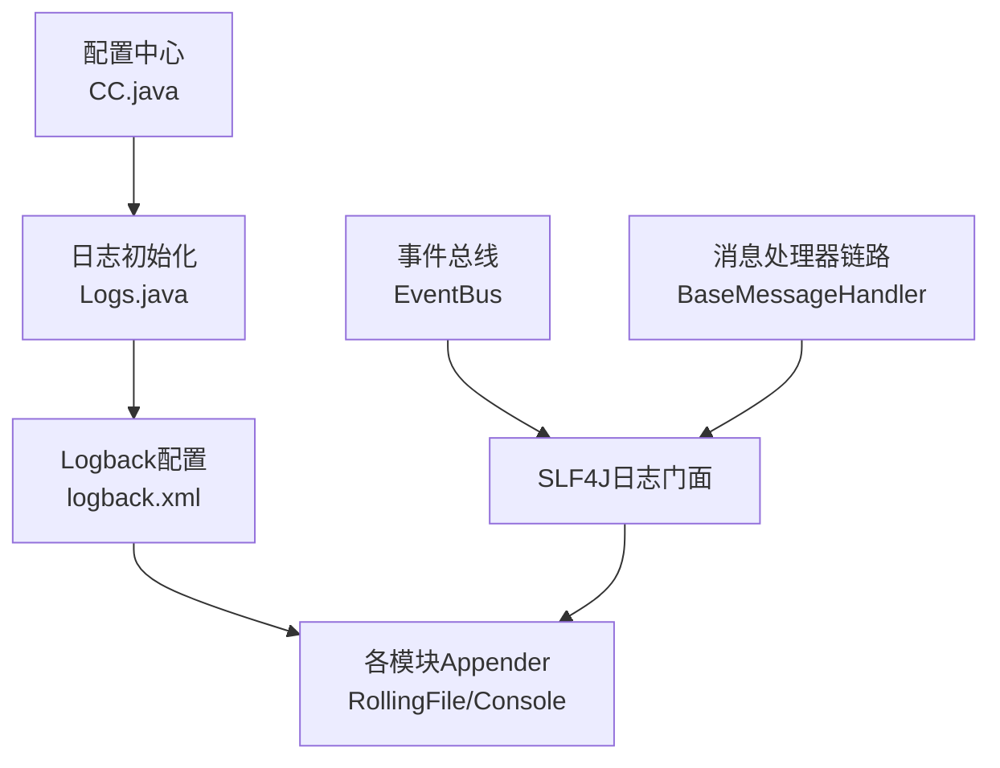
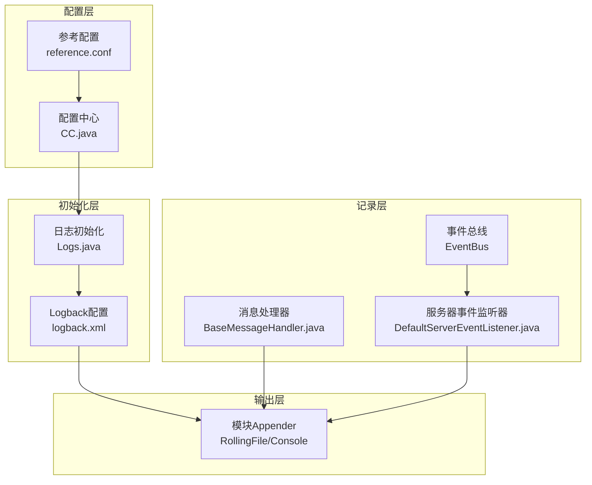
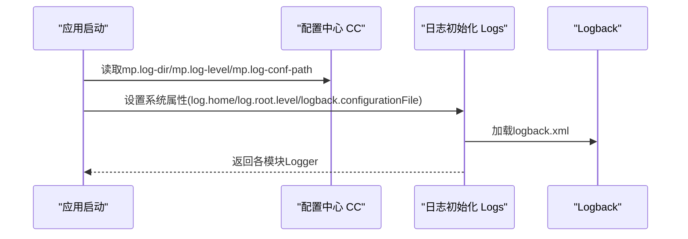
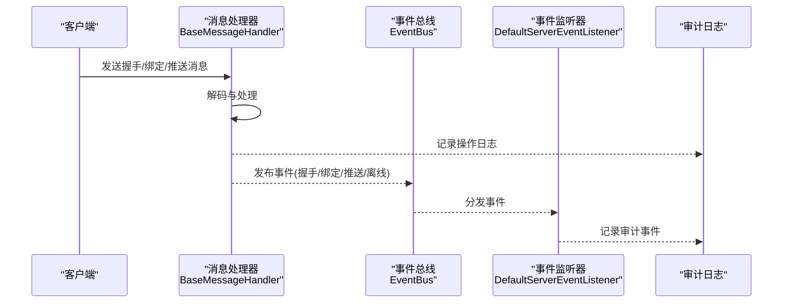
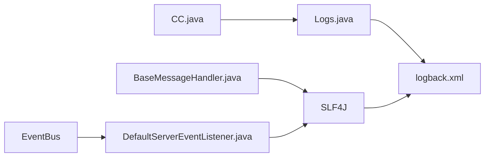

# 审计日志

<cite>
**本文引用的文件**
- [mpush-boot/src/main/resources/logback.xml](file://mpush-boot/src/main/resources/logback.xml)
- [mpush-tools/src/main/java/com/mpush/tools/log/Logs.java](file://mpush-tools/src/main/java/com/mpush/tools/log/Logs.java)
- [mpush-tools/src/main/java/com/mpush/tools/config/CC.java](file://mpush-tools/src/main/java/com/mpush/tools/config/CC.java)
- [conf/reference.conf](file://conf/reference.conf)
- [mpush-api/src/main/java/com/mpush/api/event/UserOnlineEvent.java](file://mpush-api/src/main/java/com/mpush/api/event/UserOnlineEvent.java)
- [mpush-api/src/main/java/com/mpush/api/event/UserOfflineEvent.java](file://mpush-api/src/main/java/com/mpush/api/event/UserOfflineEvent.java)
- [mpush-api/src/main/java/com/mpush/api/event/HandshakeEvent.java](file://mpush-api/src/main/java/com/mpush/api/event/HandshakeEvent.java)
- [mpush-api/src/main/java/com/mpush/api/common/ServerEventListener.java](file://mpush-api/src/main/java/com/mpush/api/common/ServerEventListener.java)
- [mpush-core/src/main/java/com/mpush/core/server/DefaultServerEventListener.java](file://mpush-core/src/main/java/com/mpush/core/server/DefaultServerEventListener.java)
- [mpush-common/src/main/java/com/mpush/common/handler/BaseMessageHandler.java](file://mpush-common/src/main/java/com/mpush/common/handler/BaseMessageHandler.java)
- [mpush-common/src/main/java/com/mpush/common/message/BaseMessage.java](file://mpush-common/src/main/java/com/mpush/common/message/BaseMessage.java)
- [mpush-test/src/main/resources/logback.xml](file://mpush-test/src/main/resources/logback.xml)
</cite>

## 目录
1. [简介](#简介)
2. [项目结构](#项目结构)
3. [核心组件](#核心组件)
4. [架构总览](#架构总览)
5. [详细组件分析](#详细组件分析)
6. [依赖分析](#依赖分析)
7. [性能考虑](#性能考虑)
8. [故障排查指南](#故障排查指南)
9. [结论](#结论)
10. [附录](#附录)

## 简介
本技术文档围绕MPush的审计日志体系，系统阐述日志配置与使用、操作日志记录策略（用户登录登出、消息发送、系统配置变更）、安全事件监控（异常登录尝试、非法操作、系统异常告警），以及运维层面的日志轮转、存储优化与查询检索最佳实践。文档同时给出基于源码的实现路径与流程图示，帮助开发者在业务代码中正确集成审计日志，并利用日志数据进行安全分析与问题排查。

## 项目结构
MPush的日志子系统主要由以下模块协同构成：
- 配置中心：负责读取日志相关配置（日志级别、日志目录、日志配置文件路径）。
- 日志初始化：统一设置Logback属性，加载对应环境下的logback.xml。
- 日志输出：按模块划分独立Appender，支持滚动文件与控制台输出。
- 事件总线：通过Guava EventBus发布系统事件，便于在事件监听器中记录审计日志。
- 消息处理链路：在消息解码与处理阶段埋点，记录关键操作与异常。

图表来源
- [mpush-tools/src/main/java/com/mpush/tools/config/CC.java](file://mpush-tools/src/main/java/com/mpush/tools/config/CC.java#L55-L60)
- [mpush-tools/src/main/java/com/mpush/tools/log/Logs.java](file://mpush-tools/src/main/java/com/mpush/tools/log/Logs.java#L36-L45)
- [mpush-boot/src/main/resources/logback.xml](file://mpush-boot/src/main/resources/logback.xml#L1-L231)
- [mpush-common/src/main/java/com/mpush/common/handler/BaseMessageHandler.java](file://mpush-common/src/main/java/com/mpush/common/handler/BaseMessageHandler.java#L42-L53)

章节来源
- [mpush-tools/src/main/java/com/mpush/tools/config/CC.java](file://mpush-tools/src/main/java/com/mpush/tools/config/CC.java#L55-L60)
- [mpush-tools/src/main/java/com/mpush/tools/log/Logs.java](file://mpush-tools/src/main/java/com/mpush/tools/log/Logs.java#L36-L45)
- [mpush-boot/src/main/resources/logback.xml](file://mpush-boot/src/main/resources/logback.xml#L1-L231)

## 核心组件
- 配置中心CC：提供日志目录、日志级别、日志配置文件路径等键值，供日志初始化使用。
- 日志初始化Logs：在应用启动时设置Logback系统属性，并获取各类模块日志记录器。
- Logback配置：按模块划分Appender，支持按级别过滤与时间滚动策略。
- 事件总线EventBus：发布系统事件（在线、离线、握手等），事件监听器可在此记录审计日志。
- 消息处理链路：在消息解码与处理阶段埋点，记录关键操作与异常。

章节来源
- [mpush-tools/src/main/java/com/mpush/tools/config/CC.java](file://mpush-tools/src/main/java/com/mpush/tools/config/CC.java#L55-L60)
- [mpush-tools/src/main/java/com/mpush/tools/log/Logs.java](file://mpush-tools/src/main/java/com/mpush/tools/log/Logs.java#L36-L64)
- [mpush-boot/src/main/resources/logback.xml](file://mpush-boot/src/main/resources/logback.xml#L1-L231)
- [mpush-api/src/main/java/com/mpush/api/common/ServerEventListener.java](file://mpush-api/src/main/java/com/mpush/api/common/ServerEventListener.java#L47-L85)
- [mpush-common/src/main/java/com/mpush/common/handler/BaseMessageHandler.java](file://mpush-common/src/main/java/com/mpush/common/handler/BaseMessageHandler.java#L42-L53)

## 架构总览
MPush的审计日志架构以“配置驱动 + 模块化Appender + 事件驱动记录”为核心，形成从配置到输出的一体化闭环。

图表来源
- [conf/reference.conf](file://conf/reference.conf#L17-L21)
- [mpush-tools/src/main/java/com/mpush/tools/config/CC.java](file://mpush-tools/src/main/java/com/mpush/tools/config/CC.java#L55-L60)
- [mpush-tools/src/main/java/com/mpush/tools/log/Logs.java](file://mpush-tools/src/main/java/com/mpush/tools/log/Logs.java#L36-L45)
- [mpush-boot/src/main/resources/logback.xml](file://mpush-boot/src/main/resources/logback.xml#L1-L231)
- [mpush-common/src/main/java/com/mpush/common/handler/BaseMessageHandler.java](file://mpush-common/src/main/java/com/mpush/common/handler/BaseMessageHandler.java#L42-L53)
- [mpush-core/src/main/java/com/mpush/core/server/DefaultServerEventListener.java](file://mpush-core/src/main/java/com/mpush/core/server/DefaultServerEventListener.java#L31-L38)

## 详细组件分析

### 日志配置与使用
- 配置项来源
  - 日志级别：mp.log-level
  - 日志目录：mp.log-dir
  - 日志配置文件路径：mp.log-conf-path
- 初始化流程
  - 启动时设置Logback系统属性（log.home、log.root.level、logback.configurationFile）
  - 获取各模块日志记录器（console、mpush.conn.log、mpush.push.log、mpush.heartbeat.log、mpush.http.log、mpush.monitor.log、mpush.cache.log、mpush.srd.log、mpush.profile.log）

图表来源
- [mpush-tools/src/main/java/com/mpush/tools/config/CC.java](file://mpush-tools/src/main/java/com/mpush/tools/config/CC.java#L55-L60)
- [mpush-tools/src/main/java/com/mpush/tools/log/Logs.java](file://mpush-tools/src/main/java/com/mpush/tools/log/Logs.java#L36-L45)
- [mpush-boot/src/main/resources/logback.xml](file://mpush-boot/src/main/resources/logback.xml#L1-L231)

章节来源
- [conf/reference.conf](file://conf/reference.conf#L17-L21)
- [mpush-tools/src/main/java/com/mpush/tools/config/CC.java](file://mpush-tools/src/main/java/com/mpush/tools/config/CC.java#L55-L60)
- [mpush-tools/src/main/java/com/mpush/tools/log/Logs.java](file://mpush-tools/src/main/java/com/mpush/tools/log/Logs.java#L36-L64)
- [mpush-boot/src/main/resources/logback.xml](file://mpush-boot/src/main/resources/logback.xml#L1-L231)

### 日志输出格式与模块化Appender
- 输出格式
  - 根日志：包含时间、线程、级别、Logger名称、消息
  - 控制台：包含时间、消息
  - 各模块：包含时间、消息
- 滚动策略
  - 按日期滚动，保留历史天数（如mpush.log保留10天；info-mpush.log保留3天；debug-mpush.log保留3天；conn-mpush.log、push-mpush.log、heartbeat-mpush.log保留30天；cache-mpush.log、http-mpush.log、srd-mpush.log、profile-mpush.log保留5/10天）
- 级别过滤
  - info-mpush.log与debug-mpush.log分别仅接收对应级别的日志

章节来源
- [mpush-boot/src/main/resources/logback.xml](file://mpush-boot/src/main/resources/logback.xml#L8-L231)

### 操作日志记录策略
- 用户登录登出
  - 登录：握手成功与绑定用户成功/失败事件
  - 登出：用户离线事件
- 消息发送记录
  - 在消息处理链路中记录发送与接收的关键信息（如发送内容长度、会话ID、目标用户等）
- 系统配置变更记录
  - 通过事件监听器记录路由变更、踢人等系统级事件

图表来源
- [mpush-common/src/main/java/com/mpush/common/handler/BaseMessageHandler.java](file://mpush-common/src/main/java/com/mpush/common/handler/BaseMessageHandler.java#L42-L53)
- [mpush-api/src/main/java/com/mpush/api/event/HandshakeEvent.java](file://mpush-api/src/main/java/com/mpush/api/event/HandshakeEvent.java#L29-L37)
- [mpush-api/src/main/java/com/mpush/api/event/UserOnlineEvent.java](file://mpush-api/src/main/java/com/mpush/api/event/UserOnlineEvent.java#L27-L46)
- [mpush-api/src/main/java/com/mpush/api/event/UserOfflineEvent.java](file://mpush-api/src/main/java/com/mpush/api/event/UserOfflineEvent.java#L27-L44)
- [mpush-api/src/main/java/com/mpush/api/common/ServerEventListener.java](file://mpush-api/src/main/java/com/mpush/api/common/ServerEventListener.java#L47-L85)
- [mpush-core/src/main/java/com/mpush/core/server/DefaultServerEventListener.java](file://mpush-core/src/main/java/com/mpush/core/server/DefaultServerEventListener.java#L31-L38)

章节来源
- [mpush-common/src/main/java/com/mpush/common/handler/BaseMessageHandler.java](file://mpush-common/src/main/java/com/mpush/common/handler/BaseMessageHandler.java#L42-L53)
- [mpush-api/src/main/java/com/mpush/api/event/HandshakeEvent.java](file://mpush-api/src/main/java/com/mpush/api/event/HandshakeEvent.java#L29-L37)
- [mpush-api/src/main/java/com/mpush/api/event/UserOnlineEvent.java](file://mpush-api/src/main/java/com/mpush/api/event/UserOnlineEvent.java#L27-L46)
- [mpush-api/src/main/java/com/mpush/api/event/UserOfflineEvent.java](file://mpush-api/src/main/java/com/mpush/api/event/UserOfflineEvent.java#L27-L44)
- [mpush-api/src/main/java/com/mpush/api/common/ServerEventListener.java](file://mpush-api/src/main/java/com/mpush/api/common/ServerEventListener.java#L47-L85)
- [mpush-core/src/main/java/com/mpush/core/server/DefaultServerEventListener.java](file://mpush-core/src/main/java/com/mpush/core/server/DefaultServerEventListener.java#L31-L38)

### 安全事件监控
- 异常登录尝试检测
  - 通过握手事件与绑定事件记录尝试与结果，结合会话上下文（设备ID、用户ID、客户端版本、操作系统等）进行异常识别
- 非法操作警告
  - 在消息处理链路中对异常包体或越权行为进行告警记录
- 系统异常告警
  - 使用模块化Appender输出异常日志，结合监控配置（dump-stack、profile-enabled等）进行性能与异常追踪

章节来源
- [mpush-api/src/main/java/com/mpush/api/connection/SessionContext.java](file://mpush-api/src/main/java/com/mpush/api/connection/SessionContext.java#L45-L104)
- [mpush-tools/src/main/java/com/mpush/tools/config/CC.java](file://mpush-tools/src/main/java/com/mpush/tools/config/CC.java#L345-L353)

### 日志分析与处理最佳实践
- 日志轮转策略
  - 基于时间滚动，合理设置maxHistory，平衡存储与回溯需求
- 日志存储优化
  - 区分根日志、info日志、debug日志，按需启用与保留周期
  - 对高频模块（连接、推送、心跳）设置较长保留周期，便于问题定位
- 日志查询与检索
  - 使用模块化Appender输出，便于按模块检索
  - 结合时间戳与会话ID/用户ID字段进行关联分析

章节来源
- [mpush-boot/src/main/resources/logback.xml](file://mpush-boot/src/main/resources/logback.xml#L12-L170)

## 依赖分析
- 配置中心CC提供日志配置键值，被日志初始化Logs使用
- 日志初始化Logs加载Logback配置并返回各模块Logger
- 消息处理器在处理链路中直接输出审计日志
- 事件总线与事件监听器共同完成系统级事件的审计记录

图表来源
- [mpush-tools/src/main/java/com/mpush/tools/config/CC.java](file://mpush-tools/src/main/java/com/mpush/tools/config/CC.java#L55-L60)
- [mpush-tools/src/main/java/com/mpush/tools/log/Logs.java](file://mpush-tools/src/main/java/com/mpush/tools/log/Logs.java#L36-L45)
- [mpush-boot/src/main/resources/logback.xml](file://mpush-boot/src/main/resources/logback.xml#L1-L231)
- [mpush-common/src/main/java/com/mpush/common/handler/BaseMessageHandler.java](file://mpush-common/src/main/java/com/mpush/common/handler/BaseMessageHandler.java#L42-L53)
- [mpush-core/src/main/java/com/mpush/core/server/DefaultServerEventListener.java](file://mpush-core/src/main/java/com/mpush/core/server/DefaultServerEventListener.java#L31-L38)

章节来源
- [mpush-tools/src/main/java/com/mpush/tools/config/CC.java](file://mpush-tools/src/main/java/com/mpush/tools/config/CC.java#L55-L60)
- [mpush-tools/src/main/java/com/mpush/tools/log/Logs.java](file://mpush-tools/src/main/java/com/mpush/tools/log/Logs.java#L36-L64)
- [mpush-boot/src/main/resources/logback.xml](file://mpush-boot/src/main/resources/logback.xml#L1-L231)
- [mpush-common/src/main/java/com/mpush/common/handler/BaseMessageHandler.java](file://mpush-common/src/main/java/com/mpush/common/handler/BaseMessageHandler.java#L42-L53)
- [mpush-core/src/main/java/com/mpush/core/server/DefaultServerEventListener.java](file://mpush-core/src/main/java/com/mpush/core/server/DefaultServerEventListener.java#L31-L38)

## 性能考虑
- 滚动日志的IO开销：合理设置滚动周期与保留天数，避免频繁IO
- 日志级别：生产环境建议使用warn/info级别，减少debug日志带来的性能损耗
- 模块化输出：按模块分离日志，便于针对性优化与限流

## 故障排查指南
- 日志未生效
  - 检查mp.log-conf-path是否指向正确的logback.xml
  - 确认log.home与log.root.level系统属性已正确设置
- 日志过多或过少
  - 调整mp.log-level与各模块logger级别
  - 检查RollingPolicy与maxHistory配置
- 事件未记录
  - 确认事件监听器已注册到EventBus
  - 检查事件监听器方法签名与注解（@Subscribe/@AllowConcurrentEvents）

章节来源
- [mpush-tools/src/main/java/com/mpush/tools/log/Logs.java](file://mpush-tools/src/main/java/com/mpush/tools/log/Logs.java#L36-L45)
- [mpush-boot/src/main/resources/logback.xml](file://mpush-boot/src/main/resources/logback.xml#L182-L231)
- [mpush-api/src/main/java/com/mpush/api/common/ServerEventListener.java](file://mpush-api/src/main/java/com/mpush/api/common/ServerEventListener.java#L47-L85)

## 结论
MPush的审计日志体系通过“配置驱动 + 模块化Appender + 事件驱动记录”的方式，实现了对用户登录登出、消息发送、系统配置变更等关键操作的可观测性，并提供了安全事件监控与运维日志管理能力。结合合理的轮转与存储策略，可有效支撑安全分析与问题排查。

## 附录
- 示例：在业务代码中正确使用审计日志
  - 在消息处理链路中记录关键操作与异常
  - 在事件监听器中记录系统级事件
  - 使用模块化Appender输出不同类型的审计日志

章节来源
- [mpush-common/src/main/java/com/mpush/common/handler/BaseMessageHandler.java](file://mpush-common/src/main/java/com/mpush/common/handler/BaseMessageHandler.java#L42-L53)
- [mpush-api/src/main/java/com/mpush/api/common/ServerEventListener.java](file://mpush-api/src/main/java/com/mpush/api/common/ServerEventListener.java#L47-L85)
- [mpush-boot/src/main/resources/logback.xml](file://mpush-boot/src/main/resources/logback.xml#L1-L231)