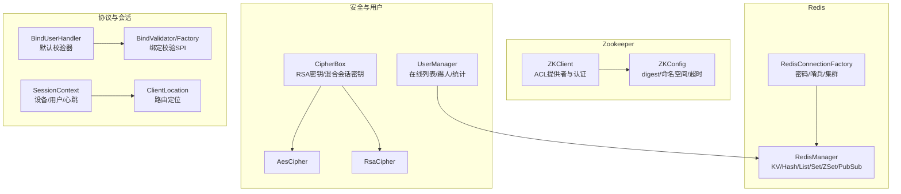
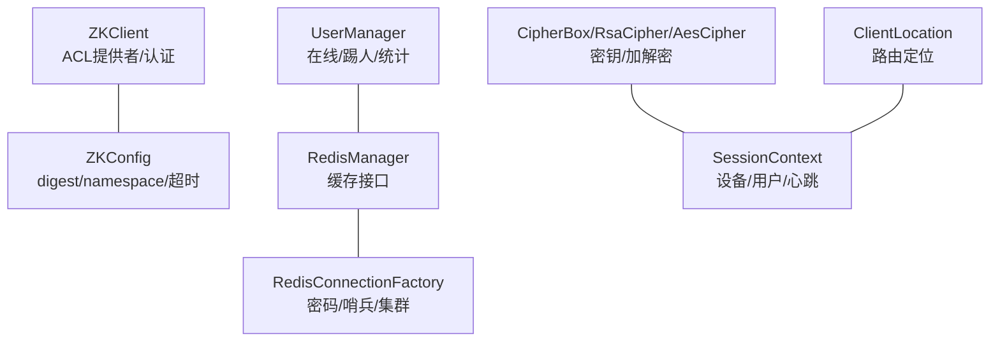
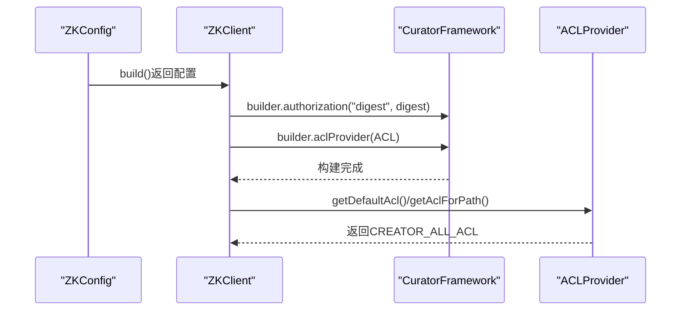
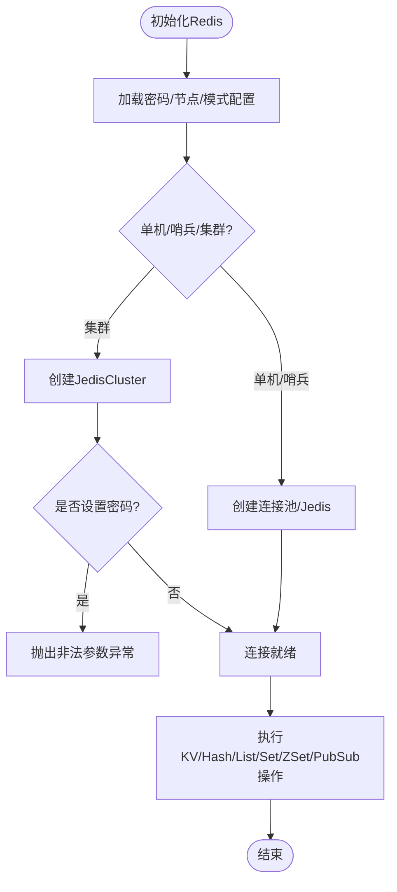
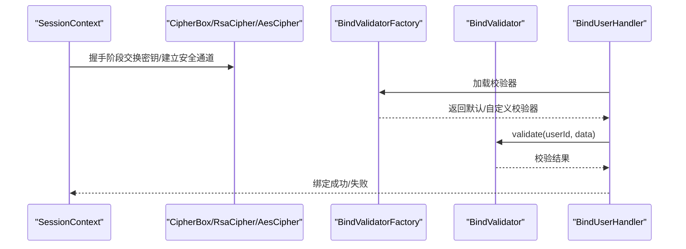
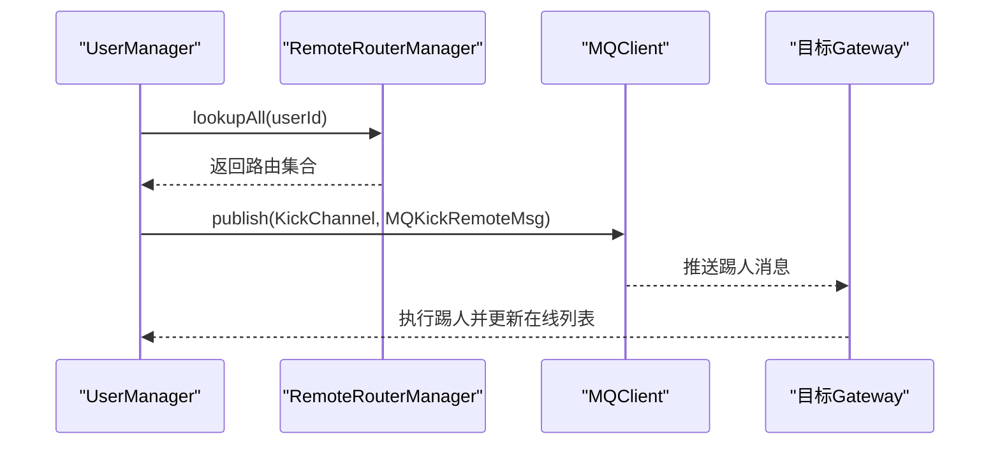
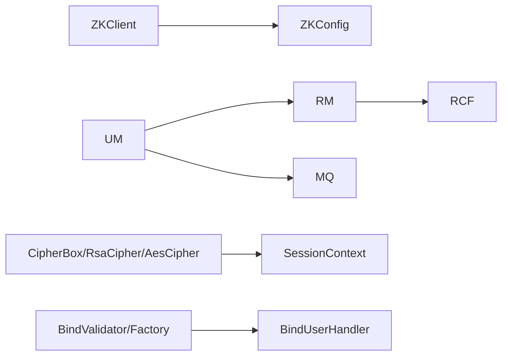

# 权限控制

<cite>
**本文引用的文件**
- [ZKClient.java](file://mpush-zk/src/main/java/com/mpush/zk/ZKClient.java)
- [ZKConfig.java](file://mpush-zk/src/main/java/com/mpush/zk/ZKConfig.java)
- [RedisConnectionFactory.java](file://mpush-cache/src/main/java/com/mpush/cache/redis/connection/RedisConnectionFactory.java)
- [RedisManager.java](file://mpush-cache/src/main/java/com/mpush/cache/redis/manager/RedisManager.java)
- [CipherBox.java](file://mpush-common/src/main/java/com/mpush/common/security/CipherBox.java)
- [AesCipher.java](file://mpush-common/src/main/java/com/mpush/common/security/AesCipher.java)
- [RsaCipher.java](file://mpush-common/src/main/java/com/mpush/common/security/RsaCipher.java)
- [UserManager.java](file://mpush-common/src/main/java/com/mpush/common/user/UserManager.java)
- [reference.conf](file://conf/reference.conf)
- [application.conf](file://mpush-test/src/main/resources/application.conf)
- [BindValidator.java](file://mpush-api/src/main/java/com/mpush/api/spi/handler/BindValidator.java)
- [BindValidatorFactory.java](file://mpush-api/src/main/java/com/mpush/api/spi/handler/BindValidatorFactory.java)
- [BindUserHandler.java](file://mpush-core/src/main/java/com/mpush/core/handler/BindUserHandler.java)
- [SessionContext.java](file://mpush-api/src/main/java/com/mpush/api/connection/SessionContext.java)
- [ClientLocation.java](file://mpush-api/src/main/java/com/mpush/api/router/ClientLocation.java)
- [GatewayKickUserMessage.java](file://mpush-common/src/main/java/com/mpush/common/message/gateway/GatewayKickUserMessage.java)
- [GatewayPushMessage.java](file://mpush-common/src/main/java/com/mpush/common/message/gateway/GatewayPushMessage.java)
</cite>

## 目录
1. [简介](#简介)
2. [项目结构](#项目结构)
3. [核心组件](#核心组件)
4. [架构总览](#架构总览)
5. [详细组件分析](#详细组件分析)
6. [依赖分析](#依赖分析)
7. [性能考虑](#性能考虑)
8. [故障排查指南](#故障排查指南)
9. [结论](#结论)
10. [附录](#附录)

## 简介
本文件面向MPush权限控制体系，围绕以下目标展开：
- Zookeeper ACL权限设置：配置digest认证、权限级别（读/写/创建/删除/管理员）以及ACL列表的构建与管理。
- Redis访问控制：密码认证、命令过滤、连接限制等安全配置选项的使用与实现。
- 客户端权限验证：用户身份认证、会话令牌校验、权限级别检查的多层权限管理。
- 实战部署：提供配置示例与代码路径指引，结合UserManager实现用户权限的动态管理与权限变更处理。

## 项目结构
MPush权限控制涉及多个模块：
- mpush-zk：Zookeeper客户端与ACL配置。
- mpush-cache：Redis连接工厂与缓存管理器。
- mpush-common：加密盒、对称/非对称加密、用户管理。
- mpush-api：协议、会话上下文、路由位置信息、SPI扩展点。
- mpush-core：握手、绑定、踢人等核心处理器。
- conf：系统参考配置，包含ZK/Redis/安全等关键参数。

图表来源
- [ZKClient.java](file://mpush-zk/src/main/java/com/mpush/zk/ZKClient.java#L111-L145)
- [ZKConfig.java](file://mpush-zk/src/main/java/com/mpush/zk/ZKConfig.java#L54-L64)
- [RedisConnectionFactory.java](file://mpush-cache/src/main/java/com/mpush/cache/redis/connection/RedisConnectionFactory.java#L89-L107)
- [RedisManager.java](file://mpush-cache/src/main/java/com/mpush/cache/redis/manager/RedisManager.java#L45-L57)
- [CipherBox.java](file://mpush-common/src/main/java/com/mpush/common/security/CipherBox.java#L35-L63)
- [AesCipher.java](file://mpush-common/src/main/java/com/mpush/common/security/AesCipher.java#L36-L58)
- [RsaCipher.java](file://mpush-common/src/main/java/com/mpush/common/security/RsaCipher.java#L33-L59)
- [UserManager.java](file://mpush-common/src/main/java/com/mpush/common/user/UserManager.java#L45-L58)
- [BindValidator.java](file://mpush-api/src/main/java/com/mpush/api/spi/handler/BindValidator.java#L29-L31)
- [BindValidatorFactory.java](file://mpush-api/src/main/java/com/mpush/api/spi/handler/BindValidatorFactory.java#L30-L33)
- [BindUserHandler.java](file://mpush-core/src/main/java/com/mpush/core/handler/BindUserHandler.java#L175-L183)
- [SessionContext.java](file://mpush-api/src/main/java/com/mpush/api/connection/SessionContext.java#L65-L76)
- [ClientLocation.java](file://mpush-api/src/main/java/com/mpush/api/router/ClientLocation.java#L117-L122)

章节来源
- [ZKClient.java](file://mpush-zk/src/main/java/com/mpush/zk/ZKClient.java#L111-L145)
- [ZKConfig.java](file://mpush-zk/src/main/java/com/mpush/zk/ZKConfig.java#L54-L64)
- [RedisConnectionFactory.java](file://mpush-cache/src/main/java/com/mpush/cache/redis/connection/RedisConnectionFactory.java#L89-L107)
- [RedisManager.java](file://mpush-cache/src/main/java/com/mpush/cache/redis/manager/RedisManager.java#L45-L57)
- [CipherBox.java](file://mpush-common/src/main/java/com/mpush/common/security/CipherBox.java#L35-L63)
- [AesCipher.java](file://mpush-common/src/main/java/com/mpush/common/security/AesCipher.java#L36-L58)
- [RsaCipher.java](file://mpush-common/src/main/java/com/mpush/common/security/RsaCipher.java#L33-L59)
- [UserManager.java](file://mpush-common/src/main/java/com/mpush/common/user/UserManager.java#L45-L58)
- [BindValidator.java](file://mpush-api/src/main/java/com/mpush/api/spi/handler/BindValidator.java#L29-L31)
- [BindValidatorFactory.java](file://mpush-api/src/main/java/com/mpush/api/spi/handler/BindValidatorFactory.java#L30-L33)
- [BindUserHandler.java](file://mpush-core/src/main/java/com/mpush/core/handler/BindUserHandler.java#L175-L183)
- [SessionContext.java](file://mpush-api/src/main/java/com/mpush/api/connection/SessionContext.java#L65-L76)
- [ClientLocation.java](file://mpush-api/src/main/java/com/mpush/api/router/ClientLocation.java#L117-L122)

## 核心组件
- Zookeeper ACL与认证
  - 通过ZKConfig加载digest凭据，ZKClient在构建CuratorFramework时设置authorization与ACLProvider，默认使用CREATOR_ALL_ACL。
  - 支持命名空间、连接/会话超时、watch路径等配置。
- Redis访问控制
  - RedisConnectionFactory支持密码认证、哨兵模式、集群模式；RedisManager封装统一的KV/Hash/List/Set/ZSet/PubSub操作。
  - 集群模式下禁止密码保护（抛出非法参数异常）。
- 加密与会话
  - CipherBox加载RSA公私钥，生成随机AES密钥与IV，混合生成会话密钥。
  - AesCipher与RsaCipher分别提供对称与非对称加解密能力。
- 用户与权限
  - UserManager维护在线用户集合，支持踢人、在线人数统计与列表查询。
  - BindValidator/Factory与BindUserHandler提供绑定阶段的权限校验扩展点。

章节来源
- [ZKClient.java](file://mpush-zk/src/main/java/com/mpush/zk/ZKClient.java#L119-L142)
- [ZKConfig.java](file://mpush-zk/src/main/java/com/mpush/zk/ZKConfig.java#L54-L64)
- [RedisConnectionFactory.java](file://mpush-cache/src/main/java/com/mpush/cache/redis/connection/RedisConnectionFactory.java#L89-L107)
- [RedisManager.java](file://mpush-cache/src/main/java/com/mpush/cache/redis/manager/RedisManager.java#L45-L57)
- [CipherBox.java](file://mpush-common/src/main/java/com/mpush/common/security/CipherBox.java#L35-L63)
- [AesCipher.java](file://mpush-common/src/main/java/com/mpush/common/security/AesCipher.java#L36-L58)
- [RsaCipher.java](file://mpush-common/src/main/java/com/mpush/common/security/RsaCipher.java#L33-L59)
- [UserManager.java](file://mpush-common/src/main/java/com/mpush/common/user/UserManager.java#L60-L95)
- [BindValidator.java](file://mpush-api/src/main/java/com/mpush/api/spi/handler/BindValidator.java#L29-L31)
- [BindValidatorFactory.java](file://mpush-api/src/main/java/com/mpush/api/spi/handler/BindValidatorFactory.java#L30-L33)
- [BindUserHandler.java](file://mpush-core/src/main/java/com/mpush/core/handler/BindUserHandler.java#L175-L183)

## 架构总览
下图展示了Zookeeper与Redis在权限控制中的角色，以及与安全组件、用户管理、会话上下文的关系。

图表来源
- [ZKClient.java](file://mpush-zk/src/main/java/com/mpush/zk/ZKClient.java#L111-L145)
- [ZKConfig.java](file://mpush-zk/src/main/java/com/mpush/zk/ZKConfig.java#L54-L64)
- [RedisConnectionFactory.java](file://mpush-cache/src/main/java/com/mpush/cache/redis/connection/RedisConnectionFactory.java#L89-L107)
- [RedisManager.java](file://mpush-cache/src/main/java/com/mpush/cache/redis/manager/RedisManager.java#L45-L57)
- [CipherBox.java](file://mpush-common/src/main/java/com/mpush/common/security/CipherBox.java#L35-L63)
- [RsaCipher.java](file://mpush-common/src/main/java/com/mpush/common/security/RsaCipher.java#L33-L59)
- [AesCipher.java](file://mpush-common/src/main/java/com/mpush/common/security/AesCipher.java#L36-L58)
- [UserManager.java](file://mpush-common/src/main/java/com/mpush/common/user/UserManager.java#L45-L58)
- [SessionContext.java](file://mpush-api/src/main/java/com/mpush/api/connection/SessionContext.java#L65-L76)
- [ClientLocation.java](file://mpush-api/src/main/java/com/mpush/api/router/ClientLocation.java#L117-L122)

## 详细组件分析

### Zookeeper ACL权限设置
- digest认证与ACL提供者
  - ZKClient在初始化时，若配置了digest，则调用builder.authorization设置认证凭据，并通过ACLProvider返回CREATOR_ALL_ACL，确保创建者拥有完全权限。
  - 该实现支持多种scheme（world/auth/digest/ip/super），并在注释中给出说明。
- 权限级别与ACL列表
  - CREATOR_ALL_ACL提供c/d/r/a权限（create/delete/read/admin），满足大多数场景下的最小权限原则。
  - ACLProvider.getDefaultAcl与getAclForPath均返回CREATOR_ALL_ACL，保证路径级ACL一致性。
- 配置要点
  - ZKConfig.build从配置中心加载server-address、digest、namespace、watch-path、重试策略、连接/会话超时等。
  - 参考配置文件中提供了默认digest与命名空间示例。

图表来源
- [ZKClient.java](file://mpush-zk/src/main/java/com/mpush/zk/ZKClient.java#L119-L142)
- [ZKConfig.java](file://mpush-zk/src/main/java/com/mpush/zk/ZKConfig.java#L54-L64)

章节来源
- [ZKClient.java](file://mpush-zk/src/main/java/com/mpush/zk/ZKClient.java#L111-L145)
- [ZKConfig.java](file://mpush-zk/src/main/java/com/mpush/zk/ZKConfig.java#L54-L64)
- [reference.conf](file://conf/reference.conf#L125-L141)

### Redis访问控制
- 密码认证与连接模式
  - RedisConnectionFactory支持password、sentinelMaster、redisServers、cluster等配置；init阶段设置JedisShardInfo与连接池或集群。
  - 集群模式下禁止密码保护，否则抛出非法参数异常。
- 命令过滤与连接限制
  - 代码未直接实现命令过滤；可通过Redis自身ACL（需Redis版本支持）或网络层面（防火墙/ACL）实现命令过滤与连接限制。
- 缓存接口
  - RedisManager封装了KV、Hash、List、Set、Sorted Set、Pub/Sub等常用操作，并提供连接测试与销毁。

图表来源
- [RedisConnectionFactory.java](file://mpush-cache/src/main/java/com/mpush/cache/redis/connection/RedisConnectionFactory.java#L89-L107)
- [RedisConnectionFactory.java](file://mpush-cache/src/main/java/com/mpush/cache/redis/connection/RedisConnectionFactory.java#L146-L159)
- [RedisManager.java](file://mpush-cache/src/main/java/com/mpush/cache/redis/manager/RedisManager.java#L45-L57)

章节来源
- [RedisConnectionFactory.java](file://mpush-cache/src/main/java/com/mpush/cache/redis/connection/RedisConnectionFactory.java#L89-L107)
- [RedisConnectionFactory.java](file://mpush-cache/src/main/java/com/mpush/cache/redis/connection/RedisConnectionFactory.java#L146-L159)
- [RedisManager.java](file://mpush-cache/src/main/java/com/mpush/cache/redis/manager/RedisManager.java#L45-L57)
- [reference.conf](file://conf/reference.conf#L143-L169)
- [application.conf](file://mpush-test/src/main/resources/application.conf#L8-L11)

### 客户端权限验证机制
- 用户身份认证与会话令牌
  - SessionContext记录设备ID、用户ID、心跳等信息；handshakeOk用于判断握手是否完成。
  - 安全通道通过cipher标识，结合CipherBox与RsaCipher/AesCipher实现端到端加密。
- 绑定阶段权限校验
  - BindValidator提供SPI扩展点，BindValidatorFactory负责加载默认校验器（默认通过）。
  - BindUserHandler在绑定流程中调用校验器，若失败则拒绝绑定。
- 路由与定位
  - ClientLocation从连接的SessionContext提取设备信息与连接ID，用于定位在线用户与跨节点踢人。

图表来源
- [SessionContext.java](file://mpush-api/src/main/java/com/mpush/api/connection/SessionContext.java#L65-L76)
- [CipherBox.java](file://mpush-common/src/main/java/com/mpush/common/security/CipherBox.java#L35-L63)
- [RsaCipher.java](file://mpush-common/src/main/java/com/mpush/common/security/RsaCipher.java#L33-L59)
- [AesCipher.java](file://mpush-common/src/main/java/com/mpush/common/security/AesCipher.java#L36-L58)
- [BindValidatorFactory.java](file://mpush-api/src/main/java/com/mpush/api/spi/handler/BindValidatorFactory.java#L30-L33)
- [BindValidator.java](file://mpush-api/src/main/java/com/mpush/api/spi/handler/BindValidator.java#L29-L31)
- [BindUserHandler.java](file://mpush-core/src/main/java/com/mpush/core/handler/BindUserHandler.java#L175-L183)

章节来源
- [SessionContext.java](file://mpush-api/src/main/java/com/mpush/api/connection/SessionContext.java#L65-L76)
- [CipherBox.java](file://mpush-common/src/main/java/com/mpush/common/security/CipherBox.java#L35-L63)
- [RsaCipher.java](file://mpush-common/src/main/java/com/mpush/common/security/RsaCipher.java#L33-L59)
- [AesCipher.java](file://mpush-common/src/main/java/com/mpush/common/security/AesCipher.java#L36-L58)
- [BindValidatorFactory.java](file://mpush-api/src/main/java/com/mpush/api/spi/handler/BindValidatorFactory.java#L30-L33)
- [BindValidator.java](file://mpush-api/src/main/java/com/mpush/api/spi/handler/BindValidator.java#L29-L31)
- [BindUserHandler.java](file://mpush-core/src/main/java/com/mpush/core/handler/BindUserHandler.java#L175-L183)

### UserManager与动态权限管理
- 在线用户管理
  - UserManager通过CacheManager在Redis中维护在线用户有序集合，提供加入/移除、统计与分页查询。
- 踢人与跨节点通知
  - 通过RemoteRouterManager查找用户所在节点，构造MQ消息并通过MQClient发布到目标节点，实现跨节点踢人。
- 权限变更处理
  - 结合UserManager的在线列表与路由信息，可在权限变更时触发踢人或刷新路由，确保一致性。

图表来源
- [UserManager.java](file://mpush-common/src/main/java/com/mpush/common/user/UserManager.java#L60-L81)
- [GatewayKickUserMessage.java](file://mpush-common/src/main/java/com/mpush/common/message/gateway/GatewayKickUserMessage.java#L36-L53)
- [ClientLocation.java](file://mpush-api/src/main/java/com/mpush/api/router/ClientLocation.java#L117-L122)

章节来源
- [UserManager.java](file://mpush-common/src/main/java/com/mpush/common/user/UserManager.java#L60-L95)
- [GatewayKickUserMessage.java](file://mpush-common/src/main/java/com/mpush/common/message/gateway/GatewayKickUserMessage.java#L36-L53)
- [ClientLocation.java](file://mpush-api/src/main/java/com/mpush/api/router/ClientLocation.java#L117-L122)

## 依赖分析
- 组件耦合
  - ZKClient依赖ZKConfig；RedisManager依赖RedisConnectionFactory；UserManager依赖CacheManager与MQClient。
  - 安全组件（CipherBox/RsaCipher/AesCipher）与会话上下文（SessionContext）耦合，保障端到端安全。
- 外部依赖
  - Zookeeper Curator与ACL；Redis Jedis（单机/哨兵/集群）；Netty连接与消息编解码。
- 循环依赖
  - 代码未发现明显循环依赖；各模块职责清晰，通过SPI与接口解耦。

图表来源
- [ZKClient.java](file://mpush-zk/src/main/java/com/mpush/zk/ZKClient.java#L111-L145)
- [ZKConfig.java](file://mpush-zk/src/main/java/com/mpush/zk/ZKConfig.java#L54-L64)
- [RedisManager.java](file://mpush-cache/src/main/java/com/mpush/cache/redis/manager/RedisManager.java#L45-L57)
- [RedisConnectionFactory.java](file://mpush-cache/src/main/java/com/mpush/cache/redis/connection/RedisConnectionFactory.java#L89-L107)
- [UserManager.java](file://mpush-common/src/main/java/com/mpush/common/user/UserManager.java#L45-L58)
- [CipherBox.java](file://mpush-common/src/main/java/com/mpush/common/security/CipherBox.java#L35-L63)
- [RsaCipher.java](file://mpush-common/src/main/java/com/mpush/common/security/RsaCipher.java#L33-L59)
- [AesCipher.java](file://mpush-common/src/main/java/com/mpush/common/security/AesCipher.java#L36-L58)
- [BindValidatorFactory.java](file://mpush-api/src/main/java/com/mpush/api/spi/handler/BindValidatorFactory.java#L30-L33)
- [BindValidator.java](file://mpush-api/src/main/java/com/mpush/api/spi/handler/BindValidator.java#L29-L31)
- [BindUserHandler.java](file://mpush-core/src/main/java/com/mpush/core/handler/BindUserHandler.java#L175-L183)

## 性能考虑
- Zookeeper
  - 合理设置重试策略与连接/会话超时，避免频繁重连导致的抖动。
  - 使用CREATOR_ALL_ACL简化权限模型，减少ACL计算开销。
- Redis
  - 单机/哨兵模式建议使用连接池；集群模式避免密码保护带来的额外校验成本。
  - 控制批量操作与大对象序列化，降低网络与CPU压力。
- 安全与会话
  - AES密钥长度与RSA密钥长度在配置中可调，平衡安全性与性能。
  - 绑定校验器默认通过，可根据业务需求实现轻量校验逻辑。

## 故障排查指南
- Zookeeper ACL问题
  - 现象：连接成功但无法读写节点。
  - 排查：确认digest配置正确，ACLProvider返回CREATOR_ALL_ACL；检查命名空间与watch路径。
- Redis连接问题
  - 现象：初始化失败或集群模式报错。
  - 排查：检查密码配置与集群模式互斥规则；核对节点列表与端口；查看连接池配置。
- 绑定校验失败
  - 现象：用户无法绑定。
  - 排查：确认BindValidator实现与BindValidatorFactory加载；检查默认校验器逻辑。
- 在线列表异常
  - 现象：在线人数统计不准确或踢人无效。
  - 排查：确认UserManager在线集合键与路由查找；检查MQ通道与目标节点可达性。

章节来源
- [ZKClient.java](file://mpush-zk/src/main/java/com/mpush/zk/ZKClient.java#L119-L142)
- [RedisConnectionFactory.java](file://mpush-cache/src/main/java/com/mpush/cache/redis/connection/RedisConnectionFactory.java#L146-L159)
- [BindUserHandler.java](file://mpush-core/src/main/java/com/mpush/core/handler/BindUserHandler.java#L175-L183)
- [UserManager.java](file://mpush-common/src/main/java/com/mpush/common/user/UserManager.java#L60-L95)

## 结论
MPush在权限控制方面提供了完善的基础设施：
- Zookeeper通过digest认证与CREATOR_ALL_ACL实现简洁可靠的ACL模型。
- Redis支持密码、哨兵与集群模式，结合缓存接口满足高并发场景。
- 安全组件与会话上下文确保端到端加密与握手完整性。
- UserManager与MQ机制实现跨节点的动态权限管理与踢人控制。
建议在生产环境结合业务需求，进一步完善命令过滤、细粒度ACL与审计日志。

## 附录
- 配置示例路径
  - Zookeeper：参考[reference.conf](file://conf/reference.conf#L125-L141)与[application.conf](file://mpush-test/src/main/resources/application.conf#L7-L11)
  - Redis：参考[reference.conf](file://conf/reference.conf#L143-L169)与[application.conf](file://mpush-test/src/main/resources/application.conf#L8-L11)
  - 安全：参考[reference.conf](file://conf/reference.conf#L33-L43)
- 关键代码路径
  - Zookeeper ACL与认证：[ZKClient.java](file://mpush-zk/src/main/java/com/mpush/zk/ZKClient.java#L119-L142)
  - Redis连接与集群：[RedisConnectionFactory.java](file://mpush-cache/src/main/java/com/mpush/cache/redis/connection/RedisConnectionFactory.java#L89-L107), [RedisConnectionFactory.java](file://mpush-cache/src/main/java/com/mpush/cache/redis/connection/RedisConnectionFactory.java#L146-L159)
  - 用户管理与踢人：[UserManager.java](file://mpush-common/src/main/java/com/mpush/common/user/UserManager.java#L60-L95), [GatewayKickUserMessage.java](file://mpush-common/src/main/java/com/mpush/common/message/gateway/GatewayKickUserMessage.java#L36-L53)
  - 绑定校验SPI：[BindValidator.java](file://mpush-api/src/main/java/com/mpush/api/spi/handler/BindValidator.java#L29-L31), [BindValidatorFactory.java](file://mpush-api/src/main/java/com/mpush/api/spi/handler/BindValidatorFactory.java#L30-L33), [BindUserHandler.java](file://mpush-core/src/main/java/com/mpush/core/handler/BindUserHandler.java#L175-L183)