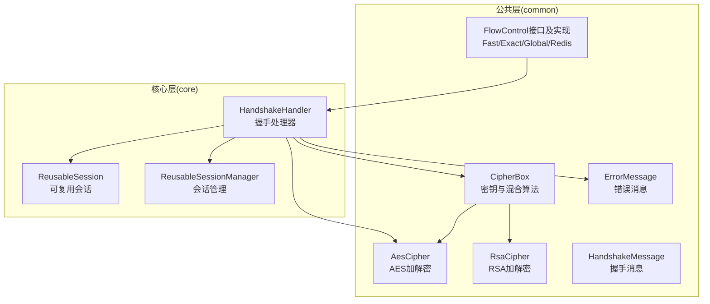
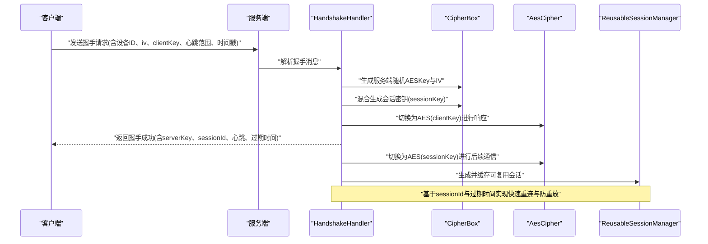
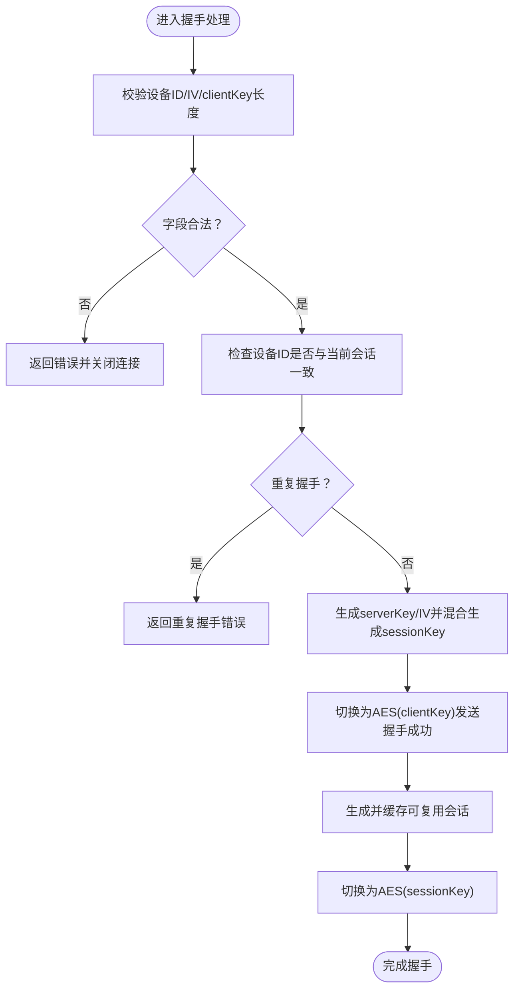
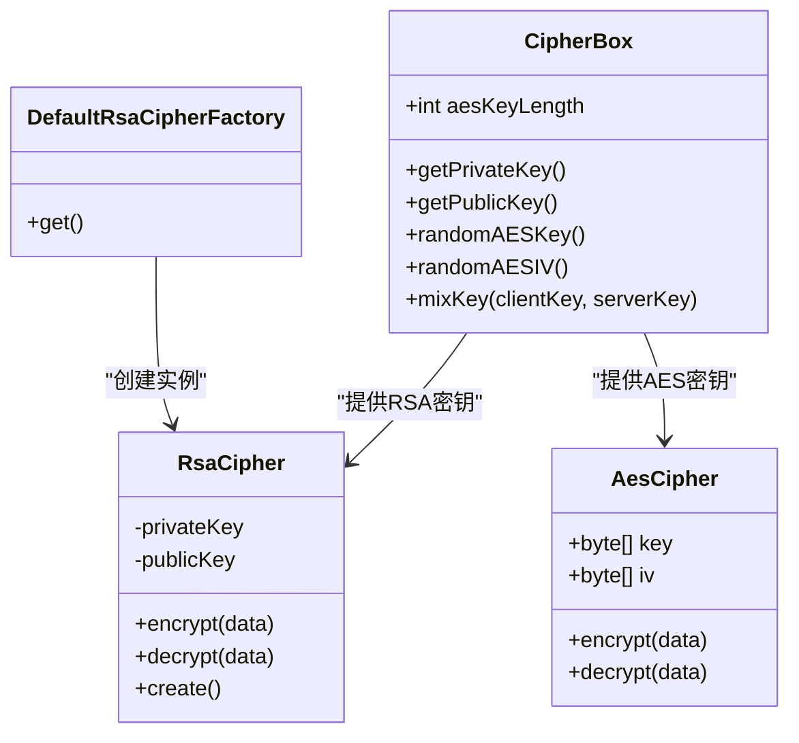
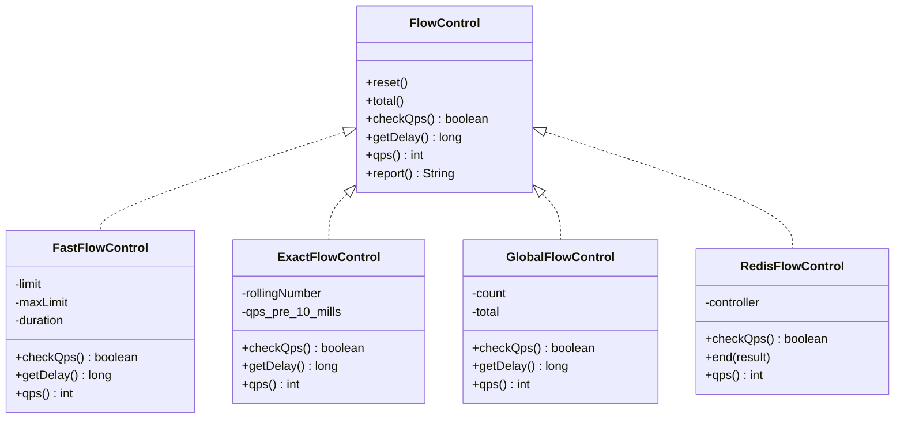
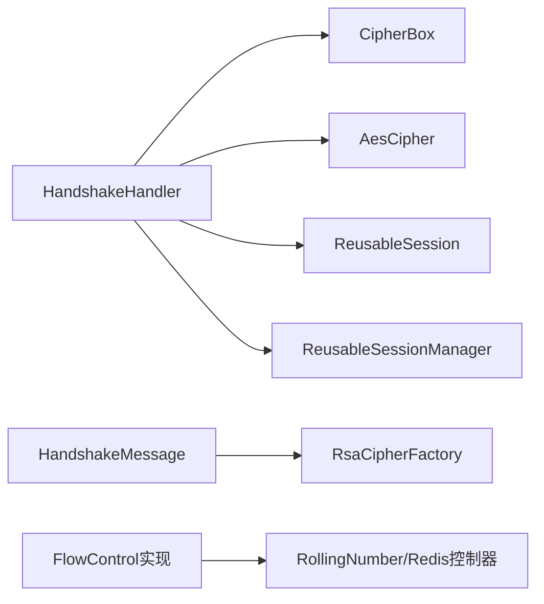

# 风险评估

<cite>
**本文引用的文件**
- [README.md](file://README.md)
- [CipherBox.java](file://mpush-common/src/main/java/com/mpush/common/security/CipherBox.java)
- [AesCipher.java](file://mpush-common/src/main/java/com/mpush/common/security/AesCipher.java)
- [RsaCipher.java](file://mpush-common/src/main/java/com/mpush/common/security/RsaCipher.java)
- [DefaultRsaCipherFactory.java](file://mpush-common/src/main/java/com/mpush/common/security/DefaultRsaCipherFactory.java)
- [HandshakeMessage.java](file://mpush-common/src/main/java/com/mpush/common/message/HandshakeMessage.java)
- [HandshakeHandler.java](file://mpush-core/src/main/java/com/mpush/core/handler/HandshakeHandler.java)
- [ReusableSession.java](file://mpush-core/src/main/java/com/mpush/core/session/ReusableSession.java)
- [ReusableSessionManager.java](file://mpush-core/src/main/java/com/mpush/core/session/ReusableSessionManager.java)
- [FlowControl.java](file://mpush-common/src/main/java/com/mpush/common/qps/FlowControl.java)
- [FastFlowControl.java](file://mpush-common/src/main/java/com/mpush/common/qps/FastFlowControl.java)
- [ExactFlowControl.java](file://mpush-common/src/main/java/com/mpush/common/qps/ExactFlowControl.java)
- [GlobalFlowControl.java](file://mpush-common/src/main/java/com/mpush/common/qps/GlobalFlowControl.java)
- [RedisFlowControl.java](file://mpush-common/src/main/java/com/mpush/common/qps/RedisFlowControl.java)
- [ErrorMessage.java](file://mpush-common/src/main/java/com/mpush/common/message/ErrorMessage.java)
</cite>

## 目录
1. [简介](#简介)
2. [项目结构](#项目结构)
3. [核心组件](#核心组件)
4. [架构总览](#架构总览)
5. [详细组件分析](#详细组件分析)
6. [依赖分析](#依赖分析)
7. [性能考虑](#性能考虑)
8. [故障排查指南](#故障排查指南)
9. [结论](#结论)
10. [附录](#附录)

## 简介
本文件面向MPush的风险评估与安全加固，聚焦以下目标：
- 安全漏洞扫描方法与工具使用：静态代码分析、动态安全测试、渗透测试
- 渗透测试实施流程：信息收集、漏洞探测、权限提升、后渗透测试，并给出MPush系统针对性测试方法
- 安全基线检查：系统配置、网络安全、应用安全的评估标准与检查方法
- 常见威胁防护：防重放、防注入、防暴力破解；结合代码实现说明检测与防护机制（CipherBox防重放、流量控制防暴力破解、异常行为检测）
- 实战建议：如何在MPush中配置与使用上述安全能力

## 项目结构
MPush采用多模块分层设计，安全相关能力主要分布在common与core模块：
- mpush-common：通用安全组件（CipherBox、AES/RSA加解密）、消息模型、QPS限流
- mpush-core：核心业务处理器（握手、推送、路由等），包含会话与安全上下文
- mpush-api：协议、消息、连接抽象，定义了安全接口与SPI扩展点

图表来源
- [CipherBox.java](file://mpush-common/src/main/java/com/mpush/common/security/CipherBox.java#L34-L92)
- [AesCipher.java](file://mpush-common/src/main/java/com/mpush/common/security/AesCipher.java#L36-L85)
- [RsaCipher.java](file://mpush-common/src/main/java/com/mpush/common/security/RsaCipher.java#L33-L60)
- [HandshakeMessage.java](file://mpush-common/src/main/java/com/mpush/common/message/HandshakeMessage.java#L38-L110)
- [HandshakeHandler.java](file://mpush-core/src/main/java/com/mpush/core/handler/HandshakeHandler.java#L47-L159)
- [ReusableSession.java](file://mpush-core/src/main/java/com/mpush/core/session/ReusableSession.java#L30-L61)
- [ReusableSessionManager.java](file://mpush-core/src/main/java/com/mpush/core/session/ReusableSessionManager.java#L35-L60)
- [FlowControl.java](file://mpush-common/src/main/java/com/mpush/common/qps/FlowControl.java#L27-L60)

章节来源
- [README.md](file://README.md#L103-L325)

## 核心组件
- 密钥与混合算法：CipherBox负责加载RSA密钥、生成随机AES密钥与IV、混合生成会话密钥
- 对称与非对称加解密：AesCipher与RsaCipher封装具体加解密逻辑
- 握手消息与处理器：HandshakeMessage定义握手报文字段，HandshakeHandler完成握手校验、会话建立、密钥切换与可复用会话生成
- 可复用会话：ReusableSession与ReusableSessionManager负责会话编码、缓存与查询，支撑快速重连与防重放
- 流量控制：FlowControl接口与Fast/Exact/Global/Redis实现提供QPS限制、总量限制与分布式广播场景的动态限流

章节来源
- [CipherBox.java](file://mpush-common/src/main/java/com/mpush/common/security/CipherBox.java#L34-L92)
- [AesCipher.java](file://mpush-common/src/main/java/com/mpush/common/security/AesCipher.java#L36-L85)
- [RsaCipher.java](file://mpush-common/src/main/java/com/mpush/common/security/RsaCipher.java#L33-L60)
- [HandshakeMessage.java](file://mpush-common/src/main/java/com/mpush/common/message/HandshakeMessage.java#L38-L110)
- [HandshakeHandler.java](file://mpush-core/src/main/java/com/mpush/core/handler/HandshakeHandler.java#L47-L159)
- [ReusableSession.java](file://mpush-core/src/main/java/com/mpush/core/session/ReusableSession.java#L30-L61)
- [ReusableSessionManager.java](file://mpush-core/src/main/java/com/mpush/core/session/ReusableSessionManager.java#L35-L60)
- [FlowControl.java](file://mpush-common/src/main/java/com/mpush/common/qps/FlowControl.java#L27-L60)

## 架构总览
MPush的安全架构围绕“握手阶段的密钥协商与会话建立”展开，结合“可复用会话与缓存”实现快速重连与防重放，同时通过“流量控制”抵御暴力破解与滥用。

图表来源
- [HandshakeHandler.java](file://mpush-core/src/main/java/com/mpush/core/handler/HandshakeHandler.java#L61-L128)
- [CipherBox.java](file://mpush-common/src/main/java/com/mpush/common/security/CipherBox.java#L65-L87)
- [AesCipher.java](file://mpush-common/src/main/java/com/mpush/common/security/AesCipher.java#L42-L58)
- [ReusableSessionManager.java](file://mpush-core/src/main/java/com/mpush/core/session/ReusableSessionManager.java#L52-L59)

## 详细组件分析

### 握手与防重放机制（CipherBox与可复用会话）
- 防重放策略
  - 设备ID一致性校验：若设备ID与当前会话一致，拒绝重复握手
  - 可复用会话：基于设备信息与密钥生成sessionId并缓存，配合过期时间实现快速重连与防重放
- 密钥协商
  - 服务端生成随机AESKey与IV，与客户端提供的clientKey混合生成会话密钥
  - 先用clientKey加密响应，再切换为sessionKey进行后续通信，降低中间态暴露风险

图表来源
- [HandshakeHandler.java](file://mpush-core/src/main/java/com/mpush/core/handler/HandshakeHandler.java#L69-L128)
- [CipherBox.java](file://mpush-common/src/main/java/com/mpush/common/security/CipherBox.java#L65-L87)
- [ReusableSessionManager.java](file://mpush-core/src/main/java/com/mpush/core/session/ReusableSessionManager.java#L52-L59)

章节来源
- [HandshakeHandler.java](file://mpush-core/src/main/java/com/mpush/core/handler/HandshakeHandler.java#L61-L159)
- [CipherBox.java](file://mpush-common/src/main/java/com/mpush/common/security/CipherBox.java#L34-L92)
- [ReusableSession.java](file://mpush-core/src/main/java/com/mpush/core/session/ReusableSession.java#L30-L61)
- [ReusableSessionManager.java](file://mpush-core/src/main/java/com/mpush/core/session/ReusableSessionManager.java#L35-L60)

### 加密组件与工厂（RSA/AES）
- RsaCipher：基于CipherBox加载的RSA私钥/公钥进行加解密
- AesCipher：基于随机生成的AES Key与IV进行加解密
- DefaultRsaCipherFactory：SPI工厂，提供RsaCipher实例

图表来源
- [CipherBox.java](file://mpush-common/src/main/java/com/mpush/common/security/CipherBox.java#L34-L92)
- [RsaCipher.java](file://mpush-common/src/main/java/com/mpush/common/security/RsaCipher.java#L33-L60)
- [AesCipher.java](file://mpush-common/src/main/java/com/mpush/common/security/AesCipher.java#L36-L85)
- [DefaultRsaCipherFactory.java](file://mpush-common/src/main/java/com/mpush/common/security/DefaultRsaCipherFactory.java#L31-L39)

章节来源
- [RsaCipher.java](file://mpush-common/src/main/java/com/mpush/common/security/RsaCipher.java#L33-L60)
- [AesCipher.java](file://mpush-common/src/main/java/com/mpush/common/security/AesCipher.java#L36-L85)
- [DefaultRsaCipherFactory.java](file://mpush-common/src/main/java/com/mpush/common/security/DefaultRsaCipherFactory.java#L31-L39)

### 流量控制与暴力破解防护
- 接口契约：FlowControl定义checkQps、getDelay、qps、report等方法
- 实现策略
  - FastFlowControl：固定窗口计数，适合低抖动场景
  - ExactFlowControl：滚动窗口，更平滑的QPS控制
  - GlobalFlowControl：全局原子计数，适合跨线程/跨实例场景
  - RedisFlowControl：基于广播控制器的分布式限流，支持动态调整与取消
- 防暴力破解思路
  - 在握手/登录/推送等高频路径引入限流
  - 使用RedisFlowControl实现跨节点统一配额
  - 结合ErrorMessage返回明确错误码与原因，便于前端与风控联动

图表来源
- [FlowControl.java](file://mpush-common/src/main/java/com/mpush/common/qps/FlowControl.java#L27-L60)
- [FastFlowControl.java](file://mpush-common/src/main/java/com/mpush/common/qps/FastFlowControl.java#L29-L92)
- [ExactFlowControl.java](file://mpush-common/src/main/java/com/mpush/common/qps/ExactFlowControl.java#L33-L91)
- [GlobalFlowControl.java](file://mpush-common/src/main/java/com/mpush/common/qps/GlobalFlowControl.java#L30-L91)
- [RedisFlowControl.java](file://mpush-common/src/main/java/com/mpush/common/qps/RedisFlowControl.java#L32-L121)

章节来源
- [FlowControl.java](file://mpush-common/src/main/java/com/mpush/common/qps/FlowControl.java#L27-L60)
- [FastFlowControl.java](file://mpush-common/src/main/java/com/mpush/common/qps/FastFlowControl.java#L29-L92)
- [ExactFlowControl.java](file://mpush-common/src/main/java/com/mpush/common/qps/ExactFlowControl.java#L33-L91)
- [GlobalFlowControl.java](file://mpush-common/src/main/java/com/mpush/common/qps/GlobalFlowControl.java#L30-L91)
- [RedisFlowControl.java](file://mpush-common/src/main/java/com/mpush/common/qps/RedisFlowControl.java#L32-L121)

### 错误处理与异常行为检测
- ErrorMessage：标准化错误响应，包含命令、错误码、原因与附加数据
- 异常行为检测建议
  - 在HandshakeHandler中对非法字段、重复握手等进行严格校验并返回错误
  - 结合日志与监控（参考配置）记录异常事件，辅助入侵检测与审计

章节来源
- [ErrorMessage.java](file://mpush-common/src/main/java/com/mpush/common/message/ErrorMessage.java#L38-L123)
- [HandshakeHandler.java](file://mpush-core/src/main/java/com/mpush/core/handler/HandshakeHandler.java#L75-L90)

## 依赖分析
- 握手链路依赖
  - HandshakeHandler依赖CipherBox（密钥与混合）、AesCipher（对称加解密）、ReusableSession/ReusableSessionManager（会话与缓存）
  - HandshakeMessage依赖RsaCipherFactory（RSA加解密）
- 流控链路依赖
  - 各FlowControl实现依赖RollingNumber、Redis广播控制器（RedisFlowControl）

图表来源
- [HandshakeHandler.java](file://mpush-core/src/main/java/com/mpush/core/handler/HandshakeHandler.java#L47-L159)
- [HandshakeMessage.java](file://mpush-common/src/main/java/com/mpush/common/message/HandshakeMessage.java#L91-L93)
- [FlowControl.java](file://mpush-common/src/main/java/com/mpush/common/qps/FlowControl.java#L27-L60)

章节来源
- [HandshakeHandler.java](file://mpush-core/src/main/java/com/mpush/core/handler/HandshakeHandler.java#L47-L159)
- [HandshakeMessage.java](file://mpush-common/src/main/java/com/mpush/common/message/HandshakeMessage.java#L91-L93)
- [FlowControl.java](file://mpush-common/src/main/java/com/mpush/common/qps/FlowControl.java#L27-L60)

## 性能考虑
- QPS控制粒度
  - FastFlowControl适合高吞吐、低抖动场景
  - ExactFlowControl提供更平滑的滚动窗口控制
  - GlobalFlowControl保证跨线程/跨实例一致性
  - RedisFlowControl适合广播场景的分布式限流
- 心跳与会话
  - 合理的心跳范围与过期时间平衡可用性与资源占用
- 日志与监控
  - 参考配置启用慢日志与性能监控，定位瓶颈与异常

## 故障排查指南
- 握手失败
  - 检查设备ID是否重复、字段长度是否正确
  - 查看错误响应与日志，确认是否触发重复握手或参数无效
- 密钥问题
  - 确认RSA私钥/公钥加载是否成功，密钥长度与格式是否符合预期
- 会话异常
  - 检查可复用会话是否正确生成与缓存，过期时间是否合理
- 流控告警
  - 观察各FlowControl的报告输出，定位超限原因（瞬时峰值/累计超限/Redis配额变化）

章节来源
- [HandshakeHandler.java](file://mpush-core/src/main/java/com/mpush/core/handler/HandshakeHandler.java#L75-L90)
- [ErrorMessage.java](file://mpush-common/src/main/java/com/mpush/common/message/ErrorMessage.java#L104-L112)
- [FlowControl.java](file://mpush-common/src/main/java/com/mpush/common/qps/FlowControl.java#L58-L59)

## 结论
MPush在握手阶段通过CipherBox与对称/非对称加密实现强健的密钥协商与会话建立，并以可复用会话与缓存实现快速重连与防重放。流量控制模块提供了多种限流策略，可有效缓解暴力破解与滥用风险。建议在生产环境结合日志与监控完善异常行为检测，并按需启用RedisFlowControl实现跨节点统一限流。

## 附录

### 安全漏洞扫描方法与工具使用
- 静态代码分析
  - 工具：SpotBugs、SonarQube、Checkmarx
  - 关注点：硬编码密钥、弱加密算法、SQL注入、命令注入、路径遍历、资源泄漏
- 动态安全测试
  - 工具：OWASP ZAP、Burp Suite、Nessus
  - 关注点：认证与会话、输入验证、敏感信息泄露、业务逻辑缺陷
- 渗透测试
  - 步骤：信息收集→漏洞探测→权限提升→后渗透测试
  - MPush针对性：重点测试握手流程、密钥协商、会话管理、广播推送、Redis/ZK访问控制

### 渗透测试实施流程（MPush针对性）
- 信息收集
  - 端口与服务：TCP 3000/3001/3002，WebSocket端口（如启用）
  - 配置与依赖：ZooKeeper、Redis、证书与密钥
- 漏洞探测
  - 握手阶段：构造非法字段、重复握手、时间戳异常
  - 加密链路：尝试篡改握手消息、伪造clientKey/iv
  - 广播与推送：构造超大包、高并发广播、Redis写入
- 权限提升与后渗透
  - 通过广播/推送通道横向移动，结合Redis/ZK进行持久化
  - 检查是否存在越权访问与未授权操作

### 安全基线检查
- 系统配置
  - 密钥与证书：RSA密钥长度、有效期、权限最小化
  - 心跳与会话：合理的心跳范围与过期时间
- 网络安全
  - 端口收敛、防火墙策略、内/外部端口分离
  - TLS/WS配置与证书校验
- 应用安全
  - 输入校验与过滤、最小权限原则、审计日志
  - Redis/ZK访问控制与鉴权

### 常见威胁防护与检测
- 防重放
  - 机制：可复用会话+过期时间+设备ID校验
  - 检测：异常重复握手、会话缺失或过期
- 防注入
  - 机制：严格的字段校验与白名单策略
  - 检测：异常字段长度、非法字符、协议解析异常
- 防暴力破解
  - 机制：QPS限流、RedisFlowControl、错误响应与日志
  - 检测：短时间高失败率、异常峰值、Redis配额耗尽

### 代码级实践要点
- 握手阶段
  - 参数校验与重复握手检测
  - 密钥混合与密文切换时机
- 会话管理
  - sessionId生成与缓存策略
  - 过期时间与清理机制
- 流量控制
  - 选择合适的FlowControl实现
  - 与广播控制器协同，动态调整配额

章节来源
- [HandshakeHandler.java](file://mpush-core/src/main/java/com/mpush/core/handler/HandshakeHandler.java#L61-L159)
- [ReusableSessionManager.java](file://mpush-core/src/main/java/com/mpush/core/session/ReusableSessionManager.java#L35-L60)
- [RedisFlowControl.java](file://mpush-common/src/main/java/com/mpush/common/qps/RedisFlowControl.java#L32-L121)
- [ErrorMessage.java](file://mpush-common/src/main/java/com/mpush/common/message/ErrorMessage.java#L79-L112)