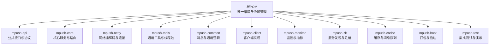
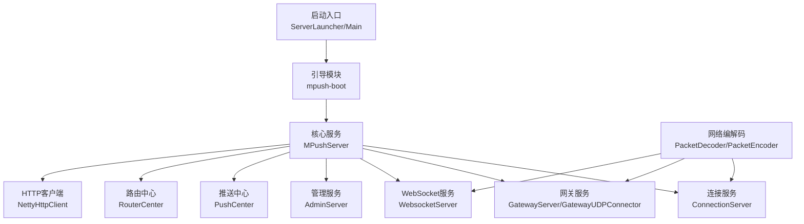
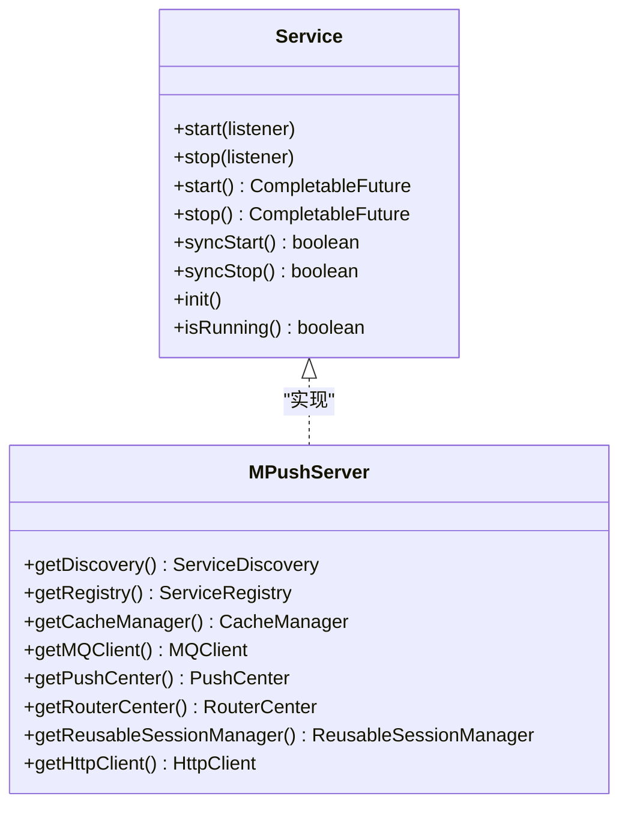
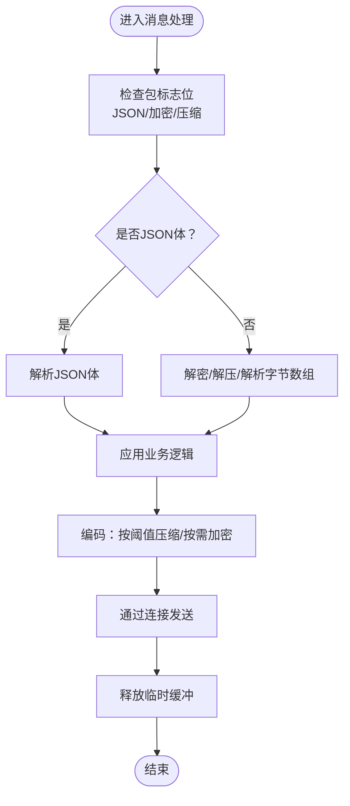
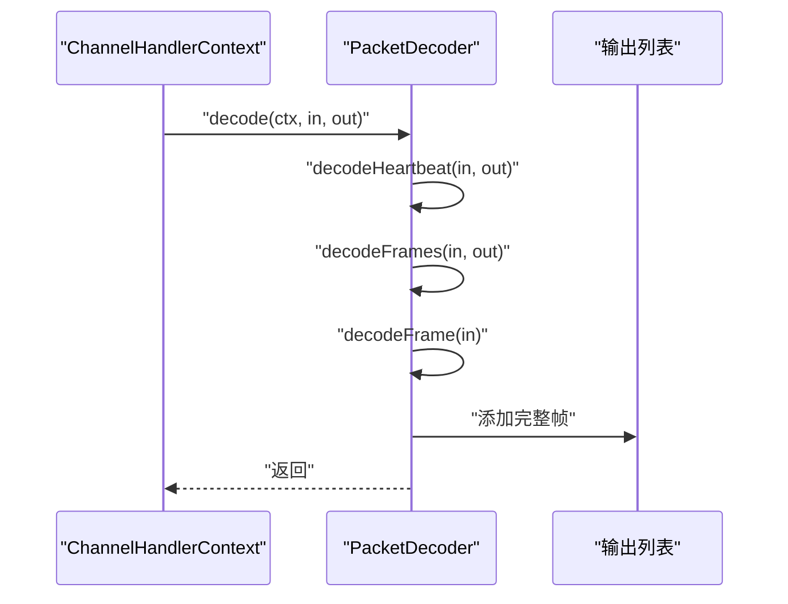
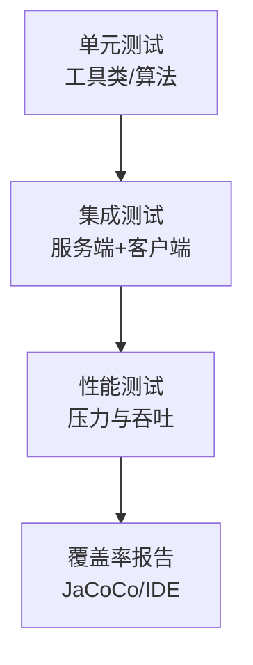
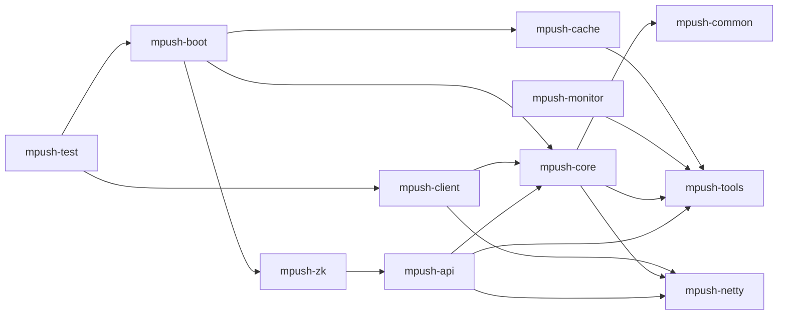

# 开发规范

<cite>
**本文引用的文件**
- [README.md](file://README.md)
- [pom.xml](file://pom.xml)
- [mpush-api/pom.xml](file://mpush-api/pom.xml)
- [mpush-boot/pom.xml](file://mpush-boot/pom.xml)
- [conf/reference.conf](file://conf/reference.conf)
- [mpush-core/src/main/java/com/mpush/core/MPushServer.java](file://mpush-core/src/main/java/com/mpush/core/MPushServer.java)
- [mpush-api/src/main/java/com/mpush/api/service/Service.java](file://mpush-api/src/main/java/com/mpush/api/service/Service.java)
- [mpush-tools/src/main/java/com/mpush/tools/common/Strings.java](file://mpush-tools/src/main/java/com/mpush/tools/common/Strings.java)
- [mpush-test/src/main/java/com/mpush/test/client/ConnClientTestMain.java](file://mpush-test/src/main/java/com/mpush/test/client/ConnClientTestMain.java)
- [mpush-test/src/main/resources/application.conf](file://mpush-test/src/main/resources/application.conf)
- [mpush-test/pom.xml](file://mpush-test/pom.xml)
- [mpush-common/src/main/java/com/mpush/common/message/BaseMessage.java](file://mpush-common/src/main/java/com/mpush/common/message/BaseMessage.java)
- [mpush-netty/src/main/java/com/mpush/netty/codec/PacketDecoder.java](file://mpush-netty/src/main/java/com/mpush/netty/codec/PacketDecoder.java)
- [bin/env-mp.sh](file://bin/env-mp.sh)
</cite>

## 目录
1. [简介](#简介)
2. [项目结构](#项目结构)
3. [核心组件](#核心组件)
4. [架构总览](#架构总览)
5. [详细组件分析](#详细组件分析)
6. [依赖分析](#依赖分析)
7. [性能考虑](#性能考虑)
8. [故障排查指南](#故障排查指南)
9. [结论](#结论)
10. [附录](#附录)

## 简介
本开发规范旨在为 MPush 项目提供统一、可执行的开发指导，覆盖代码风格与编码规范、注释规范、测试策略、代码审查流程、版本与分支管理、持续集成与持续部署（CI/CD）等方面。文档结合仓库现有实现与配置，给出可落地的实践建议与示例路径，确保团队协作一致性与代码质量。

## 项目结构
MPush 采用 Maven 多模块组织，核心模块包括 API、核心服务、网络层、工具集、客户端、监控、Zookeeper 集成、缓存与测试等。根 POM 统一管理 Java 版本、编码、依赖与插件；各子模块通过父 POM 引入统一依赖与构建配置。

图表来源
- [pom.xml](file://pom.xml#L54-L66)
- [mpush-api/pom.xml](file://mpush-api/pom.xml#L1-L35)
- [mpush-boot/pom.xml](file://mpush-boot/pom.xml#L1-L101)

章节来源
- [pom.xml](file://pom.xml#L54-L66)
- [README.md](file://README.md#L1-L328)

## 核心组件
- 服务生命周期与上下文：服务接口定义了统一的启动/停止与异步/同步能力，便于在不同模块中一致地管理服务状态。
- 核心服务器：核心服务器聚合多个子服务（连接、网关、管理、WebSocket、HTTP 客户端等），并通过 SPI 工厂创建缓存、消息队列、服务发现与注册等扩展。
- 通用消息抽象：消息基类封装了解码/编码流程、加解密、压缩、JSON 与二进制体处理，统一了消息处理的复杂度。
- 网络编解码：基于 Netty 的解码器负责心跳帧识别、帧完整性校验、最大包长限制与 JSON/UDP 包解析。

章节来源
- [mpush-api/src/main/java/com/mpush/api/service/Service.java](file://mpush-api/src/main/java/com/mpush/api/service/Service.java#L29-L47)
- [mpush-core/src/main/java/com/mpush/core/MPushServer.java](file://mpush-core/src/main/java/com/mpush/core/MPushServer.java#L48-L181)
- [mpush-common/src/main/java/com/mpush/common/message/BaseMessage.java](file://mpush-common/src/main/java/com/mpush/common/message/BaseMessage.java#L42-L246)
- [mpush-netty/src/main/java/com/mpush/netty/codec/PacketDecoder.java](file://mpush-netty/src/main/java/com/mpush/netty/codec/PacketDecoder.java#L44-L106)

## 架构总览
下图展示了从启动入口到核心服务、网络编解码与消息处理的整体交互。

图表来源
- [mpush-core/src/main/java/com/mpush/core/MPushServer.java](file://mpush-core/src/main/java/com/mpush/core/MPushServer.java#L71-L96)
- [mpush-netty/src/main/java/com/mpush/netty/codec/PacketDecoder.java](file://mpush-netty/src/main/java/com/mpush/netty/codec/PacketDecoder.java#L44-L106)

## 详细组件分析

### 服务生命周期与上下文
- 统一接口：服务接口定义了启动/停止与异步/同步方法，保证模块间行为一致。
- 上下文创建：核心服务器在构造阶段初始化监控、事件总线、会话管理、推送中心、路由中心以及网络组件，并通过工厂 SPI 创建缓存、消息队列、服务发现与注册实例。

图表来源
- [mpush-api/src/main/java/com/mpush/api/service/Service.java](file://mpush-api/src/main/java/com/mpush/api/service/Service.java#L29-L47)
- [mpush-core/src/main/java/com/mpush/core/MPushServer.java](file://mpush-core/src/main/java/com/mpush/core/MPushServer.java#L157-L180)

章节来源
- [mpush-api/src/main/java/com/mpush/api/service/Service.java](file://mpush-api/src/main/java/com/mpush/api/service/Service.java#L29-L47)
- [mpush-core/src/main/java/com/mpush/core/MPushServer.java](file://mpush-core/src/main/java/com/mpush/core/MPushServer.java#L71-L181)

### 通用消息处理
- 流程要点：消息在解码时支持加解密与压缩，编码时根据阈值自动压缩并可选加密；JSON 与二进制体分别走不同路径；提供原始编码发送接口以满足特殊场景。
- 性能与内存：解码完成后及时释放中间数组，避免内存泄漏；编码过程使用事件循环线程执行，保证线程模型一致性。

图表来源
- [mpush-common/src/main/java/com/mpush/common/message/BaseMessage.java](file://mpush-common/src/main/java/com/mpush/common/message/BaseMessage.java#L55-L134)

章节来源
- [mpush-common/src/main/java/com/mpush/common/message/BaseMessage.java](file://mpush-common/src/main/java/com/mpush/common/message/BaseMessage.java#L42-L246)

### 网络编解码与帧处理
- 心跳识别：连续读取字节，遇到心跳标记即输出心跳包，提升吞吐。
- 帧完整性：先读取长度字段，判断是否可组成完整帧；超过最大包长直接抛出异常。
- UDP/JSON 支持：提供 UDP 数据报与 JSON 字符串的解码入口，适配不同传输层。

图表来源
- [mpush-netty/src/main/java/com/mpush/netty/codec/PacketDecoder.java](file://mpush-netty/src/main/java/com/mpush/netty/codec/PacketDecoder.java#L47-L89)

章节来源
- [mpush-netty/src/main/java/com/mpush/netty/codec/PacketDecoder.java](file://mpush-netty/src/main/java/com/mpush/netty/codec/PacketDecoder.java#L44-L106)

### 测试策略与覆盖率
- 单元测试：工具类与核心算法（如字符串处理、加解密工具）应具备单元测试，覆盖边界条件与异常路径。
- 集成测试：通过测试模块启动服务端与客户端，验证握手、心跳、消息收发、推送链路等端到端流程。
- 配置驱动：测试环境通过配置文件覆盖默认参数，便于在不同网络与资源条件下验证系统行为。
- 自动化：根 POM 中 Surefire 插件默认跳过测试，建议在 CI 或本地开发时显式启用测试执行。

图表来源
- [mpush-test/src/main/java/com/mpush/test/client/ConnClientTestMain.java](file://mpush-test/src/main/java/com/mpush/test/client/ConnClientTestMain.java#L38-L117)
- [mpush-test/src/main/resources/application.conf](file://mpush-test/src/main/resources/application.conf#L1-L22)
- [pom.xml](file://pom.xml#L315-L319)

章节来源
- [mpush-test/src/main/java/com/mpush/test/client/ConnClientTestMain.java](file://mpush-test/src/main/java/com/mpush/test/client/ConnClientTestMain.java#L38-L117)
- [mpush-test/src/main/resources/application.conf](file://mpush-test/src/main/resources/application.conf#L1-L22)
- [pom.xml](file://pom.xml#L315-L319)

### 版本与分支管理
- 版本号：根 POM 定义项目版本，SCM 标签使用 v 前缀，便于发布与回溯。
- Git 工作流建议：
  - 功能开发：从 develop 切分支 feature/xxx，提交 PR 至 develop。
  - 发布准备：从 develop 切 release/x.y.z，修复问题后合并至 main 与 develop，并打标签。
  - 热修复：从 main 切 hotfix/xxx，修复后合并至 main 与 develop。
- 冲突解决：优先 rebase 保持线性历史；大变更采用小步提交与清晰的提交信息。

章节来源
- [pom.xml](file://pom.xml#L29-L34)

### 持续集成与持续部署
- 构建与打包：根 POM 提供多模块构建；启动模块支持打包为可执行包，包含装配插件与主类配置。
- CI/CD 建议：
  - 触发：main/develop/release/* 推送触发构建。
  - 步骤：编译 → 测试（可配置跳过策略）→ 打包 → 产物归档 → 可选部署。
  - 环境：通过环境变量与配置文件切换 dev/pub 等环境。
- 部署脚本：提供环境变量加载与类路径设置脚本，便于在生产环境启动与日志配置。

章节来源
- [mpush-boot/pom.xml](file://mpush-boot/pom.xml#L50-L98)
- [bin/env-mp.sh](file://bin/env-mp.sh#L18-L102)

## 依赖分析
- 语言与平台：Java 8，Netty 4.x，SLF4J/Logback，Jedis，Curator，Fastjson，Guava 等。
- 模块耦合：核心模块依赖网络、工具与通用模块；客户端模块依赖核心与网络模块；监控与缓存模块通过 SPI 与工厂模式解耦。

图表来源
- [pom.xml](file://pom.xml#L54-L66)
- [mpush-api/pom.xml](file://mpush-api/pom.xml#L21-L32)
- [mpush-boot/pom.xml](file://mpush-boot/pom.xml#L19-L32)

章节来源
- [pom.xml](file://pom.xml#L78-L284)

## 性能考虑
- 网络层：合理设置发送/接收缓冲区与写保护水位，避免背压导致丢包；根据场景选择 TCP/UDP/SCTP/UDT。
- 压缩与加密：根据阈值启用压缩，减少带宽占用；对敏感数据启用加密，平衡安全与 CPU 开销。
- 线程池：按模块划分工作线程池，避免交叉阻塞；事件总线与 MQ 线程池独立配置，防止热点影响。
- 监控：开启慢操作日志与堆栈转储，定期分析性能瓶颈。

## 故障排查指南
- 启动失败：检查环境变量与配置文件路径，确认日志目录可写；查看启动脚本的类路径拼接。
- 连接异常：核对网络配置（端口、绑定 IP、注册 IP）、防火墙与 DNS 映射；关注心跳与超时参数。
- 消息异常：确认包长限制、压缩阈值与加解密配置；检查消息体标志位与序列化格式。
- 测试验证：通过测试模块启动服务端与客户端，观察统计输出与日志，定位问题环节。

章节来源
- [bin/env-mp.sh](file://bin/env-mp.sh#L49-L102)
- [conf/reference.conf](file://conf/reference.conf#L45-L123)
- [mpush-netty/src/main/java/com/mpush/netty/codec/PacketDecoder.java](file://mpush-netty/src/main/java/com/mpush/netty/codec/PacketDecoder.java#L82-L88)

## 结论
本规范以项目现有实现与配置为基础，给出了统一的开发、测试、审查、版本与运维实践建议。建议团队在日常开发中严格遵循命名、注释、测试与审查标准，持续优化性能与稳定性，保障系统的可维护性与可扩展性。

## 附录

### 代码风格与编码规范（建议）
- 命名约定
  - 包名：全小写，按功能域分层（如 com.mpush.xxx）。
  - 类名：帕斯卡命名，抽象类与接口以 Abst/Interface/Factory 等后缀区分。
  - 方法/字段：驼峰命名；常量全大写+下划线；布尔方法以 is/has/can 前缀。
- 代码格式
  - 统一使用 UTF-8 编码与缩进；控制每行长度不超过 120；方法内空行分段，增强可读性。
  - switch/case 使用 default；if/else 对齐；try-catch 块尽量缩小作用域。
- 注释规范
  - 类注释：简述职责、关键依赖与生命周期。
  - 方法注释：说明输入/输出、异常、并发语义与性能特征。
  - 参数/返回值注释：明确类型、取值范围、约束与默认值。
  - 配置注释：在配置文件中保留必要注释，解释关键参数含义与取值范围。
- 异常处理
  - 明确区分受检/非受检异常；对外暴露语义清晰的异常类型；在边界处捕获并转换为领域异常。
- 日志与监控
  - 使用 SLF4J 抽象日志；按级别输出关键路径与错误堆栈；对慢操作与异常进行告警。

### 测试覆盖率与策略
- 覆盖率目标：核心模块（核心服务、网络编解码、消息处理）达到 80%+ 行覆盖率。
- 策略
  - 单元测试：重点覆盖算法、工具类与边界条件。
  - 集成测试：验证服务启动、握手、心跳、消息收发与推送链路。
  - 性能测试：评估 QPS、延迟分布与资源占用，结合配置文件调整参数。
- 工具与配置：使用 Surefire/JUnit 运行测试；在 CI 中生成覆盖率报告并设定阈值。

### 代码审查流程与标准
- 审查流程
  - 提交 PR 前：自测通过、注释完整、命名规范、无遗留 TODO。
  - 审查要点：设计一致性、异常处理、性能影响、安全风险、可测试性与可维护性。
  - 工具：利用 IDE 插件与静态分析工具（如 SpotBugs/Checkstyle）辅助。
  - 记录：在 PR 中记录变更动机、测试结果与风险评估。
- 审查标准
  - 必须项：新增/修改逻辑有测试覆盖；配置变更有文档说明；日志与异常信息清晰。
  - 推荐项：提供性能对比数据；对关键路径进行注释说明。

### 版本管理与分支管理最佳实践
- 版本号：语义化版本，SCM 标签使用 v 前缀。
- 分支策略：采用 Git Flow，功能/发布/热修复分支清晰分离。
- 冲突解决：优先 rebase 保持线性历史；大变更拆分为多次小提交，附清晰提交信息。

### 持续集成与持续部署（CI/CD）
- CI 流程：编译 → 测试 → 打包 → 归档 → 可选部署。
- 自动化测试：在 CI 中启用测试执行，失败即阻断。
- 自动化部署：通过装配插件生成可执行包，配合启动脚本与配置文件完成部署。