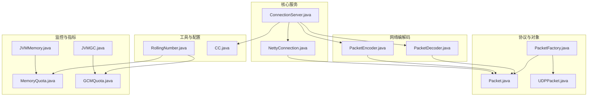
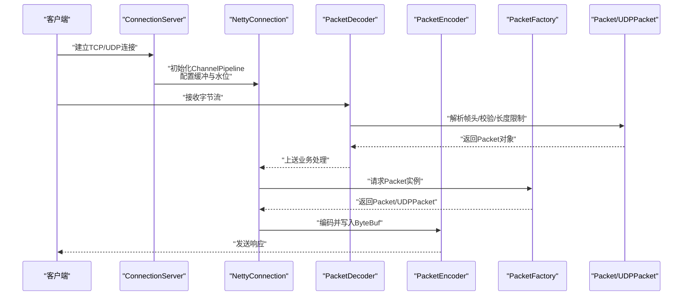
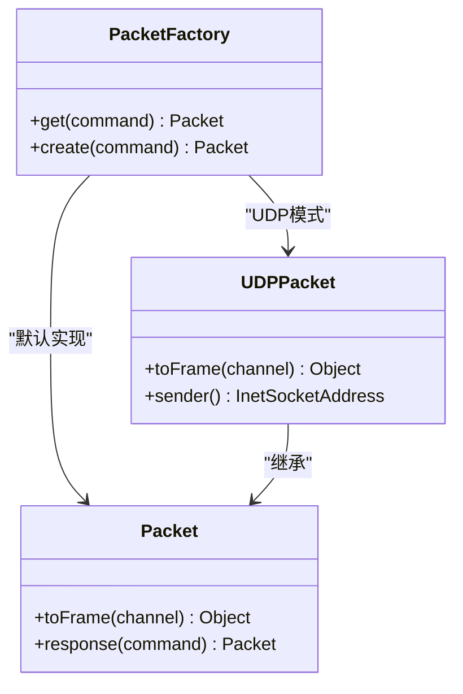
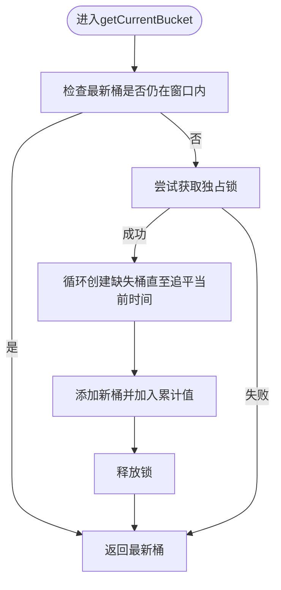
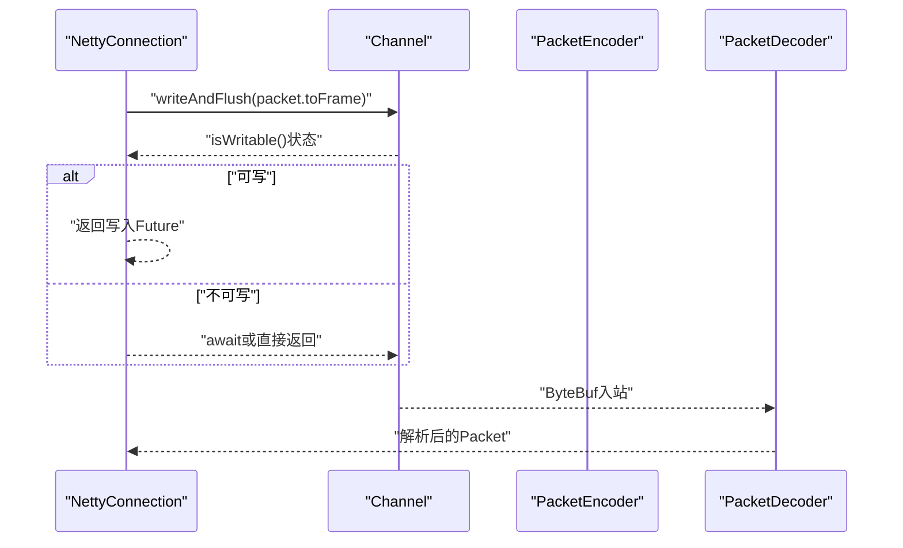
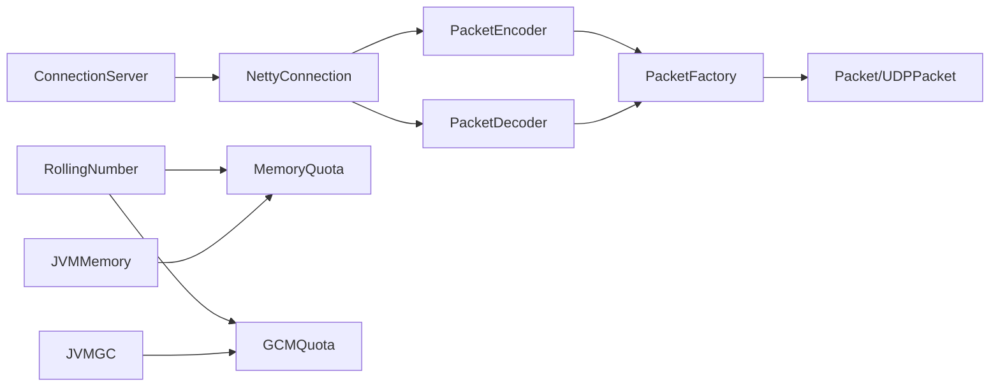

# 内存管理优化

<cite>
**本文引用的文件**   
- [PacketFactory.java](file://mpush-common/src/main/java/com/mpush/common/memory/PacketFactory.java)
- [Packet.java](file://mpush-api/src/main/java/com/mpush/api/protocol/Packet.java)
- [UDPPacket.java](file://mpush-api/src/main/java/com/mpush/api/protocol/UDPPacket.java)
- [PacketDecoder.java](file://mpush-netty/src/main/java/com/mpush/netty/codec/PacketDecoder.java)
- [PacketEncoder.java](file://mpush-netty/src/main/java/com/mpush/netty/codec/PacketEncoder.java)
- [ConnectionServer.java](file://mpush-core/src/main/java/com/mpush/core/server/ConnectionServer.java)
- [NettyConnection.java](file://mpush-netty/src/main/java/com/mpush/netty/connection/NettyConnection.java)
- [ReusableSession.java](file://mpush-core/src/main/java/com/mpush/core/session/ReusableSession.java)
- [ReusableSessionManager.java](file://mpush-core/src/main/java/com/mpush/core/session/ReusableSessionManager.java)
- [RollingNumber.java](file://mpush-tools/src/main/java/com/mpush/tools/common/RollingNumber.java)
- [JVMGC.java](file://mpush-monitor/src/main/java/com/mpush/monitor/quota/impl/JVMGC.java)
- [JVMMemory.java](file://mpush-monitor/src/main/java/com/mpush/monitor/quota/impl/JVMMemory.java)
- [MemoryQuota.java](file://mpush-monitor/src/main/java/com/mpush/monitor/quota/MemoryQuota.java)
- [GCMQuota.java](file://mpush-monitor/src/main/java/com/mpush/monitor/quota/GCMQuota.java)
- [CC.java](file://mpush-tools/src/main/java/com/mpush/tools/config/CC.java)
</cite>

## 目录
1. [引言](#引言)
2. [项目结构](#项目结构)
3. [核心组件](#核心组件)
4. [架构总览](#架构总览)
5. [详细组件分析](#详细组件分析)
6. [依赖分析](#依赖分析)
7. [性能考虑](#性能考虑)
8. [故障排查指南](#故障排查指南)
9. [结论](#结论)
10. [附录](#附录)

## 引言
本文件面向MPush的内存管理优化，聚焦以下目标：
- 对象池与数据包复用：通过PacketFactory与Packet/UDPPacket的构造路径，减少频繁分配与GC压力。
- 时间序列统计的高效实现：RollingNumber以桶数组+原子状态管理实现高并发写入与低锁争用。
- 网络层内存与缓冲区控制：Netty通道选项、水位线、缓冲区大小配置，避免ChannelOutboundBuffer无限增长。
- 垃圾回收优化：JMX指标采集、GC日志分析、停顿时间优化建议。
- 监控与诊断：堆内外存指标、GC指标采集与告警阈值设定。
- 大对象与碎片处理：结合缓冲区复用与零拷贝思路，降低大对象分配与复制成本。

## 项目结构
MPush采用多模块分层组织，内存优化涉及协议、网络编解码、核心服务、监控与工具等模块：
- 协议与对象：Packet/UDPPacket定义消息帧结构；PacketFactory按运行模式选择具体实现。
- 网络编解码：PacketDecoder/PacketEncoder负责帧解析与编码，配合Netty ByteBuf。
- 核心服务：ConnectionServer/NettyConnection负责连接生命周期与缓冲水位控制。
- 工具与监控：RollingNumber用于高并发计数与滑动窗口统计；JVMGC/JVMMemory提供GC与堆内存指标。
- 配置中心：CC集中管理网络缓冲、水位线、最大包体等关键内存相关参数。

**图示来源**
- [PacketFactory.java](file://mpush-common/src/main/java/com/mpush/common/memory/PacketFactory.java#L32-L40)
- [Packet.java](file://mpush-api/src/main/java/com/mpush/api/protocol/Packet.java#L86-L140)
- [UDPPacket.java](file://mpush-api/src/main/java/com/mpush/api/protocol/UDPPacket.java#L44-L82)
- [PacketDecoder.java](file://mpush-netty/src/main/java/com/mpush/netty/codec/PacketDecoder.java#L44-L107)
- [PacketEncoder.java](file://mpush-netty/src/main/java/com/mpush/netty/codec/PacketEncoder.java#L38-L47)
- [ConnectionServer.java](file://mpush-core/src/main/java/com/mpush/core/server/ConnectionServer.java#L139-L174)
- [NettyConnection.java](file://mpush-netty/src/main/java/com/mpush/netty/connection/NettyConnection.java#L38-L179)
- [RollingNumber.java](file://mpush-tools/src/main/java/com/mpush/tools/common/RollingNumber.java#L45-L71)
- [JVMGC.java](file://mpush-monitor/src/main/java/com/mpush/monitor/quota/impl/JVMGC.java#L35-L119)
- [JVMMemory.java](file://mpush-monitor/src/main/java/com/mpush/monitor/quota/impl/JVMMemory.java#L35-L265)
- [MemoryQuota.java](file://mpush-monitor/src/main/java/com/mpush/monitor/quota/MemoryQuota.java#L22-L78)
- [GCMQuota.java](file://mpush-monitor/src/main/java/com/mpush/monitor/quota/GCMQuota.java#L22-L40)
- [CC.java](file://mpush-tools/src/main/java/com/mpush/tools/config/CC.java#L135-L159)

**章节来源**
- [PacketFactory.java](file://mpush-common/src/main/java/com/mpush/common/memory/PacketFactory.java#L32-L40)
- [Packet.java](file://mpush-api/src/main/java/com/mpush/api/protocol/Packet.java#L86-L140)
- [UDPPacket.java](file://mpush-api/src/main/java/com/mpush/api/protocol/UDPPacket.java#L44-L82)
- [PacketDecoder.java](file://mpush-netty/src/main/java/com/mpush/netty/codec/PacketDecoder.java#L44-L107)
- [PacketEncoder.java](file://mpush-netty/src/main/java/com/mpush/netty/codec/PacketEncoder.java#L38-L47)
- [ConnectionServer.java](file://mpush-core/src/main/java/com/mpush/core/server/ConnectionServer.java#L139-L174)
- [NettyConnection.java](file://mpush-netty/src/main/java/com/mpush/netty/connection/NettyConnection.java#L38-L179)
- [RollingNumber.java](file://mpush-tools/src/main/java/com/mpush/tools/common/RollingNumber.java#L45-L71)
- [JVMGC.java](file://mpush-monitor/src/main/java/com/mpush/monitor/quota/impl/JVMGC.java#L35-L119)
- [JVMMemory.java](file://mpush-monitor/src/main/java/com/mpush/monitor/quota/impl/JVMMemory.java#L35-L265)
- [MemoryQuota.java](file://mpush-monitor/src/main/java/com/mpush/monitor/quota/MemoryQuota.java#L22-L78)
- [GCMQuota.java](file://mpush-monitor/src/main/java/com/mpush/monitor/quota/GCMQuota.java#L22-L40)
- [CC.java](file://mpush-tools/src/main/java/com/mpush/tools/config/CC.java#L135-L159)

## 核心组件
- 数据包工厂与复用
  - PacketFactory依据运行模式（如UDP网关）选择具体Packet实现，统一入口减少分支开销。
  - Packet/UDPPacket在toFrame阶段按需分配ByteBuf，避免重复构造与拷贝。
- 滑动时间序列RollingNumber
  - 使用桶数组与原子状态管理，写路径无锁或最小锁竞争，读路径遍历聚合。
  - LongAdder数组替代同步累加器，显著降低高并发写入的锁争用。
- 网络缓冲与水位控制
  - SO_SNDBUF/SO_RCVBUF与WRITE_BUFFER_WATER_MARK配置，防止ChannelOutboundBuffer无限增长导致内存飙升。
  - NettyConnection在发送失败时及时关闭连接并释放资源。
- 监控与指标
  - JVMGC/JVMMemory提供堆内外存、Old/Eden/Survivor等指标，支持GC次数/耗时统计与增量差分。

**章节来源**
- [PacketFactory.java](file://mpush-common/src/main/java/com/mpush/common/memory/PacketFactory.java#L32-L40)
- [Packet.java](file://mpush-api/src/main/java/com/mpush/api/protocol/Packet.java#L86-L140)
- [UDPPacket.java](file://mpush-api/src/main/java/com/mpush/api/protocol/UDPPacket.java#L44-L82)
- [RollingNumber.java](file://mpush-tools/src/main/java/com/mpush/tools/common/RollingNumber.java#L45-L71)
- [ConnectionServer.java](file://mpush-core/src/main/java/com/mpush/core/server/ConnectionServer.java#L139-L174)
- [NettyConnection.java](file://mpush-netty/src/main/java/com/mpush/netty/connection/NettyConnection.java#L72-L105)
- [JVMGC.java](file://mpush-monitor/src/main/java/com/mpush/monitor/quota/impl/JVMGC.java#L35-L119)
- [JVMMemory.java](file://mpush-monitor/src/main/java/com/mpush/monitor/quota/impl/JVMMemory.java#L35-L265)

## 架构总览
下图展示从网络接入到协议编解码、对象创建与内存分配的关键路径，以及监控指标采集。

**图示来源**
- [ConnectionServer.java](file://mpush-core/src/main/java/com/mpush/core/server/ConnectionServer.java#L139-L174)
- [NettyConnection.java](file://mpush-netty/src/main/java/com/mpush/netty/connection/NettyConnection.java#L72-L105)
- [PacketDecoder.java](file://mpush-netty/src/main/java/com/mpush/netty/codec/PacketDecoder.java#L44-L107)
- [PacketEncoder.java](file://mpush-netty/src/main/java/com/mpush/netty/codec/PacketEncoder.java#L38-L47)
- [PacketFactory.java](file://mpush-common/src/main/java/com/mpush/common/memory/PacketFactory.java#L32-L40)
- [Packet.java](file://mpush-api/src/main/java/com/mpush/api/protocol/Packet.java#L86-L140)
- [UDPPacket.java](file://mpush-api/src/main/java/com/mpush/api/protocol/UDPPacket.java#L44-L82)

## 详细组件分析

### 组件A：数据包对象复用与内存分配（PacketFactory、Packet、UDPPacket）
- 设计要点
  - 工厂接口统一入口，运行时根据配置选择Packet或UDPPacket实现，避免分支散落各处。
  - toFrame在编码阶段按需分配ByteBuf，UDP场景直接封装DatagramPacket，减少中间对象。
  - 编解码器对最大包体进行限制，防止异常帧导致内存暴涨。
- 内存优化点
  - 将频繁创建的对象下沉至工厂与协议层，减少上层重复构造。
  - 使用ByteBuf按需扩容与复用，避免大对象常驻老年代。
  - 通过心跳与短帧快速路径，降低无效对象创建。

**图示来源**
- [PacketFactory.java](file://mpush-common/src/main/java/com/mpush/common/memory/PacketFactory.java#L32-L40)
- [Packet.java](file://mpush-api/src/main/java/com/mpush/api/protocol/Packet.java#L86-L140)
- [UDPPacket.java](file://mpush-api/src/main/java/com/mpush/api/protocol/UDPPacket.java#L44-L82)

**章节来源**
- [PacketFactory.java](file://mpush-common/src/main/java/com/mpush/common/memory/PacketFactory.java#L32-L40)
- [Packet.java](file://mpush-api/src/main/java/com/mpush/api/protocol/Packet.java#L86-L140)
- [UDPPacket.java](file://mpush-api/src/main/java/com/mpush/api/protocol/UDPPacket.java#L44-L82)
- [PacketDecoder.java](file://mpush-netty/src/main/java/com/mpush/netty/codec/PacketDecoder.java#L44-L107)
- [PacketEncoder.java](file://mpush-netty/src/main/java/com/mpush/netty/codec/PacketEncoder.java#L38-L47)

### 组件B：滑动时间序列RollingNumber（高并发计数与内存使用）
- 设计要点
  - 桶数组+原子状态管理，写路径tryLock+CAS，读路径遍历聚合，写优先策略。
  - LongAdder数组替代同步累加器，降低高并发写入锁争用。
  - 桶窗口大小整除约束，确保滑动窗口一致性。
- 内存优化点
  - 固定容量桶数组，避免扩容与频繁GC。
  - 仅在必要时创建新桶，旧桶复用与原子替换，减少对象分配。
  - 通过增量差分统计（spanXXX）降低监控轮询的计算与内存占用。

**图示来源**
- [RollingNumber.java](file://mpush-tools/src/main/java/com/mpush/tools/common/RollingNumber.java#L224-L318)

**章节来源**
- [RollingNumber.java](file://mpush-tools/src/main/java/com/mpush/tools/common/RollingNumber.java#L45-L71)
- [RollingNumber.java](file://mpush-tools/src/main/java/com/mpush/tools/common/RollingNumber.java#L224-L318)
- [RollingNumber.java](file://mpush-tools/src/main/java/com/mpush/tools/common/RollingNumber.java#L434-L601)

### 组件C：网络缓冲与水位控制（ConnectionServer、NettyConnection）
- 设计要点
  - 通过SO_SNDBUF/SO_RCVBUF与WRITE_BUFFER_WATER_MARK配置，控制接收/发送缓冲与写队列水位。
  - NettyConnection在发送失败或不可写时主动关闭连接，避免堆积。
- 内存优化点
  - 合理设置水位线，防止ChannelOutboundBuffer无限增长导致内存溢出。
  - 结合心跳与超时检测，及时清理僵尸连接，释放底层资源。

**图示来源**
- [NettyConnection.java](file://mpush-netty/src/main/java/com/mpush/netty/connection/NettyConnection.java#L72-L105)
- [ConnectionServer.java](file://mpush-core/src/main/java/com/mpush/core/server/ConnectionServer.java#L139-L174)
- [PacketEncoder.java](file://mpush-netty/src/main/java/com/mpush/netty/codec/PacketEncoder.java#L38-L47)
- [PacketDecoder.java](file://mpush-netty/src/main/java/com/mpush/netty/codec/PacketDecoder.java#L44-L107)

**章节来源**
- [ConnectionServer.java](file://mpush-core/src/main/java/com/mpush/core/server/ConnectionServer.java#L139-L174)
- [NettyConnection.java](file://mpush-netty/src/main/java/com/mpush/netty/connection/NettyConnection.java#L72-L105)

### 组件D：会话复用与缓存（ReusableSession、ReusableSessionManager）
- 设计要点
  - ReusableSessionManager基于CacheManager进行会话缓存，带过期时间，避免重复构造。
  - 编解码采用紧凑字符串格式，减少序列化开销。
- 内存优化点
  - 通过缓存复用Session对象，降低频繁创建带来的GC压力。
  - 控制缓存过期时间，平衡内存占用与命中率。

**章节来源**
- [ReusableSession.java](file://mpush-core/src/main/java/com/mpush/core/session/ReusableSession.java#L30-L61)
- [ReusableSessionManager.java](file://mpush-core/src/main/java/com/mpush/core/session/ReusableSessionManager.java#L35-L60)

### 组件E：监控与GC指标（JVMGC、JVMMemory、MemoryQuota、GCMQuota）
- 设计要点
  - JVMGC通过GarbageCollectorMXBean采集Young/Full GC次数与耗时，并提供增量差分。
  - JVMMemory采集堆内存与各代内存池指标，支持堆/非堆分离监控。
  - MemoryQuota/GCMQuota定义统一指标接口，便于扩展与组合。
- 内存优化点
  - 通过指标阈值告警，提前发现GC压力与内存峰值。
  - 结合RollingNumber统计GC事件，辅助定位热点时段与原因。

**章节来源**
- [JVMGC.java](file://mpush-monitor/src/main/java/com/mpush/monitor/quota/impl/JVMGC.java#L35-L119)
- [JVMMemory.java](file://mpush-monitor/src/main/java/com/mpush/monitor/quota/impl/JVMMemory.java#L35-L265)
- [MemoryQuota.java](file://mpush-monitor/src/main/java/com/mpush/monitor/quota/MemoryQuota.java#L22-L78)
- [GCMQuota.java](file://mpush-monitor/src/main/java/com/mpush/monitor/quota/GCMQuota.java#L22-L40)

## 依赖分析
- 松耦合与高内聚
  - PacketFactory与Packet/UDPPacket通过接口解耦，运行时动态绑定，便于切换实现。
  - Netty编解码器与协议层分离，便于扩展不同帧格式。
- 关键依赖链
  - ConnectionServer -> NettyConnection -> PacketEncoder/Decoder -> PacketFactory -> Packet/UDPPacket
  - 监控链路：RollingNumber/JVMGC/JVMMemory -> 指标接口 -> 上报/告警

**图示来源**
- [ConnectionServer.java](file://mpush-core/src/main/java/com/mpush/core/server/ConnectionServer.java#L139-L174)
- [NettyConnection.java](file://mpush-netty/src/main/java/com/mpush/netty/connection/NettyConnection.java#L72-L105)
- [PacketEncoder.java](file://mpush-netty/src/main/java/com/mpush/netty/codec/PacketEncoder.java#L38-L47)
- [PacketDecoder.java](file://mpush-netty/src/main/java/com/mpush/netty/codec/PacketDecoder.java#L44-L107)
- [PacketFactory.java](file://mpush-common/src/main/java/com/mpush/common/memory/PacketFactory.java#L32-L40)
- [Packet.java](file://mpush-api/src/main/java/com/mpush/api/protocol/Packet.java#L86-L140)
- [UDPPacket.java](file://mpush-api/src/main/java/com/mpush/api/protocol/UDPPacket.java#L44-L82)
- [RollingNumber.java](file://mpush-tools/src/main/java/com/mpush/tools/common/RollingNumber.java#L45-L71)
- [JVMGC.java](file://mpush-monitor/src/main/java/com/mpush/monitor/quota/impl/JVMGC.java#L35-L119)
- [JVMMemory.java](file://mpush-monitor/src/main/java/com/mpush/monitor/quota/impl/JVMMemory.java#L35-L265)
- [MemoryQuota.java](file://mpush-monitor/src/main/java/com/mpush/monitor/quota/MemoryQuota.java#L22-L78)
- [GCMQuota.java](file://mpush-monitor/src/main/java/com/mpush/monitor/quota/GCMQuota.java#L22-L40)

**章节来源**
- [ConnectionServer.java](file://mpush-core/src/main/java/com/mpush/core/server/ConnectionServer.java#L139-L174)
- [NettyConnection.java](file://mpush-netty/src/main/java/com/mpush/netty/connection/NettyConnection.java#L72-L105)
- [PacketEncoder.java](file://mpush-netty/src/main/java/com/mpush/netty/codec/PacketEncoder.java#L38-L47)
- [PacketDecoder.java](file://mpush-netty/src/main/java/com/mpush/netty/codec/PacketDecoder.java#L44-L107)
- [PacketFactory.java](file://mpush-common/src/main/java/com/mpush/common/memory/PacketFactory.java#L32-L40)
- [Packet.java](file://mpush-api/src/main/java/com/mpush/api/protocol/Packet.java#L86-L140)
- [UDPPacket.java](file://mpush-api/src/main/java/com/mpush/api/protocol/UDPPacket.java#L44-L82)
- [RollingNumber.java](file://mpush-tools/src/main/java/com/mpush/tools/common/RollingNumber.java#L45-L71)
- [JVMGC.java](file://mpush-monitor/src/main/java/com/mpush/monitor/quota/impl/JVMGC.java#L35-L119)
- [JVMMemory.java](file://mpush-monitor/src/main/java/com/mpush/monitor/quota/impl/JVMMemory.java#L35-L265)
- [MemoryQuota.java](file://mpush-monitor/src/main/java/com/mpush/monitor/quota/MemoryQuota.java#L22-L78)
- [GCMQuota.java](file://mpush-monitor/src/main/java/com/mpush/monitor/quota/GCMQuota.java#L22-L40)

## 性能考虑
- 对象池与复用
  - 通过PacketFactory集中创建Packet/UDPPacket，减少分支与重复构造。
  - 编解码阶段按需分配ByteBuf，避免跨线程共享导致的额外拷贝。
- 并发写入优化
  - RollingNumber使用LongAdder与原子状态管理，写路径尽量无锁或最小锁。
  - 读路径聚合时遍历桶数组，复杂度与桶数量成正比，建议合理设置桶数与窗口。
- 缓冲区与水位
  - 合理设置SO_SNDBUF/SO_RCVBUF与WRITE_BUFFER_WATER_MARK，避免ChannelOutboundBuffer膨胀。
  - 结合isWritable判断与背压控制，防止写队列无界增长。
- GC与内存
  - 通过JVMMemory/JVMGC监控堆内外存与GC指标，结合RollingNumber统计GC事件，定位热点。
  - 建议开启GC日志与停顿分析，优化晋升与回收策略。

[本节为通用指导，无需列出具体文件来源]

## 故障排查指南
- 发送阻塞或内存上涨
  - 检查WRITE_BUFFER_WATER_MARK配置是否过低，导致频繁等待。
  - 观察NettyConnection的isWritable状态与await结果，确认是否存在慢消费者。
- 心跳异常或连接抖动
  - 核对PacketDecoder的最大包体限制，避免TooLongFrameException引发重连。
  - 检查Session过期与缓存失效策略，避免会话重建导致的抖动。
- GC频繁或停顿过长
  - 通过JVMGC采集Young/Full GC次数与耗时，结合JVMMemory查看Old/Eden/Survivor使用率。
  - 使用RollingNumber统计GC事件，定位高峰时段与触发条件。
- 监控指标异常
  - 确认MemoryQuota/GCMQuota接口实现与采集周期，避免误报或漏报。

**章节来源**
- [ConnectionServer.java](file://mpush-core/src/main/java/com/mpush/core/server/ConnectionServer.java#L139-L174)
- [NettyConnection.java](file://mpush-netty/src/main/java/com/mpush/netty/connection/NettyConnection.java#L72-L105)
- [PacketDecoder.java](file://mpush-netty/src/main/java/com/mpush/netty/codec/PacketDecoder.java#L44-L107)
- [JVMGC.java](file://mpush-monitor/src/main/java/com/mpush/monitor/quota/impl/JVMGC.java#L35-L119)
- [JVMMemory.java](file://mpush-monitor/src/main/java/com/mpush/monitor/quota/impl/JVMMemory.java#L35-L265)

## 结论
MPush在内存管理方面通过“对象复用+编解码优化+滑动窗口计数+缓冲水位控制+指标监控”形成闭环：
- 以PacketFactory与Packet/UDPPacket为核心，降低对象创建与拷贝成本。
- 以RollingNumber实现高并发写入与低锁争用，兼顾统计精度与性能。
- 以ConnectionServer/NettyConnection控制缓冲与水位，避免无界增长。
- 以JVMGC/JVMMemory提供可观测性，支撑持续优化与风险预警。

[本节为总结，无需列出具体文件来源]

## 附录
- 参数与配置参考
  - 网络缓冲与水位：snd_buf/rcv_buf/write-buffer-water-mark
  - 最大包体：max_packet_size
  - 会话过期：session_expired_time
- 监控指标清单
  - 堆内存：committed/init/max/used
  - 非堆内存：committed/init/max/used
  - 各代内存池：Old/Eden/Survivor
  - GC：Young/Full次数与耗时，以及增量差分

**章节来源**
- [CC.java](file://mpush-tools/src/main/java/com/mpush/tools/config/CC.java#L135-L159)
- [JVMMemory.java](file://mpush-monitor/src/main/java/com/mpush/monitor/quota/impl/JVMMemory.java#L35-L265)
- [JVMGC.java](file://mpush-monitor/src/main/java/com/mpush/monitor/quota/impl/JVMGC.java#L35-L119)
- [ReusableSessionManager.java](file://mpush-core/src/main/java/com/mpush/core/session/ReusableSessionManager.java#L35-L60)