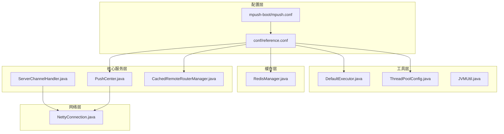
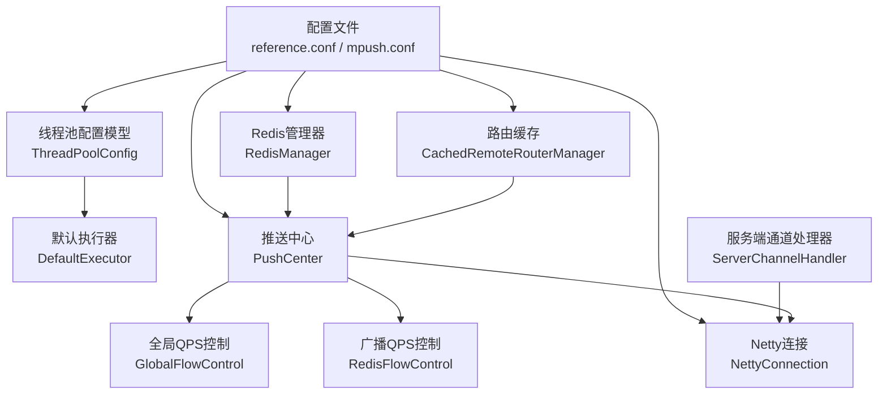
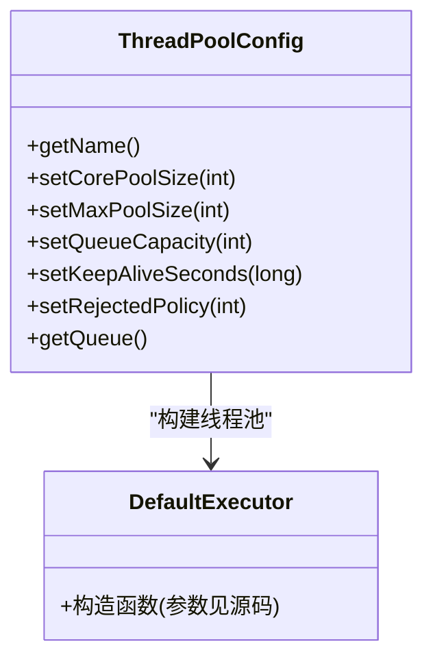
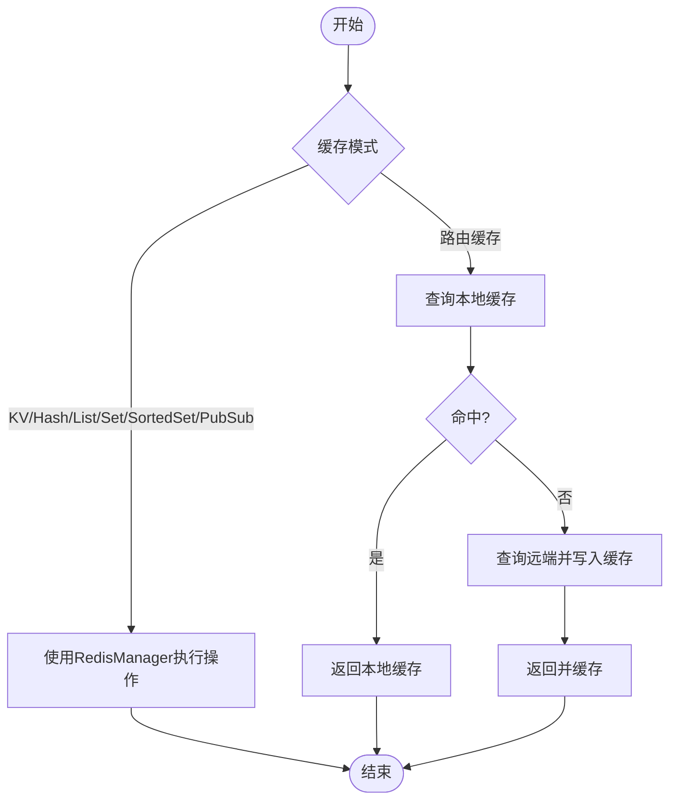
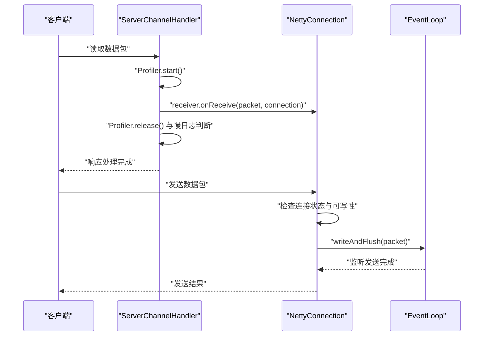
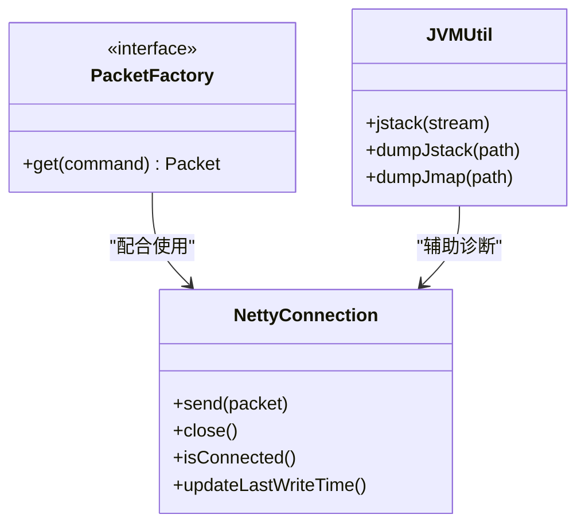
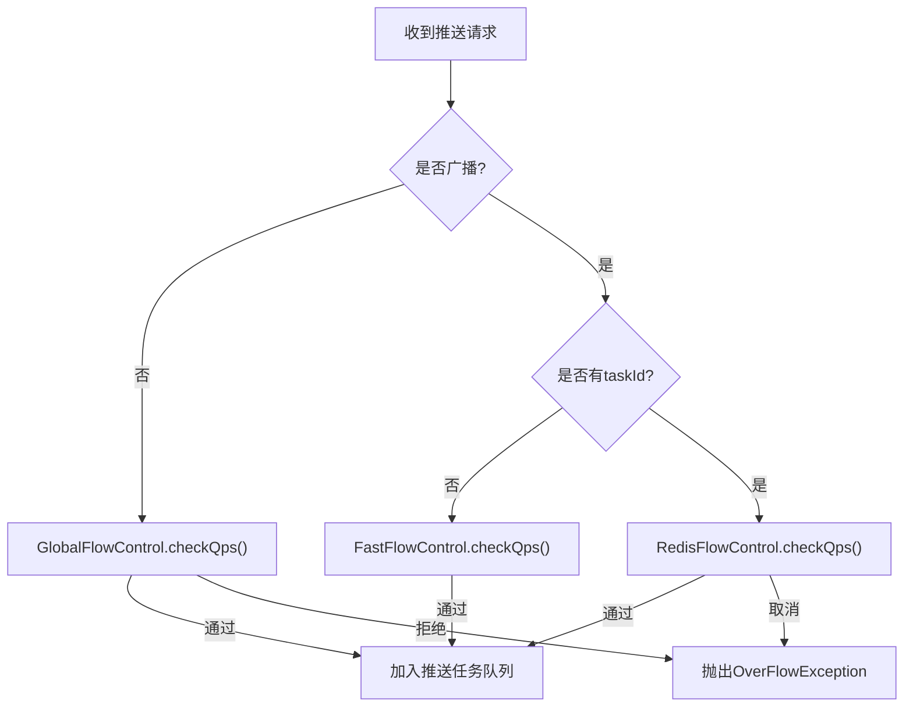
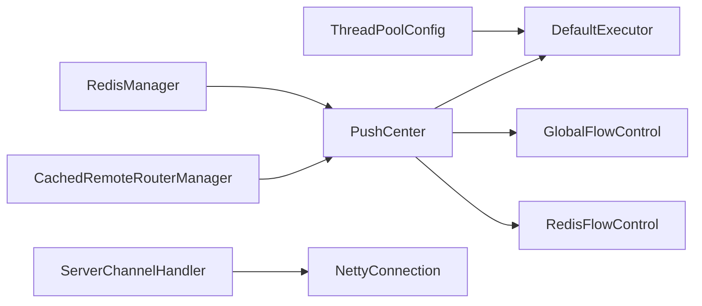

# 性能优化

<cite>
**本文引用的文件**
- [conf/reference.conf](file://conf/reference.conf)
- [mpush-boot/src/main/resources/mpush.conf](file://mpush-boot/src/main/resources/mpush.conf)
- [mpush-tools/src/main/java/com/MPush/tools/thread/pool/DefaultExecutor.java](file://mpush-tools/src/main/java/com/MPush/tools/thread/pool/DefaultExecutor.java)
- [mpush-tools/src/main/java/com/MPush/tools/thread/pool/ThreadPoolConfig.java](file://mpush-tools/src/main/java/com/MPush/tools/thread/pool/ThreadPoolConfig.java)
- [mpush-cache/src/main/java/com/MPush/cache/redis/manager/RedisManager.java](file://mpush-cache/src/main/java/com/MPush/cache/redis/manager/RedisManager.java)
- [mpush-common/src/main/java/com/MPush/common/qps/GlobalFlowControl.java](file://mpush-common/src/main/java/com/MPush/common/qps/GlobalFlowControl.java)
- [mpush-common/src/main/java/com/MPush/common/qps/RedisFlowControl.java](file://mpush-common/src/main/java/com/MPush/common/qps/RedisFlowControl.java)
- [mpush-core/src/main/java/com/MPush/core/server/ServerChannelHandler.java](file://mpush-core/src/main/java/com/MPush/core/server/ServerChannelHandler.java)
- [mpush-core/src/main/java/com/MPush/core/push/PushCenter.java](file://mpush-core/src/main/java/com/MPush/core/push/PushCenter.java)
- [mpush-common/src/main/java/com/MPush/common/router/CachedRemoteRouterManager.java](file://mpush-common/src/main/java/com/MPush/common/router/CachedRemoteRouterManager.java)
- [mpush-common/src/main/java/com/MPush/common/memory/PacketFactory.java](file://mpush-common/src/main/java/com/MPush/common/memory/PacketFactory.java)
- [mpush-netty/src/main/java/com/MPush/netty/connection/NettyConnection.java](file://mpush-netty/src/main/java/com/MPush/netty/connection/NettyConnection.java)
- [mpush-tools/src/main/java/com/MPush/tools/common/JVMUtil.java](file://mpush-tools/src/main/java/com/MPush/tools/common/JVMUtil.java)
</cite>

## 目录
1. [简介](#简介)
2. [项目结构](#项目结构)
3. [核心组件](#核心组件)
4. [架构总览](#架构总览)
5. [详细组件分析](#详细组件分析)
6. [依赖分析](#依赖分析)
7. [性能考量](#性能考量)
8. [故障排查指南](#故障排查指南)
9. [结论](#结论)
10. [附录](#附录)

## 简介
本文件面向MPush的性能优化，围绕线程池配置优化、缓存策略设计、网络优化、内存管理、流量控制与QPS限制等主题，结合配置文件与源码实现，给出可操作的优化策略、参数建议与效果评估方法。目标读者既包括需要快速落地优化的工程师，也包括希望理解系统性能机制的技术人员。

## 项目结构
MPush采用模块化组织，核心模块与性能相关的关键点分布如下：
- 配置层：通过HOCON配置文件集中管理线程池、网络、Redis、QPS等性能相关参数
- 工具层：线程池工厂与配置模型、JVM诊断工具
- 缓存层：Redis连接工厂与统一缓存管理器
- 核心服务层：连接通道处理器、推送中心、路由器缓存
- 网络层：Netty连接与发送路径
- 监控层：JMX与线程池监控

**图表来源**
- [conf/reference.conf](file://conf/reference.conf#L182-L205)
- [mpush-boot/src/main/resources/mpush.conf](file://mpush-boot/src/main/resources/mpush.conf#L1-L16)
- [mpush-tools/src/main/java/com/MPush/tools/thread/pool/DefaultExecutor.java](file://mpush-tools/src/main/java/com/MPush/tools/thread/pool/DefaultExecutor.java#L28-L38)
- [mpush-tools/src/main/java/com/MPush/tools/thread/pool/ThreadPoolConfig.java](file://mpush-tools/src/main/java/com/MPush/tools/thread/pool/ThreadPoolConfig.java#L26-L136)
- [mpush-cache/src/main/java/com/MPush/cache/redis/manager/RedisManager.java](file://mpush-cache/src/main/java/com/MPush/cache/redis/manager/RedisManager.java#L40-L57)
- [mpush-core/src/main/java/com/MPush/core/server/ServerChannelHandler.java](file://mpush-core/src/main/java/com/MPush/core/server/ServerChannelHandler.java#L46-L104)
- [mpush-core/src/main/java/com/MPush/core/push/PushCenter.java](file://mpush-core/src/main/java/com/MPush/core/push/PushCenter.java#L49-L109)
- [mpush-common/src/main/java/com/MPush/common/router/CachedRemoteRouterManager.java](file://mpush-common/src/main/java/com/MPush/common/router/CachedRemoteRouterManager.java#L33-L72)
- [mpush-netty/src/main/java/com/MPush/netty/connection/NettyConnection.java](file://mpush-netty/src/main/java/com/MPush/netty/connection/NettyConnection.java#L38-L179)
- [mpush-tools/src/main/java/com/MPush/tools/common/JVMUtil.java](file://mpush-tools/src/main/java/com/MPush/tools/common/JVMUtil.java#L40-L178)

**章节来源**
- [conf/reference.conf](file://conf/reference.conf#L182-L205)
- [mpush-boot/src/main/resources/mpush.conf](file://mpush-boot/src/main/resources/mpush.conf#L1-L16)

## 核心组件
- 线程池配置与执行器：通过配置文件定义各服务线程池规模，工具层提供线程池配置模型与默认执行器
- 缓存与Redis：统一的Redis管理器封装，支持KV、Hash、List、Set、Sorted Set与发布订阅
- 流量控制：全局QPS与广播QPS控制，支持Redis驱动的广播任务动态限速
- 网络与连接：Netty连接封装，带读写超时检测与写保护水位
- 路由缓存：远程路由查询结果缓存，降低跨节点查找成本
- 监控与诊断：JVM堆栈与堆转储工具，便于定位性能瓶颈

**章节来源**
- [mpush-tools/src/main/java/com/MPush/tools/thread/pool/ThreadPoolConfig.java](file://mpush-tools/src/main/java/com/MPush/tools/thread/pool/ThreadPoolConfig.java#L26-L136)
- [mpush-cache/src/main/java/com/MPush/cache/redis/manager/RedisManager.java](file://mpush-cache/src/main/java/com/MPush/cache/redis/manager/RedisManager.java#L40-L57)
- [mpush-common/src/main/java/com/MPush/common/qps/GlobalFlowControl.java](file://mpush-common/src/main/java/com/MPush/common/qps/GlobalFlowControl.java#L30-L92)
- [mpush-common/src/main/java/com/MPush/common/qps/RedisFlowControl.java](file://mpush-common/src/main/java/com/MPush/common/qps/RedisFlowControl.java#L32-L122)
- [mpush-netty/src/main/java/com/MPush/netty/connection/NettyConnection.java](file://mpush-netty/src/main/java/com/MPush/netty/connection/NettyConnection.java#L38-L179)
- [mpush-common/src/main/java/com/MPush/common/router/CachedRemoteRouterManager.java](file://mpush-common/src/main/java/com/MPush/common/router/CachedRemoteRouterManager.java#L33-L72)
- [mpush-tools/src/main/java/com/MPush/tools/common/JVMUtil.java](file://mpush-tools/src/main/java/com/MPush/tools/common/JVMUtil.java#L40-L178)

## 架构总览
下图展示了与性能优化密切相关的组件交互：配置驱动线程池与网络参数；服务层通过线程池调度任务；网络层负责IO；缓存层提供会话与路由信息；流量控制器保障吞吐稳定。

**图表来源**
- [conf/reference.conf](file://conf/reference.conf#L182-L205)
- [mpush-tools/src/main/java/com/MPush/tools/thread/pool/ThreadPoolConfig.java](file://mpush-tools/src/main/java/com/MPush/tools/thread/pool/ThreadPoolConfig.java#L26-L136)
- [mpush-tools/src/main/java/com/MPush/tools/thread/pool/DefaultExecutor.java](file://mpush-tools/src/main/java/com/MPush/tools/thread/pool/DefaultExecutor.java#L28-L38)
- [mpush-core/src/main/java/com/MPush/core/push/PushCenter.java](file://mpush-core/src/main/java/com/MPush/core/push/PushCenter.java#L49-L109)
- [mpush-core/src/main/java/com/MPush/core/server/ServerChannelHandler.java](file://mpush-core/src/main/java/com/MPush/core/server/ServerChannelHandler.java#L46-L104)
- [mpush-netty/src/main/java/com/MPush/netty/connection/NettyConnection.java](file://mpush-netty/src/main/java/com/MPush/netty/connection/NettyConnection.java#L38-L179)
- [mpush-cache/src/main/java/com/MPush/cache/redis/manager/RedisManager.java](file://mpush-cache/src/main/java/com/MPush/cache/redis/manager/RedisManager.java#L40-L57)
- [mpush-common/src/main/java/com/MPush/common/router/CachedRemoteRouterManager.java](file://mpush-common/src/main/java/com/MPush/common/router/CachedRemoteRouterManager.java#L33-L72)
- [mpush-common/src/main/java/com/MPush/common/qps/GlobalFlowControl.java](file://mpush-common/src/main/java/com/MPush/common/qps/GlobalFlowControl.java#L30-L92)
- [mpush-common/src/main/java/com/MPush/common/qps/RedisFlowControl.java](file://mpush-common/src/main/java/com/MPush/common/qps/RedisFlowControl.java#L32-L122)

## 详细组件分析

### 线程池配置优化策略
- 连接线程池（接入服务）：配置项为“接入服务线程池大小”，0表示按CPU核数动态调整（2倍CPU）。适用于高并发短连接场景，避免固定过大导致上下文切换开销。
- 网关线程池（Gateway）：同样支持0动态模式，适合处理大量小包与低延迟要求的场景。
- HTTP代理线程池：用于HTTP代理客户端，0表示动态调整。
- ACK定时器：独立线程池，处理ACK超时与重试。
- 推送任务线程池：0表示复用Gateway工作线程池（TCP模式推荐），UDP模式需自定义线程池。
- 网关客户端线程池：客户端侧线程池，0表示动态调整。
- 推送回调线程池：客户端侧回调处理线程池，大小可按业务回调压力调优。
- 事件总线与MQ线程池：分别用于内部事件分发与上下线消息等，队列容量可按峰值流量设置。

优化要点
- 动态线程数：当配置为0时，线程池大小按CPU核数×2计算，适合通用服务器环境；若业务存在长耗时任务，可考虑固定值或分层线程池。
- 队列容量：事件总线与MQ线程池的队列容量直接影响背压能力，建议根据峰值QPS与平均处理时延估算。
- 拒绝策略：ThreadPoolConfig支持多种拒绝策略，结合业务SLA选择Abort/Discard/CallerRuns。

**图表来源**
- [mpush-tools/src/main/java/com/MPush/tools/thread/pool/ThreadPoolConfig.java](file://mpush-tools/src/main/java/com/MPush/tools/thread/pool/ThreadPoolConfig.java#L26-L136)
- [mpush-tools/src/main/java/com/MPush/tools/thread/pool/DefaultExecutor.java](file://mpush-tools/src/main/java/com/MPush/tools/thread/pool/DefaultExecutor.java#L28-L38)

**章节来源**
- [conf/reference.conf](file://conf/reference.conf#L182-L205)
- [mpush-tools/src/main/java/com/MPush/tools/thread/pool/ThreadPoolConfig.java](file://mpush-tools/src/main/java/com/MPush/tools/thread/pool/ThreadPoolConfig.java#L26-L136)
- [mpush-tools/src/main/java/com/MPush/tools/thread/pool/DefaultExecutor.java](file://mpush-tools/src/main/java/com/MPush/tools/thread/pool/DefaultExecutor.java#L28-L38)

### 缓存策略设计原则
- Redis缓存配置：通过配置文件集中管理连接池参数（最大连接数、空闲、等待时间、驱逐策略等），支持单机、集群与哨兵模式，密码与节点列表可配置。
- 会话缓存管理：Netty连接维护会话上下文，结合心跳与超时检测，确保会话状态一致性。
- 路由信息缓存：远程路由查询结果按用户维度缓存，默认5分钟写入/访问过期，推送失败时可主动失效本地缓存，保证一致性。

**图表来源**
- [mpush-cache/src/main/java/com/MPush/cache/redis/manager/RedisManager.java](file://mpush-cache/src/main/java/com/MPush/cache/redis/manager/RedisManager.java#L40-L57)
- [mpush-common/src/main/java/com/MPush/common/router/CachedRemoteRouterManager.java](file://mpush-common/src/main/java/com/MPush/common/router/CachedRemoteRouterManager.java#L33-L72)

**章节来源**
- [conf/reference.conf](file://conf/reference.conf#L143-L169)
- [mpush-cache/src/main/java/com/MPush/cache/redis/manager/RedisManager.java](file://mpush-cache/src/main/java/com/MPush/cache/redis/manager/RedisManager.java#L40-L57)
- [mpush-common/src/main/java/com/MPush/common/router/CachedRemoteRouterManager.java](file://mpush-common/src/main/java/com/MPush/common/router/CachedRemoteRouterManager.java#L33-L72)

### 网络优化技术
- TCP/UDP参数调优：snd_buf/rcv_buf用于设置发送与接收缓冲区大小；write-buffer-water-mark设置写保护低水位与高水位，防止写入洪泛。
- 写保护水位：当写缓冲达到高水位时触发背压，避免内存暴涨；低水位用于恢复写入。
- 通道处理：ServerChannelHandler在读取数据时进行性能剖析，慢请求记录日志，便于定位热点路径。
- 连接发送：NettyConnection在发送前检查连接活跃性与可写性，必要时阻塞等待，确保可靠性。

**图表来源**
- [conf/reference.conf](file://conf/reference.conf#L76-L93)
- [mpush-core/src/main/java/com/MPush/core/server/ServerChannelHandler.java](file://mpush-core/src/main/java/com/MPush/core/server/ServerChannelHandler.java#L62-L80)
- [mpush-netty/src/main/java/com/MPush/netty/connection/NettyConnection.java](file://mpush-netty/src/main/java/com/MPush/netty/connection/NettyConnection.java#L73-L105)

**章节来源**
- [conf/reference.conf](file://conf/reference.conf#L76-L93)
- [mpush-core/src/main/java/com/MPush/core/server/ServerChannelHandler.java](file://mpush-core/src/main/java/com/MPush/core/server/ServerChannelHandler.java#L62-L80)
- [mpush-netty/src/main/java/com/MPush/netty/connection/NettyConnection.java](file://mpush-netty/src/main/java/com/MPush/netty/connection/NettyConnection.java#L73-L105)

### 内存管理最佳实践
- 对象池与Packet复用：PacketFactory根据是否UDP网关选择不同Packet实现，减少频繁分配与GC压力。
- JVM诊断：JVMUtil提供线程栈与堆转储能力，便于定位内存泄漏与热点线程。
- 连接生命周期：NettyConnection在发送完成后更新最后写入时间，异常时记录错误，有助于及时释放资源。

**图表来源**
- [mpush-common/src/main/java/com/MPush/common/memory/PacketFactory.java](file://mpush-common/src/main/java/com/MPush/common/memory/PacketFactory.java#L32-L40)
- [mpush-netty/src/main/java/com/MPush/netty/connection/NettyConnection.java](file://mpush-netty/src/main/java/com/MPush/netty/connection/NettyConnection.java#L38-L179)
- [mpush-tools/src/main/java/com/MPush/tools/common/JVMUtil.java](file://mpush-tools/src/main/java/com/MPush/tools/common/JVMUtil.java#L40-L178)

**章节来源**
- [mpush-common/src/main/java/com/MPush/common/memory/PacketFactory.java](file://mpush-common/src/main/java/com/MPush/common/memory/PacketFactory.java#L32-L40)
- [mpush-netty/src/main/java/com/MPush/netty/connection/NettyConnection.java](file://mpush-netty/src/main/java/com/MPush/netty/connection/NettyConnection.java#L38-L179)
- [mpush-tools/src/main/java/com/MPush/tools/common/JVMUtil.java](file://mpush-tools/src/main/java/com/MPush/tools/common/JVMUtil.java#L40-L178)

### 流量控制与QPS限制
- 全局流控：针对非广播推送，使用GlobalFlowControl按周期统计QPS，超过阈值拒绝或限流。
- 广播流控：针对广播任务，使用FastFlowControl或RedisFlowControl，后者支持任务级动态QPS与取消。
- 配置参数：全局与广播的limit、max、duration均可在配置文件中调整，满足不同业务场景。

**图表来源**
- [mpush-core/src/main/java/com/MPush/core/push/PushCenter.java](file://mpush-core/src/main/java/com/MPush/core/push/PushCenter.java#L72-L82)
- [mpush-common/src/main/java/com/MPush/common/qps/GlobalFlowControl.java](file://mpush-common/src/main/java/com/MPush/common/qps/GlobalFlowControl.java#L30-L92)
- [mpush-common/src/main/java/com/MPush/common/qps/RedisFlowControl.java](file://mpush-common/src/main/java/com/MPush/common/qps/RedisFlowControl.java#L32-L122)

**章节来源**
- [conf/reference.conf](file://conf/reference.conf#L207-L222)
- [mpush-core/src/main/java/com/MPush/core/push/PushCenter.java](file://mpush-core/src/main/java/com/MPush/core/push/PushCenter.java#L72-L82)
- [mpush-common/src/main/java/com/MPush/common/qps/GlobalFlowControl.java](file://mpush-common/src/main/java/com/MPush/common/qps/GlobalFlowControl.java#L30-L92)
- [mpush-common/src/main/java/com/MPush/common/qps/RedisFlowControl.java](file://mpush-common/src/main/java/com/MPush/common/qps/RedisFlowControl.java#L32-L122)

## 依赖分析
- 线程池：ThreadPoolConfig与DefaultExecutor共同构成线程池基础设施，被各类服务复用
- 缓存：RedisManager封装Redis操作，为会话与路由提供持久化与共享能力
- 推送：PushCenter根据协议与配置选择合适的执行器（EventLoop或自定义线程池）
- 网络：ServerChannelHandler与NettyConnection构成IO处理链路
- 流控：GlobalFlowControl与RedisFlowControl作为策略组件注入PushCenter

**图表来源**
- [mpush-tools/src/main/java/com/MPush/tools/thread/pool/ThreadPoolConfig.java](file://mpush-tools/src/main/java/com/MPush/tools/thread/pool/ThreadPoolConfig.java#L26-L136)
- [mpush-tools/src/main/java/com/MPush/tools/thread/pool/DefaultExecutor.java](file://mpush-tools/src/main/java/com/MPush/tools/thread/pool/DefaultExecutor.java#L28-L38)
- [mpush-core/src/main/java/com/MPush/core/push/PushCenter.java](file://mpush-core/src/main/java/com/MPush/core/push/PushCenter.java#L49-L109)
- [mpush-common/src/main/java/com/MPush/common/qps/GlobalFlowControl.java](file://mpush-common/src/main/java/com/MPush/common/qps/GlobalFlowControl.java#L30-L92)
- [mpush-common/src/main/java/com/MPush/common/qps/RedisFlowControl.java](file://mpush-common/src/main/java/com/MPush/common/qps/RedisFlowControl.java#L32-L122)
- [mpush-core/src/main/java/com/MPush/core/server/ServerChannelHandler.java](file://mpush-core/src/main/java/com/MPush/core/server/ServerChannelHandler.java#L46-L104)
- [mpush-netty/src/main/java/com/MPush/netty/connection/NettyConnection.java](file://mpush-netty/src/main/java/com/MPush/netty/connection/NettyConnection.java#L38-L179)
- [mpush-cache/src/main/java/com/MPush/cache/redis/manager/RedisManager.java](file://mpush-cache/src/main/java/com/MPush/cache/redis/manager/RedisManager.java#L40-L57)
- [mpush-common/src/main/java/com/MPush/common/router/CachedRemoteRouterManager.java](file://mpush-common/src/main/java/com/MPush/common/router/CachedRemoteRouterManager.java#L33-L72)

**章节来源**
- [mpush-tools/src/main/java/com/MPush/tools/thread/pool/ThreadPoolConfig.java](file://mpush-tools/src/main/java/com/MPush/tools/thread/pool/ThreadPoolConfig.java#L26-L136)
- [mpush-core/src/main/java/com/MPush/core/push/PushCenter.java](file://mpush-core/src/main/java/com/MPush/core/push/PushCenter.java#L49-L109)

## 性能考量
- 线程池规模：优先使用动态模式（配置为0），结合CPU核数与业务特征微调；对长耗时任务建议拆分线程池，避免相互影响
- 缓存命中率：合理设置路由缓存过期时间，结合业务失败率定期评估；Redis连接池参数需与QPS匹配
- 网络缓冲与水位：根据消息大小与带宽设置snd_buf/rcv_buf，写保护水位需兼顾延迟与内存占用
- GC与对象分配：启用Packet复用与合理的对象池策略，减少临时对象创建
- 流控策略：全局与广播流控参数需结合下游承载能力与SLA设定，避免过度限流导致积压

## 故障排查指南
- 慢请求定位：通过ServerChannelHandler的Profiler输出，识别耗时环节
- JVM问题诊断：使用JVMUtil导出线程栈与堆快照，定位热点线程与内存占用
- 连接异常：NettyConnection在发送失败时记录错误，检查网络与写保护水位设置
- 流控异常：关注OverFlowException，检查全局与广播流控配置与任务级动态QPS

**章节来源**
- [mpush-core/src/main/java/com/MPush/core/server/ServerChannelHandler.java](file://mpush-core/src/main/java/com/MPush/core/server/ServerChannelHandler.java#L62-L80)
- [mpush-tools/src/main/java/com/MPush/tools/common/JVMUtil.java](file://mpush-tools/src/main/java/com/MPush/tools/common/JVMUtil.java#L40-L178)
- [mpush-netty/src/main/java/com/MPush/netty/connection/NettyConnection.java](file://mpush-netty/src/main/java/com/MPush/netty/connection/NettyConnection.java#L135-L142)
- [mpush-common/src/main/java/com/MPush/common/qps/RedisFlowControl.java](file://mpush-common/src/main/java/com/MPush/common/qps/RedisFlowControl.java#L72-L87)

## 结论
通过合理配置线程池、优化网络参数、强化缓存与内存管理、实施精细化流量控制，MPush可以在高并发场景下保持稳定与高效。建议以配置文件为依据，结合监控与诊断工具持续迭代优化参数，形成“配置—执行—观测—反馈”的闭环。

## 附录
- 配置参考路径
  - [conf/reference.conf](file://conf/reference.conf#L182-L205)
  - [mpush-boot/src/main/resources/mpush.conf](file://mpush-boot/src/main/resources/mpush.conf#L1-L16)
- 关键实现参考路径
  - [mpush-tools/thread/pool/ThreadPoolConfig.java](file://mpush-tools/src/main/java/com/MPush/tools/thread/pool/ThreadPoolConfig.java#L26-L136)
  - [mpush-cache/redis/manager/RedisManager.java](file://mpush-cache/src/main/java/com/MPush/cache/redis/manager/RedisManager.java#L40-L57)
  - [mpush-core/push/PushCenter.java](file://mpush-core/src/main/java/com/MPush/core/push/PushCenter.java#L49-L109)
  - [mpush-common/router/CachedRemoteRouterManager.java](file://mpush-common/src/main/java/com/MPush/common/router/CachedRemoteRouterManager.java#L33-L72)
  - [mpush-netty/connection/NettyConnection.java](file://mpush-netty/src/main/java/com/MPush/netty/connection/NettyConnection.java#L38-L179)
  - [mpush-common/qps/GlobalFlowControl.java](file://mpush-common/src/main/java/com/MPush/common/qps/GlobalFlowControl.java#L30-L92)
  - [mpush-common/qps/RedisFlowControl.java](file://mpush-common/src/main/java/com/MPush/common/qps/RedisFlowControl.java#L32-L122)
  - [mpush-common/memory/PacketFactory.java](file://mpush-common/src/main/java/com/MPush/common/memory/PacketFactory.java#L32-L40)
  - [mpush-tools/common/JVMUtil.java](file://mpush-tools/src/main/java/com/MPush/tools/common/JVMUtil.java#L40-L178)